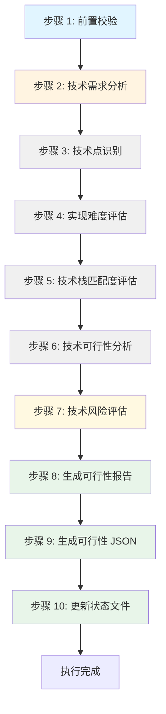
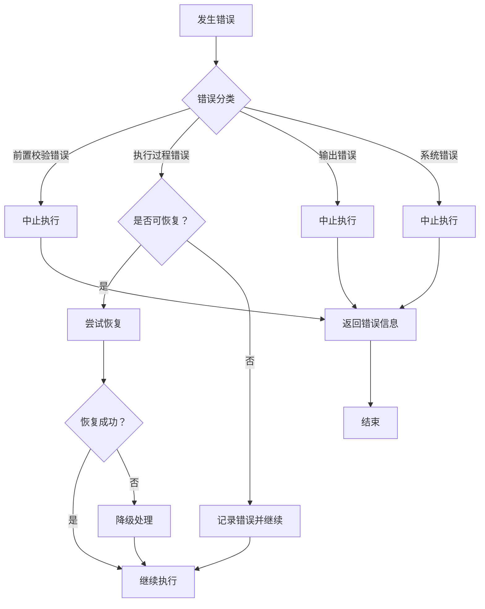

# Skill11: 技术可行性评估

## 一、元信息

| 项目 | 内容 |
|-----|------|
| **Skill 编号** | S3-S11 |
| **Skill 名称** | 技术可行性评估 |
| **英文名称** | Technical Feasibility Assessment |
| **所属阶段** | S3 - 技术可行性与选型阶段 |
| **执行顺序** | S3 阶段第 2 个执行（并行于 Skill7） |
| **执行模式** | 常规模式执行，轻量化模式可选执行 |
| **执行 Agent** | Executor Agent |
| **版本号** | 2.0（标准化版本） |
| **最后更新** | 2026-03-24 |
| **质量等级** | 生产级（Production-Ready） |

### 依赖关系

| 依赖类型 | 依赖对象 | 依赖内容 | 必要性 |
|---------|---------|---------|--------|
| **前置 Skill** | Skill10-市场痛点验证 | 市场痛点验证报告、市场价值校验清单 | 必需 |
| **前置 Skill** | Skill7-需求风险识别 | 需求风险识别报告、需求风险清单 | 可选（并行执行时可省略） |
| **后置 Skill** | Skill12-轻量化技术选型 | 技术选型方案 | 依赖本 Skill 输出 |
| **后置 Skill** | Skill6-需求优先级排序 | 需求优先级排序结果 | 参考本 Skill 技术难度评估 |

### 输入规范

| 输入类型 | 文件格式 | 文件路径 | 说明 |
|---------|---------|---------|------|
| Plan 定义文件 | `plan.json` | `database/plans/{PlanID}/plan.json` | Plan 基本信息、项目目标、约束条件 |
| 市场痛点验证报告 | Markdown | `database/stages/s2/{PlanID}/{PlanID}-S2-S10-001-validation.md` | Skill10 产物，包含市场痛点验证详情 |
| 市场痛点验证 JSON | JSON | `database/stages/s2/{PlanID}/{PlanID}-S2-S10-001-validation.json` | Skill10 结构化数据 |
| 需求风险识别报告 | Markdown | `database/stages/s3/{PlanID}/{PlanID}-S3-S07-001-risk.md` | Skill7 产物（可选），包含风险识别详情 |
| 需求风险清单 JSON | JSON | `database/stages/s3/{PlanID}/{PlanID}-S3-S07-001-risk.json` | Skill7 结构化数据（可选） |

### 输出规范

| 输出类型 | 文件格式 | 文件路径 | 产物 ID | 说明 |
|---------|---------|---------|--------|------|
| 技术可行性评估报告 | Markdown | `database/stages/s3/{PlanID}/{PlanID}-S3-S11-001-feasibility.md` | `{PlanID}-S3-S11-001-FEAS` | 详细的技术可行性评估报告 |
| 技术可行性评估 JSON | JSON | `database/stages/s3/{PlanID}/{PlanID}-S3-S11-001-feasibility.json` | `{PlanID}-S3-S11-001-DATA` | 结构化技术评估数据 |
| 状态更新 | JSON | `database/plans/{PlanID}/status.json` | - | 更新 S3 阶段执行状态 |

### 产物 ID 命名规则

**格式**：`{PlanID}-S3-S11-001-{类型}`

**示例**：
- `P000001-S3-S11-001-FEAS` - 技术可行性评估报告
- `P000001-S3-S11-001-DATA` - 技术可行性评估 JSON

---

## 二、功能描述

### 核心职责

Skill11 负责从技术角度全面评估需求的实现可行性，包括技术点识别、难度评估、技术栈匹配度分析、技术风险预判等，为项目决策提供技术依据。具体包括：

1. **技术需求分析**：分析需求中的技术点和实现难度
2. **技术栈评估**：评估现有技术栈是否满足需求
3. **实现难度评估**：评估各功能模块的实现复杂度
4. **技术风险预判**：预判技术实现中的潜在问题和风险
5. **可行性结论输出**：给出整体技术可行性评估结论和建议

### 功能边界

**包含**：
- ✅ 识别需求中的关键技术点和技术需求
- ✅ 评估每个技术点的实现难度（5 级：EASY/MEDIUM/COMPLEX/HARD/EXTREME）
- ✅ 评估技术栈匹配度（4 级：完全匹配/基本匹配/部分匹配/不匹配）
- ✅ 给出技术可行性结论（5 级：FULL/BASIC/PARTIAL/RISKY/NONE）
- ✅ 识别技术风险和约束条件
- ✅ 提供技术实现建议和路线图
- ✅ 评估技术资源需求和预研建议

**不包含**：
- ❌ 技术方案的详细设计和选型（由 Skill12 负责）
- ❌ 需求风险的系统性识别（由 Skill7 负责）
- ❌ 需求优先级的排序（由 Skill6 负责）
- ❌ 技术实现的具体编码工作（由开发团队负责）

### 使用场景

| 场景 | 说明 | 触发条件 |
|-----|------|---------|
| S3 阶段执行 | 完成 S2 阶段后进入 S3 阶段，执行 Skill11 | S2 阶段产物校验通过 |
| 技术可行性存疑 | 需求包含前沿技术或实现难度不明确 | 技术风险评估触发 |
| 技术资源评估 | 需要评估技术团队能力和资源需求 | 技术规划需求 |
| 技术路线决策 | 需要确定技术实现路线和优先级 | 技术决策需求 |

---

## 三、执行流程

### 流程概览



### 详细步骤

#### 步骤 1: 前置校验

**目标**：验证输入文件的完整性和有效性

**操作**：
1. 检查 Plan 定义文件是否存在且格式正确
2. 检查 Skill10 市场痛点验证报告是否存在
3. 检查 Skill10 市场痛点验证 JSON 是否存在
4. 检查 Skill7 需求风险识别报告是否存在（可选）
5. 验证所有输入文件的 JSON Schema 合规性

**验证规则**：
- 所有必需文件必须存在（Plan 定义文件、Skill10 产物）
- 文件格式必须正确（Markdown + JSON 配对）
- 关键数据字段不能缺失

**错误处理**：
- 文件缺失 → 返回 E001 错误，提示先完成前置 Skill
- 格式错误 → 返回 E002 错误，提示重新生成前置产物
- 数据不完整 → 返回 E003 错误，提示补充缺失数据

#### 步骤 2: 技术需求分析

**目标**：全面理解需求的技术内涵和实现要求

**操作**：
1. 读取市场痛点验证报告，理解需求背景和价值
2. 分析需求清单，提取功能需求和非功能需求
3. 识别技术相关的约束条件（性能、安全、可扩展性等）
4. 分析用户场景和使用环境对技术的要求
5. 提取关键技术指标和验收标准

**输出**：
- 技术需求摘要（300-500 字）
- 功能需求清单（按模块分类）
- 非功能需求清单（性能、安全、可用性等）
- 技术约束条件清单

#### 步骤 3: 技术点识别

**目标**：从需求中识别出所有关键技术点

**操作**：

**3.1 功能技术点识别**：
- 用户认证与授权技术
- 数据存储与管理技术
- 业务逻辑实现技术
- 用户界面交互技术
- 第三方集成技术
- 数据处理与分析技术
- 通信与接口技术
- 其他功能相关技术

**3.2 非功能技术点识别**：
- 性能优化技术（并发、响应时间、吞吐量）
- 安全技术（认证、授权、加密、审计）
- 可扩展性技术（水平扩展、垂直扩展）
- 可用性技术（容错、灾备、监控）
- 兼容性技术（跨平台、跨浏览器、跨设备）
- 可维护性技术（模块化、文档化、测试）

**3.3 技术依赖识别**：
- 第三方服务和 API
- 开源组件和库
- 开发工具和框架
- 部署和运维工具

**输出**：
- 技术点清单（包含所有识别出的技术点）
- 技术点分类（功能/非功能/依赖）

#### 步骤 4: 实现难度评估

**目标**：对每个技术点的实现难度进行量化评估

**操作**：

**4.1 实现难度等级定义**（5 级）：

| 等级 | 代码 | 说明 | 预估工时倍数 | 判定标准 |
|-----|------|------|-------------|---------|
| 简单 | EASY | 常规开发，无技术难点 | 1.0x | 团队熟悉，有成熟方案，文档完善 |
| 中等 | MEDIUM | 有一定复杂度，需要设计 | 1.5x | 团队基本熟悉，需要少量调研 |
| 复杂 | COMPLEX | 技术难度较高，需要专项研究 | 2.5x | 团队不熟悉，需要技术预研 |
| 困难 | HARD | 技术挑战大，可能需要突破 | 4.0x | 前沿技术，无成熟方案参考 |
| 极难 | EXTREME | 前沿技术，不确定性高 | 6.0x+ | 业界探索阶段，需要创新突破 |

**4.2 难度评估维度**：
- **技术成熟度**：技术是否成熟稳定
- **团队熟悉度**：团队对技术的掌握程度
- **实现复杂度**：技术实现的复杂程度
- **第三方依赖**：对外部资源的依赖程度
- **性能要求**：性能指标的苛刻程度
- **安全要求**：安全合规的严格程度
- **可维护性**：后期维护的复杂度

**4.3 综合难度计算**：
```
综合难度得分 = 技术成熟度×20% + 团队熟悉度×25% + 实现复杂度×20% + 第三方依赖×10% + 性能要求×15% + 安全要求×10%
```

**输出**：
- 已评估难度的技术点清单
- 难度评估依据说明

#### 步骤 5: 技术栈匹配度评估

**目标**：评估现有技术栈对需求的满足程度

**操作**：

**5.1 技术栈匹配等级定义**（4 级）：

| 等级 | 说明 | 匹配度 | 建议 |
|-----|------|--------|------|
| 完全匹配 | 现有技术栈完全满足需求 | 90%-100% | 无需调整技术栈 |
| 基本匹配 | 现有技术栈可满足 80% 以上需求 | 80%-89% | 小幅扩展技术栈 |
| 部分匹配 | 现有技术栈只能满足 50%-80% 需求 | 50%-79% | 需要引入新技术 |
| 不匹配 | 现有技术栈无法满足核心需求 | <50% | 需要更换技术栈 |

**5.2 技术栈评估维度**：
- **编程语言**：是否满足开发需求
- **框架和库**：是否有合适的框架支持
- **数据库**：是否满足数据存储需求
- **中间件**：是否满足消息队列、缓存等需求
- **部署工具**：是否满足部署和运维需求
- **开发工具**：是否满足开发和测试需求

**5.3 技术栈差距分析**：
- 识别现有技术栈的不足
- 评估需要引入的新技术
- 评估技术迁移成本和风险

**输出**：
- 技术栈匹配度评估报告
- 技术栈差距分析
- 技术栈调整建议

#### 步骤 6: 技术可行性分析

**目标**：综合评估整体技术可行性

**操作**：

**6.1 可行性结论等级定义**（5 级）：

| 等级 | 代码 | 说明 | 判定标准 | 建议行动 |
|-----|------|------|---------|---------|
| 完全可行 | FULL | 技术实现无难度，现有技术栈完全支持 | 所有技术点难度≤MEDIUM，技术栈完全匹配 | 可直接进入开发阶段 |
| 基本可行 | BASIC | 技术实现有一定难度，但可克服 | 存在 COMPLEX 技术点，但无 HARD/EXTREME，技术栈基本匹配 | 需要技术预研或方案优化 |
| 部分可行 | PARTIAL | 部分功能技术实现困难 | 存在 HARD 技术点，但核心功能可行，技术栈部分匹配 | 需要调整需求或引入新技术 |
| 存在风险 | RISKY | 核心技术点实现存在较大不确定性 | 存在 EXTREME 技术点或核心功能技术栈不匹配 | 需要技术验证或原型开发 |
| 暂不可行 | NONE | 当前技术条件下无法实现 | 核心功能无法实现或技术栈完全不匹配 | 建议暂停或大幅调整需求 |

**6.2 综合可行性计算**：
```
可行性得分 = (完全可行技术点数量×5 + 基本可行技术点数量×4 + 部分可行技术点数量×3 + 存在风险技术点数量×2 + 暂不可行技术点数量×1) / 总技术点数量×5
```

**6.3 关键成功因素识别**：
- 技术能力要求
- 资源投入要求
- 时间周期要求
- 风险控制要求

**输出**：
- 技术可行性结论
- 可行性得分
- 关键成功因素

#### 步骤 7: 技术风险评估

**目标**：识别和评估技术实现过程中的风险

**操作**：

**7.1 技术风险识别**：
- **技术实现风险**：技术难点无法突破
- **技术依赖风险**：第三方服务不稳定
- **技术人才风险**：团队技术能力不足
- **技术演进风险**：技术快速迭代导致落后
- **技术安全风险**：安全漏洞和合规风险
- **技术债务风险**：为快速实现累积技术债务

**7.2 技术风险评估**：
- 评估风险发生概率（5 级）
- 评估风险影响程度（5 级）
- 计算风险等级（高/中/低）

**7.3 技术风险应对**：
- 制定风险规避策略
- 制定风险缓解措施
- 建立风险监控机制

**输出**：
- 技术风险清单
- 技术风险应对措施

#### 步骤 8: 生成可行性报告

**目标**：生成完整的技术可行性评估报告（Markdown 格式）

**操作**：
1. 按照 [template.md](template.md) 格式组织报告内容
2. 填写所有必需章节（11 个核心章节）
3. 生成技术实现路线图
4. 添加关键技术风险提示和建议
5. 质量自检（完整性、准确性、一致性）

**验证规则**：
- 所有章节必须完整
- 数据必须准确一致
- 格式必须符合模板规范

**错误处理**：
- 报告生成失败 → 返回 E201 错误，记录详细错误信息

#### 步骤 9: 生成可行性 JSON

**目标**：生成结构化的技术可行性数据（JSON 格式）

**操作**：
1. 按照 JSON Schema 定义组织数据结构
2. 填充所有必需字段
3. 验证 JSON Schema 合规性
4. 保存到指定路径

**JSON Schema 核心结构**：
```json
{
  "$schema": "http://json-schema.org/draft-07/schema#",
  "type": "object",
  "properties": {
    "metadata": { ... },
    "feasibilityOverview": { ... },
    "technicalPoints": { ... },
    "techStackAnalysis": { ... },
    "risks": { ... },
    "recommendations": { ... }
  }
}
```

**验证规则**：
- 必须符合 JSON Schema 定义
- 所有必需字段不能缺失
- 枚举值必须合法

**错误处理**：
- JSON 生成失败 → 返回 E202 错误
- Schema 验证失败 → 返回 E203 错误

#### 步骤 10: 更新状态文件

**目标**：更新 Plan 执行状态，标记 S3-S11 完成

**操作**：
1. 读取 `database/plans/{PlanID}/status.json`
2. 更新 S3-S11 状态为 `completed`
3. 记录完成时间、产物路径
4. 设置下一 Skill（S3-S12）为 `ready`
5. 写回状态文件

**错误处理**：
- 状态更新失败 → 返回 E204 错误，但可行性评估结果仍然有效

---

## 四、产物规范

### 产物 1: 技术可行性评估报告

**文件路径**：`database/stages/s3/{PlanID}/{PlanID}-S3-S11-001-feasibility.md`

**产物 ID**：`{PlanID}-S3-S11-001-FEAS`

**版本**：2.0（标准化版本）

**内容结构**：参见 [template.md](template.md)

**核心章节**（11 个必需章节）：

| 章节 | 标题 | 内容说明 | 必填 |
|-----|------|---------|------|
| 一 | 可行性评估概览 | 基本信息、执行摘要、质量评估、关键数据统计 | 是 |
| 二 | 技术需求分析 | 功能需求、非功能需求、技术约束 | 是 |
| 三 | 技术点识别与分类 | 技术点清单、分类、依赖关系 | 是 |
| 四 | 实现难度评估 | 难度等级定义、评估结果、难度分布 | 是 |
| 五 | 技术栈匹配度分析 | 现有技术栈评估、差距分析、调整建议 | 是 |
| 六 | 技术可行性结论 | 整体结论、可行性得分、关键成功因素 | 是 |
| 七 | 功能模块可行性汇总 | 按模块汇总可行性评估结果 | 是 |
| 八 | 关键技术风险 | 技术风险清单、风险评估、应对措施 | 是 |
| 九 | 技术实现路线图 | 分阶段实现计划、里程碑 | 是 |
| 十 | 技术预研建议 | 预研项、优先级、计划 | 是 |
| 十一 | 资源需求评估 | 人力、技术资源、第三方服务需求 | 是 |

**质量要求**：
- 完整性：所有章节完整，无遗漏
- 准确性：技术评估客观准确，有依据支撑
- 一致性：评估标准统一，结论无矛盾
- 可读性：结构清晰，表达准确，易于理解
- 可追溯性：关键结论可追溯到数据来源

### 产物 2: 技术可行性评估 JSON

**文件路径**：`database/stages/s3/{PlanID}/{PlanID}-S3-S11-001-feasibility.json`

**产物 ID**：`{PlanID}-S3-S11-001-DATA`

**版本**：2.0（标准化版本）

**JSON Schema 定义**：

```json
{
  "$schema": "http://json-schema.org/draft-07/schema#",
  "title": "技术可行性评估 Schema",
  "type": "object",
  "properties": {
    "metadata": {
      "type": "object",
      "properties": {
        "planId": {"type": "string"},
        "artifactId": {"type": "string"},
        "skillId": {"type": "string"},
        "stage": {"type": "string"},
        "version": {"type": "string"},
        "generatedAt": {"type": "string", "format": "date-time"},
        "generatedBy": {"type": "string"}
      },
      "required": ["planId", "artifactId", "skillId", "stage", "version", "generatedAt"]
    },
    "feasibilityOverview": {
      "type": "object",
      "properties": {
        "overallConclusion": {"type": "string", "enum": ["FULL", "BASIC", "PARTIAL", "RISKY", "NONE"]},
        "feasibilityScore": {"type": "number", "minimum": 0, "maximum": 5},
        "totalTechPoints": {"type": "integer"},
        "conclusionDistribution": {
          "type": "object",
          "properties": {
            "FULL": {"type": "integer"},
            "BASIC": {"type": "integer"},
            "PARTIAL": {"type": "integer"},
            "RISKY": {"type": "integer"},
            "NONE": {"type": "integer"}
          }
        },
        "qualityScore": {"type": "number", "minimum": 0, "maximum": 100}
      },
      "required": ["overallConclusion", "feasibilityScore", "totalTechPoints"]
    },
    "technicalPoints": {
      "type": "array",
      "items": {
        "type": "object",
        "properties": {
          "techPointId": {"type": "string"},
          "category": {"type": "string", "enum": ["FUNCTIONAL", "NON_FUNCTIONAL", "DEPENDENCY"]},
          "module": {"type": "string"},
          "description": {"type": "string"},
          "difficulty": {"type": "string", "enum": ["EASY", "MEDIUM", "COMPLEX", "HARD", "EXTREME"]},
          "difficultyScore": {"type": "number", "minimum": 0, "maximum": 5},
          "techStackMatch": {"type": "string", "enum": ["完全匹配", "基本匹配", "部分匹配", "不匹配"]},
          "feasibilityConclusion": {"type": "string", "enum": ["FULL", "BASIC", "PARTIAL", "RISKY", "NONE"]},
          "riskDescription": {"type": "string"},
          "implementationSuggestion": {"type": "string"},
          "estimatedEffort": {"type": "string"},
          "dependencies": {
            "type": "array",
            "items": {"type": "string"}
          },
          "status": {"type": "string", "enum": ["可行", "需预研", "有风险", "不可行"], "default": "可行"}
        },
        "required": ["techPointId", "category", "description", "difficulty", "techStackMatch", "feasibilityConclusion"]
      },
      "minItems": 1
    },
    "techStackAnalysis": {
      "type": "object",
      "properties": {
        "matchLevel": {"type": "string", "enum": ["完全匹配", "基本匹配", "部分匹配", "不匹配"]},
        "matchPercentage": {"type": "number", "minimum": 0, "maximum": 100},
        "existingStack": {
          "type": "array",
          "items": {"type": "string"}
        },
        "gapAnalysis": {
          "type": "array",
          "items": {"type": "string"}
        },
        "recommendedAdditions": {
          "type": "array",
          "items": {"type": "string"}
        }
      },
      "required": ["matchLevel", "matchPercentage"]
    },
    "risks": {
      "type": "array",
      "items": {
        "type": "object",
        "properties": {
          "riskId": {"type": "string"},
          "relatedTechPoint": {"type": "string"},
          "description": {"type": "string"},
          "probability": {"type": "string", "enum": ["极高", "高", "中", "低", "极低"]},
          "impact": {"type": "string", "enum": ["灾难性", "严重", "中等", "轻微", "可忽略"]},
          "riskLevel": {"type": "string", "enum": ["HIGH", "MEDIUM", "LOW"]},
          "mitigationMeasures": {"type": "string"},
          "owner": {"type": "string"}
        },
        "required": ["riskId", "description", "riskLevel"]
      }
    },
    "recommendations": {
      "type": "array",
      "items": {"type": "string"}
    }
  },
  "required": ["metadata", "feasibilityOverview", "technicalPoints", "techStackAnalysis"]
}
```

### 产物 3: 状态更新

**文件路径**：`database/plans/{PlanID}/status.json`

**更新内容**：

```json
{
  "stages": {
    "s3": {
      "status": "in_progress",
      "skills": {
        "S11": {
          "status": "completed",
          "completedAt": "{timestamp}",
          "artifacts": [
            "{PlanID}-S3-S11-001-FEAS",
            "{PlanID}-S3-S11-001-DATA"
          ]
        },
        "S12": {
          "status": "ready"
        }
      }
    }
  }
}
```

---

## 五、质量标准

### 质量评估框架（采用 ISO/IEC 25010）

| 质量特性 | 权重 | 评估标准 | 评分方法 |
|---------|------|---------|---------|
| **完整性** | 30% | 所有技术点都已识别和评估，无重大遗漏 | 技术点覆盖率、评估完整度 |
| **准确性** | 25% | 难度评估和可行性结论客观准确，有充分依据 | 评估依据充分性、逻辑一致性 |
| **一致性** | 20% | 评估标准统一，结论无矛盾 | 标准执行一致性、结论无冲突 |
| **可读性** | 15% | 结构清晰，表达准确，易于理解 | 结构清晰度、表达准确性 |
| **可追溯性** | 10% | 关键结论可追溯到数据来源 | 数据溯源完整性 |

### 检查清单

#### 完整性检查（权重 30%）

- [ ] 所有功能模块的技术点都已识别
- [ ] 所有非功能需求的技术点都已识别
- [ ] 所有技术依赖都已识别
- [ ] 每个技术点都完成了难度评估
- [ ] 每个技术点都完成了技术栈匹配度评估
- [ ] 整体可行性结论明确
- [ ] 技术实现路线图清晰
- [ ] 技术预研建议完整
- [ ] 对后续 Skill 的输入建议完整

**评分标准**：
- 9 项全部满足 → 100 分
- 8 项满足 → 88 分
- 7 项满足 → 77 分
- 6 项满足 → 66 分
- 5 项及以下 → 不及格

#### 准确性检查（权重 25%）

- [ ] 每个技术点的难度评估有依据支撑
- [ ] 技术栈匹配度评估有依据支撑
- [ ] 可行性结论计算符合规则
- [ ] 技术风险评估客观准确
- [ ] 无主观臆断或夸大其词

**评分标准**：
- 5 项全部满足 → 100 分
- 4 项满足 → 80 分
- 3 项满足 → 60 分
- 2 项及以下 → 不及格

#### 一致性检查（权重 20%）

- [ ] 所有技术点使用统一的评估标准
- [ ] 枚举值使用符合规范定义
- [ ] 可行性结论与难度评估匹配一致
- [ ] 术语使用统一规范
- [ ] 不同章节的数据一致

**评分标准**：
- 5 项全部满足 → 100 分
- 4 项满足 → 80 分
- 3 项满足 → 60 分
- 2 项及以下 → 不及格

#### 可读性检查（权重 15%）

- [ ] 报告结构清晰，章节层次分明
- [ ] 表格使用规范，数据清晰
- [ ] 语言表达准确，无歧义
- [ ] 技术实现路线图清晰易懂
- [ ] 关键信息突出显示

**评分标准**：
- 5 项全部满足 → 100 分
- 4 项满足 → 80 分
- 3 项满足 → 60 分
- 2 项及以下 → 不及格

#### 可追溯性检查（权重 10%）

- [ ] 关键可行性结论可追溯到输入数据
- [ ] 引用了前置 Skill 的相关产物
- [ ] 技术评估依据明确标注
- [ ] 数据来源清晰可查

**评分标准**：
- 4 项全部满足 → 100 分
- 3 项满足 → 75 分
- 2 项满足 → 50 分
- 1 项及以下 → 不及格

### 质量综合得分计算

**公式**：
```
质量综合得分 = 完整性×30% + 准确性×25% + 一致性×20% + 可读性×15% + 可追溯性×10%
```

**质量等级**：
- **优秀**：≥ 90 分
- **良好**：80-89 分
- **合格**：70-79 分
- **不合格**：< 70 分

**验收标准**：质量综合得分 ≥ 85%

### 验收标准

#### 功能性验收

- [ ] **技术点识别完整性**：所有功能和非功能技术点都已识别
- [ ] **难度评估准确性**：难度评估有依据，符合实际情况
- [ ] **可行性结论有效性**：可行性结论明确，有数据支撑
- [ ] **产物格式合规**：Markdown 报告和 JSON 数据都符合模板和 Schema
- [ ] **状态更新正确**：Plan 状态文件正确更新

#### 性能验收

- [ ] **执行时间**：单次执行时间 < 10 分钟
- [ ] **技术点识别数量**：识别技术点总数 ≥ 5 项（根据项目复杂度）
- [ ] **关键技术点覆盖率**：关键技术点识别率 100%

#### 质量验收

- [ ] **质量综合得分**：≥ 85%
- [ ] **Validator 校验通过率**：100%
- [ ] **用户满意度**：用户对技术可行性评估结果的认可度 ≥ 80%

---

## 六、错误处理

### 错误分类

| 错误类别 | 错误码范围 | 说明 | 处理策略 |
|---------|-----------|------|---------|
| **前置校验错误** | E001-E099 | 输入文件、依赖产物校验失败 | 中止执行，返回错误信息 |
| **执行过程错误** | E100-E199 | 技术点识别、评估过程错误 | 尝试恢复，记录错误 |
| **输出错误** | E200-E299 | 报告生成、JSON 生成错误 | 中止执行，返回错误信息 |
| **系统错误** | E900-E999 | 文件读写、磁盘空间等系统错误 | 中止执行，记录日志 |

### 错误代码表

#### 前置校验错误（E001-E099）

| 错误码 | 错误名称 | 错误描述 | 处理策略 |
|-------|---------|---------|---------|
| E001 | 前置产物缺失 | 前置 Skill 产物（Skill10）不存在 | 提示先完成 S2 阶段 Skill |
| E002 | 输入文件格式错误 | 输入文件格式不符合规范 | 提示重新生成前置产物 |
| E003 | 需求数据不完整 | 需求关键数据缺失 | 提示补充缺失数据 |
| E004 | 市场数据不完整 | 市场痛点验证数据缺失 | 提示补充市场验证数据 |
| E005 | 风险数据不完整 | 需求风险识别数据缺失（可选） | 提示可选补充风险数据 |
| E006 | Plan 定义文件缺失 | Plan 定义文件不存在 | 提示创建 Plan 定义文件 |
| E007 | 输入文件路径错误 | 文件路径不存在或无法访问 | 检查路径配置 |

#### 执行过程错误（E100-E199）

| 错误码 | 错误名称 | 错误描述 | 处理策略 |
|-------|---------|---------|---------|
| E1101 | 技术点识别不完整 | 未覆盖所有功能模块的技术点 | 补充识别遗漏的技术点 |
| E1102 | 难度评估不一致 | 同一模块技术点难度评估标准不统一 | 重新评估技术难度 |
| E1103 | 技术栈评估不足 | 技术栈匹配度评估缺乏依据 | 补充技术栈分析 |
| E1104 | 可行性结论计算错误 | 可行性得分计算不符合规则 | 重新计算可行性得分 |
| E1105 | 技术风险识别遗漏 | 关键技术风险未识别 | 补充风险识别 |
| E1106 | 枚举值错误 | 难度/匹配度/可行性结论枚举值不合法 | 修正为正确的枚举值 |

#### 输出错误（E200-E299）

| 错误码 | 错误名称 | 错误描述 | 处理策略 |
|-------|---------|---------|---------|
| E201 | 报告生成失败 | 无法生成 Markdown 报告 | 检查模板文件，记录详细错误 |
| E202 | JSON 生成失败 | 无法生成 JSON 数据文件 | 检查数据结构，记录详细错误 |
| E203 | JSON Schema 验证失败 | JSON 数据不符合 Schema 定义 | 修正数据字段 |
| E204 | 状态更新失败 | 无法更新 Plan 状态文件 | 重试或手动更新状态 |
| E205 | 文件保存失败 | 无法保存输出文件 | 检查文件权限和磁盘空间 |

#### 系统错误（E900-E999）

| 错误码 | 错误名称 | 错误描述 | 处理策略 |
|-------|---------|---------|---------|
| E901 | 文件读写错误 | 无法读取或写入文件 | 检查文件权限，重试 |
| E902 | 目录创建失败 | 无法创建输出目录 | 检查目录权限 |
| E903 | 磁盘空间不足 | 磁盘空间不足以保存文件 | 清理磁盘空间 |
| E904 | 网络连接错误 | 需要访问外部资源时失败 | 检查网络连接，重试 |

### 错误处理流程



### 错误恢复机制

**可恢复错误**：
- E1101 技术点识别不完整 → 补充识别后继续
- E1102 难度评估不一致 → 重新评估后继续
- E1103 技术栈评估不足 → 补充分析后继续
- E1105 技术风险识别遗漏 → 补充识别后继续
- E901 文件读写错误 → 重试 3 次

**不可恢复错误**：
- E001-E007 前置校验错误 → 必须修正输入后重新执行
- E1104 可行性结论计算错误 → 必须重新计算后继续
- E201-E203 输出错误 → 必须修正模板或数据后重新执行
- E902-E904 系统错误 → 必须解决系统问题后重新执行

### 错误日志记录

**日志格式**：
```
[时间戳] [错误级别] [错误码] [Skill 编号] 错误描述
  - PlanID: {PlanID}
  - 文件路径：{path}
  - 详细信息：{details}
  - 建议操作：{suggestion}
```

**错误级别**：
- **ERROR**：导致执行中止的错误
- **WARNING**：不影响执行但需要关注的错误
- **INFO**：错误恢复成功的记录

---

## 附录 A: 术语表

| 术语 | 英文 | 定义 |
|-----|------|------|
| 技术可行性 | Technical Feasibility | 评估项目在现有技术条件下是否可以实现 |
| 技术点 | Technical Point | 实现需求所需的具体技术或技术方案 |
| 实现难度 | Implementation Difficulty | 评估技术点实现的复杂程度 |
| 技术栈匹配度 | Tech Stack Match | 评估现有技术栈对需求的满足程度 |
| 可行性结论 | Feasibility Conclusion | 综合评估后的技术可行性判断 |
| 技术预研 | Technical Research | 针对新技术或难点进行的预先研究和验证 |
| 技术债务 | Technical Debt | 为快速实现而采用的非最优技术方案累积的问题 |

## 附录 B: 参考文档

- [template.md](template.md) - Skill11 输出模板
- [WORKFLOW.md](../../../WORKFLOW.md) - 主工作流程文档
- [Plan.md](../../../Plan.md) - 项目实施计划
- [Skill7](../skill7-risk/SKILL.md) - 需求风险识别 Skill
- [Skill12](../skill12-selection/SKILL.md) - 轻量化技术选型 Skill

## 附录 C: 版本历史

| 版本 | 日期 | 更新内容 | 更新人 |
|-----|------|---------|--------|
| 1.0 | 2026-03-24 | 初始版本，定义 Skill11 完整规范 | AI Assistant |
| 2.0 | 2026-03-24 | 标准化优化版本：<br>- 采用 6 段式标准结构<br>- 统一技术可行性评估框架（5 级难度/4 级匹配度/5 级可行性）<br>- 完善执行流程（10 个详细步骤）<br>- 完善质量标准（ISO/IEC 25010）<br>- 完善错误处理机制<br>- 添加 JSON Schema 定义 | AI Assistant |

---

*Skill11 定义文档 | 版本 2.0 | 最后更新：2026-03-24*
