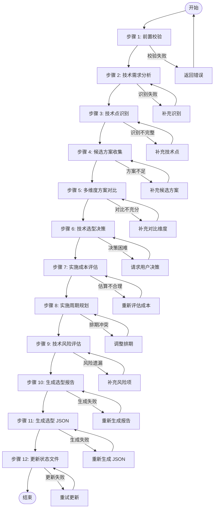

# Skill12: 轻量化技术选型

## 一、元信息

| 项目 | 内容 |
|-----|------|
| **Skill 编号** | S3-S12 |
| **Skill 名称** | 轻量化技术选型 |
| **所属阶段** | S3 - 技术可行性与选型阶段 |
| **执行顺序** | 第 3 个执行（S3 阶段出口） |
| **执行模式** | 仅常规模式执行，轻量化模式跳过 |
| **执行 Agent** | Executor Agent |
| **前置依赖** | Skill7（需求风险识别，可选）、Skill11（技术可行性评估，必需） |
| **后置 Skill** | Skill5（需求分类梳理，S4 阶段入口） |
| **产物 ID 格式** | `{PlanID}-S3-S12-001-{类型}` |
| **产物类型** | 技术选型报告（Markdown）、技术选型 JSON（结构化数据） |
| **模板引用** | [template.md](template.md) |
| **版本** | 2.0（标准化版本） |

---

## 二、功能描述

### 2.1 核心职责

Skill12 负责基于技术可行性评估结果，进行技术方案选型和成本评估，包括：

1. **技术需求分析**：从技术可行性评估报告中提取需要选型的技术点
2. **候选方案收集**：为每个技术点收集多个可选技术方案
3. **多维度方案对比**：从 6 大维度对比各候选方案的优劣
4. **技术选型决策**：基于综合评分推荐最优技术方案
5. **实施成本评估**：评估人力、时间、资金成本
6. **实施周期规划**：制定技术实施时间计划和里程碑
7. **技术风险评估**：识别技术选型相关的潜在风险
8. **技术栈架构图**：绘制整体技术栈架构
9. **成本预算汇总**：汇总开发成本和运营成本
10. **技术选型报告**：输出完整的技术选型及成本表

### 2.2 输入输出

#### 输入

**前置产物**：
- Plan 定义文件（必需）
- 技术可行性评估报告（Skill11 产物，必需）
- 技术可行性评估 JSON（Skill11 产物，必需）
- 需求风险识别报告（Skill7 产物，可选）
- 需求风险清单 JSON（Skill7 产物，可选）

**输入数据**：
```json
{
  "planId": "P000001",
  "planDefinition": "database/plan/{PlanID}/plan-definition.md",
  "feasibilityArtifact": "P000001-S3-S11-001",
  "feasibilityArtifactPath": "database/stages/s3/{PlanID}/P000001-S3-S11-001-feasibility.md",
  "feasibilityJsonPath": "database/stages/s3/{PlanID}/P000001-S3-S11-001-feasibility.json",
  "riskArtifact": "P000001-S3-S07-001",
  "riskArtifactPath": "database/stages/s3/{PlanID}/P000001-S3-S07-001-risk.md",
  "riskJsonPath": "database/stages/s3/{PlanID}/P000001-S3-S07-001-risk.json"
}
```

#### 输出

**产物清单**：
- 技术选型报告（Markdown）：`database/stages/s3/{PlanID}/{PlanID}-S3-S12-001-selection.md`
- 技术选型 JSON（结构化数据）：`database/stages/s3/{PlanID}/{PlanID}-S3-S12-001-selection.json`
- 状态更新：更新 Plan-Status.json 中 Skill12 的执行状态

**输出数据**：
```json
{
  "status": "success|failed",
  "planId": "P000001",
  "outputs": [
    {
      "artifactId": "P000001-S3-S12-001",
      "artifactType": "tech_selection",
      "filePath": "database/stages/s3/{PlanID}/P000001-S3-S12-001-selection.md",
      "jsonPath": "database/stages/s3/{PlanID}/P000001-S3-S12-001-selection.json"
    }
  ],
  "nextStage": "S4",
  "nextSkill": "S05",
  "selectionSummary": {
    "totalSelections": 8,
    "totalDuration": "120 PD",
    "totalLaborCost": "150,000 元",
    "totalMonthlyCost": "5,000 元/月",
    "totalFirstYearCost": "210,000 元"
  }
}
```

### 2.3 质量标准

采用 ISO/IEC 25010 软件质量模型，从 5 个维度评估技术选型质量：

| 质量维度 | 权重 | 说明 | 验收标准 |
|---------|------|------|---------|
| **完整性** | 30% | 所有技术点都已识别和选型 | 技术点识别完整率≥95% |
| **准确性** | 25% | 方案对比和选型决策客观准确 | 评估得分计算准确率 100% |
| **一致性** | 20% | 评估标准统一，决策无矛盾 | 评估标准一致性 100% |
| **可读性** | 15% | 结构清晰，表达准确 | 结构清晰度≥90% |
| **可追溯性** | 10% | 关键结论可追溯到数据来源 | 关键结论可追溯率≥90% |

**质量综合得分** = 完整性×30% + 准确性×25% + 一致性×20% + 可读性×15% + 可追溯性×10%

**验收标准**：质量综合得分 ≥ 85%

---

## 三、执行流程



### 步骤 1：前置校验

**目标**：验证前置产物是否完整且格式正确

**操作**：
1. 检查 Plan 定义文件是否存在
2. 检查 Skill11 技术可行性评估报告是否存在
3. 检查 Skill11 技术可行性评估 JSON 是否存在
4. 检查 Skill7 需求风险识别报告是否存在（可选）
5. 验证文件格式是否符合模板要求

**验证规则**：
- 前置产物必须存在且可读
- 产物 ID 格式必须正确
- 文件内容非空

**错误处理**：
- E001: 前置产物缺失 → 返回错误，要求先完成前置 Skill
- E002: 输入文件格式错误 → 返回错误，要求重新生成前置产物
- E003: 产物 ID 不匹配 → 返回错误，要求检查产物一致性

### 步骤 2：技术需求分析

**目标**：从技术可行性评估报告中提取技术选型需求

**操作**：
1. 读取技术可行性评估报告
2. 提取技术点识别章节内容
3. 提取技术栈匹配度分析章节内容
4. 提取技术风险评估章节内容
5. 整理需要选型的技术点清单

**验证规则**：
- 技术点提取完整率≥95%
- 技术需求描述准确无误

**错误处理**：
- E1200: 技术可行性评估报告读取失败 → 重试读取或返回错误
- E1201: 技术点识别不完整 → 补充识别遗漏的技术点

### 步骤 3：技术点识别

**目标**：识别和分类所有需要选型的技术点

**操作**：
1. 功能技术点识别：
   - 用户认证与授权技术
   - 数据存储与管理技术
   - 业务逻辑实现技术
   - 用户界面交互技术
   - 第三方集成技术
   - 数据处理与分析技术
   - 通信与接口技术

2. 非功能技术点识别：
   - 性能优化技术
   - 安全技术
   - 可扩展性技术
   - 可用性技术
   - 兼容性技术
   - 可维护性技术

3. 技术依赖识别：
   - 第三方服务和 API
   - 开源组件和库
   - 开发工具和框架
   - 部署和运维工具

**验证规则**：
- 技术点分类清晰
- 技术点描述准确
- 技术点优先级明确

**错误处理**：
- E1202: 技术点分类混乱 → 重新分类整理
- E1203: 技术点描述模糊 → 补充详细描述

### 步骤 4：候选方案收集

**目标**：为每个技术点收集多个可选技术方案

**操作**：
1. 为每个技术点收集 2-5 个候选方案
2. 收集各候选方案的详细信息：
   - 技术特点
   - 适用场景
   - 优缺点
   - 社区支持情况
   - 成本信息
3. 整理候选方案对比表

**验证规则**：
- 每个技术点至少有 2 个候选方案
- 候选方案信息完整
- 候选方案具有可比性

**错误处理**：
- E1204: 候选方案不足 → 补充更多候选方案
- E1205: 候选方案信息不完整 → 补充缺失信息

### 步骤 5：多维度方案对比

**目标**：从 6 大维度对比各候选方案的优劣

**操作**：
1. 技术成熟度评估（20%）：
   - 技术栈的稳定性
   - 社区支持活跃度
   - 文档完善度
   - 企业采用情况

2. 团队熟悉度评估（25%）：
   - 团队对该技术的掌握程度
   - 历史项目使用经验
   - 学习曲线陡峭度

3. 开发效率评估（20%）：
   - 开发速度
   - 代码可维护性
   - 调试便利性
   - 生态工具支持

4. 性能表现评估（15%）：
   - 运行性能
   - 扩展能力
   - 资源消耗
   - 并发处理能力

5. 生态完善度评估（15%）：
   - 第三方库和工具支持
   - 社区活跃度
   - 人才储备
   - 培训资源

6. 成本控制评估（10%）：
   - 许可成本
   - 运维成本
   - 培训成本
   - 迁移成本

**验证规则**：
- 评估维度完整
- 评估标准统一
- 评估得分计算准确

**错误处理**：
- E1206: 评估维度不完整 → 补充缺失维度
- E1207: 评估标准不统一 → 统一评估标准
- E1208: 得分计算错误 → 重新计算得分

### 步骤 6：技术选型决策

**目标**：基于综合评分推荐最优技术方案

**操作**：
1. 计算各候选方案的综合得分：
   ```
   综合得分 = 技术成熟度×20% + 团队熟悉度×25% + 开发效率×20% + 性能表现×15% + 生态完善度×15% + 成本控制×10%
   ```

2. 根据综合得分排序

3. 应用决策规则：
   - 团队熟悉 + 成熟技术 → 优先选用
   - 团队陌生 + 成熟技术 → 培训后选用
   - 团队熟悉 + 新兴技术 → 谨慎选用
   - 团队陌生 + 新兴技术 → 避免选用

4. 考虑特殊因素调整：
   - 战略一致性
   - 供应商锁定风险
   - 技术发展趋势
   - 合规要求

5. 确定最终推荐方案

**验证规则**：
- 决策理由充分
- 决策过程透明
- 决策结果可追溯

**错误处理**：
- E1209: 决策理由不充分 → 补充决策理由
- E1210: 决策结果与评分不符 → 重新评估决策

### 步骤 7：实施成本评估

**目标**：评估各技术选型的实施成本

**操作**：
1. 人力成本评估：
   - 开发工作量（人天）
   - 人员角色和单价
   - 总人力成本

2. 第三方服务成本：
   - SaaS 服务费用
   - API 调用费用
   - 云服务费用

3. 基础设施成本：
   - 服务器费用
   - 数据库费用
   - 网络费用

4. 许可费用：
   - 商业软件许可
   - 开发工具许可
   - 年度维护费用

5. 培训成本：
   - 技术培训费用
   - 学习时间成本

6. 汇总总成本：
   ```
   首期成本 = 人力成本 + 工具采购 + 培训成本
   月度运营成本 = 第三方服务 + 基础设施 + 许可费用
   首年总成本 = 首期成本 + 月度运营成本×12 + 应急储备（10%）
   ```

**验证规则**：
- 成本估算合理
- 成本明细清晰
- 成本格式规范

**错误处理**：
- E1211: 成本估算不合理 → 重新评估成本
- E1212: 成本明细不完整 → 补充缺失成本项
- E1213: 成本格式错误 → 修正为正确格式

### 步骤 8：实施周期规划

**目标**：制定技术实施时间计划和里程碑

**操作**：
1. 估算各技术选型的实施周期（人天）
2. 识别技术依赖关系
3. 制定分阶段实施计划：
   - 阶段一：基础技术准备（第 1-2 周）
   - 阶段二：核心功能开发（第 3-6 周）
   - 阶段三：高级功能实现（第 7-10 周）
   - 阶段四：优化与完善（第 11-12 周）

4. 确定关键技术里程碑
5. 识别关键路径
6. 制定缓冲时间（建议 15-20%）

**验证规则**：
- 实施周期合理
- 里程碑明确
- 依赖关系清晰

**错误处理**：
- E1214: 实施周期估算不合理 → 重新估算周期
- E1215: 里程碑不明确 → 明确里程碑定义
- E1216: 依赖关系混乱 → 梳理依赖关系

### 步骤 9：技术风险评估

**目标**：识别技术选型相关的潜在风险

**操作**：
1. 技术风险识别：
   - 技术不成熟风险
   - 团队能力不足风险
   - 技术过时风险
   - 供应商锁定风险

2. 成本风险评估：
   - 成本超支风险
   - 隐性成本风险
   - 汇率波动风险（如涉及海外服务）

3. 进度风险评估：
   - 技术难点延期风险
   - 人员流动风险
   - 外部依赖延期风险

4. 制定风险应对措施：
   - 风险规避策略
   - 风险缓解策略
   - 风险转移策略
   - 风险接受策略

**验证规则**：
- 风险识别完整
- 风险评估准确
- 应对措施可行

**错误处理**：
- E1217: 风险识别不完整 → 补充风险项
- E1218: 风险评估不准确 → 重新评估风险
- E1219: 应对措施不可行 → 调整应对措施

### 步骤 10：生成选型报告

**目标**：生成技术选型报告（Markdown 格式）

**操作**：
1. 按照 template.md 模板格式组织内容
2. 填写技术选型概览
3. 填写技术选型总表
4. 填写详细技术选型方案
5. 绘制技术栈架构图
6. 填写实施周期规划
7. 填写成本预算汇总
8. 填写技术选型决策依据
9. 填写风险评估与应对
10. 填写技术债务规划
11. 填写后续优化建议
12. 填写技术选型总结

**验证规则**：
- 报告结构完整
- 内容符合模板要求
- 格式规范统一

**错误处理**：
- E201: 报告生成失败 → 检查模板并重新生成
- E202: 报告内容不完整 → 补充缺失内容
- E203: 报告格式错误 → 修正格式

### 步骤 11：生成选型 JSON

**目标**：生成技术选型 JSON（结构化数据）

**操作**：
1. 按照 JSON Schema 定义组织数据
2. 填写元数据信息
3. 填写技术选型概览
4. 填写技术选型清单
5. 填写成本预算
6. 填写实施周期
7. 填写风险评估
8. 验证 JSON 格式和 Schema 合规性

**验证规则**：
- JSON 格式正确
- Schema 验证通过
- 数据完整准确

**错误处理**：
- E204: JSON 生成失败 → 检查数据并重新生成
- E205: Schema 验证失败 → 修正数据格式
- E206: 数据不完整 → 补充缺失数据

### 步骤 12：更新状态文件

**目标**：更新 Plan-Status.json 中 Skill12 的执行状态

**操作**：
1. 读取 Plan-Status.json
2. 更新 Skill12 的执行状态为"已完成"
3. 记录产物 ID 和文件路径
4. 更新 S3 阶段状态为"已完成"
5. 标记 S4 阶段为"可开始"
6. 写回 Plan-Status.json

**验证规则**：
- 状态更新及时
- 产物路径准确
- 阶段转换正确

**错误处理**：
- E301: 状态文件读取失败 → 重试读取或创建新文件
- E302: 状态更新失败 → 重试更新
- E303: 状态文件损坏 → 修复或重建状态文件

---

## 四、产物规范

### 4.1 产物 ID 格式

```
{PlanID}-S3-S12-001-{类型}
```

**示例**：
- `P000001-S3-S12-001-selection.md` - 技术选型报告
- `P000001-S3-S12-001-selection.json` - 技术选型 JSON

### 4.2 存储路径

```
database/
└── stages/
    └── s3/
        └── {PlanID}/
            ├── {PlanID}-S3-S12-001-selection.md      # 技术选型报告
            └── {PlanID}-S3-S12-001-selection.json    # 技术选型 JSON
```

### 4.3 产物结构

#### 技术选型报告（Markdown）

**文件结构**：
1. 元信息
2. 技术选型概览
3. 技术选型总表
4. 详细技术选型方案（每个选型一个章节）
5. 技术栈架构图
6. 实施周期规划
7. 成本预算汇总
8. 技术选型决策依据
9. 风险评估与应对
10. 技术债务规划
11. 后续优化建议
12. 技术选型总结
13. 附录

**详细内容**：参见 [template.md](template.md)

#### 技术选型 JSON（结构化数据）

**JSON Schema**：
```json
{
  "$schema": "http://json-schema.org/draft-07/schema#",
  "title": "技术选型评估 Schema",
  "type": "object",
  "properties": {
    "metadata": {
      "type": "object",
      "properties": {
        "planId": {"type": "string"},
        "artifactId": {"type": "string"},
        "artifactType": {"type": "string"},
        "version": {"type": "string"},
        "generatedAt": {"type": "string", "format": "date-time"},
        "skillVersion": {"type": "string"}
      },
      "required": ["planId", "artifactId", "artifactType", "version", "generatedAt"]
    },
    "selectionOverview": {
      "type": "object",
      "properties": {
        "totalSelections": {"type": "integer"},
        "totalDuration": {"type": "string"},
        "totalLaborCost": {"type": "string"},
        "totalMonthlyCost": {"type": "string"},
        "totalFirstYearCost": {"type": "string"}
      },
      "required": ["totalSelections"]
    },
    "techSelections": {
      "type": "array",
      "items": {
        "type": "object",
        "properties": {
          "selectionId": {"type": "string"},
          "techPoint": {"type": "string"},
          "description": {"type": "string"},
          "category": {"type": "string"},
          "candidates": {
            "type": "array",
            "items": {
              "type": "object",
              "properties": {
                "name": {"type": "string"},
                "maturity": {"type": "string"},
                "teamFamiliarity": {"type": "string"},
                "developmentEfficiency": {"type": "string"},
                "performance": {"type": "string"},
                "ecosystem": {"type": "string"},
                "cost": {"type": "string"},
                "score": {"type": "number"}
              },
              "required": ["name", "score"]
            }
          },
          "recommendedSolution": {"type": "string"},
          "selectionReasons": {
            "type": "array",
            "items": {"type": "string"}
          },
          "implementationDuration": {"type": "string"},
          "laborCost": {"type": "string"},
          "otherCosts": {"type": "string"},
          "totalCost": {"type": "string"},
          "risks": {
            "type": "array",
            "items": {
              "type": "object",
              "properties": {
                "riskId": {"type": "string"},
                "description": {"type": "string"},
                "impact": {"type": "string"},
                "mitigation": {"type": "string"}
              }
            }
          }
        },
        "required": ["selectionId", "techPoint", "recommendedSolution"]
      }
    },
    "costBudget": {
      "type": "object",
      "properties": {
        "developmentCost": {
          "type": "object",
          "properties": {
            "laborCost": {"type": "string"},
            "outsourcingCost": {"type": "string"},
            "trainingCost": {"type": "string"},
            "toolCost": {"type": "string"},
            "subtotal": {"type": "string"}
          }
        },
        "operatingCost": {
          "type": "object",
          "properties": {
            "cloudService": {"type": "string"},
            "thirdPartyService": {"type": "string"},
            "licenseCost": {"type": "string"},
            "maintenanceCost": {"type": "string"},
            "subtotal": {"type": "string"}
          }
        },
        "firstYearTotal": {"type": "string"}
      }
    },
    "implementationPlan": {
      "type": "object",
      "properties": {
        "phases": {
          "type": "array",
          "items": {
            "type": "object",
            "properties": {
              "phaseName": {"type": "string"},
              "duration": {"type": "string"},
              "startDate": {"type": "string"},
              "endDate": {"type": "string"},
              "milestones": {
                "type": "array",
                "items": {"type": "string"}
              }
            }
          }
        },
        "criticalPath": {
          "type": "array",
          "items": {"type": "string"}
        }
      }
    },
    "risks": {
      "type": "array",
      "items": {
        "type": "object",
        "properties": {
          "riskId": {"type": "string"},
          "category": {"type": "string"},
          "description": {"type": "string"},
          "probability": {"type": "string"},
          "impact": {"type": "string"},
          "level": {"type": "string"},
          "mitigation": {"type": "string"},
          "owner": {"type": "string"}
        }
      }
    },
    "recommendations": {
      "type": "object",
      "properties": {
        "shortTerm": {
          "type": "array",
          "items": {"type": "string"}
        },
        "mediumTerm": {
          "type": "array",
          "items": {"type": "string"}
        },
        "longTerm": {
          "type": "array",
          "items": {"type": "string"}
        }
      }
    }
  },
  "required": ["metadata", "selectionOverview", "techSelections"]
}
```

---

## 五、质量标准

### 5.1 质量评估框架

采用 ISO/IEC 25010 软件质量模型，从 5 个维度评估技术选型质量：

| 质量维度 | 权重 | 评估标准 | 检查方法 |
|---------|------|---------|---------|
| **完整性** | 30% | 所有技术点都已识别和选型 | 检查技术点识别完整率 |
| **准确性** | 25% | 方案对比和选型决策客观准确 | 检查评估得分计算准确率 |
| **一致性** | 20% | 评估标准统一，决策无矛盾 | 检查评估标准一致性 |
| **可读性** | 15% | 结构清晰，表达准确 | 检查结构清晰度和表达准确性 |
| **可追溯性** | 10% | 关键结论可追溯到数据来源 | 检查关键结论可追溯率 |

### 5.2 检查清单

#### 完整性检查（30%）

- [ ] 技术点识别完整，无遗漏
- [ ] 每个技术点至少有 2 个候选方案
- [ ] 6 大评估维度全部覆盖
- [ ] 成本估算包含所有成本项
- [ ] 实施周期规划完整
- [ ] 风险识别完整
- [ ] 所有必填字段都已填写
- [ ] 产物 ID 格式正确
- [ ] 存储路径正确

**完整性得分** = (完成项数 / 9) × 100%

#### 准确性检查（25%）

- [ ] 技术点描述准确无误
- [ ] 候选方案信息真实准确
- [ ] 评估得分计算准确（权重×得分）
- [ ] 成本估算合理可信
- [ ] 实施周期估算合理

**准确性得分** = (完成项数 / 5) × 100%

#### 一致性检查（20%）

- [ ] 所有技术点使用相同的评估标准
- [ ] 所有成本使用统一的货币单位
- [ ] 所有周期使用统一的时间单位（PD）
- [ ] 术语使用一致
- [ ] 格式风格统一

**一致性得分** = (完成项数 / 5) × 100%

#### 可读性检查（15%）

- [ ] 报告结构清晰，层次分明
- [ ] 章节标题准确描述内容
- [ ] 表格格式规范，易于阅读
- [ ] 图表清晰，标注完整
- [ ] 语言表达准确，无歧义

**可读性得分** = (完成项数 / 5) × 100%

#### 可追溯性检查（10%）

- [ ] 技术选型可追溯到技术可行性评估
- [ ] 评估得分可追溯到具体评分项
- [ ] 成本估算可追溯到明细项
- [ ] 决策理由充分且有依据
- [ ] 风险应对可追溯到具体风险项

**可追溯性得分** = (完成项数 / 5) × 100%

### 5.3 质量综合得分

```
质量综合得分 = 完整性×30% + 准确性×25% + 一致性×20% + 可读性×15% + 可追溯性×10%
```

**验收标准**：质量综合得分 ≥ 85%

### 5.4 质量等级

| 得分范围 | 质量等级 | 说明 |
|---------|---------|------|
| 90-100% | 优秀 | 质量超出预期，可直接使用 |
| 85-89% | 良好 | 质量符合要求，可接受 |
| 70-84% | 合格 | 质量基本合格，需要小改进 |
| 60-69% | 不合格 | 质量不达标，需要改进 |
| <60% | 差 | 质量严重不达标，需要返工 |

---

## 六、错误处理

### 6.1 错误分类

| 错误类别 | 错误码范围 | 说明 |
|---------|-----------|------|
| 前置校验错误 | E001-E099 | 前置产物缺失或格式错误 |
| 执行过程错误 | E100-E199 | 执行过程中的业务逻辑错误 |
| 输出错误 | E200-E299 | 产物生成和输出错误 |
| 系统错误 | E900-E999 | 文件读写、网络等系统级错误 |

### 6.2 错误代码表

#### 前置校验错误（E001-E099）

| 错误码 | 错误类型 | 错误描述 | 处理策略 |
|-------|---------|---------|---------|
| E001 | 前置产物缺失 | 前置 Skill 产物不存在 | 返回错误，要求先完成前置 Skill |
| E002 | 输入文件格式错误 | 输入产物格式不符合模板 | 返回错误，要求重新生成前置产物 |
| E003 | 产物 ID 不匹配 | 产物 ID 与 PlanID 不一致 | 返回错误，要求检查产物一致性 |

#### 执行过程错误（E100-E199）

| 错误码 | 错误类型 | 错误描述 | 处理策略 |
|-------|---------|---------|---------|
| E1200 | 技术可行性评估报告读取失败 | 无法读取 Skill11 产物 | 重试读取或返回错误 |
| E1201 | 技术点识别不完整 | 遗漏重要技术点 | 补充识别遗漏的技术点 |
| E1202 | 技术点分类混乱 | 技术点分类不清晰 | 重新分类整理 |
| E1203 | 技术点描述模糊 | 技术点描述不准确 | 补充详细描述 |
| E1204 | 候选方案不足 | 候选方案少于 2 个 | 补充更多候选方案 |
| E1205 | 候选方案信息不完整 | 候选方案信息缺失 | 补充缺失信息 |
| E1206 | 评估维度不完整 | 缺少评估维度 | 补充缺失维度 |
| E1207 | 评估标准不统一 | 不同技术点评估标准不一致 | 统一评估标准 |
| E1208 | 得分计算错误 | 综合得分计算错误 | 重新计算得分 |
| E1209 | 决策理由不充分 | 选型决策理由不充分 | 补充决策理由 |
| E1210 | 决策结果与评分不符 | 推荐方案与综合得分不匹配 | 重新评估决策 |
| E1211 | 成本估算不合理 | 成本估算偏离市场水平 | 重新评估成本 |
| E1212 | 成本明细不完整 | 缺少重要成本项 | 补充缺失成本项 |
| E1213 | 成本格式错误 | 成本格式不符合规范 | 修正为正确格式 |
| E1214 | 实施周期估算不合理 | 周期估算过短或过长 | 重新估算周期 |
| E1215 | 里程碑不明确 | 里程碑定义模糊 | 明确里程碑定义 |
| E1216 | 依赖关系混乱 | 技术依赖关系不清晰 | 梳理依赖关系 |
| E1217 | 风险识别不完整 | 遗漏重要风险项 | 补充风险项 |
| E1218 | 风险评估不准确 | 风险概率或影响评估错误 | 重新评估风险 |
| E1219 | 应对措施不可行 | 风险应对措施不切实际 | 调整应对措施 |

#### 输出错误（E200-E299）

| 错误码 | 错误类型 | 错误描述 | 处理策略 |
|-------|---------|---------|---------|
| E201 | 报告生成失败 | 无法生成 Markdown 报告 | 检查模板并重新生成 |
| E202 | 报告内容不完整 | 报告缺少必要章节 | 补充缺失内容 |
| E203 | 报告格式错误 | 报告格式不符合模板 | 修正格式 |
| E204 | JSON 生成失败 | 无法生成 JSON 文件 | 检查数据并重新生成 |
| E205 | Schema 验证失败 | JSON 数据不符合 Schema | 修正数据格式 |
| E206 | 数据不完整 | JSON 数据缺少必填字段 | 补充缺失数据 |

#### 系统错误（E900-E999）

| 错误码 | 错误类型 | 错误描述 | 处理策略 |
|-------|---------|---------|---------|
| E901 | 文件读写错误 | 无法读取或写入文件 | 重试操作或返回错误 |
| E902 | 目录创建失败 | 无法创建产物存储目录 | 检查权限并重试 |
| E903 | 网络错误 | 网络请求失败 | 重试请求或返回错误 |
| E904 | 内存不足 | 系统内存不足 | 优化内存使用或返回错误 |
| E905 | 磁盘空间不足 | 磁盘空间不足 | 清理空间或返回错误 |

### 6.3 错误处理流程

```
发生错误
    ↓
错误分类（根据错误码）
    ↓
是否可恢复错误？
    ├─ 是 → 重试/降级处理/记录日志 → 继续执行
    └─ 否 → 记录错误详情 → 返回错误信息 → 中止执行
```

### 6.4 错误恢复策略

| 错误类型 | 恢复策略 | 重试次数 | 降级方案 |
|---------|---------|---------|---------|
| 文件读写错误 | 重试读取/写入 | 3 次 | 返回错误，要求手动处理 |
| 网络错误 | 重试请求 | 3 次 | 使用缓存数据或返回错误 |
| 数据格式错误 | 自动修正格式 | 1 次 | 返回错误，要求修正数据 |
| 计算错误 | 重新计算 | 1 次 | 返回错误，要求人工复核 |
| 系统资源不足 | 等待资源释放 | 1 次 | 返回错误，建议稍后重试 |

---

## 附录

### A. 技术选型决策矩阵

| 场景 | 推荐策略 | 说明 |
|-----|---------|------|
| 团队熟悉 + 成熟技术 | 优先选用 | 风险最低，效率最高 |
| 团队陌生 + 成熟技术 | 培训后选用 | 需要投入学习成本 |
| 团队熟悉 + 新兴技术 | 谨慎选用 | 评估技术稳定性 |
| 团队陌生 + 新兴技术 | 避免选用 | 风险过高，除非必要 |

### B. 成本参考标准

| 角色 | 人天成本 | 说明 |
|-----|---------|------|
| 初级开发 | 500-800 元 | 1-3 年经验 |
| 中级开发 | 800-1500 元 | 3-5 年经验 |
| 高级开发 | 1500-2500 元 | 5 年以上经验 |
| 架构师 | 2500-4000 元 | 技术专家 |

### C. 实施周期参考

| 功能复杂度 | 实施周期 | 说明 |
|-----------|---------|------|
| 简单功能 | 3-5 PD | 常规开发，无技术难点 |
| 中等功能 | 5-10 PD | 有一定复杂度，需要设计 |
| 复杂功能 | 10-20 PD | 技术难度较高，需要专项研究 |
| 困难功能 | 20-40 PD | 技术挑战大，可能需要突破 |
| 极难功能 | 40+ PD | 前沿技术，不确定性高 |

### D. 版本历史

| 版本 | 日期 | 更新内容 |
|------|------|----------|
| 1.0 | 2026-03-24 | 初始版本，定义 Skill12 完整规范 |
| 2.0 | 2026-03-24 | 标准化优化版本，采用 6 段式结构，统一技术选型框架 |

---

*生成时间：2026-03-24*  
*Skill 版本：2.0*
