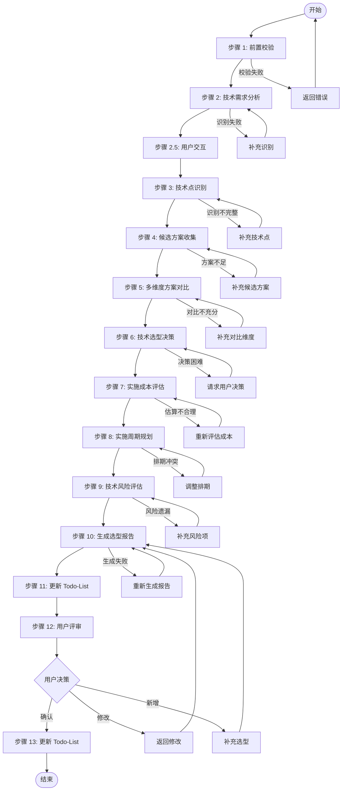
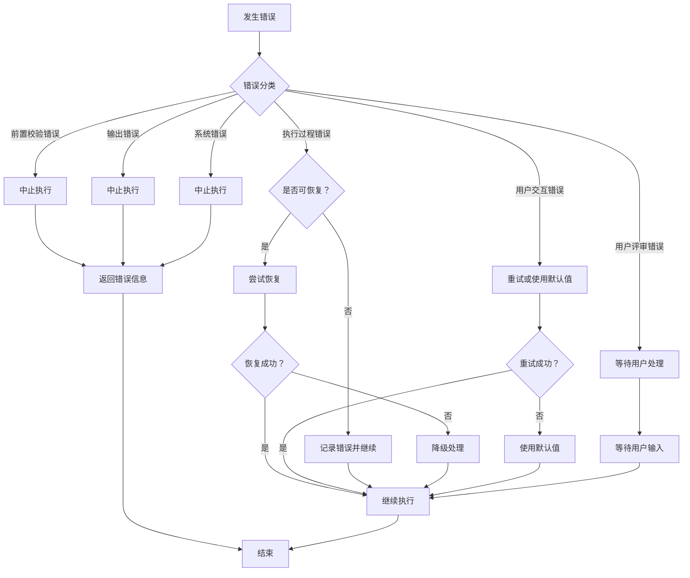

# Skill12: 轻量化技术选型

## 一、元信息

| 项目 | 内容 |
|-----|------|
| **Skill 编号** | S3-S12 |
| **Skill 名称** | 轻量化技术选型 |
| **所属阶段** | S3 - 技术可行性与选型阶段 |
| **执行顺序** | 第 3 个执行（S3 阶段出口） |
| **执行模式** | 仅常规模式执行，轻量化模式跳过 |
| **前置依赖** | Skill7（需求风险识别，可选）、Skill11（技术可行性评估，必需） |
| **后置 Skill** | Skill5（需求分类梳理，S4 阶段入口） |
| **版本** | v3.0 |

---

## 二、功能描述

### 2.1 核心职责

Skill12 负责基于技术可行性评估结果，进行技术方案选型和成本评估，包括：

1. **技术需求分析**：从技术可行性评估报告中提取需要选型的技术点
2. **候选方案收集**：为每个技术点收集多个可选技术方案
3. **多维度方案对比**：从 6 大维度对比各候选方案的优劣
4. **技术选型决策**：基于综合评分推荐最优技术方案
5. **实施成本评估**：评估人力、时间、资金成本
6. **实施周期规划**：制定技术实施时间计划和里程碑
7. **技术风险评估**：识别技术选型相关的潜在风险
8. **技术栈架构图**：绘制整体技术栈架构
9. **成本预算汇总**：汇总开发成本和运营成本
10. **技术选型报告**：输出完整的技术选型及成本表

### 2.2 输入输出

#### 输入

**前置产物**：
- Plan 定义文件（必需）
- 技术可行性评估报告（Skill11 产物，必需）
- 需求风险识别报告（Skill7 产物，可选）

**输入数据**：

| 数据项 | 说明 | 示例值 |
|--------|------|--------|
| Plan ID | 当前计划的唯一标识 | P000001 |
| Plan 定义文件 | Plan 定义文档路径 | database/plan/{PlanID}/plan-definition.md |
| 可行性评估产物 ID | Skill11 产物标识 | P000001-S3-S11-001 |
| 可行性评估报告路径 | Skill11 产物文件路径 | database/stages/s3/{PlanID}/P000001-S3-S11-001-feasibility.md |
| 风险识别产物 ID | Skill7 产物标识（可选） | P000001-S3-S07-001 |
| 风险识别报告路径 | Skill7 产物文件路径（可选） | database/stages/s3/{PlanID}/P000001-S3-S07-001-risk.md |

#### 输出

**产物清单**：
- 技术选型报告（Markdown）：`database/stages/s3/{PlanID}/{PlanID}-S3-S12-001-selection.md`
- Todo-List 更新：更新 Todo-List 中 Skill12 的执行状态

**输出数据**：

| 数据项 | 说明 | 示例值 |
|--------|------|--------|
| 执行状态 | 执行成功或失败 | success / failed |
| Plan ID | 当前计划的唯一标识 | P000001 |
| 产物 ID | 技术选型报告产物标识 | P000001-S3-S12-001 |
| 产物类型 | 产物类型标识 | tech_selection |
| 产物路径 | 技术选型报告文件路径 | database/stages/s3/{PlanID}/P000001-S3-S12-001-selection.md |
| 下一阶段 | 下一阶段标识 | S4 |
| 下一 Skill | 下一 Skill 标识 | S05 |
| 选型总数 | 技术选型项目总数 | 8 |
| 总实施周期 | 总体实施周期（人天） | 120 PD |
| 总人力成本 | 总体人力成本 | 150,000 元 |
| 月度运营成本 | 每月运营成本 | 5,000 元/月 |
| 首年总成本 | 第一年度总成本 | 210,000 元 |

### 2.3 质量标准

采用 ISO/IEC 25010 软件质量模型，从 5 个维度评估技术选型质量：

| 质量维度 | 权重 | 说明 | 验收标准 |
|---------|------|------|---------|
| **完整性** | 30% | 所有技术点都已识别和选型 | 技术点识别完整率≥95% |
| **准确性** | 25% | 方案对比和选型决策客观准确 | 评估得分计算准确率 100% |
| **一致性** | 20% | 评估标准统一，决策无矛盾 | 评估标准一致性 100% |
| **可读性** | 15% | 结构清晰，表达准确 | 结构清晰度≥90% |
| **可追溯性** | 10% | 关键结论可追溯到数据来源 | 关键结论可追溯率≥90% |

**质量综合得分** = 完整性×30% + 准确性×25% + 一致性×20% + 可读性×15% + 可追溯性×10%

**验收标准**：质量综合得分 ≥ 85%

---

## 三、执行流程



### 步骤 1：前置校验

**目标**：验证前置产物是否完整且格式正确

**操作**：
1. 检查 Plan 定义文件是否存在
2. 检查 Skill11 技术可行性评估报告是否存在
3. 检查 Skill7 需求风险识别报告是否存在（可选）
4. 验证文件格式是否符合模板要求

**验证规则**：
- 前置产物必须存在且可读
- 产物 ID 格式必须正确
- 文件内容非空

**错误处理**：
- E001: 前置产物缺失 → 返回错误，要求先完成前置 Skill
- E002: 输入文件格式错误 → 返回错误，要求重新生成前置产物
- E003: 产物 ID 不匹配 → 返回错误，要求检查产物一致性

### 步骤 2：技术需求分析

**目标**：从技术可行性评估报告中提取技术选型需求

**操作**：
1. 读取技术可行性评估报告
2. 提取技术点识别章节内容
3. 提取技术栈匹配度分析章节内容
4. 提取技术风险评估章节内容
5. 整理需要选型的技术点清单

**验证规则**：
- 技术点提取完整率≥95%
- 技术需求描述准确无误

**错误处理**：
- E1200: 技术可行性评估报告读取失败 → 重试读取或返回错误
- E1201: 技术点识别不完整 → 补充识别遗漏的技术点

### 步骤 2.5：用户交互（技术选型偏好调研）

**触发场景**：
- 技术选型偏好不明确（如成本优先/效率优先/稳定性优先）
- 技术栈约束条件不清晰
- 团队技术能力信息缺失
- 预算约束与选型冲突
- 发现重大技术选型风险

**交互流程**：
1. 识别需要用户确认的技术选型偏好
2. 生成澄清问题（使用标准化问题模板）
3. 等待用户输入
4. 解析用户输入，补充到技术选型需求
5. 如仍不清晰，进行多轮对话（最多 3 轮）

**问题模板示例**：

**场景 1：技术选型偏好调研**
```
【技术选型偏好调研】

在进行技术选型前，需要了解您的偏好优先级：

请按优先级排序以下因素（1=最高优先级，5=最低优先级）：
A. 成本控制 - 降低开发和运营成本
B. 开发效率 - 快速实现功能上线
C. 技术稳定性 - 选择成熟稳定的技术
D. 团队熟悉度 - 选择团队熟悉的技术
E. 技术先进性 - 采用前沿技术方案

您的排序（例如：CBAED）：
```

**场景 2：技术栈约束确认**
```
【技术栈约束确认】

检测到以下技术栈约束条件需要确认：

约束项：{约束名称，如"必须使用 Flutter 开发"}
当前上下文：{相关背景信息}
影响范围：{约束对选型的影响}

请确认：
- 输入「确认」表示接受此约束
- 输入「修改」并提供新的约束条件
- 输入「取消」表示移除此约束

您的选择：
```

**场景 3：预算约束与选型冲突**
```
【预算约束冲突提示】

检测到技术选型与预算约束存在冲突：

推荐方案：{推荐技术方案}
方案成本：{预估成本}
预算约束：{预算上限}
差额：{差额}

可选处理方式：
A. 调整预算上限
B. 选择成本更低的替代方案
C. 分阶段实施，降低首期投入
D. 其他方案（请说明）

请选择处理方式：
```

**交互记录保存**：
所有交互记录保存到技术选型报告的"用户交互记录"章节，包含：
- 交互轮次
- 交互时间
- 交互类型
- 问题描述
- 用户输入
- 解析结果
- 处理状态

### 步骤 3：技术点识别

**目标**：识别和分类所有需要选型的技术点

**操作**：
1. 功能技术点识别：
   - 用户认证与授权技术
   - 数据存储与管理技术
   - 业务逻辑实现技术
   - 用户界面交互技术
   - 第三方集成技术
   - 数据处理与分析技术
   - 通信与接口技术

2. 非功能技术点识别：
   - 性能优化技术
   - 安全技术
   - 可扩展性技术
   - 可用性技术
   - 兼容性技术
   - 可维护性技术

3. 技术依赖识别：
   - 第三方服务和 API
   - 开源组件和库
   - 开发工具和框架
   - 部署和运维工具

**验证规则**：
- 技术点分类清晰
- 技术点描述准确
- 技术点优先级明确

**错误处理**：
- E1202: 技术点分类混乱 → 重新分类整理
- E1203: 技术点描述模糊 → 补充详细描述

### 步骤 4：候选方案收集

**目标**：为每个技术点收集多个可选技术方案

**操作**：
1. 为每个技术点收集 2-5 个候选方案
2. 收集各候选方案的详细信息：
   - 技术特点
   - 适用场景
   - 优缺点
   - 社区支持情况
   - 成本信息
3. 整理候选方案对比表

**验证规则**：
- 每个技术点至少有 2 个候选方案
- 候选方案信息完整
- 候选方案具有可比性

**错误处理**：
- E1204: 候选方案不足 → 补充更多候选方案
- E1205: 候选方案信息不完整 → 补充缺失信息

### 步骤 5：多维度方案对比

**目标**：从 6 大维度对比各候选方案的优劣

**操作**：
1. 技术成熟度评估（20%）：
   - 技术栈的稳定性
   - 社区支持活跃度
   - 文档完善度
   - 企业采用情况

2. 团队熟悉度评估（25%）：
   - 团队对该技术的掌握程度
   - 历史项目使用经验
   - 学习曲线陡峭度

3. 开发效率评估（20%）：
   - 开发速度
   - 代码可维护性
   - 调试便利性
   - 生态工具支持

4. 性能表现评估（15%）：
   - 运行性能
   - 扩展能力
   - 资源消耗
   - 并发处理能力

5. 生态完善度评估（15%）：
   - 第三方库和工具支持
   - 社区活跃度
   - 人才储备
   - 培训资源

6. 成本控制评估（10%）：
   - 许可成本
   - 运维成本
   - 培训成本
   - 迁移成本

**验证规则**：
- 评估维度完整
- 评估标准统一
- 评估得分计算准确

**错误处理**：
- E1206: 评估维度不完整 → 补充缺失维度
- E1207: 评估标准不统一 → 统一评估标准
- E1208: 得分计算错误 → 重新计算得分

### 步骤 6：技术选型决策

**目标**：基于综合评分推荐最优技术方案

**操作**：
1. 计算各候选方案的综合得分：
   ```
   综合得分 = 技术成熟度×20% + 团队熟悉度×25% + 开发效率×20% + 性能表现×15% + 生态完善度×15% + 成本控制×10%
   ```

2. 根据综合得分排序

3. 应用决策规则：
   - 团队熟悉 + 成熟技术 → 优先选用
   - 团队陌生 + 成熟技术 → 培训后选用
   - 团队熟悉 + 新兴技术 → 谨慎选用
   - 团队陌生 + 新兴技术 → 避免选用

4. 考虑特殊因素调整：
   - 战略一致性
   - 供应商锁定风险
   - 技术发展趋势
   - 合规要求

5. 确定最终推荐方案

**验证规则**：
- 决策理由充分
- 决策过程透明
- 决策结果可追溯

**错误处理**：
- E1209: 决策理由不充分 → 补充决策理由
- E1210: 决策结果与评分不符 → 重新评估决策

### 步骤 7：实施成本评估

**目标**：评估各技术选型的实施成本

**操作**：
1. 人力成本评估：
   - 开发工作量（人天）
   - 人员角色和单价
   - 总人力成本

2. 第三方服务成本：
   - SaaS 服务费用
   - API 调用费用
   - 云服务费用

3. 基础设施成本：
   - 服务器费用
   - 数据库费用
   - 网络费用

4. 许可费用：
   - 商业软件许可
   - 开发工具许可
   - 年度维护费用

5. 培训成本：
   - 技术培训费用
   - 学习时间成本

6. 汇总总成本：
   ```
   首期成本 = 人力成本 + 工具采购 + 培训成本
   月度运营成本 = 第三方服务 + 基础设施 + 许可费用
   首年总成本 = 首期成本 + 月度运营成本×12 + 应急储备（10%）
   ```

**验证规则**：
- 成本估算合理
- 成本明细清晰
- 成本格式规范

**错误处理**：
- E1211: 成本估算不合理 → 重新评估成本
- E1212: 成本明细不完整 → 补充缺失成本项
- E1213: 成本格式错误 → 修正为正确格式

### 步骤 8：实施周期规划

**目标**：制定技术实施时间计划和里程碑

**操作**：
1. 估算各技术选型的实施周期（人天）
2. 识别技术依赖关系
3. 制定分阶段实施计划：
   - 阶段一：基础技术准备（第 1-2 周）
   - 阶段二：核心功能开发（第 3-6 周）
   - 阶段三：高级功能实现（第 7-10 周）
   - 阶段四：优化与完善（第 11-12 周）

4. 确定关键技术里程碑
5. 识别关键路径
6. 制定缓冲时间（建议 15-20%）

**验证规则**：
- 实施周期合理
- 里程碑明确
- 依赖关系清晰

**错误处理**：
- E1214: 实施周期估算不合理 → 重新估算周期
- E1215: 里程碑不明确 → 明确里程碑定义
- E1216: 依赖关系混乱 → 梳理依赖关系

### 步骤 9：技术风险评估

**目标**：识别技术选型相关的潜在风险

**操作**：
1. 技术风险识别：
   - 技术不成熟风险
   - 团队能力不足风险
   - 技术过时风险
   - 供应商锁定风险

2. 成本风险评估：
   - 成本超支风险
   - 隐性成本风险
   - 汇率波动风险（如涉及海外服务）

3. 进度风险评估：
   - 技术难点延期风险
   - 人员流动风险
   - 外部依赖延期风险

4. 制定风险应对措施：
   - 风险规避策略
   - 风险缓解策略
   - 风险转移策略
   - 风险接受策略

**验证规则**：
- 风险识别完整
- 风险评估准确
- 应对措施可行

**错误处理**：
- E1217: 风险识别不完整 → 补充风险项
- E1218: 风险评估不准确 → 重新评估风险
- E1219: 应对措施不可行 → 调整应对措施

### 步骤 10：生成选型报告

**目标**：生成技术选型报告（Markdown 格式）

**操作**：
1. 按照 template.md 模板格式组织内容
2. 填写技术选型概览
3. 填写技术选型总表
4. 填写详细技术选型方案
5. 绘制技术栈架构图
6. 填写实施周期规划
7. 填写成本预算汇总
8. 填写技术选型决策依据
9. 填写风险评估与应对
10. 填写技术债务规划
11. 填写后续优化建议
12. 填写技术选型总结

**验证规则**：
- 报告结构完整
- 内容符合模板要求
- 格式规范统一

**错误处理**：
- E201: 报告生成失败 → 检查模板并重新生成
- E202: 报告内容不完整 → 补充缺失内容
- E203: 报告格式错误 → 修正格式

### 步骤 11：更新 Todo-List

**目标**：更新 Todo-List，标记 S3-S12 完成，准备用户评审

**操作**：
1. 读取 `database/plans/{PlanID}/todo-list.md`
2. 更新 S3-S12 任务状态为 `已完成`
3. 更新评审状态为 `待评审`
4. 记录完成时间、产物路径
5. 添加评审提示
6. 写回 Todo-List 文件

**Todo-List 更新内容示例**：

```markdown
## S3 阶段 - 技术可行性与选型

### S3-S12 轻量化技术选型
- [x] 执行技术选型
  - 状态：已完成
  - 完成时间：2026-03-26 18:00
  - 产物：`database/stages/s3/P000001/P000001-S3-S12-001-selection.md`
- [ ] 用户评审
  - 状态：待评审
  - 评审提示：请查看技术选型报告，确认选型方案
```

**错误处理**：
- E204: Todo-List 更新失败 → 返回错误，但选型结果仍然有效

### 步骤 12：用户评审

**目标**：用户对技术选型结果进行评审和确认

**评审触发**：步骤 11 完成后自动触发

**评审展示**：
向用户展示以下内容：
- 技术选型报告核心内容（选型概览、技术选型总表、成本预算汇总）
- 关键技术选型决策
- 实施周期规划摘要
- Todo-List 更新状态

**用户决策选项**：
- **确认**：选型无误，继续执行 S4 阶段
- **修改（小修改）**：直接修改技术选型报告
- **修改（大修改）**：返回步骤 1 重新执行
- **新增想法**：补充技术选型信息，更新报告

**评审提示模板**：

```
【技术选型完成 - 用户评审】

技术选型已完成，核心内容如下：

**选型概览**：
- 总选型数：{X}个
- 总实施周期：{X} PD
- 总人力成本：{X} 元
- 月度运营成本：{X} 元/月
- 首年总成本：{X} 元

**关键技术选型**：
1. {技术点}：{推荐方案}（得分：{X}）
2. {技术点}：{推荐方案}（得分：{X}）
...

**成本预算汇总**：
- 开发成本：{X} 元
- 运营成本：{X} 元/月
- 首年总成本：{X} 元

---
请评审以上技术选型结果：
- 输入「确认」表示无误，开始执行 S4 阶段
- 输入「修改」并提供修改意见，格式：「修改：{具体意见}」
- 输入「新增」并补充信息，格式：「新增：{新信息内容}」

示例：
- 确认
- 修改：数据库选型建议改用 PostgreSQL
- 新增：还需要考虑 CDN 选型
```

**用户响应处理**：
- **确认**：更新 Todo-List 评审状态为 `已确认`，准备执行 S4 阶段
- **修改（小修改）**：根据用户意见修改选型报告，更新 Todo-List
- **修改（大修改）**：返回步骤 1 重新执行
- **新增想法**：补充技术选型信息到报告，重新生成选型报告

### 步骤 13：更新 Todo-List（评审后）

**目标**：根据用户评审结果，更新 Todo-List 状态

**操作**：
1. 读取 `database/plans/{PlanID}/todo-list.md`
2. 根据用户评审结果更新状态：
   - 用户确认：评审状态 → `已确认`，下阶段准备 → `S4 阶段`
   - 用户修改：评审状态 → `修改中`，记录修改内容
   - 用户新增：评审状态 → `修改中`，补充技术选型信息
3. 写回 Todo-List 文件

**错误处理**：
- E205: 状态更新失败 → 返回错误，记录详细错误信息

---

## 四、Todo-List 更新规则

### 4.1 更新时机

| 执行阶段 | 更新时机 | 更新内容 |
|---------|---------|---------|
| Skill 执行开始 | 步骤 1 完成后 | 当前任务状态：待执行 → 执行中 |
| 用户交互后 | 步骤 2.5 完成后 | 更新技术选型偏好信息（如有补充） |
| Skill 执行完成 | 步骤 11 完成后 | 当前任务状态：执行中 → 已完成，评审状态：待评审 |
| 用户评审后 | 步骤 13 完成后 | 根据评审结果更新状态（见下表） |

### 4.2 用户评审后的状态更新

| 用户决策 | 评审状态更新 | 任务状态更新 | 后续操作 |
|---------|------------|------------|---------|
| 确认 | 待评审 → 已确认 | 已完成 | 准备执行 S4 阶段 |
| 小修改 | 待评审 → 修改中 | 执行中 | 修改产物后重新评审 |
| 大修改 | 待评审 → 重新执行 | 待执行 | 返回步骤 1 重新执行 |
| 新增想法 | 待评审 → 补充中 | 执行中 | 补充信息后重新生成 |

### 4.3 Todo-List 更新示例

**执行开始时更新**：

```markdown
### S3-S12 轻量化技术选型
- [ ] 执行技术选型
  - 状态：执行中
  - 开始时间：2026-03-26 17:00
```

**执行完成时更新**：

```markdown
### S3-S12 轻量化技术选型
- [x] 执行技术选型
  - 状态：已完成
  - 完成时间：2026-03-26 18:00
  - 产物：`database/stages/s3/P000001/P000001-S3-S12-001-selection.md`
- [ ] 用户评审
  - 状态：待评审
  - 评审提示：请查看技术选型报告，确认选型方案
```

**评审确认后更新**：

```markdown
- [x] 用户评审
  - 状态：已确认
  - 确认时间：2026-03-26 18:30
  - 用户决策：确认
- [ ] 准备 S4 阶段
  - 状态：准备中
```

---

## 五、产物规范

### 5.1 产物 ID 格式

```
{PlanID}-S3-S12-001
```

**示例**：
- `P000001-S3-S12-001-selection.md` - 技术选型报告

### 5.2 存储路径

```
database/
└── stages/
    └── s3/
        └── {PlanID}/
            └── {PlanID}-S3-S12-001-selection.md      # 技术选型报告
```

### 5.3 产物结构

#### 技术选型报告（Markdown）

**文件结构**：
1. 元信息
2. 技术选型概览
3. 技术选型总表
4. 详细技术选型方案（每个选型一个章节）
5. 技术栈架构图
6. 实施周期规划
7. 成本预算汇总
8. 技术选型决策依据
9. 风险评估与应对
10. 技术债务规划
11. 后续优化建议
12. 技术选型总结
13. 附录

**详细内容**：参见 [template.md](template.md)

---

## 六、质量标准

### 6.1 质量评估框架

采用 ISO/IEC 25010 软件质量模型，从 5 个维度评估技术选型质量：

| 质量维度 | 权重 | 评估标准 | 检查方法 |
|---------|------|---------|---------|
| **完整性** | 30% | 所有技术点都已识别和选型 | 检查技术点识别完整率 |
| **准确性** | 25% | 方案对比和选型决策客观准确 | 检查评估得分计算准确率 |
| **一致性** | 20% | 评估标准统一，决策无矛盾 | 检查评估标准一致性 |
| **可读性** | 15% | 结构清晰，表达准确 | 检查结构清晰度和表达准确性 |
| **可追溯性** | 10% | 关键结论可追溯到数据来源 | 检查关键结论可追溯率 |

### 6.2 检查清单

#### 完整性检查（30%）

- [ ] 技术点识别完整，无遗漏
- [ ] 每个技术点至少有 2 个候选方案
- [ ] 6 大评估维度全部覆盖
- [ ] 成本估算包含所有成本项
- [ ] 实施周期规划完整
- [ ] 风险识别完整
- [ ] 所有必填字段都已填写
- [ ] 产物 ID 格式正确
- [ ] 存储路径正确

**完整性得分** = (完成项数 / 9) × 100%

#### 准确性检查（25%）

- [ ] 技术点描述准确无误
- [ ] 候选方案信息真实准确
- [ ] 评估得分计算准确（权重×得分）
- [ ] 成本估算合理可信
- [ ] 实施周期估算合理

**准确性得分** = (完成项数 / 5) × 100%

#### 一致性检查（20%）

- [ ] 所有技术点使用相同的评估标准
- [ ] 所有成本使用统一的货币单位
- [ ] 所有周期使用统一的时间单位（PD）
- [ ] 术语使用一致
- [ ] 格式风格统一

**一致性得分** = (完成项数 / 5) × 100%

#### 可读性检查（15%）

- [ ] 报告结构清晰，层次分明
- [ ] 章节标题准确描述内容
- [ ] 表格格式规范，易于阅读
- [ ] 图表清晰，标注完整
- [ ] 语言表达准确，无歧义

**可读性得分** = (完成项数 / 5) × 100%

#### 可追溯性检查（10%）

- [ ] 技术选型可追溯到技术可行性评估
- [ ] 评估得分可追溯到具体评分项
- [ ] 成本估算可追溯到明细项
- [ ] 决策理由充分且有依据
- [ ] 风险应对可追溯到具体风险项

**可追溯性得分** = (完成项数 / 5) × 100%

### 6.3 质量综合得分

```
质量综合得分 = 完整性×30% + 准确性×25% + 一致性×20% + 可读性×15% + 可追溯性×10%
```

**验收标准**：质量综合得分 ≥ 85%

### 6.4 质量等级

| 得分范围 | 质量等级 | 说明 |
|---------|---------|------|
| 90-100% | 优秀 | 质量超出预期，可直接使用 |
| 85-89% | 良好 | 质量符合要求，可接受 |
| 70-84% | 合格 | 质量基本合格，需要小改进 |
| 60-69% | 不合格 | 质量不达标，需要改进 |
| <60% | 差 | 质量严重不达标，需要返工 |

---

## 七、错误处理

### 7.1 错误分类

| 错误类别 | 错误码范围 | 说明 | 处理策略 |
|---------|-----------|------|---------|
| **前置校验错误** | E001-E099 | 前置产物缺失或格式错误 | 中止执行，返回错误信息 |
| **执行过程错误** | E100-E199 | 执行过程中的业务逻辑错误 | 尝试恢复，记录错误 |
| **输出错误** | E200-E299 | 产物生成和输出错误 | 中止执行，返回错误信息 |
| **用户评审错误** | E301-E399 | 用户评审相关错误 | 等待用户处理或重试 |
| **用户交互错误** | E401-E499 | 用户交互相关错误 | 重试或使用默认值 |
| **系统错误** | E900-E999 | 文件读写、网络等系统级错误 | 中止执行，记录日志 |

### 7.2 错误代码表

#### 前置校验错误（E001-E099）

| 错误码 | 错误类型 | 错误描述 | 处理策略 |
|-------|---------|---------|---------|
| E001 | 前置产物缺失 | 前置 Skill 产物不存在 | 返回错误，要求先完成前置 Skill |
| E002 | 输入文件格式错误 | 输入产物格式不符合模板 | 返回错误，要求重新生成前置产物 |
| E003 | 产物 ID 不匹配 | 产物 ID 与 PlanID 不一致 | 返回错误，要求检查产物一致性 |

#### 执行过程错误（E100-E199）

| 错误码 | 错误类型 | 错误描述 | 处理策略 |
|-------|---------|---------|---------|
| E1200 | 技术可行性评估报告读取失败 | 无法读取 Skill11 产物 | 重试读取或返回错误 |
| E1201 | 技术点识别不完整 | 遗漏重要技术点 | 补充识别遗漏的技术点 |
| E1202 | 技术点分类混乱 | 技术点分类不清晰 | 重新分类整理 |
| E1203 | 技术点描述模糊 | 技术点描述不准确 | 补充详细描述 |
| E1204 | 候选方案不足 | 候选方案少于 2 个 | 补充更多候选方案 |
| E1205 | 候选方案信息不完整 | 候选方案信息缺失 | 补充缺失信息 |
| E1206 | 评估维度不完整 | 缺少评估维度 | 补充缺失维度 |
| E1207 | 评估标准不统一 | 不同技术点评估标准不一致 | 统一评估标准 |
| E1208 | 得分计算错误 | 综合得分计算错误 | 重新计算得分 |
| E1209 | 决策理由不充分 | 选型决策理由不充分 | 补充决策理由 |
| E1210 | 决策结果与评分不符 | 推荐方案与综合得分不匹配 | 重新评估决策 |
| E1211 | 成本估算不合理 | 成本估算偏离市场水平 | 重新评估成本 |
| E1212 | 成本明细不完整 | 缺少重要成本项 | 补充缺失成本项 |
| E1213 | 成本格式错误 | 成本格式不符合规范 | 修正为正确格式 |
| E1214 | 实施周期估算不合理 | 周期估算过短或过长 | 重新估算周期 |
| E1215 | 里程碑不明确 | 里程碑定义模糊 | 明确里程碑定义 |
| E1216 | 依赖关系混乱 | 技术依赖关系不清晰 | 梳理依赖关系 |
| E1217 | 风险识别不完整 | 遗漏重要风险项 | 补充风险项 |
| E1218 | 风险评估不准确 | 风险概率或影响评估错误 | 重新评估风险 |
| E1219 | 应对措施不可行 | 风险应对措施不切实际 | 调整应对措施 |

#### 输出错误（E200-E299）

| 错误码 | 错误类型 | 错误描述 | 处理策略 |
|-------|---------|---------|---------|
| E201 | 报告生成失败 | 无法生成 Markdown 报告 | 检查模板并重新生成 |
| E202 | 报告内容不完整 | 报告缺少必要章节 | 补充缺失内容 |
| E203 | 报告格式错误 | 报告格式不符合模板 | 修正格式 |
| E204 | Todo-List 更新失败 | 无法更新 Todo-List 文件 | 重试或手动更新状态 |
| E205 | 评审后状态更新失败 | 无法根据评审结果更新状态 | 记录详细错误信息 |
| E206 | 文件保存失败 | 无法保存输出文件 | 检查文件权限和磁盘空间 |

#### 用户评审错误（E301-E399）

| 错误码 | 错误类型 | 错误描述 | 处理策略 | 重试次数 |
|-------|---------|---------|---------|---------|
| E301 | 用户评审未通过 | 用户拒绝选型结果 | 根据评审意见修改产物 | 1 次 |
| E302 | 用户评审超时 | 用户 24 小时未响应 | 保持 paused 状态，等待用户输入 | - |
| E303 | 用户输入解析失败 | 用户输入格式无法识别 | 请求用户重新输入 | 最多 3 次 |

#### 用户交互错误（E401-E499）

| 错误码 | 错误类型 | 错误描述 | 处理策略 | 重试次数 |
|-------|---------|---------|---------|---------|
| E401 | 用户交互超时 | 用户长时间未响应 | 使用默认值继续，标记信息缺失 | - |
| E402 | 用户输入无效 | 用户输入不符合预期格式 | 重新提问，引导用户正确输入 | 最多 3 次 |
| E403 | 多轮对话超过限制 | 交互轮次超过 3 轮 | 记录信息缺失，继续执行并标记风险 | 不重试 |

#### 系统错误（E900-E999）

| 错误码 | 错误类型 | 错误描述 | 处理策略 |
|-------|---------|---------|---------|
| E901 | 文件读写错误 | 无法读取或写入文件 | 重试操作或返回错误 |
| E902 | 目录创建失败 | 无法创建产物存储目录 | 检查权限并重试 |

### 7.3 错误处理流程



### 7.4 错误恢复策略

| 错误类型 | 恢复策略 | 重试次数 | 降级方案 |
|---------|---------|---------|---------|
| 文件读写错误 | 重试读取/写入 | 3 次 | 返回错误，要求手动处理 |
| 数据格式错误 | 自动修正格式 | 1 次 | 返回错误，要求修正数据 |
| 计算错误 | 重新计算 | 1 次 | 返回错误，要求人工复核 |
| 用户交互超时 | 使用默认值 | - | 标记信息缺失，继续执行 |

---

## 附录

### A. 技术选型决策矩阵

| 场景 | 推荐策略 | 说明 |
|-----|---------|------|
| 团队熟悉 + 成熟技术 | 优先选用 | 风险最低，效率最高 |
| 团队陌生 + 成熟技术 | 培训后选用 | 需要投入学习成本 |
| 团队熟悉 + 新兴技术 | 谨慎选用 | 评估技术稳定性 |
| 团队陌生 + 新兴技术 | 避免选用 | 风险过高，除非必要 |

### B. 成本参考标准

| 角色 | 人天成本 | 说明 |
|-----|---------|------|
| 初级开发 | 500-800 元 | 1-3 年经验 |
| 中级开发 | 800-1500 元 | 3-5 年经验 |
| 高级开发 | 1500-2500 元 | 5 年以上经验 |
| 架构师 | 2500-4000 元 | 技术专家 |

### C. 实施周期参考

| 功能复杂度 | 实施周期 | 说明 |
|-----------|---------|------|
| 简单功能 | 3-5 PD | 常规开发，无技术难点 |
| 中等功能 | 5-10 PD | 有一定复杂度，需要设计 |
| 复杂功能 | 10-20 PD | 技术难度较高，需要专项研究 |
| 困难功能 | 20-40 PD | 技术挑战大，可能需要突破 |
| 极难功能 | 40+ PD | 前沿技术，不确定性高 |

---

