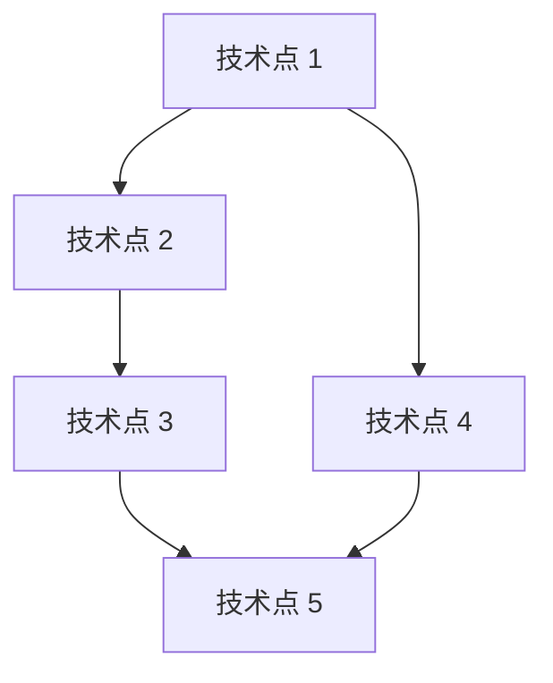

# 【Skill12+轻量化技术选型】输出产物

## 元信息

| 项目 | 内容 |
|-----|------|
| 所属 PlanID | {PlanID} |
| 所属阶段 | S3 - 技术可行性与选型阶段 |
| 前置依赖 Skill | Skill11-技术可行性评估（必需）、Skill7-需求风险识别（可选） |
| 产物唯一 ID | {PlanID}-S3-S12-001 |
| 生成时间 | {YYYY-MM-DD HH:mm:ss} |
| Skill 版本 | 2.0 |

---

## 一、技术选型概览

### 1.1 基本信息

| 项目 | 内容 |
|-----|------|
| 评估日期 | {YYYY-MM-DD} |
| 评估范围 | {技术选型覆盖的范围} |
| 评估方法 | {多维度对比 / 成本效益分析 / 专家评估} |
| 参与人员 | {架构师、技术负责人等} |

### 1.2 执行摘要

**评估背景**（200-300 字）：
{描述技术选型的背景、目的和重要性}

**评估过程**（150-200 字）：
{描述技术选型的过程、方法和主要活动}

**核心结论**（≤100 字）：
{总结技术选型的核心结论和关键决策}

### 1.3 关键数据统计

| 统计项 | 数值 |
|-------|------|
| 选型技术点总数 | {N} 个 |
| 总实施周期 | {N} PD |
| 总人力成本 | {金额} |
| 月运营成本 | {金额}/月 |
| 首年总成本 | {金额} |

### 1.4 质量评估

| 质量维度 | 得分 | 说明 |
|---------|------|------|
| 完整性（30%） | {分数}% | 技术点识别完整率 |
| 准确性（25%） | {分数}% | 评估得分计算准确率 |
| 一致性（20%） | {分数}% | 评估标准一致性 |
| 可读性（15%） | {分数}% | 结构清晰度 |
| 可追溯性（10%） | {分数}% | 关键结论可追溯率 |
| **质量综合得分** | **{综合得分}%** | **≥85% 为合格** |

---

## 二、技术需求分析

### 2.1 功能需求提取

| 功能模块 | 功能需求描述 | 相关技术点 | 优先级 |
|---------|------------|-----------|--------|
| {模块 1} | {需求描述} | {技术点} | {P0/P1/P2} |
| {模块 2} | {需求描述} | {技术点} | {P0/P1/P2} |

### 2.2 非功能需求提取

| 需求类型 | 需求描述 | 技术指标 | 优先级 |
|---------|---------|---------|--------|
| 性能需求 | {描述} | {并发量、响应时间等} | {P0/P1/P2} |
| 安全需求 | {描述} | {认证、授权、加密等} | {P0/P1/P2} |
| 可用性需求 | {描述} | {系统可用性指标} | {P0/P1/P2} |
| 可扩展性需求 | {描述} | {水平扩展、垂直扩展} | {P0/P1/P2} |
| 兼容性需求 | {描述} | {跨平台、跨浏览器等} | {P0/P1/P2} |

### 2.3 技术约束条件

| 约束类型 | 约束描述 | 影响分析 | 应对措施 |
|---------|---------|---------|---------|
| 时间约束 | {描述} | {影响分析} | {应对措施} |
| 预算约束 | {描述} | {影响分析} | {应对措施} |
| 人力约束 | {描述} | {影响分析} | {应对措施} |
| 技术约束 | {描述} | {影响分析} | {应对措施} |
| 合规约束 | {描述} | {影响分析} | {应对措施} |

---

## 三、技术点识别与分类

### 3.1 功能技术点

| 技术点 ID | 技术点名称 | 描述 | 所属模块 | 优先级 |
|---------|-----------|------|---------|--------|
| TP001 | {技术点名称} | {描述} | {模块} | {P0/P1/P2} |
| TP002 | {技术点名称} | {描述} | {模块} | {P0/P1/P2} |

### 3.2 非功能技术点

| 技术点 ID | 技术点名称 | 描述 | 类型 | 优先级 |
|---------|-----------|------|------|--------|
| TP003 | {技术点名称} | {描述} | {性能/安全/可用性等} | {P0/P1/P2} |
| TP004 | {技术点名称} | {描述} | {性能/安全/可用性等} | {P0/P1/P2} |

### 3.3 技术依赖

| 依赖 ID | 依赖类型 | 依赖描述 | 必要性 | 替代方案 |
|--------|---------|---------|--------|---------|
| TD001 | 第三方服务 | {描述} | {必需/可选} | {替代方案} |
| TD002 | 开源组件 | {描述} | {必需/可选} | {替代方案} |

### 3.4 技术点依赖关系图



---

## 四、候选方案对比

### 4.1 技术选型 TS001: {技术点名称}

#### 4.1.1 技术点描述

{详细描述技术点的功能需求、性能要求、使用场景等}

#### 4.1.2 候选方案清单

| 方案名称 | 方案描述 | 适用场景 | 优缺点 |
|---------|---------|---------|--------|
| {方案 A} | {描述} | {场景} | {优点/缺点} |
| {方案 B} | {描述} | {场景} | {优点/缺点} |
| {方案 C} | {描述} | {场景} | {优点/缺点} |

#### 4.1.3 多维度对比分析

| 评估维度 | 权重 | 方案 A | 方案 B | 方案 C |
|---------|------|--------|--------|--------|
| 技术成熟度 | 20% | {高/中/低} - {得分} | {高/中/低} - {得分} | {高/中/低} - {得分} |
| 团队熟悉度 | 25% | {高/中/低} - {得分} | {高/中/低} - {得分} | {高/中/低} - {得分} |
| 开发效率 | 20% | {高/中/低} - {得分} | {高/中/低} - {得分} | {高/中/低} - {得分} |
| 性能表现 | 15% | {高/中/低} - {得分} | {高/中/低} - {得分} | {高/中/低} - {得分} |
| 生态完善度 | 15% | {高/中/低} - {得分} | {高/中/低} - {得分} | {高/中/低} - {得分} |
| 成本控制 | 10% | {高/中/低} - {得分} | {高/中/低} - {得分} | {高/中/低} - {得分} |
| **综合得分** | **100%** | **{总分}** | **{总分}** | **{总分}** |

#### 4.1.4 评估维度详细说明

**技术成熟度**（20%）：
- 方案 A：{评估说明}
- 方案 B：{评估说明}
- 方案 C：{评估说明}

**团队熟悉度**（25%）：
- 方案 A：{评估说明}
- 方案 B：{评估说明}
- 方案 C：{评估说明}

**开发效率**（20%）：
- 方案 A：{评估说明}
- 方案 B：{评估说明}
- 方案 C：{评估说明}

**性能表现**（15%）：
- 方案 A：{评估说明}
- 方案 B：{评估说明}
- 方案 C：{评估说明}

**生态完善度**（15%）：
- 方案 A：{评估说明}
- 方案 B：{评估说明}
- 方案 C：{评估说明}

**成本控制**（10%）：
- 方案 A：{评估说明}
- 方案 B：{评估说明}
- 方案 C：{评估说明}

---

## 五、技术选型决策

### 5.1 推荐方案

**技术选型 TS001**：
- **推荐方案**：{方案名称}
- **综合得分**：{得分}
- **选型结论**：{完全可行/基本可行/部分可行/存在风险/暂不可行}

### 5.2 选型理由

1. **技术优势**：{理由 1}
2. **团队匹配**：{理由 2}
3. **成本效益**：{理由 3}
4. **生态支持**：{理由 4}
5. **长期发展**：{理由 5}

### 5.3 放弃方案说明

| 方案名称 | 放弃原因 | 替代方案 |
|---------|---------|---------|
| {方案} | {原因} | {替代方案} |
| {方案} | {原因} | {替代方案} |

### 5.4 关键决策点

| 决策点 | 选项 A | 选项 B | 最终选择 | 决策理由 |
|-------|-------|-------|---------|---------|
| {决策 1} | {选项} | {选项} | {选择} | {理由} |
| {决策 2} | {选项} | {选项} | {选择} | {理由} |

---

## 六、实施成本评估

### 6.1 人力成本

| 角色 | 工作量（PD） | 单价（元/PD） | 小计（元） | 说明 |
|-----|------------|-------------|----------|------|
| 架构师 | {N} PD | {单价} | {金额} | {工作内容} |
| 高级开发 | {N} PD | {单价} | {金额} | {工作内容} |
| 中级开发 | {N} PD | {单价} | {金额} | {工作内容} |
| 初级开发 | {N} PD | {单价} | {金额} | {工作内容} |
| **人力成本小计** | | | **{金额}** | |

### 6.2 第三方服务成本

| 服务名称 | 计费方式 | 单价 | 数量 | 小计（元/月） | 说明 |
|---------|---------|------|------|-------------|------|
| {服务 1} | {按量/包月} | {单价} | {数量} | {金额} | {说明} |
| {服务 2} | {按量/包月} | {单价} | {数量} | {金额} | {说明} |
| **第三方服务小计** | | | | **{金额}/月** | |

### 6.3 基础设施成本

| 资源名称 | 配置 | 单价 | 数量 | 小计（元/月） | 说明 |
|---------|------|------|------|-------------|------|
| {云服务器} | {配置} | {单价} | {数量} | {金额} | {说明} |
| {数据库} | {配置} | {单价} | {数量} | {金额} | {说明} |
| **基础设施小计** | | | | **{金额}/月** | |

### 6.4 许可费用

| 许可名称 | 许可类型 | 单价 | 数量 | 小计（元/年） | 说明 |
|---------|---------|------|------|-------------|------|
| {软件许可} | {商业/开源} | {单价} | {数量} | {金额} | {说明} |
| **许可费用小计** | | | | **{金额}/年** | |

### 6.5 成本汇总

| 成本类型 | 金额 | 说明 |
|---------|------|------|
| 首期开发成本 | {金额} | 人力成本 + 工具采购 + 培训成本 |
| 月度运营成本 | {金额}/月 | 第三方服务 + 基础设施 + 许可费用 |
| 首年总成本 | {金额} | 首期成本 + 月度运营成本×12 + 应急储备（10%） |

---

## 七、实施周期规划

### 7.1 总体时间线

```
月份：M1          M2          M3          M4          M5          M6
      │           │           │           │           │           │
阶段一：[═══════════] 基础技术准备
阶段二：              [═══════════════] 核心功能开发
阶段三：                              [═══════════════] 高级功能实现
阶段四：                                              [═══════════] 优化上线
      │           │           │           │           │           │
里程碑：M1.1        M2.1        M3.1        M4.1        M5.1        M6.1
      基础就绪     核心完成     联调测试     功能完成     优化完成     正式上线
```

### 7.2 详细排期

| 阶段 | 任务 | 工期 | 开始时间 | 结束时间 | 依赖 | 负责人 |
|-----|------|------|---------|---------|------|--------|
| 阶段一 | {任务 1} | {N} PD | {日期} | {日期} | {依赖} | {角色} |
| 阶段一 | {任务 2} | {N} PD | {日期} | {日期} | {依赖} | {角色} |
| 阶段二 | {任务 3} | {N} PD | {日期} | {日期} | {依赖} | {角色} |
| 阶段二 | {任务 4} | {N} PD | {日期} | {日期} | {依赖} | {角色} |
| 阶段三 | {任务 5} | {N} PD | {日期} | {日期} | {依赖} | {角色} |
| 阶段四 | {任务 6} | {N} PD | {日期} | {日期} | {依赖} | {角色} |

### 7.3 关键技术里程碑

| 里程碑 | 时间节点 | 交付物 | 验收标准 | 风险点 |
|-------|---------|--------|---------|--------|
| M1.1-基础就绪 | {日期} | {交付物} | {验收标准} | {风险点} |
| M2.1-核心完成 | {日期} | {交付物} | {验收标准} | {风险点} |
| M3.1-联调测试 | {日期} | {交付物} | {验收标准} | {风险点} |
| M4.1-功能完成 | {日期} | {交付物} | {验收标准} | {风险点} |
| M5.1-优化完成 | {日期} | {交付物} | {验收标准} | {风险点} |
| M6.1-正式上线 | {日期} | {交付物} | {验收标准} | {风险点} |

### 7.4 关键路径分析

```
关键路径：任务 1 → 任务 2 → 任务 3 → 任务 5 → 任务 6
总工期：{N} PD
缓冲时间：{N} PD（{百分比}%）
```

---

## 八、技术栈架构

### 8.1 技术栈架构图

```
┌─────────────────────────────────────────────────────────────┐
│                        前端层                                 │
│  ┌─────────────┐  ┌─────────────┐  ┌─────────────┐          │
│  │  {技术选型}  │  │  {技术选型}  │  │  {技术选型}  │          │
│  └─────────────┘  └─────────────┘  └─────────────┘          │
└─────────────────────────────────────────────────────────────┘
                              │
                              ▼
┌─────────────────────────────────────────────────────────────┐
│                       后端服务层                              │
│  ┌─────────────┐  ┌─────────────┐  ┌─────────────┐          │
│  │  {技术选型}  │  │  {技术选型}  │  │  {技术选型}  │          │
│  └─────────────┘  └─────────────┘  └─────────────┘          │
└─────────────────────────────────────────────────────────────┘
                              │
                              ▼
┌─────────────────────────────────────────────────────────────┐
│                       数据存储层                              │
│  ┌─────────────┐  ┌─────────────┐  ┌─────────────┐          │
│  │  {技术选型}  │  │  {技术选型}  │  │  {技术选型}  │          │
│  └─────────────┘  └─────────────┘  └─────────────┘          │
└─────────────────────────────────────────────────────────────┘
                              │
                              ▼
┌─────────────────────────────────────────────────────────────┐
│                       基础设施层                              │
│  ┌─────────────┐  ┌─────────────┐  ┌─────────────┐          │
│  │  {技术选型}  │  │  {技术选型}  │  │  {技术选型}  │          │
│  └─────────────┘  └─────────────┘  └─────────────┘          │
└─────────────────────────────────────────────────────────────┘
```

### 8.2 技术栈说明

**前端层**：
- {技术选型 1}：{说明}
- {技术选型 2}：{说明}

**后端服务层**：
- {技术选型 1}：{说明}
- {技术选型 2}：{说明}

**数据存储层**：
- {技术选型 1}：{说明}
- {技术选型 2}：{说明}

**基础设施层**：
- {技术选型 1}：{说明}
- {技术选型 2}：{说明}

---

## 九、风险评估与应对

### 9.1 技术选型相关风险

| 风险 ID | 风险描述 | 发生概率 | 影响程度 | 风险等级 | 应对措施 | 责任人 |
|--------|---------|---------|---------|---------|---------|--------|
| TR001 | {风险描述} | {高/中/低} | {高/中/低} | {高/中/低} | {应对措施} | {角色} |
| TR002 | {风险描述} | {高/中/低} | {高/中/低} | {高/中/低} | {应对措施} | {角色} |

### 9.2 成本超支风险

| 风险场景 | 触发条件 | 应对策略 | 预算储备 |
|---------|---------|---------|---------|
| {场景} | {条件} | {策略} | {金额} |
| {场景} | {条件} | {策略} | {金额} |

### 9.3 进度延期风险

| 风险场景 | 触发条件 | 应对策略 | 时间储备 |
|---------|---------|---------|---------|
| {场景} | {条件} | {策略} | {N} PD |
| {场景} | {条件} | {策略} | {N} PD |

### 9.4 技术风险矩阵

```
影响程度 ↑
         │
  灾难性 │  TR001    TR002    │  TR003    TR004
         │  高风险区        │  最高优先级
  严重   │  TR005    TR006    │  TR007    TR008
         │                  │
  中等   │  TR009    TR010    │  TR011    TR012
         │                  │
  轻微   │  TR013    TR014    │  TR015    TR016
         │  低风险区        │  中风险区
  可忽略 │  TR017    TR018    │  TR019    TR020
         └──────────────────┴──────────────────→ 发生概率
```

---

## 十、技术债务规划

### 10.1 技术债务清单

| 债务项 | 产生原因 | 影响 | 偿还计划 | 优先级 |
|-------|---------|------|---------|--------|
| {债务 1} | {原因} | {影响} | {计划} | {P0/P1/P2} |
| {债务 2} | {原因} | {影响} | {计划} | {P0/P1/P2} |

### 10.2 技术债务偿还时间表

| 债务项 | 计划偿还时间 | 预计工作量 | 验收标准 |
|-------|------------|-----------|---------|
| {债务 1} | {日期} | {N} PD | {验收标准} |
| {债务 2} | {日期} | {N} PD | {验收标准} |

---

## 十一、后续优化建议

### 11.1 短期优化（3 个月内）

1. {优化建议 1}
2. {优化建议 2}
3. {优化建议 3}

### 11.2 中期优化（3-6 个月）

1. {优化建议 1}
2. {优化建议 2}
3. {优化建议 3}

### 11.3 长期优化（6 个月以上）

1. {优化建议 1}
2. {优化建议 2}
3. {优化建议 3}

---

## 十二、技术选型总结

### 12.1 核心结论

{总结技术选型的核心结论和关键决策，200-300 字}

### 12.2 关键成功因素

1. {因素 1}
2. {因素 2}
3. {因素 3}

### 12.3 注意事项

1. {注意 1}
2. {注意 2}
3. {注意 3}

### 12.4 建议行动

**立即行动**：
- {行动 1}
- {行动 2}

**近期行动**：
- {行动 1}
- {行动 2}

**中长期规划**：
- {规划 1}
- {规划 2}

---

## 附录

### A. 评估依据

- 技术可行性评估产物 ID：{PlanID}-S3-S11-001
- 需求风险识别产物 ID：{PlanID}-S3-S07-001（可选）
- 评估时间：{YYYY-MM-DD HH:mm}
- 评估方法：{多维度对比 / 成本效益分析 / 专家评估}
- 评估工具：{工具名称}

### B. 术语表

| 术语 | 说明 |
|-----|------|
| PD | 人天（Person Day），工作量单位 |
| TCO | 总拥有成本（Total Cost of Ownership） |
| 技术债务 | 为快速交付而采取的临时技术方案，需要后续偿还 |
| 技术栈 | 一系列技术组合，用于构建完整的技术解决方案 |

### C. 成本参考标准

| 角色 | 人天成本 | 说明 |
|-----|---------|------|
| 初级开发 | 500-800 元 | 1-3 年经验 |
| 中级开发 | 800-1500 元 | 3-5 年经验 |
| 高级开发 | 1500-2500 元 | 5 年以上经验 |
| 架构师 | 2500-4000 元 | 技术专家 |

### E. 实施周期参考

| 功能复杂度 | 实施周期 | 说明 |
|-----------|---------|------|
| 简单功能 | 3-5 PD | 常规开发，无技术难点 |
| 中等功能 | 5-10 PD | 有一定复杂度，需要设计 |
| 复杂功能 | 10-20 PD | 技术难度较高，需要专项研究 |
| 困难功能 | 20-40 PD | 技术挑战大，可能需要突破 |
| 极难功能 | 40+ PD | 前沿技术，不确定性高 |

---
