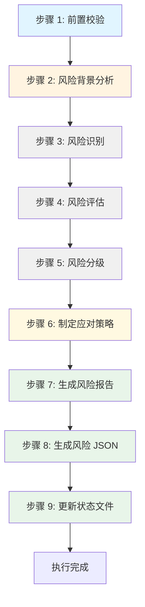
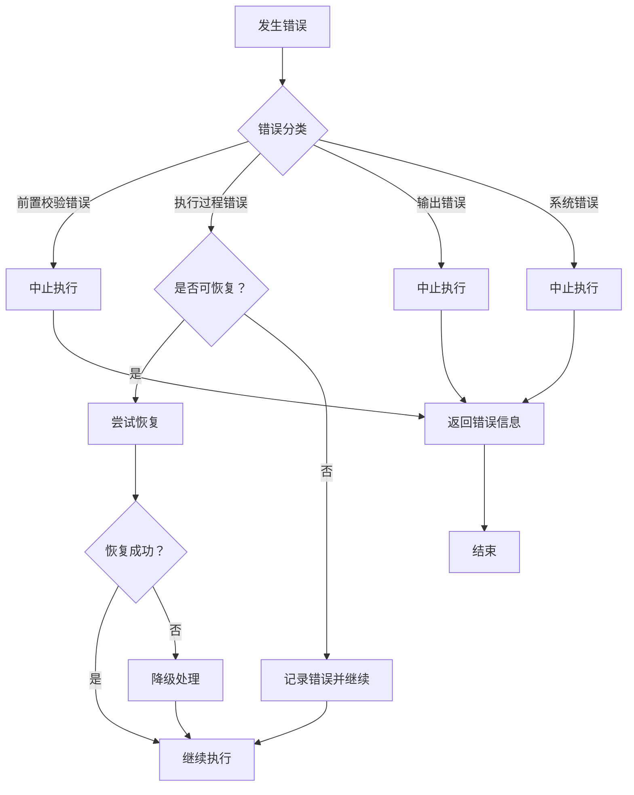

# Skill7: 需求风险识别

## 一、元信息

| 项目 | 内容 |
|-----|------|
| **Skill 编号** | S3-S07 |
| **Skill 名称** | 需求风险识别 |
| **英文名称** | Requirement Risk Identification |
| **所属阶段** | S3 - 技术可行性与选型阶段 |
| **执行顺序** | S3 阶段第 1 个执行（S3 阶段入口 Skill） |
| **执行模式** | 常规模式执行，轻量化模式可选执行 |
| **执行 Agent** | Executor Agent |
| **版本号** | 2.0（标准化版本） |
| **最后更新** | 2026-03-24 |
| **质量等级** | 生产级（Production-Ready） |

### 依赖关系

| 依赖类型 | 依赖对象 | 依赖内容 | 必要性 |
|---------|---------|---------|--------|
| **前置 Skill** | Skill10-市场痛点验证 | 市场痛点验证报告、市场价值校验清单 | 必需 |
| **前置 Skill** | Skill9-竞品分析 | 竞品分析报告、竞品分析结果 | 必需 |
| **前置 Skill** | Skill4-需求验证 | 需求验证报告、需求清单 | 必需 |
| **后置 Skill** | Skill11-技术可行性评估 | 技术可行性评估报告 | 依赖本 Skill 输出 |
| **后置 Skill** | Skill6-需求优先级排序 | 需求优先级排序结果 | 参考本 Skill 风险等级 |
| **后置 Skill** | Skill12-轻量化技术选型 | 技术选型方案 | 参考本 Skill 技术风险 |

### 输入规范

| 输入类型 | 文件格式 | 文件路径 | 说明 |
|---------|---------|---------|------|
| Plan 定义文件 | `plan.json` | `database/plans/{PlanID}/plan.json` | Plan 基本信息、项目目标、约束条件 |
| 市场痛点验证报告 | Markdown | `database/stages/s2/{PlanID}/{PlanID}-S2-S10-001-validation.md` | Skill10 产物，包含市场痛点验证详情 |
| 市场痛点验证 JSON | JSON | `database/stages/s2/{PlanID}/{PlanID}-S2-S10-001-validation.json` | Skill10 结构化数据 |
| 竞品分析报告 | Markdown | `database/stages/s2/{PlanID}/{PlanID}-S2-S09-001-analysis.md` | Skill9 产物，包含竞品分析详情 |
| 竞品分析 JSON | JSON | `database/stages/s2/{PlanID}/{PlanID}-S2-S09-001-analysis.json` | Skill9 结构化数据 |
| 需求验证报告 | Markdown | `database/stages/s1/{PlanID}/{PlanID}-S1-S04-001-validation.md` | Skill4 产物，包含需求验证详情 |
| 需求验证 JSON | JSON | `database/stages/s1/{PlanID}/{PlanID}-S1-S04-001-validation.json` | Skill4 结构化数据 |

### 输出规范

| 输出类型 | 文件格式 | 文件路径 | 产物 ID | 说明 |
|---------|---------|---------|--------|------|
| 需求风险识别报告 | Markdown | `database/stages/s3/{PlanID}/{PlanID}-S3-S07-001-risk.md` | `{PlanID}-S3-S07-001-RISK` | 详细的风险识别报告 |
| 需求风险清单 JSON | JSON | `database/stages/s3/{PlanID}/{PlanID}-S3-S07-001-risk.json` | `{PlanID}-S3-S07-001-DATA` | 结构化风险数据 |
| 状态更新 | JSON | `database/plans/{PlanID}/status.json` | - | 更新 S3 阶段执行状态 |

### 产物 ID 命名规则

**格式**：`{PlanID}-S3-S07-001-{类型}`

**示例**：
- `P000001-S3-S07-001-RISK` - 需求风险识别报告
- `P000001-S3-S07-001-DATA` - 需求风险清单 JSON

---

## 二、功能描述

### 核心职责

Skill7 负责从技术、需求、资源、外部、合规等 5 个维度全面识别和评估需求实现过程中的各类风险，为项目决策提供风险依据。具体包括：

1. **风险识别**：从需求和市场分析中识别潜在风险点（技术/需求/资源/外部/合规）
2. **风险评估**：评估每个风险的发生概率、影响程度、风险等级
3. **风险分类**：按风险类型、等级、紧急程度进行分类整理
4. **风险应对**：制定针对性的风险应对策略和建议
5. **风险监控**：建立风险监控指标和预警机制

### 功能边界

**包含**：
- ✅ 识别技术实现相关的技术风险
- ✅ 识别需求定义和变更相关的需求风险
- ✅ 识别人力、时间、预算相关的资源风险
- ✅ 识别政策、市场、竞争相关的外部风险
- ✅ 识别法律法规、行业标准相关的合规风险
- ✅ 评估风险等级（高/中/低）
- ✅ 制定风险应对策略
- ✅ 建立风险监控机制

**不包含**：
- ❌ 技术可行性深度评估（由 Skill11 负责）
- ❌ 技术方案选型（由 Skill12 负责）
- ❌ 需求优先级排序（由 Skill6 负责）
- ❌ 风险应对措施的具体执行（由项目执行团队负责）

### 使用场景

| 场景 | 说明 | 触发条件 |
|-----|------|---------|
| S3 阶段启动 | 完成 S2 阶段后进入 S3 阶段，首先执行 Skill7 | S2 阶段产物校验通过 |
| 重大需求变更 | 项目执行过程中需求发生重大变更 | 需求变更影响评估触发 |
| 项目风险复盘 | 项目阶段性复盘，重新评估风险状态 | 项目里程碑节点 |
| 风险预警触发 | 风险监控指标触发预警 | 风险状态变化超过阈值 |

---

## 三、执行流程

### 流程概览



### 详细步骤

#### 步骤 1: 前置校验

**目标**：验证输入文件的完整性和有效性

**操作**：
1. 检查 Plan 定义文件是否存在且格式正确
2. 检查 Skill10 市场痛点验证报告是否存在
3. 检查 Skill9 竞品分析报告是否存在
4. 检查 Skill4 需求验证报告是否存在
5. 验证所有输入文件的 JSON Schema 合规性

**验证规则**：
- 所有必需文件必须存在
- 文件格式必须正确（Markdown + JSON 配对）
- 关键数据字段不能缺失

**错误处理**：
- 文件缺失 → 返回 E001 错误，提示先完成前置 Skill
- 格式错误 → 返回 E002 错误，提示重新生成前置产物
- 数据不完整 → 返回 E003 错误，提示补充缺失数据

#### 步骤 2: 风险背景分析

**目标**：全面理解项目背景、目标、约束条件

**操作**：
1. 读取 Plan 定义文件，理解项目目标和范围
2. 分析市场痛点验证报告，识别市场相关风险因素
3. 分析竞品分析报告，识别竞争相关风险因素
4. 分析需求验证报告，识别需求相关风险因素
5. 提取项目约束条件（时间、预算、人力、技术）

**输出**：
- 项目背景摘要（300-500 字）
- 关键约束条件清单
- 风险识别重点关注领域

#### 步骤 3: 风险识别

**目标**：从 5 大维度全面识别潜在风险点

**操作**：

**3.1 技术风险识别**（使用检查清单）：
- [ ] 是否使用了未经验证的新技术？
- [ ] 技术栈是否成熟稳定？
- [ ] 团队是否具备相关技术能力？
- [ ] 是否存在性能瓶颈风险？
- [ ] 是否存在安全漏洞风险？
- [ ] 第三方依赖是否稳定可靠？
- [ ] 技术实现复杂度是否过高？
- [ ] 是否存在技术债务累积风险？

**3.2 需求风险识别**（使用检查清单）：
- [ ] 需求描述是否清晰明确？
- [ ] 是否存在需求冲突或矛盾？
- [ ] 需求变更频率是否可能较高？
- [ ] 隐性需求是否充分挖掘？
- [ ] 用户期望是否过于理想化？
- [ ] 需求优先级是否明确？
- [ ] 需求范围是否可控？

**3.3 资源风险识别**（使用检查清单）：
- [ ] 团队规模是否充足？
- [ ] 交付时间是否合理？
- [ ] 预算是否充分考虑风险储备？
- [ ] 关键岗位人员是否稳定？
- [ ] 是否有外部资源依赖？
- [ ] 资源调配是否灵活？

**3.4 外部风险识别**（使用检查清单）：
- [ ] 相关政策法规是否稳定？
- [ ] 市场竞争态势是否明确？
- [ ] 供应链/合作方是否稳定？
- [ ] 经济环境是否可能影响项目？
- [ ] 行业标准是否发生变化？
- [ ] 用户偏好是否可能改变？

**3.5 合规风险识别**（使用检查清单）：
- [ ] 是否符合相关法律法规？
- [ ] 是否需要特定资质许可？
- [ ] 是否符合行业标准规范？
- [ ] 数据隐私保护是否合规？
- [ ] 知识产权是否清晰？
- [ ] 安全合规要求是否满足？

**输出**：
- 初始风险清单（包含所有识别出的风险点）

#### 步骤 4: 风险评估

**目标**：对每个识别出的风险进行量化评估

**操作**：

**4.1 发生概率评估**（5 级）：

| 等级 | 数值范围 | 说明 | 判定标准 |
|-----|---------|------|---------|
| 极高 | 90%-100% | 几乎必然发生 | 有明确证据表明必然发生 |
| 高 | 70%-89% | 很可能发生 | 有充分证据表明很可能发生 |
| 中 | 30%-69% | 可能发生 | 有一定证据表明可能发生 |
| 低 | 10%-29% | 不太可能发生 | 证据表明发生可能性较低 |
| 极低 | 0%-9% | 几乎不可能发生 | 几乎没有发生的可能性 |

**4.2 影响程度评估**（5 级）：

| 等级 | 说明 | 判定标准 | 示例 |
|-----|------|---------|------|
| 灾难性 | 导致项目失败或重大损失 | 项目无法继续或损失>50% | 核心技术无法实现、关键资质无法获取 |
| 严重 | 显著影响项目进度或质量 | 延期>3 个月或损失 20%-50% | 关键功能延期、核心人员流失 |
| 中等 | 对项目有一定影响 | 延期 1-3 个月或损失 5%-20% | 部分功能调整、预算小幅超支 |
| 轻微 | 影响较小，易于解决 | 延期<1 个月或损失<5% | UI 细节优化、文档调整 |
| 可忽略 | 几乎无影响 | 影响可忽略不计 | 格式调整、非关键细节优化 |

**4.3 风险等级计算**：

**风险等级矩阵**：

| 影响程度 ↓ \\ 发生概率 → | 极低 (0-9%) | 低 (10-29%) | 中 (30-69%) | 高 (70-89%) | 极高 (90-100%) |
|------------------------|:----------:|:----------:|:----------:|:----------:|:-------------:|
| **灾难性** | 中 | 高 | 高 | 高 | 高 |
| **严重** | 低 | 中 | 高 | 高 | 高 |
| **中等** | 低 | 低 | 中 | 中 | 高 |
| **轻微** | 低 | 低 | 低 | 低 | 中 |
| **可忽略** | 低 | 低 | 低 | 低 | 低 |

**判定规则**：
- **高风险（HIGH）**：发生概率≥70% 或 影响程度≥严重 → P0 优先级，必须立即处理
- **中风险（MEDIUM）**：发生概率 30%-70% 或 影响程度=中等 → P1 优先级，需要关注处理
- **低风险（LOW）**：发生概率<30% 且 影响程度≤轻微 → P2 优先级，常规监控

**输出**：
- 已评估风险清单（包含概率、影响、等级）

#### 步骤 5: 风险分级

**目标**：按风险等级和类型对风险进行分类整理

**操作**：
1. 按风险等级分组：高风险组、中风险组、低风险组
2. 按风险类型分组：技术风险、需求风险、资源风险、外部风险、合规风险
3. 按紧急程度排序：同一等级内按发生概率降序排列
4. 生成风险统计摘要

**输出**：
- 分级风险清单
- 风险统计摘要（总数、各等级数量、各类型数量）

#### 步骤 6: 制定应对策略

**目标**：为每个风险制定针对性的应对策略

**操作**：

**6.1 风险应对策略选择**（4 种策略）：

| 策略 | 说明 | 适用场景 | 示例 |
|-----|------|---------|------|
| **风险规避** | 改变计划以消除风险 | 高风险且无法承受后果 | 放弃使用未经验证的新技术 |
| **风险转移** | 将风险转移给第三方 | 风险可转移且有合适承接方 | 购买保险、外包高风险模块 |
| **风险缓解** | 采取措施降低风险概率或影响 | 大多数中高风险 | 提前技术培训、增加测试覆盖 |
| **风险接受** | 接受风险并准备应急储备 | 低风险或应对成本过高 | 建立风险储备金、制定应急预案 |

**6.2 制定具体应对措施**：

对每个风险，制定：
- **预防措施**：降低发生概率的措施
- **应急措施**：风险发生后的应对措施
- **监控指标**：用于监控风险状态的指标
- **触发条件**：启动应急措施的阈值
- **负责人**：建议的风险负责人角色
- **资源需求**：应对风险所需资源

**输出**：
- 风险应对措施清单

#### 步骤 7: 生成风险报告

**目标**：生成完整的风险识别报告（Markdown 格式）

**操作**：
1. 按照 [template.md](template.md) 格式组织报告内容
2. 填写所有必需章节（10 个核心章节）
3. 生成风险矩阵可视化图表
4. 添加关键风险提示和应对建议
5. 质量自检（完整性、准确性、一致性）

**验证规则**：
- 所有章节必须完整
- 数据必须准确一致
- 格式必须符合模板规范

**错误处理**：
- 报告生成失败 → 返回 E201 错误，记录详细错误信息

#### 步骤 8: 生成风险 JSON

**目标**：生成结构化的风险数据（JSON 格式）

**操作**：
1. 按照 JSON Schema 定义组织数据结构
2. 填充所有必需字段
3. 验证 JSON Schema 合规性
4. 保存到指定路径

**JSON Schema 核心结构**：
```json
{
  "$schema": "http://json-schema.org/draft-07/schema#",
  "type": "object",
  "properties": {
    "metadata": { ... },
    "riskOverview": { ... },
    "risks": { ... },
    "statistics": { ... },
    "recommendations": { ... }
  }
}
```

**验证规则**：
- 必须符合 JSON Schema 定义
- 所有必需字段不能缺失
- 枚举值必须合法

**错误处理**：
- JSON 生成失败 → 返回 E202 错误
- Schema 验证失败 → 返回 E203 错误

#### 步骤 9: 更新状态文件

**目标**：更新 Plan 执行状态，标记 S3-S07 完成

**操作**：
1. 读取 `database/plans/{PlanID}/status.json`
2. 更新 S3-S07 状态为 `completed`
3. 记录完成时间、产物路径
4. 设置下一 Skill（S3-S11）为 `ready`
5. 写回状态文件

**错误处理**：
- 状态更新失败 → 返回 E204 错误，但风险识别结果仍然有效

---

## 四、产物规范

### 产物 1: 需求风险识别报告

**文件路径**：`database/stages/s3/{PlanID}/{PlanID}-S3-S07-001-risk.md`

**产物 ID**：`{PlanID}-S3-S07-001-RISK`

**版本**：2.0（标准化版本）

**内容结构**：参见 [template.md](template.md)

**核心章节**（10 个必需章节）：

| 章节 | 标题 | 内容说明 | 必填 |
|-----|------|---------|------|
| 一 | 风险识别概览 | 基本信息、执行摘要、质量评估、关键数据统计 | 是 |
| 二 | 风险背景分析 | 项目背景、约束条件、重点关注领域 | 是 |
| 三 | 风险识别方法与过程 | 识别方法、识别过程、检查清单执行情况 | 是 |
| 四 | 高风险项清单（HIGH） | 所有高风险项的详细信息 | 是 |
| 五 | 中风险项清单（MEDIUM） | 所有中风险项的详细信息 | 是 |
| 六 | 低风险项清单（LOW） | 所有低风险项的详细信息 | 是 |
| 七 | 风险类型分析 | 按 5 大风险类型分别分析 | 是 |
| 八 | 风险应对优先级矩阵 | 风险矩阵可视化、优先级排序 | 是 |
| 九 | 关键风险监控指标 | 监控指标、阈值、触发行动 | 是 |
| 十 | 后续建议与附录 | 对后续 Skill 的输入、风险提示、附录 | 是 |

**质量要求**：
- 完整性：所有章节完整，无遗漏
- 准确性：风险评估客观准确，有依据支撑
- 一致性：评估标准统一，结论无矛盾
- 可读性：结构清晰，表达准确，易于理解
- 可追溯性：关键结论可追溯到数据来源

### 产物 2: 需求风险清单 JSON

**文件路径**：`database/stages/s3/{PlanID}/{PlanID}-S3-S07-001-risk.json`

**产物 ID**：`{PlanID}-S3-S07-001-DATA`

**版本**：2.0（标准化版本）

**JSON Schema 定义**：

```json
{
  "$schema": "http://json-schema.org/draft-07/schema#",
  "title": "需求风险清单 Schema",
  "type": "object",
  "properties": {
    "metadata": {
      "type": "object",
      "properties": {
        "planId": {"type": "string"},
        "artifactId": {"type": "string"},
        "skillId": {"type": "string"},
        "stage": {"type": "string"},
        "version": {"type": "string"},
        "generatedAt": {"type": "string", "format": "date-time"},
        "generatedBy": {"type": "string"}
      },
      "required": ["planId", "artifactId", "skillId", "stage", "version", "generatedAt"]
    },
    "riskOverview": {
      "type": "object",
      "properties": {
        "totalRisks": {"type": "integer"},
        "highRisks": {"type": "integer"},
        "mediumRisks": {"type": "integer"},
        "lowRisks": {"type": "integer"},
        "riskByType": {
          "type": "object",
          "properties": {
            "technical": {"type": "integer"},
            "requirement": {"type": "integer"},
            "resource": {"type": "integer"},
            "external": {"type": "integer"},
            "compliance": {"type": "integer"}
          }
        },
        "qualityScore": {"type": "number", "minimum": 0, "maximum": 100}
      },
      "required": ["totalRisks", "highRisks", "mediumRisks", "lowRisks", "riskByType"]
    },
    "risks": {
      "type": "array",
      "items": {
        "type": "object",
        "properties": {
          "riskId": {"type": "string"},
          "riskType": {"type": "string", "enum": ["TECH", "REQ", "RES", "EXT", "COM"]},
          "description": {"type": "string"},
          "probability": {"type": "string", "enum": ["极高", "高", "中", "低", "极低"]},
          "probabilityValue": {"type": "number", "minimum": 0, "maximum": 100},
          "impact": {"type": "string", "enum": ["灾难性", "严重", "中等", "轻微", "可忽略"]},
          "riskLevel": {"type": "string", "enum": ["HIGH", "MEDIUM", "LOW"]},
          "priority": {"type": "string", "enum": ["P0", "P1", "P2"]},
          "responseStrategy": {"type": "string", "enum": ["规避", "转移", "缓解", "接受"]},
          "preventiveMeasures": {"type": "string"},
          "contingencyMeasures": {"type": "string"},
          "monitoringIndicator": {"type": "string"},
          "triggerCondition": {"type": "string"},
          "owner": {"type": "string"},
          "status": {"type": "string", "enum": ["活跃", "已缓解", "已关闭"], "default": "活跃"}
        },
        "required": ["riskId", "riskType", "description", "probability", "impact", "riskLevel"]
      },
      "minItems": 1
    },
    "statistics": {
      "type": "object",
      "properties": {
        "byType": {
          "type": "object",
          "additionalProperties": {"type": "integer"}
        },
        "byLevel": {
          "type": "object",
          "additionalProperties": {"type": "integer"}
        },
        "byPriority": {
          "type": "object",
          "additionalProperties": {"type": "integer"}
        }
      }
    },
    "recommendations": {
      "type": "array",
      "items": {"type": "string"}
    }
  },
  "required": ["metadata", "riskOverview", "risks"]
}
```

### 产物 3: 状态更新

**文件路径**：`database/plans/{PlanID}/status.json`

**更新内容**：

```json
{
  "stages": {
    "s3": {
      "status": "in_progress",
      "skills": {
        "S07": {
          "status": "completed",
          "completedAt": "{timestamp}",
          "artifacts": [
            "{PlanID}-S3-S07-001-RISK",
            "{PlanID}-S3-S07-001-DATA"
          ]
        },
        "S11": {
          "status": "ready"
        }
      }
    }
  }
}
```

---

## 五、质量标准

### 质量评估框架（采用 ISO/IEC 25010）

| 质量特性 | 权重 | 评估标准 | 评分方法 |
|---------|------|---------|---------|
| **完整性** | 30% | 所有关键风险都已识别，无重大遗漏 | 检查清单覆盖率、风险覆盖度 |
| **准确性** | 25% | 风险评估客观准确，有充分依据支撑 | 评估依据充分性、逻辑一致性 |
| **一致性** | 20% | 评估标准统一，结论无矛盾 | 标准执行一致性、结论无冲突 |
| **可读性** | 15% | 结构清晰，表达准确，易于理解 | 结构清晰度、表达准确性 |
| **可追溯性** | 10% | 关键结论可追溯到数据来源 | 数据溯源完整性 |

### 检查清单

#### 完整性检查（权重 30%）

- [ ] 5 大风险类型都已覆盖（技术/需求/资源/外部/合规）
- [ ] 所有高风险项都有详细记录和应对策略
- [ ] 风险识别方法说明完整
- [ ] 风险评估过程记录完整
- [ ] 风险应对措施针对每个风险都已制定
- [ ] 风险监控指标已建立
- [ ] 对后续 Skill 的输入建议完整

**评分标准**：
- 7 项全部满足 → 100 分
- 6 项满足 → 85 分
- 5 项满足 → 70 分
- 4 项满足 → 50 分
- 3 项及以下 → 不及格

#### 准确性检查（权重 25%）

- [ ] 每个风险的概率评估有依据支撑
- [ ] 每个风险的影响评估有依据支撑
- [ ] 风险等级计算符合矩阵规则
- [ ] 风险应对策略与风险等级匹配
- [ ] 无主观臆断或夸大其词

**评分标准**：
- 5 项全部满足 → 100 分
- 4 项满足 → 80 分
- 3 项满足 → 60 分
- 2 项及以下 → 不及格

#### 一致性检查（权重 20%）

- [ ] 所有风险使用统一的评估标准
- [ ] 枚举值使用符合规范定义
- [ ] 风险等级与概率/影响匹配一致
- [ ] 术语使用统一规范
- [ ] 不同章节的数据一致

**评分标准**：
- 5 项全部满足 → 100 分
- 4 项满足 → 80 分
- 3 项满足 → 60 分
- 2 项及以下 → 不及格

#### 可读性检查（权重 15%）

- [ ] 报告结构清晰，章节层次分明
- [ ] 表格使用规范，数据清晰
- [ ] 语言表达准确，无歧义
- [ ] 风险矩阵可视化清晰易懂
- [ ] 关键信息突出显示

**评分标准**：
- 5 项全部满足 → 100 分
- 4 项满足 → 80 分
- 3 项满足 → 60 分
- 2 项及以下 → 不及格

#### 可追溯性检查（权重 10%）

- [ ] 关键风险结论可追溯到输入数据
- [ ] 引用了前置 Skill 的相关产物
- [ ] 风险评估依据明确标注
- [ ] 数据来源清晰可查

**评分标准**：
- 4 项全部满足 → 100 分
- 3 项满足 → 75 分
- 2 项满足 → 50 分
- 1 项及以下 → 不及格

### 质量综合得分计算

**公式**：
```
质量综合得分 = 完整性×30% + 准确性×25% + 一致性×20% + 可读性×15% + 可追溯性×10%
```

**质量等级**：
- **优秀**：≥ 90 分
- **良好**：80-89 分
- **合格**：70-79 分
- **不合格**：< 70 分

**验收标准**：质量综合得分 ≥ 85%

### 验收标准

#### 功能性验收

- [ ] **风险识别完整性**：5 大风险类型都已覆盖，无重大遗漏
- [ ] **风险评估准确性**：概率和影响评估有依据，等级计算正确
- [ ] **应对策略有效性**：每个风险都有针对性的应对策略
- [ ] **产物格式合规**：Markdown 报告和 JSON 数据都符合模板和 Schema
- [ ] **状态更新正确**：Plan 状态文件正确更新

#### 性能验收

- [ ] **执行时间**：单次执行时间 < 10 分钟
- [ ] **风险识别数量**：识别风险总数 ≥ 5 项（根据项目复杂度）
- [ ] **高风险识别率**：关键高风险识别率 100%

#### 质量验收

- [ ] **质量综合得分**：≥ 85%
- [ ] **Validator 校验通过率**：100%
- [ ] **用户满意度**：用户对风险识别结果的认可度 ≥ 80%

---

## 六、错误处理

### 错误分类

| 错误类别 | 错误码范围 | 说明 | 处理策略 |
|---------|-----------|------|---------|
| **前置校验错误** | E001-E099 | 输入文件、依赖产物校验失败 | 中止执行，返回错误信息 |
| **执行过程错误** | E100-E199 | 风险识别、评估过程错误 | 尝试恢复，记录错误 |
| **输出错误** | E200-E299 | 报告生成、JSON 生成错误 | 中止执行，返回错误信息 |
| **系统错误** | E900-E999 | 文件读写、磁盘空间等系统错误 | 中止执行，记录日志 |

### 错误代码表

#### 前置校验错误（E001-E099）

| 错误码 | 错误名称 | 错误描述 | 处理策略 |
|-------|---------|---------|---------|
| E001 | 前置产物缺失 | 前置 Skill 产物不存在 | 提示先完成 S2 阶段 Skill |
| E002 | 输入文件格式错误 | 输入文件格式不符合规范 | 提示重新生成前置产物 |
| E003 | 需求数据不完整 | 需求关键数据缺失 | 提示补充缺失数据 |
| E004 | 市场数据不完整 | 市场痛点验证数据缺失 | 提示补充市场验证数据 |
| E005 | 竞品数据不完整 | 竞品分析数据缺失 | 提示补充竞品分析数据 |
| E006 | Plan 定义文件缺失 | Plan 定义文件不存在 | 提示创建 Plan 定义文件 |
| E007 | 输入文件路径错误 | 文件路径不存在或无法访问 | 检查路径配置 |

#### 执行过程错误（E100-E199）

| 错误码 | 错误名称 | 错误描述 | 处理策略 |
|-------|---------|---------|---------|
| E101 | 风险识别不完整 | 未覆盖所有 5 大风险类型 | 补充识别遗漏的风险类型 |
| E102 | 风险评估数据不足 | 缺乏足够的评估依据 | 补充分析相关数据 |
| E103 | 风险等级计算错误 | 风险等级与概率/影响不匹配 | 重新计算风险等级 |
| E104 | 应对策略缺失 | 部分风险未制定应对策略 | 补充应对策略 |
| E105 | 风险类型分类错误 | 风险类型不符合枚举定义 | 修正风险类型 |

#### 输出错误（E200-E299）

| 错误码 | 错误名称 | 错误描述 | 处理策略 |
|-------|---------|---------|---------|
| E201 | 报告生成失败 | 无法生成 Markdown 报告 | 检查模板文件，记录详细错误 |
| E202 | JSON 生成失败 | 无法生成 JSON 数据文件 | 检查数据结构，记录详细错误 |
| E203 | JSON Schema 验证失败 | JSON 数据不符合 Schema 定义 | 修正数据字段 |
| E204 | 状态更新失败 | 无法更新 Plan 状态文件 | 重试或手动更新状态 |
| E205 | 文件保存失败 | 无法保存输出文件 | 检查文件权限和磁盘空间 |

#### 系统错误（E900-E999）

| 错误码 | 错误名称 | 错误描述 | 处理策略 |
|-------|---------|---------|---------|
| E901 | 文件读写错误 | 无法读取或写入文件 | 检查文件权限，重试 |
| E902 | 目录创建失败 | 无法创建输出目录 | 检查目录权限 |
| E903 | 磁盘空间不足 | 磁盘空间不足以保存文件 | 清理磁盘空间 |
| E904 | 网络连接错误 | 需要访问外部资源时失败 | 检查网络连接，重试 |

### 错误处理流程



### 错误恢复机制

**可恢复错误**：
- E101 风险识别不完整 → 补充识别后继续
- E102 风险评估数据不足 → 使用默认值或保守估计
- E104 应对策略缺失 → 使用通用应对策略
- E901 文件读写错误 → 重试 3 次

**不可恢复错误**：
- E001-E007 前置校验错误 → 必须修正输入后重新执行
- E201-E203 输出错误 → 必须修正模板或数据后重新执行
- E902-E904 系统错误 → 必须解决系统问题后重新执行

### 错误日志记录

**日志格式**：
```
[时间戳] [错误级别] [错误码] [Skill 编号] 错误描述
  - PlanID: {PlanID}
  - 文件路径：{path}
  - 详细信息：{details}
  - 建议操作：{suggestion}
```

**错误级别**：
- **ERROR**：导致执行中止的错误
- **WARNING**：不影响执行但需要关注的错误
- **INFO**：错误恢复成功的记录

---

## 附录 A: 术语表

| 术语 | 英文 | 定义 |
|-----|------|------|
| 风险 | Risk | 对未来事件的不确定性，可能对项目目标产生负面影响 |
| 风险识别 | Risk Identification | 发现、识别和记录风险的过程 |
| 风险评估 | Risk Assessment | 对风险发生概率和影响程度进行分析评估的过程 |
| 风险等级 | Risk Level | 根据概率和影响综合评定的风险级别（高/中/低） |
| 风险应对 | Risk Response | 针对风险制定的策略和措施 |
| 风险监控 | Risk Monitoring | 持续跟踪已识别风险、监测新风险的过程 |
| 技术风险 | Technical Risk | 与技术实现相关的风险 |
| 需求风险 | Requirement Risk | 与需求定义、变更相关的风险 |
| 资源风险 | Resource Risk | 与人力、时间、预算等资源相关的风险 |
| 外部风险 | External Risk | 与外部环境相关的风险 |
| 合规风险 | Compliance Risk | 与法律法规、标准规范相关的风险 |

## 附录 B: 参考文档

- [template.md](template.md) - Skill7 输出模板
- [WORKFLOW.md](../../../WORKFLOW.md) - 主工作流程文档
- [Plan.md](../../../Plan.md) - 项目实施计划
- IEEE 31000-2019 - 风险管理标准
- PMBOK Guide - 项目管理知识体系指南（风险管理章节）

## 附录 C: 版本历史

| 版本 | 日期 | 更新内容 | 更新人 |
|-----|------|---------|--------|
| 1.0 | 2026-03-24 | 初始版本，定义 Skill7 完整规范 | AI Assistant |
| 2.0 | 2026-03-24 | 标准化优化版本：<br>- 采用 6 段式标准结构<br>- 统一风险识别框架（5 大维度）<br>- 统一风险评估标准（概率/影响/等级）<br>- 统一风险应对策略（4 种策略）<br>- 完善质量标准（ISO/IEC 25010）<br>- 完善错误处理机制<br>- 添加 JSON Schema 定义 | AI Assistant |

---

*Skill7 定义文档 | 版本 2.0 | 最后更新：2026-03-24*
