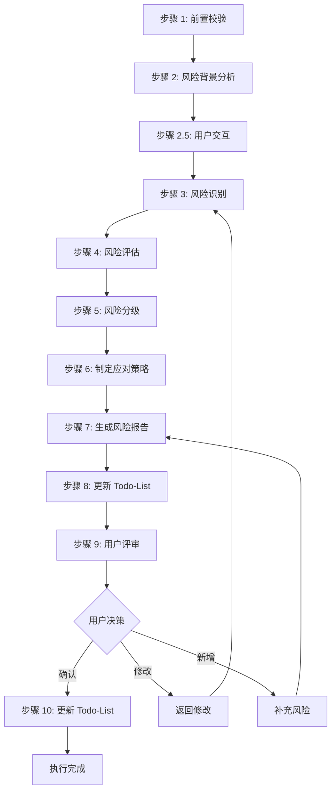
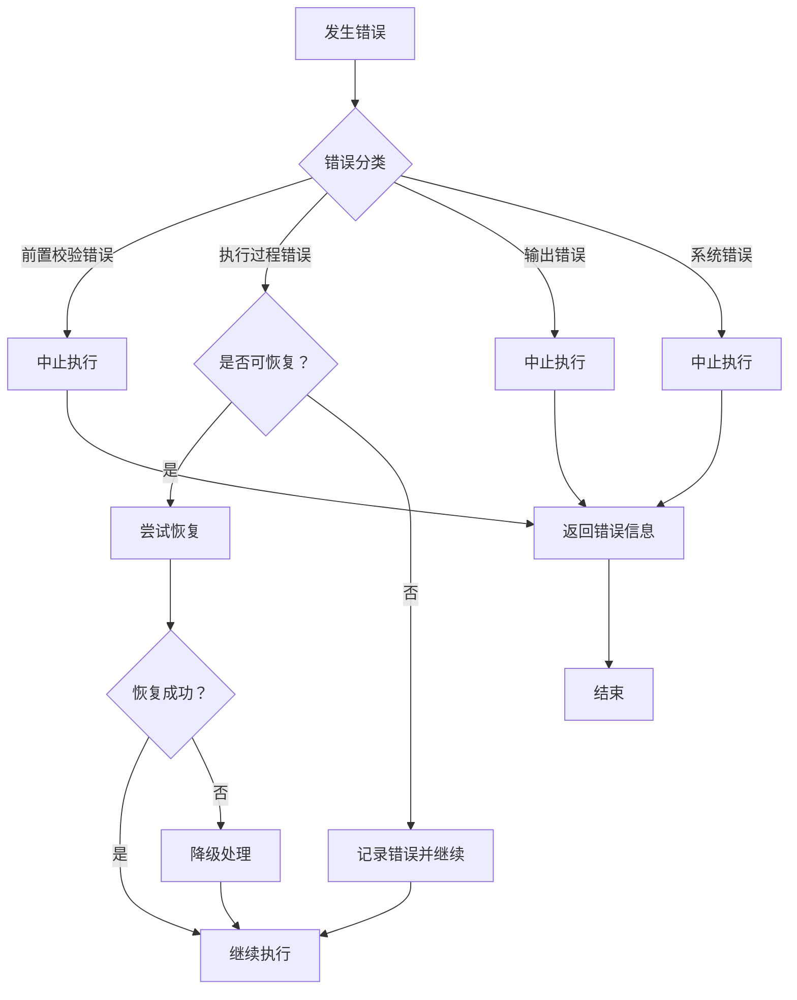

# Skill7: 需求风险识别

## 一、元信息

| 项目 | 内容 |
|-----|------|
| **Skill 编号** | S3-S07 |
| **Skill 名称** | 需求风险识别 |
| **英文名称** | Requirement Risk Identification |
| **所属阶段** | S3 - 技术可行性与选型阶段 |
| **执行顺序** | S3 阶段第 1 个执行（S3 阶段入口 Skill） |
| **执行模式** | 常规模式执行，轻量化模式可选执行 |
| **版本号** | v3.0 |

### 依赖关系

| 依赖类型 | 依赖对象 | 依赖内容 | 必要性 |
|---------|---------|---------|--------|
| **前置 Skill** | Skill10-市场痛点验证 | 市场痛点验证报告、市场价值校验清单 | 必需 |
| **前置 Skill** | Skill9-竞品分析 | 竞品分析报告、竞品分析结果 | 必需 |
| **前置 Skill** | Skill4-需求验证 | 需求验证报告、需求清单 | 必需 |
| **后置 Skill** | Skill11-技术可行性评估 | 技术可行性评估报告 | 依赖本 Skill 输出 |
| **后置 Skill** | Skill6-需求优先级排序 | 需求优先级排序结果 | 参考本 Skill 风险等级 |
| **后置 Skill** | Skill12-轻量化技术选型 | 技术选型方案 | 参考本 Skill 技术风险 |

### 输入规范

#### 用户需要提供什么

**核心输入**：Plan 定义文件和用户原始需求

| 内容 | 要求 | 示例 |
|------|------|------|
| Plan 定义文件 | 必填，Skill0 生成的 Plan.md 文件 | `database/plans/P000001/Plan.md` |
| 用户原始需求 | 必填，用户最初的需求描述文本 | "我想开发一个面向大学生的时间管理 APP" |
| Todo-List 文件 | 必填，Skill0 创建的 todo-list.md | `database/plans/P000001/todo-list.md` |

**Plan 定义文件应包含**：
- Plan ID（格式：P+6 位数字）
- 执行模式（常规模式/轻量化模式）
- 信息完整度评分结果
- 用户原始需求记录

**补充材料类型**：

| 类型 | 说明 | 示例 |
|------|------|------|
| 前置 Skill 产物 | S2 阶段 Skill9、Skill10 产物 | 竞品分析报告.md、市场痛点验证报告.md |
| S1 阶段产物 | Skill4 需求验证报告 | 需求验证报告.md |
| 风险相关资料 | 项目风险清单、历史风险记录 | 项目风险记录.xlsx |

#### 输入示例

**示例 1：完整输入**
```
Plan 定义文件：database/plans/P000001/Plan.md
- Plan ID: P000001
- 执行模式：常规模式
- 信息完整度：95 分

用户原始需求：
"我想开发一个面向大学生的时间管理 APP，帮助用户管理学习计划和任务。
核心功能包括：任务创建、日程安排、番茄钟、学习统计。
目标用户是 18-25 岁的大学生，主要在校园场景使用。
要求 3 个月内完成 MVP，预算 10 万以内，使用 Flutter 开发。"

前置 Skill 产物：
- S2-S10 市场痛点验证报告：database/stages/s2/P000001/P000001-S2-S10-001-validation.md
- S2-S09 竞品分析报告：database/stages/s2/P000001/P000001-S2-S09-001-analysis.md
- S1-S04 需求验证报告：database/stages/s1/P000001/P000001-S1-S04-001-validation.md
```

**示例 2：简略输入**
```
Plan 定义文件：database/plans/P000002/Plan.md
用户原始需求："我想做一个时间管理 APP"
前置 Skill 产物：已完成
```

**示例 3：附带补充材料**
```
Plan 定义文件：database/plans/P000003/Plan.md
用户原始需求："我想开发一个类似'得到 APP'的知识付费平台"
前置 Skill 产物：已完成
补充材料：
- 历史风险记录：项目风险记录.xlsx
- 竞品风险案例：竞品风险分析.pdf
```

### 输出规范

#### 用户会得到什么

Skill7 完成后，系统会生成以下产物并保存到项目目录：

**产物清单**：

| 产物名称 | 文件位置 | 格式 | 用途 | 用户可见性 |
|---------|---------|------|------|-----------|
| 风险识别报告 | `database/stages/s3/{PlanID}/{PlanID}-S3-S07-001-risk.md` | Markdown | 5 大维度风险识别详情 | ✅ 用户可查看 |
| Todo-List 更新 | `database/plans/{PlanID}/todo-list.md` | Markdown | 更新 S3-S07 任务状态 | ✅ 用户可查看 |

**重要说明**：
- ✅ **统一管理**：所有产物均为 Markdown 格式
- ✅ **单一事实源**：Todo-List 是唯一的任务进度跟踪机制
- ✅ **用户视角**：产物使用自然语言描述，便于阅读和理解

**用户可访问的核心产物**：

1. **风险识别报告**（Markdown 格式）
   - 风险识别概览：风险统计、高风险清单、关键风险提示
   - 风险背景分析：项目背景、约束条件、重点关注领域
   - 风险识别详情：5 大维度风险清单（技术/需求/资源/外部/合规）
   - 风险评估结果：概率、影响、风险等级、优先级
   - 风险应对策略：预防措施、应急措施、监控指标
   - 风险矩阵可视化
   - 后续建议

2. **Todo-List 状态更新**
   - S3-S07 任务状态：待执行 → 执行中 → 待评审 → 已完成
   - 评审状态：待评审 → 已确认
   - 下阶段准备：S3-S11 技术可行性评估

#### 输出示例

**风险识别报告示例结构**：

```markdown
# 风险识别报告 - P000001-S3-S07-001

## 基本信息
- **Plan ID**: P000001
- **Skill ID**: S3-S07
- **执行时间**: 2026-03-26 14:00
- **执行模式**: 常规模式

## 风险识别概览
### 风险统计
- 总风险数：15 个
- 高风险：3 个（P0 优先级）
- 中风险：7 个（P1 优先级）
- 低风险：5 个（P2 优先级）

### 按类型分布
- 技术风险：5 个
- 需求风险：4 个
- 资源风险：3 个
- 外部风险：2 个
- 合规风险：1 个

### 关键风险提示
1. 【高风险】技术团队缺乏 Flutter 开发经验
2. 【高风险】3 个月 MVP 交付时间紧张
3. 【高风险】核心功能依赖未经验证的第三方 API

## 高风险项清单（P0）
### R001 - 技术团队缺乏 Flutter 开发经验
- **风险类型**: 技术风险
- **发生概率**: 高（80%）
- **影响程度**: 严重
- **风险等级**: HIGH
- **优先级**: P0
- **应对策略**: 风险缓解
- **预防措施**: 
  - 安排团队成员参加 Flutter 培训
  - 招聘有 Flutter 经验的开发人员
  - 建立技术导师制度
- **应急措施**: 
  - 调整技术栈为团队熟悉的框架
  - 延长开发周期
- **监控指标**: 团队 Flutter 技能评估得分
- **触发条件**: 开发进度滞后超过 1 周
- **建议负责人**: 技术经理

### R002 - 3 个月 MVP 交付时间紧张
...

## 风险矩阵可视化
（风险矩阵图：概率 vs 影响）

## 后续建议
1. 优先处理 3 个高风险项，建议本周内启动应对措施
2. 中风险项纳入常规风险管理，双周 review
3. 低风险项保持监控，状态变化时升级处理
```

---

## 二、功能描述

### 核心职责

Skill7 负责从技术、需求、资源、外部、合规等 5 个维度全面识别和评估需求实现过程中的各类风险，为项目决策提供风险依据。具体包括：

1. **风险识别**：从需求和市场分析中识别潜在风险点（技术/需求/资源/外部/合规）
2. **风险评估**：评估每个风险的发生概率、影响程度、风险等级
3. **风险分类**：按风险类型、等级、紧急程度进行分类整理
4. **风险应对**：制定针对性的风险应对策略和建议
5. **风险监控**：建立风险监控指标和预警机制

### 功能边界

**包含**：
- ✅ 识别技术实现相关的技术风险
- ✅ 识别需求定义和变更相关的需求风险
- ✅ 识别人力、时间、预算相关的资源风险
- ✅ 识别政策、市场、竞争相关的外部风险
- ✅ 识别法律法规、行业标准相关的合规风险
- ✅ 评估风险等级（高/中/低）
- ✅ 制定风险应对策略
- ✅ 建立风险监控机制

**不包含**：
- ❌ 技术可行性深度评估（由 Skill11 负责）
- ❌ 技术方案选型（由 Skill12 负责）
- ❌ 需求优先级排序（由 Skill6 负责）
- ❌ 风险应对措施的具体执行（由项目执行团队负责）

### 使用场景

| 场景 | 说明 | 触发条件 |
|-----|------|---------|
| S3 阶段启动 | 完成 S2 阶段后进入 S3 阶段，首先执行 Skill7 | S2 阶段产物校验通过 |
| 重大需求变更 | 项目执行过程中需求发生重大变更 | 需求变更影响评估触发 |
| 项目风险复盘 | 项目阶段性复盘，重新评估风险状态 | 项目里程碑节点 |
| 风险预警触发 | 风险监控指标触发预警 | 风险状态变化超过阈值 |

---

## 三、执行流程

### 流程概览



### 详细步骤

#### 步骤 1: 前置校验

**目标**：验证输入文件的完整性和有效性

**操作**：
1. 检查 Plan 定义文件是否存在且格式正确
2. 检查 Todo-List 文件是否存在
3. 检查 Skill10 市场痛点验证报告是否存在
4. 检查 Skill9 竞品分析报告是否存在
5. 检查 Skill4 需求验证报告是否存在
6. 验证所有输入文件的完整性

**验证规则**：
- 所有必需文件必须存在
- 文件格式必须正确（Markdown）
- 关键数据字段不能缺失

**错误处理**：
- 文件缺失 → 返回 E001 错误，提示先完成前置 Skill
- 格式错误 → 返回 E002 错误，提示重新生成前置产物
- 数据不完整 → 返回 E003 错误，提示补充缺失数据

#### 步骤 2: 风险背景分析

**目标**：全面理解项目背景、目标、约束条件

**操作**：
1. 读取 Plan 定义文件，理解项目目标和范围
2. 分析市场痛点验证报告，识别市场相关风险因素
3. 分析竞品分析报告，识别竞争相关风险因素
4. 分析需求验证报告，识别需求相关风险因素
5. 提取项目约束条件（时间、预算、人力、技术）

**输出**：
- 项目背景摘要（300-500 字）
- 关键约束条件清单
- 风险识别重点关注领域

#### 步骤 2.5: 用户交互（v3.0 新增）

**目标**：在风险识别过程中，当遇到信息不完整或需要用户确认的场景时，主动与用户交互

**触发场景**：

| 场景 | 说明 | 示例 |
|------|------|------|
| 信息不完整 | 前置产物中缺少关键风险信息 | 技术团队能力信息缺失 |
| 需求模糊 | 需求描述不清晰，影响风险评估 | 性能指标不明确 |
| 用户偏好不明确 | 需要确认用户对风险的态度 | 用户是风险厌恶型还是风险承受型 |
| 发现重大风险 | 识别出可能影响项目成败的重大风险 | 核心技术无法实现 |

**交互问题模板**：

1. **澄清型问题**（信息不完整时）：
```
【风险识别 - 信息澄清】

在风险识别过程中，以下信息需要您补充：
- {信息项 1}：{具体说明}
- {信息项 2}：{具体说明}

示例：
- 技术团队规模：目前团队有多少人？分别是什么角色？
- 技术栈熟悉度：团队对 Flutter 技术的掌握程度如何？（熟悉/一般/不熟悉）

请补充以上信息，以便我们更准确地进行风险识别。
```

2. **确认型问题**（需要用户确认时）：
```
【风险识别 - 确认请求】

以下风险相关信息需要您确认：
- {信息项}：{当前理解}

示例：
- 项目交付时间：根据 Plan 定义，MVP 交付时间为 3 个月，是否正确？
- 预算范围：项目总预算为 10 万元，是否正确？

请确认以上信息是否准确。
```

3. **补充型问题**（需要用户补充时）：
```
【风险识别 - 补充请求】

为了更好地识别风险，需要您补充以下信息：
- {信息项}：{说明}

示例：
- 历史风险记录：您之前是否有类似项目的风险记录可以参考？
- 风险偏好：您更倾向于保守稳健的方案，还是愿意承担一定风险以换取更快的交付？

请补充以上信息。
```

**用户响应处理**：
- 用户回复后，更新风险背景分析
- 记录用户交互日志到 Todo-List
- 根据用户提供的信息调整风险识别重点

#### 步骤 3: 风险识别

**目标**：从 5 大维度全面识别潜在风险点

**操作**：

**3.1 技术风险识别**（使用检查清单）：
- [ ] 是否使用了未经验证的新技术？
- [ ] 技术栈是否成熟稳定？
- [ ] 团队是否具备相关技术能力？
- [ ] 是否存在性能瓶颈风险？
- [ ] 是否存在安全漏洞风险？
- [ ] 第三方依赖是否稳定可靠？
- [ ] 技术实现复杂度是否过高？
- [ ] 是否存在技术债务累积风险？

**3.2 需求风险识别**（使用检查清单）：
- [ ] 需求描述是否清晰明确？
- [ ] 是否存在需求冲突或矛盾？
- [ ] 需求变更频率是否可能较高？
- [ ] 隐性需求是否充分挖掘？
- [ ] 用户期望是否过于理想化？
- [ ] 需求优先级是否明确？
- [ ] 需求范围是否可控？

**3.3 资源风险识别**（使用检查清单）：
- [ ] 团队规模是否充足？
- [ ] 交付时间是否合理？
- [ ] 预算是否充分考虑风险储备？
- [ ] 关键岗位人员是否稳定？
- [ ] 是否有外部资源依赖？
- [ ] 资源调配是否灵活？

**3.4 外部风险识别**（使用检查清单）：
- [ ] 相关政策法规是否稳定？
- [ ] 市场竞争态势是否明确？
- [ ] 供应链/合作方是否稳定？
- [ ] 经济环境是否可能影响项目？
- [ ] 行业标准是否发生变化？
- [ ] 用户偏好是否可能改变？

**3.5 合规风险识别**（使用检查清单）：
- [ ] 是否符合相关法律法规？
- [ ] 是否需要特定资质许可？
- [ ] 是否符合行业标准规范？
- [ ] 数据隐私保护是否合规？
- [ ] 知识产权是否清晰？
- [ ] 安全合规要求是否满足？

**输出**：
- 初始风险清单（包含所有识别出的风险点）

#### 步骤 4: 风险评估

**目标**：对每个识别出的风险进行量化评估

**操作**：

**4.1 发生概率评估**（5 级）：

| 等级 | 数值范围 | 说明 | 判定标准 |
|-----|---------|------|---------|
| 极高 | 90%-100% | 几乎必然发生 | 有明确证据表明必然发生 |
| 高 | 70%-89% | 很可能发生 | 有充分证据表明很可能发生 |
| 中 | 30%-69% | 可能发生 | 有一定证据表明可能发生 |
| 低 | 10%-29% | 不太可能发生 | 证据表明发生可能性较低 |
| 极低 | 0%-9% | 几乎不可能发生 | 几乎没有发生的可能性 |

**4.2 影响程度评估**（5 级）：

| 等级 | 说明 | 判定标准 | 示例 |
|-----|------|---------|------|
| 灾难性 | 导致项目失败或重大损失 | 项目无法继续或损失>50% | 核心技术无法实现、关键资质无法获取 |
| 严重 | 显著影响项目进度或质量 | 延期>3 个月或损失 20%-50% | 关键功能延期、核心人员流失 |
| 中等 | 对项目有一定影响 | 延期 1-3 个月或损失 5%-20% | 部分功能调整、预算小幅超支 |
| 轻微 | 影响较小，易于解决 | 延期<1 个月或损失<5% | UI 细节优化、文档调整 |
| 可忽略 | 几乎无影响 | 影响可忽略不计 | 格式调整、非关键细节优化 |

**4.3 风险等级计算**：

**风险等级矩阵**：

| 影响程度 ↓ \\ 发生概率 → | 极低 (0-9%) | 低 (10-29%) | 中 (30-69%) | 高 (70-89%) | 极高 (90-100%) |
|------------------------|:----------:|:----------:|:----------:|:----------:|:-------------:|
| **灾难性** | 中 | 高 | 高 | 高 | 高 |
| **严重** | 低 | 中 | 高 | 高 | 高 |
| **中等** | 低 | 低 | 中 | 中 | 高 |
| **轻微** | 低 | 低 | 低 | 低 | 中 |
| **可忽略** | 低 | 低 | 低 | 低 | 低 |

**判定规则**：
- **高风险（HIGH）**：发生概率≥70% 或 影响程度≥严重 → P0 优先级，必须立即处理
- **中风险（MEDIUM）**：发生概率 30%-70% 或 影响程度=中等 → P1 优先级，需要关注处理
- **低风险（LOW）**：发生概率<30% 且 影响程度≤轻微 → P2 优先级，常规监控

**输出**：
- 已评估风险清单（包含概率、影响、等级）

#### 步骤 5: 风险分级

**目标**：按风险等级和类型对风险进行分类整理

**操作**：
1. 按风险等级分组：高风险组、中风险组、低风险组
2. 按风险类型分组：技术风险、需求风险、资源风险、外部风险、合规风险
3. 按紧急程度排序：同一等级内按发生概率降序排列
4. 生成风险统计摘要

**输出**：
- 分级风险清单
- 风险统计摘要（总数、各等级数量、各类型数量）

#### 步骤 6: 制定应对策略

**目标**：为每个风险制定针对性的应对策略

**操作**：

**6.1 风险应对策略选择**（4 种策略）：

| 策略 | 说明 | 适用场景 | 示例 |
|-----|------|---------|------|
| **风险规避** | 改变计划以消除风险 | 高风险且无法承受后果 | 放弃使用未经验证的新技术 |
| **风险转移** | 将风险转移给第三方 | 风险可转移且有合适承接方 | 购买保险、外包高风险模块 |
| **风险缓解** | 采取措施降低风险概率或影响 | 大多数中高风险 | 提前技术培训、增加测试覆盖 |
| **风险接受** | 接受风险并准备应急储备 | 低风险或应对成本过高 | 建立风险储备金、制定应急预案 |

**6.2 制定具体应对措施**：

对每个风险，制定：
- **预防措施**：降低发生概率的措施
- **应急措施**：风险发生后的应对措施
- **监控指标**：用于监控风险状态的指标
- **触发条件**：启动应急措施的阈值
- **负责人**：建议的风险负责人角色
- **资源需求**：应对风险所需资源

**输出**：
- 风险应对措施清单

#### 步骤 7: 生成风险报告

**目标**：生成完整的风险识别报告（Markdown 格式）

**操作**：
1. 按照 [template.md](template.md) 格式组织报告内容
2. 填写所有必需章节（10 个核心章节）
3. 生成风险矩阵可视化图表
4. 添加关键风险提示和应对建议
5. 质量自检（完整性、准确性、一致性）

**验证规则**：
- 所有章节必须完整
- 数据必须准确一致
- 格式必须符合模板规范

**错误处理**：
- 报告生成失败 → 返回 E201 错误，记录详细错误信息

#### 步骤 8: 更新 Todo-List（v3.0 统一管理）

**目标**：更新 Todo-List，标记 S3-S07 完成，准备用户评审

**操作**：
1. 读取 `database/plans/{PlanID}/todo-list.md`
2. 更新 S3-S07 任务状态为 `已完成`
3. 更新评审状态为 `待评审`
4. 记录完成时间、产物路径
5. 添加评审提示
6. 写回 Todo-List 文件

**Todo-List 更新内容示例**：
```markdown
## S3 阶段 - 技术可行性与选型

### S3-S07 需求风险识别
- [x] 执行风险识别
  - 状态：已完成
  - 完成时间：2026-03-26 15:00
  - 产物：`database/stages/s3/P000001/P000001-S3-S07-001-risk.md`
- [ ] 用户评审
  - 状态：待评审
  - 评审提示：请查看风险识别报告，确认风险评估结果
```

**错误处理**：
- Todo-List 更新失败 → 返回 E204 错误，但风险识别结果仍然有效

#### 步骤 9: 用户评审

**目标**：用户对风险识别结果进行评审和确认

**评审触发**：步骤 8 完成后自动触发

**评审展示**：
向用户展示以下内容：
- 风险识别报告核心内容（风险统计、高风险清单、关键风险提示）
- 风险等级分布
- 风险应对策略摘要
- Todo-List 更新状态

**用户决策选项**：
- **确认**：风险识别无误，继续执行 S3-S11
- **修改（小修改）**：直接修改风险识别报告
- **修改（大修改）**：返回步骤 1 重新执行
- **新增想法**：补充风险信息，更新报告

**评审提示模板**：
```
【风险识别完成 - 用户评审】

风险识别已完成，核心内容如下：

**风险统计**：
- 总风险：{X}个
- 高风险：{X}个（P0 优先级）
- 中风险：{X}个（P1 优先级）
- 低风险：{X}个（P2 优先级）

**按类型分布**：
- 技术风险：{X}个
- 需求风险：{X}个
- 资源风险：{X}个
- 外部风险：{X}个
- 合规风险：{X}个

**高风险项**：
1. 【R001】{风险名称}
2. 【R002】{风险名称}
...

---
请评审以上风险识别结果：
- 输入「确认」表示无误，开始执行 S3-S11
- 输入「修改」并提供修改意见，格式：「修改：{具体意见}」
- 输入「新增」并补充风险，格式：「新增：{新风险内容}」

示例：
- 确认
- 修改：R003 的发生概率应该调整为中
- 新增：还有一个风险是团队成员可能离职
```

**用户响应处理**：
- **确认**：更新 Todo-List 评审状态为 `已确认`，准备执行 S3-S11
- **修改（小修改）**：根据用户意见修改风险报告，更新 Todo-List
- **修改（大修改）**：返回步骤 1 重新执行
- **新增想法**：补充风险信息到报告，重新生成风险报告

#### 步骤 10: 更新 Todo-List（评审后）

**目标**：根据用户评审结果，更新 Todo-List 状态

**操作**：
1. 读取 `database/plans/{PlanID}/todo-list.md`
2. 根据用户评审结果更新状态：
   - 用户确认：评审状态 → `已确认`，下阶段准备 → `S3-S11 技术可行性评估`
   - 用户修改：评审状态 → `修改中`，记录修改内容
   - 用户新增：评审状态 → `修改中`，补充风险信息
3. 写回 Todo-List 文件

**错误处理**：
- 状态更新失败 → 返回 E205 错误，记录详细错误信息

---

## 四、产物规范

### 产物 1: 需求风险识别报告

**文件路径**：`database/stages/s3/{PlanID}/{PlanID}-S3-S07-001-risk.md`

**产物 ID**：`{PlanID}-S3-S07-001-RISK`

**内容结构**：参见 [template.md](template.md)

**质量要求**：
- 完整性：所有章节完整，无遗漏
- 准确性：风险评估客观准确，有依据支撑
- 一致性：评估标准统一，结论无矛盾
- 可读性：结构清晰，表达准确，易于理解
- 可追溯性：关键结论可追溯到数据来源

### 产物 2: Todo-List 更新

**文件路径**：`database/plans/{PlanID}/todo-list.md`

**更新内容**：

**执行完成时更新**：
```markdown
### S3-S07 需求风险识别
- [x] 执行风险识别
  - 状态：已完成
  - 完成时间：{timestamp}
  - 产物：`database/stages/s3/{PlanID}/{PlanID}-S3-S07-001-risk.md`
- [ ] 用户评审
  - 状态：待评审
  - 评审提示：请查看风险识别报告，确认风险评估结果
```

**评审确认后更新**：
```markdown
- [x] 用户评审
  - 状态：已确认
  - 确认时间：{timestamp}
  - 用户决策：确认
- [ ] 准备 S3-S11 技术可行性评估
  - 状态：准备中
```

**重要说明**：
- ✅ **统一管理**：Todo-List 是唯一的任务进度跟踪机制
- ✅ **去除 JSON**：不再生成 JSON 格式的状态文件
- ✅ **用户视角**：使用自然语言描述，便于阅读和理解

---

## 五、质量标准

### 5.1 检查清单

#### 完整性检查

- [ ] 5 大风险类型都已覆盖（技术/需求/资源/外部/合规）
- [ ] 所有高风险项都有详细记录和应对策略
- [ ] 风险识别方法说明完整
- [ ] 风险评估过程记录完整
- [ ] 风险应对措施针对每个风险都已制定
- [ ] 风险监控指标已建立
- [ ] 对后续 Skill 的输入建议完整

#### 准确性检查

- [ ] 每个风险的概率评估有依据支撑
- [ ] 每个风险的影响评估有依据支撑
- [ ] 风险等级计算符合矩阵规则
- [ ] 风险应对策略与风险等级匹配
- [ ] 无主观臆断或夸大其词

#### 一致性检查

- [ ] 所有风险使用统一的评估标准
- [ ] 枚举值使用符合规范定义
- [ ] 风险等级与概率/影响匹配一致
- [ ] 术语使用统一规范
- [ ] 不同章节的数据一致

#### 可读性检查

- [ ] 报告结构清晰，章节层次分明
- [ ] 表格使用规范，数据清晰
- [ ] 语言表达准确，无歧义
- [ ] 风险矩阵可视化清晰易懂
- [ ] 关键信息突出显示

#### 可追溯性检查

- [ ] 关键风险结论可追溯到输入数据
- [ ] 引用了前置 Skill 的相关产物
- [ ] 风险评估依据明确标注
- [ ] 数据来源清晰可查

### 5.2 验收标准

#### 功能性验收

- [ ] **风险识别完整性**：5 大风险类型都已覆盖，无重大遗漏
- [ ] **风险评估准确性**：概率和影响评估有依据，等级计算正确
- [ ] **应对策略有效性**：每个风险都有针对性的应对策略
- [ ] **产物格式合规**：Markdown 报告符合模板规范
- [ ] **Todo-List 更新正确**：Todo-List 状态正确更新
- [ ] **用户评审机制**：用户评审流程完整，决策选项清晰

#### 质量验收

- [ ] **质量综合得分**：≥ 85%
- [ ] **用户满意度**：用户对风险识别结果的认可度 ≥ 80%
- [ ] **评审通过率**：首次评审通过率 ≥ 90%

---

## 六、错误处理

### 错误分类

| 错误类别 | 错误码范围 | 说明 | 处理策略 |
|---------|-----------|------|---------|
| **前置校验错误** | E001-E099 | 输入文件、依赖产物校验失败 | 中止执行，返回错误信息 |
| **执行过程错误** | E100-E199 | 风险识别、评估过程错误 | 尝试恢复，记录错误 |
| **输出错误** | E200-E299 | 报告生成、Todo-List 更新错误 | 中止执行，返回错误信息 |

### 错误代码表

#### 前置校验错误（E001-E099）

| 错误码 | 错误名称 | 错误描述 | 处理策略 |
|-------|---------|---------|---------|
| E001 | 前置产物缺失 | 前置 Skill 产物不存在 | 提示先完成 S2 阶段 Skill |
| E002 | 输入文件格式错误 | 输入文件格式不符合规范 | 提示重新生成前置产物 |
| E003 | 需求数据不完整 | 需求关键数据缺失 | 提示补充缺失数据 |
| E004 | 市场数据不完整 | 市场痛点验证数据缺失 | 提示补充市场验证数据 |
| E005 | 竞品数据不完整 | 竞品分析数据缺失 | 提示补充竞品分析数据 |
| E006 | Plan 定义文件缺失 | Plan 定义文件不存在 | 提示创建 Plan 定义文件 |
| E007 | 输入文件路径错误 | 文件路径不存在或无法访问 | 检查路径配置 |

#### 执行过程错误（E100-E199）

| 错误码 | 错误名称 | 错误描述 | 处理策略 |
|-------|---------|---------|---------|
| E101 | 风险识别不完整 | 未覆盖所有 5 大风险类型 | 补充识别遗漏的风险类型 |
| E102 | 风险评估数据不足 | 缺乏足够的评估依据 | 补充分析相关数据 |
| E103 | 风险等级计算错误 | 风险等级与概率/影响不匹配 | 重新计算风险等级 |
| E104 | 应对策略缺失 | 部分风险未制定应对策略 | 补充应对策略 |
| E105 | 风险类型分类错误 | 风险类型不符合枚举定义 | 修正风险类型 |

#### 输出错误（E200-E299）

| 错误码 | 错误名称 | 错误描述 | 处理策略 |
|-------|---------|---------|---------|
| E201 | 报告生成失败 | 无法生成 Markdown 报告 | 检查模板文件，记录详细错误 |
| E204 | Todo-List 更新失败 | 无法更新 Todo-List 文件 | 重试或手动更新状态 |
| E205 | 评审后状态更新失败 | 无法根据评审结果更新状态 | 记录详细错误信息 |

#### 系统错误（E900-E999）

| 错误码 | 错误名称 | 错误描述 | 处理策略 |
|-------|---------|---------|---------|
| E901 | 文件读写错误 | 无法读取或写入文件 | 检查文件权限，重试 |
| E902 | 目录创建失败 | 无法创建输出目录 | 检查目录权限 |

### 错误处理流程



### 错误恢复机制

**可恢复错误**：
- E101 风险识别不完整 → 补充识别后继续
- E102 风险评估数据不足 → 使用默认值或保守估计
- E104 应对策略缺失 → 使用通用应对策略
- E901 文件读写错误 → 重试 3 次

**不可恢复错误**：
- E001-E007 前置校验错误 → 必须修正输入后重新执行
- E201-E203 输出错误 → 必须修正模板或数据后重新执行
- E902-E904 系统错误 → 必须解决系统问题后重新执行

---