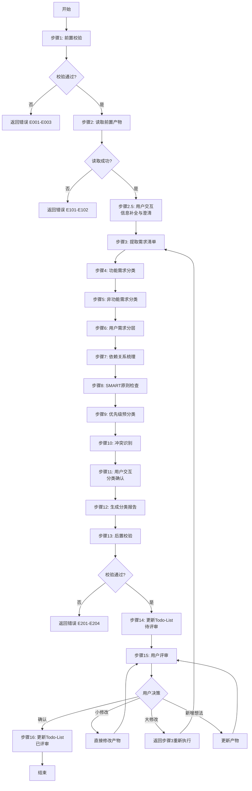
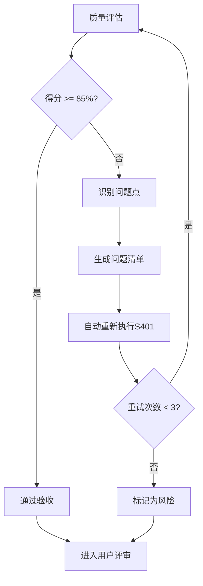

# S401: 需求分类

## Section 1: 元信息 (Meta Information)

| 项目             | 内容                       |
| -------------- | -------------------------- |
| **Skill 编号**   | S401                       |
| **Skill 名称**   | 需求分类                   |
| **Skill 英文名称** | Requirements Classification |
| **所属阶段**       | S4 - 需求整合与核心提炼阶段   |
| **执行顺序**       | S4 阶段第 1 个执行           |
| **执行模式**       | normal / lightweight 均执行  |
| **依赖 Skill**   | S303（normal）/ S302（lightweight） |
| **后置 Skill**   | S402（需求优先级排序）        |
| **版本**          | v3.1                       |
| **最后更新时间**    | 2026-03-27                 |

***

## Section 2: 功能描述 (Functional Description)

### 2.1 核心职责

S401 负责对所有收集到的需求进行系统化分类梳理，建立清晰的需求体系结构。主要职责包括：

1. **功能需求分类**：按功能模块/业务域对需求进行归类（核心功能、辅助功能、扩展功能、集成功能）
2. **非功能需求分类**：识别并分类性能、安全、可用性等非功能需求（9 大质量维度，参考 ISO/IEC 25010）
3. **用户需求分层**：区分不同用户群体的需求（核心用户、次要用户、边缘用户）
4. **需求依赖关系梳理**：识别需求之间的依赖和关联关系（强依赖、弱依赖、互斥、包含）
5. **优先级预分类**：为后续优先级排序提供基础（高/中/低）
6. **SMART 原则检查**：对每个需求进行 SMART 原则验证
7. **需求追溯矩阵建立**：建立需求与产品目标、用户问题、功能模块的追溯关系
8. **需求冲突识别**：识别并标记相互冲突的需求项
9. **需求完整性校验**：检查需求覆盖是否完整，是否存在遗漏
10. **分类报告生成**：输出完整的需求分类体系报告（Markdown）

### 2.2 输入规范 (Input Specifications)

#### 用户/前置 Skill 需要提供什么

**前置产物（必需）**：

| 阶段 | 产物名称 | 产物 ID 示例 | 用途 |
|------|---------|-------------|------|
| S1 | 需求边界界定报告 | `{PlanID}-S1-S101-001` | 获取需求范围边界 |
| S1 | 显性需求提取清单 | `{PlanID}-S1-S102-001` | 获取显性需求列表 |
| S1 | 隐性需求挖掘报告（normal 模式） | `{PlanID}-S1-S103-001` | 获取隐性需求列表 |
| S1 | 需求验证报告 | `{PlanID}-S1-S104-001` | 获取已验证需求 |
| S2 | 竞品分析报告（normal 模式） | `{PlanID}-S2-S201-001` | 获取竞品功能对比 |
| S2 | 市场痛点验证报告（normal 模式） | `{PlanID}-S2-S202-001` | 获取市场相关需求 |
| S3 | 需求风险识别报告 | `{PlanID}-S3-S301-001` | 获取风险相关需求 |
| S3 | 技术可行性评估报告 | `{PlanID}-S3-S302-001` | 获取技术约束需求 |
| S3 | 技术选型报告（normal 模式） | `{PlanID}-S3-S303-001` | 获取技术栈相关需求 |

**输入格式**：
- Markdown 报告文件
- 结构化数据表格
- 产物 ID 列表（用于追溯）

**输入验证规则**：
- 所有前置产物必须存在且状态为 completed
- 产物 ID 必须匹配且连续
- Markdown 报告必须结构完整

#### 输入示例

**前置产物引用示例**：

```
PlanID: P000001
前置产物：
- P000001-S1-S101-001 (需求边界界定报告)
- P000001-S1-S102-001 (显性需求提取清单)
- P000001-S1-S104-001 (需求验证报告)
- P000001-S3-S301-001 (需求风险识别报告)
- P000001-S3-S302-001 (技术可行性评估报告)
```

### 2.3 输出规范 (Output Specifications)

#### 用户会得到什么

Skill 完成后，系统会生成以下产物并保存到项目目录：

**产物清单**：

| 产物名称 | 文件位置 | 格式 | 用途 | 用户可见性 |
|---------|---------|------|------|-----------|
| 需求分类报告 | `artifacts/stages/s4/{PlanID}-S4-S401-001.md` | Markdown | 需求分类体系完整报告 | 用户可查看 |
| Todo-List 更新 | `artifacts/plans/{PlanID}/todo-list.md` | Markdown | 任务状态更新 | 用户可查看 |

**产物内容结构**：

1. **执行摘要**：分类统计概览、关键发现
2. **功能需求分类**：FUNC-CORE、FUNC-AUX、FUNC-EXT、FUNC-INT
3. **非功能需求分类**：NFR-PERF、NFR-SEC、NFR-AVA、NFR-REL、NFR-USA、NFR-SCA、NFR-MAI、NFR-POR、NFR-COM
4. **用户需求分层**：USER-P0、USER-P1、USER-P2
5. **依赖关系**：强依赖、弱依赖、互斥、包含关系
6. **SMART 检查结果**：各需求的 SMART 验证结果
7. **优先级预分类**：高/中/低优先级预分类
8. **冲突识别**：识别到的需求冲突及建议解决方案
9. **用户交互记录**：交互轮次、问题、用户输入
10. **评审记录**：评审时间、结果、意见

#### 输出示例

**需求分类报告示例结构**：

```markdown
# 需求分类报告 - P000001-S4-S401-001

## 执行摘要
- **总需求数**: 25 项
- **功能需求**: 18 项（核心 8 项，辅助 6 项，扩展 3 项，集成 1 项）
- **非功能需求**: 7 项
- **P0 用户需求**: 15 项（60%）
- **依赖关系**: 12 项
- **SMART 通过率**: 88%
- **冲突识别**: 2 项

## 功能需求分类
| 需求 ID | 需求描述 | 分类 | 理由 |
|---------|---------|------|------|
| R001 | 用户登录 | FUNC-CORE | 核心业务流程入口 |
...
```

***

## Section 3: 执行流程 (Execution Process)

### 3.1 流程概览



### 3.2 详细步骤说明

#### 步骤 1：前置校验

**目标**：验证前置产物是否完整、格式是否正确

**操作**：
1. 检查前置产物是否存在（根据执行模式确定依赖列表）
2. 检查产物状态是否为 completed
3. 检查产物 ID 是否匹配且连续
4. 验证 Markdown 报告格式是否规范

**验证规则**：
- normal 模式：检查 S101-S104、S201-S202、S301-S303
- lightweight 模式：检查 S101-S102、S104、S301-S302
- 所有前置产物必须存在
- 产物状态必须为 completed

**错误处理**：
- 产物缺失 → 返回错误 E001，要求先完成前置 Skill
- 格式错误 → 返回错误 E002，要求重新生成前置产物
- 状态异常 → 返回错误 E003，要求检查产物状态

#### 步骤 2：读取前置产物

**目标**：加载所有前置产物内容

**操作**：
1. 读取所有 Markdown 报告文件
2. 解析并提取需求相关信息
3. 建立需求追溯索引

**验证规则**：
- 文件必须可读
- 内容必须完整
- 编码必须为 UTF-8

**错误处理**：
- 文件读取失败 → 返回错误 E101，重试 3 次
- 内容解析失败 → 返回错误 E102，尝试修复或中止

#### 步骤 2.5：用户交互（信息补全与澄清）

**目标**：在需求分类过程中，当遇到信息不完整或需要用户确认的场景时，主动与用户交互

**触发场景**：

| 场景 | 说明 | 示例 |
|------|------|------|
| 信息不完整 | 前置产物中缺少关键分类信息 | 用户群体信息缺失 |
| 需求模糊 | 需求描述不清晰，影响分类 | 功能边界不明确 |
| 分类冲突 | 需求可能属于多个分类 | 既是核心功能又是扩展功能 |
| 发现重大冲突 | 识别出需要用户决策的需求冲突 | 资源竞争冲突 |

**交互流程**：遵循 [execution-flow-standard.md](../../templates/execution-flow-standard.md) 中的"用户交互标准流程"章节

**使用模板**：
- 使用 [clarification-template.md](../../templates/user-interaction/clarification-template.md) 进行信息澄清
- 使用 [information-collection-template.md](../../templates/user-interaction/information-collection-template.md) 收集补充信息
- 使用 [option-selection-template.md](../../templates/user-interaction/option-selection-template.md) 进行选项选择

#### 步骤 3：提取需求清单

**目标**：从所有前置产物中提取需求条目

**操作**：
1. 从显性需求提取清单中提取功能需求
2. 从隐性需求挖掘报告中提取潜在需求（normal 模式）
3. 从需求验证报告中提取已验证需求
4. 从市场痛点验证报告中提取市场相关需求（normal 模式）
5. 从技术可行性评估中提取技术约束需求
6. 去重并合并需求清单
7. 为每个需求分配唯一 ID（R001, R002, ...）

**验证规则**：
- 需求 ID 必须唯一
- 需求描述必须完整
- 需求来源必须可追溯

**错误处理**：
- 需求 ID 冲突 → 返回错误 E103，重新分配 ID

#### 步骤 4：功能需求分类

**目标**：按功能模块/业务域对需求进行归类

**操作**：
1. 识别每个需求的功能属性
2. 按以下 4 类进行分类：
   - **FUNC-CORE**：核心功能需求（产品必须实现的核心业务功能）
   - **FUNC-AUX**：辅助功能需求（支持核心功能的辅助功能）
   - **FUNC-EXT**：扩展功能需求（增强用户体验的扩展功能）
   - **FUNC-INT**：集成功能需求（与外部系统集成的功能）
3. 记录分类理由
4. 统计各类需求数量

**分类标准**：
- 核心功能：直接影响产品核心价值，缺失会导致产品无法使用
- 辅助功能：支持核心功能，提升产品完整性，但非必需
- 扩展功能：增强用户体验，用于差异化竞争，可选
- 集成功能：需要与外部系统交互，扩展产品能力

**验证规则**：
- 每个需求必须分配到且仅分配到一个功能分类
- 分类理由必须充分
- 核心功能需求占比应合理（通常 30-50%）

#### 步骤 5：非功能需求分类

**目标**：识别并分类非功能需求

**操作**：
1. 识别需求中的非功能属性
2. 按以下 9 类进行分类（参考 ISO/IEC 25010）：
   - **NFR-PERF**：性能需求（响应时间、吞吐量、资源利用率）
   - **NFR-SEC**：安全需求（数据保护、访问控制、加密）
   - **NFR-AVA**：可用性需求（系统可用时间、故障恢复）
   - **NFR-REL**：可靠性需求（容错性、稳定性）
   - **NFR-USA**：易用性需求（用户体验、学习成本）
   - **NFR-SCA**：可扩展性需求（水平/垂直扩展能力）
   - **NFR-MAI**：可维护性需求（代码质量、文档完整性）
   - **NFR-POR**：可移植性需求（跨平台、跨环境能力）
   - **NFR-COM**：兼容性需求（向后兼容、版本兼容）
3. 记录分类理由和指标
4. 统计各类需求数量

**验证规则**：
- 每个非功能需求必须分类
- 指标必须可量化
- 分类必须符合 ISO/IEC 25010 标准

#### 步骤 6：用户需求分层

**目标**：按用户群体对需求进行分层

**操作**：
1. 识别每个需求服务的用户群体
2. 按以下 3 层进行分类：
   - **USER-P0**：核心用户需求（产品主要服务的用户群体）
   - **USER-P1**：次要用户需求（偶尔使用或间接使用的用户）
   - **USER-P2**：边缘用户需求（可能使用但非目标的用户）
3. 记录分层理由
4. 统计各层需求数量和占比

**分层标准**：
- P0 核心用户：使用频率高（每周≥3 次）、需求明确、付费意愿强
- P1 次要用户：使用频率中等（每周 1-2 次）、需求一般、付费意愿中等
- P2 边缘用户：使用频率低（每月≤4 次）、需求不明确、付费意愿低

**验证规则**：
- 每个需求必须分配到且仅分配到一个用户层
- 分层理由必须充分
- P0 用户需求占比应合理（通常 40-60%）

#### 步骤 7：依赖关系梳理

**目标**：识别需求之间的依赖和关联关系

**操作**：
1. 识别需求之间的依赖关系类型：
   - **强依赖**：需求 A 实现必须依赖需求 B
   - **弱依赖**：需求 A 实现建议依赖需求 B
   - **互斥**：需求 A 和需求 B 不能同时实现
   - **包含**：需求 A 包含需求 B
2. 记录依赖关系和理由
3. 生成依赖关系图（Mermaid）

**验证规则**：
- 依赖关系必须无循环
- 每个依赖必须有明确理由

**错误处理**：
- 循环依赖 → 返回错误 E104，打破循环并记录

#### 步骤 8：SMART 原则检查

**目标**：对每个需求进行 SMART 原则验证

**操作**：
1. 检查 Specific（具体性）：需求描述是否明确
2. 检查 Measurable（可衡量）：是否有量化指标
3. 检查 Achievable（可实现）：技术是否可行
4. 检查 Relevant（相关性）：与业务目标是否相关
5. 检查 Time-bound（时限性）：是否明确所属阶段
6. 记录检查结果和优化建议

**验证规则**：
- 每项检查必须有明确结果（✅/❌）
- 检查不通过项必须有优化建议

#### 步骤 9：优先级预分类

**目标**：为后续优先级排序提供基础

**操作**：
1. 基于功能分类和用户层进行优先级预分类
2. 核心功能（FUNC-CORE）+ P0 用户 → 高优先级
3. 辅助功能（FUNC-AUX）+ P1 用户 → 中优先级
4. 扩展功能（FUNC-EXT）+ P2 用户 → 低优先级
5. 记录预分类理由

**验证规则**：
- 预分类必须合理
- 必须有分类理由

#### 步骤 10：冲突识别

**目标**：识别并标记相互冲突的需求项

**操作**：
1. 识别需求之间的冲突
2. 标记冲突类型：
   - 功能冲突：两个需求功能矛盾
   - 资源冲突：两个需求竞争同一资源
   - 优先级冲突：优先级排序矛盾
3. 记录冲突详情和建议解决方案

**验证规则**：
- 所有冲突必须被识别
- 必须有解决建议

#### 步骤 11：用户交互（分类确认）

**目标**：用户对分类结果进行确认或提出修改意见

**触发场景**：
- 分类结果存在不确定性
- 需要用户确认分类方案
- 检测到潜在分类冲突

**交互流程**：遵循 [execution-flow-standard.md](../../templates/execution-flow-standard.md) 中的"用户评审标准流程"章节

#### 步骤 12：生成分类报告

**目标**：生成需求分类体系报告（Markdown）

**操作**：
1. 填充所有必需章节（见 2.3 输出规范）
2. 生成分类统计表格
3. 生成依赖关系 Mermaid 图
4. 保存为 `{PlanID}-S4-S401-001.md`

**验证规则**：
- 报告必须包含所有必需章节
- 数据必须完整准确
- 格式必须清晰易读

#### 步骤 13：后置校验

**目标**：验证产物完整性和正确性

**校验内容**：
- 需求分类报告已生成且格式正确
- 所有需求已分类（100% 覆盖）
- 分类统计正确
- 依赖关系无循环
- Todo-List 可更新

**错误处理**：
- 产物文件不存在 → 返回错误 E201，重新生成
- Markdown 格式错误 → 返回错误 E202，修复格式
- 必填字段缺失 → 返回错误 E203，补充后重新生成
- Todo-List 结构错误 → 返回错误 E204，检查结构

#### 步骤 14-16：Todo-List 更新与用户评审

**目标**：更新Todo-List，标记 S401 完成，准备用户评审

**Todo-List更新规则**：遵循 [execution-flow-standard.md](../../templates/execution-flow-standard.md) 中的"Todo-List更新标准规则"章节

**S401特定更新时机**：
1. **执行开始**：步骤1完成后，状态：待执行 → 执行中
2. **用户交互后**：步骤2.5/11完成后，更新交互记录
3. **执行完成**：步骤13完成后，状态：执行中 → 已完成
4. **用户评审后**：步骤16完成后，根据评审结果更新状态

**用户评审**：

**评审流程**：遵循 [execution-flow-standard.md](../../templates/execution-flow-standard.md) 中的"用户评审标准流程"章节

**评审展示内容**：
- 需求分类报告核心内容（分类统计、关键发现）
- 功能/非功能/用户需求分布
- SMART检查结果
- 冲突识别摘要

### 3.3 Demo 示例

#### Demo：需求分类执行示例

**输入**：
```
Plan 定义文件：artifacts/plans/P000001.md
- Plan ID: P000001
- 执行模式：常规模式
- 信息完整度：85分

用户原始需求：
"我想开发一个面向大学生的时间管理APP，3个月内完成MVP，
预算10万以内，使用Flutter开发。"

前置Skill产物：S101-S104、S201-S202、S301-S303已完成
```

**处理过程**：
1. 前置校验 → 所有文件存在，校验通过
2. 读取前置产物 → 提取30项需求（R001-R030）
3. 功能需求分类 → 核心10项，辅助8项，扩展5项，集成2项
4. 非功能需求分类 → 性能2项，安全2项，易用性1项
5. 用户需求分层 → P0:18项，P1:8项，P2:4项
6. 依赖关系梳理 → 强依赖8项，弱依赖5项
7. SMART检查 → 通过率90%
8. 优先级预分类 → 高12项，中10项，低8项
9. 冲突识别 → 2项冲突
10. 生成分类报告 → 生成 P000001-S4-S401-001.md
11. 后置校验 → 校验通过
12. 用户评审 → 等待用户确认

**输出**：
```
产物ID: P000001-S4-S401-001
总需求数: 30项
功能需求: 25项（核心10/辅助8/扩展5/集成2）
非功能需求: 5项
SMART通过率: 90%
冲突识别: 2项
```

---

## Section 4: 产物规范 (Artifact Specifications)

S401产物规范遵循 [artifact-specifications.md](../../templates/artifact-specifications.md) 中的通用定义。

### 4.1 S401特定产物清单

| 产物名称 | 产物ID | 存储路径 | 说明 |
|---------|--------|---------|------|
| 需求分类报告 | `{PlanID}-S4-S401-001` | `artifacts/stages/s4/{PlanID}-S4-S401-001.md` | 主产物，包含功能/非功能/用户需求分类、依赖关系、SMART检查结果 |

### 4.2 模板引用

**模板文件**：`skills/s4-classify/template.md`

**引用方式**：直接引用模板结构，填充实际数据

---

## Section 5: 质量标准 (Quality Standards)

### 5.1 质量评估框架

S401遵循 [quality-standard.md](../../templates/quality-standard.md) 中的ISO/IEC 25010质量评估框架。

**S401特定权重分配**：
| 维度 | 权重 | 验收阈值 |
|------|------|----------|
| **完整性** | 30% | ≥ 90% |
| **准确性** | 25% | ≥ 90% |
| **一致性** | 20% | ≥ 95% |
| **可读性** | 15% | ≥ 85% |
| **可追溯性** | 10% | ≥ 90% |

**验收门槛**：质量综合得分 ≥ 85%

### 5.2 检查清单

**完整性检查**（30%）：
- [ ] 5大分类维度都已覆盖（功能/非功能/用户/依赖/SMART）
- [ ] 所有需求都已分类（100%覆盖）
- [ ] 依赖关系梳理完整
- [ ] 冲突识别完成

**准确性检查**（25%）：
- [ ] 功能需求分类准确（核心/辅助/扩展/集成）
- [ ] 非功能需求分类符合ISO/IEC 25010
- [ ] 用户需求分层合理（P0/P1/P2）
- [ ] SMART检查结果准确

**一致性检查**（20%）：
- [ ] 分类标准统一应用
- [ ] 分类比例合理（核心功能30-50%，P0用户40-60%）
- [ ] 风险等级使用固定值（HIGH/MEDIUM/LOW）

**可读性检查**（15%）：
- [ ] 分类表格清晰易读
- [ ] 依赖关系图使用Mermaid语法正确
- [ ] 报告结构符合模板规范

**可追溯性检查**（10%）：
- [ ] 需求来源清晰（关联前置产物）
- [ ] 需求ID唯一且连续
- [ ] 分类依据明确

### 5.3 质量综合得分计算

```
得分 = Σ(维度得分 × 维度权重)

示例：
- 完整性：95% × 30% = 28.5
- 准确性：90% × 25% = 22.5
- 一致性：100% × 20% = 20.0
- 可读性：90% × 15% = 13.5
- 可追溯性：95% × 10% = 9.5
- 总分：28.5 + 22.5 + 20.0 + 13.5 + 9.5 = 94.0%
```

### 5.4 验收标准

| 结果 | 标准 | 处理方式 |
|------|------|----------|
| **通过** | 质量综合得分 ≥ 85% | 进入用户评审阶段 |
| **不通过** | 质量综合得分 < 85% | 识别问题 → 生成问题清单 → 自动重新执行 |

### 5.5 不达标处理流程



**重试机制**：
- 第1次：自动重新执行，尝试修复问题
- 第2次：自动重新执行，调整参数
- 第3次：自动重新执行，简化复杂部分
- 仍不达标：标记为风险，进入用户评审并提示问题

---

## Section 6: 错误处理 (Error Handling)

### 6.1 错误分类与代码表

S401错误处理遵循 [error-code-standard.md](../../templates/error-code-standard.md) 中的通用定义。

**S401特定错误代码**：

| 错误码 | 错误类型 | 说明 | 处理策略 |
|--------|----------|------|----------|
| **前置校验错误** |
| E001 | 前置产物缺失 | 前置Skill产物不存在 | 提示先完成前置Skill |
| E002 | 输入文件格式错误 | 输入文件格式不符合规范 | 提示重新生成前置产物 |
| E003 | 需求数据不完整 | 需求关键数据缺失 | 提示补充缺失数据 |
| **执行过程错误** |
| E101 | 需求提取失败 | 无法从产物中提取需求 | 重试3次，失败则中止 |
| E102 | 需求ID冲突 | 分配的需求ID重复 | 重新分配ID |
| E103 | 循环依赖 | 需求间存在循环依赖 | 打破循环并记录 |
| E104 | 分类失败 | 无法完成需求分类 | 使用默认分类，标记风险 |
| **后置校验错误** |
| E201 | 报告生成失败 | 无法生成Markdown报告 | 检查模板文件，记录详细错误 |
| E202 | 产物内容不完整 | 分类报告缺少必要章节 | 补充缺失内容 |
| E203 | 数据不一致 | 分类数据前后矛盾 | 修正数据不一致问题 |

### 6.2 错误恢复策略

| 错误类型 | 恢复策略 | 重试次数 | 失败处理 |
|----------|----------|----------|----------|
| 需求提取失败 | 重试提取 | 3次 | 标记为风险 |
| 需求ID冲突 | 重新分配ID | 1次 | 使用备用ID策略 |
| 循环依赖 | 打破循环依赖 | 1次 | 标记风险继续 |
| 分类失败 | 使用默认分类 | 1次 | 标记为风险 |

---

**本 Skill 符合 IEEE 29148-2011 需求和软件工程标准，遵循 ISO/IEC 25010 质量模型**
