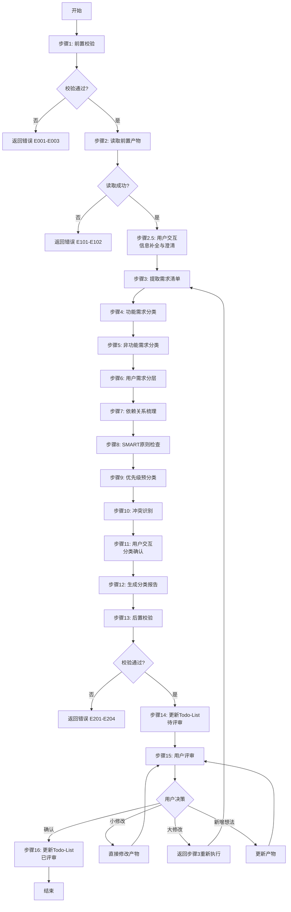
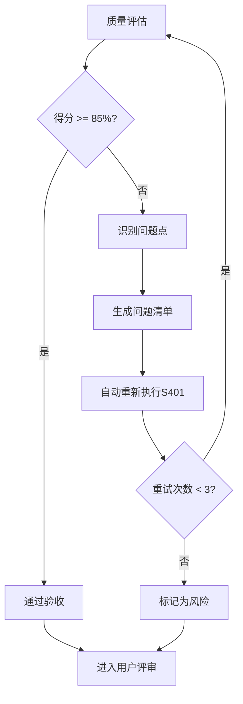

# S401: 需求分类

## Section 1: 元信息 (Meta Information)

| 项目             | 内容                       |
| -------------- | -------------------------- |
| **Skill 编号**   | S401                       |
| **Skill 名称**   | 需求分类                   |
| **Skill 英文名称** | Requirements Classification |
| **所属阶段**       | S4 - 需求整合与核心提炼阶段   |
| **执行顺序**       | S4 阶段第 1 个执行           |
| **执行模式**       | normal / lightweight 均执行  |
| **依赖 Skill**   | S303（normal）/ S302（lightweight） |
| **后置 Skill**   | S402（需求优先级排序）        |
| **版本**          | v3.2.0                     |
| **最后更新时间**    | 2026-03-28                 |

***

## Section 2: 功能描述 (Functional Description)

### 2.1 核心职责

S401 负责对所有收集到的需求进行系统化分类梳理，建立清晰的需求体系结构。主要职责包括：

1. **功能需求分类**：按功能模块/业务域对需求进行归类（核心功能、辅助功能、扩展功能、集成功能）
2. **非功能需求分类**：识别并分类性能、安全、可用性等非功能需求（9 大质量维度，参考 ISO/IEC 25010）
3. **用户需求分层**：区分不同用户群体的需求（核心用户、次要用户、边缘用户）
4. **需求依赖关系梳理**：识别需求之间的依赖和关联关系（强依赖、弱依赖、互斥、包含）
5. **优先级预分类**：为后续优先级排序提供基础（高/中/低）
6. **SMART 原则检查**：对每个需求进行 SMART 原则验证
7. **需求追溯矩阵建立**：建立需求与产品目标、用户问题、功能模块的追溯关系
8. **需求冲突识别**：识别并标记相互冲突的需求项
9. **需求完整性校验**：检查需求覆盖是否完整，是否存在遗漏
10. **分类报告生成**：输出完整的需求分类体系报告（Markdown）

### 2.2 输入规范 (Input Specifications)

#### 用户/前置 Skill 需要提供什么

**前置产物（必需）**：

| 阶段 | 产物名称 | 产物 ID 示例 | 用途 |
|------|---------|-------------|------|
| S1 | 需求边界界定报告 | `{PlanID}-S1-S101-001` | 获取需求范围边界 |
| S1 | 显性需求提取清单 | `{PlanID}-S1-S102-001` | 获取显性需求列表 |
| S1 | 隐性需求挖掘报告（normal 模式） | `{PlanID}-S1-S103-001` | 获取隐性需求列表 |
| S1 | 需求验证报告 | `{PlanID}-S1-S104-001` | 获取已验证需求 |
| S2 | 竞品分析报告（normal 模式） | `{PlanID}-S2-S201-001` | 获取竞品功能对比 |
| S2 | 市场痛点验证报告（normal 模式） | `{PlanID}-S2-S202-001` | 获取市场相关需求 |
| S3 | 需求风险识别报告 | `{PlanID}-S3-S301-001` | 获取风险相关需求 |
| S3 | 技术可行性评估报告 | `{PlanID}-S3-S302-001` | 获取技术约束需求 |
| S3 | 技术选型报告（normal 模式） | `{PlanID}-S3-S303-001` | 获取技术栈相关需求 |

**输入格式**：
- Markdown 报告文件
- 结构化数据表格
- 产物 ID 列表（用于追溯）

**输入验证规则**：
- 所有前置产物必须存在且状态为 completed
- 产物 ID 必须匹配且连续
- Markdown 报告必须结构完整

#### 输入示例

**前置产物引用示例**：

```
PlanID: P000001
前置产物：
- P000001-S1-S101-001 (需求边界界定报告)
- P000001-S1-S102-001 (显性需求提取清单)
- P000001-S1-S104-001 (需求验证报告)
- P000001-S3-S301-001 (需求风险识别报告)
- P000001-S3-S302-001 (技术可行性评估报告)
```

### 2.3 输出规范 (Output Specifications)

#### 用户会得到什么

Skill 完成后，系统会生成以下产物并保存到项目目录：

**产物清单**：

| 产物名称 | 文件位置 | 格式 | 用途 | 用户可见性 |
|---------|---------|------|------|-----------|
| 需求分类报告 | `artifacts/stages/s4/{PlanID}-S4-S401-001.md` | Markdown | 需求分类体系完整报告 | 用户可查看 |
| Todo-List 更新 | `artifacts/plans/{PlanID}/todo-list.md` | Markdown | 任务状态更新 | 用户可查看 |

**产物内容结构**：

1. **执行摘要**：分类统计概览、关键发现
2. **功能需求分类**：FUNC-CORE、FUNC-AUX、FUNC-EXT、FUNC-INT
3. **非功能需求分类**：NFR-PERF、NFR-SEC、NFR-AVA、NFR-REL、NFR-USA、NFR-SCA、NFR-MAI、NFR-POR、NFR-COM
4. **用户需求分层**：USER-P0、USER-P1、USER-P2
5. **依赖关系**：强依赖、弱依赖、互斥、包含关系
6. **SMART 检查结果**：各需求的 SMART 验证结果
7. **优先级预分类**：高/中/低优先级预分类
8. **冲突识别**：识别到的需求冲突及建议解决方案
9. **用户交互记录**：交互轮次、问题、用户输入
10. **评审记录**：评审时间、结果、意见

#### 输出示例

**需求分类报告示例结构**：

```markdown
# 需求分类报告 - P000001-S4-S401-001

## 执行摘要
- **总需求数**: 25 项
- **功能需求**: 18 项（核心 8 项，辅助 6 项，扩展 3 项，集成 1 项）
- **非功能需求**: 7 项
- **P0 用户需求**: 15 项（60%）
- **依赖关系**: 12 项
- **SMART 通过率**: 88%
- **冲突识别**: 2 项

## 功能需求分类
| 需求 ID | 需求描述 | 分类 | 理由 |
|---------|---------|------|------|
| R001 | 用户登录 | FUNC-CORE | 核心业务流程入口 |
...
```

***

## Section 3: 执行流程 (Execution Process)

### 3.1 流程概览



### 3.2 详细步骤

详细步骤说明见 [references/execution-details.md](references/execution-details.md)

### 3.3 Demo 示例

执行示例见 [references/examples.md](references/examples.md)

---

## Section 4: 产物规范 (Artifact Specifications)

S401产物规范遵循 [references/artifact-specifications.md](references/artifact-specifications.md) 中的通用定义。

### 4.1 S401特定产物清单

| 产物名称 | 产物ID | 存储路径 | 说明 |
|---------|--------|---------|------|
| 需求分类报告 | `{PlanID}-S4-S401-001` | `artifacts/stages/s4/{PlanID}-S4-S401-001.md` | 主产物，包含功能/非功能/用户需求分类、依赖关系、SMART检查结果 |

### 4.2 模板引用

**模板文件**：`skills/s4-classify/template.md`

**引用方式**：直接引用模板结构，填充实际数据

---

## Section 5: 质量标准 (Quality Standards)

### 5.1 质量评估框架

S401遵循 [references/quality-standard.md](references/quality-standard.md) 中的ISO/IEC 25010质量评估框架。

**S401特定权重分配**：
| 维度 | 权重 | 验收阈值 |
|------|------|----------|
| **完整性** | 30% | ≥ 90% |
| **准确性** | 25% | ≥ 90% |
| **一致性** | 20% | ≥ 95% |
| **可读性** | 15% | ≥ 85% |
| **可追溯性** | 10% | ≥ 90% |

**验收门槛**：质量综合得分 ≥ 85%

### 5.2 检查清单

**完整性检查**（30%）：
- [ ] 5大分类维度都已覆盖（功能/非功能/用户/依赖/SMART）
- [ ] 所有需求都已分类（100%覆盖）
- [ ] 依赖关系梳理完整
- [ ] 冲突识别完成

**准确性检查**（25%）：
- [ ] 功能需求分类准确（核心/辅助/扩展/集成）
- [ ] 非功能需求分类符合ISO/IEC 25010
- [ ] 用户需求分层合理（P0/P1/P2）
- [ ] SMART检查结果准确

**一致性检查**（20%）：
- [ ] 分类标准统一应用
- [ ] 分类比例合理（核心功能30-50%，P0用户40-60%）
- [ ] 风险等级使用固定值（HIGH/MEDIUM/LOW）

**可读性检查**（15%）：
- [ ] 分类表格清晰易读
- [ ] 依赖关系图使用Mermaid语法正确
- [ ] 报告结构符合模板规范

**可追溯性检查**（10%）：
- [ ] 需求来源清晰（关联前置产物）
- [ ] 需求ID唯一且连续
- [ ] 分类依据明确

### 5.3 质量综合得分计算

```
得分 = Σ(维度得分 × 维度权重)

示例：
- 完整性：95% × 30% = 28.5
- 准确性：90% × 25% = 22.5
- 一致性：100% × 20% = 20.0
- 可读性：90% × 15% = 13.5
- 可追溯性：95% × 10% = 9.5
- 总分：28.5 + 22.5 + 20.0 + 13.5 + 9.5 = 94.0%
```

### 5.4 验收标准

| 结果 | 标准 | 处理方式 |
|------|------|----------|
| **通过** | 质量综合得分 ≥ 85% | 进入用户评审阶段 |
| **不通过** | 质量综合得分 < 85% | 识别问题 → 生成问题清单 → 自动重新执行 |

### 5.5 不达标处理流程



**重试机制**：
- 第1次：自动重新执行，尝试修复问题
- 第2次：自动重新执行，调整参数
- 第3次：自动重新执行，简化复杂部分
- 仍不达标：标记为风险，进入用户评审并提示问题

---

## Section 6: 异常处理

### 常见异常场景

**前置校验失败**（如输入文件不存在）：
- 提示用户先执行前置 Skill
- 或请求补充必要信息

**执行过程异常**（如处理逻辑失败）：
- 自动重试（最多3次）
- 失败后标记风险继续执行

**后置校验失败**（如产物不完整）：
- 重新生成产物
- 或标记为风险进入用户评审

**用户评审未通过**：
- 根据意见修改产物
- 小修改直接编辑，大修改重新执行

### 本 Skill 特定场景

- 分类标准不明确 → 使用默认分类
- 需求归属争议 → 标记待确认

### 恢复策略

| 异常类型 | 处理策略 |
|----------|----------|
| 可重试异常 | 自动重试3次 |
| 数据缺失 | 请求用户补充 |
| 校验失败 | 重新执行或标记风险 |
| 用户拒绝 | 使用默认值继续 |

详细流程参见 [references/execution-flow-standard.md](references/execution-flow-standard.md)

---

**本 Skill 符合 IEEE 29148-2011 需求和软件工程标准，遵循 ISO/IEC 25010 质量模型**
