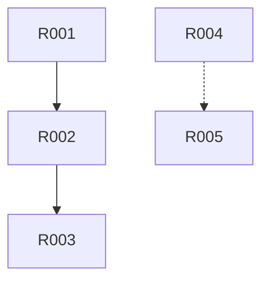

# S401 Demo 示例

## 示例：需求分类执行示例

### 输入

```
Plan 定义文件：artifacts/plans/P000001.md
- Plan ID: P000001
- 执行模式：常规模式
- 信息完整度：85分

用户原始需求：
"我想开发一个面向大学生的时间管理APP，3个月内完成MVP，
预算10万以内，使用Flutter开发。"

前置Skill产物：S101-S102、S201-S204、S301-S304已完成
```

### 处理过程

1. 前置校验 → 所有文件存在，校验通过
2. 读取前置产物 → 提取30项需求（R001-R030）
3. 功能需求分类 → 核心10项，辅助8项，扩展5项，集成2项
4. 非功能需求分类 → 性能2项，安全2项，易用性1项
5. 用户需求分层 → P0:18项，P1:8项，P2:4项
6. 依赖关系梳理 → 强依赖8项，弱依赖5项
7. SMART检查 → 通过率90%
8. 优先级预分类 → 高12项，中10项，低8项
9. 冲突识别 → 2项冲突
10. 生成分类报告 → 生成 P000001-S4-S401-001.md
11. 后置校验 → 校验通过
12. 用户评审 → 等待用户确认

### 输出

```
产物ID: P000001-S4-S401-001
总需求数: 30项
功能需求: 25项（核心10/辅助8/扩展5/集成2）
非功能需求: 5项
SMART通过率: 90%
冲突识别: 2项
```

---

## 需求分类报告示例结构

```markdown
# 需求分类报告 - P000001-S4-S401-001

## 执行摘要
- **总需求数**: 25 项
- **功能需求**: 18 项（核心 8 项，辅助 6 项，扩展 3 项，集成 1 项）
- **非功能需求**: 7 项
- **P0 用户需求**: 15 项（60%）
- **依赖关系**: 12 项
- **SMART 通过率**: 88%
- **冲突识别**: 2 项

## 功能需求分类
| 需求 ID | 需求描述 | 分类 | 理由 |
|---------|---------|------|------|
| R001 | 用户登录 | FUNC-CORE | 核心业务流程入口 |
| R002 | 任务创建 | FUNC-CORE | 核心功能 |
| R003 | 数据导出 | FUNC-EXT | 扩展功能 |
...

## 非功能需求分类
| 需求 ID | 需求描述 | 分类 | 指标 |
|---------|---------|------|------|
| R020 | 响应时间 | NFR-PERF | < 2s |
| R021 | 数据加密 | NFR-SEC | AES-256 |
...

## 依赖关系图

```
