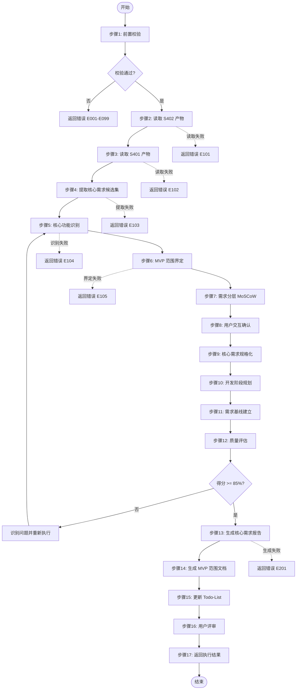
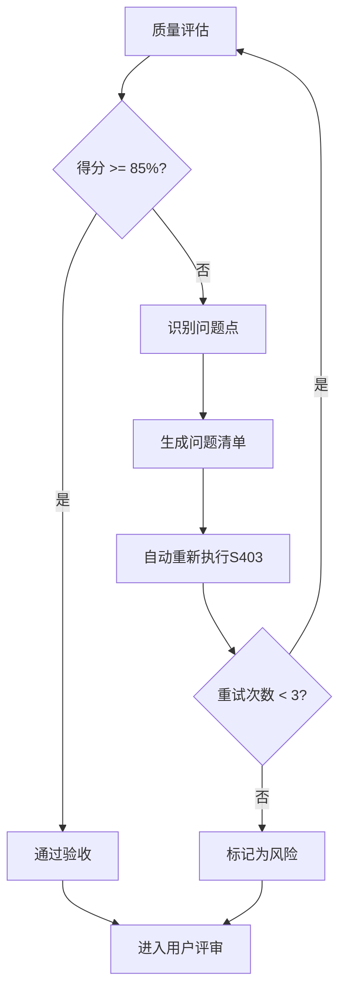

# S403: 核心需求提取

## Section 1: 元信息 (Meta Information)

| 项目 | 内容 |
|------|------|
| **Skill ID** | S403 |
| **Skill 名称** | 核心需求提取 |
| **Skill 英文名称** | Core Requirements Extraction |
| **所属阶段** | S4 - 需求整合与核心提炼阶段 |
| **执行顺序** | S4 阶段第 3 个执行 |
| **执行模式** | normal / lightweight 均执行 |
| **存储目录** | skills/s4-core |
| **依赖 Skill** | S402 (需求优先级排序) |
| **后置 Skill** | S405 (用户故事编写) |
| **轻量化跳过** | No |
| **必需输入** | artifacts/stages/s4/{PlanID}-S4-S402-001.md |
| **输出产物** | artifacts/stages/s4/{PlanID}-S4-S403-001.md |

---

## Section 2: 功能描述 (Functional Description)

### 2.1 核心职责

S403 负责从优先级排序后的需求中提取核心功能需求，识别 MVP (Minimum Viable Product) 范围，为产品原型设计和开发规划提供明确的需求基线：

1. **核心功能识别**：从所有需求中识别构成产品核心价值的功能需求
2. **MVP 范围界定**：确定最小可行产品的功能边界
3. **需求分层**：将需求划分为 Must Have / Should Have / Could Have / Won't Have
4. **核心需求规格化**：为核心需求制定详细的规格说明
5. **开发阶段规划**：基于需求优先级和依赖关系规划开发阶段
6. **需求基线建立**：建立核心需求基线，支持后续变更管理

### 2.2 核心职责权重

| 职责编号 | 职责名称 | 说明 | 权重 |
|---------|---------|------|------|
| S403-R01 | 核心功能识别 | 识别构成产品核心价值的功能需求 | 25% |
| S403-R02 | MVP 范围界定 | 确定最小可行产品的功能边界 | 25% |
| S403-R03 | 需求分层 | 按 MoSCoW 方法对需求进行分类 | 20% |
| S403-R04 | 核心需求规格化 | 为核心需求制定详细规格说明 | 15% |
| S403-R05 | 开发阶段规划 | 规划需求实现的阶段和顺序 | 10% |
| S403-R06 | 需求基线建立 | 建立核心需求基线版本 | 5% |

### 2.3 输入规范 (Input Specifications)

#### 必需输入

| 输入编号 | 来源 Skill | 产物 ID | 产物类型 | 必需性 |
|---------|-----------|--------|---------|--------|
| IN-01 | S402 | {PlanID}-S4-S402-001 | 需求优先级排序结果 | 必需 |
| IN-02 | S401 | {PlanID}-S4-S401-001 | 需求分类梳理结果 | 必需 |
| IN-03 | S204 | {PlanID}-S2-S204-001 | 需求验证报告 | 参考 |
| IN-04 | S201 | {PlanID}-S2-S201-001 | 需求边界界定报告 | 参考 |

#### 输入内容要求

**S402 产物必需包含**：
- 优先级排序后的需求列表（含优先级得分）
- 需求优先级等级（P0-P4）
- 版本规划信息（MVP/V1.0/V2.0/Future）
- 需求依赖关系

**S401 产物必需包含**：
- 按功能/用户/系统/业务分类的需求
- 需求分类统计

### 2.4 输出规范 (Output Specifications)

#### 产物清单

| 产物编号 | 产物 ID 格式 | 产物名称 | 文件格式 | 存储路径 |
|---------|-------------|---------|---------|---------|
| OUT-01 | {PlanID}-S4-S403-001 | 核心需求提取报告 | Markdown | `artifacts/stages/s4/{PlanID}-S4-S403-001.md` |
| OUT-02 | {PlanID}-S4-S403-002 | MVP 范围定义文档 | Markdown | `artifacts/stages/s4/{PlanID}-S4-S403-002.md` |
| OUT-03 | - | Todo-List 更新 | Markdown | `artifacts/plans/{PlanID}/todo-list.md` |

#### 产物内容结构

**核心需求提取报告**包含：
1. 执行摘要
2. 核心功能需求清单（Must Have）
3. MVP 范围定义
4. 需求分层结果（MoSCoW 分类）
5. 核心需求规格说明
6. 开发阶段规划建议
7. 需求基线信息
8. 风险与假设
9. 附录

**MVP 范围定义文档**包含：
1. MVP 目标定义
2. MVP 功能清单
3. MVP 用户场景
4. MVP 验收标准
5. MVP 排期建议

---

## Section 3: 执行流程 (Execution Process)

### 3.1 流程概览



### 3.2 详细步骤

详细步骤说明请参考：[references/execution-details.md](./references/execution-details.md)

### 3.3 Demo 示例

完整示例请参考：[references/examples.md](./references/examples.md)

**快速示例**：

输入（S402产物）：
```
1. REQ-001: 用户注册登录 - P0 - MVP
2. REQ-002: 任务创建 - P0 - MVP
3. REQ-003: 任务编辑 - P0 - MVP
4. REQ-004: 任务删除 - P1 - MVP
5. REQ-005: 任务分类 - P1 - V1.0
6. REQ-006: 数据统计 - P2 - V2.0
```

输出：
- 核心需求报告：`{PlanID}-S4-S403-001.md`
- MVP范围文档：`{PlanID}-S4-S403-002.md`
- 核心功能：3项，MVP功能：4项

---

## Section 4: 产物规范 (Artifact Specifications)

S403产物规范遵循 [artifact-specifications.md](../_shared/artifact-specifications.md) 中的通用定义。

### 4.1 S403特定产物清单

| 产物名称 | 产物ID | 存储路径 | 说明 |
|---------|--------|---------|------|
| 核心需求提取报告 | `{PlanID}-S4-S403-001` | `artifacts/stages/s4/{PlanID}-S4-S403-001.md` | 主产物，包含核心功能清单、MVP范围、需求分层 |
| MVP范围定义文档 | `{PlanID}-S4-S403-002` | `artifacts/stages/s4/{PlanID}-S4-S403-002.md` | MVP目标、功能清单、验收标准 |

---

## Section 5: 质量标准 (Quality Standards)

### 5.1 质量评估框架

S403遵循 [quality-standard.md](../_shared/quality-standard.md) 中的ISO/IEC 25010质量评估框架。

**S403特定权重分配**：
| 维度 | 权重 | 验收阈值 |
|------|------|----------|
| **完整性** | 30% | >= 90% |
| **准确性** | 25% | >= 90% |
| **一致性** | 20% | >= 95% |
| **可读性** | 15% | >= 85% |
| **可追溯性** | 10% | >= 90% |

**验收门槛**：质量综合得分 >= 85%

### 5.2 检查清单

**完整性检查**（30%）：
- [ ] 核心功能需求已识别（5-10项）
- [ ] MVP范围已界定（3-7项核心功能）
- [ ] 所有需求已完成MoSCoW分层
- [ ] 核心需求已规格化（含验收标准）

**准确性检查**（25%）：
- [ ] 核心功能识别准确（解决核心痛点）
- [ ] MVP范围合理（可验证核心价值）
- [ ] 需求分层准确（与优先级一致）
- [ ] 验收标准可测试、可量化

**一致性检查**（20%）：
- [ ] 核心需求与S402优先级排序一致
- [ ] MVP范围与S402版本规划一致
- [ ] 术语使用一致

**可读性检查**（15%）：
- [ ] 核心需求描述清晰明确
- [ ] 验收标准表述准确
- [ ] 报告结构符合模板规范

**可追溯性检查**（10%）：
- [ ] 核心需求来源明确（关联S402产物）
- [ ] 依赖关系清晰
- [ ] 需求ID唯一且连续

### 5.3 质量综合得分计算

```
得分 = Σ(维度得分 × 维度权重)

示例：
- 完整性：95% × 30% = 28.5
- 准确性：90% × 25% = 22.5
- 一致性：100% × 20% = 20.0
- 可读性：90% × 15% = 13.5
- 可追溯性：95% × 10% = 9.5
- 总分：28.5 + 22.5 + 20.0 + 13.5 + 9.5 = 94.0%
```

### 5.4 验收标准

| 结果 | 标准 | 处理方式 |
|------|------|----------|
| **通过** | 质量综合得分 ≥ 85% | 进入用户评审阶段 |
| **不通过** | 质量综合得分 < 85% | 识别问题 → 生成问题清单 → 自动重新执行 |

### 5.5 不达标处理流程



**重试机制**：
- 第1次：自动重新执行，尝试修复问题
- 第2次：自动重新执行，调整参数
- 第3次：自动重新执行，简化复杂部分
- 仍不达标：标记为风险，进入用户评审并提示问题

---

## Section 6: 异常处理

### 常见异常场景

**前置校验失败**（如输入文件不存在）：
- 提示用户先执行前置 Skill
- 或请求补充必要信息

**执行过程异常**（如处理逻辑失败）：
- 自动重试（最多3次）
- 失败后标记风险继续执行

**后置校验失败**（如产物不完整）：
- 重新生成产物
- 或标记为风险进入用户评审

**用户评审未通过**：
- 根据意见修改产物
- 小修改直接编辑，大修改重新执行

**质量评估不达标**：
- 识别具体问题点
- 自动重新执行修正
- 最多重试3次

### 本 Skill 特定场景

- 核心需求识别不完整 → 补充用户确认
- P0 需求过多 → 建议精简至 3-5 项
- MVP 范围过大 → 建议分阶段交付
- 需求依赖关系冲突 → 调整优先级或拆分需求

### 恢复策略

| 异常类型 | 处理策略 |
|----------|----------|
| 可重试异常 | 自动重试3次 |
| 数据缺失 | 请求用户补充 |
| 校验失败 | 重新执行或标记风险 |
| 用户拒绝 | 使用默认值继续 |

详细流程参见 [execution-flow-standard.md](../_shared/execution-flow-standard.md)

---

## 附录：与其他 Skill 的关系

### Skill 定位对比

| Skill | 核心职责 | 输出产物 | 执行阶段 |
|-------|---------|---------|---------|
| S401 | 需求分类梳理 | 按功能/用户/系统/业务分类的需求 | S4 |
| S402 | 需求优先级排序 | 带优先级排序的需求清单 | S4 |
| **S403** | **核心需求提取** | **核心功能清单、MVP 范围定义** | **S4** |
| S405 | 用户故事编写 | 用户故事地图和验收标准 | S4 |
| S406 | 原型设计 | 产品原型设计文档 | S4 |

### S403 的输入输出关系

```
S401 (需求分类) ----\
                     ---> S403 (核心需求提取) ---> S405 (用户故事) ---> S406 (原型设计)
S402 (优先级排序) ---/
```

---

## 版本历史

| 版本 | 日期 | 更新内容 | 更新人 |
|------|------|---------|--------|
| v1.0 | 2026-03-24 | 初始版本，作为 Skill8 需求整合与规整 | System |
| v2.0 | 2026-03-24 | 标准化版本，重新定位为 S403 核心需求提取 | System |
| v3.0 | 2026-03-27 | 按照6段式结构标准重构，增强质量标准和错误处理 | System |
| v3.1 | 2026-03-27 | Skill瘦身优化，精简重复内容，改为引用通用模板 | System |
| v3.2.0 | 2026-03-28 | 实施渐进式披露结构，添加YAML Frontmatter，拆分详细步骤和示例到references目录 | System |

---

*本 Skill 符合 IEEE 29148-2011 需求和软件工程标准，遵循 SMART 原则*
