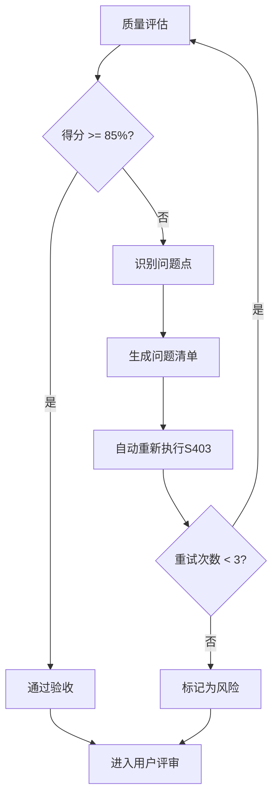
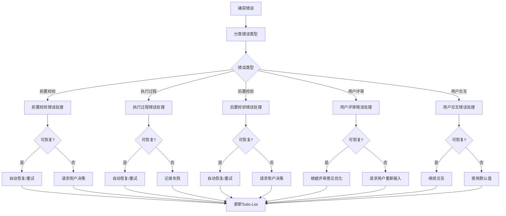

# S403: 核心需求提取

## Section 1: 元信息 (Meta Information)

| 项目 | 内容 |
|------|------|
| **Skill 编号** | S403 |
| **Skill 名称** | 核心需求提取 |
| **英文名称** | Core Requirements Extraction |
| **所属阶段** | S4 - 需求整合与核心提炼阶段 |
| **执行顺序** | S4 阶段第 3 个执行 |
| **执行模式** | normal / lightweight 均执行 |
| **依赖 Skill** | S402 (需求优先级排序) |
| **后置 Skill** | S404 (原型设计) |
| **版本** | v3.0 |
| **最后更新时间** | 2026-03-27 |

---

## Section 2: 功能描述 (Functional Description)

### 2.1 核心职责

S403 负责从优先级排序后的需求中提取核心功能需求，识别 MVP (Minimum Viable Product) 范围，为产品原型设计和开发规划提供明确的需求基线：

1. **核心功能识别**：从所有需求中识别构成产品核心价值的功能需求
2. **MVP 范围界定**：确定最小可行产品的功能边界
3. **需求分层**：将需求划分为 Must Have / Should Have / Could Have / Won't Have
4. **核心需求规格化**：为核心需求制定详细的规格说明
5. **开发阶段规划**：基于需求优先级和依赖关系规划开发阶段
6. **需求基线建立**：建立核心需求基线，支持后续变更管理

### 2.2 核心职责权重

| 职责编号 | 职责名称 | 说明 | 权重 |
|---------|---------|------|------|
| S403-R01 | 核心功能识别 | 识别构成产品核心价值的功能需求 | 25% |
| S403-R02 | MVP 范围界定 | 确定最小可行产品的功能边界 | 25% |
| S403-R03 | 需求分层 | 按 MoSCoW 方法对需求进行分类 | 20% |
| S403-R04 | 核心需求规格化 | 为核心需求制定详细规格说明 | 15% |
| S403-R05 | 开发阶段规划 | 规划需求实现的阶段和顺序 | 10% |
| S403-R06 | 需求基线建立 | 建立核心需求基线版本 | 5% |

### 2.3 输入规范 (Input Specifications)

#### 必需输入

| 输入编号 | 来源 Skill | 产物 ID | 产物类型 | 必需性 |
|---------|-----------|--------|---------|--------|
| IN-01 | S402 | {PlanID}-S4-S402-001 | 需求优先级排序结果 | 必需 |
| IN-02 | S401 | {PlanID}-S4-S401-001 | 需求分类梳理结果 | 必需 |
| IN-03 | S104 | {PlanID}-S1-S104-001 | 需求验证报告 | 参考 |
| IN-04 | S101 | {PlanID}-S1-S101-001 | 需求边界界定报告 | 参考 |

#### 输入内容要求

**S402 产物必需包含**：
- 优先级排序后的需求列表（含优先级得分）
- 需求优先级等级（P0-P4）
- 版本规划信息（MVP/V1.0/V2.0/Future）
- 需求依赖关系

**S401 产物必需包含**：
- 按功能/用户/系统/业务分类的需求
- 需求分类统计

### 2.4 输出规范 (Output Specifications)

#### 产物清单

| 产物编号 | 产物 ID 格式 | 产物名称 | 文件格式 | 存储路径 |
|---------|-------------|---------|---------|---------|
| OUT-01 | {PlanID}-S4-S403-001 | 核心需求提取报告 | Markdown | `database/stages/s4/{PlanID}-S4-S403-001.md` |
| OUT-02 | {PlanID}-S4-S403-002 | MVP 范围定义文档 | Markdown | `database/stages/s4/{PlanID}-S4-S403-002.md` |
| OUT-03 | - | Todo-List 更新 | Markdown | `database/plans/{PlanID}/todo-list.md` |

#### 产物内容结构

**核心需求提取报告**包含：
1. 执行摘要
2. 核心功能需求清单（Must Have）
3. MVP 范围定义
4. 需求分层结果（MoSCoW 分类）
5. 核心需求规格说明
6. 开发阶段规划建议
7. 需求基线信息
8. 风险与假设
9. 附录

**MVP 范围定义文档**包含：
1. MVP 目标定义
2. MVP 功能清单
3. MVP 用户场景
4. MVP 验收标准
5. MVP 排期建议

---

## Section 3: 执行流程 (Execution Process)

### 3.1 流程概览


### 3.2 详细步骤说明

#### 步骤 1：前置校验

**目标**：验证前置 Skill 产物是否存在且格式正确

**操作**：
1. 检查 S402 产物是否存在 (`{PlanID}-S4-S402-001.md`)
2. 检查 S401 产物是否存在 (`{PlanID}-S4-S401-001.md`)
3. 验证产物状态是否为 completed
4. 验证产物 ID 格式是否符合规范

**验证规则**：
```
验证通过条件：
- S402 产物存在且状态为 completed
- S401 产物存在且状态为 completed
- 产物包含优先级排序后的需求列表
- 产物 ID 格式符合规范
```

**错误处理**：
- S402 产物不存在：返回 E001 错误
- S401 产物不存在：返回 E002 错误
- 产物状态异常：返回 E003 错误

#### 步骤 2：读取 S402 产物

**目标**：读取需求优先级排序结果

**操作**：
1. 读取 `{PlanID}-S4-S402-001.md`
2. 解析 Markdown 报告，提取 prioritizedRequirements 列表
3. 提取每个需求的优先级、评估得分、版本规划信息
4. 提取需求依赖关系

**验证规则**：
- Markdown 报告必须格式规范
- prioritizedRequirements 列表不能为空
- 每个需求必须包含 reqId、priority、phase 字段

**错误处理**：
- 文件读取失败：返回 E101 错误
- Markdown 解析失败：返回 E102 错误
- 需求清单为空：返回警告 W101，继续执行

#### 步骤 3：读取 S401 产物

**目标**：读取需求分类梳理结果

**操作**：
1. 读取 `{PlanID}-S4-S401-001.md`
2. 解析 Markdown 报告，提取分类需求列表
3. 提取功能需求、用户需求、系统需求、业务需求分类信息

**验证规则**：
- Markdown 报告必须格式规范
- 至少包含功能需求分类

**错误处理**：
- 文件读取失败：返回 E103 错误
- Markdown 解析失败：返回 E104 错误

#### 步骤 4：提取核心需求候选集

**目标**：从所有需求中提取核心需求候选集

**操作**：
1. 筛选 P0 (Must Have) 优先级需求
2. 筛选 MVP 阶段规划的需求
3. 识别具有最多依赖关系的需求（核心节点）
4. 识别支撑产品核心价值的需求

**核心需求判定标准**：
```
判定条件（满足任一即可）：
- 优先级为 P0 (Must Have)
- 版本规划为 MVP
- 被其他需求依赖次数 >= 3
- 直接支撑产品核心价值主张
```

#### 步骤 5：核心功能识别

**目标**：识别构成产品核心价值的功能需求

**操作**：
1. 分析产品愿景和目标用户
2. 识别解决用户核心痛点的功能
3. 识别差异化竞争优势功能
4. 识别支撑业务模型的关键功能

**核心功能特征**：
- 解决用户最痛的痛点
- 是产品存在的根本理由
- 用户愿意为之付费的核心价值
- 与竞品形成差异化的关键

**输出**：核心功能需求列表（5-10 项）

#### 步骤 6：MVP 范围界定

**目标**：确定最小可行产品的功能边界

**操作**：
1. 从核心功能中选择 MVP 必需功能
2. 评估每个功能的实现成本和用户价值
3. 确定 MVP 的功能边界（包含/排除）
4. 定义 MVP 成功标准

**MVP 界定原则**：
```
包含原则：
- 解决用户核心痛点的功能
- 验证产品价值主张必需的功能
- 支撑基础业务流程的功能

排除原则：
- 锦上添花的功能
- 低频使用的功能
- 高成本低价值的功能
- 可后期迭代添加的功能
```

**输出**：MVP 功能清单（3-7 项核心功能）

#### 步骤 7：需求分层 MoSCoW

**目标**：使用 MoSCoW 方法对需求进行分层

**操作**：
1. 将 P0 需求标记为 Must Have (必须有)
2. 将 P1 需求标记为 Should Have (应该有)
3. 将 P2 需求标记为 Could Have (可以有)
4. 将 P3/P4 需求标记为 Won't Have (暂不做)

**分层标准**：

| 层级 | 标准 | 占比建议 |
|------|------|---------|
| Must Have | 产品成功必需，没有就不能发布 | 20-30% |
| Should Have | 重要但可妥协，可临时替代方案 | 30-40% |
| Could Have | 有更好，没有也能接受 | 20-30% |
| Won't Have | 明确本次不做，未来可能考虑 | 10-20% |

#### 步骤 8：用户交互确认

**触发场景**：
1. MVP 范围与预期差异较大
2. 核心功能识别存在争议
3. 需求分层结果需要确认
4. 资源约束需要权衡

**交互流程**：
1. 展示核心功能识别结果
2. 展示 MVP 范围定义
3. 展示需求分层结果
4. 等待用户确认或提出修改意见

**评审提示模板**：
```
【核心需求提取 - 用户评审】

核心需求提取已完成，结果如下：

**核心功能**（{X} 项）：
1. {功能1名称} - {简要描述}
2. {功能2名称} - {简要描述}
...

**MVP 范围**（{X} 项）：
- {MVP功能1}
- {MVP功能2}
...

**需求分层**：
- Must Have: {X} 项
- Should Have: {X} 项
- Could Have: {X} 项
- Won't Have: {X} 项

---
请评审以上结果：
- 输入「确认」表示无误，继续执行
- 输入「修改」并提供修改意见，格式：「修改：{具体意见}」
- 输入「调整MVP」并说明调整内容
```

#### 步骤 9：核心需求规格化

**目标**：为核心需求制定详细的规格说明

**操作**：
1. 为每个核心需求编写详细描述
2. 制定验收标准（3-5 条/需求）
3. 明确需求依赖关系
4. 估算实现复杂度

**规格化内容**：
```
需求规格包含：
- reqId: 需求 ID
- name: 需求名称
- description: 详细描述
- acceptanceCriteria: 验收标准列表
- dependencies: 依赖需求列表
- complexity: 复杂度（高/中/低）
- priority: 优先级（MoSCoW）
- phase: 所属阶段（MVP/V1/V2）
```

#### 步骤 10：开发阶段规划

**目标**：基于需求优先级和依赖关系规划开发阶段

**操作**：
1. 分析需求依赖关系，确定执行顺序
2. 按阶段分组需求（MVP/V1.0/V2.0）
3. 识别关键路径
4. 制定阶段交付目标

**阶段规划输出**：
```
MVP 阶段：
- 目标：验证核心价值
- 需求数：{X} 项
- 关键功能：{功能列表}

V1.0 阶段：
- 目标：完整基础功能
- 需求数：{X} 项
- 新增功能：{功能列表}

V2.0 阶段：
- 目标：增强竞争力
- 需求数：{X} 项
- 规划功能：{功能列表}
```

#### 步骤 11：需求基线建立

**目标**：建立核心需求基线版本

**操作**：
1. 为需求集合分配基线版本号（v1.0）
2. 记录基线创建时间和创建人
3. 建立变更日志结构
4. 定义变更管理流程

**基线信息**：
```
基线版本：v1.0
创建时间：{ISO 时间戳}
创建人：System
核心需求数：{X} 项
MVP需求数：{X} 项
变更日志：[]
```

#### 步骤 12：质量评估

按照 Section 5 质量标准进行自评，综合得分 >= 85% 方可进入下一步。

#### 步骤 13：生成核心需求报告

**目标**：生成核心需求提取报告

**操作**：
1. 按照模板生成 Markdown 报告
2. 包含所有核心需求规格
3. 包含 MVP 范围定义
4. 包含需求分层结果

**报告结构**：
- 执行摘要
- 核心功能需求清单
- MVP 范围定义
- 需求分层结果
- 核心需求规格说明
- 开发阶段规划
- 需求基线信息
- 风险与假设

#### 步骤 14：生成 MVP 范围文档

**目标**：生成独立的 MVP 范围定义文档

**操作**：
1. 提取 MVP 相关需求
2. 定义 MVP 目标和成功标准
3. 制定 MVP 验收标准
4. 提供 MVP 排期建议

#### 步骤 15：更新 Todo-List

**目标**：更新任务状态为"已完成"，评审状态为"待评审"

**操作**：
1. 读取 `database/plans/{PlanID}/todo-list.md`
2. 更新 S403 任务状态为"已完成"
3. 填写输出文档路径
4. 评审状态设置为"待评审"
5. 更新进度概览

#### 步骤 16：用户评审

**目标**：触发用户评审流程

**评审提示模板**：
```
【S403 核心需求提取】- 用户评审

核心需求提取已完成，输出产物如下：

**产物文件**：
- 核心需求报告：`{PlanID}-S4-S403-001.md`
- MVP 范围文档：`{PlanID}-S4-S403-002.md`

**核心统计**：
- 核心功能：{X} 项
- MVP 功能：{X} 项
- Must Have：{X} 项
- Should Have：{X} 项
- Could Have：{X} 项
- Won't Have：{X} 项

**质量评分**：{XX}%

---
请评审以上结果：
- 输入「确认」表示无误，继续执行 S404
- 输入「修改」并提供修改意见
- 输入「调整MVP」并说明调整内容
```

#### 步骤 17：返回执行结果

**目标**：返回 Skill 执行结果给 Coordinator Agent

**返回内容**：
```
- 执行状态：success/failed
- PlanID：计划 ID
- SkillID：S403
- 输出产物：产物文件列表
- 执行统计：核心需求数、MVP需求数等
```

### 3.3 Demo 示例

#### Demo 1：标准场景

**输入**：S402 产物（已排序的需求列表）

```
需求列表（部分）：
1. REQ-001: 用户注册登录 - P0 - MVP
2. REQ-002: 任务创建 - P0 - MVP
3. REQ-003: 任务编辑 - P0 - MVP
4. REQ-004: 任务删除 - P1 - MVP
5. REQ-005: 任务分类 - P1 - V1.0
6. REQ-006: 任务提醒 - P1 - V1.0
7. REQ-007: 数据统计 - P2 - V1.0
8. REQ-008: 社交分享 - P3 - V2.0
```

**处理过程**：
1. 提取 P0 需求 → 3 项（注册登录、任务创建、任务编辑）
2. 识别核心功能 → 任务管理（创建、编辑）
3. 界定 MVP 范围 → 4 项（含任务删除）
4. 需求分层 → Must Have: 4, Should Have: 2, Could Have: 1, Won't Have: 1
5. 规格化核心需求 → 制定验收标准
6. 规划阶段 → MVP: 4项, V1.0: 3项, V2.0: 1项

**输出**：
- 核心需求报告：`P000001-S4-S403-001.md`
- MVP 范围文档：`P000001-S4-S403-002.md`
- 核心功能数：3 项
- MVP 功能数：4 项

---

## Section 4: 产物规范 (Artifact Specifications)

### 4.1 产物 ID 命名规则

**标准格式**：`{PlanID}-S4-S403-{序号}`

**S403 产物 ID 示例**：
- `P000001-S4-S403-001` - 核心需求提取报告（主产物）
- `P000001-S4-S403-002` - MVP 范围定义文档

**说明**：
- PlanID：6 位数字，如 P000001
- 阶段：S4
- SkillID：S403
- 序号：3 位数字，从 001 开始

### 4.2 存储路径结构

**目录结构**：
```
database/
├── plans/
│   └── {PlanID}/
│       └── todo-list.md               # 任务跟踪
└── stages/
    └── s4/
        ├── {PlanID}-S4-S403-001.md    # 核心需求报告
        └── {PlanID}-S4-S403-002.md    # MVP 范围文档
```

**路径规则**：
- 核心需求报告：`database/stages/s4/{PlanID}-S4-S403-001.md`
- MVP 范围文档：`database/stages/s4/{PlanID}-S4-S403-002.md`
- Todo-List: `database/plans/{PlanID}/todo-list.md`

### 4.3 产物版本管理

**版本规则**：
- 初始版本：v1.0（首次生成）
- 小修改：v1.1, v1.2...（内容微调）
- 大修改：v2.0, v3.0...（结构变更或重新执行）

**版本记录**：
在产物文件头部添加版本信息：
```markdown
---
version: v1.0
created_at: 2026-03-27 10:00:00
updated_at: 2026-03-27 10:00:00
---
```

---

## Section 5: 质量标准 (Quality Standards)

### 5.1 质量评估框架

S403 遵循 ISO/IEC 25010 质量评估框架：

| 维度 | 权重 | 评估标准 | 验收阈值 |
|------|------|----------|----------|
| **完整性** | 30% | 所有核心需求都已识别和规格化 | >= 90% |
| **准确性** | 25% | 需求分层准确，MVP 范围合理 | >= 90% |
| **一致性** | 20% | 与前置 Skill 产物一致 | >= 95% |
| **可读性** | 15% | 结构清晰，表达准确 | >= 85% |
| **可追溯性** | 10% | 需求来源清晰，依赖明确 | >= 90% |

**质量综合得分** = 完整性*30% + 准确性*25% + 一致性*20% + 可读性*15% + 可追溯性*10%

**验收门槛**：质量综合得分 >= 85%

### 5.2 检查清单

#### 完整性检查（30%）

- [ ] 核心功能需求已识别（5-10 项）
- [ ] MVP 范围已界定（3-7 项核心功能）
- [ ] 所有需求已完成 MoSCoW 分层
- [ ] 核心需求已规格化（含验收标准）
- [ ] 开发阶段已规划
- [ ] 需求基线已建立

#### 准确性检查（25%）

- [ ] 核心功能识别准确（解决核心痛点）
- [ ] MVP 范围合理（可验证核心价值）
- [ ] 需求分层准确（与优先级一致）
- [ ] 验收标准可测试、可量化
- [ ] 复杂度评估合理

#### 一致性检查（20%）

- [ ] 核心需求与 S402 优先级排序一致
- [ ] MVP 范围与 S402 版本规划一致
- [ ] 术语使用一致
- [ ] 需求 ID 格式统一

#### 可读性检查（15%）

- [ ] 报告结构清晰
- [ ] 需求描述简洁明了
- [ ] MVP 范围易于理解
- [ ] 分层结果一目了然

#### 可追溯性检查（10%）

- [ ] 核心需求来源明确
- [ ] 依赖关系清晰
- [ ] 与前置产物关联完整

### 5.3 质量综合得分计算

```
得分 = sum(维度得分 * 维度权重)

示例：
- 完整性：95% * 30% = 28.5
- 准确性：90% * 25% = 22.5
- 一致性：100% * 20% = 20.0
- 可读性：90% * 15% = 13.5
- 可追溯性：95% * 10% = 9.5
- 总分：28.5 + 22.5 + 20.0 + 13.5 + 9.5 = 94.0%
```

### 5.4 验收标准

| 结果 | 标准 | 处理方式 |
|------|------|----------|
| **通过** | 质量综合得分 >= 85% | 进入用户评审阶段 |
| **不通过** | 质量综合得分 < 85% | 识别问题 -> 生成问题清单 -> 自动重新执行 |

### 5.5 不达标处理流程



**重试机制**：
- 第1次：自动重新执行，尝试修复问题
- 第2次：自动重新执行，调整核心需求识别标准
- 第3次：自动重新执行，简化 MVP 范围
- 仍不达标：标记为风险，进入用户评审并提示问题

---

## Section 6: 错误处理 (Error Handling)

### 6.1 错误分类与代码表

#### 前置校验错误（E001-E099）

| 错误码 | 错误类型 | 说明 | 处理策略 |
|--------|----------|------|----------|
| E001 | S402_NOT_FOUND | S402 产物不存在 | 返回错误，要求先执行 S402 |
| E002 | S401_NOT_FOUND | S401 产物不存在 | 返回错误，要求先执行 S401 |
| E003 | STATUS_ABNORMAL | 产物状态异常 | 返回错误，要求重新生成产物 |
| E004 | ID_FORMAT_ERROR | 产物 ID 格式错误 | 返回错误，要求修正 ID 格式 |

#### 执行过程错误（E100-E199）

| 错误码 | 错误类型 | 说明 | 处理策略 |
|--------|----------|------|----------|
| E101 | FILE_READ_FAILED | 文件读取失败 | 重试 3 次，失败则返回错误 |
| E102 | MARKDOWN_PARSE_FAILED | Markdown 解析失败 | 返回错误，检查 Markdown 格式 |
| E103 | REQUIREMENT_EMPTY | 需求清单为空 | 返回警告，确认是否确实无需求 |
| E104 | CORE_IDENTIFICATION_FAILED | 核心功能识别失败 | 使用默认规则重新识别 |
| E105 | MVP_DEFINITION_FAILED | MVP 范围界定失败 | 简化 MVP 范围，继续执行 |

#### 后置校验错误（E200-E299）

| 错误码 | 错误类型 | 说明 | 处理策略 |
|--------|----------|------|----------|
| E201 | COMPLETENESS_LOW | 完整性得分过低 | 列出缺失项，要求补充 |
| E202 | ACCURACY_LOW | 准确性得分过低 | 列出问题项，要求修正 |
| E203 | CONSISTENCY_FAILED | 一致性检查失败 | 列出矛盾项，要求解决 |
| E204 | TRACEABILITY_LOW | 可追溯性得分过低 | 补充追溯关系 |
| E205 | REPORT_GENERATION_FAILED | 报告生成失败 | 重试 3 次，失败则返回错误 |
| E206 | MARKDOWN_GENERATION_FAILED | Markdown 生成失败 | 检查数据结构，重试 |
| E207 | FILE_WRITE_FAILED | 文件写入失败 | 检查权限，重试 |

#### 用户评审错误（E300-E399）

| 错误码 | 错误类型 | 说明 | 处理策略 |
|--------|----------|------|----------|
| E301 | REVIEW_REJECTED | 用户评审未通过 | 根据意见修改产物 |
| E302 | INPUT_PARSE_FAILED | 评审意见解析失败 | 请求用户重新输入，最多 3 次 |
| E303 | REVIEW_TIMEOUT | 用户评审超时 | 24小时未响应，状态设为 paused |

#### 用户交互错误（E400-E499）

| 错误码 | 错误类型 | 说明 | 处理策略 |
|--------|----------|------|----------|
| W401 | INTERACTION_TIMEOUT | 交互响应超时 | 使用默认值继续，标记信息缺失 |
| E401 | USER_INPUT_INVALID | 用户输入无效 | 重新提问，引导正确输入 |
| E402 | MULTI_ROUND_EXCEEDED | 多轮交互超限 | 记录信息缺失，继续执行并标记风险 |

#### 系统错误（E900-E999）

| 错误码 | 错误类型 | 说明 | 处理策略 |
|--------|----------|------|----------|
| E901 | MEMORY_OVERFLOW | 内存溢出 | 优化数据处理，分批处理 |
| E902 | TIMEOUT | 执行超时 | 增加超时时间，优化性能 |
| E903 | DISK_FULL | 磁盘空间不足 | 清理磁盘空间 |
| E904 | PERMISSION_DENIED | 权限不足 | 检查文件权限 |

### 6.2 错误处理流程图



### 6.3 用户交互协议

S403 使用标准化的用户交互模板：

- **需求澄清**：使用 [clarification-template.md](../../templates/user-interaction/clarification-template.md)
- **信息收集**：使用 [information-collection-template.md](../../templates/user-interaction/information-collection-template.md)
- **方案选择**：使用 [option-selection-template.md](../../templates/user-interaction/option-selection-template.md)

**交互触发场景**：
1. MVP 范围与预期差异较大
2. 核心功能识别存在争议
3. 需求分层结果需要确认
4. 资源约束需要权衡

**交互记录保存**：
所有交互记录保存到核心需求报告的"用户交互记录"章节。

### 6.4 错误恢复策略

| 错误类型 | 恢复策略 | 重试次数 | 失败处理 |
|----------|----------|----------|----------|
| 前置校验错误 | 请求用户补充信息 | 最多3轮 | 使用默认值或标记风险 |
| 文件读取失败 | 检查权限后重试 | 最多3次 | 记录错误，提示用户 |
| 核心识别失败 | 使用默认规则重新识别 | 1次 | 标记为风险 |
| 质量验证不通过 | 补充/修正 | 最多3次 | 标记为风险 |
| 评审未通过 | 根据意见修改 | 最多3轮 | 标记为风险 |

---

## 附录：与其他 Skill 的关系

### Skill 定位对比

| Skill | 核心职责 | 输出产物 | 执行阶段 |
|-------|---------|---------|---------|
| S401 | 需求分类梳理 | 按功能/用户/系统/业务分类的需求 | S4 |
| S402 | 需求优先级排序 | 带优先级排序的需求清单 | S4 |
| **S403** | **核心需求提取** | **核心功能清单、MVP 范围定义** | **S4** |
| S404 | 原型设计 | 产品原型设计文档 | S4 |

### S403 的输入输出关系

```
S401 (需求分类) ----\
                     ---> S403 (核心需求提取) ---> S404 (原型设计)
S402 (优先级排序) ---/
```

---

## 版本历史

| 版本 | 日期 | 更新内容 | 更新人 |
|------|------|---------|--------|
| v1.0 | 2026-03-24 | 初始版本，作为 Skill8 需求整合与规整 | System |
| v2.0 | 2026-03-24 | 标准化版本，重新定位为 S403 核心需求提取 | System |
| v3.0 | 2026-03-27 | 按照6段式结构标准重构，增强质量标准和错误处理 | System |

---

*本 Skill 符合 IEEE 29148-2011 需求和软件工程标准，遵循 SMART 原则*
