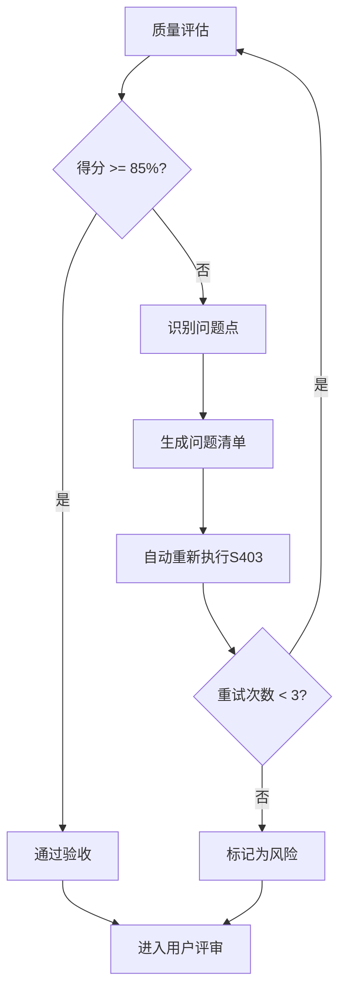

# S403: 核心需求提取

## Section 1: 元信息 (Meta Information)

| 项目 | 内容 |
|------|------|
| **Skill 编号** | S403 |
| **Skill 名称** | 核心需求提取 |
| **英文名称** | Core Requirements Extraction |
| **所属阶段** | S4 - 需求整合与核心提炼阶段 |
| **执行顺序** | S4 阶段第 3 个执行 |
| **执行模式** | normal / lightweight 均执行 |
| **依赖 Skill** | S402 (需求优先级排序) |
| **后置 Skill** | S404 (原型设计) |
| **版本** | v3.1 |
| **最后更新时间** | 2026-03-27 |

---

## Section 2: 功能描述 (Functional Description)

### 2.1 核心职责

S403 负责从优先级排序后的需求中提取核心功能需求，识别 MVP (Minimum Viable Product) 范围，为产品原型设计和开发规划提供明确的需求基线：

1. **核心功能识别**：从所有需求中识别构成产品核心价值的功能需求
2. **MVP 范围界定**：确定最小可行产品的功能边界
3. **需求分层**：将需求划分为 Must Have / Should Have / Could Have / Won't Have
4. **核心需求规格化**：为核心需求制定详细的规格说明
5. **开发阶段规划**：基于需求优先级和依赖关系规划开发阶段
6. **需求基线建立**：建立核心需求基线，支持后续变更管理

### 2.2 核心职责权重

| 职责编号 | 职责名称 | 说明 | 权重 |
|---------|---------|------|------|
| S403-R01 | 核心功能识别 | 识别构成产品核心价值的功能需求 | 25% |
| S403-R02 | MVP 范围界定 | 确定最小可行产品的功能边界 | 25% |
| S403-R03 | 需求分层 | 按 MoSCoW 方法对需求进行分类 | 20% |
| S403-R04 | 核心需求规格化 | 为核心需求制定详细规格说明 | 15% |
| S403-R05 | 开发阶段规划 | 规划需求实现的阶段和顺序 | 10% |
| S403-R06 | 需求基线建立 | 建立核心需求基线版本 | 5% |

### 2.3 输入规范 (Input Specifications)

#### 必需输入

| 输入编号 | 来源 Skill | 产物 ID | 产物类型 | 必需性 |
|---------|-----------|--------|---------|--------|
| IN-01 | S402 | {PlanID}-S4-S402-001 | 需求优先级排序结果 | 必需 |
| IN-02 | S401 | {PlanID}-S4-S401-001 | 需求分类梳理结果 | 必需 |
| IN-03 | S104 | {PlanID}-S1-S104-001 | 需求验证报告 | 参考 |
| IN-04 | S101 | {PlanID}-S1-S101-001 | 需求边界界定报告 | 参考 |

#### 输入内容要求

**S402 产物必需包含**：
- 优先级排序后的需求列表（含优先级得分）
- 需求优先级等级（P0-P4）
- 版本规划信息（MVP/V1.0/V2.0/Future）
- 需求依赖关系

**S401 产物必需包含**：
- 按功能/用户/系统/业务分类的需求
- 需求分类统计

### 2.4 输出规范 (Output Specifications)

#### 产物清单

| 产物编号 | 产物 ID 格式 | 产物名称 | 文件格式 | 存储路径 |
|---------|-------------|---------|---------|---------|
| OUT-01 | {PlanID}-S4-S403-001 | 核心需求提取报告 | Markdown | `artifacts/stages/s4/{PlanID}-S4-S403-001.md` |
| OUT-02 | {PlanID}-S4-S403-002 | MVP 范围定义文档 | Markdown | `artifacts/stages/s4/{PlanID}-S4-S403-002.md` |
| OUT-03 | - | Todo-List 更新 | Markdown | `artifacts/plans/{PlanID}/todo-list.md` |

#### 产物内容结构

**核心需求提取报告**包含：
1. 执行摘要
2. 核心功能需求清单（Must Have）
3. MVP 范围定义
4. 需求分层结果（MoSCoW 分类）
5. 核心需求规格说明
6. 开发阶段规划建议
7. 需求基线信息
8. 风险与假设
9. 附录

**MVP 范围定义文档**包含：
1. MVP 目标定义
2. MVP 功能清单
3. MVP 用户场景
4. MVP 验收标准
5. MVP 排期建议

---

## Section 3: 执行流程 (Execution Process)

### 3.1 流程概览


### 3.2 详细步骤说明

#### 步骤 1：前置校验

**目标**：验证前置 Skill 产物是否存在且格式正确

**操作**：
1. 检查 S402 产物是否存在 (`{PlanID}-S4-S402-001.md`)
2. 检查 S401 产物是否存在 (`{PlanID}-S4-S401-001.md`)
3. 验证产物状态是否为 completed
4. 验证产物 ID 格式是否符合规范

**验证规则**：
```
验证通过条件：
- S402 产物存在且状态为 completed
- S401 产物存在且状态为 completed
- 产物包含优先级排序后的需求列表
- 产物 ID 格式符合规范
```

**错误处理**：
- S402 产物不存在：返回 E001 错误
- S401 产物不存在：返回 E002 错误
- 产物状态异常：返回 E003 错误

#### 步骤 2：读取 S402 产物

**目标**：读取需求优先级排序结果

**操作**：
1. 读取 `{PlanID}-S4-S402-001.md`
2. 解析 Markdown 报告，提取 prioritizedRequirements 列表
3. 提取每个需求的优先级、评估得分、版本规划信息
4. 提取需求依赖关系

**验证规则**：
- Markdown 报告必须格式规范
- prioritizedRequirements 列表不能为空
- 每个需求必须包含 reqId、priority、phase 字段

**错误处理**：
- 文件读取失败：返回 E101 错误
- Markdown 解析失败：返回 E102 错误
- 需求清单为空：返回警告 W101，继续执行

#### 步骤 3：读取 S401 产物

**目标**：读取需求分类梳理结果

**操作**：
1. 读取 `{PlanID}-S4-S401-001.md`
2. 解析 Markdown 报告，提取分类需求列表
3. 提取功能需求、用户需求、系统需求、业务需求分类信息

**验证规则**：
- Markdown 报告必须格式规范
- 至少包含功能需求分类

**错误处理**：
- 文件读取失败：返回 E103 错误
- Markdown 解析失败：返回 E104 错误

#### 步骤 4：提取核心需求候选集

**目标**：从所有需求中提取核心需求候选集

**操作**：
1. 筛选 P0 (Must Have) 优先级需求
2. 筛选 MVP 阶段规划的需求
3. 识别具有最多依赖关系的需求（核心节点）
4. 识别支撑产品核心价值的需求

**核心需求判定标准**：
```
判定条件（满足任一即可）：
- 优先级为 P0 (Must Have)
- 版本规划为 MVP
- 被其他需求依赖次数 >= 3
- 直接支撑产品核心价值主张
```

#### 步骤 5：核心功能识别

**目标**：识别构成产品核心价值的功能需求

**操作**：
1. 分析产品愿景和目标用户
2. 识别解决用户核心痛点的功能
3. 识别差异化竞争优势功能
4. 识别支撑业务模型的关键功能

**核心功能特征**：
- 解决用户最痛的痛点
- 是产品存在的根本理由
- 用户愿意为之付费的核心价值
- 与竞品形成差异化的关键

**输出**：核心功能需求列表（5-10 项）

#### 步骤 6：MVP 范围界定

**目标**：确定最小可行产品的功能边界

**操作**：
1. 从核心功能中选择 MVP 必需功能
2. 评估每个功能的实现成本和用户价值
3. 确定 MVP 的功能边界（包含/排除）
4. 定义 MVP 成功标准

**MVP 界定原则**：
```
包含原则：
- 解决用户核心痛点的功能
- 验证产品价值主张必需的功能
- 支撑基础业务流程的功能

排除原则：
- 锦上添花的功能
- 低频使用的功能
- 高成本低价值的功能
- 可后期迭代添加的功能
```

**输出**：MVP 功能清单（3-7 项核心功能）

#### 步骤 7：需求分层 MoSCoW

**目标**：使用 MoSCoW 方法对需求进行分层

**操作**：
1. 将 P0 需求标记为 Must Have (必须有)
2. 将 P1 需求标记为 Should Have (应该有)
3. 将 P2 需求标记为 Could Have (可以有)
4. 将 P3/P4 需求标记为 Won't Have (暂不做)

**分层标准**：

| 层级 | 标准 | 占比建议 |
|------|------|---------|
| Must Have | 产品成功必需，没有就不能发布 | 20-30% |
| Should Have | 重要但可妥协，可临时替代方案 | 30-40% |
| Could Have | 有更好，没有也能接受 | 20-30% |
| Won't Have | 明确本次不做，未来可能考虑 | 10-20% |

#### 步骤 8：用户交互确认

**触发场景**：
1. MVP 范围与预期差异较大
2. 核心功能识别存在争议
3. 需求分层结果需要确认
4. 资源约束需要权衡

**交互流程**：遵循 [execution-flow-standard.md](../../templates/execution-flow-standard.md) 中的"用户交互流程"章节

**使用模板**：
- **信息收集**：使用 [information-collection-template.md](../../templates/user-interaction/information-collection-template.md)
- **方案选择**：使用 [option-selection-template.md](../../templates/user-interaction/option-selection-template.md)

#### 步骤 9：核心需求规格化

**目标**：为核心需求制定详细的规格说明

**操作**：
1. 为每个核心需求编写详细描述
2. 制定验收标准（3-5 条/需求）
3. 明确需求依赖关系
4. 估算实现复杂度

**规格化内容**：
```
需求规格包含：
- reqId: 需求 ID
- name: 需求名称
- description: 详细描述
- acceptanceCriteria: 验收标准列表
- dependencies: 依赖需求列表
- complexity: 复杂度（高/中/低）
- priority: 优先级（MoSCoW）
- phase: 所属阶段（MVP/V1/V2）
```

#### 步骤 10：开发阶段规划

**目标**：基于需求优先级和依赖关系规划开发阶段

**操作**：
1. 分析需求依赖关系，确定执行顺序
2. 按阶段分组需求（MVP/V1.0/V2.0）
3. 识别关键路径
4. 制定阶段交付目标

**阶段规划输出**：
```
MVP 阶段：
- 目标：验证核心价值
- 需求数：{X} 项
- 关键功能：{功能列表}

V1.0 阶段：
- 目标：完整基础功能
- 需求数：{X} 项
- 新增功能：{功能列表}

V2.0 阶段：
- 目标：增强竞争力
- 需求数：{X} 项
- 规划功能：{功能列表}
```

#### 步骤 11：需求基线建立

**目标**：建立核心需求基线版本

**操作**：
1. 为需求集合分配基线版本号（v1.0）
2. 记录基线创建时间和创建人
3. 建立变更日志结构
4. 定义变更管理流程

**基线信息**：
```
基线版本：v1.0
创建时间：{ISO 时间戳}
创建人：System
核心需求数：{X} 项
MVP需求数：{X} 项
变更日志：[]
```

#### 步骤 12：质量评估

按照 Section 5 质量标准进行自评，综合得分 >= 85% 方可进入下一步。

#### 步骤 13：生成核心需求报告

**目标**：生成核心需求提取报告

**操作**：
1. 按照模板生成 Markdown 报告
2. 包含所有核心需求规格
3. 包含 MVP 范围定义
4. 包含需求分层结果

**报告结构**：
- 执行摘要
- 核心功能需求清单
- MVP 范围定义
- 需求分层结果
- 核心需求规格说明
- 开发阶段规划
- 需求基线信息
- 风险与假设

#### 步骤 14：生成 MVP 范围文档

**目标**：生成独立的 MVP 范围定义文档

**操作**：
1. 提取 MVP 相关需求
2. 定义 MVP 目标和成功标准
3. 制定 MVP 验收标准
4. 提供 MVP 排期建议

#### 步骤 15：更新 Todo-List

**更新规则**：遵循 [execution-flow-standard.md](../../templates/execution-flow-standard.md) 中的"Todo-List更新规则"章节

**S403特定更新时机**：
1. **执行开始**：步骤1完成后，状态：待执行 → 执行中
2. **用户交互后**：步骤8完成后，更新交互记录
3. **执行完成**：步骤14完成后，状态：执行中 → 已完成，评审状态：待评审
4. **用户评审后**：步骤16完成后，根据评审结果更新状态

#### 步骤 16：用户评审

**目标**：用户对核心需求提取结果进行评审和确认

**评审流程**：遵循 [execution-flow-standard.md](../../templates/execution-flow-standard.md) 中的"用户评审流程"章节

**评审展示内容**：
- 核心功能识别结果（5-10项）
- MVP范围定义（3-7项核心功能）
- 需求分层统计（MoSCoW四象限）
- 开发阶段规划建议

#### 步骤 17：返回执行结果

**目标**：返回 Skill 执行结果给 Coordinator Agent

**返回内容**：
```
- 执行状态：success/failed
- PlanID：计划 ID
- SkillID：S403
- 输出产物：产物文件列表
- 执行统计：核心需求数、MVP需求数等
```

### 3.3 Demo 示例

**输入**：S402产物（已排序的需求列表）

```
需求列表（部分）：
1. REQ-001: 用户注册登录 - P0 - MVP
2. REQ-002: 任务创建 - P0 - MVP
3. REQ-003: 任务编辑 - P0 - MVP
4. REQ-004: 任务删除 - P1 - MVP
5. REQ-005: 任务分类 - P1 - V1.0
6. REQ-006: 数据统计 - P2 - V2.0
```

**处理过程**：
1. 提取P0需求 → 3项（注册登录、任务创建、任务编辑）
2. 识别核心功能 → 任务管理（创建、编辑）
3. 界定MVP范围 → 4项（含任务删除）
4. 需求分层 → Must Have:4, Should Have:1, Could Have:1
5. 规格化核心需求 → 制定验收标准

**输出**：
- 核心需求报告：`P000001-S4-S403-001.md`
- MVP范围文档：`P000001-S4-S403-002.md`
- 核心功能：3项，MVP功能：4项

---

## Section 4: 产物规范 (Artifact Specifications)

S403产物规范遵循 [artifact-specifications.md](../../templates/artifact-specifications.md) 中的通用定义。

### 4.1 S403特定产物清单

| 产物名称 | 产物ID | 存储路径 | 说明 |
|---------|--------|---------|------|
| 核心需求提取报告 | `{PlanID}-S4-S403-001` | `artifacts/stages/s4/{PlanID}-S4-S403-001.md` | 主产物，包含核心功能清单、MVP范围、需求分层 |
| MVP范围定义文档 | `{PlanID}-S4-S403-002` | `artifacts/stages/s4/{PlanID}-S4-S403-002.md` | MVP目标、功能清单、验收标准 |

---

## Section 5: 质量标准 (Quality Standards)

### 5.1 质量评估框架

S403遵循 [quality-standard.md](../../templates/quality-standard.md) 中的ISO/IEC 25010质量评估框架。

**S403特定权重分配**：
| 维度 | 权重 | 验收阈值 |
|------|------|----------|
| **完整性** | 30% | >= 90% |
| **准确性** | 25% | >= 90% |
| **一致性** | 20% | >= 95% |
| **可读性** | 15% | >= 85% |
| **可追溯性** | 10% | >= 90% |

**验收门槛**：质量综合得分 >= 85%

### 5.2 检查清单

**完整性检查**（30%）：
- [ ] 核心功能需求已识别（5-10项）
- [ ] MVP范围已界定（3-7项核心功能）
- [ ] 所有需求已完成MoSCoW分层
- [ ] 核心需求已规格化（含验收标准）

**准确性检查**（25%）：
- [ ] 核心功能识别准确（解决核心痛点）
- [ ] MVP范围合理（可验证核心价值）
- [ ] 需求分层准确（与优先级一致）
- [ ] 验收标准可测试、可量化

**一致性检查**（20%）：
- [ ] 核心需求与S402优先级排序一致
- [ ] MVP范围与S402版本规划一致
- [ ] 术语使用一致

**可读性检查**（15%）：
- [ ] 核心需求描述清晰明确
- [ ] 验收标准表述准确
- [ ] 报告结构符合模板规范

**可追溯性检查**（10%）：
- [ ] 核心需求来源明确（关联S402产物）
- [ ] 依赖关系清晰
- [ ] 需求ID唯一且连续

### 5.3 质量综合得分计算

```
得分 = Σ(维度得分 × 维度权重)

示例：
- 完整性：95% × 30% = 28.5
- 准确性：90% × 25% = 22.5
- 一致性：100% × 20% = 20.0
- 可读性：90% × 15% = 13.5
- 可追溯性：95% × 10% = 9.5
- 总分：28.5 + 22.5 + 20.0 + 13.5 + 9.5 = 94.0%
```

### 5.4 验收标准

| 结果 | 标准 | 处理方式 |
|------|------|----------|
| **通过** | 质量综合得分 ≥ 85% | 进入用户评审阶段 |
| **不通过** | 质量综合得分 < 85% | 识别问题 → 生成问题清单 → 自动重新执行 |

### 5.5 不达标处理流程



**重试机制**：
- 第1次：自动重新执行，尝试修复问题
- 第2次：自动重新执行，调整参数
- 第3次：自动重新执行，简化复杂部分
- 仍不达标：标记为风险，进入用户评审并提示问题

---

## Section 6: 错误处理 (Error Handling)

### 6.1 错误分类与代码表

S403错误处理遵循 [error-code-standard.md](../../templates/error-code-standard.md) 中的通用定义。

**S403特定错误代码**：

| 错误码 | 错误类型 | 说明 | 处理策略 |
|--------|----------|------|----------|
| **前置校验错误** |
| E001 | S402产物缺失 | 优先级排序产物不存在 | 提示先执行S402 |
| E002 | S401产物缺失 | 需求分类产物不存在 | 提示先执行S401 |
| **执行过程错误** |
| E101 | 核心识别失败 | 无法识别核心功能 | 使用默认规则重新识别 |
| E102 | MVP界定失败 | MVP范围界定异常 | 简化MVP范围继续执行 |
| **后置校验错误** |
| E201 | 报告生成失败 | 无法生成Markdown报告 | 检查模板，重试3次 |
| E202 | 产物不完整 | 核心需求报告缺少必要章节 | 补充缺失内容 |

### 6.2 错误恢复策略

| 错误类型 | 恢复策略 | 重试次数 | 失败处理 |
|----------|----------|----------|----------|
| 核心识别失败 | 使用默认规则重新识别 | 1次 | 标记为风险 |
| MVP界定失败 | 简化MVP范围 | 1次 | 标记为风险 |
| 质量验证不通过 | 补充/修正 | 最多3次 | 标记为风险 |

---

## 附录：与其他 Skill 的关系

### Skill 定位对比

| Skill | 核心职责 | 输出产物 | 执行阶段 |
|-------|---------|---------|---------|
| S401 | 需求分类梳理 | 按功能/用户/系统/业务分类的需求 | S4 |
| S402 | 需求优先级排序 | 带优先级排序的需求清单 | S4 |
| **S403** | **核心需求提取** | **核心功能清单、MVP 范围定义** | **S4** |
| S404 | 原型设计 | 产品原型设计文档 | S4 |

### S403 的输入输出关系

```
S401 (需求分类) ----\
                     ---> S403 (核心需求提取) ---> S404 (原型设计)
S402 (优先级排序) ---/
```

---

## 版本历史

| 版本 | 日期 | 更新内容 | 更新人 |
|------|------|---------|--------|
| v1.0 | 2026-03-24 | 初始版本，作为 Skill8 需求整合与规整 | System |
| v2.0 | 2026-03-24 | 标准化版本，重新定位为 S403 核心需求提取 | System |
| v3.0 | 2026-03-27 | 按照6段式结构标准重构，增强质量标准和错误处理 | System |
| v3.1 | 2026-03-27 | Skill瘦身优化，精简重复内容，改为引用通用模板 | System |

---

*本 Skill 符合 IEEE 29148-2011 需求和软件工程标准，遵循 SMART 原则*
