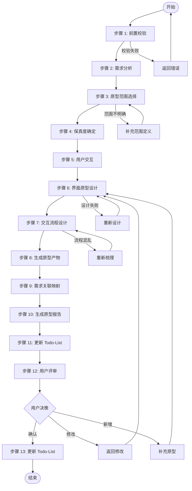
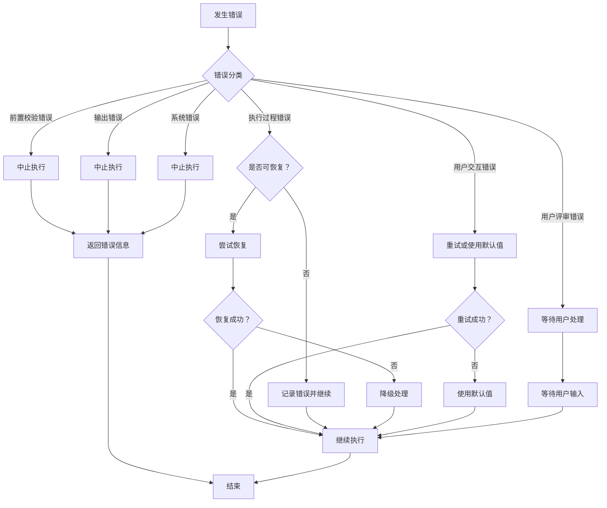

# Skill15: 原型设计

## 一、元信息

| 项目 | 内容 |
|-----|------|
| **Skill 编号** | S4-S15 |
| **Skill 名称** | 原型设计 |
| **英文名称** | Prototype Design |
| **所属阶段** | S4 - 需求整合与核心提炼阶段（可选） |
| **执行顺序** | S4 阶段最后执行（在 Skill8 之后） |
| **执行模式** | 常规模式可选执行，轻量化模式跳过 |
| **版本** | v1.0 |
| **最后更新** | 2026-03-26 |
| **前置依赖** | S4-S08（核心需求提炼，必需） |
| **后置 Skill** | 无（S4 阶段最后一个 Skill） |
| **产物 ID 格式** | `{PlanID}-S4-S15-001` |
| **产物类型** | prototype_report（Markdown） |
| **存储路径** | `database/prototypes/{PlanID}/` |
| **模板引用** | [template.md](template.md) |

---

## 二、功能描述

### 2.1 核心职责

Skill15 负责为核心功能创建可视化原型，通过快速原型设计帮助用户和开发团队更直观地理解需求，发现需求问题。具体包括：

1. **原型范围选择**：根据需求优先级和复杂度，选择需要原型设计的核心功能
2. **保真度确定**：根据项目需求和时间约束，确定原型保真度等级（低保真/中保真/高保真）
3. **界面原型设计**：为核心功能创建界面线框图，展示页面布局、元素结构和视觉层次
4. **交互流程设计**：设计用户操作流程，定义页面跳转关系和交互逻辑
5. **原型评审组织**：组织用户评审原型，收集反馈意见
6. **需求关联映射**：将原型与需求文档关联，建立追溯关系
7. **需求优化建议**：基于原型评审发现的问题，提出需求优化建议
8. **原型报告生成**：输出完整的原型设计报告（Markdown）

### 2.2 输入输出

#### 输入

**前置产物**：
- Plan 定义文件（必需）
- 核心需求提炼报告（S4-S08 产物，必需）
- 需求分类梳理报告（S4-S05 产物，参考）
- 需求优先级排序报告（S4-S06 产物，参考）

**输入数据**：

| 数据项 | 说明 | 示例值 |
|--------|------|--------|
| Plan ID | 当前计划的唯一标识 | P000001 |
| Plan 定义文件 | Plan 定义文档路径 | database/plans/{PlanID}/plan-definition.md |
| 核心需求产物 ID | S4-S08 产物标识 | P000001-S4-S08-001 |
| 核心需求报告路径 | S4-S08 产物文件路径 | database/stages/s4/{PlanID}/P000001-S4-S08-001.md |
| P0 级需求清单 | 高优先级需求列表 | 从优先级排序报告中提取 |
| 用户群体信息 | 目标用户画像 | 从需求文档中提取 |

#### 输出

**产物清单**：
- 原型设计报告（Markdown）：`database/prototypes/{PlanID}/{PlanID}-S4-S15-001.md`
- 原型线框图（PNG/SVG）：`database/prototypes/{PlanID}/wireframes/`
- 交互流程图（PNG/SVG）：`database/prototypes/{PlanID}/flow/`
- Todo-List 更新：更新 Todo-List 中 S4-S15 的执行状态

**输出数据**：

| 数据项 | 说明 | 示例值 |
|--------|------|--------|
| 执行状态 | 执行成功或失败 | success / failed |
| Plan ID | 当前计划的唯一标识 | P000001 |
| 产物 ID | 原型设计报告产物标识 | P000001-S4-S15-001 |
| 产物类型 | 产物类型标识 | prototype_design |
| 产物路径 | 原型设计报告文件路径 | database/prototypes/{PlanID}/P000001-S4-S15-001.md |
| 原型页面数 | 设计的原型页面数量 | 8 |
| 交互流程数 | 设计的交互流程数量 | 3 |
| 关联需求数 | 与原型关联的需求数量 | 12 |
| 需求优化建议数 | 基于原型发现的需求优化建议数量 | 5 |

### 2.3 质量标准

采用 ISO/IEC 25010 软件质量模型，从 5 个维度评估原型设计质量：

| 质量维度 | 权重 | 说明 | 验收标准 |
|---------|------|------|---------|
| **完整性** | 30% | 所有核心功能都有对应的原型页面 | 核心功能覆盖率 100% |
| **准确性** | 25% | 原型准确反映需求定义 | 需求一致性 ≥ 95% |
| **可用性** | 20% | 原型界面清晰，交互逻辑合理 | 用户理解度 ≥ 90% |
| **一致性** | 15% | 原型风格统一，交互规范一致 | 风格一致性 100% |
| **可追溯性** | 10% | 原型与需求建立清晰的追溯关系 | 追溯完整率 100% |

**质量综合得分** = 完整性×30% + 准确性×25% + 可用性×20% + 一致性×15% + 可追溯性×10%

**验收标准**：质量综合得分 ≥ 85%

---

## 三、执行流程



### 步骤 1：前置校验

**目标**：验证前置产物是否完整且格式正确

**操作**：
1. 检查 Plan 定义文件是否存在
2. 检查 S4-S08 核心需求提炼报告是否存在
3. 检查 S4-S05 需求分类梳理报告是否存在（可选）
4. 检查 S4-S06 需求优先级排序报告是否存在（可选）
5. 验证文件格式是否符合要求

**验证规则**：
- 前置产物必须存在且可读
- 产物 ID 格式必须正确
- 文件内容非空

**错误处理**：
- E001: 前置产物缺失 → 返回错误，要求先完成前置 Skill
- E002: 输入文件格式错误 → 返回错误，要求重新生成前置产物
- E003: 产物 ID 不匹配 → 返回错误，要求检查产物一致性

### 步骤 2：需求分析

**目标**：从核心需求报告中提取需要原型设计的需求

**操作**：
1. 读取核心需求提炼报告
2. 提取 P0 级核心功能需求
3. 提取 P1 级重要功能需求（可选）
4. 分析用户群体和使用场景
5. 识别关键交互流程

**验证规则**：
- 需求提取完整率 ≥ 95%
- 需求描述准确无误

**错误处理**：
- E1500: 核心需求报告读取失败 → 重试读取或返回错误
- E1501: 需求提取不完整 → 补充识别遗漏的需求

### 步骤 3：原型范围选择

**目标**：确定需要原型设计的功能范围

**操作**：
1. 识别所有 P0 级核心功能
2. 根据时间约束选择原型页面数量：
   - 时间充裕（>2 小时）：8-12 个页面
   - 时间适中（1-2 小时）：5-8 个页面
   - 时间紧张（<1 小时）：3-5 个页面
3. 优先选择用户高频使用场景
4. 识别关键交互流程（3-5 个）

**验证规则**：
- 至少覆盖所有 P0 级核心功能
- 页面数量在合理范围内

**错误处理**：
- E1502: 范围选择不明确 → 请求用户确认原型范围

### 步骤 4：保真度确定

**目标**：根据项目需求确定原型保真度等级

**操作**：
1. 评估项目需求：
   - 需求复杂度评分 > 80 分 → 推荐高保真
   - 核心功能数量 ≥ 5 个 → 推荐中保真
   - 时间紧迫 → 推荐低保真
2. 考虑用户群体：
   - 非技术用户为主 → 推荐中/高保真
   - 技术用户为主 → 低保真可接受
3. 确定最终保真度等级

**保真度等级定义**：

| 保真度 | 说明 | 制作时间 | 适用场景 |
|--------|------|---------|---------|
| **低保真** | 手绘草图或简单线框图 | 10-30 分钟/页面 | 早期概念验证、快速探索 |
| **中保真** | 数字化线框图，含基本布局 | 30-60 分钟/页面 | 需求评审、内部沟通 |
| **高保真** | 接近最终 UI 效果，含交互 | 2-4 小时/页面 | 用户测试、最终确认 |

**验证规则**：
- 保真度选择有明确依据
- 与时间约束匹配

**错误处理**：
- E1503: 保真度选择不当 → 重新评估并选择

### 步骤 5：用户交互

**目标**：在原型设计前，确认关键设计决策

**触发场景**：
- 原型范围不明确
- 保真度偏好不清晰
- 关键功能优先级有争议
- 目标用户群体多样

**交互流程**：
1. 识别需要用户确认的设计决策
2. 生成澄清问题（使用标准化问题模板）
3. 等待用户输入
4. 解析用户输入，补充到设计需求
5. 如仍不清晰，进行多轮对话（最多 3 轮）

**问题模板示例**：

**场景 1：原型范围确认**
```
【原型设计 - 范围确认】

根据需求分析，建议为以下功能创建原型：

核心功能（P0）：
1. {功能1名称}
2. {功能2名称}
3. {功能3名称}

可选功能（P1）：
4. {功能4名称}
5. {功能5名称}

请选择：
A. 仅核心功能（推荐，时间约 X 分钟）
B. 核心功能 + 部分可选功能（时间约 Y 分钟）
C. 全部功能（时间约 Z 分钟）
D. 自定义（请说明）

您的选择：
```

**场景 2：保真度偏好调研**
```
【原型设计 - 保真度选择】

请选择原型设计的精细程度：

A. 低保真（手绘风格）
   - 快速创建，成本低
   - 适合早期概念验证
   - 时间：约 X 分钟

B. 中保真（线框图风格）
   - 结构清晰，易于理解
   - 适合需求评审
   - 时间：约 Y 分钟

C. 高保真（接近真实 UI）
   - 视觉效果佳，体验真实
   - 适合用户测试
   - 时间：约 Z 分钟

您的选择：
```

**交互记录保存**：
所有交互记录保存到原型设计报告的"用户交互记录"章节，包含：
- 交互轮次
- 交互时间
- 交互类型
- 问题描述
- 用户输入
- 解析结果
- 处理状态

### 步骤 6：界面原型设计

**目标**：为核心功能创建界面线框图

**操作**：
1. 为每个选定的功能设计页面布局：
   - 页面标题和导航
   - 核心功能区域
   - 信息展示区域
   - 操作按钮区域
2. 定义页面元素：
   - 输入框、按钮、选择器等交互元素
   - 列表、卡片、表格等展示元素
   - 图标、图片等视觉元素
3. 标注元素说明：
   - 元素名称
   - 元素类型
   - 交互说明

**验证规则**：
- 每个页面都有清晰的布局
- 核心功能突出显示
- 元素标注完整

**错误处理**：
- E1504: 页面设计不完整 → 补充缺失内容
- E1505: 布局不合理 → 重新设计布局

### 步骤 7：交互流程设计

**目标**：设计用户操作流程和页面跳转关系

**操作**：
1. 识别主要用户场景：
   - 新用户首次使用流程
   - 核心功能使用流程
   - 异常处理流程
2. 定义页面跳转关系：
   - 正常流程跳转
   - 分支流程跳转
   - 返回和退出逻辑
3. 标注交互细节：
   - 触发条件
   - 过渡效果
   - 状态变化

**验证规则**：
- 流程覆盖主要用户场景
- 跳转逻辑清晰合理
- 无死循环或断点

**错误处理**：
- E1506: 流程覆盖不完整 → 补充缺失流程
- E1507: 跳转逻辑混乱 → 重新梳理流程

### 步骤 8：生成原型产物

**目标**：生成原型线框图和交互流程图

**操作**：
1. 生成页面线框图（文本描述格式）：
   - 使用 ASCII 或 Markdown 表格描述页面布局
   - 标注元素位置和尺寸
   - 说明元素交互行为
2. 生成交互流程图（文本描述格式）：
   - 使用 Mermaid 语法绘制流程图
   - 标注页面节点和跳转关系
   - 说明触发条件和操作

**产物格式**：
- 线框图：Markdown 格式，包含页面结构和元素说明
- 流程图：Mermaid 格式，展示页面跳转关系

**验证规则**：
- 产物格式规范
- 内容完整准确

**错误处理**：
- E1508: 产物生成失败 → 检查格式并重新生成

### 步骤 9：需求关联映射

**目标**：建立原型与需求的追溯关系

**操作**：
1. 为每个原型页面关联对应的需求：
   - 页面功能对应的需求 ID
   - 页面元素对应的需求描述
2. 为每个交互流程关联对应的需求：
   - 流程对应的功能需求
   - 交互对应的用户体验需求
3. 生成需求追溯矩阵

**验证规则**：
- 每个页面至少关联一个需求
- 每个需求都有对应的原型支持
- 追溯关系清晰可查

**错误处理**：
- E1509: 需求关联不完整 → 补充关联关系

### 步骤 10：生成原型报告

**目标**：生成原型设计报告（Markdown 格式）

**操作**：
1. 按照 template.md 模板格式组织内容
2. 填写原型设计概览
3. 填写界面原型详情（每个页面一个章节）
4. 填写交互流程说明
5. 填写需求关联矩阵
6. 填写需求优化建议
7. 填写用户交互记录
8. 填写评审记录

**验证规则**：
- 报告结构完整
- 内容符合模板要求
- 格式规范统一

**错误处理**：
- E201: 报告生成失败 → 检查模板并重新生成
- E202: 报告内容不完整 → 补充缺失内容
- E203: 报告格式错误 → 修正格式

### 步骤 11：更新 Todo-List

**目标**：更新 Todo-List，标记 S4-S15 完成，准备用户评审

**操作**：
1. 读取 `database/plans/{PlanID}/todo-list.md`
2. 更新 S4-S15 任务状态为 `已完成`
3. 更新评审状态为 `待评审`
4. 记录完成时间、产物路径
5. 添加评审提示
6. 写回 Todo-List 文件

**Todo-List 更新内容示例**：

```markdown
## S4 阶段 - 需求整合与核心提炼

### S4-S15 原型设计
- [x] 执行原型设计
  - 状态：已完成
  - 完成时间：2026-03-26 18:00
  - 产物：`database/prototypes/P000001/P000001-S4-S15-001.md`
- [ ] 用户评审
  - 状态：待评审
  - 评审提示：请查看原型设计报告，确认原型设计
```

**错误处理**：
- E204: Todo-List 更新失败 → 返回错误，但原型设计结果仍然有效

### 步骤 12：用户评审

**目标**：用户对原型设计结果进行评审和确认

**评审触发**：步骤 11 完成后自动触发

**评审展示**：
向用户展示以下内容：
- 原型设计报告核心内容（原型概览、页面清单、交互流程）
- 需求关联矩阵
- 需求优化建议
- Todo-List 更新状态

**用户决策选项**：
- **确认**：原型设计无误，完成 S4 阶段
- **修改（小修改）**：直接修改原型设计报告
- **修改（大修改）**：返回步骤 6 重新执行
- **新增想法**：补充原型设计，更新报告

**评审提示模板**：

```
【原型设计完成 - 用户评审】

原型设计已完成，核心内容如下：

**原型概览**：
- 原型页面：{X} 个
- 交互流程：{Y} 个
- 关联需求：{Z} 个
- 保真度等级：{等级}

**页面清单**：
1. {页面1名称}
2. {页面2名称}
3. ...

**需求优化建议**：
- {建议1}
- {建议2}
- ...

---
请评审以上原型设计结果：
- 输入「确认」表示无误，完成 S4 阶段
- 输入「修改」并提供修改意见，格式：「修改：{页面名称}-{具体意见}」
- 输入「新增」并补充原型，格式：「新增：{新页面/新交互}」

示例：
- 确认
- 修改：首页-增加搜索框
- 新增：增加用户个人中心页面
```

**用户响应处理**：
- **确认**：更新 Todo-List 评审状态为 `已确认`，完成 S4 阶段
- **修改（小修改）**：根据用户意见修改原型报告，更新 Todo-List
- **修改（大修改）**：返回步骤 6 重新执行
- **新增想法**：补充原型设计到报告，重新生成原型报告

### 步骤 13：更新 Todo-List（评审后）

**目标**：根据用户评审结果，更新 Todo-List 状态

**操作**：
1. 读取 `database/plans/{PlanID}/todo-list.md`
2. 根据用户评审结果更新状态：
   - 用户确认：评审状态 → `已确认`，阶段状态 → `S4 阶段已完成`
   - 用户修改：评审状态 → `修改中`，记录修改内容
   - 用户新增：评审状态 → `修改中`，补充原型设计
3. 写回 Todo-List 文件

**错误处理**：
- E205: 状态更新失败 → 返回错误，记录详细错误信息

---

## 四、Todo-List 更新规则

### 4.1 更新时机

| 执行阶段 | 更新时机 | 更新内容 |
|---------|---------|---------|
| Skill 执行开始 | 步骤 1 完成后 | 当前任务状态：待执行 → 执行中 |
| 用户交互后 | 步骤 5 完成后 | 更新原型设计偏好信息（如有补充） |
| Skill 执行完成 | 步骤 11 完成后 | 当前任务状态：执行中 → 已完成，评审状态：待评审 |
| 用户评审后 | 步骤 13 完成后 | 根据评审结果更新状态（见下表） |

### 4.2 用户评审后的状态更新

| 用户决策 | 评审状态更新 | 任务状态更新 | 后续操作 |
|---------|------------|------------|---------|
| 确认 | 待评审 → 已确认 | 已完成 | 完成 S4 阶段 |
| 小修改 | 待评审 → 修改中 | 执行中 | 修改产物后重新评审 |
| 大修改 | 待评审 → 重新执行 | 待执行 | 返回步骤 6 重新执行 |
| 新增想法 | 待评审 → 补充中 | 执行中 | 补充信息后重新生成 |

### 4.3 Todo-List 更新示例

**执行开始时更新**：

```markdown
### S4-S15 原型设计
- [ ] 执行原型设计
  - 状态：执行中
  - 开始时间：2026-03-26 17:00
```

**执行完成时更新**：

```markdown
### S4-S15 原型设计
- [x] 执行原型设计
  - 状态：已完成
  - 完成时间：2026-03-26 18:00
  - 产物：`database/prototypes/P000001/P000001-S4-S15-001.md`
- [ ] 用户评审
  - 状态：待评审
  - 评审提示：请查看原型设计报告，确认原型设计
```

**评审确认后更新**：

```markdown
- [x] 用户评审
  - 状态：已确认
  - 确认时间：2026-03-26 18:30
  - 用户决策：确认
- [ ] S4 阶段完成
  - 状态：已完成
```

---

## 五、产物规范

### 5.1 产物 ID 格式

```
{PlanID}-S4-S15-001
```

**示例**：
- `P000001-S4-S15-001.md` - 原型设计报告

### 5.2 存储路径

```
database/
└── prototypes/
    └── {PlanID}/
        ├── {PlanID}-S4-S15-001.md              # 原型设计报告
        ├── wireframes/                          # 线框图目录
        │   ├── page-001-home.png
        │   ├── page-002-login.png
        │   └── ...
        └── flow/                                # 流程图目录
            ├── flow-001-user-register.png
            ├── flow-002-task-create.png
            └── ...
```

### 5.3 产物结构

#### 原型设计报告（Markdown）

**文件结构**：
1. 元信息
2. 原型设计概览
3. 设计决策说明
4. 界面原型详情
5. 交互流程说明
6. 需求关联矩阵
7. 需求优化建议
8. 用户交互记录
9. 评审记录
10. 附录

**详细内容**：参见 [template.md](template.md)

---

## 六、质量标准

### 6.1 质量评估框架

采用 ISO/IEC 25010 软件质量模型，从 5 个维度评估原型设计质量：

| 质量维度 | 权重 | 评估标准 | 检查方法 |
|---------|------|---------|---------|
| **完整性** | 30% | 所有核心功能都有对应的原型页面 | 检查核心功能覆盖率 |
| **准确性** | 25% | 原型准确反映需求定义 | 检查需求一致性 |
| **可用性** | 20% | 原型界面清晰，交互逻辑合理 | 检查用户理解度 |
| **一致性** | 15% | 原型风格统一，交互规范一致 | 检查风格一致性 |
| **可追溯性** | 10% | 原型与需求建立清晰的追溯关系 | 检查追溯完整率 |

### 6.2 检查清单

#### 完整性检查（30%）

- [ ] 所有 P0 级核心功能都有对应的原型页面
- [ ] 主要用户场景都有对应的交互流程
- [ ] 每个页面都有完整的布局说明
- [ ] 每个交互都有清晰的触发条件
- [ ] 需求关联矩阵完整
- [ ] 所有必填字段都已填写
- [ ] 产物 ID 格式正确
- [ ] 存储路径正确

**完整性得分** = (完成项数 / 8) × 100%

#### 准确性检查（25%）

- [ ] 原型页面与需求描述一致
- [ ] 交互流程与功能定义匹配
- [ ] 页面元素与需求规格一致
- [ ] 用户场景覆盖完整
- [ ] 无遗漏的关键功能

**准确性得分** = (完成项数 / 5) × 100%

#### 可用性检查（20%）

- [ ] 页面布局清晰合理
- [ ] 交互逻辑符合用户习惯
- [ ] 操作流程简洁明了
- [ ] 异常处理考虑周全
- [ ] 用户理解无障碍

**可用性得分** = (完成项数 / 5) × 100%

#### 一致性检查（15%）

- [ ] 页面风格统一
- [ ] 交互规范一致
- [ ] 术语使用统一
- [ ] 布局风格统一
- [ ] 标注格式统一

**一致性得分** = (完成项数 / 5) × 100%

#### 可追溯性检查（10%）

- [ ] 每个页面可追溯到对应需求
- [ ] 每个交互可追溯到功能需求
- [ ] 需求优化建议可追溯到原型评审
- [ ] 用户交互记录完整

**可追溯性得分** = (完成项数 / 4) × 100%

### 6.3 质量综合得分

```
质量综合得分 = 完整性×30% + 准确性×25% + 可用性×20% + 一致性×15% + 可追溯性×10%
```

**验收标准**：质量综合得分 ≥ 85%

### 6.4 质量等级

| 得分范围 | 质量等级 | 说明 |
|---------|---------|------|
| 90-100% | 优秀 | 质量超出预期，可直接使用 |
| 85-89% | 良好 | 质量符合要求，可接受 |
| 70-84% | 合格 | 质量基本合格，需要小改进 |
| 60-69% | 不合格 | 质量不达标，需要改进 |
| <60% | 差 | 质量严重不达标，需要返工 |

---

## 七、错误处理

### 7.1 错误分类

| 错误类别 | 错误码范围 | 说明 | 处理策略 |
|---------|-----------|------|---------|
| **前置校验错误** | E001-E099 | 前置产物缺失或格式错误 | 中止执行，返回错误信息 |
| **执行过程错误** | E100-E199 | 执行过程中的业务逻辑错误 | 尝试恢复，记录错误 |
| **输出错误** | E200-E299 | 产物生成和输出错误 | 中止执行，返回错误信息 |
| **用户评审错误** | E301-E399 | 用户评审相关错误 | 等待用户处理或重试 |
| **用户交互错误** | E401-E499 | 用户交互相关错误 | 重试或使用默认值 |
| **系统错误** | E900-E999 | 文件读写、网络等系统级错误 | 中止执行，记录日志 |

### 7.2 错误代码表

#### 前置校验错误（E001-E099）

| 错误码 | 错误类型 | 错误描述 | 处理策略 |
|-------|---------|---------|---------|
| E001 | 前置产物缺失 | 前置 Skill 产物不存在 | 返回错误，要求先完成前置 Skill |
| E002 | 输入文件格式错误 | 输入产物格式不符合模板 | 返回错误，要求重新生成前置产物 |
| E003 | 产物 ID 不匹配 | 产物 ID 与 PlanID 不一致 | 返回错误，要求检查产物一致性 |

#### 执行过程错误（E100-E199）

| 错误码 | 错误类型 | 错误描述 | 处理策略 |
|-------|---------|---------|---------|
| E1500 | 核心需求报告读取失败 | 无法读取 S4-S08 产物 | 重试读取或返回错误 |
| E1501 | 需求提取不完整 | 遗漏重要需求 | 补充识别遗漏的需求 |
| E1502 | 原型范围不明确 | 范围选择不清晰 | 请求用户确认原型范围 |
| E1503 | 保真度选择不当 | 保真度与约束不匹配 | 重新评估并选择 |
| E1504 | 页面设计不完整 | 页面缺少必要元素 | 补充缺失内容 |
| E1505 | 布局不合理 | 页面布局不符合规范 | 重新设计布局 |
| E1506 | 流程覆盖不完整 | 遗漏重要用户场景 | 补充缺失流程 |
| E1507 | 跳转逻辑混乱 | 页面跳转关系不清晰 | 重新梳理流程 |
| E1508 | 产物生成失败 | 无法生成原型产物 | 检查格式并重新生成 |
| E1509 | 需求关联不完整 | 原型与需求关联缺失 | 补充关联关系 |

#### 输出错误（E200-E299）

| 错误码 | 错误类型 | 错误描述 | 处理策略 |
|-------|---------|---------|---------|
| E201 | 报告生成失败 | 无法生成 Markdown 报告 | 检查模板并重新生成 |
| E202 | 报告内容不完整 | 报告缺少必要章节 | 补充缺失内容 |
| E203 | 报告格式错误 | 报告格式不符合模板 | 修正格式 |
| E204 | Todo-List 更新失败 | 无法更新 Todo-List 文件 | 重试或手动更新状态 |
| E205 | 评审后状态更新失败 | 无法根据评审结果更新状态 | 记录详细错误信息 |
| E206 | 文件保存失败 | 无法保存输出文件 | 检查文件权限和磁盘空间 |

#### 用户评审错误（E301-E399）

| 错误码 | 错误类型 | 错误描述 | 处理策略 | 重试次数 |
|-------|---------|---------|---------|---------|
| E301 | 用户评审未通过 | 用户拒绝原型设计结果 | 根据评审意见修改产物 | 1 次 |
| E302 | 用户评审超时 | 用户 24 小时未响应 | 保持 paused 状态，等待用户输入 | - |
| E303 | 用户输入解析失败 | 用户输入格式无法识别 | 请求用户重新输入 | 最多 3 次 |

#### 用户交互错误（E401-E499）

| 错误码 | 错误类型 | 错误描述 | 处理策略 | 重试次数 |
|-------|---------|---------|---------|---------|
| E401 | 用户交互超时 | 用户长时间未响应 | 使用默认值继续，标记信息缺失 | - |
| E402 | 用户输入无效 | 用户输入不符合预期格式 | 重新提问，引导用户正确输入 | 最多 3 次 |
| E403 | 多轮对话超过限制 | 交互轮次超过 3 轮 | 记录信息缺失，继续执行并标记风险 | 不重试 |

#### 系统错误（E900-E999）

| 错误码 | 错误类型 | 错误描述 | 处理策略 |
|-------|---------|---------|---------|
| E901 | 文件读写错误 | 无法读取或写入文件 | 重试操作或返回错误 |
| E902 | 目录创建失败 | 无法创建产物存储目录 | 检查权限并重试 |
| E903 | 网络错误 | 网络请求失败 | 重试请求或返回错误 |
| E904 | 内存不足 | 系统内存不足 | 优化内存使用或返回错误 |
| E905 | 磁盘空间不足 | 磁盘空间不足 | 清理空间或返回错误 |

### 7.3 错误处理流程



### 7.4 错误恢复策略

| 错误类型 | 恢复策略 | 重试次数 | 降级方案 |
|---------|---------|---------|---------|
| 文件读写错误 | 重试读取/写入 | 3 次 | 返回错误，要求手动处理 |
| 网络错误 | 重试请求 | 3 次 | 使用缓存数据或返回错误 |
| 数据格式错误 | 自动修正格式 | 1 次 | 返回错误，要求修正数据 |
| 用户评审超时 | 等待用户输入 | - | 保持 paused 状态 |
| 用户交互超时 | 使用默认值 | - | 标记信息缺失，继续执行 |

---

## 附录

### A. 原型设计决策矩阵

| 场景 | 推荐保真度 | 说明 |
|-----|-----------|------|
| 早期概念验证 | 低保真 | 快速探索，成本低 |
| 需求评审会议 | 中保真 | 结构清晰，易于理解 |
| 用户可用性测试 | 高保真 | 体验真实，反馈准确 |
| 时间紧迫 | 低保真 | 快速产出，核心功能 |
| 复杂交互流程 | 中/高保真 | 清晰展示交互细节 |

### B. 页面数量参考标准

| 项目规模 | 建议页面数 | 制作时间 |
|---------|-----------|---------|
| 小型项目（<10 个需求） | 3-5 页 | 1-2 小时 |
| 中型项目（10-30 个需求） | 5-8 页 | 2-4 小时 |
| 大型项目（>30 个需求） | 8-12 页 | 4-8 小时 |

### C. 版本历史

| 版本 | 日期 | 更新内容 |
|------|------|----------|
| v1.0 | 2026-03-26 | 初始版本，定义 Skill15 完整规范，遵循 DEC-001/DEC-002 |

---

*生成时间：2026-03-26*  
*Skill 版本：v1.0*
