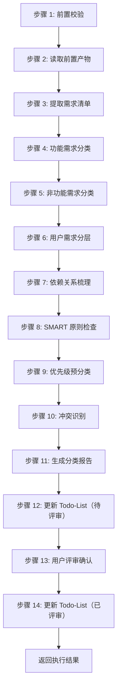

# Skill5: 需求分类梳理

## 一、元信息

| 项目 | 内容 |
|-----|------|
| **Skill 编号** | S4-S05 |
| **Skill 名称** | 需求分类梳理 |
| **英文名称** | Requirements Classification |
| **所属阶段** | S4 - 需求整合与核心提炼阶段 |
| **执行顺序** | S4 阶段第 1 个执行 |
| **执行模式** | 常规模式执行，轻量化模式可选 |
| **依赖 Skill** | S1-S04（需求验证）、S2-S10（市场痛点验证）、S3-S12（技术选型） |
| **后置 Skill** | S4-S06（需求优先级排序） |
| **版本** | 3.0 |

---

## 二、功能描述

### 2.1 核心职责

Skill5 负责对所有收集到的需求进行系统化分类梳理，建立清晰的需求体系结构。主要职责包括：

1. **功能需求分类**：按功能模块/业务域对需求进行归类（核心功能、辅助功能、扩展功能、集成功能）
2. **非功能需求分类**：识别并分类性能、安全、可用性等非功能需求（9 大质量维度）
3. **用户需求分层**：区分不同用户群体的需求（核心用户、次要用户、边缘用户）
4. **需求依赖关系梳理**：识别需求之间的依赖和关联关系（强依赖、弱依赖、互斥、包含）
5. **优先级预分类**：为后续优先级排序提供基础（高/中/低）
6. **SMART 原则检查**：对每个需求进行 SMART 原则验证
7. **需求追溯矩阵建立**：建立需求与产品目标、用户问题、功能模块的追溯关系
8. **需求冲突识别**：识别并标记相互冲突的需求项
9. **需求完整性校验**：检查需求覆盖是否完整，是否存在遗漏
10. **分类报告生成**：输出完整的需求分类体系报告（Markdown）

### 2.2 输入规范

**前置产物（必需）**：
- S1 阶段产物：
  - 需求边界界定报告（S1-S01）
  - 显性需求提取清单（S1-S02）
  - 隐性需求挖掘报告（S1-S03）
  - 需求验证报告（S1-S04）
- S2 阶段产物：
  - 竞品分析报告（S2-S09）
  - 市场痛点验证报告（S2-S10）
- S3 阶段产物：
  - 需求风险识别报告（S3-S07）
  - 技术可行性评估报告（S3-S11）
  - 技术选型报告（S3-S12）

**输入格式**：
- Markdown 报告文件
- 对应的 Markdown 结构化报告文件
- 产物 ID 列表（用于追溯）

**输入验证规则**：
- 所有前置产物必须存在且状态为 completed
- 产物 ID 必须匹配且连续
- Markdown 报告必须结构完整

### 2.3 输出规范

**产物 1：需求分类体系报告**
- **文件路径**：`database/stages/s4/{PlanID}/{PlanID}-S4-S05-001.md`
- **文件格式**：Markdown
- **内容结构**：遵循 template.md 定义的章节，包含分类结果、依赖关系、统计数据、用户交互记录、评审记录
- **版本**：3.0

**产物 2：Todo-List 更新**
- **文件路径**：`database/plans/{PlanID}/todo-list.md`
- **更新内容**：
  - 更新 S4-S05 任务状态为"已完成"或"已评审"
  - 记录产物路径
  - 填写评审记录表格
  - 更新进度概览

### 2.4 产物 ID 命名规则

**标准格式**：`{PlanID}-S4-S05-001`

**示例**：
- `P000001-S4-S05-001.md` - 需求分类体系报告

**编号规则**：
- PlanID: 6 位数字编号（如 P000001）
- S4: 阶段编号
- S05: Skill 编号
- 001: 产物序号（固定）
- 去除"-{类型}"后缀，统一使用.md 格式

### 2.5 Todo-List 更新规则

**更新时机 1：Skill 开始时**
- 任务状态：待执行 → 执行中
- 记录开始时间
- 更新进度概览（执行中 +1，待执行 -1）
- 更新阶段状态（如该阶段第一个 Skill 开始）

**更新时机 2：用户交互后**
- 如交互导致产物重大变更，填写变更记录表格
- 记录交互轮次到备注

**更新时机 3：Skill 完成后（评审前）**
- 任务状态：执行中 → 已完成
- 填写输出文档路径
- 记录完成时间
- 评审状态：待评审

**更新时机 4：用户评审后**
- **评审通过**：任务状态 → 已评审，评审状态 → approved
- **需修改**：评审状态 → rejected，任务状态保持已完成
- **修改中**：评审状态 → modifying，任务状态 → 执行中
- **新增想法**：任务状态 → 执行中，评审状态 → pending
- 填写评审记录表格
- 更新进度概览（已评审 +1，如通过）

**Todo-List 文件路径**：`database/plans/{PlanID}/todo-list.md`

### 2.6 错误处理

**前置校验错误（E001-E099）**：
- E001：前置产物不存在 - 要求先完成前置 Skill
- E002：前置产物格式错误 - 要求重新生成前置产物
- E003：前置产物状态异常 - 要求检查产物状态

**执行过程错误（E100-E199）**：
- E101：文件读取失败 - 重试 3 次，失败则中止
- E102：内容解析失败 - 尝试修复或中止
- E103：需求 ID 冲突 - 重新分配 ID
- W101-W106：警告级别错误，继续执行

**用户评审错误（E300-E399）**：
- E301：用户评审未通过 - 用户提出修改意见
- W301：用户评审超时 - 24 小时未响应，状态设为 paused
- E302：评审意见解析失败 - 无法识别用户输入

**用户交互错误（E400-E499）**：
- W401：用户交互超时 - 等待用户输入超时
- E401：用户输入无效 - 输入不符合格式要求
- E402：多轮交互超限 - 超过 5 轮仍未明确

**输出错误（E200-E299）**：
- E201：Markdown 格式错误 - 检查并修复格式
- E202：报告生成失败 - 检查模板文件
- E203：文件写入失败 - 重试 3 次，失败则中止
- E204：Todo-List 结构错误 - Todo-List 文件格式不符合规范

---

## 三、执行流程

### 3.1 流程概览



### 3.2 详细步骤

#### 步骤 1：前置校验

**目标**：验证前置产物是否完整、格式是否正确

**操作**：
1. 检查 S1-S04、S2-S09、S2-S10、S3-S07、S3-S11、S3-S12 产物是否存在
2. 检查产物状态是否为 completed
3. 检查产物 ID 是否匹配且连续
4. 验证 Markdown 报告格式是否规范

**验证规则**：
- 所有前置产物必须存在
- 产物状态必须为 completed
- Markdown 报告必须格式规范

**错误处理**：
- 产物缺失 → 返回错误 E001，要求先完成前置 Skill
- 格式错误 → 返回错误 E002，要求重新生成前置产物
- 状态异常 → 返回错误 E003，要求检查产物状态

#### 步骤 2：读取前置产物

**目标**：加载所有前置产物内容

**操作**：
1. 读取所有 Markdown 报告文件
2. 读取所有 Markdown 结构化报告文件
3. 解析并提取需求相关信息
4. 建立需求追溯索引

**验证规则**：
- 文件必须可读
- 内容必须完整
- 编码必须为 UTF-8

**错误处理**：
- 文件读取失败 → 返回错误 E101，记录详细错误信息
- 内容解析失败 → 返回错误 E102，尝试修复或中止

#### 步骤 2.5：用户交互（信息补全与澄清）

**触发场景**：
1. 检测到关键字段缺失或模糊（如需求描述不清晰、用户角色不明、分类标准模糊）
2. 需求信息完整度评分低于 60 分
3. 检测到矛盾或冲突信息（如需求分类冲突、依赖关系矛盾）
4. 存在多个可行分类方案需要用户决策

**交互流程**：
1. 识别需要澄清的问题点
2. 生成标准化交互问题（使用问题模板）
3. 展示问题并等待用户输入
4. 解析用户输入并补充到产物中
5. 如仍不明确，进行多轮对话直到明确（最多 5 轮）

**问题模板**：

**模板 1：信息补全**
```
【信息补全请求】

在需求分类过程中，发现以下关键信息缺失：

缺失字段：{字段名称}
当前上下文：{相关背景信息}
影响范围：{不补充的影响}

请补充{字段名称}的具体描述：
- 期望格式：{格式要求}
- 示例：{参考示例}

您的输入：
```

**模板 2：需求澄清**
```
【需求澄清请求】

检测到以下需求描述可能存在歧义：

原文描述："{模糊描述}"
可能理解：
  A. {理解 A - 按功能需求分类}
  B. {理解 B - 按非功能需求分类}
  C. {理解 C - 同时包含两者}
  D. 其他（请说明）

请选择您的真实意图（单选）：
- 输入选项字母（A/B/C/D）
- 如选择 D，请补充具体说明

您的选择：
```

**模板 3：方案选择**
```
【方案选择请求】

针对{需求名称}的分类，存在以下可行方案：

方案 A：{方案 A 描述 - 按功能分类}
  - 优点：{优点列表}
  - 缺点：{缺点列表}
  - 适用场景：{场景描述}

方案 B：{方案 B 描述 - 按用户分层分类}
  - 优点：{优点列表}
  - 缺点：{缺点列表}
  - 适用场景：{场景描述}

请选择您的偏好方案：
- 单选：输入方案字母（A/B）
- 多选：输入方案字母组合（AB/BA）
- 其他：提出新方案

您的选择：
```

**交互记录**：
- 所有交互记录保存到产物文档的"用户交互记录"章节
- 记录格式：交互轮次、交互时间、交互类型、问题描述、用户输入、解析结果、处理状态

**错误处理**：
- W401：用户交互超时 - 等待用户输入超时，继续执行
- E401：用户输入无效 - 输入不符合格式要求，重新提问
- E402：多轮交互超限 - 超过 5 轮仍未明确，使用默认分类并标记待确认

#### 步骤 3：提取需求清单

**目标**：从所有前置产物中提取需求条目

**操作**：
1. 从显性需求提取清单中提取功能需求
2. 从隐性需求挖掘报告中提取潜在需求
3. 从需求验证报告中提取已验证需求
4. 从市场痛点验证报告中提取市场相关需求
5. 从技术可行性评估中提取技术约束需求
6. 去重并合并需求清单
7. 为每个需求分配唯一 ID（R001, R002, ...）

**验证规则**：
- 需求 ID 必须唯一
- 需求描述必须完整
- 需求来源必须可追溯

**错误处理**：
- 需求提取不完整 → 返回警告 W101，继续执行
- 需求 ID 冲突 → 返回错误 E103，重新分配 ID
- 需求描述缺失 → 返回警告 W102，标记待补充

#### 步骤 4：功能需求分类

**目标**：按功能模块/业务域对需求进行归类

**操作**：
1. 识别每个需求的功能属性
2. 按以下 4 类进行分类：
   - **FUNC-CORE**：核心功能需求（产品必须实现的核心业务功能）
   - **FUNC-AUX**：辅助功能需求（支持核心功能的辅助功能）
   - **FUNC-EXT**：扩展功能需求（增强用户体验的扩展功能）
   - **FUNC-INT**：集成功能需求（与外部系统集成的功能）
3. 记录分类理由
4. 统计各类需求数量

**分类标准**：
- 核心功能：直接影响产品核心价值，缺失会导致产品无法使用
- 辅助功能：支持核心功能，提升产品完整性，但非必需
- 扩展功能：增强用户体验，用于差异化竞争，可选
- 集成功能：需要与外部系统交互，扩展产品能力

**验证规则**：
- 每个需求必须分配到且仅分配到一个功能分类
- 分类理由必须充分
- 核心功能需求占比应合理（通常 30-50%）

**错误处理**：
- 分类冲突 → 返回警告 W103，使用默认分类（FUNC-AUX）
- 分类不明确 → 返回警告 W104，标记待确认

#### 步骤 5：非功能需求分类

**目标**：识别并分类非功能需求

**操作**：
1. 识别需求中的非功能属性
2. 按以下 9 类进行分类（参考 ISO/IEC 25010）：
   - **NFR-PERF**：性能需求（响应时间、吞吐量、资源利用率）
   - **NFR-SEC**：安全需求（数据保护、访问控制、加密）
   - **NFR-AVA**：可用性需求（系统可用时间、故障恢复）
   - **NFR-REL**：可靠性需求（容错性、稳定性）
   - **NFR-USA**：易用性需求（用户体验、学习成本）
   - **NFR-SCA**：可扩展性需求（水平/垂直扩展能力）
   - **NFR-MAI**：可维护性需求（代码质量、文档完整性）
   - **NFR-POR**：可移植性需求（跨平台、跨环境能力）
   - **NFR-COM**：兼容性需求（向后兼容、版本兼容）
3. 记录分类理由和指标
4. 统计各类需求数量

**验证规则**：
- 每个非功能需求必须分类
- 指标必须可量化
- 分类必须符合 ISO/IEC 25010 标准

**错误处理**：
- 分类不明确 → 返回警告 W105，标记待确认
- 指标不可量化 → 返回警告 W106，要求补充量化指标

#### 步骤 6：用户需求分层

**目标**：按用户群体对需求进行分层

**操作**：
1. 识别每个需求服务的用户群体
2. 按以下 3 层进行分类：
   - **USER-P0**：核心用户需求（产品主要服务的用户群体）
   - **USER-P1**：次要用户需求（偶尔使用或间接使用的用户）
   - **USER-P2**：边缘用户需求（可能使用但非目标的用户）
3. 记录分层理由
4. 统计各层需求数量和占比

**分层标准**：
- P0 核心用户：使用频率高（每周≥3 次）、需求明确、付费意愿强
- P1 次要用户：使用频率中等（每周 1-2 次）、需求一般、付费意愿中等
- P2 边缘用户：使用频率低（每月≤4 次）、需求不明确、付费意愿低

**验证规则**：
- 每个需求必须分配到且仅分配到一个用户层
- 分层理由必须充分
- P0 用户需求占比应合理（通常 40-60%）

**错误处理**：
- 分层不明确 → 返回警告 W107，标记待确认
- 分层比例失衡 → 返回警告 W108，建议重新评估

#### 步骤 7：依赖关系梳理

**目标**：识别需求之间的依赖和关联关系

**操作**：
1. 识别需求之间的依赖关系类型：
   - **强依赖**：需求 A 实现必须依赖需求 B
   - **弱依赖**：需求 A 实现建议依赖需求 B
   - **互斥**：需求 A 和需求 B 不能同时实现
   - **包含**：需求 A 包含需求 B
2. 记录依赖关系和理由
3. 生成依赖关系图

**验证规则**：
- 依赖关系必须无循环
- 每个依赖必须有明确理由

**错误处理**：
- 循环依赖 → 返回错误 E107，打破循环并记录

#### 步骤 8：SMART 原则检查

**目标**：对每个需求进行 SMART 原则验证

**操作**：
1. 检查 Specific（具体性）：需求描述是否明确
2. 检查 Measurable（可衡量）：是否有量化指标
3. 检查 Achievable（可实现）：技术是否可行
4. 检查 Relevant（相关性）：与业务目标是否相关
5. 检查 Time-bound（时限性）：是否明确所属阶段
6. 记录检查结果和 optimization 建议

**验证规则**：
- 每项检查必须有明确结果（✅/❌）
- 检查不通过项必须有优化建议

**错误处理**：
- SMART 检查缺失 → 执行补充检查

#### 步骤 9：优先级预分类

**目标**：为后续优先级排序提供基础

**操作**：
1. 基于功能分类和用户层进行优先级预分类
2. 核心功能（FUNC-CORE）+ P0 用户 → 高优先级
3. 辅助功能（FUNC-AUX）+ P1 用户 → 中优先级
4. 扩展功能（FUNC-EXT）+ P2 用户 → 低优先级
5. 记录预分类理由

**验证规则**：
- 预分类必须合理
- 必须有分类理由

**错误处理**：
- 预分类不合理 → 返回警告 W109，建议重新评估

#### 步骤 10：冲突识别

**目标**：识别并标记相互冲突的需求项

**操作**：
1. 识别需求之间的冲突
2. 标记冲突类型：
   - 功能冲突：两个需求功能矛盾
   - 资源冲突：两个需求竞争同一资源
   - 优先级冲突：优先级排序矛盾
3. 记录冲突详情和建议解决方案

**验证规则**：
- 所有冲突必须被识别
- 必须有解决建议

**错误处理**：
- 冲突未解决 → 返回警告 W110，标记待决策

#### 步骤 11：生成分类报告

**目标**：生成需求分类体系报告（Markdown）

**操作**：
1. 使用 [template.md](template.md) 模板
2. 填充所有必需章节：
   - 执行摘要
   - 功能需求分类
   - 非功能需求分类
   - 用户需求分层
   - 依赖关系
   - SMART 检查结果
   - 优先级预分类
   - 冲突识别
   - 用户交互记录
   - 评审记录
3. 保存为 `{PlanID}-S4-S05-001.md`

**验证规则**：
- 报告必须包含所有必需章节
- 数据必须完整准确
- 格式必须清晰易读

**错误处理**：
- E201：Markdown 格式错误 - 检查并修复格式
- E202：报告生成失败 - 检查模板文件
- E203：文件写入失败 - 重试 3 次，失败则中止

#### 步骤 12：更新 Todo-List（待评审）

**目标**：更新 Todo-List 任务状态为"已完成"，评审状态为"待评审"

**操作**：
1. 读取 `database/plans/{PlanID}/todo-list.md`
2. 更新 S4-S05 任务状态为"已完成"
3. 填写输出文档路径
4. 记录完成时间
5. 评审状态设置为"待评审"
6. 更新进度概览

**验证规则**：
- 状态必须正确更新
- 产物路径必须准确

**错误处理**：
- E204：Todo-List 结构错误 - Todo-List 文件格式不符合规范

#### 步骤 13：用户评审确认

**目标**：触发用户评审流程，等待用户确认

**评审提示模板**：
```
【需求分析-S4-需求分类梳理】- 用户评审

需求分类梳理已完成，输出产物如下：

**产物文件**：`{PlanID}-S4-S05-001.md`

**分类统计**：
- 功能需求：{X} 项（核心{X}项，辅助{X}项，扩展{X}项，集成{X}项）
- 非功能需求：{X} 项
- 用户需求：{X} 项（P0{X}项，P1{X}项，P2{X}项）
- 依赖关系：{X} 项
- SMART 检查通过率：{X}%
- 冲突识别：{X} 项

**用户交互记录**：{X} 轮交互

---
请评审以上结果：
- 输入「确认」表示无误，继续执行下一个步骤
- 输入「修改」并提供修改意见，格式：「修改：{具体修改内容}」
- 输入「新增」并提出新想法，格式：「新增：{新需求内容}」

示例：
- 确认
- 修改：需求 1 的分类需要调整为核心功能
- 新增：希望能增加安全性需求分类
```

**用户决策处理**：
1. **确认**：
   - 更新 Todo-List：任务状态 → 已评审，评审状态 → approved
   - 填写评审记录表格
   - 继续执行下一个 Skill（S4-S06）

2. **修改 - 小修改**：
   - 直接修改产物内容
   - 重新展示评审
   - 更新 Todo-List：评审状态 → rejected → modifying

3. **修改 - 大修改**：
   - 返回步骤 3 重新执行
   - 更新 Todo-List：任务状态 → 执行中，评审状态 → pending
   - 填写变更记录表格

4. **新增想法**：
   - 更新产物内容
   - 重新展示评审
   - 更新 Todo-List：任务状态 → 执行中，评审状态 → pending

**评审超时处理**：
- 超时时间：24 小时
- 超时处理：状态设为 paused，支持恢复
- 恢复方式：用户输入「继续」后从断点继续

**错误处理**：
- E301：用户评审未通过 - 用户提出修改意见
- W301：用户评审超时 - 24 小时未响应，状态设为 paused
- E302：评审意见解析失败 - 无法识别用户输入

#### 步骤 14：更新 Todo-List（已评审）

**目标**：更新 Todo-List 任务状态为"已评审"，记录评审结果

**操作**：
1. 读取 `database/plans/{PlanID}/todo-list.md`
2. 更新 S4-S05 任务状态为"已评审"
3. 评审状态设置为"approved"
4. 填写评审记录表格：
   - 评审轮次：第 N 轮评审
   - 评审时间：评审完成的时间
   - 评审结果：通过/需修改
   - 评审意见：用户提出的具体意见
   - 处理状态：已处理/处理中
5. 更新进度概览

**验证规则**：
- 状态必须正确更新
- 评审记录必须完整

**错误处理**：
- E204：Todo-List 结构错误 - Todo-List 文件格式不符合规范

---

## 四、质量标准

### 4.1 质量评估框架（基于 ISO/IEC 25010）

| 质量维度 | 权重 | 评估标准 | 验收阈值 |
|---------|------|---------|---------|
| **完整性** | 30% | 所有需求都已分类，无遗漏 | ≥ 90% |
| **准确性** | 25% | 分类准确，理由充分 | ≥ 90% |
| **一致性** | 20% | 分类标准统一，无矛盾 | ≥ 95% |
| **可追溯性** | 15% | 追溯关系完整，来源清晰 | ≥ 90% |
| **可读性** | 10% | 结构清晰，表达准确 | ≥ 85% |

**质量综合得分** = 完整性×30% + 准确性×25% + 一致性×20% + 可追溯性×15% + 可读性×10%

**验收标准**：质量综合得分 ≥ 85%

### 4.2 质量检查清单

#### 完整性检查（30%）
- [ ] 所有需求都已分类（100% 覆盖）
- [ ] 功能需求、非功能需求、用户需求分类完整
- [ ] 依赖关系梳理完整
- [ ] SMART 检查完成
- [ ] 冲突识别完成
- [ ] 产物文件完整（Markdown）
- [ ] Todo-List 已更新

**完整性得分** = 完成项数 / 7 × 100%

#### 准确性检查（25%）
- [ ] 功能需求分类准确
- [ ] 非功能需求分类符合 ISO/IEC 25010
- [ ] 用户需求分层合理
- [ ] 依赖关系识别正确
- [ ] SMART 检查准确
- [ ] 优先级预分类合理
- [ ] 冲突识别准确

**准确性得分** = 完成项数 / 7 × 100%

#### 一致性检查（20%）
- [ ] 分类标准统一应用
- [ ] 分类比例合理（核心功能 30-50%，P0 用户 40-60%）
- [ ] 分类理由格式统一
- [ ] 术语使用一致
- [ ] 无矛盾分类

**一致性得分** = 完成项数 / 5 × 100%

#### 可追溯性检查（15%）
- [ ] 每个需求来源清晰
- [ ] 分类理由记录完整
- [ ] 依赖关系可追溯
- [ ] 与前置产物追溯关系清晰
- [ ] 用户交互记录完整

**可追溯性得分** = 完成项数 / 5 × 100%

#### 可读性检查（10%）
- [ ] 报告结构清晰
- [ ] 章节标题明确
- [ ] 表格格式规范
- [ ] 数据可视化良好
- [ ] 语言表达准确

**可读性得分** = 完成项数 / 5 × 100%

### 4.3 质量综合得分计算

```
质量综合得分 = 完整性×30% + 准确性×25% + 一致性×20% + 可追溯性×15% + 可读性×10%
```

**质量等级**：
- 优秀：≥ 95%
- 良好：85-94%
- 合格：75-84%
- 不合格：< 75%

---

## 五、附录

### 5.1 与其他 Skill 的协作关系

**前置依赖**：
- S1-S01（需求边界界定）：提供需求范围边界
- S1-S02（显性需求提取）：提供显性需求清单
- S1-S03（隐性需求挖掘）：提供隐性需求清单
- S1-S04（需求验证）：提供已验证需求清单
- S2-S09（竞品分析）：提供竞品功能对比
- S2-S10（市场痛点验证）：提供市场痛点
- S3-S07（需求风险识别）：提供风险信息
- S3-S11（技术可行性评估）：提供技术可行性评级
- S3-S12（技术选型）：提供技术栈建议

**后置 Skill**：
- S4-S06（需求优先级排序）：基于分类结果进行优先级排序

---