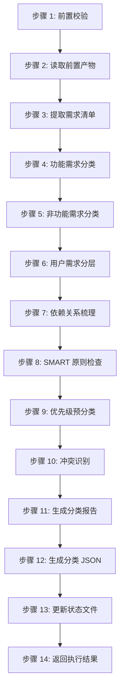

# Skill5: 需求分类梳理

## 一、元信息

| 项目 | 内容 |
|-----|------|
| **Skill 编号** | S4-S05 |
| **Skill 名称** | 需求分类梳理 |
| **英文名称** | Requirements Classification |
| **所属阶段** | S4 - 需求整合与核心提炼阶段 |
| **执行顺序** | S4 阶段第 1 个执行 |
| **执行模式** | 常规模式执行，轻量化模式可选 |
| **执行 Agent** | Executor Agent |
| **版本** | 2.0（标准化版本） |
| **最后更新** | 2026-03-24 |
| **依赖 Skill** | S1-S04（需求验证）、S2-S10（市场痛点验证）、S3-S12（技术选型） |
| **后置 Skill** | S4-S06（需求优先级排序） |
| **产物 ID 格式** | `{PlanID}-S4-S05-001-{类型}` |
| **产物类型** | classification_report（Markdown）、classification_json（JSON） |
| **存储路径** | `database/stages/s4/{PlanID}/` |
| **参考标准** | IEEE 29148-2011、ISO/IEC 25010、SMART 原则 |

---

## 二、功能描述

### 2.1 核心职责

Skill5 负责对所有收集到的需求进行系统化分类梳理，建立清晰的需求体系结构。主要职责包括：

1. **功能需求分类**：按功能模块/业务域对需求进行归类（核心功能、辅助功能、扩展功能、集成功能）
2. **非功能需求分类**：识别并分类性能、安全、可用性等非功能需求（9 大质量维度）
3. **用户需求分层**：区分不同用户群体的需求（核心用户、次要用户、边缘用户）
4. **需求依赖关系梳理**：识别需求之间的依赖和关联关系（强依赖、弱依赖、互斥、包含）
5. **优先级预分类**：为后续优先级排序提供基础（高/中/低）
6. **SMART 原则检查**：对每个需求进行 SMART 原则验证
7. **需求追溯矩阵建立**：建立需求与产品目标、用户问题、功能模块的追溯关系
8. **需求冲突识别**：识别并标记相互冲突的需求项
9. **需求完整性校验**：检查需求覆盖是否完整，是否存在遗漏
10. **分类报告生成**：输出完整的需求分类体系报告和结构化 JSON 数据

### 2.2 输入规范

**前置产物（必需）**：
- S1 阶段产物：
  - 需求边界界定报告（S1-S01）
  - 显性需求提取清单（S1-S02）
  - 隐性需求挖掘报告（S1-S03）
  - 需求验证报告（S1-S04）
- S2 阶段产物：
  - 竞品分析报告（S2-S09）
  - 市场痛点验证报告（S2-S10）
- S3 阶段产物：
  - 需求风险识别报告（S3-S07）
  - 技术可行性评估报告（S3-S11）
  - 技术选型报告（S3-S12）

**输入格式**：
- Markdown 报告文件
- 对应的 JSON 结构化数据文件
- 产物 ID 列表（用于追溯）

**输入验证规则**：
- 所有前置产物必须存在且状态为 completed
- 产物 ID 必须匹配且连续
- JSON 文件必须通过 Schema 验证

### 2.3 输出规范

**产物 1：需求分类体系报告**
- **文件路径**：`database/stages/s4/{PlanID}/{PlanID}-S4-S05-001-classify.md`
- **文件格式**：Markdown
- **内容结构**：遵循 template.md 定义的 12 个章节
- **版本**：2.0

**产物 2：需求分类 JSON**
- **文件路径**：`database/stages/s4/{PlanID}/{PlanID}-S4-S05-001-classify.json`
- **文件格式**：JSON（符合预定义 Schema）
- **内容结构**：包含功能需求、非功能需求、用户分层、依赖关系、统计数据
- **版本**：2.0

**产物 3：状态更新**
- **文件路径**：`database/status.json`
- **更新内容**：更新 S4-S05 状态为 completed，记录产物 ID 和执行时间

### 2.4 产物 ID 命名规则

**格式**：`{PlanID}-S4-S05-001-{类型}`

**示例**：
- `P000001-S4-S05-001-classify.md` - 需求分类体系报告
- `P000001-S4-S05-001-classify.json` - 需求分类 JSON 数据

**编号规则**：
- PlanID: 6 位数字编号（如 P000001）
- S4: 阶段编号
- S05: Skill 编号
- 001: 产物序号（固定）
- 类型：classify（分类报告）

---

## 三、执行流程

### 3.1 流程概览

### 3.2 详细步骤

#### 步骤 1：前置校验

**目标**：验证前置产物是否完整、格式是否正确

**操作**：
1. 检查 S1-S04、S2-S09、S2-S10、S3-S07、S3-S11、S3-S12 产物是否存在
2. 检查产物状态是否为 completed
3. 检查产物 ID 是否匹配且连续
4. 验证 JSON 文件格式是否符合 Schema

**验证规则**：
- 所有前置产物必须存在
- 产物状态必须为 completed
- JSON 文件必须通过 Schema 验证

**错误处理**：
- 产物缺失 → 返回错误 E001，要求先完成前置 Skill
- 格式错误 → 返回错误 E002，要求重新生成前置产物
- 状态异常 → 返回错误 E003，要求检查产物状态

#### 步骤 2：读取前置产物

**目标**：加载所有前置产物内容

**操作**：
1. 读取所有 Markdown 报告文件
2. 读取所有 JSON 结构化数据文件
3. 解析并提取需求相关信息
4. 建立需求追溯索引

**验证规则**：
- 文件必须可读
- 内容必须完整
- 编码必须为 UTF-8

**错误处理**：
- 文件读取失败 → 返回错误 E101，记录详细错误信息
- 内容解析失败 → 返回错误 E102，尝试修复或中止

#### 步骤 3：提取需求清单

**目标**：从所有前置产物中提取需求条目

**操作**：
1. 从显性需求提取清单中提取功能需求
2. 从隐性需求挖掘报告中提取潜在需求
3. 从需求验证报告中提取已验证需求
4. 从市场痛点验证报告中提取市场相关需求
5. 从技术可行性评估中提取技术约束需求
6. 去重并合并需求清单
7. 为每个需求分配唯一 ID（R001, R002, ...）

**验证规则**：
- 需求 ID 必须唯一
- 需求描述必须完整
- 需求来源必须可追溯

**错误处理**：
- 需求提取不完整 → 返回警告 W101，继续执行
- 需求 ID 冲突 → 返回错误 E103，重新分配 ID
- 需求描述缺失 → 返回警告 W102，标记待补充

#### 步骤 4：功能需求分类

**目标**：按功能模块/业务域对需求进行归类

**操作**：
1. 识别每个需求的功能属性
2. 按以下 4 类进行分类：
   - **FUNC-CORE**：核心功能需求（产品必须实现的核心业务功能）
   - **FUNC-AUX**：辅助功能需求（支持核心功能的辅助功能）
   - **FUNC-EXT**：扩展功能需求（增强用户体验的扩展功能）
   - **FUNC-INT**：集成功能需求（与外部系统集成的功能）
3. 记录分类理由
4. 统计各类需求数量

**分类标准**：
- 核心功能：直接影响产品核心价值，缺失会导致产品无法使用
- 辅助功能：支持核心功能，提升产品完整性，但非必需
- 扩展功能：增强用户体验，用于差异化竞争，可选
- 集成功能：需要与外部系统交互，扩展产品能力

**验证规则**：
- 每个需求必须分配到且仅分配到一个功能分类
- 分类理由必须充分
- 核心功能需求占比应合理（通常 30-50%）

**错误处理**：
- 分类冲突 → 返回警告 W103，使用默认分类（FUNC-AUX）
- 分类不明确 → 返回警告 W104，标记待确认

#### 步骤 5：非功能需求分类

**目标**：识别并分类非功能需求

**操作**：
1. 识别需求中的非功能属性
2. 按以下 9 类进行分类（参考 ISO/IEC 25010）：
   - **NFR-PERF**：性能需求（响应时间、吞吐量、资源利用率）
   - **NFR-SEC**：安全需求（数据保护、访问控制、加密）
   - **NFR-AVA**：可用性需求（系统可用时间、故障恢复）
   - **NFR-REL**：可靠性需求（容错性、稳定性）
   - **NFR-USA**：易用性需求（用户体验、学习成本）
   - **NFR-SCA**：可扩展性需求（水平/垂直扩展能力）
   - **NFR-MAI**：可维护性需求（代码质量、文档完整性）
   - **NFR-POR**：可移植性需求（跨平台、跨环境能力）
   - **NFR-COM**：兼容性需求（向后兼容、版本兼容）
3. 记录分类理由和指标
4. 统计各类需求数量

**验证规则**：
- 每个非功能需求必须分类
- 指标必须可量化
- 分类必须符合 ISO/IEC 25010 标准

**错误处理**：
- 分类不明确 → 返回警告 W105，标记待确认
- 指标不可量化 → 返回警告 W106，要求补充量化指标

#### 步骤 6：用户需求分层

**目标**：按用户群体对需求进行分层

**操作**：
1. 识别每个需求服务的用户群体
2. 按以下 3 层进行分类：
   - **USER-P0**：核心用户需求（产品主要服务的用户群体）
   - **USER-P1**：次要用户需求（偶尔使用或间接使用的用户）
   - **USER-P2**：边缘用户需求（可能使用但非目标的用户）
3. 记录分层理由
4. 统计各层需求数量和占比

**分层标准**：
- P0 核心用户：使用频率高（每周≥3 次）、需求明确、付费意愿强
- P1 次要用户：使用