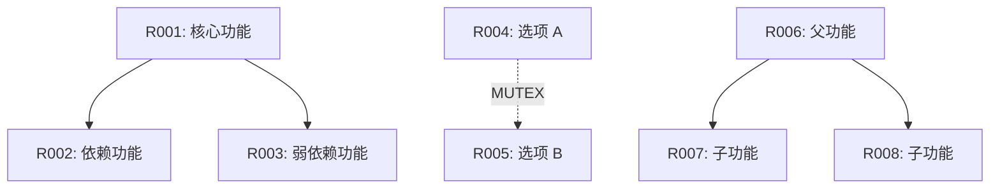

# 需求分类体系报告模板

## 报告信息

| 项目 | 内容 |
|-----|------|
| **报告 ID** | {PlanID}-S4-S05-001 |
| **Plan ID** | {PlanID} |
| **生成时间** | {YYYY-MM-DD HH:MM:SS} |
| **Skill 版本** | S4-S05 v2.0（标准化版本） |
| **需求总数** | {N} 项 |
| **SMART 通过率** | {M/N} ({M/N*100}%) |
| **质量综合得分** | {X}% |
| **质量等级** | 优秀/良好/合格/不合格 |

---

## 一、执行摘要

### 1.1 分类统计概览

| 分类维度 | 类别数量 | 需求分布 | 占比 |
|---------|---------|---------|------|
| **功能需求** | 4 类 | 核心{N}项 / 辅助{N}项 / 扩展{N}项 / 集成{N}项 | {N}% |
| **非功能需求** | 9 类 | 共{N}项 | {N}% |
| **用户分层** | 3 层 | P0:{N}项 / P1:{N}项 / P2:{N}项 | 100% |
| **优先级分布** | 3 级 | 高:{N}项 / 中:{N}项 / 低:{N}项 | 100% |

### 1.2 SMART 检查结果

| 检查项 | 通过数量 | 不通过数量 | 通过率 | 关键问题 |
|--------|---------|-----------|--------|---------|
| Specific（具体） | {N} | {N} | {X}% | {问题描述} |
| Measurable（可衡量） | {N} | {N} | {X}% | {问题描述} |
| Achievable（可实现） | {N} | {N} | {X}% | {问题描述} |
| Relevant（相关） | {N} | {N} | {X}% | {问题描述} |
| Time-bound（有时限） | {N} | {N} | {X}% | {问题描述} |
| **综合通过率** | **{N}** | **{N}** | **{X}%** | - |

### 1.3 质量评估

| 质量维度 | 得分 | 权重 | 加权得分 |
|---------|------|------|---------|
| 完整性 | {X}分 | 30% | {X}分 |
| 准确性 | {X}分 | 25% | {X}分 |
| 一致性 | {X}分 | 20% | {X}分 |
| 可读性 | {X}分 | 15% | {X}分 |
| 可追溯性 | {X}分 | 10% | {X}分 |
| **质量综合得分** | **-** | **100%** | **{X}分** |

**质量等级**：
- ≥90 分：优秀
- 85-89 分：良好
- 70-84 分：合格
- <70 分：不合格

### 1.4 关键数据统计

| 统计项 | 数值 | 说明 |
|--------|------|------|
| 需求总数 | {N}项 | 所有收集到的需求 |
| 功能需求 | {N}项 | 核心{N} + 辅助{N} + 扩展{N} + 集成{N} |
| 非功能需求 | {N}项 | 性能{N} + 安全{N} + ... |
| 核心用户需求 | {N}项 | USER-P0 用户需求 |
| 高优先级需求 | {N}项 | PRE-HIGH 需求 |
| SMART 通过 | {N}项 | 5 项检查全部通过 |
| 依赖关系 | {N}个 | 强依赖{N} + 弱依赖{N} + 互斥{N} + 包含{N} |
| 需求冲突 | {N}个 | 已识别的冲突数量 |

### 1.5 执行摘要

**分类过程概述**（200-300 字）：

{描述需求分类的整体过程，包括：
- 数据来源：从哪些前置产物提取需求
- 分类方法：采用的分类框架和标准
- 主要发现：需求分布的主要特征
- 关键问题：分类过程中发现的主要问题
- 整体评价：对需求质量的总体评价}

**核心结论**（≤100 字）：

{总结需求分类的核心结论，包括：
- 需求总数和分布特征
- 需求质量评价（SMART 通过率）
- 关键风险或问题
- 下一步建议}

---

## 二、功能需求分类

### 2.1 核心功能需求 (FUNC-CORE)

**定义**：产品必须实现的核心业务功能，是产品价值的核心载体。缺失会导致产品无法使用。

**需求数量**：{N}项（占功能需求的{X}%）

| 需求 ID | 需求描述 | 来源 | 用户层 | 预优先级 | SMART 检查 | 依赖需求 | 备注 |
|--------|---------|------|--------|---------|-----------|---------|------|
| R001 | {具体需求描述} | 显性/隐性/验证 | P0/P1/P2 | 高/中/低 | ✅/❌ | R002,R003 | {备注} |
| R002 | {具体需求描述} | 显性/隐性/验证 | P0/P1/P2 | 高/中/低 | ✅/❌ | - | {备注} |

**SMART 问题记录**：
- R00X: {问题描述} → 建议：{优化建议}

**分类理由**：
{说明为什么这些需求被分类为核心功能需求，包括：
- 与产品核心价值的关系
- 对用户的重要性
- 缺失的影响分析}

---

### 2.2 辅助功能需求 (FUNC-AUX)

**定义**：支持核心功能的辅助功能，提升产品完整性，但非必需。

**需求数量**：{N}项（占功能需求的{X}%）

| 需求 ID | 需求描述 | 来源 | 用户层 | 预优先级 | SMART 检查 | 依赖需求 | 备注 |
|--------|---------|------|--------|---------|-----------|---------|------|
| R00X | {具体需求描述} | 显性/隐性/验证 | P0/P1/P2 | 高/中/低 | ✅/❌ | - | {备注} |

**SMART 问题记录**：
- R00X: {问题描述} → 建议：{优化建议}

**分类理由**：
{说明为什么这些需求被分类为辅助功能需求}

---

### 2.3 扩展功能需求 (FUNC-EXT)

**定义**：增强用户体验的扩展功能，通常用于差异化竞争，可选实现。

**需求数量**：{N}项（占功能需求的{X}%）

| 需求 ID | 需求描述 | 来源 | 用户层 | 预优先级 | SMART 检查 | 依赖需求 | 备注 |
|--------|---------|------|--------|---------|-----------|---------|------|
| R00X | {具体需求描述} | 显性/隐性/验证 | P0/P1/P2 | 高/中/低 | ✅/❌ | - | {备注} |

**SMART 问题记录**：
- R00X: {问题描述} → 建议：{优化建议}

**分类理由**：
{说明为什么这些需求被分类为扩展功能需求}

---

### 2.4 集成功能需求 (FUNC-INT)

**定义**：与外部系统集成的功能，扩展产品能力边界。

**需求数量**：{N}项（占功能需求的{X}%）

| 需求 ID | 需求描述 | 来源 | 用户层 | 预优先级 | SMART 检查 | 依赖需求 | 备注 |
|--------|---------|------|--------|---------|-----------|---------|------|
| R00X | {具体需求描述} | 显性/隐性/验证 | P0/P1/P2 | 高/中/低 | ✅/❌ | - | {备注} |

**集成系统说明**：
- {集成系统 1}: {集成内容和目的}
- {集成系统 2}: {集成内容和目的}

**SMART 问题记录**：
- R00X: {问题描述} → 建议：{优化建议}

**分类理由**：
{说明为什么这些需求被分类为集成功能需求}

---

## 三、非功能需求分类（参考 ISO/IEC 25010）

### 3.1 性能需求 (NFR-PERF)

**定义**：系统的响应时间、吞吐量、资源利用率等性能指标。

**需求数量**：{N}项

| 需求 ID | 需求描述 | 指标类型 | 目标值 | 用户层 | SMART 检查 | 备注 |
|--------|---------|---------|--------|--------|-----------|------|
| N001 | {性能需求描述} | 响应时间/吞吐量/并发数 | {具体数值} | P0/P1/P2 | ✅/❌ | {备注} |

**性能指标说明**：
{详细说明性能指标的定义、测试方法、验收标准}

---

### 3.2 安全需求 (NFR-SEC)

**定义**：数据保护、访问控制、加密等安全相关需求。

**需求数量**：{N}项

| 需求 ID | 需求描述 | 安全维度 | 保护级别 | 用户层 | SMART 检查 | 备注 |
|--------|---------|---------|---------|--------|-----------|------|
| N00X | {安全需求描述} | 数据/传输/认证/授权 | 高/中/低 | P0/P1/P2 | ✅/❌ | {备注} |

**安全维度说明**：
- **数据安全**：数据加密、数据脱敏、数据备份
- **传输安全**：HTTPS、SSL/TLS、数据完整性
- **认证安全**：用户认证、多因素认证、会话管理
- **授权安全**：访问控制、权限管理、角色定义

---

### 3.3 可用性需求 (NFR-AVA)

**定义**：系统可用时间、故障恢复等可用性指标。

**需求数量**：{N}项

| 需求 ID | 需求描述 | 可用性指标 | 目标值 | 用户层 | SMART 检查 | 备注 |
|--------|---------|-----------|--------|--------|-----------|------|
| N00X | {可用性需求描述} | 可用率/MTBF/MTTR | {具体数值} | P0/P1/P2 | ✅/❌ | {备注} |

**可用性指标说明**：
- **可用率**：系统正常运行时间占比（如 99.9%）
- **MTBF**（Mean Time Between Failures）：平均故障间隔时间
- **MTTR**（Mean Time To Repair）：平均修复时间

---

### 3.4 可靠性需求 (NFR-REL)

**定义**：系统的容错性、稳定性、抗干扰能力。

**需求数量**：{N}项

| 需求 ID | 需求描述 | 可靠性维度 | 目标值 | 用户层 | SMART 检查 | 备注 |
|--------|---------|-----------|--------|--------|-----------|------|
| N00X | {可靠性需求描述} | 容错/恢复/稳定 | {具体描述} | P0/P1/P2 | ✅/❌ | {备注} |

**可靠性维度说明**：
- **容错性**：系统在部分组件故障时仍能正常运行
- **恢复能力**：系统从故障中恢复的能力
- **稳定性**：系统长期运行的稳定性

---

### 3.5 易用性需求 (NFR-USA)

**定义**：用户体验、学习成本、操作效率等易用性指标。

**需求数量**：{N}项

| 需求 ID | 需求描述 | 易用性维度 | 目标值 | 用户层 | SMART 检查 | 备注 |
|--------|---------|-----------|--------|--------|-----------|------|
| N00X | {易用性需求描述} | 学习成本/操作效率/满意度 | {具体描述} | P0/P1/P2 | ✅/❌ | {备注} |

**易用性维度说明**：
- **学习成本**：新用户上手所需时间
- **操作效率**：完成任务所需时间和步骤
- **满意度**：用户主观满意度评分

---

### 3.6 可扩展性需求 (NFR-SCA)

**定义**：系统的水平/垂直扩展能力，应对业务增长。

**需求数量**：{N}项

| 需求 ID | 需求描述 | 扩展维度 | 目标值 | 用户层 | SMART 检查 | 备注 |
|--------|---------|---------|--------|--------|-----------|------|
| N00X | {可扩展性需求描述} | 水平/垂直/功能 | {具体描述} | P0/P1/P2 | ✅/❌ | {备注} |

**扩展维度说明**：
- **水平扩展**：通过增加节点提升系统能力
- **垂直扩展**：通过升级硬件提升系统能力
- **功能扩展**：通过插件或模块化扩展功能

---

### 3.7 可维护性需求 (NFR-MAI)

**定义**：代码质量、文档完整性、部署便利性等可维护性指标。

**需求数量**：{N}项

| 需求 ID | 需求描述 | 维护维度 | 目标值 | 用户层 | SMART 检查 | 备注 |
|--------|---------|---------|--------|--------|-----------|------|
| N00X | {可维护性需求描述} | 代码/文档/部署 | {具体描述} | P0/P1/P2 | ✅/❌ | {备注} |

**维护维度说明**：
- **代码质量**：代码规范、注释完整性、单元测试覆盖率
- **文档完整性**：设计文档、API 文档、用户手册
- **部署便利性**：自动化部署、配置管理、回滚机制

---

### 3.8 可移植性需求 (NFR-POR)

**定义**：系统跨平台、跨环境、跨设备的能力。

**需求数量**：{N}项

| 需求 ID | 需求描述 | 移植维度 | 目标平台 | 用户层 | SMART 检查 | 备注 |
|--------|---------|---------|---------|--------|-----------|------|
| N00X | {可移植性需求描述} | 平台/环境/数据 | {具体平台} | P0/P1/P2 | ✅/❌ | {备注} |

**移植维度说明**：
- **平台移植**：Windows、Linux、macOS、iOS、Android
- **环境移植**：开发环境、测试环境、生产环境
- **数据移植**：数据迁移、数据导入导出

---

### 3.9 兼容性需求 (NFR-COM)

**定义**：系统向后兼容、版本兼容、数据兼容的能力。

**需求数量**：{N}项

| 需求 ID | 需求描述 | 兼容维度 | 目标范围 | 用户层 | SMART 检查 | 备注 |
|--------|---------|---------|---------|--------|-----------|------|
| N00X | {兼容性需求描述} | 版本/数据/接口 | {具体范围} | P0/P1/P2 | ✅/❌ | {备注} |

**兼容维度说明**：
- **版本兼容**：向后兼容、向前兼容
- **数据兼容**：历史数据迁移、数据格式兼容
- **接口兼容**：API 版本兼容、协议兼容

---

## 四、用户需求分层分布

### 4.1 核心用户需求 (USER-P0)

**定义**：产品主要服务的用户群体，使用频率高（每周≥3 次）、需求明确、付费意愿强。

**需求数量**：{N}项（占总需求的{X}%）

**需求列表**：
| 需求 ID | 需求描述 | 功能分类 | 预优先级 | SMART 检查 |
|--------|---------|---------|---------|-----------|
| R001 | {描述} | FUNC-CORE | 高 | ✅ |

**需求特征**：
- 数量：{N}项 ({N/总*100}%)
- 核心功能占比：{N}%
- 高优先级占比：{N}%
- SMART 通过率：{X}%

**用户画像**：
{描述核心用户的特征，包括：
- 基本信息：年龄、职业、地域等
- 使用场景：何时、何地、为何使用产品
- 痛点问题：面临的主要问题
- 期望价值：希望产品解决什么问题}

---

### 4.2 次要用户需求 (USER-P1)

**定义**：偶尔使用或间接使用的用户，使用频率中（每月 1-3 次）、需求较明确。

**需求数量**：{N}项（占总需求的{X}%）

**需求列表**：
| 需求 ID | 需求描述 | 功能分类 | 预优先级 | SMART 检查 |
|--------|---------|---------|---------|-----------|
| R00X | {描述} | FUNC-AUX | 中 | ✅ |

**需求特征**：
- 数量：{N}项 ({N/总*100}%)
- 辅助功能占比：{N}%
- 中优先级占比：{N}%
- SMART 通过率：{X}%

**用户画像**：
{描述次要用户的特征}

---

### 4.3 边缘用户需求 (USER-P2)

**定义**：可能使用但非目标的用户，使用频率低（每月<1 次）、需求模糊。

**需求数量**：{N}项（占总需求的{X}%）

**需求列表**：
| 需求 ID | 需求描述 | 功能分类 | 预优先级 | SMART 检查 |
|--------|---------|---------|---------|-----------|
| R00X | {描述} | FUNC-EXT | 低 | ❌ |

**需求特征**：
- 数量：{N}项 ({N/总*100}%)
- 扩展功能占比：{N}%
- 低优先级占比：{N}%
- SMART 通过率：{X}%

**用户画像**：
{描述边缘用户的特征}

---

## 五、需求依赖关系

### 5.1 依赖关系列表

| 需求 ID | 依赖类型 | 被依赖需求 | 依赖说明 | 影响分析 |
|--------|---------|-----------|---------|---------|
| R002 | DEP-STRONG | R001 | 必须先实现 R001 才能做 R002 | R001 延期会导致 R002 无法实现 |
| R003 | DEP-WEAK | R001 | 可以依赖 R001，也有替代方案 | R001 延期时可采用替代方案 |
| R004 | DEP-MUTEX | R005 | R004 和 R005 互斥，只能选一个 | 需要优先级决策 |
| R006 | DEP-INCLUDE | R007 | R006 包含 R007 | R006 实现时自动包含 R007 |

**依赖类型说明**：
- **DEP-STRONG**（强依赖）：B 需求必须依赖 A 需求实现，A 不完成则 B 无法实现
- **DEP-WEAK**（弱依赖）：B 需求可以依赖 A 需求，但有替代方案
- **DEP-MUTEX**（互斥）：A 和 B 需求不能同时实现，需要决策选择
- **DEP-INCLUDE**（包含）：A 需求包含 B 需求，A 实现时自动包含 B

---

### 5.2 依赖关系可视化



**ASCII 格式**（如 Mermaid 不支持）：
```
[R001] --STRONG--> [R002]
  |
  --WEAK--> [R003]

[R004] --MUTEX-- [R005]

[R006] --INCLUDE--> [R007]
       --INCLUDE--> [R008]
```

---

### 5.3 关键路径分析

**关键路径**：R001 → R002 → R006 → R007

**关键路径说明**：
{描述关键路径上的需求依赖关系，包括：
- 路径上的需求列表
- 每个需求的工作量估算
- 总工期估算
- 关键路径对项目进度的影响}

**依赖关系统计**：
- 强依赖：{N}个
- 弱依赖：{N}个
- 互斥关系：{N}个
- 包含关系：{N}个
- 循环依赖：0 个（如有循环依赖，必须解决）

---

## 六、SMART 检查报告

### 6.1 检查不通过项列表

| 需求 ID | 不通过项 | 问题描述 | 优化建议 | 风险等级 | 优先级 |
|--------|---------|---------|---------|---------|--------|
| R00X | Specific | 描述模糊，含"可能"等词汇 | 明确具体功能和行为 | 中 | P1 |
| R00X | Measurable | 缺少量化验收标准 | 添加具体数值指标 | 高 | P0 |
| R00X | Achievable | 技术可行性为 RISKY | 重新评估或拆分需求 | 高 | P0 |
| R00X | Relevant | 与产品边界界定不一致 | 确认是否属于产品范围 | 中 | P1 |
| R00X | Time-bound | 未明确所属阶段 | 明确 MVP/V1.0/V2.0 | 低 | P2 |

**风险等级说明**：
- **高**：严重影响需求实现，必须优先处理
- **中**：影响需求质量，建议尽快处理
- **低**：影响较小，可选处理

---

### 6.2 优化建议汇总

**高优先级优化**（建议立即处理）：
1. R00X: {问题} → {建议}
2. R00X: {问题} → {建议}

**中优先级优化**（建议后续处理）：
1. R00X: {问题} → {建议}

**低优先级优化**（可选处理）：
1. R00X: {问题} → {建议}

---

### 6.3 SMART 检查统计

**总体统计**：
- 总需求数：{N}项
- 5 项全通过：{N}项（{X}%）
- 4 项通过：{N}项（{X}%）
- 3 项通过：{N}项（{X}%）
- ≤2 项通过：{N}项（{X}%）

**按功能分类统计**：
| 功能分类 | 总需求数 | 5 项全通过 | 通过率 |
|---------|---------|-----------|--------|
| FUNC-CORE | {N} | {N} | {X}% |
| FUNC-AUX | {N} | {N} | {X}% |
| FUNC-EXT | {N} | {N} | {X}% |
| FUNC-INT | {N} | {N} | {X}% |

**按用户分层统计**：
| 用户分层 | 总需求数 | 5 项全通过 | 通过率 |
|---------|---------|-----------|--------|
| USER-P0 | {N} | {N} | {X}% |
| USER-P1 | {N} | {N} | {X}% |
| USER-P2 | {N} | {N} | {X}% |

---

## 七、优先级预分类

### 7.1 高优先级需求 (PRE-HIGH)

**判定标准**：核心功能 + 技术可行 + 用户强烈需求

**需求数量**：{N}项（占总需求的{X}%）

| 需求 ID | 需求描述 | 功能分类 | 用户层 | 技术可行性 | 判定理由 |
|--------|---------|---------|--------|-----------|---------|
| R001 | {描述} | FUNC-CORE | P0 | FULL/BASIC | 核心功能 + P0 用户 + 技术可行 |

**优先级分布分析**：
{分析高优先级需求的分布特征，包括：
- 功能分类分布
- 用户层分布
- 技术可行性分布
- 占比是否合理}

---

### 7.2 中优先级需求 (PRE-MEDIUM)

**判定标准**：辅助功能 + 技术可行 + 用户明确需求

**需求数量**：{N}项（占总需求的{X}%）

| 需求 ID | 需求描述 | 功能分类 | 用户层 | 技术可行性 | 判定理由 |
|--------|---------|---------|--------|-----------|---------|
| R00X | {描述} | FUNC-AUX | P1 | FULL/BASIC | 辅助功能 + P1 用户 + 技术可行 |

---

### 7.3 低优先级需求 (PRE-LOW)

**判定标准**：扩展功能 或 技术有挑战 或 需求较模糊

**需求数量**：{N}项（占总需求的{X}%）

| 需求 ID | 需求描述 | 功能分类 | 用户层 | 技术可行性 | 判定理由 |
|--------|---------|---------|--------|-----------|---------|
| R00X | {描述} | FUNC-EXT | P2 | RISKY | 扩展功能 + P2 用户 + 技术有挑战 |

---

## 八、需求冲突识别

### 8.1 冲突列表

| 冲突 ID | 冲突需求 1 | 冲突需求 2 | 冲突类型 | 冲突描述 | 解决建议 | 状态 |
|--------|-----------|-----------|---------|---------|---------|------|
| C001 | R004 | R005 | 功能冲突 | 两个需求功能相互矛盾 | 选择优先级高的需求 | 待解决 |
| C002 | R00X | R00Y | 资源冲突 | 两个需求竞争同一资源 | 增加资源或调整优先级 | 已解决 |

**冲突类型说明**：
- **功能冲突**：两个需求功能相互矛盾，不能同时实现
- **资源冲突**：两个需求竞争同一资源（时间、人力、技术）
- **优先级冲突**：两个需求优先级相同但互斥
- **技术冲突**：两个需求的技术实现相互矛盾

---

### 8.2 冲突解决建议

**未解决冲突**：
1. C001: {冲突描述} → 建议：{解决建议}，责任人：{责任人}，截止时间：{日期}

**已解决冲突**：
1. C002: {冲突描述} → 解决方案：{解决方案}，决策日期：{日期}

---

## 九、需求追溯矩阵

### 9.1 需求与产品目标追溯

| 需求 ID | 产品目标 | 目标优先级 | 贡献度 | 追溯说明 |
|--------|---------|-----------|--------|---------|
| R001 | 目标 1: {目标描述} | P0 | 高 | R001 直接支持目标 1 的实现 |
| R002 | 目标 2: {目标描述} | P1 | 中 | R002 间接支持目标 2 的实现 |

**产品目标列表**：
- 目标 1: {目标描述}
- 目标 2: {目标描述}
- 目标 3: {目标描述}

**追溯统计**：
- 可追溯到产品目标的需求：{N}项（{X}%）
- 无法追溯的需求：{N}项（{X}%）

---

### 9.2 需求与用户问题追溯

| 需求 ID | 用户问题 | 问题严重度 | 解决度 | 追溯说明 |
|--------|---------|-----------|--------|---------|
| R001 | 问题 1: {问题描述} | 高 | 完全解决 | R001 直接解决问题 1 |
| R002 | 问题 2: {问题描述} | 中 | 部分解决 | R002 部分解决问题 2 |

**用户问题列表**：
- 问题 1: {问题描述}
- 问题 2: {问题描述}
- 问题 3: {问题描述}

**追溯统计**：
- 可追溯到用户问题的需求：{N}项（{X}%）
- 无法追溯的需求：{N}项（{X}%）

---

### 9.3 需求与功能模块追溯

| 需求 ID | 功能模块 | 模块优先级 | 实现度 | 追溯说明 |
|--------|---------|-----------|--------|---------|
| R001 | 模块 1: {模块名称} | P0 | 100% | R001 完全在模块 1 中实现 |
| R002 | 模块 2: {模块名称} | P1 | 50% | R002 部分在模块 2 中实现 |

**功能模块列表**：
- 模块 1: {模块名称} - {模块描述}
- 模块 2: {模块名称} - {模块描述}
- 模块 3: {模块名称} - {模块描述}

**追溯统计**：
- 可追溯到功能模块的需求：{N}项（{X}%）
- 无法追溯的需求：{N}项（{X}%）

---

## 十、需求完整性校验

### 10.1 覆盖度分析

**数据来源覆盖**：
| 数据来源 | 提取需求数 | 占比 | 覆盖度评价 |
|---------|-----------|------|-----------|
| 显性需求提取（S1-S02） | {N} | {X}% | 充分/一般/不足 |
| 隐性需求挖掘（S1-S03） | {N} | {X}% | 充分/一般/不足 |
| 需求验证（S1-S04） | {N} | {X}% | 充分/一般/不足 |
| 市场痛点验证（S2-S10） | {N} | {X}% | 充分/一般/不足 |
| 技术可行性评估（S3-S11） | {N} | {X}% | 充分/一般/不足 |

**功能域覆盖**：
| 功能域 | 需求数 | 覆盖度评价 | 遗漏风险 |
|-------|--------|-----------|---------|
| {功能域 1} | {N} | 充分/一般/不足 | {风险描述} |
| {功能域 2} | {N} | 充分/一般/不足 | {风险描述} |

**用户场景覆盖**：
| 用户场景 | 需求数 | 覆盖度评价 | 遗漏风险 |
|---------|--------|-----------|---------|
| {场景 1} | {N} | 充分/一般/不足 | {风险描述} |
| {场景 2} | {N} | 充分/一般/不足 | {风险描述} |

---

### 10.2 遗漏检查

**可能遗漏的功能域**：
1. {功能域 1}: {遗漏说明} → 建议：{补充建议}
2. {功能域 2}: {遗漏说明} → 建议：{补充建议}

**可能遗漏的用户场景**：
1. {场景 1}: {遗漏说明} → 建议：{补充建议}
2. {场景 2}: {遗漏说明} → 建议：{补充建议}

**可能遗漏的非功能需求**：
1. {非功能需求类型}: {遗漏说明} → 建议：{补充建议}

---

## 十一、风险与问题

### 11.1 分类过程中的问题

| 问题 ID | 问题描述 | 影响范围 | 建议措施 | 状态 |
|--------|---------|---------|---------|------|
| ISS-001 | {问题描述} | {影响的需求} | {建议措施} | 待解决/已解决 |
| ISS-002 | {问题描述} | {影响的需求} | {建议措施} | 待解决/已解决 |

---

### 11.2 需要用户确认的事项

| 事项 ID | 事项描述 | 选项 | 建议 | 优先级 | 截止时间 |
|--------|---------|------|------|--------|---------|
| CONF-001 | {需要确认的问题} | A/B/C | {建议选项} | P0/P1/P2 | {日期} |

---

### 11.3 风险评估

| 风险 ID | 风险描述 | 发生概率 | 影响程度 | 风险等级 | 应对措施 |
|--------|---------|---------|---------|---------|---------|
| RISK-001 | {风险描述} | 高/中/低 | 高/中/低 | 高/中/低 | {应对措施} |

**风险等级说明**：
- **高风险**：发生概率高且影响程度高，必须优先处理
- **中风险**：发生概率或影响程度中等，需要关注
- **低风险**：发生概率和影响程度都较低，可选处理

---

## 十二、下一步行动

### 12.1 立即执行

- [ ] 处理 SMART 检查不通过的高优先级项（{N}项）
- [ ] 确认需求依赖关系的准确性
- [ ] 解决分类过程中的争议项
- [ ] 确认需求冲突的解决方案
- [ ] 补充可能遗漏的需求

---

### 12.2 后续步骤

1. **执行 Skill6**: 基于分类结果进行需求优先级排序
   - 输入：本分类报告
   - 输出：需求优先级排序报告
   - 预计工作量：{X}人天

2. **执行 Skill8**: 提炼核心需求，形成最终需求规格
   - 输入：优先级排序结果
   - 输出：核心需求清单
   - 预计工作量：{X}人天

---

## 附录

### A. 分类代码速查表

**功能需求分类**：
- FUNC-CORE: 核心功能需求
- FUNC-AUX: 辅助功能需求
- FUNC-EXT: 扩展功能需求
- FUNC-INT: 集成功能需求

**非功能需求分类**：
- NFR-PERF: 性能需求
- NFR-SEC: 安全需求
- NFR-AVA: 可用性需求
- NFR-REL: 可靠性需求
- NFR-USA: 易用性需求
- NFR-SCA: 可扩展性需求
- NFR-MAI: 可维护性需求
- NFR-POR: 可移植性需求
- NFR-COM: 兼容性需求

**用户分层代码**：
- USER-P0: 核心用户
- USER-P1: 次要用户
- USER-P2: 边缘用户

**优先级代码**：
- PRE-HIGH: 高优先级
- PRE-MEDIUM: 中优先级
- PRE-LOW: 低优先级

**依赖类型代码**：
- DEP-STRONG: 强依赖
- DEP-WEAK: 弱依赖
- DEP-MUTEX: 互斥
- DEP-INCLUDE: 包含

---

### B. 术语表

| 术语 | 英文 | 定义 |
|-----|------|------|
| 功能需求 | Functional Requirement | 系统必须实现的功能或服务 |
| 非功能需求 | Non-Functional Requirement | 系统的质量属性或约束条件 |
| 用户需求 | User Requirement | 从用户角度描述的需求 |
| SMART 原则 | SMART Principles | 需求编写的 5 项原则（具体、可衡量、可实现、相关、有时限） |
| 依赖关系 | Dependency | 需求之间的逻辑依赖关系 |
| 追溯矩阵 | Traceability Matrix | 需求与其他元素（目标、问题、功能）的对应关系 |

---

### C. 填写说明

**报告填写指南**：

1. **基本信息**：填写报告 ID、Plan ID、生成时间等基本信息
2. **执行摘要**：概括分类统计、SMART 检查、质量评估的核心结果
3. **功能需求分类**：按 4 类功能需求分别填写需求清单
4. **非功能需求分类**：按 9 大质量维度分别填写需求清单
5. **用户需求分层**：按 P0/P1/P2 三层分别填写需求清单和画像
6. **依赖关系**：列出所有依赖关系并绘制可视化图
7. **SMART 检查**：详细记录不通过项和优化建议
8. **优先级预分类**：按高/中/低三级分别填写需求清单
9. **冲突识别**：列出所有冲突并提供解决建议
10. **追溯矩阵**：建立需求与目标、问题、功能的追溯关系
11. **完整性校验**：分析覆盖度并检查遗漏
12. **风险与问题**：记录分类过程中的问题和风险
13. **下一步行动**：明确后续工作和责任人

**填写注意事项**：
- 所有{占位符}必须替换为实际内容
- 表格必须完整填写，不留空行
- 需求 ID 必须唯一且连续
- 统计数据必须准确无误
- 依赖关系必须无循环
- SMART 检查必须客观公正

---

*报告生成时间：{timestamp}*  
*Skill 版本：S4-S05 v2.0（标准化版本）*  
*模板使用说明：本模板为标准化模板，所有章节均为必需章节，不得删减*
