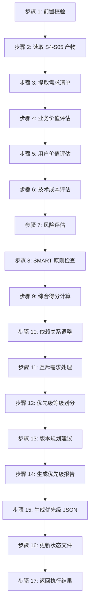

# Skill6: 需求优先级排序

## 一、元信息

| 项目 | 内容 |
|-----|------|
| **Skill 编号** | S4-S06 |
| **Skill 名称** | 需求优先级排序 |
| **英文名称** | Requirement Prioritization |
| **所属阶段** | S4 - 需求整合与核心提炼阶段 |
| **执行顺序** | S4 阶段第 2 个执行（依赖 S4-S05） |
| **执行模式** | 常规模式执行，轻量化模式可选执行 |
| **执行 Agent** | Executor Agent |
| **Skill 版本** | 2.0（标准化版本） |
| **参考标准** | IEEE 29148-2011, ISO/IEC 29110, MoSCoW 方法，Kano 模型 |
| **前置 Skill** | S0-S00 (Plan 制定), S1-S01 (需求边界界定), S1-S02 (显性需求提取), S1-S03 (隐性需求挖掘), S1-S04 (需求验证), S4-S05 (需求分类梳理) |
| **依赖产物** | {PlanID}-S4-S05-001-classify.md, {PlanID}-S4-S05-001-classify.json |
| **后置 Skill** | S4-S08 (核心需求提炼) |
| **产物 ID 格式** | `{PlanID}-S4-S06-001-{类型}` |
| **产物类型** | priority_report (Markdown), priority_json (JSON) |
| **存储路径** | `database/stages/s4/{PlanID}/` |
| **输出文件** | `{PlanID}-S4-S06-001-priority.md`, `{PlanID}-S4-S06-001-priority.json` |
| **质量门槛** | 质量综合得分 ≥ 85% |
| **模板文件** | [template.md](template.md) |

---

## 二、功能描述

### 2.1 核心职责

Skill6 负责基于多维度评估模型对需求进行优先级排序，确保资源投入的最优配置，包括：

1. **业务价值评估**：评估需求对业务目标的贡献度（权重 30%）
2. **用户价值评估**：评估需求对用户体验的提升程度（权重 30%）
3. **技术成本评估**：评估需求实现的技术难度和资源消耗（权重 25%，反向计分）
4. **风险评估**：评估需求实现过程中的风险因素（权重 15%，反向计分）
5. **SMART 原则加分**：对完全符合 SMART 原则的需求给予额外加分（+0.2）
6. **综合优先级计算**：基于多维度评分计算最终优先级得分
7. **依赖关系调整**：根据需求依赖关系调整优先级排序
8. **互斥需求处理**：识别并处理互斥需求，保留最优选项
9. **版本规划建议**：基于优先级划分 MVP、V1.0、V2.0、Future 阶段
10. **优先级报告生成**：输出完整的需求优先级排序报告和结构化 JSON 数据

### 2.2 输入规范

**标准化输入**：
- S4-S05 产物：需求分类梳理结果（必需）
  - `{PlanID}-S4-S05-001-classify.md` - 需求分类体系报告
  - `{PlanID}-S4-S05-001-classify.json` - 需求分类结构化数据
- S3-S12 产物：技术可行性评估报告（参考）
  - `{PlanID}-S3-S12-001-feasibility.json` - 技术可行性评估数据
- S3-S07 产物：需求风险识别报告（参考）
  - `{PlanID}-S3-S07-001-risk.json` - 需求风险清单

**输入验证规则**：
- S4-S05 产物必须存在且格式正确
- 需求分类 JSON 必须包含完整的需求清单
- 每个需求必须有唯一的 ID、描述、分类信息
- 需求数量应在合理范围内（建议 10-50 项）

### 2.3 输出规范

**标准化输出**：
- 需求优先级排序报告（Markdown）
  - 文件：`{PlanID}-S4-S06-001-priority.md`
  - 内容：执行摘要、优先级分布、评估详情、版本规划
- 优先级排序 JSON（结构化数据）
  - 文件：`{PlanID}-S4-S06-001-priority.json`
  - 内容：评估模型、优先级列表、统计数据、版本规划
- 状态更新
  - 更新 `database/status.json` 中 S4-S06 状态为 completed
  - 记录产物 ID 和文件路径

### 2.4 评估维度定义

#### 2.4.1 业务价值评估 (BV - Business Value)

| 分值 | 等级 | 说明 | 判定标准 |
|------|------|------|---------|
| 5 | 极高 | 对业务目标有关键贡献 | 直接影响核心 KPI，是产品核心竞争力 |
| 4 | 高 | 对业务目标有显著贡献 | 支持主要业务流程，提升关键指标 |
| 3 | 中 | 对业务目标有一般贡献 | 支持辅助业务流程，改善用户体验 |
| 2 | 低 | 对业务目标贡献较小 | 边缘功能，对业务影响有限 |
| 1 | 极低 | 对业务目标几乎无贡献 | 可有可无的功能 |

**评估要素**：
- 与产品愿景的契合度（25%）
- 对核心业务流程的支持程度（25%）
- 对收入/用户增长的影响（25%）
- 竞争优势的建立（25%）

#### 2.4.2 用户价值评估 (UV - User Value)

| 分值 | 等级 | 说明 | 判定标准 |
|------|------|------|---------|
| 5 | 极高 | 解决用户核心痛点 | 用户强烈需要，没有替代方案 |
| 4 | 高 | 显著提升用户体验 | 用户明确需要，有较好满意度 |
| 3 | 中 | 改善用户体验 | 用户有需求，但不是最紧迫 |
| 2 | 低 | 轻微改善体验 | 锦上添花的功能 |
| 1 | 极低 | 几乎无用户价值 | 用户感知不明显 |

**评估要素**：
- 用户需求的紧迫程度（30%）
- 影响的用户群体规模（25%）
- 用户满意度提升程度（25%）
- 用户流失风险降低（20%）

#### 2.4.3 技术成本评估 (TC - Technical Cost) - 反向计分

| 分值 | 等级 | 说明 | 判定标准 |
|------|------|------|---------|
| 5 | 极低 | 实现成本很低 | 简单功能，1-3 天可完成 |
| 4 | 低 | 实现成本较低 | 标准功能，1 周内可完成 |
| 3 | 中 | 实现成本中等 | 有一定复杂度，2-4 周 |
| 2 | 高 | 实现成本较高 | 复杂功能，1-2 个月 |
| 1 | 极高 | 实现成本极高 | 技术挑战大，2 个月以上 |

**评估要素**：
- 技术可行性评估结果（Skill11）（40%）
- 开发工作量估算（30%）
- 技术债务风险（20%）
- 团队技能匹配度（10%）

#### 2.4.4 风险评估 (RI - Risk) - 反向计分

| 分值 | 等级 | 说明 | 判定标准 |
|------|------|------|---------|
| 5 | 极低 | 几乎无风险 | 技术成熟，需求明确 |
| 4 | 低 | 风险较低 | 有轻微不确定性 |
| 3 | 中 | 风险中等 | 存在一定技术或需求风险 |
| 2 | 高 | 风险较高 | 技术挑战或需求变更可能 |
| 1 | 极高 | 风险极高 | 可能导致项目延期或失败 |

**评估要素**：
- 需求风险清单（Skill7）（40%）
- 需求变更可能性（25%）
- 技术不确定性（20%）
- 外部依赖风险（15%）

### 2.5 优先级等级划分

| 综合得分 | 优先级 | 代码 | 占比建议 | 说明 | 处理策略 |
|---------|--------|------|---------|------|---------|
| 4.5 - 5.0 | P0 - 最高 | PRI-P0 | ≤20% | 必须实现，核心需求 | 优先投入资源，确保交付 |
| 3.5 - 4.4 | P1 - 高 | PRI-P1 | 20-30% | 应该实现，重要需求 | 计划内实现，资源允许时优先 |
| 2.5 - 3.4 | P2 - 中 | PRI-P2 | 30-40% | 可以实现，一般需求 | 资源充裕时实现 |
| 1.5 - 2.4 | P3 - 低 | PRI-P3 | 20-30% | 可选实现，边缘需求 | 视情况决定是否实现 |
| 1.0 - 1.4 | P4 - 最低 | PRI-P4 | ≤10% | 暂缓实现，未来考虑 | 暂不实现，后续评估 |

---

## 三、执行流程

### 3.1 流程概览



### 3.2 详细步骤

#### 步骤 1: 前置校验

**目标**：验证前置条件和产物完整性

**操作**：
1. 检查 S4-S05 产物是否存在
2. 验证产物格式是否正确
3. 检查产物状态是否为 completed
4. 验证产物 ID 是否匹配

**验证规则**：
- S4-S05 产物必须存在且格式正确
- 产物状态必须为 completed
- 产物 ID 必须与当前 PlanID 一致

**错误处理**：
- E001: S4-S05 产物不存在 → 返回错误，要求先执行 Skill5
- E002: S4-S05 产物格式错误 → 返回错误，要求重新生成分类产物
- E003: S4-S05 产物状态异常 → 返回错误，要求检查产物状态
- E004: 产物 ID 不匹配 → 返回错误，检查 PlanID 配置

#### 步骤 2: 读取 S4-S05 产物

**目标**：加载需求分类梳理结果

**操作**：
1. 读取 `{PlanID}-S4-S05-001-classify.md`
2. 读取 `{PlanID}-S4-S05-001-classify.json`
3. 解析需求清单和分类信息
4. 提取需求依赖关系数据

**验证规则**：
- JSON 文件必须可解析
- 必须包含完整的需求清单
- 每个需求必须有唯一 ID 和描述

**错误处理**：
- E101: 文件读取失败 → 重试 3 次，失败则中止
- E102: JSON 解析失败 → 返回错误，要求检查文件格式
- E103: 需求清单为空 → 返回警告，确认是否确实无需求

#### 步骤 3: 提取需求清单

**目标**：从分类产物中提取所有待排序需求

**操作**：
1. 从 JSON 中提取 `prioritizedRequirements` 数组
2. 提取每个需求的基本信息（ID、描述、分类、用户层）
3. 提取 SMART 检查结果
4. 提取依赖关系数据

**验证规则**：
- 需求数量应在合理范围内（10-50 项）
- 每个需求必须有唯一 ID
- 需求描述不能为空

**错误处理**：
- E104: 需求 ID 重复 → 标记冲突，使用第一个出现的 ID
- E105: 需求描述缺失 → 使用默认描述"未命名需求"

#### 步骤 4: 业务价值评估 (BV)

**目标**：评估每个需求的业务价值

**操作**：
1. 分析需求与产品愿景的契合度
2. 评估对核心业务流程的支持程度
3. 评估对收入/用户增长的影响
4. 评估竞争优势的建立程度
5. 给出 BV 评分（1-5 分）并记录评分理由

**验证规则**：
- 评分必须在 1-5 分范围内
- 必须有评分理由说明
- P0 级核心功能的 BV 评分通常≥4 分

**错误处理**：
- E201: 评分数据缺失 → 使用默认值 3 分继续评估
- E202: 评分理由缺失 → 补充默认理由"基于产品目标评估"

#### 步骤 5: 用户价值评估 (UV)

**目标**：评估每个需求的用户价值

**操作**：
1. 分析用户需求的紧迫程度
2. 评估影响的用户群体规模
3. 评估用户满意度提升程度
4. 评估用户流失风险降低程度
5. 给出 UV 评分（1-5 分）并记录评分理由

**验证规则**：
- 评分必须在 1-5 分范围内
- 必须有评分理由说明
- 核心用户需求的 UV 评分通常≥4 分

**错误处理**：
- E203: 评分数据缺失 → 使用默认值 3 分继续评估
- E204: 评分理由缺失 → 补充默认理由"基于用户需求分析"

#### 步骤 6: 技术成本评估 (TC)

**目标**：评估每个需求的实现成本

**操作**：
1. 参考技术可行性评估结果（Skill11）
2. 估算开发工作量（人天）
3. 评估技术债务风险
4. 评估团队技能匹配度
5. 给出 TC 评分（1-5 分，反向计分）并记录评估依据

**验证规则**：
- 评分必须在 1-5 分范围内
- 必须有评估依据说明
- 参考 Skill11 的技术可行性评级

**错误处理**：
- E205: 评分数据缺失 → 使用默认值 3 分继续评估
- E206: 评估依据缺失 → 补充默认依据"标准功能开发"

#### 步骤 7: 风险评估 (RI)

**目标**：评估每个需求的实现风险

**操作**：
1. 参考需求风险清单（Skill7）
2. 评估需求变更可能性
3. 评估技术不确定性
4. 评估外部依赖风险
5. 给出 RI 评分（1-5 分，反向计分）并记录风险说明

**验证规则**：
- 评分必须在 1-5 分范围内
- 必须有风险说明
- 参考 Skill7 的风险识别结果

**错误处理**：
- E207: 评分数据缺失 → 使用默认值 3 分继续评估
- E208: 风险说明缺失 → 补充默认说明"标准风险水平"

#### 步骤 8: SMART 原则检查

**目标**：检查需求的 SMART 原则符合度

**操作**：
1. 检查 Specific（具体性）：需求描述是否明确
2. 检查 Measurable（可衡量）：是否有量化指标
3. 检查 Achievable（可实现）：技术是否可行
4. 检查 Relevant（相关性）：与业务目标是否相关
5. 检查 Time-bound（时限性）：是否明确所属阶段
6. 计算 SMART 加分（5 项全符合 +0.2，4 项符合 +0.1）

**验证规则**：
- 每项检查必须有明确结果（✅/❌）
- SMART 加分只能是 0.0、0.1、0.2
- 检查不通过项必须有优化建议

**错误处理**：
- E209: SMART 检查缺失 → 执行补充检查
- E210: 加分计算错误 → 重新计算并验证

#### 步骤 9: 综合得分计算

**目标**：计算每个需求的综合得分

**操作**：
1. 应用加权公式：
   ```
   基础得分 = (BV × 0.30 + UV × 0.30 + TC × 0.25 + RI × 0.15)
   ```
2. 添加 SMART 加分：
   ```
   综合得分 = 基础得分 + SMART 加分
   ```
3. 限制最高分为 5.0：
   ```
   最终得分 = min(综合得分，5.0)
   ```
4. 保留 2 位小数

**验证规则**：
- 综合得分必须在 1.0-5.0 范围内
- 必须保留 2 位小数
- 计算过程必须可追溯

**错误处理**：
- E211: 计算结果异常 → 重新计算，检查权重配置
- E212: 得分超出范围 → 限制在 1.0-5.0 范围内

#### 步骤 10: 依赖关系调整

**目标**：根据需求依赖关系调整优先级

**操作**：
1. 读取需求依赖关系数据
2. 应用强依赖调整规则：
   - 如果被依赖需求优先级为 PX，则依赖需求最高为 PX+1
3. 应用包含关系处理规则：
   - 父需求优先级应不低于子需求优先级
4. 记录调整原因

**验证规则**：
- 调整后的优先级不能违反依赖规则
- 必须有调整原因说明
- 循环依赖必须检测并处理

**错误处理**：
- E213: 依赖关系冲突 → 标记冲突，使用默认调整规则
- E214: 循环依赖 → 检测循环，打破循环并记录

#### 步骤 11: 互斥需求处理

**目标**：处理互斥需求，保留最优选项

**操作**：
1. 识别互斥需求组
2. 比较互斥需求的综合得分
3. 保留得分最高的需求
4. 其他需求标记为 P4 或删除
5. 记录处理原因

**验证规则**：
- 互斥需求组只能保留一个需求
- 必须保留得分最高的需求
- 必须有处理原因说明

**错误处理**：
- E215: 互斥需求得分相同 → 基于 BV 评分决策，BV 高者优先
- E216: 互斥关系不明确 → 标记为待确认，请求用户决策

#### 步骤 12: 优先级等级划分

**目标**：根据综合得分划分优先级等级

**操作**：
1. 应用优先级划分标准：
   - 4.5-5.0 → P0
   - 3.5-4.4 → P1
   - 2.5-3.4 → P2
   - 1.5-2.4 → P3
   - 1.0-1.4 → P4
2. 检查优先级分布合理性
3. 对异常情况给出警告

**验证规则**：
- P0 级需求占比≤20%
- P0+P1 级需求占比≤50%
- P4 级需求占比≤10%

**错误处理**：
- E217: 优先级分布异常 → 检查评分逻辑，确保合理性
- E218: P0 级需求过多 → 给出警告，建议重新评估

#### 步骤 13: 版本规划建议

**目标**：基于优先级划分版本阶段

**操作**：
1. MVP 阶段：包含所有 P0 级需求
2. V1.0 阶段：包含所有 P1 级需求
3. V2.0 阶段：包含 P2 级需求的核心部分
4. Future 阶段：包含 P3 和 P4 级需求
5. 估算各阶段工作量（人天）

**验证规则**：
- MVP 阶段需求数量≤5 项
- 各阶段需求不能有遗漏
- 工作量估算必须有依据

**错误处理**：
- E219: MVP 需求过多 → 建议精简至 3-5 项
- E220: 工作量估算缺失 → 基于经验公式估算

#### 步骤 14: 生成优先级报告

**目标**：生成需求优先级排序报告（Markdown）

**操作**：
1. 使用 [template.md](template.md) 模板
2. 填充所有必需章节
3. 生成优先级分布表格
4. 添加评估详情和版本规划
5. 保存为 `{PlanID}-S4-S06-001-priority.md`

**验证规则**：
- 报告必须包含所有必需章节
- 数据必须与 JSON 一致
- 格式必须清晰易读

**错误处理**：
- E301: 报告生成失败 → 检查模板文件
- E302: 报告内容不完整 → 补充缺失章节
- E303: 文件写入失败 → 重试 3 次，失败则中止

#### 步骤 15: 生成优先级 JSON

**目标**：生成结构化优先级数据（JSON）

**操作**：
1. 构建符合 JSON Schema 的数据结构
2. 填充评估模型配置
3. 填充优先级列表
4. 填充统计数据和版本规划
5. 保存为 `{PlanID}-S4-S06-001-priority.json`

**验证规则**：
- JSON 必须符合 Schema 定义
- 所有必填字段必须存在
- 数据类型必须正确

**错误处理**：
- E304: JSON 生成失败 → 检查数据结构
- E305: JSON Schema 验证失败 → 修正字段类型
- E306: JSON 数据不完整 → 补充缺失字段

#### 步骤 16: 更新状态文件

**目标**：更新项目状态追踪文件

**操作**：
1. 读取 `database/status.json`
2. 更新 S4-S06 状态为 completed
3. 记录产物 ID 和文件路径
4. 记录完成时间戳
5. 保存状态文件

**验证规则**：
- 状态必须正确更新
- 产物路径必须准确
- 时间戳必须为 ISO 格式

**错误处理**：
- E307: 状态更新失败 → 重试 3 次，失败则中止
- E308: 状态文件格式错误 → 修复格式后保存

#### 步骤 17: 返回执行结果

**目标**：向 Coordinator Agent 返回执行结果

**操作**：
1. 构建标准化的返回结果
2. 包含产物信息和优先级统计
3. 推荐下一步执行的 Skill
4. 返回成功/失败状态

**验证规则**：
- 返回结果必须包含所有必需字段
- 状态必须准确反映执行情况

**错误处理**：
- E309: 返回结果格式错误 → 使用标准格式重新构建

### 3.3 错误分类与处理

#### 前置校验错误（E001-E099）

| 错误码 | 错误类型 | 说明 | 处理策略 |
|--------|---------|------|---------|
| E001 | S4-S05 产物不存在 | 前置产物缺失 | 返回错误，要求先执行 Skill5 |
| E002 | S4-S05 产物格式错误 | 产物格式不符合规范 | 返回错误，要求重新生成 |
| E003 | S4-S05 产物状态异常 | 产物状态不是 completed | 返回错误，要求检查状态 |
| E004 | 产物 ID 不匹配 | PlanID 不一致 | 返回错误，检查配置 |

#### 执行过程错误（E100-E199）

| 错误码 | 错误类型 | 说明 | 处理策略 |
|--------|---------|------|---------|
| E101 | 文件读取失败 | 无法读取产物文件 | 重试 3 次，失败则中止 |
| E102 | JSON 解析失败 | JSON 格式错误 | 返回错误，要求检查文件 |
| E103 | 需求清单为空 | 没有需求可排序 | 返回警告，确认是否确实无需求 |
| E104 | 需求 ID 重复 | 需求 ID 不唯一 | 标记冲突，使用第一个 ID |
| E105 | 需求描述缺失 | 需求描述为空 | 使用默认描述 |
| E201-E210 | 评估数据缺失 | 各维度评分缺失 | 使用默认值 3 分继续评估 |
| E211-E220 | 计算/调整错误 | 计算或调整异常 | 重新计算或使用默认规则 |

#### 输出错误（E200-E299）

| 错误码 | 错误类型 | 说明 | 处理策略 |
|--------|---------|------|---------|
| E301 | 报告生成失败 | Markdown 报告生成失败 | 检查模板文件 |
| E302 | 报告内容不完整 | 报告缺少必需章节 | 补充缺失章节 |
| E303 | 文件写入失败 | 无法写入文件 | 重试 3 次，失败则中止 |
| E304 | JSON 生成失败 | JSON 数据结构错误 | 检查数据结构 |
| E305 | JSON Schema 验证失败 | JSON 不符合 Schema | 修正字段类型 |
| E306 | JSON 数据不完整 | JSON 缺少必填字段 | 补充缺失字段 |
| E307 | 状态更新失败 | 无法更新 status.json | 重试 3 次，失败则中止 |
| E308 | 状态文件格式错误 | status.json 格式错误 | 修复格式后保存 |
| E309 | 返回结果格式错误 | 返回结果不符合规范 | 使用标准格式重新构建 |

#### 系统错误（E900-E999）

| 错误码 | 错误类型 | 说明 | 处理策略 |
|--------|---------|------|---------|
| E901 | 磁盘读取错误 | 磁盘 IO 异常 | 重试 3 次，失败则中止 |
| E902 | 目录创建失败 | 无法创建输出目录 | 检查权限，重试 3 次 |
| E903 | 文件锁定冲突 | 文件被其他进程占用 | 等待 5 秒后重试 |
| E904 | 编码错误 | 文件编码不兼容 | 使用 UTF-8 重新编码 |

---

## 四、产物规范

### 4.1 产物 ID 命名规则

**格式**：`{PlanID}-S4-S06-001-{类型}`

**示例**：
- `P000001-S4-S06-001-priority` - 优先级排序主产物
- `P000001-S4-S06-001-classify` - 引用分类产物（输入）

### 4.2 存储路径结构

```
database/
└── stages/
    └── s4/
        └── {PlanID}/
            ├── {PlanID}-S4-S06-001-priority.md      # 需求优先级排序报告
            └── {PlanID}-S4-S06-001-priority.json    # 优先级排序 JSON
```

### 4.3 产物版本

**当前版本**：2.0（标准化版本）

**版本历史**：
- v1.0: 初始版本，基础评估模型
- v2.0: 标准化版本，采用 6 段式结构，完善评估维度和错误处理

### 4.4 JSON Schema 定义

```json
{
  "$schema": "http://json-schema.org/draft-07/schema#",
  "title": "需求优先级排序产物 Schema",
  "type": "object",
  "required": [
    "artifactId",
    "planId",
    "skillId",
    "version",
    "createdAt",
    "evaluationModel",
    "prioritizedRequirements",
    "priorityDistribution",
    "phasePlanning"
  ],
  "properties": {
    "artifactId": {
      "type": "string",
      "pattern": "^[A-Z0-9]+-S4-S06-001-priority$",
      "description": "产物 ID"
    },
    "planId": {
      "type": "string",
      "description": "Plan ID"
    },
    "skillId": {
      "type": "string",
      "enum": ["S06"],
      "description": "Skill ID"
    },
    "version": {
      "type": "string",
      "enum": ["2.0"],
      "description": "产物版本"
    },
    "createdAt": {
      "type": "string",
      "format": "date-time",
      "description": "创建时间（ISO 8601）"
    },
    "evaluationModel": {
      "type": "object",
      "required": ["weights", "smartBonus"],
      "properties": {
        "weights": {
          "type": "object",
          "required": ["businessValue", "userValue", "technicalCost", "risk"],
          "properties": {
            "businessValue": {"type": "number", "const": 0.30},
            "userValue": {"type": "number", "const": 0.30},
            "technicalCost": {"type": "number", "const": 0.25},
            "risk": {"type": "number", "const": 0.15}
          }
        },
        "smartBonus": {"type": "number", "const": 0.2}
      }
    },
    "prioritizedRequirements": {
      "type": "array",
      "minItems": 1,
      "items": {
        "type": "object",
        "required": [
          "reqId",
          "description",
          "category",
          "userLayer",
          "scores",
          "compositeScore",
          "originalPriority",
          "finalPriority"
        ],
        "properties": {
          "reqId": {"type": "string"},
          "description": {"type": "string"},
          "category": {
            "type": "string",
            "enum": ["FUNC-CORE", "FUNC-AUX", "FUNC-EXT", "FUNC-INT",
                     "NFR-PERF", "NFR-SEC", "NFR-AVA", "NFR-REL", "NFR-USA",
                     "NFR-SCA", "NFR-MAI", "NFR-POR", "NFR-COM"]
          },
          "userLayer": {"type": "string", "enum": ["USER-P0", "USER-P1", "USER-P2"]},
          "scores": {
            "type": "object",
            "required": ["businessValue", "userValue", "technicalCost", "risk"],
            "properties": {
              "businessValue": {"type": "integer", "minimum": 1, "maximum": 5},
              "userValue": {"type": "integer", "minimum": 1, "maximum": 5},
              "technicalCost": {"type": "integer", "minimum": 1, "maximum": 5},
              "risk": {"type": "integer", "minimum": 1, "maximum": 5},
              "smartBonus": {"type": "number", "minimum": 0, "maximum": 0.2}
            }
          },
          "compositeScore": {"type": "number", "minimum": 1, "maximum": 5},
          "originalPriority": {"type": "string", "enum": ["PRE-HIGH", "PRE-MEDIUM", "PRE-LOW"]},
          "finalPriority": {"type": "string", "enum": ["PRI-P0", "PRI-P1", "PRI-P2", "PRI-P3", "PRI-P4"]},
          "adjustmentReason": {"type": "string"}
        }
      }
    },
    "priorityDistribution": {
      "type": "object",
      "required": ["PRI-P0", "PRI-P1", "PRI-P2", "PRI-P3", "PRI-P4"],
      "properties": {
        "PRI-P0": {"type": "integer", "minimum": 0},
        "PRI-P1": {"type": "integer", "minimum": 0},
        "PRI-P2": {"type": "integer", "minimum": 0},
        "PRI-P3": {"type": "integer", "minimum": 0},
        "PRI-P4": {"type": "integer", "minimum": 0}
      }
    },
    "phasePlanning": {
      "type": "object",
      "required": ["MVP", "V1.0", "V2.0", "Future"],
      "properties": {
        "MVP": {"type": "array", "items": {"type": "string"}, "maxItems": 5},
        "V1.0": {"type": "array", "items": {"type": "string"}},
        "V2.0": {"type": "array", "items": {"type": "string"}},
        "Future": {"type": "array", "items": {"type": "string"}}
      }
    },
    "statistics": {
      "type": "object",
      "properties": {
        "totalRequirements": {"type": "integer"},
        "averageScore": {"type": "number"},
        "smartPassRate": {"type": "number"},
        "adjustedCount": {"type": "integer"}
      }
    }
  }
}
```

---

## 五、质量标准

### 5.1 质量评估框架

采用 ISO/IEC 25010 质量模型，从 5 个维度评估：

| 维度 | 权重 | 评估标准 |
|------|------|---------|
| **完整性** | 30% | 所有需求都已评估，无遗漏 |
| **准确性** | 25% | 评分准确，优先级合理 |
| **一致性** | 20% | 评估标准统一，无矛盾 |
| **可读性** | 15% | 结构清晰，表达准确 |
| **可追溯性** | 10% | 评分理由清晰，依赖关系明确 |

### 5.2 检查清单

#### 完整性检查（30%）

- [ ] 所有需求都已评估（100% 覆盖）
- [ ] 4 个评估维度评分完整
- [ ] SMART 检查完成
- [ ] 依赖关系调整完成
- [ ] 互斥需求处理完成
- [ ] 优先级等级划分完成
- [ ] 版本规划建议完整
- [ ] 产物文件完整（Markdown + JSON）
- [ ] 状态文件已更新

**完整性得分** = 完成项数 / 9 × 100%

#### 准确性检查（25%）

- [ ] BV 评分与业务目标一致
- [ ] UV 评分与用户需求匹配
- [ ] TC 评分参考技术可行性评估
- [ ] RI 评分参考风险识别结果
- [ ] 综合得分计算正确
- [ ] 优先级划分符合得分区间
- [ ] 依赖关系调整正确

**准确性得分** = 完成项数 / 7 × 100%

#### 一致性检查（20%）

- [ ] 评估标准统一应用
- [ ] 优先级分布合理（P0≤20%, P0+P1≤50%）
- [ ] 评分理由格式统一
- [ ] 术语使用一致
- [ ] 无矛盾评分

**一致性得分** = 完成项数 / 5 × 100%

#### 可读性检查（15%）

- [ ] 报告结构清晰
- [ ] 章节标题明确
- [ ] 表格格式规范
- [ ] 数据可视化良好
- [ ] 语言表达准确

**可读性得分** = 完成项数 / 5 × 100%

#### 可追溯性检查（10%）

- [ ] 每个需求评分理由清晰
- [ ] 依赖关系可追溯
- [ ] 调整原因记录完整
- [ ] 版本规划依据明确
- [ ] 与前置产物追溯关系清晰

**可追溯性得分** = 完成项数 / 5 × 100%

### 5.3 质量综合得分计算

```
质量综合得分 = 完整性×30% + 准确性×25% + 一致性×20% + 可读性×15% + 可追溯性×10%
```

**验收标准**：质量综合得分 ≥ 85%

**质量等级**：
- 优秀：≥ 95%
- 良好：85-94%
- 合格：75-84%
- 不合格：< 75%

### 5.4 验收标准

**必须满足**：
1. 所有需求都已评估（完整性 100%）
2. 综合得分计算正确（准确性 100%）
3. 优先级分布合理（P0≤20%, P0+P1≤50%）
4. JSON Schema 验证通过
5. 质量综合得分 ≥ 85%

**建议满足**：
1. 评分理由详细清晰
2. 依赖关系调整合理
3. 版本规划切实可行
4. 报告格式美观易读

---

## 六、错误处理

### 6.1 错误处理流程

```
发生错误
    ↓
错误分类（识别错误码）
    ↓
是否可恢复？
    ├─ 是 → 重试/降级处理 → 继续执行
    └─ 否 → 记录错误 → 中止执行
    ↓
错误日志记录
    ↓
返回错误信息
```

### 6.2 错误代码表

#### 前置校验错误（E001-E099）

| 错误码 | 错误类型 | 错误信息 | 处理策略 | 是否可恢复 |
|--------|---------|---------|---------|-----------|
| E001 | S4-S05 产物不存在 | 前置产物{PlanID}-S4-S05-001 不存在 | 返回错误，要求先执行 Skill5 | 否 |
| E002 | S4-S05 产物格式错误 | 产物格式不符合 JSON Schema | 返回错误，要求重新生成 | 否 |
| E003 | S4-S05 产物状态异常 | 产物状态为{status}，期望 completed | 返回错误，要求检查状态 | 否 |
| E004 | 产物 ID 不匹配 | 产物 PlanID{X}与当前 PlanID{Y}不匹配 | 返回错误，检查配置 | 否 |

#### 执行过程错误（E100-E199）

| 错误码 | 错误类型 | 错误信息 | 处理策略 | 是否可恢复 |
|--------|---------|---------|---------|-----------|
| E101 | 文件读取失败 | 无法读取文件{path} | 重试 3 次，失败则中止 | 是 |
| E102 | JSON 解析失败 | JSON 解析错误：{message} | 返回错误，要求检查文件 | 否 |
| E103 | 需求清单为空 | 需求清单为空，无需求可排序 | 返回警告，确认是否确实无需求 | 是 |
| E104 | 需求 ID 重复 | 需求 ID{reqId}重复出现 | 标记冲突，使用第一个 ID | 是 |
| E105 | 需求描述缺失 | 需求{reqId}描述为空 | 使用默认描述"未命名需求" | 是 |
| E201 | BV 评分缺失 | 需求{reqId}业务价值评分缺失 | 使用默认值 3 分继续评估 | 是 |
| E202 | BV 理由缺失 | 需求{reqId}业务价值理由缺失 | 补充默认理由 | 是 |
| E203 | UV 评分缺失 | 需求{reqId}用户价值评分缺失 | 使用默认值 3 分继续评估 | 是 |
| E204 | UV 理由缺失 | 需求{reqId}用户价值理由缺失 | 补充默认理由 | 是 |
| E205 | TC 评分缺失 | 需求{reqId}技术成本评分缺失 | 使用默认值 3 分继续评估 | 是 |
| E206 | TC 依据缺失 | 需求{reqId}技术成本依据缺失 | 补充默认依据 | 是 |
| E207 | RI 评分缺失 | 需求{reqId}风险评分缺失 | 使用默认值 3 分继续评估 | 是 |
| E208 | RI 说明缺失 | 需求{reqId}风险说明缺失 | 补充默认说明 | 是 |
| E209 | SMART 检查缺失 | 需求{reqId}SMART 检查缺失 | 执行补充检查 | 是 |
| E210 | SMART 加分错误 | 需求{reqId}SMART 加分计算错误 | 重新计算并验证 | 是 |
| E211 | 计算异常 | 需求{reqId}综合得分计算异常 | 重新计算，检查权重 | 是 |
| E212 | 得分超范围 | 需求{reqId}得分{score}超出 1.0-5.0 范围 | 限制在有效范围内 | 是 |
| E213 | 依赖冲突 | 需求{reqId}依赖关系冲突 | 使用默认调整规则 | 是 |
| E214 | 循环依赖 | 检测到循环依赖：{cycle} | 打破循环并记录 | 是 |
| E215 | 互斥得分相同 | 互斥需求{reqId1}和{reqId2}得分相同 | 基于 BV 评分决策 | 是 |
| E216 | 互斥关系不明 | 互斥需求关系不明确 | 标记待确认，请求决策 | 否 |
| E217 | 优先级分布异常 | P0 级需求占比{ratio}超过 20% | 检查评分逻辑 | 是 |
| E218 | P0 需求过多 | P0 级需求{count}项，建议精简 | 给出警告 | 是 |
| E219 | MVP 需求过多 | MVP 阶段需求{count}项，超过 5 项 | 建议精简 | 是 |
| E220 | 工作量估算缺失 | 阶段{phase}工作量估算缺失 | 基于经验公式估算 | 是 |

#### 输出错误（E200-E299）

| 错误码 | 错误类型 | 错误信息 | 处理策略 | 是否可恢复 |
|--------|---------|---------|---------|-----------|
| E301 | 报告生成失败 | Markdown 报告生成失败：{message} | 检查模板文件 | 是 |
| E302 | 报告不完整 | 报告缺少章节{chapter} | 补充缺失章节 | 是 |
| E303 | 文件写入失败 | 无法写入文件{path} | 重试 3 次，失败则中止 | 是 |
| E304 | JSON 生成失败 | JSON 生成失败：{message} | 检查数据结构 | 是 |
| E305 | JSON 验证失败 | JSON 不符合 Schema：{message} | 修正字段类型 | 是 |
| E306 | JSON 不完整 | JSON 缺少字段{field} | 补充缺失字段 | 是 |
| E307 | 状态更新失败 | 无法更新 status.json | 重试 3 次，失败则中止 | 是 |
| E308 | 状态格式错误 | status.json 格式错误：{message} | 修复格式后保存 | 是 |
| E309 | 返回格式错误 | 返回结果格式错误：{message} | 使用标准格式重新构建 | 是 |

#### 系统错误（E900-E999）

| 错误码 | 错误类型 | 错误信息 | 处理策略 | 是否可恢复 |
|--------|---------|---------|---------|-----------|
| E901 | 磁盘读取错误 | 磁盘 IO 错误：{message} | 重试 3 次，失败则中止 | 是 |
| E902 | 目录创建失败 | 无法创建目录{path} | 检查权限，重试 3 次 | 是 |
| E903 | 文件锁定冲突 | 文件{path}被占用 | 等待 5 秒后重试 | 是 |
| E904 | 编码错误 | 文件编码不兼容：{encoding} | 使用 UTF-8 重新编码 | 是 |

### 6.3 错误日志格式

```json
{
  "timestamp": "2026-03-24T10:30:00Z",
  "planId": "P000001",
  "skillId": "S06",
  "errorCode": "E201",
  "errorType": "评估数据缺失",
  "errorMessage": "需求 R001 业务价值评分缺失",
  "handlingStrategy": "使用默认值 3 分继续评估",
  "isRecoverable": true,
  "retryCount": 0,
  "context": {
    "reqId": "R001",
    "dimension": "BV"
  }
}
```

### 6.4 降级处理策略

**可恢复错误**：
- 重试机制：最多重试 3 次，每次间隔 1 秒
- 默认值降级：使用默认值继续执行
- 部分执行：完成可执行部分，标记失败部分

**不可恢复错误**：
- 立即中止执行
- 记录详细错误信息
- 返回清晰的错误消息
- 提供修复建议

---

## 附录

### A. 与其他 Skill 的协作关系

**前置依赖**：
- S0-S00 (Plan 制定)：提供 PlanID 和项目基本信息
- S1-S01 (需求边界界定)：提供需求范围边界
- S1-S02 (显性需求提取)：提供显性需求清单
- S1-S03 (隐性需求挖掘)：提供隐性需求清单
- S1-S04 (需求验证)：提供需求验证结果
- S4-S05 (需求分类梳理)：提供需求分类和依赖关系

**参考产物**：
- S3-S12 (技术可行性评估)：参考技术可行性评级
- S3-S07 (需求风险识别)：参考风险识别结果

**后置 Skill**：
- S4-S08 (核心需求提炼)：基于优先级排序结果提炼核心需求

### B. 执行模式说明

**常规模式**：
- 完整执行所有 17 个步骤
- 详细评估每个维度
- 生成完整的报告和 JSON
- 适用于正式项目

**轻量化模式**：
- 简化评估流程
- 使用默认评分规则
- 生成简化版报告
- 适用于快速验证场景

### C. 版本升级说明

**v1.0 → v2.0 升级内容**：
1. 采用标准 6 段式 SKILL 结构
2. 细化执行流程为 17 个步骤
3. 完善评估维度定义和评分标准
4. 新增详细的错误分类和处理机制
5. 添加完整的 JSON Schema 定义
6. 统一质量评估框架（5 维度）
7. 新增 Mermaid 流程图可视化
8. 完善依赖关系调整和互斥处理规则

---

*版本：2.0（标准化版本）*  
*最后更新：2026-03-24*  
*维护者：Agent+Skill 用户需求分析系统*
