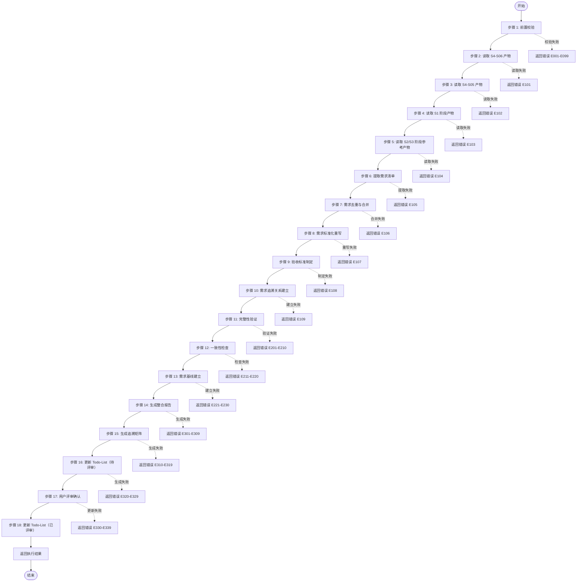

# Skill8: 需求整合与规整

## 元信息

| 项目 | 内容 |
|-----|------|
| **Skill 编号** | S4-S08 |
| **Skill 名称** | 需求整合与规整 |
| **英文名称** | Requirement Consolidation & Standardization |
| **所属阶段** | S4 - 需求整合与核心提炼阶段 |
| **执行顺序** | S4 阶段第 3 个执行（依赖 S4-S06） |
| **执行模式** | 常规模式执行，轻量化模式可选执行 |
| **前置 Skill** | S4-S06（需求优先级排序） |
| **后置 Skill** | 无（S4 阶段最后一个 Skill） |
| **参考标准** | IEEE 29148-2011, ISO/IEC 25010 |
| **Skill 版本** | 3.0 |
| **模板引用** | [template.md](template.md) |

---

## 功能描述

### 核心目标

Skill8 负责将前面所有分析阶段（Skill1-Skill7, Skill9-Skill12）的结果进行**统一整合与规整**，形成完整、一致、结构化的最终需求规格说明，包括：

1. **需求整合**：整合所有阶段的需求分析结果，形成统一需求清单
2. **需求标准化**：将所有需求统一为标准化的用户故事格式
3. **验收标准制定**：为每个需求制定明确的验收标准
4. **需求追溯建立**：建立从原始需求到最终规格的全链路追溯
5. **需求基线建立**：建立需求基线，支持后续变更管理
6. **完整性验证**：验证需求集合的完整性、一致性和可追溯性

### 核心职责

| 职责编号 | 职责名称 | 说明 | 权重 |
|---------|---------|------|------|
| S4-S08-R01 | 需求整合 | 整合 Skill1-Skill7、Skill9-Skill12 的所有需求分析结果 | 25% |
| S4-S08-R02 | 需求标准化 | 将所有需求统一为标准化的用户故事格式（符合 IEEE 29148-2011） | 20% |
| S4-S08-R03 | 验收标准制定 | 为每个需求制定功能、性能、安全、体验等验收标准 | 20% |
| S4-S08-R04 | 需求追溯建立 | 建立从原始需求→分析结果→最终规格的全链路追溯矩阵 | 15% |
| S4-S08-R05 | 完整性验证 | 验证需求集合的完整性、一致性、无矛盾性 | 10% |
| S4-S08-R06 | 需求基线建立 | 建立需求基线版本，支持变更管理 | 10% |

### 输入规范

**必需输入**：

| 输入编号 | 来源 Skill | 产物 ID | 产物类型 | 必需性 |
|---------|-----------|--------|---------|--------|
| IN-01 | S4-S06 | {PlanID}-S4-S06-001 | 需求优先级排序结果 | 必需 |
| IN-02 | S4-S05 | {PlanID}-S4-S05-001 | 需求分类梳理结果 | 必需 |
| IN-03 | S1-S01 | {PlanID}-S1-S01-001 | 需求边界界定报告 | 必需 |
| IN-04 | S1-S02 | {PlanID}-S1-S02-001 | 显性需求提取结果 | 必需 |
| IN-05 | S1-S03 | {PlanID}-S1-S03-001 | 隐性需求挖掘结果 | 必需 |
| IN-06 | S1-S04 | {PlanID}-S1-S04-001 | 需求验证报告 | 必需 |

**参考输入**：

| 输入编号 | 来源 Skill | 产物 ID | 产物类型 | 必需性 |
|---------|-----------|--------|---------|--------|
| IN-07 | S3-S07 | {PlanID}-S3-S07-001 | 需求风险识别报告 | 参考 |
| IN-08 | S2-S09 | {PlanID}-S2-S09-001 | 竞品分析报告 | 参考 |
| IN-09 | S2-S10 | {PlanID}-S2-S10-001 | 市场痛点验证报告 | 参考 |
| IN-10 | S3-S11 | {PlanID}-S3-S11-001 | 技术可行性评估报告 | 参考 |
| IN-11 | S3-S12 | {PlanID}-S3-S12-001 | 技术选型报告 | 参考 |

### 输出规范

**产物清单**：

| 产物编号 | 产物 ID 格式 | 产物名称 | 文件格式 | 存储路径 |
|---------|-------------|---------|---------|---------|
| OUT-01 | {PlanID}-S4-S08-001 | 需求整合与规整报告 | Markdown | `database/stages/s4/{PlanID}/{PlanID}-S4-S08-001.md` |
| OUT-02 | {PlanID}-S4-S08-001 | 需求追溯矩阵 | Markdown | `database/stages/s4/{PlanID}/{PlanID}-S4-S08-001-traceability.md` |
| OUT-03 | - | Todo-List 更新 | Markdown | `database/plans/{PlanID}/todo-list.md` |

**产物 ID 格式**：`{PlanID}-S4-S08-001`

**版本**：3.0（增强版本）

### Todo-List 更新规则

**更新时机 1：Skill 开始时**
- 任务状态：待执行 → 执行中
- 记录开始时间
- 更新进度概览（执行中 +1，待执行 -1）

**更新时机 2：用户交互后**
- 如交互导致产物重大变更，填写变更记录表格
- 记录交互轮次到备注

**更新时机 3：Skill 完成后（评审前）**
- 任务状态：执行中 → 已完成
- 填写输出文档路径
- 记录完成时间
- 评审状态：待评审

**更新时机 4：用户评审后**
- **评审通过**：任务状态 → 已评审，评审状态 → approved
- **需修改**：评审状态 → rejected，任务状态保持已完成
- **修改中**：评审状态 → modifying，任务状态 → 执行中
- **新增想法**：任务状态 → 执行中，评审状态 → pending
- 填写评审记录表格
- 更新进度概览（已评审 +1，如通过）

**Todo-List 文件路径**：`database/plans/{PlanID}/todo-list.md`

### 错误处理

**前置校验错误（E001-E099）**：
- E001：S4-S06 产物不存在 - 要求先执行 Skill6
- E002：S4-S05 产物不存在 - 要求先执行 Skill5
- E003-E006：S1 阶段产物缺失 - 要求先执行 S1 阶段 Skills
- E007：产物状态异常 - 要求重新生成产物
- E008：产物 ID 格式错误 - 要求修正 ID 格式

**执行过程错误（E100-E199）**：
- E101-E109：文件读取/解析/合并错误 - 重试或降级处理
- E106：需求合并冲突 - 记录日志，手动处理
- E107：需求重写失败 - 保持原描述，记录警告
- E108：验收标准缺失 - 提示补充，继续执行
- E109：追溯关系断裂 - 修复追溯关系，继续执行

**质量验证错误（E200-E299）**：
- E201：完整性得分过低 - 列出缺失项，要求补充
- E202：准确性得分过低 - 列出问题项，要求修正
- E203：一致性检查失败 - 列出矛盾项，要求解决
- E204：可追溯性得分过低 - 补充追溯关系
- E205：可读性得分过低 - 优化文档结构和表达
- E206-E208：SMART 检查/循环依赖/需求冲突

**用户评审错误（E300-E399）**：
- E301：用户评审未通过 - 用户提出修改意见
- W301：用户评审超时 - 24 小时未响应，状态设为 paused
- E302：评审意见解析失败 - 无法识别用户输入
- E301-E309：报告/追溯矩阵/状态文件生成失败

**用户交互错误（E400-E499）**：
- W401：用户交互超时 - 等待用户输入超时
- E401：用户输入无效 - 输入不符合格式要求
- E402：多轮交互超限 - 超过 5 轮仍未明确

**输出错误（E300-E399）**：
- E301：报告生成失败 - 重试 3 次，失败则返回错误
- E302：Markdown 生成失败 - 检查数据结构，重试
- E303：追溯矩阵生成失败 - 检查追溯数据，重试
- E304：状态更新失败 - 手动更新状态
- E305：文件写入失败 - 检查权限，重试

**系统错误（E900-E999）**：
- E901：内存溢出 - 优化数据处理，分批处理
- E902：执行超时 - 增加超时时间，优化性能
- E903：磁盘空间不足 - 清理磁盘空间
- E904：权限不足 - 检查文件权限

---

## 执行流程



### 步骤 1：前置校验

**目标**：验证前置 Skill 产物是否存在且格式正确

**操作**：
1. 检查 S4-S06 产物是否存在
2. 检查 S4-S05 产物是否存在
3. 检查 S1 阶段产物（S01-S04）是否存在
4. 检查产物状态是否为 completed
5. 验证产物 ID 格式是否正确

**验证规则**：
```
验证通过条件：
- S4-S06 产物存在且状态为 completed
- S4-S05 产物存在且状态为 completed
- S1-S01, S1-S02, S1-S03, S1-S04 产物均存在
- 所有产物 ID 格式符合规范
```

**错误处理**：
- 若 S4-S06 产物不存在：返回 E001 错误
- 若 S4-S05 产物不存在：返回 E002 错误
- 若 S1 阶段产物缺失：返回 E003-E006 错误
- 若产物状态异常：返回 E007 错误
- 若产物 ID 格式错误：返回 E008 错误

### 步骤 2：读取 S4-S06 产物

**目标**：读取需求优先级排序结果，提取需求清单和优先级信息

**操作**：
1. 读取 `{PlanID}-S4-S06-001.md`
2. 解析 Markdown 报告，提取 prioritizedRequirements 列表
3. 提取每个需求的优先级、评估得分、版本规划信息
4. 建立优先级索引，便于后续查询

**验证规则**：
- Markdown 报告必须格式规范
- prioritizedRequirements 列表不能为空
- 每个需求必须包含 reqId、priority、phase 字段

**错误处理**：
- 文件读取失败：返回 E101 错误
- Markdown 解析失败：返回 E102 错误
- 需求清单为空：返回警告 W101，继续执行

### 步骤 3：读取 S4-S05 产物

**目标**：读取需求分类梳理结果，提取需求分类信息

**操作**：
1. 读取 `{PlanID}-S4-S05-001.md`
2. 解析 Markdown 报告，提取分类需求列表
3. 提取功能需求、用户需求、系统需求、业务需求分类信息
4. 建立分类索引

**验证规则**：
- Markdown 报告必须格式规范
- 至少包含一种需求分类

**错误处理**：
- 文件读取失败：返回 E103 错误
- Markdown 解析失败：返回 E104 错误

### 步骤 4：读取 S1 阶段产物

**目标**：读取 S1 阶段（Skill1-Skill4）的需求分析结果

**操作**：
1. 读取 S1-S01：需求边界界定报告，提取产品边界、目标用户、核心场景
2. 读取 S1-S02：显性需求提取结果，提取用户明确表达的需求
3. 读取 S1-S03：隐性需求挖掘结果，提取推导出的隐性需求
4. 读取 S1-S04：需求验证报告，提取验证结果和 SMART 符合度

**验证规则**：
- 所有 S1 阶段产物必须存在
- 产物内容必须完整

**错误处理**：
- 产物缺失：返回对应错误码（E105-E108）
- 内容不完整：记录警告，继续执行

### 步骤 5：读取 S2/S3 阶段参考产物

**目标**：读取 S2/S3 阶段（Skill5-Skill7, Skill9-Skill12）的分析结果作为参考

**操作**：
1. 读取 S3-S07：需求风险识别报告，提取风险信息和缓解建议
2. 读取 S2-S09：竞品分析报告，提取竞品功能对比和差异化建议
3. 读取 S2-S10：市场痛点验证报告，提取市场痛点和用户痛点验证结果
4. 读取 S3-S11：技术可行性评估报告，提取技术可行性评级
5. 读取 S3-S12：技术选型报告，提取技术栈建议

**验证规则**：
- 产物存在则读取，不存在则跳过（非必需）

**错误处理**：
- 产物不存在：记录日志，继续执行（非阻塞）

### 步骤 5.5：用户交互（信息补全与澄清）

**触发场景**：
1. 检测到关键字段缺失或模糊（如需求描述不清晰、验收标准模糊）
2. 需求信息完整度评分低于 60 分
3. 检测到矛盾或冲突信息（如需求冲突、验收标准矛盾）
4. 存在多个可行方案需要用户决策

**交互流程**：
1. 识别需要澄清的问题点
2. 生成标准化交互问题（使用问题模板）
3. 展示问题并等待用户输入
4. 解析用户输入并补充到产物中
5. 如仍不明确，进行多轮对话直到明确（最多 5 轮）

**问题模板**：

**模板 1：信息补全**
```
【信息补全请求】

在需求整合过程中，发现以下关键信息缺失：

缺失字段：{字段名称}
当前上下文：{相关背景信息}
影响范围：{不补充的影响}

请补充{字段名称}的具体描述：
- 期望格式：{格式要求}
- 示例：{参考示例}

您的输入：
```

**模板 2：需求澄清**
```
【需求澄清请求】

检测到以下需求描述可能存在歧义：

原文描述："{模糊描述}"
可能理解：
  A. {理解 A}
  B. {理解 B}
  C. {理解 C}
  D. 其他（请说明）

请选择您的真实意图（单选）：
- 输入选项字母（A/B/C/D）
- 如选择 D，请补充具体说明

您的选择：
```

**模板 3：方案选择**
```
【方案选择请求】

针对{需求名称}，存在以下可行方案：

方案 A：{方案 A 描述}
  - 优点：{优点列表}
  - 缺点：{缺点列表}
  - 适用场景：{场景描述}

方案 B：{方案 B 描述}
  - 优点：{优点列表}
  - 缺点：{缺点列表}
  - 适用场景：{场景描述}

请选择您的偏好方案：
- 单选：输入方案字母（A/B）
- 多选：输入方案字母组合（AB/BA）
- 其他：提出新方案

您的选择：
```

**交互记录**：
- 所有交互记录保存到产物文档的"用户交互记录"章节
- 记录格式：交互轮次、交互时间、交互类型、问题描述、用户输入、解析结果、处理状态

**错误处理**：
- W401：用户交互超时 - 等待用户输入超时，继续执行
- E401：用户输入无效 - 输入不符合格式要求，重新提问
- E402：多轮交互超限 - 超过 5 轮仍未明确，使用默认值并标记待确认

### 步骤 6：提取需求清单

**目标**：从所有输入产物中提取需求清单，形成原始需求池

**操作**：
1. 从 S4-S06 产物中提取优先级排序后的需求列表
2. 从 S4-S05 产物中按分类提取需求
3. 从 S1-S02 产物中提取显性需求
4. 从 S1-S03 产物中提取隐性需求
5. 合并所有需求，建立统一需求池

**需求信息提取**：
```
每个需求包含：
- reqId: 需求 ID
- description: 需求描述
- category: 需求分类（功能/用户/系统/业务）
- priority: 优先级（P0-P4）
- phase: 所属版本（MVP/V1.0/V2.0/Future）
- source: 需求来源（Skill2/ Skill3/其他）
- smartCheck: SMART 检查结果
- feasibility: 技术可行性评级
- riskLevel: 风险等级
```

**验证规则**：
- 需求池不能为空
- 每个需求必须有唯一 ID

**错误处理**：
- 需求池为空：返回 E109 错误
- 需求 ID 重复：记录警告，自动重命名

### 步骤 7：需求去重与合并

**目标**：识别并合并重复需求，消除冗余

**操作**：
1. 基于需求描述相似度识别重复需求
2. 对于重复需求，保留优先级最高的版本
3. 合并重复需求的描述和验收标准
4. 更新需求 ID 映射关系

**去重规则**：
```
重复判定标准：
- 描述相似度 > 85%
- 功能目标一致
- 用户角色相同

合并策略：
- 保留优先级最高的需求 ID
- 合并所有验收标准
- 记录合并历史
```

**验证规则**：
- 合并后需求数量应减少或持平
- 不能有需求丢失

**错误处理**：
- 合并冲突：记录日志，手动处理

### 步骤 8：需求标准化重写

**目标**：将所有需求统一重写为标准化的用户故事格式

**操作**：
1. 按照标准格式重写每个需求：
   ```
   作为 [用户角色]，
   我希望 [功能描述]，
   以便 [业务价值/用户价值]。
   ```
2. 确保需求描述符合 SMART 原则
3. 补充缺失的用户角色、价值说明
4. 统一术语和命名规范

**标准化规则**：
```
用户角色标准化：
- 使用 S1-S01 中定义的目标用户角色
- 避免模糊的角色描述（如"用户"）

功能描述标准化：
- 使用主动语态
- 明确操作对象
- 避免技术实现细节

价值说明标准化：
- 明确业务价值或用户价值
- 与产品愿景保持一致
```

**验证规则**：
- 所有需求必须符合用户故事格式
- 需求描述必须清晰、无歧义

**错误处理**：
- 无法重写：记录警告，保持原描述

### 步骤 9：验收标准制定

**目标**：为每个需求制定明确的验收标准

**操作**：
1. 为每个需求制定 3-7 条验收标准
2. 验收标准覆盖功能、性能、安全、体验等维度
3. 确保验收标准可测试、可量化
4. 标注验收标准的优先级（P0/P1/P2）

**验收标准类型**：
```
功能验收（必须）：
- 功能正确性验证
- 输入输出验证
- 异常处理验证

性能验收（P0 需求必须）：
- 响应时间指标
- 并发用户数
- 资源使用限制

安全验收（涉及安全的需求必须）：
- 数据加密
- 权限验证
- 安全漏洞防护

用户体验验收（面向用户的功能必须）：
- 易用性标准
- 界面响应
- 错误提示
```

**验证规则**：
- 每个需求至少有 3 条验收标准
- 验收标准必须可测试

**错误处理**：
- 验收标准不足：提示补充
- 验收标准不可测试：要求重写

### 步骤 10：需求追溯关系建立

**目标**：建立从原始需求到最终规格的全链路追溯

**操作**：
1. 识别每个需求的来源（Skill1-Skill7, Skill9-Skill12）
2. 建立需求之间的依赖关系
3. 建立需求与验收标准的追溯
4. 生成需求追溯矩阵

**追溯关系类型**：
```
TRACE-DERIVE（派生自）：
- 需求派生自某个源头
- 示例：功能需求派生自用户需求

TRACE-DEPEND（依赖于）：
- 需求依赖于其他需求
- 示例：R002 依赖于 R001

TRACE-REF（参考于）：
- 需求参考了竞品分析/市场验证结果
- 示例：R003 参考于竞品分析#3

TRACE-VERIFY（验证于）：
- 需求验证于测试用例
- 示例：R001 验证于 TC001-TC003
```

**验证规则**：
- 每个需求必须有明确的来源
- 依赖关系必须无循环

**错误处理**：
- 来源不明：标记为"未知来源"
- 循环依赖：报错并提示修复

### 步骤 11：完整性验证

**目标**：验证需求集合的完整性

**操作**：
1. 检查是否所有 P0/P1 需求都已包含
2. 检查是否所有业务场景都有需求覆盖
3. 检查是否所有用户角色都有需求支持
4. 检查是否所有功能分类都有需求

**完整性检查清单**：
```
业务完整性：
- [ ] 产品愿景中的核心目标有需求支持
- [ ] 业务流程中的所有环节有需求覆盖
- [ ] 业务规则有需求实现

用户完整性：
- [ ] 目标用户角色都有对应的用户需求
- [ ] 用户场景都有需求支持
- [ ] 用户痛点都有解决方案

功能完整性：
- [ ] 功能分类中的每个子类都有需求
- [ ] 核心功能链路完整
- [ ] 异常处理流程有需求

系统完整性：
- [ ] 性能需求有定义
- [ ] 安全需求有定义
- [ ] 兼容性需求有定义
```

**验证规则**：
- 完整性检查通过率应 ≥ 90%

**错误处理**：
- 完整性不足：列出缺失项，要求补充
- 严重缺失：返回 E201-E210 错误

### 步骤 12：一致性检查

**目标**：验证需求集合的一致性，消除矛盾

**操作**：
1. 检查需求之间是否存在矛盾
2. 检查需求与业务目标是否一致
3. 检查需求与产品边界是否一致
4. 检查术语使用是否一致

**一致性检查清单**：
```
需求间一致性：
- [ ] 无互斥需求同时存在
- [ ] 依赖关系合理
- [ ] 优先级排序合理

与业务目标一致性：
- [ ] 所有需求与产品愿景一致
- [ ] 所有需求与业务边界一致
- [ ] 所有需求与目标用户一致

术语一致性：
- [ ] 同一概念使用相同术语
- [ ] 术语定义清晰无歧义
- [ ] 符合行业标准术语
```

**验证规则**：
- 一致性检查通过率应 ≥ 95%

**错误处理**：
- 发现矛盾：列出矛盾项，要求解决
- 严重矛盾：返回 E211-E220 错误

### 步骤 13：需求基线建立

**目标**：建立需求基线版本，支持变更管理

**操作**：
1. 为需求集合分配基线版本号（v1.0）
2. 记录基线创建时间和创建人
3. 建立变更日志结构
4. 定义变更管理流程

**基线信息**：
```
基线版本：v1.0
创建时间：{ISO 时间戳}
创建人：System
变更日志：[]
变更流程：
  1. 提交变更申请
  2. 评估变更影响
  3. 审批变更
  4. 更新需求
  5. 更新基线版本
```

**验证规则**：
- 基线版本必须唯一
- 变更日志必须可追溯

**错误处理**：
- 基线建立失败：返回 E221-E230 错误

### 步骤 14：生成整合报告

**目标**：生成需求整合与规整报告（Markdown 格式）

**操作**：
1. 按照 template.md 模板生成报告
2. 包含所有需求章节
3. 包含完整性验证结果
4. 包含一致性检查结果

**报告结构**：
- 执行摘要
- 需求整合详情
- 需求规格说明
- 验收标准汇总
- 需求追溯矩阵
- 完整性验证报告
- 一致性检查报告
- 需求基线信息
- 附录

**验证规则**：
- 报告格式必须符合模板
- 所有章节必须完整

**错误处理**：
- 生成失败：返回 E301-E309 错误

### 步骤 15：生成追溯矩阵

**目标**：生成需求追溯矩阵文档

**操作**：
1. 生成需求追溯表格
2. 绘制依赖关系图
3. 建立需求索引

**验证规则**：
- 追溯关系必须完整
- 依赖关系图必须清晰

**错误处理**：
- 生成失败：返回 E320-E329 错误

### 步骤 16：更新 Todo-List（待评审）

**目标**：更新 Todo-List 任务状态为"已完成"，评审状态为"待评审"

**操作**：
1. 读取 `database/plans/{PlanID}/todo-list.md`
2. 更新 S4-S08 任务状态为"已完成"
3. 填写输出文档路径
4. 记录完成时间
5. 评审状态设置为"待评审"
6. 更新进度概览

**验证规则**：
- 状态必须正确更新
- 产物路径必须准确

**错误处理**：
- E204：Todo-List 结构错误 - Todo-List 文件格式不符合规范

### 步骤 17：用户评审确认

**目标**：触发用户评审流程，等待用户确认

**评审提示模板**：
```
【需求分析-S4-需求整合与规整】- 用户评审

需求整合与规整已完成，输出产物如下：

**产物文件**：`{PlanID}-S4-S08-001.md`
**追溯矩阵**：`{PlanID}-S4-S08-001-traceability.md`

**整合统计**：
- 总需求数：{X} 项
- Must Have：{X} 项
- Should Have：{X} 项
- Could Have：{X} 项
- Won't Have：{X} 项
- SMART 通过率：{X}%
- 追溯完整性：{X}%

**用户交互记录**：{X} 轮交互

---
请评审以上结果：
- 输入「确认」表示无误，继续执行下一个步骤
- 输入「修改」并提供修改意见，格式：「修改：{具体修改内容}」
- 输入「新增」并提出新想法，格式：「新增：{新需求内容}」

示例：
- 确认
- 修改：需求 1 的验收标准需要补充性能指标
- 新增：希望能增加需求变更记录章节
```

**用户决策处理**：
1. **确认**：
   - 更新 Todo-List：任务状态 → 已评审，评审状态 → approved
   - 填写评审记录表格
   - S4 阶段完成，进入最终报告阶段

2. **修改 - 小修改**：
   - 直接修改产物内容
   - 重新展示评审
   - 更新 Todo-List：评审状态 → rejected → modifying

3. **修改 - 大修改**：
   - 返回步骤 6 重新执行
   - 更新 Todo-List：任务状态 → 执行中，评审状态 → pending
   - 填写变更记录表格

4. **新增想法**：
   - 更新产物内容
   - 重新展示评审
   - 更新 Todo-List：任务状态 → 执行中，评审状态 → pending

**评审超时处理**：
- 超时时间：24 小时
- 超时处理：状态设为 paused，支持恢复
- 恢复方式：用户输入「继续」后从断点继续

**错误处理**：
- E301：用户评审未通过 - 用户提出修改意见
- W301：用户评审超时 - 24 小时未响应，状态设为 paused
- E302：评审意见解析失败 - 无法识别用户输入

### 步骤 18：更新 Todo-List（已评审）

**目标**：更新 Todo-List 任务状态为"已评审"，记录评审结果

**操作**：
1. 读取 `database/plans/{PlanID}/todo-list.md`
2. 更新 S4-S08 任务状态为"已评审"
3. 评审状态设置为"approved"
4. 填写评审记录表格：
   - 评审轮次：第 N 轮评审
   - 评审时间：评审完成的时间
   - 评审结果：通过/需修改
   - 评审意见：用户提出的具体意见
   - 处理状态：已处理/处理中
5. 更新进度概览

**验证规则**：
- 状态必须正确更新
- 评审记录必须完整

**错误处理**：
- E204：Todo-List 结构错误 - Todo-List 文件格式不符合规范

### 步骤 19：返回执行结果
1. 生成需求追溯表格
2. 绘制依赖关系图
3. 建立需求索引

**验证规则**：
- 追溯关系必须完整
- 依赖关系图必须清晰

**错误处理**：
- 生成失败：返回 E320-E329 错误

### 步骤 17：更新 Todo-List（已评审）

**目标**：更新 Todo-List 任务状态为"已评审"，记录评审结果

**操作**：
1. 读取 `database/plans/{PlanID}/todo-list.md`
2. 更新 S4-S08 任务状态为"已评审"
3. 评审状态设置为"approved"
4. 填写评审记录表格
5. 更新进度概览

**验证规则**：
- 状态更新必须成功
- 评审记录必须完整

**错误处理**：
- 更新失败：返回 E330-E339 错误

### 步骤 18：返回执行结果

**目标**：返回 Skill 执行结果给 Coordinator Agent

**操作**：
1. 构建执行结果
2. 包含产物列表
3. 包含执行统计
4. 返回结果

**返回内容**：
- 执行状态：success/failed
- PlanID：计划 ID
- SkillID：S08
- 输出产物：产物文件列表
- 执行统计：统计数据

**错误处理**：
- 返回格式错误：使用标准格式重新构建

---

## 产物规范

### 产物 1：需求整合与规整报告

**文件路径**：`database/stages/s4/{PlanID}-S4-S08-001-consolidation.md`

**内容结构**：参见 [template.md](template.md)

**版本**：2.0

**核心章节**：
1. 执行摘要
2. 需求整合详情（按来源 Skill 分类）
3. 需求规格说明（按优先级分类）
4. 验收标准汇总
5. 需求追溯矩阵
6. 完整性验证报告
7. 一致性检查报告
8. 需求基线信息
9. 附录

### 产物 2：需求追溯矩阵

**文件路径**：`database/stages/s4/{PlanID}/{PlanID}-S4-S08-001-traceability.md`

**内容结构**：
1. 追溯矩阵表
2. 依赖关系图
3. 需求来源索引
4. 需求分类索引

**版本**：3.0（增强版本）

---

## 质量标准

### 质量评估框架（基于 ISO/IEC 25010）

| 质量维度 | 权重 | 评估标准 | 验收阈值 |
|---------|------|---------|---------|
| **完整性** | 30% | 所有需求都已整合，无遗漏 | ≥ 90% |
| **准确性** | 25% | 需求描述准确，无歧义 | ≥ 90% |
| **一致性** | 20% | 需求之间无矛盾，术语统一 | ≥ 95% |
| **可追溯性** | 15% | 追溯关系完整，来源清晰 | ≥ 90% |
| **可读性** | 10% | 结构清晰，表达准确 | ≥ 85% |

**质量综合得分** = 完整性×30% + 准确性×25% + 一致性×20% + 可追溯性×15% + 可读性×10%

**验收标准**：质量综合得分 ≥ 85%

### 质量检查清单

#### 完整性检查（30%）

```
业务完整性：
- [ ] 产品愿景中的核心目标有需求支持
- [ ] 业务流程中的所有环节有需求覆盖
- [ ] 业务规则有需求实现

用户完整性：
- [ ] 目标用户角色都有对应的用户需求
- [ ] 用户场景都有需求支持
- [ ] 用户痛点都有解决方案

功能完整性：
- [ ] 功能分类中的每个子类都有需求
- [ ] 核心功能链路完整
- [ ] 异常处理流程有需求

系统完整性：
- [ ] 性能需求有定义
- [ ] 安全需求有定义
- [ ] 兼容性需求有定义
```

#### 准确性检查（25%）

```
需求描述准确性：
- [ ] 需求描述清晰、无歧义
- [ ] 使用主动语态
- [ ] 避免模糊词汇

验收标准准确性：
- [ ] 验收标准可测试
- [ ] 验收标准可量化
- [ ] 验收标准覆盖全面

SMART 符合度：
- [ ] Specific：需求具体明确
- [ ] Measurable：有量化指标
- [ ] Achievable：可实现
- [ ] Relevant：与目标相关
- [ ] Time-bound：有时限
```

#### 一致性检查（20%）

```
需求间一致性：
- [ ] 无互斥需求同时存在
- [ ] 依赖关系合理
- [ ] 优先级排序合理

与业务目标一致性：
- [ ] 所有需求与产品愿景一致
- [ ] 所有需求与业务边界一致
- [ ] 所有需求与目标用户一致

术语一致性：
- [ ] 同一概念使用相同术语
- [ ] 术语定义清晰无歧义
- [ ] 符合行业标准术语
```

#### 可追溯性检查（15%）

```
来源追溯：
- [ ] 每个需求都有明确的来源
- [ ] 来源 Skill 标识清晰
- [ ] 原始需求可追溯

依赖追溯：
- [ ] 依赖关系明确标识
- [ ] 依赖关系无循环
- [ ] 依赖链完整

验证追溯：
- [ ] 需求与验收标准对应
- [ ] 验收标准与测试用例对应
- [ ] 测试用例可执行
```

#### 可读性检查（10%）

```
结构清晰性：
- [ ] 文档结构符合模板
- [ ] 章节划分合理
- [ ] 层次结构清晰

表达准确性：
- [ ] 语言简洁明了
- [ ] 无语法错误
- [ ] 无拼写错误

格式规范性：
- [ ] 格式统一
- [ ] 图表清晰
- [ ] 编号连续
```

---

## 错误处理

### 错误分类

| 错误类别 | 错误码范围 | 说明 |
|---------|-----------|------|
| 前置校验错误 | E001-E099 | 前置条件不满足 |
| 执行过程错误 | E100-E199 | 执行过程中的错误 |
| 质量验证错误 | E200-E299 | 质量验证不通过 |
| 输出错误 | E300-E399 | 产物生成失败 |
| 系统错误 | E900-E999 | 系统级错误 |

### 错误代码表

#### 前置校验错误（E001-E099）

| 错误码 | 错误名称 | 错误描述 | 处理策略 |
|--------|---------|---------|---------|
| E001 | S4-S06_NOT_FOUND | S4-S06 产物不存在 | 返回错误，要求先执行 Skill6 |
| E002 | S4-S05_NOT_FOUND | S4-S05 产物不存在 | 返回错误，要求先执行 Skill5 |
| E003 | S1-S01_NOT_FOUND | S1-S01 产物不存在 | 返回错误，要求先执行 Skill1 |
| E004 | S1-S02_NOT_FOUND | S1-S02 产物不存在 | 返回错误，要求先执行 Skill2 |
| E005 | S1-S03_NOT_FOUND | S1-S03 产物不存在 | 返回错误，要求先执行 Skill3 |
| E006 | S1-S04_NOT_FOUND | S1-S04 产物不存在 | 返回错误，要求先执行 Skill4 |
| E007 | STATUS_ABNORMAL | 产物状态异常 | 返回错误，要求重新生成产物 |
| E008 | ID_FORMAT_ERROR | 产物 ID 格式错误 | 返回错误，要求修正 ID 格式 |

#### 执行过程错误（E100-E199）

| 错误码 | 错误名称 | 错误描述 | 处理策略 |
|--------|---------|---------|---------|
| E101 | FILE_READ_FAILED | 文件读取失败 | 重试 3 次，失败则返回错误 |
| E102 | MARKDOWN_PARSE_FAILED | Markdown 解析失败 | 返回错误，要求检查 Markdown 格式 |
| E103 | REQUIREMENT_EMPTY | 需求清单为空 | 返回警告，确认是否确实无需求 |
| E104 | DUPLICATE_REQ_ID | 需求 ID 重复 | 自动重命名，记录日志 |
| E105 | SOURCE_MISSING | 需求来源缺失 | 标记为"未知来源"，继续执行 |
| E106 | MERGE_CONFLICT | 需求合并冲突 | 记录日志，手动处理 |
| E107 | REWRITE_FAILED | 需求重写失败 | 保持原描述，记录警告 |
| E108 | ACCEPTANCE_MISSING | 验收标准缺失 | 提示补充，继续执行 |
| E109 | TRACEABILITY_BROKEN | 追溯关系断裂 | 修复追溯关系，继续执行 |

#### 质量验证错误（E200-E299）

| 错误码 | 错误名称 | 错误描述 | 处理策略 |
|--------|---------|---------|---------|
| E201 | COMPLETENESS_LOW | 完整性得分过低 | 列出缺失项，要求补充 |
| E202 | ACCURACY_LOW | 准确性得分过低 | 列出问题项，要求修正 |
| E203 | CONSISTENCY_FAILED | 一致性检查失败 | 列出矛盾项，要求解决 |
| E204 | TRACEABILITY_LOW | 可追溯性得分过低 | 补充追溯关系 |
| E205 | READABILITY_LOW | 可读性得分过低 | 优化文档结构和表达 |
| E206 | SMART_CHECK_FAILED | SMART 检查不通过 | 标记不通过项，要求优化 |
| E207 | CIRCULAR_DEPENDENCY | 循环依赖 | 报错并提示修复 |
| E208 | REQUIREMENT_CONFLICT | 需求冲突 | 列出冲突项，要求解决 |

#### 输出错误（E300-E399）

| 错误码 | 错误名称 | 错误描述 | 处理策略 |
|--------|---------|---------|---------|
| E301 | REPORT_GENERATION_FAILED | 报告生成失败 | 重试 3 次，失败则返回错误 |
| E302 | MARKDOWN_GENERATION_FAILED | Markdown 生成失败 | 检查数据结构，重试 |
| E303 | TRACEABILITY_GENERATION_FAILED | 追溯矩阵生成失败 | 检查追溯数据，重试 |
| E304 | STATUS_UPDATE_FAILED | 状态更新失败 | 手动更新状态 |
| E305 | FILE_WRITE_FAILED | 文件写入失败 | 检查权限，重试 |
| E306 | TEMPLATE_NOT_FOUND | 模板文件不存在 | 返回错误，检查模板路径 |
| E307 | SCHEMA_VALIDATION_FAILED | Schema 验证失败 | 检查数据结构，修正 |

#### 系统错误（E900-E999）

| 错误码 | 错误名称 | 错误描述 | 处理策略 |
|--------|---------|---------|---------|
| E901 | MEMORY_OVERFLOW | 内存溢出 | 优化数据处理，分批处理 |
| E902 | TIMEOUT | 执行超时 | 增加超时时间，优化性能 |
| E903 | DISK_FULL | 磁盘空间不足 | 清理磁盘空间 |
| E904 | PERMISSION_DENIED | 权限不足 | 检查文件权限 |

### 错误处理流程

```
发生错误
    ↓
错误分类与识别
    ↓
是否可恢复错误？
    ├── 是 → 重试/降级处理 → 决策继续/中止
    └── 否 → 记录错误详情 → 中止执行
    ↓
返回错误信息给用户
```

### 错误恢复策略

| 错误类型 | 恢复策略 | 重试次数 | 降级方案 |
|---------|---------|---------|---------|
| 文件读取失败 | 重试读取 | 3 次 | 使用缓存数据 |
| Markdown 解析失败 | 修复 Markdown 格式 | 1 次 | 手动解析 |
| 需求合并冲突 | 保留高优先级 | 0 次 | 记录日志，手动处理 |
| 追溯关系断裂 | 自动修复 | 1 次 | 标记为"未知" |
| 质量验证不通过 | 补充/修正 | 1 次 | 标记问题项 |

---

## 版本历史

| 版本 | 日期 | 更新内容 | 更新人 |
|------|------|---------|--------|
| 1.0 | 2026-03-24 | 初始版本，参考 IEEE 29148-2011 标准定义需求规格规范 | System |
| 2.0 | 2026-03-24 | 标准化版本：重新定位为"需求整合与规整"，采用 6 段式结构，统一整合所有分析阶段结果 | System |

---

## 附录：与其他 Skill 的对比

### Skill 定位对比

| Skill | 核心职责 | 输出产物 | 执行阶段 |
|-------|---------|---------|---------|
| Skill1 | 需求边界界定 | 产品边界、目标用户、核心场景 | S1 |
| Skill2 | 显性需求提取 | 用户明确表达的需求 | S1 |
| Skill3 | 隐性需求挖掘 | 推导出的隐性需求 | S1 |
| Skill4 | 需求验证 | 需求质量验证结果 | S1 |
| Skill5 | 需求分类梳理 | 按功能/用户/系统/业务分类的需求 | S4 |
| Skill6 | 需求优先级排序 | 带优先级排序的需求清单 | S4 |
| Skill7 | 需求风险识别 | 需求风险评估和缓解建议 | S3 |
| **Skill8** | **需求整合与规整** | **完整、一致、结构化的最终需求规格** | **S4** |
| Skill9 | 竞品分析 | 竞品功能对比和差异化建议 | S2 |
| Skill10 | 市场痛点验证 | 市场和用户痛点验证结果 | S2 |
| Skill11 | 技术可行性评估 | 需求技术可行性评级 | S3 |
| Skill12 | 技术选型 | 技术栈建议和架构设计 | S3 |

### Skill8 的整合角色

```
Skill8（需求整合与规整）
    ↓
整合以下 Skill 的分析结果：
├── S1 阶段：Skill1, Skill2, Skill3, Skill4（需求分析基础）
├── S2 阶段：Skill9, Skill10（市场和竞品分析）
├── S3 阶段：Skill7, Skill11, Skill12（技术和风险分析）
└── S4 阶段：Skill5, Skill6（需求分类和优先级）
    ↓
输出：完整、一致、结构化的最终需求规格说明
```
