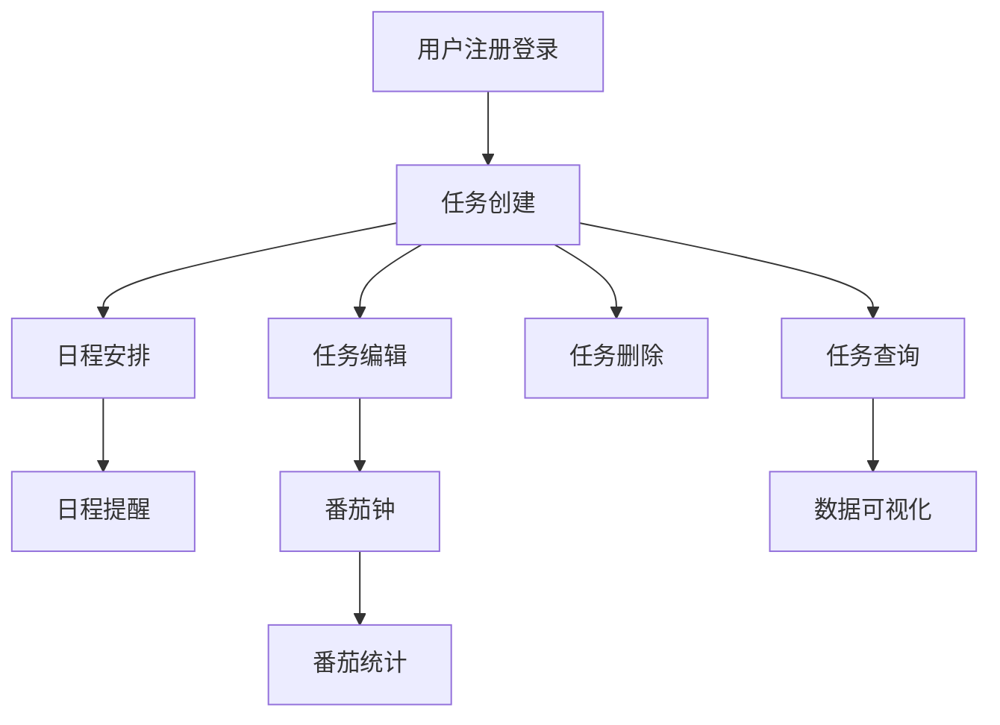

# 需求整合与规整报告模板

## 文档信息

| 项目 | 内容 |
|-----|------|
| **文档 ID** | {PlanID}-S4-S08-001 |
| **Plan ID** | {PlanID} |
| **文档版本** | v1.0 |
| **生成时间** | {YYYY-MM-DD HH:MM:SS} |
| **Skill 版本** | S4-S08 v2.0 |
| **需求总数** | {N} 项 |
| **SMART 符合率** | {X}% |
| **追溯完整性** | {X}% |

---

## 文档控制

### 版本历史

| 版本 | 日期 | 修改人 | 修改内容 |
|------|------|--------|---------|
| 1.0 | {日期} | System | 初始版本，基于所有 Skill 分析结果整合生成 |

### 审批记录

| 角色 | 姓名 | 日期 | 意见 |
|------|------|------|------|
| 产品经理 | {姓名} | {日期} | {意见} |
| 技术负责人 | {姓名} | {日期} | {意见} |
| 测试负责人 | {姓名} | {日期} | {意见} |

---

## 执行摘要

### 整合概览

| 整合维度 | 数据来源 | 需求数量 | 占比 | 说明 |
|---------|---------|---------|------|------|
| 显性需求 | Skill2 | {N} | {X}% | 用户明确表达的需求 |
| 隐性需求 | Skill3 | {N} | {X}% | 推导出的隐性需求 |
| 功能需求 | Skill5 | {N} | {X}% | 按功能分类的需求 |
| 用户需求 | Skill5 | {N} | {X}% | 按用户分类的需求 |
| 系统需求 | Skill5 | {N} | {X}% | 按系统分类的需求 |
| 业务需求 | Skill5 | {N} | {X}% | 按业务分类的需求 |
| **去重后总计** | - | **{N}** | **100%** | - |

### 优先级分布

| 优先级 | 需求数量 | 占比 | 阶段分布 | 说明 |
|--------|---------|------|---------|------|
| P0 | {N} | {X}% | MVP: {N} | 必须实现的核心需求 |
| P1 | {N} | {X}% | MVP: {N}, V1.0: {N} | 应该实现的重要需求 |
| P2 | {N} | {X}% | V1.0: {N}, V2.0: {N} | 可以实现的一般需求 |
| P3 | {N} | {X}% | V2.0: {N}, Future: {N} | 可选实现的边缘需求 |
| P4 | {N} | {X}% | Future: {N} | 暂缓实现的需求 |

### 版本规划

| 阶段 | 需求数量 | 需求 ID 列表 | 预计工作量 | 目标日期 |
|------|---------|-----------|-----------|---------|
| **MVP** | {N} | R001-R00X | {X} PD | {日期} |
| **V1.0** | {N} | R00X-R00X | {X} PD | {日期} |
| **V2.0** | {N} | R00X-R00X | {X} PD | {日期} |
| **Future** | {N} | R00X-R00X | {X} PD | {日期} |

### SMART 符合度统计

| 检查项 | 符合数量 | 不符合数量 | 符合率 | 不通过项处理 |
|--------|---------|-----------|--------|------------|
| Specific（具体） | {N} | {N} | {X}% | {N} 项已优化 |
| Measurable（可衡量） | {N} | {N} | {X}% | {N} 项已补充指标 |
| Achievable（可实现） | {N} | {N} | {X}% | {N} 项技术可行 |
| Relevant（相关） | {N} | {N} | {X}% | {N} 项与目标对齐 |
| Time-bound（有时限） | {N} | {N} | {X}% | {N} 项已明确阶段 |
| **综合符合率** | {N} | {N} | **{X}%** | - |

### 质量评估

| 质量维度 | 得分 | 权重 | 加权得分 | 验收阈值 | 状态 |
|---------|------|------|---------|---------|------|
| 完整性 | {X}% | 30% | {X} | ≥90% | ✅/❌ |
| 准确性 | {X}% | 25% | {X} | ≥90% | ✅/❌ |
| 一致性 | {X}% | 20% | {X} | ≥95% | ✅/❌ |
| 可追溯性 | {X}% | 15% | {X} | ≥90% | ✅/❌ |
| 可读性 | {X}% | 10% | {X} | ≥85% | ✅/❌ |
| **质量综合得分** | - | **100%** | **{X}** | **≥85%** | **✅/❌** |

### 关键数据统计

| 统计项 | 数值 | 说明 |
|--------|------|------|
| 需求总数 | {N} | 去重后的需求总数 |
| 平均优先级得分 | {X.X} | 所有需求的平均优先级得分 |
| 最高优先级得分 | {X.X} | 最高优先级需求得分（R{ID}） |
| 最低优先级得分 | {X.X} | 最低优先级需求得分（R{ID}） |
| SMART 完全符合数 | {N} | 5 项全部符合的需求数量 |
| 有依赖关系的需求数 | {N} | 存在依赖关系的需求数量 |
| 互斥需求组数 | {N} | 互斥需求组的数量 |
| 优先级调整数 | {N} | 经过优先级调整的需求数量 |

---

## 一、需求整合详情（按来源 Skill 分类）

### 1.1 整合说明

本章节按来源 Skill 分类展示所有整合的需求，确保每个 Skill 的分析结果都被完整包含。

### 1.2 Skill1-S01（需求边界界定）贡献

**贡献类型**：产品边界、目标用户、核心场景定义

**影响的需求**：
| 需求 ID | 需求名称 | 关联边界 | 说明 |
|--------|---------|---------|------|
| R001 | 用户注册 | 目标用户：注册用户 | 明确用户角色 |
| R002 | 任务创建 | 核心场景：任务管理 | 明确使用场景 |

**边界符合度检查**：
- [ ] 所有需求都在产品边界内
- [ ] 所有需求都服务于目标用户
- [ ] 所有需求都支持核心场景

### 1.3 Skill2-S02（显性需求提取）贡献

**贡献类型**：用户明确表达的需求

**需求清单**：
| 需求 ID | 需求名称 | 原始描述 | 标准化后描述 | 优先级 | 阶段 |
|--------|---------|---------|-----------|--------|------|
| R001 | 任务创建 | "可以创建任务" | 作为注册用户，我希望可以创建带标题、描述、截止日期和优先级的任务，以便管理我的日常工作 | P0 | MVP |
| R002 | 日程安排 | "能看到日程" | 作为注册用户，我希望可以在日历视图中查看和管理我的任务安排，以便合理规划我的时间 | P0 | MVP |

**整合说明**：
- 共提取显性需求 {N} 项
- 标准化重写 {N} 项
- 合并重复需求 {N} 项

### 1.4 Skill3-S03（隐性需求挖掘）贡献

**贡献类型**：推导出的隐性需求

**需求清单**：
| 需求 ID | 需求名称 | 推导依据 | 标准化后描述 | 优先级 | 阶段 |
|--------|---------|---------|-----------|--------|------|
| R003 | 番茄钟 | 用户需要提高专注力 | 作为需要提高专注力的用户，我希望使用番茄工作法来管理我的学习时间，以便提高学习效率并避免疲劳 | P1 | MVP |
| R004 | 数据统计 | 用户需要看到进度 | 作为关注个人成长的用户，我希望看到我的任务完成情况统计，以便了解我的工作效率 | P1 | V1.0 |

**整合说明**：
- 共挖掘隐性需求 {N} 项
- 验证通过 {N} 项
- 补充到需求规格 {N} 项

### 1.5 Skill4-S04（需求验证）贡献

**贡献类型**：需求质量验证结果

**验证结果汇总**：
| 验证维度 | 验证通过数 | 验证未通过数 | 通过率 | 优化情况 |
|---------|-----------|-----------|--------|---------|
| 完整性验证 | {N} | {N} | {X}% | {N} 项已补充 |
| 一致性验证 | {N} | {N} | {X}% | {N} 项已修正 |
| SMART 验证 | {N} | {N} | {X}% | {N} 项已优化 |
| 可行性验证 | {N} | {N} | {X}% | {N} 项已调整 |

**整合说明**：
- 所有需求都经过验证
- 未通过项已全部优化或标记

### 1.6 Skill5-S05（需求分类梳理）贡献

**贡献类型**：需求分类框架

**分类需求清单**：
| 分类 | 需求数量 | 需求 ID 列表 | 占比 |
|------|---------|-----------|------|
| 功能需求 | {N} | R001, R002, ... | {X}% |
| 用户需求 | {N} | R003, R004, ... | {X}% |
| 系统需求 | {N} | R005, R006, ... | {X}% |
| 业务需求 | {N} | R007, R008, ... | {X}% |

**整合说明**：
- 所有需求都已分类
- 分类框架已统一

### 1.7 Skill6-S06（需求优先级排序）贡献

**贡献类型**：需求优先级评估结果

**优先级采纳情况**：
| 优先级 | Skill6 评估结果 | Skill8 采纳结果 | 调整说明 |
|--------|--------------|--------------|---------|
| P0 | {N} | {N} | 无调整 |
| P1 | {N} | {N} | {N} 项调整（原因：...） |
| P2 | {N} | {N} | 无调整 |
| P3 | {N} | {N} | 无调整 |
| P4 | {N} | {N} | 无调整 |

**整合说明**：
- 优先级评估结果全部采纳
- 调整项已说明原因

### 1.8 Skill7-S07（需求风险识别）贡献

**贡献类型**：需求风险评估和缓解建议

**风险需求处理**：
| 需求 ID | 风险等级 | 风险描述 | 缓解措施 | 整合处理 |
|--------|---------|---------|---------|---------|
| R00X | 高风险 | 技术实现难度大 | 分阶段实现 | 保留，标记为技术风险 |
| R00Y | 中风险 | 需求变更可能大 | 建立变更管理流程 | 保留，纳入基线管理 |

**整合说明**：
- 高风险需求 {N} 项，已制定缓解措施
- 中风险需求 {N} 项，已纳入监控

### 1.9 Skill9-S09（竞品分析）贡献

**贡献类型**：竞品功能对比和差异化建议

**竞品参考需求**：
| 需求 ID | 需求名称 | 竞品参考 | 差异化处理 | 整合决策 |
|--------|---------|---------|-----------|---------|
| R003 | 番茄钟 | 竞品 A、B 都有 | 增加差异化功能 | 保留，增强特色 |
| R004 | 智能推荐 | 竞品 C 有 | 技术选型支持 | 保留，V1.0 实现 |

**整合说明**：
- 参考竞品功能 {N} 项
- 差异化需求 {N} 项

### 1.10 Skill10-S10（市场痛点验证）贡献

**贡献类型**：市场和用户痛点验证结果

**痛点解决需求**：
| 需求 ID | 需求名称 | 解决的痛点 | 验证结果 | 整合决策 |
|--------|---------|-----------|---------|---------|
| R001 | 任务创建 | 任务管理混乱 | 痛点验证通过 | 保留，P0 |
| R002 | 日程安排 | 时间安排不合理 | 痛点验证通过 | 保留，P0 |

**整合说明**：
- 解决核心痛点的需求 {N} 项
- 所有痛点都有需求支持

### 1.11 Skill11-S11（技术可行性评估）贡献

**贡献类型**：需求技术可行性评级

**技术可行性采纳**：
| 可行性等级 | 需求数量 | 需求 ID 列表 | 整合处理 |
|-----------|---------|-----------|---------|
| FULL（完全可行） | {N} | R001, R002, ... | 全部保留 |
| BASIC（基本可行） | {N} | R003, R004, ... | 保留，注意风险 |
| PARTIAL（部分可行） | {N} | R005, R006, ... | 调整实现方案 |
| RISKY（有风险） | {N} | R007, R008, ... | 降级或暂缓 |
| NONE（不可行） | {N} | - | 剔除 |

**整合说明**：
- 技术可行性为 FULL/BASIC 的需求全部保留
- PARTIAL/RISKY 的需求已调整方案或版本

### 1.12 Skill12-S12（技术选型）贡献

**贡献类型**：技术栈建议和架构设计

**技术选型影响**：
| 需求 ID | 需求名称 | 技术选型影响 | 整合处理 |
|--------|---------|-----------|---------|
| R001 | 任务创建 | 前端框架：React/Vue | 保留，技术栈支持 |
| R002 | 日程安排 | 日历库：FullCalendar | 保留，库支持 |

**整合说明**：
- 所有需求都有技术栈支持
- 技术选型已考虑需求实现

---

## 二、需求规格说明（按优先级分类）

### 2.1 P0 级需求（最高优先级）

**定义**：必须实现的核心需求，占比≤20%

**需求列表**：
| 序号 | 需求 ID | 需求名称 | 用户故事 | 验收标准数 | 工作量 |
|------|--------|---------|---------|-----------|--------|
| 1 | R001 | 任务创建 | 作为注册用户，我希望可以创建带标题、描述、截止日期和优先级的任务，以便管理我的日常工作 | 7 项 | 3PD |
| 2 | R002 | 日程安排 | 作为注册用户，我希望可以在日历视图中查看和管理我的任务安排，以便合理规划我的时间 | 5 项 | 5PD |

**详细规格**：

#### R001: 任务创建

**基本信息**：
| 属性 | 内容 |
|------|------|
| 需求 ID | R001 |
| 需求名称 | 任务创建 |
| 优先级 | P0 |
| 所属阶段 | MVP |
| 预计工作量 | 3PD |
| 需求来源 | Skill2-S02（显性需求） |
| 技术可行性 | FULL |
| 风险等级 | 低 |

**用户故事**：
```
作为注册用户，
我希望可以创建带标题、描述、截止日期和优先级的任务，
以便管理我的日常工作。
```

**验收标准**：

| 编号 | 验收条件 | 验收类型 | 优先级 | 测试方法 |
|------|---------|---------|--------|---------|
| AC-001 | 用户可以输入任务标题（1-100 字符） | 功能 | P0 | 手动测试 |
| AC-002 | 用户可以输入任务描述（可选，最多 500 字符） | 功能 | P1 | 手动测试 |
| AC-003 | 用户可以选择截止日期（不能早于今天） | 功能 | P0 | 手动测试 |
| AC-004 | 用户可以选择优先级（高/中/低，默认为中） | 功能 | P1 | 手动测试 |
| AC-005 | 创建成功后，任务显示在任务列表中 | 功能 | P0 | 手动测试 |
| AC-006 | 页面响应时间<2 秒 | 性能 | P0 | 自动化测试 |
| AC-007 | 支持表单验证，错误信息明确提示 | 体验 | P1 | 手动测试 |

**SMART 检查**：
| 原则 | 符合 | 说明 |
|------|------|------|
| Specific | ✅ | 明确功能、用户角色、场景 |
| Measurable | ✅ | 有明确的验收标准，包含量化指标 |
| Achievable | ✅ | 技术可行性为 FULL |
| Relevant | ✅ | 与产品边界界定一致 |
| Time-bound | ✅ | 明确属于 MVP 阶段 |

**依赖关系**：
- 前置依赖：用户注册登录（R000）
- 后置依赖：任务编辑（R003）、任务删除（R004）

**追溯关系**：
- TRACE-DERIVE：派生自用户需求#1
- TRACE-REF：参考于竞品分析#1
- TRACE-VERIFY：验证于 TC001-TC007

---

### 2.2 P1 级需求（高优先级）

**定义**：应该实现的重要需求，占比 20-30%

**需求列表**：
| 序号 | 需求 ID | 需求名称 | 用户故事 | 验收标准数 | 工作量 |
|------|--------|---------|---------|-----------|--------|
| 1 | R003 | 番茄钟 | 作为需要提高专注力的用户，我希望使用番茄工作法来管理我的学习时间，以便提高学习效率并避免疲劳 | 5 项 | 4PD |

**详细规格**：（格式同 P0）

---

### 2.3 P2 级需求（中优先级）

**定义**：可以实现的一般需求，占比 30-40%

**需求列表**：（格式同 P0）

---

### 2.4 P3 级需求（低优先级）

**定义**：可选实现的边缘需求，占比 20-30%

**需求列表**：（格式同 P0）

---

### 2.5 P4 级需求（最低优先级）

**定义**：暂缓实现的需求，占比≤10%

**需求列表**：（格式同 P0）

---

## 三、验收标准汇总

### 3.1 功能验收标准

| 需求 ID | 验收标准编号 | 验收条件 | 验收类型 | 优先级 |
|--------|------------|---------|---------|--------|
| R001 | AC-001 | 用户可以输入任务标题（1-100 字符） | 功能 | P0 |
| R001 | AC-002 | 用户可以输入任务描述（可选，最多 500 字符） | 功能 | P1 |

### 3.2 性能验收标准

| 需求 ID | 验收标准编号 | 验收条件 | 目标值 | 验收方法 |
|--------|------------|---------|--------|---------|
| R001 | AC-006 | 页面响应时间 | <2 秒 | 自动化测试 |
| R002 | AC-004 | 日历加载时间 | <3 秒 | 自动化测试 |

### 3.3 安全验收标准

| 需求 ID | 验收标准编号 | 验收条件 | 安全要求 | 验收方法 |
|--------|------------|---------|---------|---------|
| R000 | AC-SEC-001 | 密码加密存储 | bcrypt 加密 | 安全测试 |

### 3.4 用户体验验收标准

| 需求 ID | 验收标准编号 | 验收条件 | 体验要求 | 验收方法 |
|--------|------------|---------|---------|---------|
| R001 | AC-UX-001 | 错误信息明确提示 | 错误信息清晰 | 可用性测试 |

---

## 四、需求追溯矩阵

### 4.1 追溯矩阵表

| 需求 ID | 需求描述 | 来源 Skill | 优先级 | 阶段 | 实现模块 | 测试用例 | 状态 |
|--------|---------|---------|--------|------|---------|---------|------|
| R001 | 任务创建 | Skill2-S02 | P0 | MVP | TaskModule | TC001-TC007 | 已定义 |
| R002 | 日程安排 | Skill2-S02 | P0 | MVP | CalendarModule | TC008-TC012 | 已定义 |
| R003 | 番茄钟 | Skill3-S03 | P1 | MVP | PomodoroModule | TC013-TC017 | 已定义 |

### 4.2 依赖关系图



### 4.3 需求来源索引

| 来源 Skill | 贡献需求数量 | 需求 ID 列表 |
|-----------|------------|-----------|
| Skill1-S01 | {N} | R001, R002, ... |
| Skill2-S02 | {N} | R001, R002, ... |
| Skill3-S03 | {N} | R003, R004, ... |
| Skill4-S04 | - | 验证通过 |
| Skill5-S05 | - | 分类框架 |
| Skill6-S06 | - | 优先级评估 |
| Skill7-S07 | - | 风险评估 |
| Skill9-S09 | {N} | R003, R004, ... |
| Skill10-S10 | - | 痛点验证 |
| Skill11-S11 | - | 可行性评估 |
| Skill12-S12 | - | 技术选型 |

### 4.4 需求分类索引

| 分类 | 需求数量 | 需求 ID 列表 |
|------|---------|-----------|
| 功能需求 | {N} | R001, R002, ... |
| 用户需求 | {N} | R003, R004, ... |
| 系统需求 | {N} | R005, R006, ... |
| 业务需求 | {N} | R007, R008, ... |

---

## 五、完整性验证报告

### 5.1 业务完整性验证

| 验证项 | 状态 | 说明 |
|--------|------|------|
| 产品愿景中的核心目标有需求支持 | ✅/❌ | {说明} |
| 业务流程中的所有环节有需求覆盖 | ✅/❌ | {说明} |
| 业务规则有需求实现 | ✅/❌ | {说明} |

**验证结果**：业务完整性得分 {X}%

### 5.2 用户完整性验证

| 验证项 | 状态 | 说明 |
|--------|------|------|
| 目标用户角色都有对应的用户需求 | ✅/❌ | {说明} |
| 用户场景都有需求支持 | ✅/❌ | {说明} |
| 用户痛点都有解决方案 | ✅/❌ | {说明} |

**验证结果**：用户完整性得分 {X}%

### 5.3 功能完整性验证

| 验证项 | 状态 | 说明 |
|--------|------|------|
| 功能分类中的每个子类都有需求 | ✅/❌ | {说明} |
| 核心功能链路完整 | ✅/❌ | {说明} |
| 异常处理流程有需求 | ✅/❌ | {说明} |

**验证结果**：功能完整性得分 {X}%

### 5.4 系统完整性验证

| 验证项 | 状态 | 说明 |
|--------|------|------|
| 性能需求有定义 | ✅/❌ | {说明} |
| 安全需求有定义 | ✅/❌ | {说明} |
| 兼容性需求有定义 | ✅/❌ | {说明} |

**验证结果**：系统完整性得分 {X}%

### 5.5 完整性综合得分

**完整性综合得分** = 业务完整性×30% + 用户完整性×30% + 功能完整性×25% + 系统完整性×15%

**得分**：{X}% （验收阈值：≥90%）

**缺失项**：
| 缺失项编号 | 缺失项描述 | 建议补充需求 | 优先级 |
|-----------|-----------|-----------|--------|
| GAP-001 | {描述} | R0XX | P1 |

---

## 六、一致性检查报告

### 6.1 需求间一致性检查

| 检查项 | 状态 | 说明 |
|--------|------|------|
| 无互斥需求同时存在 | ✅/❌ | {说明} |
| 依赖关系合理 | ✅/❌ | {说明} |
| 优先级排序合理 | ✅/❌ | {说明} |

**检查结果**：发现 {N} 个矛盾项

### 6.2 与业务目标一致性检查

| 检查项 | 状态 | 说明 |
|--------|------|------|
| 所有需求与产品愿景一致 | ✅/❌ | {说明} |
| 所有需求与业务边界一致 | ✅/❌ | {说明} |
| 所有需求与目标用户一致 | ✅/❌ | {说明} |

**检查结果**：发现 {N} 个不一致项

### 6.3 术语一致性检查

| 检查项 | 状态 | 说明 |
|--------|------|------|
| 同一概念使用相同术语 | ✅/❌ | {说明} |
| 术语定义清晰无歧义 | ✅/❌ | {说明} |
| 符合行业标准术语 | ✅/❌ | {说明} |

**检查结果**：发现 {N} 个术语不一致项

### 6.4 一致性综合评估

**一致性通过率**：{X}% （验收阈值：≥95%）

**矛盾项列表**：
| 矛盾项编号 | 矛盾需求 | 矛盾描述 | 解决建议 |
|-----------|---------|---------|---------|
| CONFLICT-001 | R001 vs R002 | {描述} | {建议} |

---

## 七、需求基线信息

### 7.1 基线版本

| 属性 | 内容 |
|------|------|
| 基线版本号 | v1.0 |
| 创建时间 | {ISO 时间戳} |
| 创建人 | System |
| 需求总数 | {N} |
| 基线状态 | 已发布 |

### 7.2 变更管理流程

```
变更申请 → 影响评估 → 变更审批 → 变更实施 → 版本更新 → 通知相关方
```

### 7.3 变更日志

| 变更 ID | 需求 ID | 变更类型 | 变更内容 | 变更日期 | 审批人 | 状态 |
|--------|--------|---------|---------|---------|--------|------|
| CR-001 | - | - | - | - | - | - |

### 7.4 基线需求清单

| 需求 ID | 需求名称 | 基线版本 | 当前版本 | 变更次数 |
|--------|---------|---------|---------|---------|
| R001 | 任务创建 | v1.0 | v1.0 | 0 |
| R002 | 日程安排 | v1.0 | v1.0 | 0 |

---

## 八、附录

### A. 术语表

| 术语 | 定义 | 来源 |
|------|------|------|
| PD | Person-Day，人天，工作量单位 | 项目管理 |
| MVP | Minimum Viable Product，最小可行产品 | 产品管理 |
| SMART | Specific, Measurable, Achievable, Relevant, Time-bound | 需求工程 |
| TRACE-DERIVE | 派生自，需求派生关系 | 需求追溯 |
| TRACE-DEPEND | 依赖于，需求依赖关系 | 需求追溯 |
| TRACE-REF | 参考于，需求参考关系 | 需求追溯 |
| TRACE-VERIFY | 验证于，需求验证关系 | 需求追溯 |

### B. 参考文档

| 文档名称 | 文档 ID | 说明 |
|---------|--------|------|
| 需求边界界定 | {PlanID}-S1-S01-001 | S1-S01 产物 |
| 显性需求提取 | {PlanID}-S1-S02-001 | S1-S02 产物 |
| 隐性需求挖掘 | {PlanID}-S1-S03-001 | S1-S03 产物 |
| 需求验证报告 | {PlanID}-S1-S04-001 | S1-S04 产物 |
| 需求分类梳理 | {PlanID}-S4-S05-001 | S4-S05 产物 |
| 需求优先级排序 | {PlanID}-S4-S06-001 | S4-S06 产物 |
| 需求风险识别 | {PlanID}-S3-S07-001 | S3-S07 产物 |
| 竞品分析报告 | {PlanID}-S2-S09-001 | S2-S09 产物 |
| 市场痛点验证 | {PlanID}-S2-S10-001 | S2-S10 产物 |
| 技术可行性评估 | {PlanID}-S3-S11-001 | S3-S11 产物 |
| 技术选型报告 | {PlanID}-S3-S12-001 | S3-S12 产物 |

### C. 检查清单

#### 整合完整性检查清单

- [ ] 所有 Skill 的产物都已读取
- [ ] 所有需求都已整合
- [ ] 所有需求都已标准化重写
- [ ] 所有需求都有验收标准
- [ ] 所有需求都有追溯关系
- [ ] 所有需求都经过 SMART 检查
- [ ] 所有需求都经过完整性验证
- [ ] 所有需求都经过一致性检查

#### 输出产物检查清单

- [ ] 整合报告（Markdown）已生成
- [ ] 规格 JSON 已生成
- [ ] 追溯矩阵已生成
- [ ] 状态文件已更新
- [ ] 所有产物路径正确
- [ ] 所有产物格式符合模板

### D. 执行统计

| 统计项 | 数值 | 说明 |
|--------|------|------|
| 读取 Skill 产物数 | {N} | 成功读取的产物数量 |
| 提取需求总数 | {N} | 从所有产物中提取的需求数量 |
| 去重后需求数 | {N} | 去重后的需求数量 |
| 标准化重写数 | {N} | 重写为标准用户故事的需求数量 |
| 制定验收标准数 | {N} | 制定的验收标准总数 |
| 建立追溯关系数 | {N} | 建立的追溯关系总数 |
| 发现矛盾项数 | {N} | 发现的矛盾项数量 |
| 解决矛盾项数 | {N} | 已解决的矛盾项数量 |
| 执行耗时 | {X} 分钟 | 总执行时间 |

---

*文档生成时间：{timestamp}*  
*Skill 版本：S4-S08 v2.0*  
*遵循标准：IEEE 29148-2011, ISO/IEC 25010*  
*文档状态：已发布*
