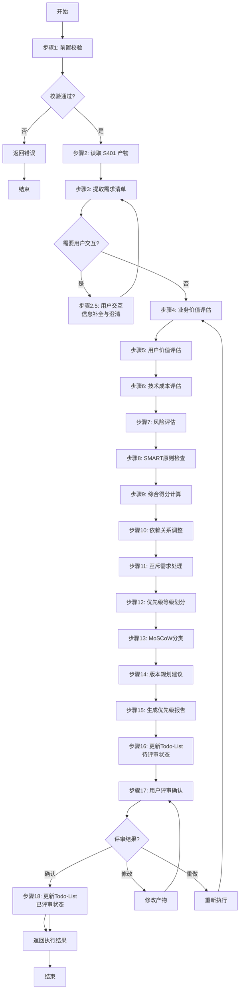
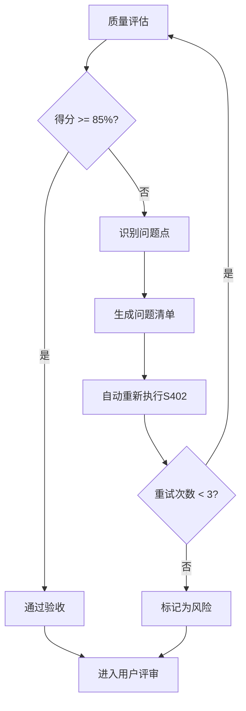

# S402: 需求优先级

## Section 1: 元信息 (Meta Information)

| 项目 | 内容 |
|------|------|
| **Skill 编号** | S402 |
| **Skill 名称** | 需求优先级 |
| **Skill 英文名称** | Requirements Prioritization |
| **所属阶段** | S4 - 需求整合与核心提炼阶段 |
| **执行顺序** | S4 阶段第 2 个执行 |
| **执行模式** | normal / lightweight 均执行 |
| **依赖 Skill** | S401 (需求分类梳理) |
| **后置 Skill** | S403 (核心需求提取) |
| **版本** | v3.2.0 |
| **最后更新时间** | 2026-03-28 |

---

## Section 2: 功能描述 (Functional Description)

### 2.1 核心职责

S402 负责基于多维度评估模型对需求进行优先级排序，确保资源投入的最优配置，包括：

1. **业务价值评估**：评估需求对业务目标的贡献度（权重 30%）
2. **用户价值评估**：评估需求对用户体验的提升程度（权重 30%）
3. **技术成本评估**：评估需求实现的技术难度和资源消耗（权重 25%，反向计分）
4. **风险评估**：评估需求实现过程中的风险因素（权重 15%，反向计分）
5. **SMART 原则加分**：对完全符合 SMART 原则的需求给予额外加分（+0.2）
6. **综合优先级计算**：基于多维度评分计算最终优先级得分
7. **依赖关系调整**：根据需求依赖关系调整优先级排序
8. **互斥需求处理**：识别并处理互斥需求，保留最优选项
9. **MoSCoW 分类**：将需求分类为 Must have / Should have / Could have / Won't have
10. **版本规划建议**：基于优先级划分 MVP、V1.0、V2.0、Future 阶段
11. **优先级报告生成**：输出完整的需求优先级排序报告（Markdown）

### 2.2 输入规范 (Input Specifications)

#### 标准化输入

| 输入来源 | 产物 ID | 用途 | 必需性 |
|---------|---------|------|--------|
| S401 产物 | `{PlanID}-S4-S401-001.md` | 需求分类梳理结果 | 必需 |
| S302 产物 | `{PlanID}-S3-S302-001.md` | 技术可行性评估报告 | 参考 |
| S301 产物 | `{PlanID}-S3-S301-001.md` | 需求风险识别报告 | 参考 |

#### 输入验证规则

- S401 产物必须存在且格式正确
- 需求分类报告必须包含完整的需求清单
- 每个需求必须有唯一的 ID、描述、分类信息
- 需求数量应在合理范围内（建议 10-50 项）

### 2.3 输出规范 (Output Specifications)

#### 标准化输出

| 产物名称 | 文件路径 | 格式 | 用途 |
|---------|---------|------|------|
| 需求优先级报告 | `artifacts/stages/s4/{PlanID}-S4-S402-001.md` | Markdown | 优先级排序结果 |
| Todo-List 更新 | `artifacts/plans/{PlanID}/todo-list.md` | Markdown | 任务状态更新 |

#### 优先级报告内容

- 执行摘要
- 优先级分布统计
- MoSCoW 分类结果
- 评估详情（各维度评分）
- 版本规划建议
- 用户交互记录
- 评审记录

---

## Section 3: 执行流程 (Execution Process)

### 3.1 流程概览



### 3.2 详细步骤与示例

详细步骤说明请参阅 [references/execution-details.md](references/execution-details.md)

Demo 示例请参阅 [references/examples.md](references/examples.md)

---

## Section 4: 产物规范 (Artifact Specifications)

S402 产物规范遵循 [artifact-specifications.md](../../templates/artifact-specifications.md) 中的通用定义。

### 4.1 S402 特定产物清单

| 产物名称 | 产物 ID | 存储路径 | 说明 |
|---------|---------|---------|------|
| 需求优先级报告 | `{PlanID}-S4-S402-001` | `artifacts/stages/s4/{PlanID}-S4-S402-001.md` | 主产物，包含优先级排序、MoSCoW 分类、版本规划 |

### 4.2 模板引用

**模板文件**：`skills/s4-priority/template.md`

---

## Section 5: 质量标准 (Quality Standards)

### 5.1 质量评估框架

S402 遵循 [quality-standard.md](../../templates/quality-standard.md) 中的 ISO/IEC 25010 质量评估框架。

**S402 特定权重分配**：
| 维度 | 权重 | 验收阈值 |
|------|------|----------|
| **完整性** | 30% | >= 90% |
| **准确性** | 25% | >= 90% |
| **一致性** | 20% | >= 95% |
| **可读性** | 15% | >= 85% |
| **可追溯性** | 10% | >= 90% |

**验收门槛**：质量综合得分 >= 85%

### 5.2 检查清单

**完整性检查**（30%）：
- [ ] 所有需求都已评估（100% 覆盖）
- [ ] 4 个评估维度评分完整（BV、UV、TC、RI）
- [ ] SMART 检查完成
- [ ] MoSCoW 分类完成
- [ ] 依赖关系调整完成
- [ ] 版本规划建议完整

**准确性检查**（25%）：
- [ ] 综合得分计算正确（权重公式）
- [ ] 优先级划分符合得分区间
- [ ] MoSCoW 分类与优先级对应正确
- [ ] 依赖关系调整逻辑正确

**一致性检查**（20%）：
- [ ] 优先级分布合理（P0<=20%, P0+P1<=50%）
- [ ] 术语使用一致（统一使用"P0/P1/P2/P3/P4"）
- [ ] 评分理由格式统一

**可读性检查**（15%）：
- [ ] 优先级表格清晰易读
- [ ] 评估详情说明充分
- [ ] 报告结构符合模板规范

**可追溯性检查**（10%）：
- [ ] 需求来源清晰（关联S401产物）
- [ ] 评分依据可追溯
- [ ] 版本规划与优先级对应关系明确

### 5.3 质量综合得分计算

```
得分 = Sigma(维度得分 x 维度权重)

示例：
- 完整性：95% x 30% = 28.5
- 准确性：90% x 25% = 22.5
- 一致性：100% x 20% = 20.0
- 可读性：90% x 15% = 13.5
- 可追溯性：95% x 10% = 9.5
- 总分：28.5 + 22.5 + 20.0 + 13.5 + 9.5 = 94.0%
```

### 5.4 验收标准

| 结果 | 标准 | 处理方式 |
|------|------|----------|
| **通过** | 质量综合得分 >= 85% | 进入用户评审阶段 |
| **不通过** | 质量综合得分 < 85% | 识别问题 -> 生成问题清单 -> 自动重新执行 |

### 5.5 不达标处理流程



**重试机制**：
- 第1次：自动重新执行，尝试修复问题
- 第2次：自动重新执行，调整参数
- 第3次：自动重新执行，简化复杂部分
- 仍不达标：标记为风险，进入用户评审并提示问题

---

## Section 6: 异常处理

### 常见异常场景

**前置校验失败**（如输入文件不存在）：
- 提示用户先执行前置 Skill
- 或请求补充必要信息

**执行过程异常**（如处理逻辑失败）：
- 自动重试（最多3次）
- 失败后标记风险继续执行

**后置校验失败**（如产物不完整）：
- 重新生成产物
- 或标记为风险进入用户评审

**用户评审未通过**：
- 根据意见修改产物
- 小修改直接编辑，大修改重新执行

### 本 Skill 特定场景

- 优先级冲突 → 使用业务价值优先
- 排序依据不足 → 标记风险

### 恢复策略

| 异常类型 | 处理策略 |
|----------|----------|
| 可重试异常 | 自动重试3次 |
| 数据缺失 | 请求用户补充 |
| 校验失败 | 重新执行或标记风险 |
| 用户拒绝 | 使用默认值继续 |

详细流程参见 [execution-flow-standard.md](../../templates/execution-flow-standard.md)

---

## 附录

### A. 评估维度权重说明

| 维度 | 权重 | 计分方式 | 说明 |
|------|------|----------|------|
| 业务价值 (BV) | 30% | 正向计分 | 越高越好 |
| 用户价值 (UV) | 30% | 正向计分 | 越高越好 |
| 技术成本 (TC) | 25% | 反向计分 | 越低越好（实现成本低） |
| 风险 (RI) | 15% | 反向计分 | 越低越好（风险小） |
| SMART 加分 | +0.0~0.2 | 额外加分 | 符合 SMART 原则的需求奖励 |

### B. 优先级等级与 MoSCoW 对应关系

| 优先级 | 得分区间 | MoSCoW | 说明 | 占比建议 |
|--------|----------|--------|------|----------|
| P0 | 4.5-5.0 | Must have | 必须实现 | <=20% |
| P1 | 3.5-4.4 | Should have | 应该实现 | 20-30% |
| P2 | 2.5-3.4 | Could have | 可以实现 | 30-40% |
| P3 | 1.5-2.4 | Won't have | 可选实现 | 20-30% |
| P4 | 1.0-1.4 | Won't have | 暂缓实现 | <=10% |

### C. 参考标准

- IEEE 29148-2011 - 需求和软件工程标准
- ISO/IEC 29110 - 软件工程生命周期
- MoSCoW 方法 - 需求优先级分类
- Kano 模型 - 用户需求分类
- SMART 原则 - 目标设定原则

---

*本 Skill 符合 IEEE 29148-2011 需求和软件工程标准，遵循 SMART 原则*
