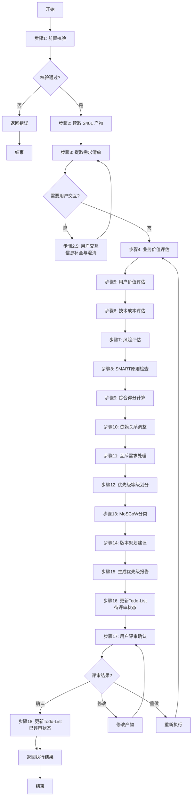
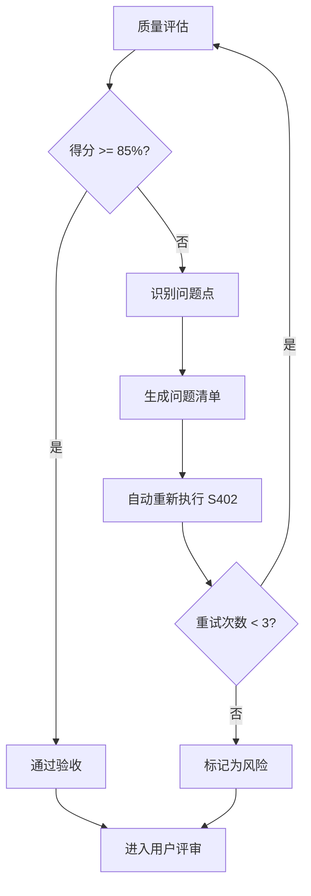
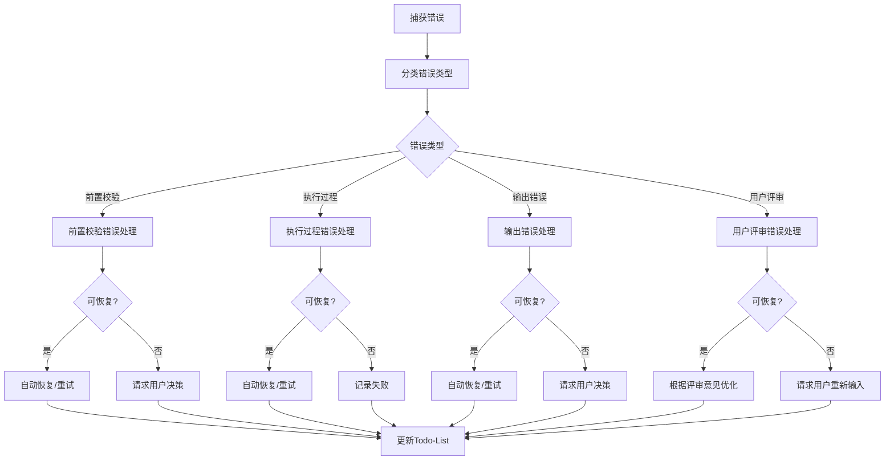

# S402: 需求优先级

## Section 1: 元信息 (Meta Information)

| 项目 | 内容 |
|------|------|
| **Skill 编号** | S402 |
| **Skill 名称** | 需求优先级 |
| **Skill 英文名称** | Requirements Prioritization |
| **所属阶段** | S4 - 需求整合与核心提炼阶段 |
| **执行顺序** | S4 阶段第 2 个执行 |
| **执行模式** | normal / lightweight 均执行 |
| **依赖 Skill** | S401 (需求分类梳理) |
| **后置 Skill** | S403 (核心需求提取) |
| **版本** | v3.0 |
| **最后更新时间** | 2026-03-27 |

---

## Section 2: 功能描述 (Functional Description)

### 2.1 核心职责

S402 负责基于多维度评估模型对需求进行优先级排序，确保资源投入的最优配置，包括：

1. **业务价值评估**：评估需求对业务目标的贡献度（权重 30%）
2. **用户价值评估**：评估需求对用户体验的提升程度（权重 30%）
3. **技术成本评估**：评估需求实现的技术难度和资源消耗（权重 25%，反向计分）
4. **风险评估**：评估需求实现过程中的风险因素（权重 15%，反向计分）
5. **SMART 原则加分**：对完全符合 SMART 原则的需求给予额外加分（+0.2）
6. **综合优先级计算**：基于多维度评分计算最终优先级得分
7. **依赖关系调整**：根据需求依赖关系调整优先级排序
8. **互斥需求处理**：识别并处理互斥需求，保留最优选项
9. **MoSCoW 分类**：将需求分类为 Must have / Should have / Could have / Won't have
10. **版本规划建议**：基于优先级划分 MVP、V1.0、V2.0、Future 阶段
11. **优先级报告生成**：输出完整的需求优先级排序报告（Markdown）

### 2.2 输入规范 (Input Specifications)

#### 标准化输入

| 输入来源 | 产物 ID | 用途 | 必需性 |
|---------|---------|------|--------|
| S401 产物 | `{PlanID}-S4-S401-001.md` | 需求分类梳理结果 | 必需 |
| S302 产物 | `{PlanID}-S3-S302-001.md` | 技术可行性评估报告 | 参考 |
| S301 产物 | `{PlanID}-S3-S301-001.md` | 需求风险识别报告 | 参考 |

#### 输入验证规则

- S401 产物必须存在且格式正确
- 需求分类报告必须包含完整的需求清单
- 每个需求必须有唯一的 ID、描述、分类信息
- 需求数量应在合理范围内（建议 10-50 项）

### 2.3 输出规范 (Output Specifications)

#### 标准化输出

| 产物名称 | 文件路径 | 格式 | 用途 |
|---------|---------|------|------|
| 需求优先级报告 | `database/stages/s4/{PlanID}-S4-S402-001.md` | Markdown | 优先级排序结果 |
| Todo-List 更新 | `database/plans/{PlanID}/todo-list.md` | Markdown | 任务状态更新 |

#### 优先级报告内容

- 执行摘要
- 优先级分布统计
- MoSCoW 分类结果
- 评估详情（各维度评分）
- 版本规划建议
- 用户交互记录
- 评审记录

---

## Section 3: 执行流程 (Execution Process)

### 3.1 流程概览



### 3.2 详细步骤说明

#### 步骤 1: 前置校验

**目标**：验证前置条件和产物完整性

**操作**：
1. 检查 S401 产物是否存在
2. 验证产物格式是否正确
3. 检查产物状态是否为 completed
4. 验证产物 ID 是否匹配

**验证规则**：
- S401 产物必须存在且格式正确
- 产物状态必须为 completed
- 产物 ID 必须与当前 PlanID 一致

**错误处理**：
- E001: S401 产物不存在 → 返回错误，要求先执行 S401
- E002: S401 产物格式错误 → 返回错误，要求重新生成分类产物
- E003: S401 产物状态异常 → 返回错误，要求检查产物状态
- E004: 产物 ID 不匹配 → 返回错误，检查 PlanID 配置

#### 步骤 2: 读取 S401 产物

**目标**：加载需求分类梳理结果

**操作**：
1. 读取 `{PlanID}-S4-S401-001.md`
2. 解析需求清单和分类信息
3. 提取需求依赖关系数据

**验证规则**：
- Markdown 文件必须可解析
- 必须包含完整的需求清单
- 每个需求必须有唯一 ID 和描述

**错误处理**：
- E101: 文件读取失败 → 重试 3 次，失败则中止
- E102: Markdown 解析失败 → 返回错误，要求检查文件格式
- E103: 需求清单为空 → 返回警告，确认是否确实无需求

#### 步骤 2.5: 用户交互（信息补全与澄清）

**触发场景**：
1. 检测到关键字段缺失或模糊（如需求描述不清晰、优先级标准模糊）
2. 需求信息完整度评分低于 60 分
3. 检测到矛盾或冲突信息（如优先级矛盾、依赖关系冲突）
4. 存在多个可行评估方案需要用户决策

**交互流程**：
1. 识别需要澄清的问题点
2. 生成标准化交互问题（使用问题模板）
3. 展示问题并等待用户输入
4. 解析用户输入并补充到产物中
5. 如仍不明确，进行多轮对话直到明确（最多 5 轮）

**错误处理**：
- W401: 用户交互超时 → 等待用户输入超时，继续执行
- E401: 用户输入无效 → 输入不符合格式要求，重新提问
- E402: 多轮交互超限 → 超过 5 轮仍未明确，使用默认值并标记待确认

#### 步骤 3: 提取需求清单

**目标**：从分类产物中提取所有待排序需求

**操作**：
1. 从 Markdown 报告中提取优先级需求列表
2. 提取每个需求的基本信息（ID、描述、分类、用户层）
3. 提取 SMART 检查结果
4. 提取依赖关系数据

**验证规则**：
- 需求数量应在合理范围内（10-50 项）
- 每个需求必须有唯一 ID
- 需求描述不能为空

**错误处理**：
- E104: 需求 ID 重复 → 标记冲突，使用第一个出现的 ID
- E105: 需求描述缺失 → 使用默认描述"未命名需求"

#### 步骤 4: 业务价值评估 (BV)

**目标**：评估每个需求的业务价值

**操作**：
1. 分析需求与产品愿景的契合度
2. 评估对核心业务流程的支持程度
3. 评估对收入/用户增长的影响
4. 评估竞争优势的建立程度
5. 给出 BV 评分（1-5 分）并记录评分理由

**评分标准**：

| 分值 | 等级 | 说明 | 判定标准 |
|------|------|------|---------|
| 5 | 极高 | 对业务目标有关键贡献 | 直接影响核心 KPI，是产品核心竞争力 |
| 4 | 高 | 对业务目标有显著贡献 | 支持主要业务流程，提升关键指标 |
| 3 | 中 | 对业务目标有一般贡献 | 支持辅助业务流程，改善用户体验 |
| 2 | 低 | 对业务目标贡献较小 | 边缘功能，对业务影响有限 |
| 1 | 极低 | 对业务目标几乎无贡献 | 可有可无的功能 |

**错误处理**：
- E201: 评分数据缺失 → 使用默认值 3 分继续评估
- E202: 评分理由缺失 → 补充默认理由"基于产品目标评估"

#### 步骤 5: 用户价值评估 (UV)

**目标**：评估每个需求的用户价值

**操作**：
1. 分析用户需求的紧迫程度
2. 评估影响的用户群体规模
3. 评估用户满意度提升程度
4. 评估用户流失风险降低程度
5. 给出 UV 评分（1-5 分）并记录评分理由

**评分标准**：

| 分值 | 等级 | 说明 | 判定标准 |
|------|------|------|---------|
| 5 | 极高 | 解决用户核心痛点 | 用户强烈需要，没有替代方案 |
| 4 | 高 | 显著提升用户体验 | 用户明确需要，有较好满意度 |
| 3 | 中 | 改善用户体验 | 用户有需求，但不是最紧迫 |
| 2 | 低 | 轻微改善体验 | 锦上添花的功能 |
| 1 | 极低 | 几乎无用户价值 | 用户感知不明显 |

**错误处理**：
- E203: 评分数据缺失 → 使用默认值 3 分继续评估
- E204: 评分理由缺失 → 补充默认理由"基于用户需求分析"

#### 步骤 6: 技术成本评估 (TC)

**目标**：评估每个需求的实现成本

**操作**：
1. 参考技术可行性评估结果（S302）
2. 估算开发工作量（人天）
3. 评估技术债务风险
4. 评估团队技能匹配度
5. 给出 TC 评分（1-5 分，反向计分）并记录评估依据

**评分标准**（反向计分）：

| 分值 | 等级 | 说明 | 判定标准 |
|------|------|------|---------|
| 5 | 极低 | 实现成本很低 | 简单功能，1-3 天可完成 |
| 4 | 低 | 实现成本较低 | 标准功能，1 周内可完成 |
| 3 | 中 | 实现成本中等 | 有一定复杂度，2-4 周 |
| 2 | 高 | 实现成本较高 | 复杂功能，1-2 个月 |
| 1 | 极高 | 实现成本极高 | 技术挑战大，2 个月以上 |

**错误处理**：
- E205: 评分数据缺失 → 使用默认值 3 分继续评估
- E206: 评估依据缺失 → 补充默认依据"标准功能开发"

#### 步骤 7: 风险评估 (RI)

**目标**：评估每个需求的实现风险

**操作**：
1. 参考需求风险清单（S301）
2. 评估需求变更可能性
3. 评估技术不确定性
4. 评估外部依赖风险
5. 给出 RI 评分（1-5 分，反向计分）并记录风险说明

**评分标准**（反向计分）：

| 分值 | 等级 | 说明 | 判定标准 |
|------|------|------|---------|
| 5 | 极低 | 几乎无风险 | 技术成熟，需求明确 |
| 4 | 低 | 风险较低 | 有轻微不确定性 |
| 3 | 中 | 风险中等 | 存在一定技术或需求风险 |
| 2 | 高 | 风险较高 | 技术挑战或需求变更可能 |
| 1 | 极高 | 风险极高 | 可能导致项目延期或失败 |

**错误处理**：
- E207: 评分数据缺失 → 使用默认值 3 分继续评估
- E208: 风险说明缺失 → 补充默认说明"标准风险水平"

#### 步骤 8: SMART 原则检查

**目标**：检查需求的 SMART 原则符合度

**操作**：
1. 检查 Specific（具体性）：需求描述是否明确
2. 检查 Measurable（可衡量）：是否有量化指标
3. 检查 Achievable（可实现）：技术是否可行
4. 检查 Relevant（相关性）：与业务目标是否相关
5. 检查 Time-bound（时限性）：是否明确所属阶段
6. 计算 SMART 加分（5 项全符合 +0.2，4 项符合 +0.1）

**验证规则**：
- 每项检查必须有明确结果（✅/❌）
- SMART 加分只能是 0.0、0.1、0.2
- 检查不通过项必须有优化建议

**错误处理**：
- E209: SMART 检查缺失 → 执行补充检查
- E210: 加分计算错误 → 重新计算并验证

#### 步骤 9: 综合得分计算

**目标**：计算每个需求的综合得分

**操作**：
1. 应用加权公式：
   ```
   基础得分 = (BV × 0.30 + UV × 0.30 + TC × 0.25 + RI × 0.15)
   ```
2. 添加 SMART 加分：
   ```
   综合得分 = 基础得分 + SMART 加分
   ```
3. 限制最高分为 5.0：
   ```
   最终得分 = min(综合得分, 5.0)
   ```
4. 保留 2 位小数

**验证规则**：
- 综合得分必须在 1.0-5.0 范围内
- 必须保留 2 位小数
- 计算过程必须可追溯

**错误处理**：
- E211: 计算结果异常 → 重新计算，检查权重配置
- E212: 得分超出范围 → 限制在 1.0-5.0 范围内

#### 步骤 10: 依赖关系调整

**目标**：根据需求依赖关系调整优先级

**操作**：
1. 读取需求依赖关系数据
2. 应用强依赖调整规则：
   - 如果被依赖需求优先级为 PX，则依赖需求最高为 PX+1
3. 应用包含关系处理规则：
   - 父需求优先级应不低于子需求优先级
4. 记录调整原因

**验证规则**：
- 调整后的优先级不能违反依赖规则
- 必须有调整原因说明
- 循环依赖必须检测并处理

**错误处理**：
- E213: 依赖关系冲突 → 标记冲突，使用默认调整规则
- E214: 循环依赖 → 检测循环，打破循环并记录

#### 步骤 11: 互斥需求处理

**目标**：处理互斥需求，保留最优选项

**操作**：
1. 识别互斥需求组
2. 比较互斥需求的综合得分
3. 保留得分最高的需求
4. 其他需求标记为 P4 或删除
5. 记录处理原因

**验证规则**：
- 互斥需求组只能保留一个需求
- 必须保留得分最高的需求
- 必须有处理原因说明

**错误处理**：
- E215: 互斥需求得分相同 → 基于 BV 评分决策，BV 高者优先
- E216: 互斥关系不明确 → 标记为待确认，请求用户决策

#### 步骤 12: 优先级等级划分

**目标**：根据综合得分划分优先级等级

**操作**：
1. 应用优先级划分标准：
   - 4.5-5.0 → P0
   - 3.5-4.4 → P1
   - 2.5-3.4 → P2
   - 1.5-2.4 → P3
   - 1.0-1.4 → P4
2. 检查优先级分布合理性
3. 对异常情况给出警告

**验证规则**：
- P0 级需求占比 ≤ 20%
- P0+P1 级需求占比 ≤ 50%
- P4 级需求占比 ≤ 10%

**错误处理**：
- E217: 优先级分布异常 → 检查评分逻辑，确保合理性
- E218: P0 级需求过多 → 给出警告，建议重新评估

#### 步骤 13: MoSCoW 分类

**目标**：将需求按 MoSCoW 方法分类

**操作**：
1. Must have（必须有）：对应 P0 级需求
   - 产品成功的必要条件
   - 没有这些功能，产品无法发布
2. Should have（应该有）：对应 P1 级需求
   - 重要但非关键功能
   - 可以暂时省略，但应尽快实现
3. Could have（可以有）：对应 P2 级需求
   - 锦上添花的功能
   - 资源允许时实现
4. Won't have（暂不会有）：对应 P3/P4 级需求
   - 当前版本不实现
   - 未来版本考虑

**验证规则**：
- 每个需求必须有明确的 MoSCoW 分类
- Must have 占比不超过 20%
- 分类理由必须清晰

#### 步骤 14: 版本规划建议

**目标**：基于优先级划分版本阶段

**操作**：
1. MVP 阶段：包含所有 P0 级需求
2. V1.0 阶段：包含所有 P1 级需求
3. V2.0 阶段：包含 P2 级需求的核心部分
4. Future 阶段：包含 P3 和 P4 级需求
5. 估算各阶段工作量（人天）

**验证规则**：
- MVP 阶段需求数量 ≤ 5 项
- 各阶段需求不能有遗漏
- 工作量估算必须有依据

**错误处理**：
- E219: MVP 需求过多 → 建议精简至 3-5 项
- E220: 工作量估算缺失 → 基于经验公式估算

#### 步骤 15: 生成优先级报告

**目标**：生成需求优先级排序报告（Markdown）

**操作**：
1. 使用 [template.md](template.md) 模板
2. 填充所有必需章节
3. 生成优先级分布表格
4. 添加评估详情和版本规划
5. 保存为 `{PlanID}-S4-S402-001.md`

**验证规则**：
- 报告必须包含所有必需章节
- 数据必须与评估结果一致
- 格式必须清晰易读

**错误处理**：
- E201: 报告生成失败 → 检查模板文件
- E202: 报告内容不完整 → 补充缺失章节
- E203: 文件写入失败 → 重试 3 次，失败则中止

#### 步骤 16: 更新 Todo-List（待评审）

**目标**：更新 Todo-List 任务状态为"已完成"，评审状态为"待评审"

**操作**：
1. 读取 `database/plans/{PlanID}/todo-list.md`
2. 更新 S402 任务状态为"已完成"
3. 填写输出文档路径
4. 记录完成时间
5. 评审状态设置为"待评审"
6. 更新进度概览

**错误处理**：
- E304: Todo-List 结构错误 → Todo-List 文件格式不符合规范

#### 步骤 17: 用户评审确认

**目标**：触发用户评审流程，等待用户确认

**用户决策处理**：
1. **确认**：
   - 更新 Todo-List：任务状态 → 已评审，评审状态 → approved
   - 填写评审记录表格
   - 继续执行下一个 Skill（S403）

2. **修改 - 小修改**：
   - 直接修改产物内容
   - 重新展示评审
   - 更新 Todo-List：评审状态 → rejected → modifying

3. **修改 - 大修改**：
   - 返回步骤 4 重新执行
   - 更新 Todo-List：任务状态 → 执行中，评审状态 → pending
   - 填写变更记录表格

4. **新增想法**：
   - 更新产物内容
   - 重新展示评审
   - 更新 Todo-List：任务状态 → 执行中，评审状态 → pending

**评审超时处理**：
- 超时时间：24 小时
- 超时处理：状态设为 paused，支持恢复
- 恢复方式：用户输入「继续」后从断点继续

**错误处理**：
- E305: 用户评审未通过 → 用户提出修改意见
- W301: 用户评审超时 → 24 小时未响应，状态设为 paused
- E306: 评审意见解析失败 → 无法识别用户输入

#### 步骤 18: 更新 Todo-List（已评审）

**目标**：更新 Todo-List 任务状态为"已评审"，记录评审结果

**操作**：
1. 读取 `database/plans/{PlanID}/todo-list.md`
2. 更新 S402 任务状态为"已评审"
3. 评审状态设置为"approved"
4. 填写评审记录表格
5. 更新进度概览

#### 步骤 19: 返回执行结果

**目标**：向 Coordinator Agent 返回执行结果

**操作**：
1. 构建标准化的返回结果
2. 包含产物信息和优先级统计
3. 推荐下一步执行的 Skill
4. 返回成功/失败状态

### 3.3 Demo 示例

#### Demo 1: 标准优先级评估

**输入示例**：
```
需求清单（来自 S401）：
- REQ-001: 用户注册登录功能（功能类-核心）
- REQ-002: 个人资料管理（功能类-基础）
- REQ-003: 数据导出功能（功能类-增强）
- REQ-004: 深色模式支持（体验类-增值）
- REQ-005: AI 智能推荐（功能类-创新）
```

**处理过程**：
1. 前置校验 → 通过
2. 读取 S401 产物 → 成功
3. 提取需求清单 → 5 项需求
4. 业务价值评估 → REQ-001:5, REQ-005:5, REQ-002:4, REQ-003:3, REQ-004:2
5. 用户价值评估 → REQ-001:5, REQ-002:4, REQ-005:4, REQ-003:3, REQ-004:3
6. 技术成本评估 → REQ-001:4, REQ-002:4, REQ-003:5, REQ-004:5, REQ-005:2
7. 风险评估 → REQ-001:4, REQ-002:4, REQ-003:5, REQ-004:5, REQ-005:3
8. SMART 检查 → REQ-001:+0.2, REQ-002:+0.2, REQ-003:+0.1, REQ-004:+0.2, REQ-005:+0.1
9. 综合得分计算 → REQ-001:4.75, REQ-002:4.20, REQ-005:3.85, REQ-003:3.55, REQ-004:3.25
10. 优先级划分 → REQ-001:P0, REQ-002:P1, REQ-005:P1, REQ-003:P2, REQ-004:P2
11. MoSCoW 分类 → REQ-001:Must, REQ-002/005:Should, REQ-003/004:Could
12. 版本规划 → MVP:REQ-001, V1.0:REQ-002/005, V2.0:REQ-003/004

**输出示例**：
- 产物 ID: P000001-S4-S402-001
- 优先级分布: P0(1), P1(2), P2(2), P3(0), P4(0)
- MoSCoW: Must(1), Should(2), Could(2), Won't(0)
- 产物路径: database/stages/s4/P000001-S4-S402-001.md

---

## Section 4: 产物规范 (Artifact Specifications)

### 4.1 产物 ID 命名规则

**标准格式**：`{PlanID}-S4-S402-{序号}`

**示例**：
- `P000001-S4-S402-001` - 需求优先级报告（主产物）

**说明**：
- PlanID：6 位数字，如 P000001
- 阶段：S4
- SkillID：S402
- 序号：3 位数字，从 001 开始

### 4.2 存储路径结构

```
database/
└── stages/
    └── s4/
        └── {PlanID}-S4-S402-001.md    # 需求优先级报告
```

**路径规则**：
- 优先级报告：`database/stages/s4/{PlanID}-S4-S402-001.md`
- Todo-List: `database/plans/{PlanID}/todo-list.md`

### 4.3 产物版本管理

**版本规则**：
- 初始版本：v1.0（首次生成）
- 小修改：v1.1, v1.2...（内容微调）
- 大修改：v2.0, v3.0...（结构变更或重新执行）

**版本记录**：
在产物文件头部添加版本信息：
```markdown
---
version: v1.0
created_at: 2026-03-27 10:00:00
updated_at: 2026-03-27 10:00:00
---
```

**历史版本保存**：
- 大版本变更时，保留旧版本副本
- 命名格式：`{PlanID}-S4-S402-001-v1.md`

---

## Section 5: 质量标准 (Quality Standards)

### 5.1 质量评估框架

S402 遵循 ISO/IEC 25010 质量评估框架：

| 维度 | 权重 | 评估标准 | 验收阈值 |
|------|------|----------|----------|
| **完整性** | 30% | 所有必需内容都已生成 | ≥ 90% |
| **准确性** | 25% | 内容准确，无错误 | ≥ 90% |
| **一致性** | 20% | 格式统一，术语一致 | ≥ 95% |
| **可读性** | 15% | 结构清晰，表达准确 | ≥ 85% |
| **可追溯性** | 10% | 来源清晰，关系明确 | ≥ 90% |

**质量综合得分** = 完整性×30% + 准确性×25% + 一致性×20% + 可读性×15% + 可追溯性×10%

**验收门槛**：质量综合得分 ≥ 85%

### 5.2 检查清单

#### 完整性检查（30%）

- [ ] 所有需求都已评估（100% 覆盖）
- [ ] 4 个评估维度评分完整（BV、UV、TC、RI）
- [ ] SMART 检查完成
- [ ] MoSCoW 分类完成
- [ ] 依赖关系调整完成
- [ ] 互斥需求处理完成
- [ ] 优先级等级划分完成
- [ ] 版本规划建议完整
- [ ] 产物文件完整（Markdown）
- [ ] Todo-List 已更新

**完整性得分** = 完成项数 / 10 × 100%

#### 准确性检查（25%）

- [ ] BV 评分与业务目标一致
- [ ] UV 评分与用户需求匹配
- [ ] TC 评分参考技术可行性评估
- [ ] RI 评分参考风险识别结果
- [ ] 综合得分计算正确
- [ ] 优先级划分符合得分区间
- [ ] MoSCoW 分类正确
- [ ] 依赖关系调整正确

**准确性得分** = 完成项数 / 8 × 100%

#### 一致性检查（20%）

- [ ] 评估标准统一应用
- [ ] 优先级分布合理（P0≤20%, P0+P1≤50%）
- [ ] 评分理由格式统一
- [ ] 术语使用一致（统一使用"P0/P1/P2/P3/P4"）
- [ ] 无矛盾评分

**一致性得分** = 完成项数 / 5 × 100%

#### 可读性检查（15%）

- [ ] 报告结构清晰
- [ ] 章节标题明确
- [ ] 表格格式规范
- [ ] 数据可视化良好（优先级分布图）
- [ ] 语言表达准确

**可读性得分** = 完成项数 / 5 × 100%

#### 可追溯性检查（10%）

- [ ] 每个需求评分理由清晰
- [ ] 依赖关系可追溯
- [ ] 调整原因记录完整
- [ ] 版本规划依据明确
- [ ] 与 S401 产物的追溯关系清晰

**可追溯性得分** = 完成项数 / 5 × 100%

### 5.3 质量综合得分计算

```
得分 = Σ(维度得分 × 维度权重)

示例：
- 完整性：95% × 30% = 28.5
- 准确性：90% × 25% = 22.5
- 一致性：100% × 20% = 20.0
- 可读性：90% × 15% = 13.5
- 可追溯性：95% × 10% = 9.5
- 总分：28.5 + 22.5 + 20.0 + 13.5 + 9.5 = 94.0%
```

### 5.4 验收标准

| 结果 | 标准 | 处理方式 |
|------|------|----------|
| **通过** | 质量综合得分 ≥ 85% | 进入用户评审阶段 |
| **不通过** | 质量综合得分 < 85% | 识别问题 → 生成问题清单 → 自动重新执行 |

**质量等级**：
- 优秀：≥ 95%
- 良好：85-94%
- 合格：75-84%
- 不合格：< 75%

### 5.5 不达标处理流程



**重试机制**：
- 第1次：自动重新执行，尝试修复问题
- 第2次：自动重新执行，调整参数
- 第3次：自动重新执行，简化复杂部分
- 仍不达标：标记为风险，进入用户评审并提示问题

---

## Section 6: 错误处理 (Error Handling)

### 6.1 错误分类与代码表

#### 前置校验错误（E001-E099）

| 错误码 | 错误类型 | 说明 | 处理策略 |
|--------|----------|------|----------|
| E001 | S401 产物不存在 | 前置产物缺失 | 返回错误，要求先执行 S401 |
| E002 | S401 产物格式错误 | 产物格式不符合规范 | 返回错误，要求重新生成 |
| E003 | S401 产物状态异常 | 产物状态不是 completed | 返回错误，要求检查状态 |
| E004 | 产物 ID 不匹配 | PlanID 不一致 | 返回错误，检查配置 |

#### 执行过程错误（E100-E199）

| 错误码 | 错误类型 | 说明 | 处理策略 |
|--------|----------|------|----------|
| E101 | 文件读取失败 | 无法读取产物文件 | 重试 3 次，失败则中止 |
| E102 | Markdown 解析失败 | Markdown 格式错误 | 返回错误，要求检查文件 |
| E103 | 需求清单为空 | 没有需求可排序 | 返回警告，确认是否确实无需求 |
| E104 | 需求 ID 重复 | 需求 ID 不唯一 | 标记冲突，使用第一个 ID |
| E105 | 需求描述缺失 | 需求描述为空 | 使用默认描述 |
| E201-E210 | 评估数据缺失 | 各维度评分缺失 | 使用默认值 3 分继续评估 |
| E211-E220 | 计算/调整错误 | 计算或调整异常 | 重新计算或使用默认规则 |

#### 后置校验错误（E200-E299）

| 错误码 | 错误类型 | 说明 | 处理策略 |
|--------|----------|------|----------|
| E201 | 报告生成失败 | Markdown 报告生成失败 | 检查模板文件 |
| E202 | 报告内容不完整 | 报告缺少必需章节 | 补充缺失章节 |
| E203 | 文件写入失败 | 无法写入文件 | 重试 3 次，失败则中止 |
| E204 | Todo-List 更新失败 | 无法更新任务状态 | 重试 3 次 |

#### 用户评审错误（E300-E399）

| 错误码 | 错误类型 | 说明 | 处理策略 |
|--------|----------|------|----------|
| E301 | 用户评审未通过 | 用户提出修改意见 | 根据意见修改 |
| E302 | 评审意见解析失败 | 无法识别用户输入 | 重新请求输入，最多 3 次 |
| E303 | 评审超时 | 用户 24 小时未响应 | 保持 paused 状态，等待用户输入 |

#### 系统错误（E900-E999）

| 错误码 | 错误类型 | 说明 | 处理策略 |
|--------|----------|------|----------|
| E901 | 磁盘读取错误 | 磁盘 IO 异常 | 重试 3 次，失败则中止 |
| E902 | 目录创建失败 | 无法创建输出目录 | 检查权限，重试 3 次 |
| E903 | 文件锁定冲突 | 文件被其他进程占用 | 等待 5 秒后重试 |
| E904 | 编码错误 | 文件编码不兼容 | 使用 UTF-8 重新编码 |

### 6.2 错误处理流程图



### 6.3 用户交互协议

S402 使用标准化的用户交互模板：

- **需求澄清**：使用 [clarification-template.md](../../templates/user-interaction/clarification-template.md)
- **信息收集**：使用 [information-collection-template.md](../../templates/user-interaction/information-collection-template.md)
- **方案选择**：使用 [option-selection-template.md](../../templates/user-interaction/option-selection-template.md)

**交互触发场景**：
1. 需求描述模糊（如"类似XX"、"大概"等词汇）
2. 关键字段缺失（优先级标准、业务价值等）
3. 检测到矛盾信息（优先级冲突、依赖冲突）
4. 信息完整度评分低于 60 分

**交互记录保存**：
所有交互记录保存到优先级报告的"用户交互记录"章节，包含：
- 交互轮次
- 交互时间
- 交互类型
- 问题描述
- 用户输入
- 解析结果
- 处理状态

### 6.4 错误恢复策略

| 错误类型 | 恢复策略 | 重试次数 | 失败处理 |
|----------|----------|----------|----------|
| 前置校验错误 | 请求用户补充信息 | 最多3轮 | 使用默认值或标记风险 |
| 文件读取失败 | 检查权限后重试 | 最多3次 | 记录错误，提示用户 |
| 评估数据缺失 | 使用默认值继续 | - | 标记为待确认 |
| 产物格式错误 | 重新生成产物 | 最多3次 | 标记为风险 |
| 评审未通过 | 根据意见修改 | 最多3轮 | 标记为风险 |
| 用户交互超时 | 使用默认值继续 | - | 标记信息缺失 |

---

## 附录

### A. 评估维度权重说明

| 维度 | 权重 | 计分方式 | 说明 |
|------|------|----------|------|
| 业务价值 (BV) | 30% | 正向计分 | 越高越好 |
| 用户价值 (UV) | 30% | 正向计分 | 越高越好 |
| 技术成本 (TC) | 25% | 反向计分 | 越低越好（实现成本低） |
| 风险 (RI) | 15% | 反向计分 | 越低越好（风险小） |
| SMART 加分 | +0.0~0.2 | 额外加分 | 符合 SMART 原则的需求奖励 |

### B. 优先级等级与 MoSCoW 对应关系

| 优先级 | 得分区间 | MoSCoW | 说明 | 占比建议 |
|--------|----------|--------|------|----------|
| P0 | 4.5-5.0 | Must have | 必须实现 | ≤20% |
| P1 | 3.5-4.4 | Should have | 应该实现 | 20-30% |
| P2 | 2.5-3.4 | Could have | 可以实现 | 30-40% |
| P3 | 1.5-2.4 | Won't have | 可选实现 | 20-30% |
| P4 | 1.0-1.4 | Won't have | 暂缓实现 | ≤10% |

### C. 参考标准

- IEEE 29148-2011 - 需求和软件工程标准
- ISO/IEC 29110 - 软件工程生命周期
- MoSCoW 方法 - 需求优先级分类
- Kano 模型 - 用户需求分类
- SMART 原则 - 目标设定原则

---

*本 Skill 符合 IEEE 29148-2011 需求和软件工程标准，遵循 SMART 原则*
