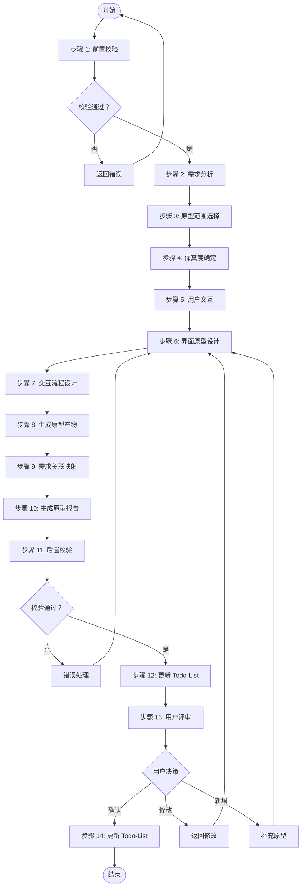
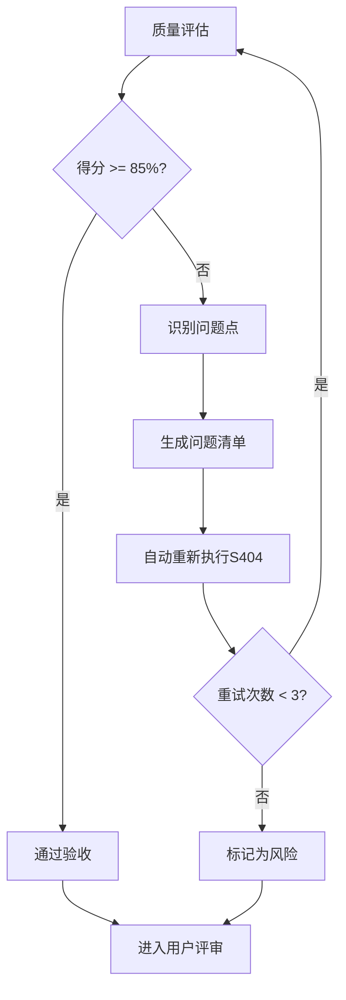
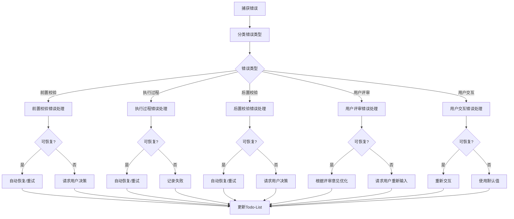

# S404: 原型设计

## Section 1: 元信息 (Meta Information)

| 项目             | 内容                       |
| -------------- | -------------------------- |
| **Skill 编号**   | S404                       |
| **Skill 名称**   | 原型设计                   |
| **Skill 英文名称** | Prototype Design           |
| **所属阶段**       | S4 - 需求整合与核心提炼阶段  |
| **执行顺序**       | S4 阶段第 4 个执行（最后一个） |
| **执行模式**       | 仅 normal 模式执行（lightweight 跳过） |
| **依赖 Skill**   | S403 (核心需求提取)          |
| **后置 Skill**   | 无（S4 阶段最后一个 Skill）   |
| **版本**          | v3.0                       |
| **最后更新时间**    | 2026-03-27                 |

***

## Section 2: 功能描述 (Functional Description)

### 2.1 核心职责

S404 负责为核心功能创建可视化原型，通过快速原型设计帮助用户和开发团队更直观地理解需求，发现需求问题。具体包括：

1. **原型范围选择**：根据需求优先级和复杂度，选择需要原型设计的核心功能
2. **保真度确定**：根据项目需求和时间约束，确定原型保真度等级（低保真/中保真/高保真）
3. **界面原型设计**：为核心功能创建界面线框图，展示页面布局、元素结构和视觉层次
4. **交互流程设计**：设计用户操作流程，定义页面跳转关系和交互逻辑
5. **原型评审组织**：组织用户评审原型，收集反馈意见
6. **需求关联映射**：将原型与需求文档关联，建立追溯关系
7. **需求优化建议**：基于原型评审发现的问题，提出需求优化建议
8. **原型报告生成**：输出完整的原型设计报告（Markdown）

### 2.2 输入规范 (Input Specifications)

#### 用户需要提供什么

**核心输入**：S403 核心需求提取产物

| 内容     | 要求           | 示例                     |
| ------ | ------------ | ---------------------- |
| Plan ID | 必需，格式 P+6位数字 | P000001 |
| 核心需求报告 | 必需，S403产物 | P000001-S4-S403-001.md |
| 需求分类报告 | 可选，S401产物参考 | P000001-S4-S401-001.md |
| 优先级排序报告 | 可选，S402产物参考 | P000001-S4-S402-001.md |

**输入数据**：

| 数据项 | 说明 | 示例值 |
|--------|------|--------|
| Plan ID | 当前计划的唯一标识 | P000001 |
| Plan 定义文件 | Plan 定义文档路径 | database/plans/P000001.md |
| 核心需求产物 ID | S403 产物标识 | P000001-S4-S403-001 |
| 核心需求报告路径 | S403 产物文件路径 | database/stages/s4/P000001-S4-S403-001.md |
| P0 级需求清单 | 高优先级需求列表 | 从核心需求报告中提取 |
| 用户群体信息 | 目标用户画像 | 从需求文档中提取 |

#### 输入示例

**示例 1：完整输入**

```
Plan ID: P000001
核心需求报告: database/stages/s4/P000001-S4-S403-001.md
P0 级需求:
1. 用户注册登录功能
2. 任务创建与管理
3. 数据统计分析
4. 个人中心设置

目标用户：18-25 岁大学生
使用场景：校园学习管理
```

**示例 2：简略输入**

```
Plan ID: P000002
核心需求报告: database/stages/s4/P000002-S4-S403-001.md
```

### 2.3 输出规范 (Output Specifications)

#### 用户会得到什么

S404 完成后，系统会生成以下产物并保存到项目目录：

**产物清单**：

| 产物名称      | 文件位置                                              | 格式       | 用途                 | 用户可见性   |
| --------- | ------------------------------------------------- | -------- | ------------------ | ------- |
| 原型设计报告 | `database/stages/s4/{PlanID}-S4-S404-001.md`      | Markdown | 完整的原型设计文档 | 是 |
| 线框图描述 | 内嵌于原型设计报告中 | Markdown/文本 | 页面布局描述 | 是 |
| 交互流程图 | 内嵌于原型设计报告中 | Mermaid | 页面跳转关系 | 是 |
| Todo-List 更新 | `database/plans/{PlanID}/todo-list.md` | Markdown | 任务状态更新 | 是 |

**重要说明**：

- 所有输出产物均为 Markdown 格式，便于阅读和版本管理
- 线框图使用文本描述格式（ASCII/Markdown 表格），非图片格式
- 交互流程图使用 Mermaid 语法绘制

**用户可访问的核心产物**：

1. **原型设计报告**（Markdown 格式）
   - 原型设计概览
   - 设计决策说明
   - 界面原型详情（每个页面一个章节）
   - 交互流程说明
   - 需求关联矩阵
   - 需求优化建议
   - 用户交互记录
   - 评审记录

2. **线框图描述**（文本格式）
   - 页面布局结构
   - 元素位置和说明
   - 交互行为描述

3. **交互流程图**（Mermaid 格式）
   - 页面节点关系
   - 跳转条件说明
   - 操作流程展示

#### 输出示例

**原型设计报告示例结构**：

```markdown
# 原型设计报告 - P000001-S4-S404-001

## 原型设计概览
- **Plan ID**: P000001
- **保真度等级**: 中保真
- **原型页面数**: 6
- **交互流程数**: 3
- **关联需求数**: 8

## 设计决策说明
- 原型范围：P0 级核心功能
- 保真度选择依据：需求评审用途，时间适中
- 目标用户：18-25 岁大学生

## 界面原型详情

### 页面 1: 首页
[线框图描述...]

### 页面 2: 登录页
[线框图描述...]

## 交互流程说明

### 流程 1: 用户注册流程
[Mermaid 流程图...]

## 需求关联矩阵
| 页面 | 关联需求 ID | 需求描述 |
|------|------------|---------|
| 首页 | R001 | 展示任务列表 |

## 需求优化建议
- 建议 1: [基于原型发现的问题]
```

***

## Section 3: 执行流程 (Execution Process)

### 3.1 流程概览



### 3.2 详细步骤说明

#### 步骤 1：前置校验

**目标**：验证前置产物是否完整且格式正确

**操作**：
1. 检查 Plan 定义文件是否存在
2. 检查 S403 核心需求提取报告是否存在
3. 检查 S401 需求分类梳理报告是否存在（可选）
4. 检查 S402 需求优先级排序报告是否存在（可选）
5. 验证文件格式是否符合要求

**验证规则**：
- 前置产物必须存在且可读
- 产物 ID 格式必须正确
- 文件内容非空

**错误处理**：
- E001: 前置产物缺失 → 返回错误，要求先完成前置 Skill
- E002: 输入文件格式错误 → 返回错误，要求重新生成前置产物
- E003: 产物 ID 不匹配 → 返回错误，要求检查产物一致性

#### 步骤 2：需求分析

**目标**：从核心需求报告中提取需要原型设计的需求

**操作**：
1. 读取核心需求提炼报告
2. 提取 P0 级核心功能需求
3. 提取 P1 级重要功能需求（可选）
4. 分析用户群体和使用场景
5. 识别关键交互流程

**验证规则**：
- 需求提取完整率 ≥ 95%
- 需求描述准确无误

**错误处理**：
- E101: 核心需求报告读取失败 → 重试读取或返回错误
- E102: 需求提取不完整 → 补充识别遗漏的需求

#### 步骤 3：原型范围选择

**目标**：确定需要原型设计的功能范围

**操作**：
1. 识别所有 P0 级核心功能
2. 根据时间约束选择原型页面数量：
   - 时间充裕（>2 小时）：8-12 个页面
   - 时间适中（1-2 小时）：5-8 个页面
   - 时间紧张（<1 小时）：3-5 个页面
3. 优先选择用户高频使用场景
4. 识别关键交互流程（3-5 个）

**验证规则**：
- 至少覆盖所有 P0 级核心功能
- 页面数量在合理范围内

**错误处理**：
- E103: 范围选择不明确 → 请求用户确认原型范围

#### 步骤 4：保真度确定

**目标**：根据项目需求确定原型保真度等级

**操作**：
1. 评估项目需求：
   - 需求复杂度评分 > 80 分 → 推荐高保真
   - 核心功能数量 ≥ 5 个 → 推荐中保真
   - 时间紧迫 → 推荐低保真
2. 考虑用户群体：
   - 非技术用户为主 → 推荐中/高保真
   - 技术用户为主 → 低保真可接受
3. 确定最终保真度等级

**保真度等级定义**：

| 保真度 | 说明 | 制作时间 | 适用场景 |
|--------|------|---------|---------|
| **低保真** | 手绘草图或简单线框图 | 10-30 分钟/页面 | 早期概念验证、快速探索 |
| **中保真** | 数字化线框图，含基本布局 | 30-60 分钟/页面 | 需求评审、内部沟通 |
| **高保真** | 接近最终 UI 效果，含交互 | 2-4 小时/页面 | 用户测试、最终确认 |

**验证规则**：
- 保真度选择有明确依据
- 与时间约束匹配

**错误处理**：
- E104: 保真度选择不当 → 重新评估并选择

#### 步骤 5：用户交互

**目标**：在原型设计前，确认关键设计决策

**触发场景**：
- 原型范围不明确
- 保真度偏好不清晰
- 关键功能优先级有争议
- 目标用户群体多样

**交互流程**：
1. 识别需要用户确认的设计决策
2. 生成澄清问题（使用标准化问题模板）
3. 等待用户输入
4. 解析用户输入，补充到设计需求
5. 如仍不清晰，进行多轮对话（最多 3 轮）

**问题模板示例**：

**场景 1：原型范围确认**
```
【原型设计 - 范围确认】

根据需求分析，建议为以下功能创建原型：

核心功能（P0）：
1. {功能1名称}
2. {功能2名称}
3. {功能3名称}

可选功能（P1）：
4. {功能4名称}
5. {功能5名称}

请选择：
A. 仅核心功能（推荐，时间约 X 分钟）
B. 核心功能 + 部分可选功能（时间约 Y 分钟）
C. 全部功能（时间约 Z 分钟）
D. 自定义（请说明）

您的选择：
```

**场景 2：保真度偏好调研**
```
【原型设计 - 保真度选择】

请选择原型设计的精细程度：

A. 低保真（手绘风格）
   - 快速创建，成本低
   - 适合早期概念验证
   - 时间：约 X 分钟

B. 中保真（线框图风格）
   - 结构清晰，易于理解
   - 适合需求评审
   - 时间：约 Y 分钟

C. 高保真（接近真实 UI）
   - 视觉效果佳，体验真实
   - 适合用户测试
   - 时间：约 Z 分钟

您的选择：
```

**交互记录保存**：
所有交互记录保存到原型设计报告的"用户交互记录"章节，包含：
- 交互轮次
- 交互时间
- 交互类型
- 问题描述
- 用户输入
- 解析结果
- 处理状态

#### 步骤 6：界面原型设计

**目标**：为核心功能创建界面线框图

**操作**：
1. 为每个选定的功能设计页面布局：
   - 页面标题和导航
   - 核心功能区域
   - 信息展示区域
   - 操作按钮区域
2. 定义页面元素：
   - 输入框、按钮、选择器等交互元素
   - 列表、卡片、表格等展示元素
   - 图标、图片等视觉元素
3. 标注元素说明：
   - 元素名称
   - 元素类型
   - 交互说明

**验证规则**：
- 每个页面都有清晰的布局
- 核心功能突出显示
- 元素标注完整

**错误处理**：
- E105: 页面设计不完整 → 补充缺失内容
- E106: 布局不合理 → 重新设计布局

#### 步骤 7：交互流程设计

**目标**：设计用户操作流程和页面跳转关系

**操作**：
1. 识别主要用户场景：
   - 新用户首次使用流程
   - 核心功能使用流程
   - 异常处理流程
2. 定义页面跳转关系：
   - 正常流程跳转
   - 分支流程跳转
   - 返回和退出逻辑
3. 标注交互细节：
   - 触发条件
   - 过渡效果
   - 状态变化

**验证规则**：
- 流程覆盖主要用户场景
- 跳转逻辑清晰合理
- 无死循环或断点

**错误处理**：
- E107: 流程覆盖不完整 → 补充缺失流程
- E108: 跳转逻辑混乱 → 重新梳理流程

#### 步骤 8：生成原型产物

**目标**：生成原型线框图和交互流程图

**操作**：
1. 生成页面线框图（文本描述格式）：
   - 使用 ASCII 或 Markdown 表格描述页面布局
   - 标注元素位置和尺寸
   - 说明元素交互行为
2. 生成交互流程图（文本描述格式）：
   - 使用 Mermaid 语法绘制流程图
   - 标注页面节点和跳转关系
   - 说明触发条件和操作

**产物格式**：
- 线框图：Markdown 格式，包含页面结构和元素说明
- 流程图：Mermaid 格式，展示页面跳转关系

**验证规则**：
- 产物格式规范
- 内容完整准确

**错误处理**：
- E109: 产物生成失败 → 检查格式并重新生成

#### 步骤 9：需求关联映射

**目标**：建立原型与需求的追溯关系

**操作**：
1. 为每个原型页面关联对应的需求：
   - 页面功能对应的需求 ID
   - 页面元素对应的需求描述
2. 为每个交互流程关联对应的需求：
   - 流程对应的功能需求
   - 交互对应的用户体验需求
3. 生成需求追溯矩阵

**验证规则**：
- 每个页面至少关联一个需求
- 每个需求都有对应的原型支持
- 追溯关系清晰可查

**错误处理**：
- E110: 需求关联不完整 → 补充关联关系

#### 步骤 10：生成原型报告

**目标**：生成原型设计报告（Markdown 格式）

**操作**：
1. 按照模板格式组织内容
2. 填写原型设计概览
3. 填写界面原型详情（每个页面一个章节）
4. 填写交互流程说明
5. 填写需求关联矩阵
6. 填写需求优化建议
7. 填写用户交互记录
8. 填写评审记录

**验证规则**：
- 报告结构完整
- 内容符合模板要求
- 格式规范统一

**错误处理**：
- E201: 报告生成失败 → 检查模板并重新生成
- E202: 报告内容不完整 → 补充缺失内容
- E203: 报告格式错误 → 修正格式

#### 步骤 11：后置校验

**目标**：验证产物完整性和质量

**校验内容**：
- 原型设计报告已生成且格式正确（Markdown 格式）
- 所有必填字段已填充
- 线框图描述完整
- 交互流程图格式正确
- 需求关联矩阵完整
- 质量得分计算完成

**错误处理**：
- E201: 产物文件不存在 → 重新执行产物生成
- E202: Markdown 格式错误 → 重新生成产物文件
- E203: 必填字段缺失 → 补充缺失字段后重新生成

#### 步骤 12：更新 Todo-List

**目标**：更新 Todo-List，标记 S404 完成，准备用户评审

**操作**：
1. 读取 `database/plans/{PlanID}/todo-list.md`
2. 更新 S404 任务状态为 `已完成`
3. 更新评审状态为 `待评审`
4. 记录完成时间、产物路径
5. 添加评审提示
6. 写回 Todo-List 文件

**Todo-List 更新内容示例**：

```markdown
## S4 阶段 - 需求整合与核心提炼

### S404 原型设计
- [x] 执行原型设计
  - 状态：已完成
  - 完成时间：2026-03-27 18:00
  - 产物：`database/stages/s4/P000001-S4-S404-001.md`
- [ ] 用户评审
  - 状态：待评审
  - 评审提示：请查看原型设计报告，确认原型设计
```

**错误处理**：
- E304: Todo-List 更新失败 → 返回错误，但原型设计结果仍然有效

#### 步骤 13：用户评审

**目标**：用户对原型设计结果进行评审和确认

**评审触发**：步骤 12 完成后自动触发

**评审展示**：
向用户展示以下内容：
- 原型设计报告核心内容（原型概览、页面清单、交互流程）
- 需求关联矩阵
- 需求优化建议
- Todo-List 更新状态

**用户决策选项**：
- **确认**：原型设计无误，完成 S4 阶段
- **修改（小修改）**：直接修改原型设计报告
- **修改（大修改）**：返回步骤 6 重新执行
- **新增想法**：补充原型设计，更新报告

**评审提示模板**：

```
【原型设计完成 - 用户评审】

原型设计已完成，核心内容如下：

**原型概览**：
- 原型页面：{X} 个
- 交互流程：{Y} 个
- 关联需求：{Z} 个
- 保真度等级：{等级}

**页面清单**：
1. {页面1名称}
2. {页面2名称}
3. ...

**需求优化建议**：
- {建议1}
- {建议2}
- ...

---
请评审以上原型设计结果：
- 输入「确认」表示无误，完成 S4 阶段
- 输入「修改」并提供修改意见，格式：「修改：{页面名称}-{具体意见}」
- 输入「新增」并补充原型，格式：「新增：{新页面/新交互}」

示例：
- 确认
- 修改：首页-增加搜索框
- 新增：增加用户个人中心页面
```

**用户响应处理**：
- **确认**：更新 Todo-List 评审状态为 `已通过`，完成 S4 阶段
- **修改（小修改）**：根据用户意见修改原型报告，更新 Todo-List
- **修改（大修改）**：返回步骤 6 重新执行
- **新增想法**：补充原型设计到报告，重新生成原型报告

#### 步骤 14：更新 Todo-List（评审后）

**目标**：根据用户评审结果，更新 Todo-List 状态

**操作**：
1. 读取 `database/plans/{PlanID}/todo-list.md`
2. 根据用户评审结果更新状态：
   - 用户确认：评审状态 → `已通过`，阶段状态 → `S4 阶段已完成`
   - 用户修改：评审状态 → `需修改`，记录修改内容
   - 用户新增：评审状态 → `需修改`，补充原型设计
3. 写回 Todo-List 文件

**错误处理**：
- E305: 状态更新失败 → 返回错误，记录详细错误信息

### 3.3 Demo 示例

#### Demo 1：完整需求输入

**输入示例**：
```
Plan ID: P000001
核心需求报告: database/stages/s4/P000001-S4-S403-001.md

P0 级核心需求:
1. 用户注册登录（手机号+验证码）
2. 任务创建与管理（增删改查）
3. 数据统计分析（图表展示）
4. 个人中心设置（资料修改）

目标用户：18-25 岁大学生
使用场景：校园学习管理
时间约束：适中（1-2 小时）
```

**处理过程**：
1. 解析需求 → 提取 4 个 P0 级核心功能
2. 原型范围选择 → 6 个页面（首页、登录、任务列表、任务详情、统计、个人中心）
3. 保真度确定 → 中保真（需求评审用途）
4. 界面原型设计 → 6 个页面线框图
5. 交互流程设计 → 3 个核心流程（注册、创建任务、查看统计）
6. 需求关联映射 → 建立追溯矩阵
7. 生成原型报告 → Markdown 格式
8. 更新 Todo-List → 标记完成

**输出示例**：
- 产物 ID: P000001-S4-S404-001
- 原型页面：6 个
- 交互流程：3 个
- 保真度：中保真
- 产物路径：database/stages/s4/P000001-S4-S404-001.md

---

#### Demo 2：简略需求输入

**输入示例**：
```
Plan ID: P000002
核心需求报告: database/stages/s4/P000002-S4-S403-001.md
```

**处理过程**：
1. 读取核心需求报告 → 提取 P0 级需求
2. 触发用户交互 → 确认原型范围和保真度偏好
3. 原型范围选择 → 根据用户反馈确定
4. 保真度确定 → 根据时间和用途确定
5. 生成原型设计 → 页面线框图和交互流程
6. 生成原型报告 → Markdown 格式
7. 更新 Todo-List → 标记完成

**输出示例**：
- 产物 ID: P000002-S4-S404-001
- 原型页面：根据实际需求确定
- 交互流程：根据实际需求确定
- 保真度：根据用户选择确定
- 产物路径：database/stages/s4/P000002-S4-S404-001.md

***

## Section 4: 产物规范 (Artifact Specifications)

### 4.1 产物 ID 命名规则

**标准格式**：`{PlanID}-S{阶段}-{SkillID}-{序号}`

**S404 产物 ID 示例**：
- `P000001-S4-S404-001` - 原型设计报告（主产物）

**说明**：
- PlanID：6 位数字，如 P000001
- 阶段：S4
- SkillID：S404
- 序号：3 位数字，从 001 开始

### 4.2 存储路径结构

**目录结构**：
```
database/
├── plans/
│   ├── {PlanID}.md                    # Plan 定义文件
│   └── {PlanID}/
│       └── todo-list.md               # Todo-List（任务跟踪）
└── stages/
    └── s4/
        └── {PlanID}-S4-S404-001.md    # 原型设计报告
```

**路径规则**：
- 原型设计报告：`database/stages/s4/{PlanID}-S4-S404-001.md`
- Todo-List: `database/plans/{PlanID}/todo-list.md`

### 4.3 产物版本管理

**版本规则**：
- 初始版本：v1.0（首次生成）
- 小修改：v1.1, v1.2...（内容微调）
- 大修改：v2.0, v3.0...（结构变更或重新执行）

**版本记录**：
在产物文件头部添加版本信息：
```markdown
---
version: v1.0
created_at: 2026-03-27 10:00:00
updated_at: 2026-03-27 10:00:00
---
```

**历史版本保存**：
- 大版本变更时，保留旧版本副本
- 命名格式：`{PlanID}-S4-S404-001-v1.md`

### 4.4 产物结构

#### 原型设计报告（Markdown）

**文件结构**：
1. 元信息
2. 原型设计概览
3. 设计决策说明
4. 界面原型详情
5. 交互流程说明
6. 需求关联矩阵
7. 需求优化建议
8. 用户交互记录
9. 评审记录
10. 附录

**详细内容**：参见 [template.md](template.md)

***

## Section 5: 质量标准 (Quality Standards)

### 5.1 质量评估框架

S404 遵循 ISO/IEC 25010 质量评估框架：

| 维度 | 权重 | 评估标准 | 验收阈值 |
|------|------|----------|----------|
| **完整性** | 30% | 所有必需内容都已生成 | ≥ 90% |
| **准确性** | 25% | 内容准确，无错误 | ≥ 90% |
| **一致性** | 20% | 格式统一，术语一致 | ≥ 95% |
| **可读性** | 15% | 结构清晰，表达准确 | ≥ 85% |
| **可追溯性** | 10% | 来源清晰，关系明确 | ≥ 90% |

**质量综合得分** = 完整性×30% + 准确性×25% + 一致性×20% + 可读性×15% + 可追溯性×10%

**验收门槛**：质量综合得分 ≥ 85%

### 5.2 检查清单

**完整性检查**（30%）：
- [ ] 所有 P0 级核心功能都有对应的原型页面
- [ ] 主要用户场景都有对应的交互流程
- [ ] 每个页面都有完整的布局说明
- [ ] 每个交互都有清晰的触发条件
- [ ] 需求关联矩阵完整
- [ ] 所有必填字段都已填写
- [ ] 产物 ID 格式正确
- [ ] 存储路径正确

**完整性得分** = (完成项数 / 8) × 100%

**准确性检查**（25%）：
- [ ] 原型页面与需求描述一致
- [ ] 交互流程与功能定义匹配
- [ ] 页面元素与需求规格一致
- [ ] 用户场景覆盖完整
- [ ] 无遗漏的关键功能

**准确性得分** = (完成项数 / 5) × 100%

**一致性检查**（20%）：
- [ ] 页面风格统一
- [ ] 交互规范一致
- [ ] 术语使用统一
- [ ] 布局风格统一
- [ ] 标注格式统一

**一致性得分** = (完成项数 / 5) × 100%

**可读性检查**（15%）：
- [ ] 页面布局描述清晰合理
- [ ] 交互逻辑描述符合用户习惯
- [ ] 操作流程描述简洁明了
- [ ] Mermaid 流程图可读性强
- [ ] 文档结构清晰

**可读性得分** = (完成项数 / 5) × 100%

**可追溯性检查**（10%）：
- [ ] 每个页面可追溯到对应需求
- [ ] 每个交互可追溯到功能需求
- [ ] 需求优化建议可追溯到原型评审
- [ ] 用户交互记录完整

**可追溯性得分** = (完成项数 / 4) × 100%

### 5.3 质量综合得分计算

```
得分 = Σ(维度得分 × 维度权重)

示例：
- 完整性：95% × 30% = 28.5
- 准确性：90% × 25% = 22.5
- 一致性：100% × 20% = 20.0
- 可读性：90% × 15% = 13.5
- 可追溯性：95% × 10% = 9.5
- 总分：28.5 + 22.5 + 20.0 + 13.5 + 9.5 = 94.0%
```

### 5.4 验收标准

| 结果 | 标准 | 处理方式 |
|------|------|----------|
| **通过** | 质量综合得分 ≥ 85% | 进入用户评审阶段 |
| **不通过** | 质量综合得分 < 85% | 识别问题 → 生成问题清单 → 自动重新执行 |

### 5.5 不达标处理流程



**重试机制**：
- 第1次：自动重新执行，尝试修复问题
- 第2次：自动重新执行，调整参数
- 第3次：自动重新执行，简化复杂部分
- 仍不达标：标记为风险，进入用户评审并提示问题

### 5.6 质量等级

| 得分范围 | 质量等级 | 说明 |
|---------|---------|------|
| 90-100% | 优秀 | 质量超出预期，可直接使用 |
| 85-89% | 良好 | 质量符合要求，可接受 |
| 70-84% | 合格 | 质量基本合格，需要小改进 |
| 60-69% | 不合格 | 质量不达标，需要改进 |
| <60% | 差 | 质量严重不达标，需要返工 |

***

## Section 6: 错误处理 (Error Handling)

### 6.1 错误分类与代码表

**前置校验错误**（E001-E099）：

| 错误码 | 错误类型 | 说明 | 处理策略 |
|--------|----------|------|----------|
| E001 | 前置产物缺失 | 前置 Skill 产物不存在 | 返回错误，要求先完成前置 Skill |
| E002 | 输入文件格式错误 | 输入产物格式不符合模板 | 返回错误，要求重新生成前置产物 |
| E003 | 产物 ID 不匹配 | 产物 ID 与 PlanID 不一致 | 返回错误，要求检查产物一致性 |

**执行过程错误**（E100-E199）：

| 错误码 | 错误类型 | 说明 | 处理策略 |
|--------|----------|------|----------|
| E101 | 核心需求报告读取失败 | 无法读取 S403 产物 | 重试读取或返回错误 |
| E102 | 需求提取不完整 | 遗漏重要需求 | 补充识别遗漏的需求 |
| E103 | 原型范围不明确 | 范围选择不清晰 | 请求用户确认原型范围 |
| E104 | 保真度选择不当 | 保真度与约束不匹配 | 重新评估并选择 |
| E105 | 页面设计不完整 | 页面缺少必要元素 | 补充缺失内容 |
| E106 | 布局不合理 | 页面布局不符合规范 | 重新设计布局 |
| E107 | 流程覆盖不完整 | 遗漏重要用户场景 | 补充缺失流程 |
| E108 | 跳转逻辑混乱 | 页面跳转关系不清晰 | 重新梳理流程 |
| E109 | 产物生成失败 | 无法生成原型产物 | 检查格式并重新生成 |
| E110 | 需求关联不完整 | 原型与需求关联缺失 | 补充关联关系 |

**后置校验错误**（E200-E299）：

| 错误码 | 错误类型 | 说明 | 处理策略 |
|--------|----------|------|----------|
| E201 | 报告生成失败 | 无法生成 Markdown 报告 | 检查模板并重新生成 |
| E202 | 报告内容不完整 | 报告缺少必要章节 | 补充缺失内容 |
| E203 | 报告格式错误 | 报告格式不符合模板 | 修正格式 |
| E201 | 产物文件不存在 | 生成失败 | 重新执行产物生成 |
| E202 | Markdown 格式错误 | 格式不符合规范 | 重新生成产物文件 |
| E203 | 必填字段缺失 | 关键信息未填充 | 补充后重新生成 |
| E304 | Todo-List 更新失败 | 无法更新 Todo-List 文件 | 重试或手动更新状态 |
| E305 | 评审后状态更新失败 | 无法根据评审结果更新状态 | 记录详细错误信息 |

**用户评审错误**（E300-E399）：

| 错误码 | 错误类型 | 说明 | 处理策略 | 重试次数 |
|--------|----------|------|----------|----------|
| E301 | 用户评审未通过 | 用户提出修改意见 | 根据意见修改产物 | 1 次 |
| E302 | 评审意见解析失败 | 用户输入格式无法识别 | 请求用户重新输入 | 最多 3 次 |
| E303 | 评审超时 | 用户 24 小时未响应 | 保持 paused 状态，等待用户输入 | - |

**用户交互错误**（E400-E499）：

| 错误码 | 错误类型 | 说明 | 处理策略 | 重试次数 |
|--------|----------|------|----------|----------|
| W401 | 交互响应超时 | 用户长时间未响应 | 使用默认值继续，标记信息缺失 | - |
| E401 | 用户输入无效 | 用户输入不符合预期格式 | 重新提问，引导用户正确输入 | 最多 3 次 |
| E402 | 多轮交互超限 | 交互轮次超过 3 轮 | 记录信息缺失，继续执行并标记风险 | 不重试 |

### 6.2 错误处理流程图



### 6.3 用户交互协议

S404 使用标准化的用户交互模板：

- **需求澄清**：使用 [clarification-template.md](../../templates/user-interaction/clarification-template.md)
- **信息收集**：使用 [information-collection-template.md](../../templates/user-interaction/information-collection-template.md)
- **方案选择**：使用 [option-selection-template.md](../../templates/user-interaction/option-selection-template.md)

**交互触发场景**：
1. 原型范围不明确
2. 保真度偏好不清晰
3. 关键功能优先级有争议
4. 目标用户群体多样

**交互记录保存**：
所有交互记录保存到原型设计报告的"用户交互记录"章节。

### 6.4 错误恢复策略

| 错误类型 | 恢复策略 | 重试次数 | 失败处理 |
|----------|----------|----------|----------|
| 前置校验错误 | 请求用户补充信息 | 最多3轮 | 使用默认值或标记风险 |
| 核心需求读取失败 | 重试读取 | 最多3次 | 返回错误 |
| 页面设计失败 | 重新设计 | 最多3次 | 简化设计 |
| 流程设计混乱 | 重新梳理 | 最多3次 | 使用简化流程 |
| 产物生成失败 | 重新生成 | 最多3次 | 标记为风险 |
| 评审未通过 | 根据意见修改 | 最多3轮 | 标记为风险 |
| 用户交互超时 | 使用默认值 | - | 标记信息缺失，继续执行 |

***

## 附录

### A. 原型设计决策矩阵

| 场景 | 推荐保真度 | 说明 |
|-----|-----------|------|
| 早期概念验证 | 低保真 | 快速探索，成本低 |
| 需求评审会议 | 中保真 | 结构清晰，易于理解 |
| 用户可用性测试 | 高保真 | 体验真实，反馈准确 |
| 时间紧迫 | 低保真 | 快速产出，核心功能 |
| 复杂交互流程 | 中/高保真 | 清晰展示交互细节 |

### B. 页面数量参考标准

| 项目规模 | 建议页面数 | 制作时间 |
|---------|-----------|---------|
| 小型项目（<10 个需求） | 3-5 页 | 1-2 小时 |
| 中型项目（10-30 个需求） | 5-8 页 | 2-4 小时 |
| 大型项目（>30 个需求） | 8-12 页 | 4-8 小时 |

### C. 版本历史

| 版本 | 日期 | 更新内容 |
|------|------|----------|
| v1.0 | 2026-03-26 | 初始版本，定义 Skill15 完整规范 |
| v3.0 | 2026-03-27 | 重构为 6 段式结构，更新 Skill 编号为 S404，统一产物路径，增强质量标准 |

---

*本 Skill 符合 IEEE 29148-2011 需求和软件工程标准，遵循 ISO/IEC 25010 质量模型*
