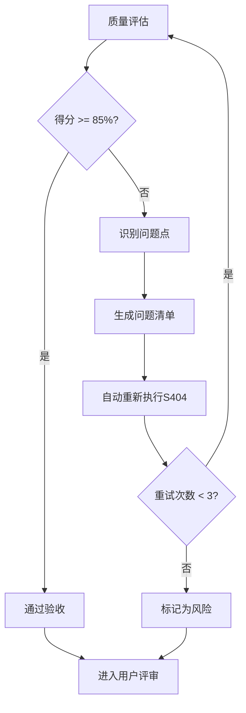

# S404: 原型设计

## Section 1: 元信息 (Meta Information)

| 项目             | 内容                       |
| -------------- | -------------------------- |
| **Skill 编号**   | S406                       |
| **Skill 名称**   | 原型设计                   |
| **Skill 英文名称** | Prototype Design           |
| **所属阶段**       | S4 - 需求整合                  |
| **执行顺序**       | S4 阶段第 6 个执行（可选） |
| **执行模式**       | 仅 normal 模式执行（lightweight 跳过） |
| **依赖 Skill**   | S405 (用户故事编写)          |
| **后置 Skill**   | S5-A01 (架构愿景)            |
| **版本**          | v3.2.0                     |
| **最后更新时间**    | 2026-03-29（阶段重构）      |

***

## Section 2: 功能描述 (Functional Description)

### 2.1 核心职责

S404 负责为核心功能创建可视化原型，通过快速原型设计帮助用户和开发团队更直观地理解需求，发现需求问题：

1. **原型范围选择**：根据需求优先级和复杂度，选择需要原型设计的核心功能
2. **保真度确定**：根据项目需求和时间约束，确定原型保真度等级（低保真/中保真/高保真）
3. **界面原型设计**：为核心功能创建界面线框图，展示页面布局、元素结构和视觉层次
4. **交互流程设计**：设计用户操作流程，定义页面跳转关系和交互逻辑
5. **原型评审组织**：组织用户评审原型，收集反馈意见
6. **需求关联映射**：将原型与需求文档关联，建立追溯关系
7. **需求优化建议**：基于原型评审发现的问题，提出需求优化建议
8. **原型报告生成**：输出完整的原型设计报告（Markdown）

### 2.2 输入规范 (Input Specifications)

**核心输入**：S403 核心需求提取产物

| 内容     | 要求           | 示例                     |
| ------ | ------------ | ---------------------- |
| Plan ID | 必需，格式 P+6位数字 | P000001 |
| 核心需求报告 | 必需，S403产物 | P000001-S4-S403-001.md |
| 需求分类报告 | 可选，S401产物参考 | P000001-S4-S401-001.md |
| 优先级排序报告 | 可选，S402产物参考 | P000001-S4-S402-001.md |

**输入示例**：

```
Plan ID: P000001
核心需求报告: artifacts/stages/s4/P000001-S4-S403-001.md
P0 级需求:
1. 用户注册登录功能
2. 任务创建与管理
3. 数据统计分析
4. 个人中心设置

目标用户：18-25 岁大学生
使用场景：校园学习管理
```

### 2.3 输出规范 (Output Specifications)

**产物清单**：

| 产物名称      | 文件位置                                              | 格式       | 用途                 |
| --------- | ------------------------------------------------- | -------- | ------------------ |
| 原型设计报告 | `artifacts/stages/s4/{PlanID}-S4-S404-001.md`      | Markdown | 完整的原型设计文档 |
| 线框图描述 | 内嵌于原型设计报告中 | Markdown/文本 | 页面布局描述 |
| 交互流程图 | 内嵌于原型设计报告中 | Mermaid | 页面跳转关系 |
| Todo-List 更新 | `artifacts/plans/{PlanID}/todo-list.md` | Markdown | 任务状态更新 |

**重要说明**：
- 所有输出产物均为 Markdown 格式，便于阅读和版本管理
- 线框图使用文本描述格式（ASCII/Markdown 表格），非图片格式
- 交互流程图使用 Mermaid 语法绘制

***

## Section 3: 执行流程 (Execution Process)

### 3.1 流程概览


### 3.2 详细步骤与示例

详细步骤说明参见 [references/execution-details.md](references/execution-details.md)

执行示例参见 [references/examples.md](references/examples.md)

***

## Section 4: 产物规范 (Artifact Specifications)

S404产物规范遵循 [references/artifact-specifications.md](references/artifact-specifications.md) 中的通用定义。

### 4.1 S404特定产物清单

| 产物名称 | 产物ID | 存储路径 | 说明 |
|---------|--------|---------|------|
| 原型设计报告 | `{PlanID}-S4-S404-001` | `artifacts/stages/s4/{PlanID}-S4-S404-001.md` | 主产物，包含页面线框图、交互流程、需求关联矩阵 |

### 4.2 产物内容结构

**原型设计报告章节**：
1. 元信息
2. 原型设计概览
3. 设计决策说明
4. 界面原型详情
5. 交互流程说明
6. 需求关联矩阵
7. 需求优化建议
8. 用户交互记录
9. 评审记录
10. 附录

详细模板参见 [template.md](template.md)

***

## Section 5: 质量标准 (Quality Standards)

### 5.1 质量评估框架

S404遵循 [references/quality-standard.md](references/quality-standard.md) 中的ISO/IEC 25010质量评估框架。

**S404特定权重分配**：
| 维度 | 权重 | 验收阈值 |
|------|------|----------|
| **完整性** | 30% | ≥ 90% |
| **准确性** | 25% | ≥ 90% |
| **一致性** | 20% | ≥ 95% |
| **可读性** | 15% | ≥ 85% |
| **可追溯性** | 10% | ≥ 90% |

**验收门槛**：质量综合得分 ≥ 85%

### 5.2 检查清单

**完整性检查**（30%）：
- [ ] 所有P0级核心功能都有对应的原型页面
- [ ] 主要用户场景都有对应的交互流程
- [ ] 每个页面都有完整的布局说明
- [ ] 需求关联矩阵完整

**准确性检查**（25%）：
- [ ] 原型页面与需求描述一致
- [ ] 交互流程与功能定义匹配
- [ ] 页面元素与需求规格一致
- [ ] 用户场景覆盖完整

**一致性检查**（20%）：
- [ ] 页面风格统一
- [ ] 交互规范一致
- [ ] 术语使用统一
- [ ] 标注格式统一

**可读性检查**（15%）：
- [ ] 页面布局描述清晰合理
- [ ] 交互逻辑描述符合用户习惯
- [ ] Mermaid流程图可读性强

**可追溯性检查**（10%）：
- [ ] 原型页面与需求关联清晰（关联S403产物）
- [ ] 交互流程与功能需求对应关系明确
- [ ] 页面ID唯一且连续

### 5.3 质量综合得分计算

```
得分 = Σ(维度得分 × 维度权重)

示例：
- 完整性：95% × 30% = 28.5
- 准确性：90% × 25% = 22.5
- 一致性：100% × 20% = 20.0
- 可读性：90% × 15% = 13.5
- 可追溯性：95% × 10% = 9.5
- 总分：28.5 + 22.5 + 20.0 + 13.5 + 9.5 = 94.0%
```

### 5.4 验收标准

| 结果 | 标准 | 处理方式 |
|------|------|----------|
| **通过** | 质量综合得分 ≥ 85% | 进入用户评审阶段 |
| **不通过** | 质量综合得分 < 85% | 识别问题 → 生成问题清单 → 自动重新执行 |

### 5.5 不达标处理流程



**重试机制**：
- 第1次：自动重新执行，尝试修复问题
- 第2次：自动重新执行，调整参数
- 第3次：自动重新执行，简化复杂部分
- 仍不达标：标记为风险，进入用户评审并提示问题

***

## Section 6: 异常处理

### 常见异常场景

**前置校验失败**（如输入文件不存在）：
- 提示用户先执行前置 Skill
- 或请求补充必要信息

**执行过程异常**（如处理逻辑失败）：
- 自动重试（最多3次）
- 失败后标记风险继续执行

**后置校验失败**（如产物不完整）：
- 重新生成产物
- 或标记为风险进入用户评审

**用户评审未通过**：
- 根据意见修改产物
- 小修改直接编辑，大修改重新执行

### 本 Skill 特定场景

- 原型范围不明确 → 请求用户确认
- 保真度选择不当 → 重新评估

### 恢复策略

| 异常类型 | 处理策略 |
|----------|----------|
| 可重试异常 | 自动重试3次 |
| 数据缺失 | 请求用户补充 |
| 校验失败 | 重新执行或标记风险 |
| 用户拒绝 | 使用默认值继续 |

详细流程参见 [references/execution-flow-standard.md](references/execution-flow-standard.md)

***

## 附录

### A. 原型设计决策矩阵

| 场景 | 推荐保真度 | 说明 |
|-----|-----------|------|
| 早期概念验证 | 低保真 | 快速探索，成本低 |
| 需求评审会议 | 中保真 | 结构清晰，易于理解 |
| 用户可用性测试 | 高保真 | 体验真实，反馈准确 |
| 时间紧迫 | 低保真 | 快速产出，核心功能 |
| 复杂交互流程 | 中/高保真 | 清晰展示交互细节 |

### B. 页面数量参考标准

| 项目规模 | 建议页面数 | 制作时间 |
|---------|-----------|---------|
| 小型项目（<10 个需求） | 3-5 页 | 1-2 小时 |
| 中型项目（10-30 个需求） | 5-8 页 | 2-4 小时 |
| 大型项目（>30 个需求） | 8-12 页 | 4-8 小时 |

### C. 版本历史

| 版本 | 日期 | 更新内容 |
|------|------|----------|
| v1.0 | 2026-03-26 | 初始版本，定义 Skill15 完整规范 |
| v3.0 | 2026-03-27 | 重构为 6 段式结构，更新 Skill 编号为 S404 |
| v3.1 | 2026-03-27 | Skill瘦身优化，引用通用模板 |
| v3.2.0 | 2026-03-28 | 实施渐进式披露结构，添加 YAML Frontmatter |

---

*本 Skill 符合 IEEE 29148-2011 需求和软件工程标准，遵循 ISO/IEC 25010 质量模型*
