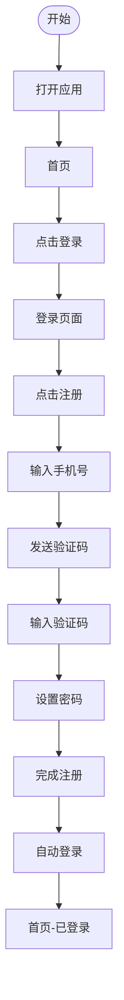
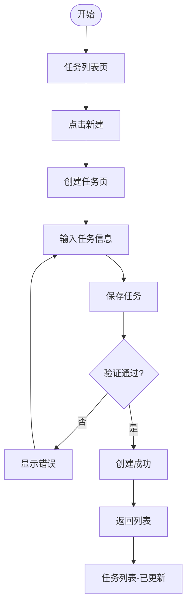

# S406 原型设计示例

本文档包含 S406 原型设计 Skill 的执行示例。

## Demo：原型设计执行示例

### 输入

```
Plan ID: P000001
核心需求报告: artifacts/stages/s4/P000001-S4-S403-001.md

P0 级核心需求:
1. 用户注册登录（手机号+验证码）
2. 任务创建与管理（增删改查）
3. 数据统计分析（图表展示）
4. 个人中心设置（资料修改）

目标用户：18-25 岁大学生
使用场景：校园学习管理
时间约束：适中（1-2 小时）
```

### 处理过程

1. **前置校验** → 检查S403产物存在，校验通过
2. **需求分析** → 提取4个P0级核心功能
3. **原型范围选择** → 6个页面（首页、登录、任务列表、任务详情、统计、个人中心）
4. **保真度确定** → 中保真（需求评审用途）
5. **界面原型设计** → 6个页面线框图
6. **交互流程设计** → 3个核心流程（注册、创建任务、查看统计）
7. **需求关联映射** → 建立追溯矩阵
8. **生成原型报告** → Markdown格式
9. **后置校验** → 校验通过
10. **更新Todo-List** → 标记完成，等待评审

### 输出

```
产物ID: P000001-S4-S406-001
原型页面：6个
交互流程：3个
保真度：中保真
关联需求：8个
产物路径：artifacts/stages/s4/P000001-S4-S406-001.md
```

---

## 线框图示例

### 页面线框图描述格式

```markdown
## 页面 1: 首页

### 布局结构

+--------------------------------------------------+
|  [Logo]    首页    任务    统计    个人中心  [头像] |
+--------------------------------------------------+
|                                                  |
|  +--------------------------------------------+  |
|  |           今日任务概览                      |  |
|  |  +--------+  +--------+  +--------+        |  |
|  |  | 待办 5 |  | 进行中 3|  | 已完成 12|        |  |
|  |  +--------+  +--------+  +--------+        |  |
|  +--------------------------------------------+  |
|                                                  |
|  +--------------------------------------------+  |
|  | 快速创建任务                                |  |
|  | [输入框: 任务名称...] [创建按钮]            |  |
|  +--------------------------------------------+  |
|                                                  |
|  +--------------------------------------------+  |
|  | 最近任务                                    |  |
|  | - [ ] 完成数学作业          [编辑] [删除]   |  |
|  | - [ ] 准备英语演讲          [编辑] [删除]   |  |
|  | - [x] 整理笔记              [编辑] [删除]   |  |
|  +--------------------------------------------+  |
|                                                  |
+--------------------------------------------------+
|  [首页]    [任务]    [+]    [统计]    [我的]     |
+--------------------------------------------------+

### 元素说明

| 元素 | 类型 | 说明 |
|------|------|------|
| Logo | 图片 | 应用标识，点击返回首页 |
| 导航栏 | 链接 | 首页/任务/统计/个人中心 |
| 任务概览卡片 | 展示 | 显示各类任务数量统计 |
| 快速创建 | 输入框+按钮 | 快速添加新任务 |
| 任务列表 | 列表 | 展示最近任务，支持操作 |
| 底部导航 | 导航栏 | 快速切换主要页面 |
```

---

## 交互流程图示例

### 用户注册流程



### 任务创建流程



---

## 需求关联矩阵示例

| 页面 | 关联需求 ID | 需求描述 | 覆盖状态 |
|------|------------|---------|---------|
| 首页 | R001 | 展示任务列表 | 已覆盖 |
| 首页 | R002 | 显示任务统计 | 已覆盖 |
| 登录页 | R003 | 手机号+验证码登录 | 已覆盖 |
| 注册页 | R004 | 用户注册功能 | 已覆盖 |
| 任务列表 | R005 | 任务增删改查 | 已覆盖 |
| 任务详情 | R006 | 查看任务详情 | 已覆盖 |
| 统计页 | R007 | 数据统计分析 | 已覆盖 |
| 个人中心 | R008 | 资料修改 | 已覆盖 |
