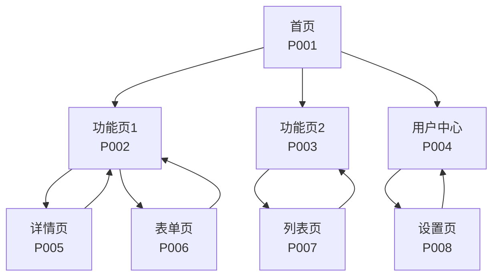

# 原型设计报告模板

## 元信息

| 项目 | 内容 |
|-----|------|
| **文档 ID** | {PlanID}-S4-S404-001 |
| **Plan ID** | {PlanID} |
| **Skill 编号** | S404 |
| **Skill 名称** | 原型设计 |
| **生成时间** | {YYYY-MM-DD HH:MM} |
| **执行模式** | 常规模式 / 轻量化模式 |
| **原型保真度** | 低保真 / 中保真 / 高保真 |
| **Skill 版本** | S404 v1.0 |

---

## 一、原型设计概览

### 1.1 执行摘要

**设计目标**：
- 为核心功能创建可视化原型
- 验证需求合理性，发现潜在问题
- 降低沟通成本，统一理解

**设计范围**：
- 原型页面数：{X} 个
- 交互流程数：{Y} 个
- 关联需求数：{Z} 个
- 覆盖核心功能：{功能列表}

**设计决策**：
- 保真度等级：{等级}
- 选择理由：{理由说明}

### 1.2 关键数据统计

| 统计项 | 数值 | 说明 |
|--------|------|------|
| 原型页面数 | {X} | 设计的界面页面数量 |
| 交互流程数 | {Y} | 设计的用户操作流程数量 |
| 关联需求数 | {Z} | 与原型关联的需求项数量 |
| P0 需求覆盖率 | {XX}% | 核心功能需求覆盖比例 |
| 需求优化建议数 | {N} | 基于原型发现的需求优化建议 |

### 1.3 质量评估

| 质量维度 | 得分 | 权重 | 加权得分 | 评估说明 |
|---------|------|------|---------|---------|
| 完整性 | {XX}% | 30% | {XX} | {说明} |
| 准确性 | {XX}% | 25% | {XX} | {说明} |
| 可用性 | {XX}% | 20% | {XX} | {说明} |
| 一致性 | {XX}% | 15% | {XX} | {说明} |
| 可追溯性 | {XX}% | 10% | {XX} | {说明} |
| **综合得分** | - | 100% | **{XX}%** | {等级评定} |

**质量等级**：{优秀/良好/合格/不合格}

---

## 二、设计决策说明

### 2.1 原型范围选择

**选择依据**：
- 基于 S402 需求优先级排序结果
- 优先覆盖所有 P0 级核心功能
- 考虑时间约束和用户价值

**原型功能清单**：

| 序号 | 功能名称 | 需求 ID | 优先级 | 选择理由 |
|------|---------|---------|--------|---------|
| 1 | {功能1} | {R001} | P0 | {理由} |
| 2 | {功能2} | {R002} | P0 | {理由} |
| 3 | {功能3} | {R003} | P1 | {理由} |
| ... | ... | ... | ... | ... |

**未选择功能说明**：
- {功能X}：{未选择理由}
- {功能Y}：{未选择理由}

### 2.2 保真度确定

**评估因素**：

| 评估维度 | 评估结果 | 影响 |
|---------|---------|------|
| 需求复杂度 | {评分}/100 | {说明} |
| 核心功能数量 | {数量} | {说明} |
| 时间约束 | {充裕/适中/紧张} | {说明} |
| 目标用户 | {技术/非技术/混合} | {说明} |
| 使用场景 | {评审/测试/演示} | {说明} |

**决策结论**：
- 确定保真度：{低保真/中保真/高保真}
- 决策理由：{详细说明}

### 2.3 设计约束

**时间约束**：
- 预计制作时间：{X} 小时
- 实际制作时间：{Y} 小时

**技术约束**：
- 原型工具：{工具名称/文本描述}
- 输出格式：{Markdown/Mermaid/其他}

**资源约束**：
- 参考素材：{素材清单}
- 设计规范：{规范说明}

---

## 三、界面原型详情

### 3.1 页面清单

| 页面编号 | 页面名称 | 功能描述 | 关联需求 | 优先级 |
|---------|---------|---------|---------|--------|
| P001 | {页面1名称} | {描述} | {R001, R002} | P0 |
| P002 | {页面2名称} | {描述} | {R003} | P0 |
| P003 | {页面3名称} | {描述} | {R004, R005} | P1 |
| ... | ... | ... | ... | ... |

### 3.2 页面原型

#### 页面 P001：{页面名称}

**页面信息**：
- 页面编号：P001
- 页面标题：{标题}
- 页面类型：{首页/列表页/详情页/表单页/其他}
- 关联需求：{R001, R002}

**页面布局**：

```
+--------------------------------------------------+
|  [Logo]    [导航栏]                    [用户头像]  |
+--------------------------------------------------+
|                                                  |
|  [标题区域]                                      |
|  主标题：{标题文本}                              |
|  副标题：{副标题文本}                            |
|                                                  |
+--------------------------------------------------+
|                                                  |
|  [核心功能区]                                    |
|  +------------------+  +------------------+      |
|  | [功能卡片1]      |  | [功能卡片2]      |      |
|  | - 图标           |  | - 图标           |      |
|  | - 标题           |  | - 标题           |      |
|  | - 描述           |  | - 描述           |      |
|  +------------------+  +------------------+      |
|                                                  |
+--------------------------------------------------+
|  [信息展示区]                                    |
|  - 数据指标1：{值}                               |
|  - 数据指标2：{值}                               |
|                                                  |
+--------------------------------------------------+
|  [操作按钮区]                                    |
|  [主要按钮]    [次要按钮]    [文字链接]          |
|                                                  |
+--------------------------------------------------+
|  [页脚]                                          |
|  版权信息 | 帮助链接 | 关于我们                  |
+--------------------------------------------------+
```

**元素说明**：

| 元素编号 | 元素名称 | 元素类型 | 位置 | 交互说明 |
|---------|---------|---------|------|---------|
| E001 | Logo | 图片 | 左上角 | 点击返回首页 |
| E002 | 导航栏 | 导航 | 顶部 | 页面跳转 |
| E003 | 用户头像 | 按钮 | 右上角 | 点击展开用户菜单 |
| E004 | 主标题 | 文本 | 标题区 | 静态展示 |
| E005 | 功能卡片1 | 卡片 | 核心区 | 点击进入功能页 |
| ... | ... | ... | ... | ... |

**交互说明**：
- 页面加载：{加载逻辑}
- 默认状态：{初始状态}
- 异常状态：{错误处理}

---

#### 页面 P002：{页面名称}

**页面信息**：
- 页面编号：P002
- 页面标题：{标题}
- 页面类型：{类型}
- 关联需求：{需求ID}

**页面布局**：

```
{页面布局描述}
```

**元素说明**：

| 元素编号 | 元素名称 | 元素类型 | 位置 | 交互说明 |
|---------|---------|---------|------|---------|
| ... | ... | ... | ... | ... |

**交互说明**：
- ...

---

### 3.3 页面关系图



---

## 四、交互流程说明

### 4.1 流程清单

| 流程编号 | 流程名称 | 涉及页面 | 用户场景 | 优先级 |
|---------|---------|---------|---------|--------|
| F001 | {流程1名称} | {P001, P002, P003} | {场景描述} | P0 |
| F002 | {流程2名称} | {P001, P004} | {场景描述} | P0 |
| F003 | {流程3名称} | {P002, P005, P006} | {场景描述} | P1 |
| ... | ... | ... | ... | ... |

### 4.2 交互流程详情

#### 流程 F001：{流程名称}

**流程信息**：
- 流程编号：F001
- 流程名称：{名称}
- 用户场景：{场景描述}
- 涉及页面：{P001, P002, P003}
- 关联需求：{R001, R002}

**流程图**：

```mermaid
flowchart TD
    Start([开始]) --> Step1[页面 P001<br/>首页]
    Step1 --> Step2{用户操作}<br/>点击功能入口
    Step2 --> Step3[页面 P002<br/>功能页]
    Step3 --> Step4{用户操作}<br/>填写信息
    Step4 --> Step5[页面 P003<br/>确认页]
    Step5 --> Step6{用户操作}<br/>确认提交
    Step6 -->|成功| Step7[页面 P004<br/>成功页]
    Step6 -->|失败| Step8[页面 P005<br/>错误页]
    Step8 --> Step4
    Step7 --> End([结束])
```

**流程步骤说明**：

| 步骤 | 页面 | 用户操作 | 系统响应 | 异常处理 |
|------|------|---------|---------|---------|
| 1 | P001 | 点击功能入口 | 跳转至 P002 | 无 |
| 2 | P002 | 填写信息 | 验证输入 | 显示错误提示 |
| 3 | P003 | 确认提交 | 处理请求 | 跳转错误页 |
| 4 | P004 | 查看结果 | 展示成功信息 | 无 |

**触发条件**：
- 入口：{触发条件}
- 前置条件：{前置条件}

**业务规则**：
- 规则1：{规则说明}
- 规则2：{规则说明}

---

#### 流程 F002：{流程名称}

**流程信息**：
- 流程编号：F002
- 流程名称：{名称}
- 用户场景：{场景描述}

**流程图**：

```mermaid
flowchart TD
    {流程图}
```

**流程步骤说明**：

| 步骤 | 页面 | 用户操作 | 系统响应 | 异常处理 |
|------|------|---------|---------|---------|
| ... | ... | ... | ... | ... |

---

### 4.3 全局交互规范

**导航规范**：
- 主导航：{说明}
- 面包屑：{说明}
- 返回按钮：{说明}

**操作反馈规范**：
- 加载状态：{说明}
- 成功反馈：{说明}
- 错误反馈：{说明}

**异常处理规范**：
- 网络异常：{说明}
- 权限不足：{说明}
- 数据为空：{说明}

---

## 五、需求关联矩阵

### 5.1 页面与需求关联

| 页面编号 | 页面名称 | 关联需求 ID | 需求描述 | 覆盖程度 |
|---------|---------|------------|---------|---------|
| P001 | {页面1} | R001, R002 | {描述} | 完全覆盖 |
| P002 | {页面2} | R003 | {描述} | 完全覆盖 |
| P003 | {页面3} | R004, R005 | {描述} | 部分覆盖 |
| ... | ... | ... | ... | ... |

### 5.2 流程与需求关联

| 流程编号 | 流程名称 | 关联需求 ID | 需求描述 | 验证结果 |
|---------|---------|------------|---------|---------|
| F001 | {流程1} | R001 | {描述} | 验证通过 |
| F002 | {流程2} | R002, R003 | {描述} | 需优化 |
| ... | ... | ... | ... | ... |

### 5.3 需求覆盖情况

**已覆盖需求**：

| 需求 ID | 需求描述 | 覆盖页面 | 覆盖流程 | 覆盖状态 |
|---------|---------|---------|---------|---------|
| R001 | {描述} | P001, P002 | F001 | ✅ 已覆盖 |
| R002 | {描述} | P001 | F001, F002 | ✅ 已覆盖 |
| ... | ... | ... | ... | ... |

**未覆盖需求**：

| 需求 ID | 需求描述 | 未覆盖原因 | 建议处理方式 |
|---------|---------|-----------|------------|
| R010 | {描述} | {原因} | {建议} |
| ... | ... | ... | ... |

---

## 六、需求优化建议

### 6.1 优化建议清单

| 编号 | 原需求 ID | 原需求描述 | 优化建议 | 优化理由 | 优先级 | 状态 |
|------|----------|-----------|---------|---------|--------|------|
| OPT-001 | R001 | {原描述} | {建议内容} | {理由} | P0 | 已采纳 |
| OPT-002 | R003 | {原描述} | {建议内容} | {理由} | P1 | 待评估 |
| OPT-003 | R005 | {原描述} | {建议内容} | {理由} | P2 | 已采纳 |
| ... | ... | ... | ... | ... | ... | ... |

### 6.2 优化建议详情

#### OPT-001：{优化建议标题}

**关联需求**：R001 - {需求名称}

**原需求描述**：
{原需求描述文本}

**发现的问题**：
- 问题1：{问题描述}
- 问题2：{问题描述}

**优化建议**：
{优化建议内容}

**优化理由**：
{理由说明}

**预期效果**：
{效果说明}

**处理状态**：{已采纳/待评估/已拒绝}

---

#### OPT-002：{优化建议标题}

**关联需求**：R003 - {需求名称}

**原需求描述**：
{原需求描述文本}

**发现的问题**：
{问题描述}

**优化建议**：
{优化建议内容}

**处理状态**：{状态}

---

### 6.3 优化建议统计

| 状态 | 数量 | 占比 |
|------|------|------|
| 已采纳 | {X} | {XX}% |
| 待评估 | {Y} | {YY}% |
| 已拒绝 | {Z} | {ZZ}% |
| **总计** | **{N}** | **100%** |

---

## 七、用户交互记录

### 7.1 交互记录清单

| 轮次 | 时间 | 交互类型 | 问题描述 | 用户输入 | 处理结果 |
|------|------|---------|---------|---------|---------|
| 1 | {时间} | 范围确认 | {问题} | {输入} | {结果} |
| 2 | {时间} | 保真度选择 | {问题} | {输入} | {结果} |
| ... | ... | ... | ... | ... | ... |

### 7.2 交互记录详情

#### 交互 1：原型范围确认

**交互时间**：{YYYY-MM-DD HH:MM}

**交互类型**：范围确认

**问题描述**：
```
【原型设计 - 范围确认】

根据需求分析，建议为以下功能创建原型：

核心功能（P0）：
1. {功能1名称}
2. {功能2名称}
3. {功能3名称}

请选择：
A. 仅核心功能（推荐，时间约 X 分钟）
B. 核心功能 + 部分可选功能（时间约 Y 分钟）
C. 全部功能（时间约 Z 分钟）
D. 自定义（请说明）
```

**用户输入**：
{用户输入内容}

**解析结果**：
{解析结果}

**处理状态**：✅ 已处理

---

#### 交互 2：保真度选择

**交互时间**：{YYYY-MM-DD HH:MM}

**交互类型**：保真度选择

**问题描述**：
```
【原型设计 - 保真度选择】

请选择原型设计的精细程度：
...
```

**用户输入**：
{用户输入内容}

**解析结果**：
{解析结果}

**处理状态**：✅ 已处理

---

## 八、评审记录

### 8.1 评审记录清单

| 轮次 | 评审时间 | 评审结果 | 评审意见 | 处理状态 |
|------|---------|---------|---------|---------|
| 第 1 轮 | {时间} | {通过/需修改} | {意见} | {状态} |
| 第 2 轮 | {时间} | {通过/需修改} | {意见} | {状态} |
| ... | ... | ... | ... | ... |

### 8.2 评审记录详情

#### 第 1 轮评审

**评审时间**：{YYYY-MM-DD HH:MM}

**评审结果**：{通过/需修改}

**评审意见**：
{评审意见内容}

**处理措施**：
{处理措施}

**处理状态**：{已处理/处理中}

---

## 九、附录

### 9.1 术语表

| 术语 | 定义 |
|------|------|
| 低保真原型 | 手绘草图或简单线框图，用于早期概念验证 |
| 中保真原型 | 数字化线框图，含基本布局，用于需求评审 |
| 高保真原型 | 接近最终 UI 效果，含交互，用于用户测试 |
| 保真度 | 原型与最终产品的相似程度 |
| 交互流程 | 用户完成特定任务的操作步骤序列 |

### 9.2 参考文档

- [SKILL.md](SKILL.md) - S404 定义文档
- [WORKFLOW.md](../../../WORKFLOW.md) - 主工作流程文档
- {PlanID}-S4-S403-001.md - 核心需求提炼报告
- {PlanID}-S4-S402-001.md - 需求优先级排序报告

### 9.3 变更记录

| 变更日期 | 变更内容 | 变更原因 | 操作人 |
|---------|---------|---------|--------|
| {日期} | {内容} | {原因} | {操作人} |

---

*文档生成时间：{YYYY-MM-DD HH:MM}*  
*模板版本：v1.0*
