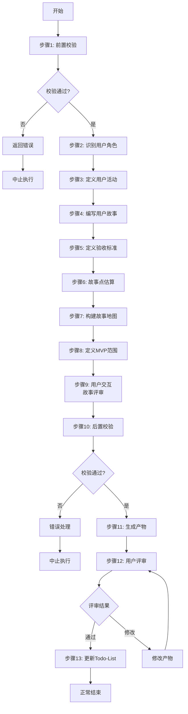

# S405: 用户故事编写

## Section 1: 元信息 (Meta Information)

| 项目             | 内容                       |
| -------------- | -------------------------- |
| **Skill 编号**   | S405                       |
| **Skill 名称**   | 用户故事编写                 |
| **Skill 英文名称** | User Story Writing         |
| **所属阶段**       | S4 - 需求整合                 |
| **执行顺序**       | S4 阶段第 4 个执行            |
| **执行模式**       | normal/lightweight 均执行    |
| **依赖 Skill**   | S403 (核心需求提炼)          |
| **后置 Skill**   | S406 (原型设计) / S5-A01 (架构愿景) |
| **版本**          | v3.2.0                     |
| **最后更新时间**    | 2026-03-29（新增）          |

## Contract

| 项目 | 内容 |
|------|------|
| **Skill ID** | S405 |
| **Stage** | S4 |
| **Directory** | skills/s4-user-stories |
| **Depends On** | S403 |
| **Next (Normal)** | S406 |
| **Next (Lightweight)** | S5-A01 |
| **Lightweight Skip** | No |
| **Required Inputs** | artifacts/stages/s4/{PlanID}-S4-S403-001.md |
| **Outputs** | artifacts/stages/s4/{PlanID}-S4-S405-001.md |

***

## Section 2: 功能描述 (Functional Description)

### 2.1 核心职责

S405 负责将核心需求转换为敏捷开发可用的用户故事格式，为迭代开发提供清晰的工作项：

1. **用户故事编写**：使用"As a... I want... So that..."格式编写故事
2. **验收标准定义**：使用"Given-When-Then"格式定义验收条件
3. **故事点估算**：为每个故事估算相对工作量
4. **故事地图构建**：按用户旅程组织故事，形成故事地图
5. **MVP范围确定**：识别最小可行产品所需的故事集
6. **优先级排序**：基于价值和依赖关系排序故事

### 2.2 输入规范 (Input Specifications)

#### 输入文件

| 输入项       | 文件路径                                                   | 说明                   |  必填 |
| --------- | ------------------------------------------------------ | -------------------- | :-: |
| Plan 定义文件 | `artifacts/plans/{PlanID}.md`                           | Plan 基本信息            |  是  |
| 核心需求提炼  | `artifacts/stages/s4/{PlanID}-S4-S403-001.md`          | S403产物，包含核心需求   |  是  |
| 需求优先级   | `artifacts/stages/s4/{PlanID}-S4-S402-001.md`          | S402产物，包含优先级排序 |  是  |

#### 输入内容读取规则

1. **读取核心需求**：提取所有Must-have和Should-have需求
2. **读取用户角色**：从S201边界界定获取用户画像
3. **读取优先级**：理解需求的业务价值排序

### 2.3 输出规范 (Output Specifications)

#### 用户会得到什么

S405完成后，系统会生成以下产物并保存到项目目录：

**产物清单**：

| 产物名称      | 文件路径                                              | 格式       | 用途                 | 用户可见性   |
| --------- | ------------------------------------------------- | -------- | ------------------ | ------- |
| 用户故事地图  | `artifacts/stages/s4/{PlanID}-S4-S405-001.md`      | Markdown | 按用户旅程组织的故事地图 | 用户可查看 |
| 用户故事清单  | `artifacts/stages/s4/{PlanID}-S4-S405-002.md`      | Markdown | 详细故事列表和验收标准   | 用户可查看 |
| MVP范围定义  | `artifacts/stages/s4/{PlanID}-S4-S405-003.md`      | Markdown | 最小可行产品故事集      | 用户可查看 |

**产物内容结构**：

1. **用户故事地图**（Markdown格式）
   - 用户角色定义
   - 用户活动（Backbone）
   - 用户任务（Walking skeleton）
   - 详细故事（Stories）
   - 发布规划（Release planning）

2. **用户故事清单**（Markdown格式）
   - 故事ID和标题
   - 故事描述（As a... I want... So that...）
   - 验收标准（Given-When-Then）
   - 故事点估算
   - 优先级
   - 依赖关系

***

## Section 3: 执行流程 (Execution Process)

### 3.1 流程概览



### 3.2 执行步骤说明

本 Skill 执行流程包含 8 个主要步骤：前置校验、角色识别、故事编写、验收标准、估算、故事地图、MVP定义、用户评审。

详细执行步骤参见 [references/execution-details.md](references/execution-details.md)

***

## Section 4: 产物规范 (Artifact Specifications)

遵循标准 [产物规范](references/artifact-specifications.md)。

**本Skill产物**：

| 产物名称 | 产物ID | 存储路径 | 说明 |
|----------|--------|----------|------|
| 用户故事地图 | `{PlanID}-S4-S405-001` | `artifacts/stages/s4/{PlanID}-S4-S405-001.md` | 主产物，可视化故事组织 |
| 用户故事清单 | `{PlanID}-S4-S405-002` | `artifacts/stages/s4/{PlanID}-S4-S405-002.md` | 详细故事列表 |
| MVP范围定义 | `{PlanID}-S4-S405-003` | `artifacts/stages/s4/{PlanID}-S4-S405-003.md` | 最小可行产品 |

### 4.1 依赖关系

**前置 Skill**：S403 (核心需求提炼)

**后置 Skill**：S406 (原型设计) 或 S5-A01 (架构愿景)

**被依赖的产物**：

| 产物 ID | 产物类型 | 被依赖的 Skill | 用途 |
| ------- | -------- | -------------- | ---- |
| `{PlanID}-S4-S405-002` | 用户故事清单 | S404, S5-A01 | 原型设计和架构设计输入 |

***

## Section 5: 质量标准 (Quality Standards)

### 5.1 质量评估框架

S405 遵循 INVEST 原则和 ISO/IEC 25010 质量评估框架：

| 维度 | 权重 | 评估标准 | 验收阈值 |
|------|------|----------|----------|
| **INVEST合规** | 30% | 符合Independent, Negotiable, Valuable, Estimable, Small, Testable | ≥ 90% |
| **完整性** | 25% | 覆盖所有核心需求 | ≥ 95% |
| **可测试性** | 20% | 每个故事有明确的验收标准 | ≥ 95% |
| **一致性** | 15% | 与需求优先级一致 | ≥ 90% |
| **可读性** | 10% | 故事描述清晰易懂 | ≥ 85% |

**质量综合得分** = INVEST合规×30% + 完整性×25% + 可测试性×20% + 一致性×15% + 可读性×10%

**验收门槛**：质量综合得分 ≥ 85%

### 5.2 检查清单

**INVEST检查**（30%）：
- [ ] Independent：故事间依赖最小化
- [ ] Negotiable：实现细节可协商
- [ ] Valuable：对用户有明确价值
- [ ] Estimable：可估算工作量
- [ ] Small：可在单个迭代完成
- [ ] Testable：有明确的验收标准

**完整性检查**（25%）：
- [ ] 所有核心需求已转换为故事
- [ ] 每个用户角色有对应的故事
- [ ] 关键业务流程有完整的故事链

**可测试性检查**（20%）：
- [ ] 每个故事有3-5个验收标准
- [ ] 验收标准使用Given-When-Then格式
- [ ] 验收标准可自动化测试

**一致性检查**（15%）：
- [ ] 故事优先级与需求优先级一致
- [ ] 故事点估算合理
- [ ] MVP范围与业务目标一致

**可读性检查**（10%）：
- [ ] 故事描述使用用户语言
- [ ] 避免技术术语
- [ ] 故事地图结构清晰

***

## Section 6: 异常处理

### 常见异常场景

**前置校验失败**：
- 提示用户先执行前置 Skill
- 或请求补充必要信息

**故事过大**：
- 识别史诗故事（Epic）
- 建议拆分为更小的故事

**依赖复杂**：
- 可视化依赖关系
- 建议调整故事顺序

### 本 Skill 特定场景

- 需求无法转换为故事 → 标记为技术任务或 Spike
- 用户角色不明确 → 发起用户交互澄清
- 验收标准模糊 → 提供验收标准模板

### 恢复策略

| 异常类型 | 处理策略 |
|----------|----------|
| 可重试异常 | 自动重试3次 |
| 数据缺失 | 请求用户补充 |
| 故事过大 | 建议拆分并提供拆分方案 |
| 依赖复杂 | 可视化并提供优化建议 |

详细流程参见 [execution-flow-standard.md](references/execution-flow-standard.md)

***

## 附录

### 用户故事模板

**标准格式**：
```
作为 [角色]
我想要 [功能]
以便 [价值]
```

**示例**：
```
作为 注册用户
我想要 通过邮箱重置密码
以便 在忘记密码时能够恢复账户访问
```

### 验收标准模板

**Given-When-Then 格式**：
```
场景: [场景描述]
  Given [前置条件]
  And [更多前置条件]
  When [操作]
  And [更多操作]
  Then [预期结果]
  And [更多预期结果]
```

**示例**：
```
场景: 成功重置密码
  Given 用户已注册且邮箱已验证
  When 用户请求密码重置
  Then 系统发送重置链接到用户邮箱
  And 链接有效期为24小时
```

### 故事点估算参考

| 故事点 | 工作量 | 复杂度 | 不确定性 |
|--------|--------|--------|----------|
| 1 | 简单任务 | 低 | 无 |
| 2 | 小功能 | 低 | 低 |
| 3 | 标准功能 | 中 | 低 |
| 5 | 复杂功能 | 中 | 中 |
| 8 | 大型功能 | 高 | 中 |
| 13 | 史诗级 | 高 | 高 |

验收检查清单参见 [references/appendix.md](references/appendix.md)
