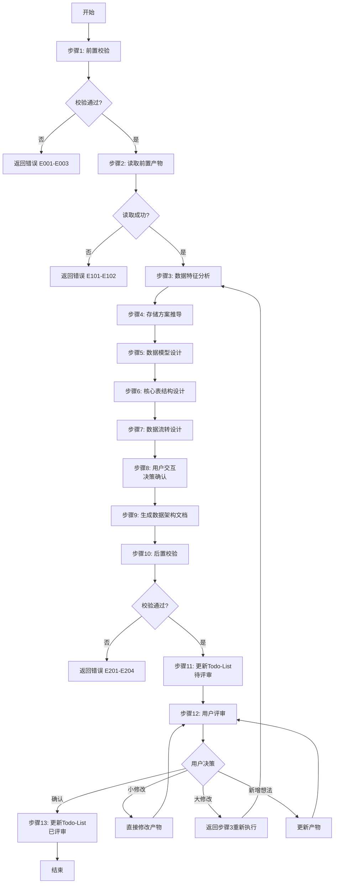
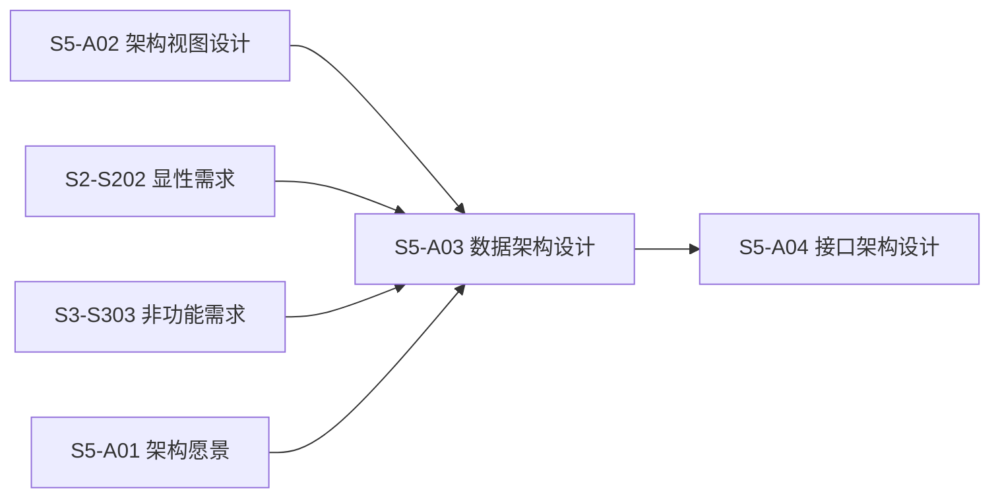
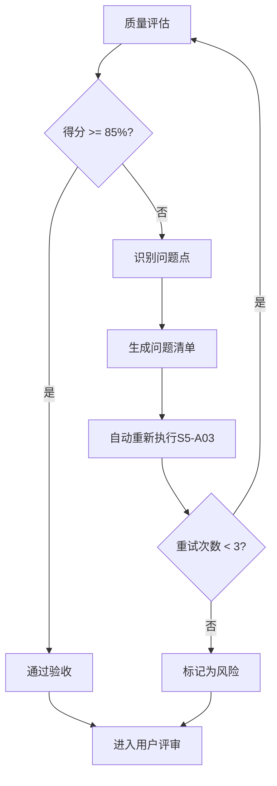

# S5-A03: 数据架构设计

## Section 1: 元信息 (Meta Information)

| 项目             | 内容                       |
| -------------- | -------------------------- |
| **Skill 编号**   | S5-A03                     |
| **Skill 名称**   | 数据架构设计                 |
| **Skill 英文名称** | Data Architecture Design   |
| **所属阶段**       | S5 - 架构设计阶段             |
| **执行顺序**       | S5 阶段第 3 个执行            |
| **执行模式**       | 自动分析 + 用户交互            |
| **依赖 Skill**   | S5-A02（架构视图设计）         |
| **后置 Skill**   | S5-A04（接口架构设计）         |
| **版本**          | v3.2.0                     |
| **最后更新时间**    | 2026-03-28                 |

## Contract

| 项目 | 内容 |
|------|------|
| **Skill ID** | S5-A03 |
| **Stage** | S5 |
| **Directory** | skills/s5-data |
| **Depends On** | S5-A02 |
| **Next (Normal)** | S5-A04 |
| **Next (Lightweight)** | S5-A04 |
| **Lightweight Skip** | No |
| **Required Inputs** | 参见 workflow-manifest.yaml |
| **Outputs** | artifacts/stages/s5/{PlanID}-S5-A03-001.md |

***

## Section 2: 功能描述 (Functional Description)

### 2.1 核心职责

S5-A03 负责设计系统的数据架构，确保数据的完整性、一致性、可用性和安全性。主要职责包括：

1. **数据特征分析**：分析数据类型、规模、访问模式、一致性要求等特征
2. **存储架构选型**：基于数据特征推荐合适的存储方案（关系型、文档型、键值型等）
3. **数据模型设计**：设计逻辑数据模型和物理数据模型
4. **核心表结构设计**：详细设计核心表结构、字段、索引和约束
5. **缓存策略设计**：设计缓存模型和缓存策略
6. **数据流转设计**：设计数据生命周期、同步策略和一致性保障
7. **数据治理设计**：设计数据质量标准、安全策略和备份恢复策略
8. **容量规划**：预估存储容量、QPS、带宽等关键指标

### 2.2 输入规范 (Input Specifications)

#### 用户/前置 Skill 需要提供什么

**前置产物（必需）**：

| 阶段 | 产物名称 | 产物 ID 示例 | 用途 |
|------|---------|-------------|------|
| S5 | 架构视图设计文档 | `{PlanID}-S5-A02-001` | 获取逻辑视图中的领域模型 |
| S2 | 数据需求清单 | `{PlanID}-S2-S202-001` | 获取数据实体、数据关系、数据量 |
| S3 | 非功能需求报告 | `{PlanID}-S3-S303-001` | 获取性能、可用性、一致性要求 |
| S5 | 架构愿景文档 | `{PlanID}-S5-A01-001` | 获取系统特征、技术约束 |

**输入格式**：
- Markdown 报告文件
- 领域模型图（Mermaid erDiagram）
- 数据需求表格
- 非功能需求指标

**输入验证规则**：

| 规则 | 验证内容 | 错误码 |
|------|----------|--------|
| 前置产物存在 | 检查依赖产物文件是否存在 | E001 |
| 数据需求完整 | 检查数据实体、关系是否定义 | E002 |
| 领域模型有效 | 检查逻辑视图中的领域模型是否完整 | E003 |

#### 输入示例

**前置产物引用示例**：

```
PlanID: P000001
前置产物：
- P000001-S5-A02-001 (架构视图设计文档)
- P000001-S2-S202-001 (显性需求提取清单 - 数据需求部分)
- P000001-S3-S303-001 (非功能需求报告)
- P000001-S5-A01-001 (架构愿景文档)
```

### 2.3 输出规范 (Output Specifications)

#### 用户会得到什么

Skill 完成后，系统会生成以下产物并保存到项目目录：

**产物清单**：

| 产物名称 | 文件位置 | 格式 | 用途 | 用户可见性 |
|---------|---------|------|------|-----------|
| 数据架构设计文档 | `artifacts/stages/s5/{PlanID}/{PlanID}-S5-A03-001.md` | Markdown | 完整的数据架构设计报告 | 用户可查看 |
| Todo-List 更新 | `artifacts/plans/{PlanID}/todo-list.md` | Markdown | 任务状态更新 | 用户可查看 |

**产物内容结构**：

1. **执行摘要**：数据架构概览、关键决策
2. **数据特征分析**：数据类型、规模、访问模式分析
3. **存储架构设计**：存储选型、部署架构、多存储组合
4. **数据模型设计**：逻辑模型（ER图）、物理模型、文档模型、缓存模型
5. **核心表结构设计**：核心表详细设计、字段说明、索引设计
6. **数据流转设计**：生命周期、同步策略、一致性保障
7. **数据治理**：质量标准、安全策略、备份恢复
8. **容量规划**：存储、QPS、带宽预估
9. **设计决策**：关键决策记录
10. **风险与约束**：数据架构风险、容量规划

#### 输出示例

**数据架构设计文档示例结构**：

```markdown
# 数据架构设计文档 - P000001-S5-A03-001

## 执行摘要
- **主存储**: PostgreSQL
- **缓存层**: Redis
- **核心表数量**: 12 个
- **预估数据量**: 5000 万条/年

## 存储架构设计
| 数据类别 | 存储类型 | 具体产品 | 选型理由 |
|----------|----------|----------|----------|
| 核心业务数据 | 关系型 | PostgreSQL | ACID支持，复杂查询 |
| 会话数据 | 键值存储 | Redis | 高性能，过期支持 |
...
```

***

## Section 3: 执行流程 (Execution Process)

### 3.1 流程概览



### 3.2 详细步骤说明

详细步骤说明见 [references/execution-details.md](references/execution-details.md)

### 3.3 Demo 示例

执行示例见 [references/examples.md](references/examples.md)

---

## Section 4: 产物规范 (Artifact Specifications)

S5-A03 产物规范遵循 [artifact-specifications.md](../_shared/artifact-specifications.md) 中的通用定义。

### 4.1 S5-A03 特定产物清单

| 产物名称 | 产物ID | 存储路径 | 说明 |
|---------|--------|---------|------|
| 数据架构设计文档 | `{PlanID}-S5-A03-001` | `artifacts/stages/s5/{PlanID}/{PlanID}-S5-A03-001.md` | 主产物，包含存储架构、数据模型、表结构、数据流转、数据治理 |

### 4.2 产物依赖关系



### 4.3 模板引用

**模板文件**：`skills/s5-data/template.md`

**引用方式**：直接引用模板结构，填充实际数据

---

## Section 5: 质量标准 (Quality Standards)

### 5.1 质量评估框架

S5-A03 遵循 [quality-standard.md](../_shared/quality-standard.md) 中的ISO/IEC 25010质量评估框架。

**S5-A03 特定权重分配**：

| 维度 | 权重 | 评估标准 | 验收阈值 |
|------|------|----------|----------|
| **完整性** | 30% | 所有数据实体已建模，核心表结构完整 | ≥ 90% |
| **准确性** | 25% | 数据类型、约束、索引设计正确 | ≥ 90% |
| **一致性** | 20% | 数据模型与领域模型一致，术语统一 | ≥ 95% |
| **可读性** | 15% | ER图清晰，表结构描述明确 | ≥ 85% |
| **可追溯性** | 10% | 数据实体来源可追溯，决策依据明确 | ≥ 90% |

**质量综合得分** = 完整性×30% + 准确性×25% + 一致性×20% + 可读性×15% + 可追溯性×10%

**验收门槛**：质量综合得分 ≥ 85%

### 5.2 检查清单

**完整性检查**（30%）：
- [ ] 所有核心数据实体已识别并建模
- [ ] 逻辑数据模型（ER图）已生成
- [ ] 物理数据模型（表结构）已设计
- [ ] 核心表结构详细设计完整（字段、索引、约束）
- [ ] 数据流转设计完整（生命周期、同步策略）
- [ ] 数据治理设计完整（质量、安全、备份）

**准确性检查**（25%）：
- [ ] 存储选型基于数据特征分析
- [ ] 数据类型选择正确
- [ ] 主键、外键设计合理
- [ ] 索引设计符合查询模式
- [ ] 容量规划数据准确

**一致性检查**（20%）：
- [ ] 数据模型与领域模型一致
- [ ] 表命名规范统一
- [ ] 字段命名规范统一
- [ ] 与S5-A02架构视图设计保持一致

**可读性检查**（15%）：
- [ ] ER图使用Mermaid语法正确
- [ ] 表结构描述清晰
- [ ] 设计决策有理有据
- [ ] 文档结构符合模板规范

**可追溯性检查**（10%）：
- [ ] 数据实体来源可追溯到需求
- [ ] 存储选型依据可追溯
- [ ] 设计决策有明确理由

### 5.3 质量综合得分计算

```
得分 = Σ(维度得分 × 维度权重)

示例：
- 完整性：95% × 30% = 28.5
- 准确性：90% × 25% = 22.5
- 一致性：100% × 20% = 20.0
- 可读性：90% × 15% = 13.5
- 可追溯性：95% × 10% = 9.5
- 总分：28.5 + 22.5 + 20.0 + 13.5 + 9.5 = 94.0%
```

### 5.4 验收标准

| 结果 | 标准 | 处理方式 |
|------|------|----------|
| **通过** | 质量综合得分 ≥ 85% | 进入用户评审阶段 |
| **不通过** | 质量综合得分 < 85% | 识别问题 → 生成问题清单 → 自动重新执行 |

### 5.5 不达标处理流程



**重试机制**：
- 第1次：自动重新执行，尝试修复问题
- 第2次：自动重新执行，调整参数
- 第3次：自动重新执行，简化复杂部分
- 仍不达标：标记为风险，进入用户评审并提示问题

---

## Section 6: 异常处理

### 6.1 常见异常场景

**前置校验失败**（如输入文件不存在）：
- 提示用户先执行前置 Skill
- 或请求补充必要信息

**执行过程异常**（如处理逻辑失败）：
- 自动重试（最多3次）
- 失败后标记风险继续执行

**后置校验失败**（如产物不完整）：
- 重新生成产物
- 或标记为风险进入用户评审

**用户评审未通过**：
- 根据意见修改产物
- 小修改直接编辑，大修改重新执行

### 6.2 本 Skill 特定场景

| 异常场景 | 触发条件 | 处理策略 |
|----------|----------|----------|
| 数据需求不完整 | 数据实体或关系信息缺失 | 触发信息收集交互 |
| 存储选型争议 | 多个存储方案均可行 | 提供选项让用户选择 |
| 数据量预估困难 | 缺少业务增长数据 | 使用保守估计并标注不确定性 |
| 一致性级别选择 | 强一致性与性能存在冲突 | 提供选项让用户决策 |
| 分库分表决策 | 数据量达到分片阈值 | 提供分片方案让用户选择 |

### 6.3 错误代码表

**前置校验错误**（E001-E099）：

| 错误码 | 错误类型 | 说明 | 处理策略 |
|--------|----------|------|----------|
| E001 | 前置产物缺失 | 架构视图设计文档不存在 | 返回错误，提示先执行S5-A02 |
| E002 | 数据需求缺失 | 数据实体或关系信息缺失 | 触发信息收集交互 |
| E003 | 领域模型无效 | 逻辑视图中的领域模型不完整 | 返回错误，提示完善领域模型 |

**执行过程错误**（E100-E199）：

| 错误码 | 错误类型 | 说明 | 处理策略 |
|--------|----------|------|----------|
| E101 | 数据特征分析失败 | 无法分析数据特征 | 重试3次，失败则标记风险 |
| E102 | 存储选型冲突 | 存储选型存在冲突 | 提供选项让用户决策 |
| E103 | 模型设计异常 | 数据模型设计发生异常 | 记录日志，返回错误 |

**后置校验错误**（E200-E299）：

| 错误码 | 错误类型 | 说明 | 处理策略 |
|--------|----------|------|----------|
| E201 | 产物文件不存在 | 数据架构文档生成失败 | 重新生成产物 |
| E202 | 产物格式错误 | 文档格式不符合模板 | 重新生成产物 |
| E203 | 表结构缺失 | 核心表结构设计不完整 | 补充后重新生成 |
| E204 | ER图生成失败 | Mermaid语法错误 | 修复语法后重新生成 |

### 6.4 恢复策略

| 异常类型 | 处理策略 |
|----------|----------|
| 可重试异常 | 自动重试3次 |
| 数据缺失 | 请求用户补充 |
| 校验失败 | 重新执行或标记风险 |
| 用户拒绝 | 使用默认值继续 |
| 选型争议 | 提供选项让用户选择 |

详细流程参见 [execution-flow-standard.md](../_shared/execution-flow-standard.md)

---

**本 Skill 符合 ISO/IEC 11179 数据元标准，遵循 ISO/IEC 25010 质量模型**
