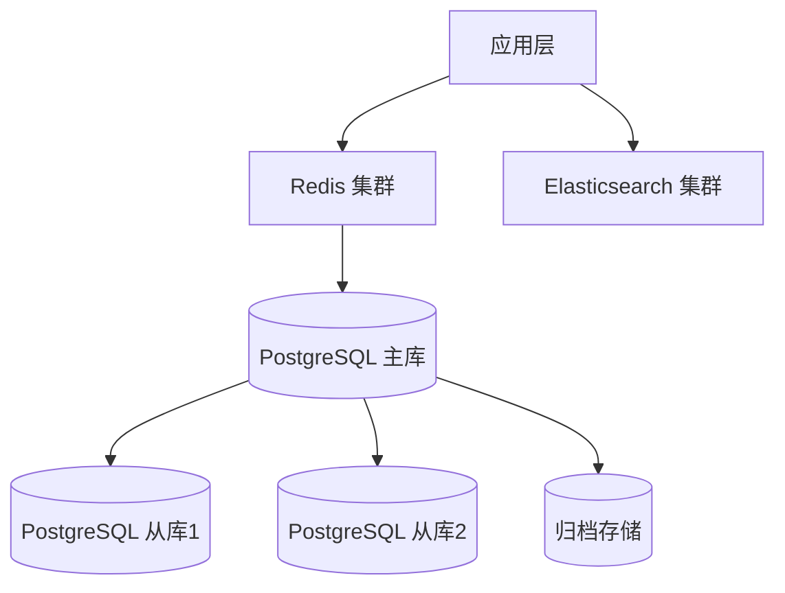
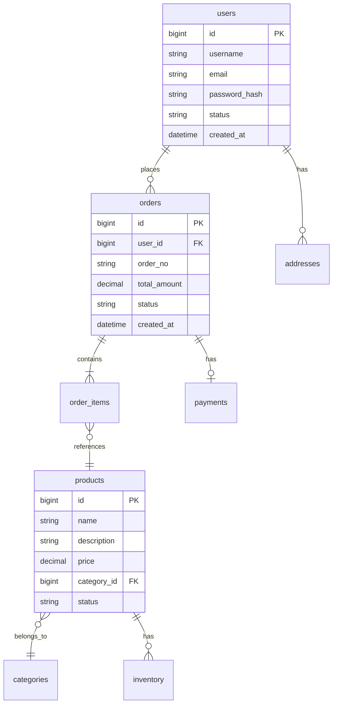

# S5-A03 Demo 示例

## 示例：电商系统数据架构设计

### 输入

```
Plan 定义文件：artifacts/plans/P000001.md
- Plan ID: P000001
- 执行模式：常规模式

前置产物：
- P000001-S5-A02-001 (架构视图设计文档)
- P000001-S2-S202-001 (显性需求提取清单 - 数据需求部分)
- P000001-S3-S303-001 (非功能需求报告)
- P000001-S5-A01-001 (架构愿景文档)

领域模型（逻辑视图）：
- 用户(User) - 核心实体
- 商品(Product) - 核心实体
- 订单(Order) - 核心聚合根
- 订单项(OrderItem) - 订单附属实体
- 支付(Payment) - 核心实体
- 库存(Inventory) - 核心实体
- 地址(Address) - 值对象
- 分类(Category) - 层级实体
```

### 处理过程

1. **前置校验** → 所有文件存在，领域模型包含8个实体，校验通过
2. **读取前置产物** → 提取数据特征和约束条件
3. **数据特征分析**：
   - 数据结构：结构化数据为主
   - 数据关系：复杂关系（订单关联用户、商品、支付）
   - 数据规模：预估年订单5000万条
   - 访问模式：读多写少（商品浏览），写多读少（日志）
   - 一致性要求：订单/支付强一致性，日志最终一致性
   - 查询特征：点查（订单详情）、范围查（订单列表）、全文检索（商品搜索）
4. **存储方案推导**：
   - 主存储：PostgreSQL（ACID事务，复杂查询）
   - 缓存：Redis（会话、热点商品）
   - 搜索引擎：Elasticsearch（商品全文检索）
5. **数据模型设计** → 设计ER图，包含8个核心表
6. **核心表结构设计** → 详细设计users、products、orders、order_items等表
7. **数据流转设计** → 热数据(7天)/温数据(90天)/冷数据(归档)
8. **用户交互** → 确认存储选型方案
9. **生成数据架构文档** → 生成 P000001-S5-A03-001.md
10. **后置校验** → 校验通过
11. **用户评审** → 等待用户确认

### 输出

```
产物ID: P000001-S5-A03-001
主存储: PostgreSQL
缓存: Redis
搜索引擎: Elasticsearch
核心表数量: 12个
预估数据量: 5000万条/年
```

---

## 数据架构设计文档示例结构

```markdown
# 数据架构设计文档 - P000001-S5-A03-001

## 1. 执行摘要

| 项目 | 内容 |
|------|------|
| **主存储** | PostgreSQL 15 |
| **缓存层** | Redis 7.0 |
| **搜索引擎** | Elasticsearch 8.x |
| **核心表数量** | 12 个 |
| **预估年数据量** | 5000 万条订单 |
| **数据架构风险** | 低 |

## 2. 数据特征分析

### 2.1 数据类型分布

| 数据类型 | 代表实体 | 数据量 | 增长率 | 访问模式 |
|----------|----------|--------|--------|----------|
| 结构化数据 | 用户、订单、商品 | 高 | 10%/月 | 读多写少 |
| 半结构化数据 | 商品属性、用户偏好 | 中 | 5%/月 | 读写均衡 |
| 日志数据 | 操作日志、访问记录 | 高 | 20%/月 | 写多读少 |

### 2.2 访问模式分析

| 查询类型 | 频率 | 响应要求 | 优化策略 |
|----------|------|----------|----------|
| 订单详情查询 | 高 | < 100ms | 索引优化 + 缓存 |
| 商品列表查询 | 高 | < 200ms | 分页 + 搜索引擎 |
| 用户订单列表 | 中 | < 300ms | 分区索引 |
| 商品全文检索 | 中 | < 500ms | Elasticsearch |

## 3. 存储架构设计

### 3.1 存储选型

| 数据类别 | 存储类型 | 具体产品 | 选型理由 |
|----------|----------|----------|----------|
| 核心业务数据 | 关系型 | PostgreSQL | ACID支持，复杂查询，团队熟悉 |
| 会话数据 | 键值存储 | Redis | 高性能，过期支持 |
| 商品搜索 | 搜索引擎 | Elasticsearch | 全文检索，相关性排序 |

### 3.2 存储部署架构



## 4. 数据模型设计

### 4.1 逻辑数据模型



### 4.2 核心表清单

| 表名 | 中文名 | 用途说明 | 预估数据量 |
|------|--------|----------|------------|
| users | 用户表 | 存储用户基本信息 | 100 万 |
| products | 商品表 | 存储商品信息 | 10 万 |
| orders | 订单表 | 存储订单主数据 | 5000 万 |
| order_items | 订单明细表 | 存储订单商品明细 | 2 亿 |
| payments | 支付记录表 | 存储支付信息 | 5000 万 |
| inventory | 库存表 | 存储商品库存 | 10 万 |
| categories | 分类表 | 存储商品分类 | 1000 |
| addresses | 地址表 | 存储用户地址 | 200 万 |

## 5. 核心表结构设计

### 表名：orders（订单表）

**描述**：订单主数据表，存储订单核心信息

**字段清单**：

| 字段名 | 类型 | 约束 | 说明 |
|--------|------|------|------|
| id | BIGINT | PK, AUTO_INCREMENT | 订单唯一标识 |
| order_no | VARCHAR(32) | NOT NULL, UNIQUE | 订单编号 |
| user_id | BIGINT | NOT NULL, FK | 用户ID |
| total_amount | DECIMAL(12,2) | NOT NULL | 订单总金额 |
| status | TINYINT | NOT NULL, DEFAULT 1 | 状态（1待支付 2已支付 3已发货 4已完成 5已取消） |
| shipping_address | JSON | NOT NULL | 配送地址 |
| created_at | DATETIME | NOT NULL | 创建时间 |
| updated_at | DATETIME | NOT NULL | 更新时间 |
| paid_at | DATETIME | NULL | 支付时间 |
| shipped_at | DATETIME | NULL | 发货时间 |

**索引**：

| 索引名 | 索引类型 | 字段 | 说明 |
|--------|----------|------|------|
| PRIMARY | 主键索引 | id | 聚簇索引 |
| uk_order_no | 唯一索引 | order_no | 订单编号唯一 |
| idx_user_id | 普通索引 | user_id | 用户订单查询 |
| idx_status | 普通索引 | status | 状态筛选 |
| idx_created_at | 普通索引 | created_at | 时间范围查询 |

**表关系**：
- N:1 → users (user_id)
- 1:N → order_items (order_id)
- 1:1 → payments (order_id)

## 6. 数据流转设计

### 6.1 数据生命周期


| 阶段 | 存储位置 | 保留时间 | 迁移策略 |
|------|----------|----------|----------|
| 热数据 | PostgreSQL 主库 | 7 天 | - |
| 温数据 | PostgreSQL 分区表 | 90 天 | 自动分区迁移 |
| 冷数据 | 归档存储 | 3 年 | 定时归档任务 |

### 6.2 数据同步策略

| 同步场景 | 源 | 目标 | 同步方式 | 延迟要求 |
|----------|-----|------|----------|----------|
| 主从复制 | 主库 | 从库 | 流复制 | < 1s |
| 缓存同步 | 数据库 | Redis | 发布订阅 | < 100ms |
| 搜索索引 | 数据库 | ES | CDC | < 5s |

## 7. 数据治理

### 7.1 数据安全策略

| 安全维度 | 措施 | 实施方式 |
|----------|------|----------|
| 访问控制 | 角色权限 | RBAC模型 |
| 加密存储 | 敏感字段加密 | AES-256 |
| 脱敏处理 | 查询时脱敏 | 动态脱敏 |
| 审计日志 | 操作审计 | 审计表记录 |

### 7.2 备份恢复策略

| 备份类型 | 频率 | 保留期 | 恢复目标 |
|----------|------|--------|----------|
| 全量备份 | 每日 | 30 天 | RTO: 4h |
| 增量备份 | 每小时 | 7 天 | RTO: 1h |
| 日志备份 | 每5分钟 | 3 天 | RTO: 15min |

## 8. 容量规划

| 指标 | 当前 | 1年预测 | 3年预测 |
|------|------|---------|---------|
| 存储容量 | 500GB | 2TB | 10TB |
| QPS（读） | 1000 | 5000 | 20000 |
| QPS（写） | 200 | 1000 | 5000 |
| 缓存容量 | 16GB | 64GB | 256GB |

## 9. 设计决策

| 决策项 | 决策结果 | 决策理由 | 决策方式 |
|--------|----------|----------|----------|
| 主存储选型 | PostgreSQL | ACID事务、复杂查询、团队熟悉 | 自动推导 |
| 缓存策略 | Cache-Aside | 灵活控制，适合读多写少 | 自动推导 |
| 分区策略 | 按月分区 | 适合订单时间序列特征 | 用户选择 |

## 10. 风险与约束

### 10.1 数据架构风险

| 风险描述 | 风险等级 | 缓解策略 |
|----------|----------|----------|
| 数据量增长超预期 | 中 | 监控告警，提前扩容 |
| 主从延迟 | 低 | 读写分离策略优化 |
| 缓存穿透 | 低 | 布隆过滤器 |
```

---

## 用户交互示例

### 场景：存储选型确认

**系统提示**：

```
【数据架构设计 - 存储选型确认】

基于数据特征分析，推荐以下存储方案：

A. PostgreSQL 单库 + Redis 缓存（推荐）
   - 适合当前数据规模（年5000万订单）
   - ACID事务保证订单一致性
   - Redis缓存提升热点数据访问性能
   - 团队技术栈匹配度高

B. PostgreSQL + Redis + Elasticsearch
   - 在方案A基础上增加Elasticsearch
   - 提升商品全文检索能力
   - 增加运维复杂度
   - 建议后续根据实际检索需求评估

C. MySQL + Redis + Elasticsearch
   - MySQL生态更成熟
   - 与PostgreSQL方案能力相当
   - 团队MySQL经验较少

请选择存储方案（A/B/C）：
```

**用户响应**：A

**系统处理**：确认方案A，继续设计数据模型
```
根据您的选择，将采用 **PostgreSQL + Redis** 方案进行数据架构设计。
正在继续设计数据模型和核心表结构...
```
