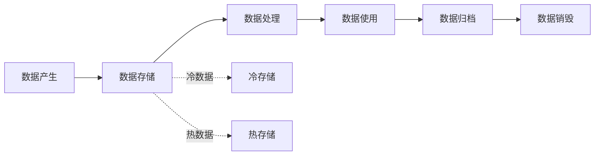
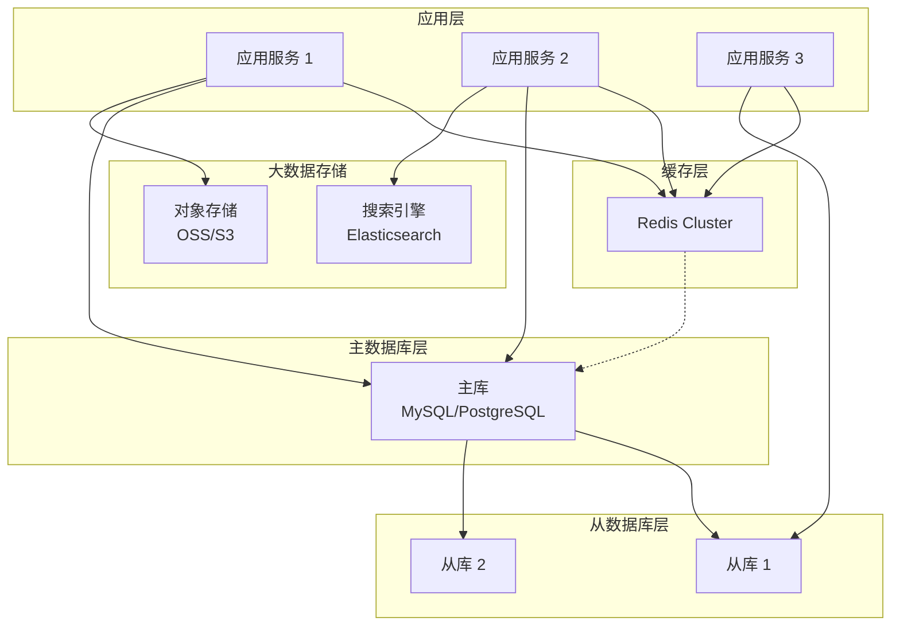
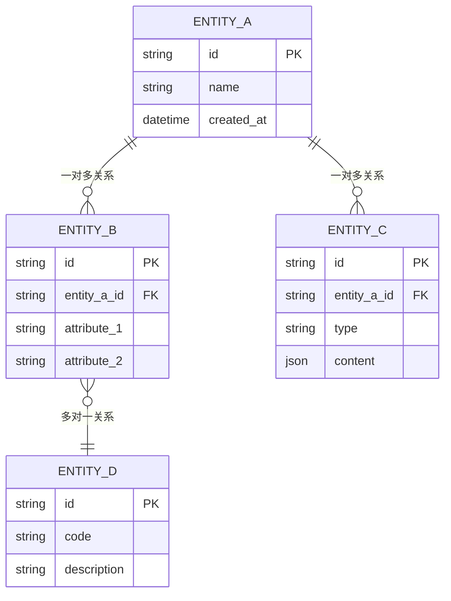
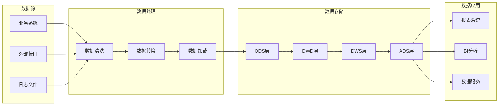

# S5-A03 输出模板：数据架构设计文档

## 模板说明

本模板用于 S5-A03（数据架构设计）的输出产物：**数据架构设计文档**。

**产物 ID 格式**：`{PlanID}-S5-A03-001`

**存储路径**：`artifacts/stages/s5/{PlanID}-S5-A03-001.md`

**模板版本**：1.0

---

## 模板内容

```markdown
# 数据架构设计文档

## 元信息

| 项目 | 内容 |
|-----|------|
| **文档 ID** | {PlanID}-S5-A03-001 |
| **Plan ID** | {PlanID} |
| **Skill 编号** | S5-A03 |
| **Skill 名称** | 数据架构设计 |
| **生成时间** | {YYYY-MM-DD HH:MM} |
| **版本** | v1.0 |

---

## 一、数据架构概览

### 1.1 执行摘要

**设计目标**：
- 建立满足业务需求的数据架构
- 确保数据的一致性、完整性和安全性
- 支持系统的可扩展性和高性能

**数据规模预估**：

| 指标 | 预估数值 | 说明 |
|-----|---------|------|
| 日新增数据量 | {数值} | {说明} |
| 总数据量（3年） | {数值} | {说明} |
| 峰值 QPS | {数值} | {说明} |
| 数据增长率 | {百分比} | {说明} |

### 1.2 质量评估

| 质量维度 | 得分 | 权重 | 加权得分 | 评估说明 |
|---------|------|------|---------|---------|
| 完整性 | {XX}% | 25% | {XX} | {说明} |
| 准确性 | {XX}% | 25% | {XX} | {说明} |
| 一致性 | {XX}% | 20% | {XX} | {说明} |
| 可追溯性 | {XX}% | 15% | {XX} | {说明} |
| 可实施性 | {XX}% | 15% | {XX} | {说明} |
| **综合得分** | - | 100% | **{XX}%** | {等级评定} |

**质量等级**：{优秀/良好/合格/不合格}

---

## 二、数据特征分析

### 2.1 数据分类

| 数据类型 | 数据描述 | 数据量 | 访问频率 | 增长趋势 | 存储要求 |
|---------|---------|--------|---------|---------|---------|
| 结构化数据 | {描述} | {大小} | {高/中/低} | {趋势} | {要求} |
| 半结构化数据 | {描述} | {大小} | {高/中/低} | {趋势} | {要求} |
| 非结构化数据 | {描述} | {大小} | {高/中/低} | {趋势} | {要求} |

### 2.2 数据域划分

| 数据域 | 业务含义 | 包含实体 | 数据量 | 负责人 |
|-------|---------|---------|--------|--------|
| {域 1} | {含义} | {实体列表} | {大小} | {负责人} |
| {域 2} | {含义} | {实体列表} | {大小} | {负责人} |
| {域 3} | {含义} | {实体列表} | {大小} | {负责人} |

### 2.3 数据生命周期



### 2.4 数据特征矩阵

| 特征维度 | 业务数据 | 日志数据 | 配置数据 | 缓存数据 |
|---------|---------|---------|---------|---------|
| 一致性要求 | {高/中/低} | {高/中/低} | {高/中/低} | {高/中/低} |
| 可用性要求 | {高/中/低} | {高/中/低} | {高/中/低} | {高/中/低} |
| 持久化要求 | {是/否} | {是/否} | {是/否} | {是/否} |
| 备份要求 | {是/否} | {是/否} | {是/否} | {是/否} |
| 加密要求 | {是/否} | {是/否} | {是/否} | {是/否} |

---

## 三、存储架构设计

### 3.1 存储技术选型

| 存储类型 | 技术选型 | 版本 | 选择理由 | 适用场景 |
|---------|---------|------|---------|---------|
| 关系型数据库 | {MySQL/PostgreSQL/Oracle} | {版本} | {理由} | {场景} |
| 缓存数据库 | {Redis/Memcached} | {版本} | {理由} | {场景} |
| 文档数据库 | {MongoDB/Elasticsearch} | {版本} | {理由} | {场景} |
| 对象存储 | {OSS/S3/MinIO} | {版本} | {理由} | {场景} |
| 消息队列 | {RabbitMQ/Kafka/RocketMQ} | {版本} | {理由} | {场景} |

### 3.2 存储架构图



### 3.3 存储层职责

| 存储层 | 主要职责 | 存储数据 | 性能目标 | 可用性目标 |
|-------|---------|---------|---------|-----------|
| 缓存层 | {职责} | {数据} | {目标} | {目标} |
| 主数据库 | {职责} | {数据} | {目标} | {目标} |
| 从数据库 | {职责} | {数据} | {目标} | {目标} |
| 对象存储 | {职责} | {数据} | {目标} | {目标} |

### 3.4 容量规划

| 存储类型 | 当前容量 | 1年容量 | 3年容量 | 扩容策略 |
|---------|---------|--------|--------|---------|
| 关系型数据库 | {容量} | {容量} | {容量} | {策略} |
| 缓存数据库 | {容量} | {容量} | {容量} | {策略} |
| 对象存储 | {容量} | {容量} | {容量} | {策略} |

---

## 四、数据模型设计

### 4.1 概念数据模型



### 4.2 实体清单

| 实体名称 | 实体描述 | 数据量预估 | 增长频率 | 关键属性 |
|---------|---------|-----------|---------|---------|
| {实体 A} | {描述} | {数量} | {频率} | {属性} |
| {实体 B} | {描述} | {数量} | {频率} | {属性} |
| {实体 C} | {描述} | {数量} | {频率} | {属性} |

### 4.3 实体关系说明

| 关系 | 源实体 | 目标实体 | 关系类型 | 关系描述 | 级联规则 |
|-----|-------|---------|---------|---------|---------|
| {关系 1} | {实体 A} | {实体 B} | {1:1/1:N/N:M} | {描述} | {规则} |
| {关系 2} | {实体 B} | {实体 C} | {1:1/1:N/N:M} | {描述} | {规则} |

---

## 五、核心表结构设计

### 5.1 表清单

| 表名 | 中文名 | 所属域 | 数据量 | 主要用途 |
|-----|-------|--------|--------|---------|
| {表名 1} | {中文名} | {域} | {数量} | {用途} |
| {表名 2} | {中文名} | {域} | {数量} | {用途} |
| {表名 3} | {中文名} | {域} | {数量} | {用途} |

### 5.2 核心表详情

#### 表：{table_name}

**基本信息**：
- 表名：{table_name}
- 中文名：{中文名}
- 所属域：{数据域}
- 存储引擎：{InnoDB/MyISAM/其他}
- 字符集：{utf8mb4/其他}

**字段定义**：

| 字段名 | 数据类型 | 长度 | 是否为空 | 默认值 | 说明 | 索引 |
|-------|---------|------|---------|--------|------|------|
| id | BIGINT | - | 否 | 自增 | 主键 | PK |
| {字段 1} | {类型} | {长度} | {是/否} | {默认值} | {说明} | {索引} |
| {字段 2} | {类型} | {长度} | {是/否} | {默认值} | {说明} | {索引} |
| created_at | DATETIME | - | 否 | CURRENT_TIMESTAMP | 创建时间 | - |
| updated_at | DATETIME | - | 否 | CURRENT_TIMESTAMP | 更新时间 | - |

**索引设计**：

| 索引名 | 索引类型 | 索引字段 | 说明 |
|-------|---------|---------|------|
| PRIMARY | 主键 | id | 主键索引 |
| idx_{name} | 普通 | {字段} | {说明} |
| uk_{name} | 唯一 | {字段} | {说明} |

**表关系**：
- 外键：{外键定义}
- 关联表：{关联表列表}

**分区策略**：
- 分区类型：{分区类型}
- 分区键：{分区键}
- 分区数量：{数量}

---

#### 表：{table_name_2}

**基本信息**：
- 表名：{table_name_2}
- 中文名：{中文名}
- 所属域：{数据域}

**字段定义**：

| 字段名 | 数据类型 | 长度 | 是否为空 | 默认值 | 说明 | 索引 |
|-------|---------|------|---------|--------|------|------|
| id | BIGINT | - | 否 | 自增 | 主键 | PK |
| {字段 1} | {类型} | {长度} | {是/否} | {默认值} | {说明} | {索引} |

---

### 5.3 分区策略

| 表名 | 分区类型 | 分区键 | 分区数量 | 分区规则 |
|-----|---------|--------|---------|---------|
| {表名} | {RANGE/LIST/HASH} | {字段} | {N} | {规则} |

### 5.4 分表策略

| 表名 | 分表策略 | 分表键 | 分表数量 | 路由规则 |
|-----|---------|--------|---------|---------|
| {表名} | {策略} | {字段} | {N} | {规则} |

---

## 六、数据流转设计

### 6.1 数据流图



### 6.2 数据流转说明

| 数据流 | 源系统 | 目标系统 | 流转方式 | 频率 | 数据量 | 延迟要求 |
|-------|-------|---------|---------|------|--------|---------|
| {流 1} | {源} | {目标} | {方式} | {频率} | {数据量} | {延迟} |
| {流 2} | {源} | {目标} | {方式} | {频率} | {数据量} | {延迟} |

### 6.3 数据同步策略

| 同步场景 | 同步方式 | 同步频率 | 一致性要求 | 异常处理 |
|---------|---------|---------|-----------|---------|
| {场景 1} | {实时/准实时/批量} | {频率} | {强/最终} | {处理} |
| {场景 2} | {实时/准实时/批量} | {频率} | {强/最终} | {处理} |

### 6.4 数据集成方案

| 集成类型 | 集成方式 | 技术方案 | 使用场景 |
|---------|---------|---------|---------|
| 数据库集成 | {方式} | {方案} | {场景} |
| API 集成 | {方式} | {方案} | {场景} |
| 文件集成 | {方式} | {方案} | {场景} |
| 消息集成 | {方式} | {方案} | {场景} |

---

## 七、数据治理

### 7.1 数据质量标准

| 质量维度 | 检查规则 | 检查频率 | 阈值 | 处理方式 |
|---------|---------|---------|------|---------|
| 完整性 | {规则} | {频率} | {阈值} | {处理} |
| 准确性 | {规则} | {频率} | {阈值} | {处理} |
| 一致性 | {规则} | {频率} | {阈值} | {处理} |
| 及时性 | {规则} | {频率} | {阈值} | {处理} |
| 唯一性 | {规则} | {频率} | {阈值} | {处理} |

### 7.2 数据安全策略

| 安全级别 | 数据类型 | 加密方式 | 访问控制 | 审计要求 |
|---------|---------|---------|---------|---------|
| 核心数据 | {类型} | {加密} | {控制} | {审计} |
| 敏感数据 | {类型} | {加密} | {控制} | {审计} |
| 普通数据 | {类型} | {加密} | {控制} | {审计} |
| 公开数据 | {类型} | {加密} | {控制} | {审计} |

### 7.3 数据备份策略

| 备份类型 | 备份频率 | 保留周期 | 存储位置 | 恢复时间目标 |
|---------|---------|---------|---------|-------------|
| 全量备份 | {频率} | {周期} | {位置} | {RTO} |
| 增量备份 | {频率} | {周期} | {位置} | {RTO} |
| 日志备份 | {频率} | {周期} | {位置} | {RTO} |

### 7.4 数据归档策略

| 数据类型 | 归档条件 | 归档频率 | 归档存储 | 保留期限 |
|---------|---------|---------|---------|---------|
| {类型} | {条件} | {频率} | {存储} | {期限} |

---

## 八、性能优化策略

### 8.1 读写分离策略

| 数据源 | 读写类型 | 路由策略 | 延迟容忍 |
|-------|---------|---------|---------|
| 主库 | 写 + 实时读 | {策略} | {容忍} |
| 从库 1 | 读 | {策略} | {容忍} |
| 从库 2 | 读 | {策略} | {容忍} |

### 8.2 缓存策略

| 缓存类型 | 缓存内容 | 过期策略 | 更新策略 | 命中率目标 |
|---------|---------|---------|---------|-----------|
| 本地缓存 | {内容} | {策略} | {策略} | {目标} |
| 分布式缓存 | {内容} | {策略} | {策略} | {目标} |

### 8.3 索引优化

| 表名 | 索引优化项 | 优化理由 | 预期效果 |
|-----|-----------|---------|---------|
| {表名} | {优化项} | {理由} | {效果} |

### 8.4 查询优化

| 优化类型 | 优化措施 | 适用场景 | 预期效果 |
|---------|---------|---------|---------|
| SQL 优化 | {措施} | {场景} | {效果} |
| 分页优化 | {措施} | {场景} | {效果} |
| 聚合优化 | {措施} | {场景} | {效果} |

---

## 九、用户交互记录

### 9.1 交互记录清单

| 轮次 | 时间 | 交互类型 | 问题描述 | 用户输入 | 处理结果 |
|------|------|---------|---------|---------|---------|
| 1 | {时间} | 存储选型确认 | {问题} | {输入} | {结果} |
| 2 | {时间} | 数据模型确认 | {问题} | {输入} | {结果} |
| ... | ... | ... | ... | ... | ... |

### 9.2 交互记录详情

{详细的交互记录内容}

---

## 十、附录

### 10.1 术语表

| 术语 | 定义 |
|------|------|
| ODS | Operational Data Store，操作数据存储 |
| DWD | Data Warehouse Detail，明细数据层 |
| DWS | Data Warehouse Service，服务数据层 |
| ADS | Application Data Store，应用数据层 |
| ETL | Extract-Transform-Load，数据抽取转换加载 |
| CDC | Change Data Capture，变更数据捕获 |

### 10.2 参考文档

- [S5-A03 SKILL.md](SKILL.md) - 数据架构设计 Skill
- {PlanID}-S5-A01-001.md - 架构愿景文档
- {PlanID}-S5-A02-001.md - 架构视图设计文档

### 10.3 变更记录

| 变更日期 | 变更内容 | 变更原因 | 操作人 |
|---------|---------|---------|--------|
| {日期} | {内容} | {原因} | {操作人} |

---

*文档生成时间：{YYYY-MM-DD HH:MM}*
*模板版本：v1.0*
```

---

## 使用说明

### 填充规则

1. **变量替换**: 将所有 `{变量名}` 替换为实际值
2. **图表更新**: 更新 Mermaid 图表以反映实际数据架构
3. **表结构扩展**: 根据实际设计扩展表结构定义
4. **数据流调整**: 根据实际业务调整数据流转

### 质量检查清单

生成文档后，应检查：
- [ ] 所有变量已正确替换
- [ ] 数据特征分析完整
- [ ] 存储架构设计合理
- [ ] 数据模型定义清晰
- [ ] 核心表结构完整
- [ ] 数据流转设计清晰
- [ ] Markdown 格式规范
- [ ] 产物 ID 符合标准格式

---

*本模板符合数据架构设计最佳实践*
