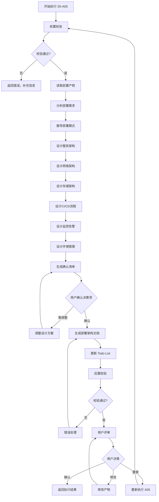
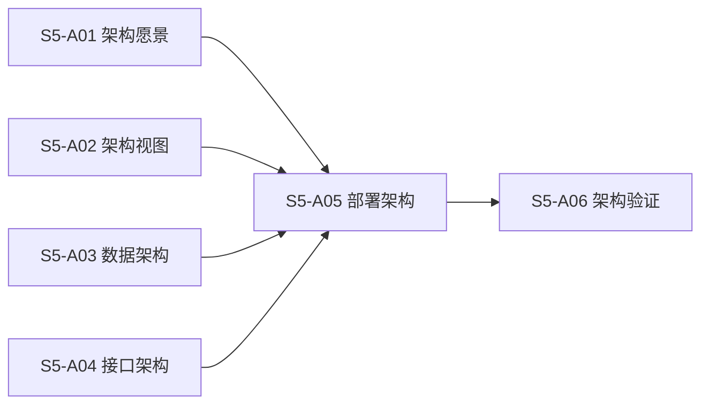
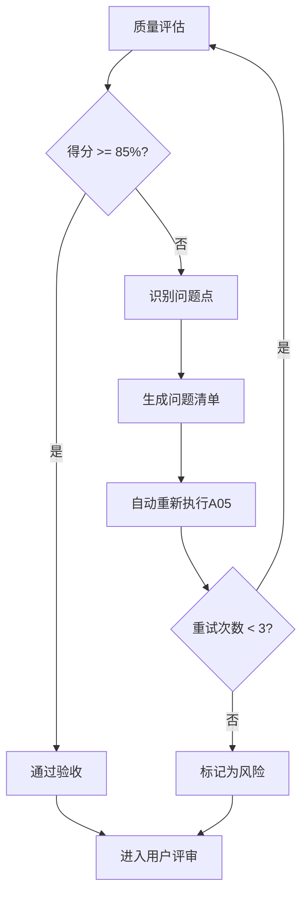

# S5-A05: 部署架构设计

## Section 1: 元信息 (Meta Information)

| 项目 | 内容 |
|------|------|
| **Skill 编号** | S5-A05 |
| **Skill 名称** | 部署架构设计 |
| **Skill 英文名称** | Deployment Architecture Design |
| **所属阶段** | S5 - 架构设计阶段 |
| **执行顺序** | S5 阶段第 5 个执行 |
| **执行模式** | 自动分析 + 用户交互 |
| **依赖 Skill** | S5-A04 (接口架构设计) |
| **后置 Skill** | S5-A06 (架构验证与评审) |
| **参考标准** | The Twelve-Factor App, Docker最佳实践, Kubernetes设计模式 |
| **版本** | v3.2.0 |
| **最后更新时间** | 2026-03-28 |

## Contract

| 项目 | 内容 |
|------|------|
| **Skill ID** | S5-A05 |
| **Stage** | S5 |
| **Directory** | skills/s5-deployment |
| **Depends On** | S5-A04 |
| **Next (Normal)** | S5-A06 |
| **Next (Lightweight)** | S5-A06 |
| **Lightweight Skip** | No |
| **Required Inputs** | 参见 workflow-manifest.yaml |
| **Outputs** | artifacts/stages/s5/{PlanID}-S5-A05-001.md |

## Section 2: 功能描述 (Functional Description)

### 2.1 核心职责

S5-A05 负责设计系统部署架构，确保系统可以可靠、高效、安全地运行：

1. **部署模式选择**：基于系统特征推荐最优部署模式（Docker Compose/Kubernetes/FaaS等）
2. **服务架构设计**：定义容器化服务划分、资源需求、服务依赖关系
3. **网络架构设计**：设计网络拓扑、安全策略、流量管理方案
4. **存储架构设计**：选择存储类型、设计持久化策略、备份恢复方案
5. **CI/CD 流程设计**：设计持续集成/持续部署流水线、部署策略、回滚机制
6. **监控告警方案**：设计可观测性架构、监控指标体系、告警策略
7. **环境管理设计**：规划环境划分、配置管理、密钥管理策略

### 2.2 输入规范 (Input Specifications)

#### 核心输入

| 内容 | 要求 | 来源 |
|------|------|------|
| 架构愿景文档 | 必填，包含系统特征、规模等级 | S5-A01 产物 |
| 架构视图设计文档 | 必填，包含分层架构、模块划分 | S5-A02 产物 |
| 数据架构设计文档 | 必填，包含存储方案、数据流 | S5-A03 产物 |
| 接口架构设计文档 | 必填，包含API设计、外部集成 | S5-A04 产物 |
| 非功能需求 | 必填，包含性能、可用性、安全要求 | 需求工程阶段 |
| 部署约束 | 可选，包含预算、技术栈限制、合规要求 | 需求工程阶段 |

#### 输入示例

```
架构愿景文档：artifacts/stages/s5/{PlanID}/{PlanID}-S5-A01-001.md
- 系统类型：电商平台
- 规模等级：中型（日活10万）
- 关键特征：高可用、弹性扩展

架构视图设计文档：artifacts/stages/s5/{PlanID}/{PlanID}-S5-A02-001.md
- 分层架构：前端层、网关层、服务层、数据层
- 模块划分：用户服务、商品服务、订单服务、支付服务

非功能需求：
- 可用性：99.9% SLA
- 响应时间：< 200ms (P95)
- 安全等级：等保二级

部署约束：
- 预算：50万/年
- 云服务商：阿里云
- 技术栈偏好：容器化部署
```

### 2.3 输出规范 (Output Specifications)

#### 产物清单

| 产物名称 | 文件位置 | 格式 | 用途 | 用户可见性 |
|---------|----------|------|------|-----------|
| 部署架构设计文档 | `artifacts/stages/s5/{PlanID}/{PlanID}-S5-A05-001.md` | Markdown | 完整部署方案 | 用户可查看 |
| Todo-List 更新 | `artifacts/plans/{PlanID}/todo-list.md` | Markdown | 更新 A05 任务状态 | 用户可查看 |

#### 用户可访问的核心产物

**部署架构设计文档**（Markdown 格式）包含：

1. **部署模式选择**：模式选型分析、技术栈选型、云服务选择
2. **服务架构设计**：服务清单、服务依赖关系、资源需求估算
3. **网络架构设计**：网络拓扑、安全策略、流量管理
4. **存储架构设计**：存储类型选择、数据持久化策略、备份恢复方案
5. **CI/CD 流程设计**：流水线架构、阶段定义、部署策略、回滚机制
6. **监控告警方案**：可观测性架构、监控指标体系、告警分级策略
7. **环境管理**：环境划分、配置管理、密钥管理
8. **运维手册**：部署操作指南、故障排查流程、扩容缩容指南
9. **关键决策记录**：决策清单、决策理由

## Section 3: 执行流程 (Execution Process)

### 3.1 流程概览



### 3.2 详细步骤说明

详细执行步骤参见 [references/execution-details.md](references/execution-details.md)

### 3.3 Todo-List 更新规则

**更新时机与内容**：

| 执行阶段 | 更新时机 | 更新内容 |
|---------|---------|---------|
| Skill 执行开始 | 前置校验通过后 | A05 任务状态：待执行 → 执行中 |
| 用户决策确认后 | 步骤 10 完成后 | 记录用户决策结果 |
| Skill 执行完成 | 步骤 11 完成后 | A05 任务状态：执行中 → 已完成，评审状态：待评审 |
| 用户评审后 | 步骤 13 完成后 | 根据评审结果更新状态 |

**详细规则**：详见 [execution-flow-standard.md](../_shared/execution-flow-standard.md) 中的"Todo-List更新规则"章节。

### 3.4 Demo 示例

参见 [references/examples.md](references/examples.md)

## Section 4: 产物规范 (Artifact Specifications)

### 4.1 产物清单

| 产物名称 | 产物 ID | 存储路径 | 说明 |
|---------|---------|----------|------|
| 部署架构设计文档 | `{PlanID}-S5-A05-001` | `artifacts/stages/s5/{PlanID}/{PlanID}-S5-A05-001.md` | 完整部署架构设计方案 |

### 4.2 产物依赖关系



### 4.3 通用规范

- **产物 ID 命名规则**：详见 [artifact-specifications.md](../_shared/artifact-specifications.md) 第 2 章
- **存储路径结构**：详见 [artifact-specifications.md](../_shared/artifact-specifications.md) 第 3 章
- **版本管理规则**：详见 [artifact-specifications.md](../_shared/artifact-specifications.md) 第 4 章
- **产物模板**：使用 [template.md](template.md)

## Section 5: 质量标准 (Quality Standards)

### 5.1 质量评估框架

S5-A05 遵循 [quality-standard.md](../_shared/quality-standard.md) 中的 ISO/IEC 25010 质量评估框架：

| 维度 | 权重 | 评估标准 | 验收阈值 |
|------|------|----------|----------|
| **完整性** | 30% | 所有部署架构章节已完整生成 | ≥ 90% |
| **准确性** | 25% | 部署方案与技术选型匹配，资源估算合理 | ≥ 90% |
| **一致性** | 20% | 与前置架构设计产物保持一致 | ≥ 95% |
| **可读性** | 15% | 结构清晰，图表易懂 | ≥ 85% |
| **可追溯性** | 10% | 决策理由明确，依赖关系清晰 | ≥ 90% |

**验收门槛**：质量综合得分 ≥ 85%

### 5.2 S5-A05 特定检查清单

**完整性检查**：

- [ ] 部署模式选择已完成（包含选型分析、技术栈选型、云服务选择）
- [ ] 服务架构设计已完成（包含服务清单、依赖关系、资源估算）
- [ ] 网络架构设计已完成（包含网络拓扑、安全策略、流量管理）
- [ ] 存储架构设计已完成（包含存储类型、持久化策略、备份方案）
- [ ] CI/CD 流程设计已完成（包含流水线架构、阶段定义、部署策略）
- [ ] 监控告警方案已完成（包含可观测性架构、指标体系、告警策略）
- [ ] 环境管理设计已完成（包含环境划分、配置管理、密钥管理）
- [ ] 关键决策记录已完整

**准确性检查**：

- [ ] 部署模式与系统规模匹配
- [ ] 资源估算与性能需求匹配
- [ ] 技术选型与团队技术栈匹配
- [ ] 预算估算在约束范围内

**一致性检查**：

- [ ] 服务划分与架构视图设计一致
- [ ] 存储方案与数据架构设计一致
- [ ] API网关与接口架构设计一致
- [ ] 安全策略与非功能需求一致

**可读性检查**：

- [ ] 网络拓扑图清晰易懂
- [ ] CI/CD 流程图完整
- [ ] 服务依赖关系图清晰

**可追溯性检查**：

- [ ] 每个关键决策有明确理由
- [ ] 与前置产物的关联清晰
- [ ] 用户确认记录完整

### 5.3 质量综合得分计算

```
得分 = Σ(维度得分 × 维度权重)

示例：
- 完整性：95% × 30% = 28.5
- 准确性：90% × 25% = 22.5
- 一致性：100% × 20% = 20.0
- 可读性：90% × 15% = 13.5
- 可追溯性：95% × 10% = 9.5
- 总分：28.5 + 22.5 + 20.0 + 13.5 + 9.5 = 94.0%
```

### 5.4 验收标准

| 结果 | 标准 | 处理方式 |
|------|------|----------|
| **通过** | 质量综合得分 ≥ 85% | 进入用户评审阶段 |
| **不通过** | 质量综合得分 < 85% | 识别问题 → 生成问题清单 → 自动重新执行 |

### 5.5 不达标处理流程



**重试机制**：

- 第1次：自动重新执行，尝试修复问题
- 第2次：自动重新执行，调整参数
- 第3次：自动重新执行，简化复杂部分
- 仍不达标：标记为风险，进入用户评审并提示问题

## Section 6: 异常处理 (Exception Handling)

### 6.1 常见异常场景

**前置校验失败**（如输入文件不存在）：

- 错误代码：E001
- 处理策略：提示用户先执行前置 Skill（S5-A01/A02/A03/A04）

**部署模式选择冲突**：

- 错误代码：E151（S5阶段特定错误）
- 处理策略：列出备选方案，请求用户决策

**资源估算超预算**：

- 错误代码：E152（S5阶段特定错误）
- 处理策略：提供优化方案，调整资源配置

**技术选型不一致**：

- 错误代码：E153（S5阶段特定错误）
- 处理策略：标记冲突点，请求用户确认优先级

### 6.2 用户交互协议

当需要用户确认或决策时，使用标准化交互模板：

- **需求澄清**：使用 [user-interaction/clarification-template.md](../_shared/user-interaction/clarification-template.md)
- **信息收集**：使用 [user-interaction/information-collection-template.md](../_shared/user-interaction/information-collection-template.md)
- **方案选择**：使用 [user-interaction/option-selection-template.md](../_shared/user-interaction/option-selection-template.md)

### 6.3 恢复策略

| 异常类型 | 处理策略 | 重试次数 | 失败处理 |
|----------|----------|----------|----------|
| 前置产物缺失 | 请求用户执行前置Skill | - | 标记为阻塞 |
| 部署模式冲突 | 请求用户决策选择 | 最多3轮 | 使用推荐方案 |
| 资源超预算 | 提供优化方案 | 最多3轮 | 标记风险继续 |
| 技术选型冲突 | 标记冲突，请求确认 | 最多3轮 | 标记风险继续 |
| 用户交互超时 | 使用默认值继续 | - | 标记信息缺失 |

### 6.4 错误处理流程

详细错误处理流程参见 [execution-flow-standard.md](../_shared/execution-flow-standard.md) 第 5 章。
