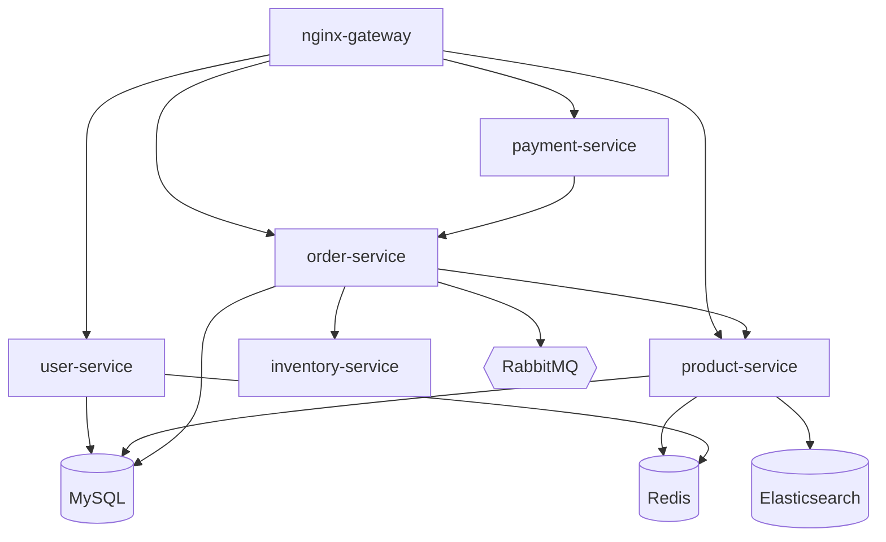
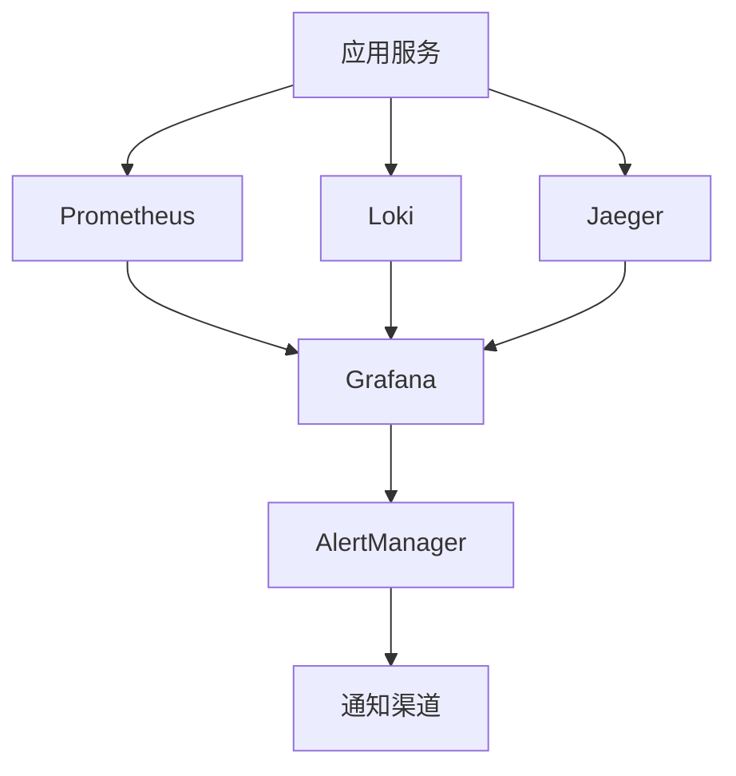

# S5-A05 Demo 示例

本文档包含 S5-A05 部署架构设计的完整示例（对应 SKILL.md Section 3.4）。

---

## 输入示例

```
架构愿景文档：artifacts/stages/s5/P000001/P000001-S5-A01-001.md
- 系统类型：电商平台
- 规模等级：中型（日活10万，峰值并发5000）
- 关键特征：高可用、弹性扩展、多租户

架构视图设计文档：artifacts/stages/s5/P000001/P000001-S5-A02-001.md
- 分层架构：前端层、网关层、服务层、数据层
- 模块划分：用户服务、商品服务、订单服务、支付服务、库存服务
- 技术栈：Spring Cloud 微服务架构

数据架构设计文档：artifacts/stages/s5/P000001/P000001-S5-A03-001.md
- 主数据库：MySQL 8.0（主从复制）
- 缓存：Redis Cluster
- 搜索引擎：Elasticsearch
- 消息队列：RabbitMQ

接口架构设计文档：artifacts/stages/s5/P000001/P000001-S5-A04-001.md
- API网关：Spring Cloud Gateway
- 外部集成：支付宝、微信支付、短信服务、OSS存储
- 接口协议：RESTful API + gRPC

非功能需求：
- 可用性：99.9% SLA
- 响应时间：< 200ms (P95)
- 安全等级：等保二级
- 数据保留：订单数据保留3年

部署约束：
- 预算：50万/年
- 云服务商：阿里云
- 团队规模：开发5人、运维2人
- 技术偏好：容器化部署
```

---

## 处理过程

1. **前置校验** → 检查所有前置产物存在性，校验通过
2. **读取前置产物** → 提取架构信息、规模等级、技术栈
3. **分析部署需求** → 中型规模、高可用要求、有运维团队
4. **推导部署模式** → 推荐 Kubernetes（托管版）
5. **设计服务架构** → 划分 12 个服务容器
6. **设计网络架构** → 4层网络架构 + 安全策略
7. **设计存储架构** → 块存储 + 对象存储 + 文件存储组合
8. **设计 CI/CD 流程** → GitLab CI + Helm + 滚动更新
9. **设计监控告警** → Prometheus + Grafana + ELK
10. **设计环境管理** → 4 环境（开发/测试/预发布/生产）
11. **生成确认清单** → 7 个关键决策项待确认
12. **生成部署架构文档** → P000001-S5-A05-001.md
13. **更新 Todo-List** → A05 状态：已完成，评审状态：待评审
14. **后置校验** → 产物格式、内容完整性检查通过
15. **用户评审** → 等待用户确认

---

## 输出示例

- **产物 ID**: P000001-S5-A05-001
- **产物路径**: artifacts/stages/s5/P000001/P000001-S5-A05-001.md
- **部署模式**: 阿里云 ACK（托管 Kubernetes）
- **服务数量**: 12 个
- **CI/CD 工具**: GitLab CI
- **监控方案**: Prometheus + Grafana + ELK
- **Todo-List 更新**: A05 已完成，待评审

---

## 生成的部署架构设计文档示例

```markdown
# 部署架构设计文档 - P000001-S5-A05-001

## 基本信息
- **Plan ID**: P000001
- **Skill ID**: S5-A05
- **执行时间**: 2026-03-28 14:00
- **执行模式**: 自动分析 + 用户交互

## 1. 部署模式选择

### 1.1 模式选型分析

基于系统特征分析：

| 特征维度 | 分析结果 | 影响因素 |
|----------|----------|----------|
| 系统规模 | 中型 | 日活10万，峰值并发5000 |
| 可用性要求 | 高可用 | 99.9% SLA |
| 扩展性要求 | 弹性扩展 | 需要应对促销流量高峰 |
| 运维能力 | 中等 | 2人运维团队 |
| 预算约束 | 中等 | 50万/年 |

**推荐部署模式**：Kubernetes（托管版）

**选型理由**：
1. 中型规模适合 K8s 管理复杂度
2. 高可用要求需要自动故障恢复
3. 弹性扩展需要自动扩缩容能力
4. 有运维团队可以维护 K8s 环境

### 1.2 技术栈选型

| 技术领域 | 选型 | 理由 |
|----------|------|------|
| 容器运行时 | Docker | 行业标准，生态完善 |
| 容器编排 | Kubernetes | 自动化运维，生态成熟 |
| 镜像仓库 | 阿里云 ACR | 与 ACK 集成良好 |
| 配置管理 | Nacos | Spring Cloud 生态 |

### 1.3 云服务选择

| 服务类型 | 选择 | 规格 | 月费用估算 |
|----------|------|------|-----------|
| 容器服务 | 阿里云 ACK | 3节点 | ¥3,000 |
| 云服务器 | ECS | 4核8G × 3 | ¥4,500 |
| 数据库 | RDS MySQL | 主从版 | ¥2,000 |
| 缓存 | Redis Cluster | 集群版 | ¥1,500 |
| 对象存储 | OSS | 标准存储 | ¥500 |
| 负载均衡 | SLB | 性能保障型 | ¥300 |
| **月费用合计** | | | **¥11,800** |

## 2. 服务架构设计

### 2.1 服务清单

| 服务名称 | 镜像 | 副本数 | CPU | 内存 | 说明 |
|----------|------|--------|-----|------|------|
| nginx-gateway | nginx:1.24 | 2 | 0.5 | 512Mi | API网关 |
| user-service | user:v1.0 | 2 | 1 | 1Gi | 用户服务 |
| product-service | product:v1.0 | 3 | 1 | 1Gi | 商品服务 |
| order-service | order:v1.0 | 3 | 1 | 1Gi | 订单服务 |
| payment-service | payment:v1.0 | 2 | 1 | 1Gi | 支付服务 |
| inventory-service | inventory:v1.0 | 2 | 0.5 | 512Mi | 库存服务 |
| scheduler | scheduler:v1.0 | 1 | 0.5 | 512Mi | 定时任务 |
| mysql | mysql:8.0 | 1 | 2 | 4Gi | 主数据库 |
| redis | redis:7.0 | 3 | 0.5 | 512Mi | 缓存集群 |
| rabbitmq | rabbitmq:3.12 | 1 | 0.5 | 512Mi | 消息队列 |
| elasticsearch | es:8.0 | 1 | 1 | 2Gi | 搜索引擎 |
| prometheus | prometheus:v2.45 | 1 | 0.5 | 512Mi | 监控 |

### 2.2 服务依赖关系



### 2.3 资源需求估算

| 资源类型 | 总需求 | 说明 |
|----------|--------|------|
| CPU | 14核 | 生产环境峰值 |
| 内存 | 20GB | 生产环境峰值 |
| 存储 | 500GB | 数据库 + 日志 + 备份 |
| 带宽 | 50Mbps | 峰值带宽 |

## 3. 网络架构设计

### 3.1 网络拓扑

```
┌─────────────────────────────────────────────────────────────┐
│                     外部网络 (Internet)                      │
└───────────────────────┬─────────────────────────────────────┘
                        │
┌───────────────────────▼─────────────────────────────────────┐
│                    边缘层 (CDN + WAF)                        │
│              阿里云CDN + Web应用防火墙                        │
└───────────────────────┬─────────────────────────────────────┘
                        │
┌───────────────────────▼─────────────────────────────────────┐
│                    网关层 (SLB + Gateway)                    │
│           阿里云SLB + Spring Cloud Gateway                   │
└───────────────────────┬─────────────────────────────────────┘
                        │
┌───────────────────────▼─────────────────────────────────────┐
│                    应用层 (K8s Pods)                         │
│          用户服务 / 商品服务 / 订单服务 / 支付服务             │
└───────────────────────┬─────────────────────────────────────┘
                        │
┌───────────────────────▼─────────────────────────────────────┐
│                    数据层 (RDS + Redis + MQ)                 │
│       MySQL主从 / Redis集群 / RabbitMQ / Elasticsearch       │
└─────────────────────────────────────────────────────────────┘
```

### 3.2 安全策略

| 层级 | 安全措施 | 配置说明 |
|------|----------|----------|
| 边缘层 | WAF防护 | 开启SQL注入、XSS防护规则 |
| 边缘层 | DDoS防护 | 开启阿里云DDoS基础防护 |
| 网关层 | 限流策略 | 单IP限流 1000 req/min |
| 网关层 | SSL终止 | TLS 1.2+ 强制加密 |
| 应用层 | 服务隔离 | Namespace隔离 + NetworkPolicy |
| 数据层 | 访问控制 | 安全组白名单 + VPC隔离 |

### 3.3 流量管理

| 场景 | 策略 | 配置 |
|------|------|------|
| 正常流量 | 轮询负载均衡 | SLB轮询模式 |
| 灰度发布 | 权重路由 | 10%流量到新版本 |
| 故障转移 | 健康检查 | 3次失败后摘除 |
| 限流熔断 | Sentinel | QPS阈值2000 |

## 4. 存储架构设计

### 4.1 存储类型选择

| 数据类型 | 存储类型 | 技术方案 | 容量规划 |
|----------|----------|----------|----------|
| 业务数据 | 块存储 | 阿里云云盘 | 200GB |
| 静态资源 | 对象存储 | 阿里云OSS | 100GB |
| 日志数据 | 对象存储 | 阿里云OSS | 50GB |
| 配置文件 | 文件存储 | ConfigMap | 1GB |

### 4.2 数据持久化策略

| 数据库 | 持久化方案 | RPO | RTO |
|--------|------------|-----|-----|
| MySQL | 主从复制 + 每日快照 | 1小时 | 30分钟 |
| Redis | RDB + AOF | 1分钟 | 5分钟 |
| Elasticsearch | 副本分片 | 0 | 即时 |

### 4.3 备份恢复方案

| 备份对象 | 备份频率 | 保留周期 | 恢复方式 |
|----------|----------|----------|----------|
| MySQL | 每日凌晨2点全量 + 实时binlog | 30天 | 快照恢复 + binlog重放 |
| Redis | 每小时RDB | 7天 | RDB文件恢复 |
| OSS | 开启版本控制 | 90天 | 版本回溯 |

## 5. CI/CD 流程设计

### 5.1 流水线架构


### 5.2 阶段定义

| 阶段 | 触发条件 | 执行内容 | 超时时间 |
|------|----------|----------|----------|
| 构建 | Push到develop分支 | Maven编译打包 | 10分钟 |
| 测试 | 构建成功 | 单元测试 + 覆盖率 | 15分钟 |
| 扫描 | 测试通过 | 代码质量 + 安全扫描 | 10分钟 |
| 打包 | 扫描通过 | Docker镜像构建推送 | 5分钟 |
| 部署测试 | 打包完成 | Helm部署到测试环境 | 5分钟 |
| 部署生产 | 手动触发 | 滚动更新到生产环境 | 10分钟 |

### 5.3 部署策略

| 环境 | 部署策略 | 说明 |
|------|----------|------|
| 开发环境 | 重建部署 | 每次提交自动部署 |
| 测试环境 | 滚动更新 | 自动触发 |
| 预发布环境 | 蓝绿部署 | 手动触发 |
| 生产环境 | 金丝雀发布 | 10%流量验证后全量 |

### 5.4 回滚机制

| 回滚场景 | 触发条件 | 回滚方式 | RTO |
|----------|----------|----------|-----|
| 自动回滚 | 健康检查失败 | 自动切回旧版本 | 1分钟 |
| 手动回滚 | 发现严重Bug | Helm rollback | 5分钟 |
| 数据回滚 | 数据异常 | 快照恢复 | 30分钟 |

## 6. 监控告警方案

### 6.1 可观测性架构



### 6.2 监控指标体系

| 指标层级 | 指标名称 | 阈值 | 告警级别 |
|----------|----------|------|----------|
| 基础设施 | CPU使用率 | >80% | P2 |
| 基础设施 | 内存使用率 | >85% | P2 |
| 基础设施 | 磁盘使用率 | >90% | P1 |
| 应用 | 错误率 | >1% | P1 |
| 应用 | P95延迟 | >500ms | P2 |
| 应用 | QPS | 下降50% | P1 |
| 业务 | 订单成功率 | <95% | P0 |

### 6.3 告警分级策略

| 级别 | 触发条件 | 响应时间 | 通知方式 |
|------|----------|----------|----------|
| P0 | 服务完全不可用 | 5分钟 | 电话+短信+钉钉 |
| P1 | 核心功能受损 | 15分钟 | 短信+钉钉 |
| P2 | 性能下降 | 30分钟 | 钉钉+邮件 |
| P3 | 预警提示 | 2小时 | 邮件 |

### 6.4 仪表盘设计

| 仪表盘名称 | 面板内容 | 刷新频率 |
|------------|----------|----------|
| 系统概览 | 整体健康状态、关键指标 | 30秒 |
| 服务详情 | 各服务QPS、延迟、错误 | 10秒 |
| 基础设施 | CPU、内存、磁盘、网络 | 30秒 |
| 业务监控 | 订单量、交易额、转化率 | 1分钟 |

## 7. 环境管理

### 7.1 环境划分

| 环境 | 命名空间 | 资源规格 | 用途 |
|------|----------|----------|------|
| 开发环境 | dev | 最小规格 | 日常开发调试 |
| 测试环境 | test | 中等规格 | 功能测试、集成测试 |
| 预发布环境 | staging | 生产规格 | 发布前验证 |
| 生产环境 | prod | 生产规格 | 正式服务 |

### 7.2 配置管理

| 配置类型 | 管理方式 | 存储位置 |
|----------|----------|----------|
| 应用配置 | ConfigMap | K8s集群 |
| 敏感配置 | Secret | K8s集群 + 阿里云KMS |
| 环境变量 | Deployment | K8s集群 |
| 配置中心 | Nacos | 独立部署 |

### 7.3 密钥管理

| 密钥类型 | 管理方式 | 轮换周期 |
|----------|----------|----------|
| 数据库密码 | 阿里云KMS | 90天 |
| API密钥 | K8s Secret | 180天 |
| TLS证书 | 阿里云证书服务 | 365天 |

## 8. 运维手册

### 8.1 部署操作指南

**日常发布流程**：
1. 代码合并到main分支
2. 自动触发CI流水线
3. 测试环境验证通过
4. 手动触发生产部署
5. 金丝雀验证（10%流量）
6. 全量发布

### 8.2 故障排查流程

| 故障现象 | 排查步骤 | 常见原因 |
|----------|----------|----------|
| 服务不可用 | 1.检查Pod状态 2.查看日志 3.检查依赖 | 内存溢出、依赖服务异常 |
| 响应慢 | 1.检查资源使用 2.分析慢查询 3.追踪调用链 | 数据库慢查询、网络延迟 |
| 错误率高 | 1.查看错误日志 2.分析异常堆栈 3.检查配置 | 配置错误、代码Bug |

### 8.3 扩容缩容指南

| 操作场景 | 操作方式 | 注意事项 |
|----------|----------|----------|
| 水平扩容 | kubectl scale | 需要更新HPA配置 |
| 垂直扩容 | 修改资源限制 | 需要滚动重启 |
| 缩容 | 调整HPA最小副本数 | 避免缩容到0 |

## 9. 关键决策记录

### 9.1 决策清单

| 决策ID | 决策项 | 选择方案 | 决策时间 |
|--------|--------|----------|----------|
| D001 | 部署模式 | Kubernetes（托管版） | 2026-03-28 |
| D002 | 云服务商 | 阿里云 | 2026-03-28 |
| D003 | CI/CD工具 | GitLab CI + Helm | 2026-03-28 |
| D004 | 部署策略 | 金丝雀发布 | 2026-03-28 |
| D005 | 监控方案 | Prometheus + Grafana | 2026-03-28 |
| D006 | 环境数量 | 4环境 | 2026-03-28 |
| D007 | 数据库方案 | RDS MySQL主从 | 2026-03-28 |

### 9.2 决策理由

**D001 - 选择Kubernetes**：
- 支持：中型规模适合K8s，高可用要求，有运维团队
- 放弃Docker Compose：不支持高可用和弹性扩展
- 放弃虚拟机：运维成本高，部署效率低

**D004 - 选择金丝雀发布**：
- 支持：降低发布风险，可快速回滚
- 放弃蓝绿部署：资源成本高
- 放弃滚动更新：风险控制能力弱

## 10. 用户交互记录

| 交互轮次 | 交互时间 | 交互类型 | 决策项 | 用户选择 | 处理状态 |
|----------|----------|----------|--------|----------|----------|
| 1 | 2026-03-28 14:30 | 方案选择 | 部署模式 | B (Kubernetes) | 已应用 |
| 2 | 2026-03-28 14:35 | 方案选择 | 部署策略 | C (金丝雀发布) | 已应用 |

## 11. 评审记录

（用户评审结果记录在此章节）
```
