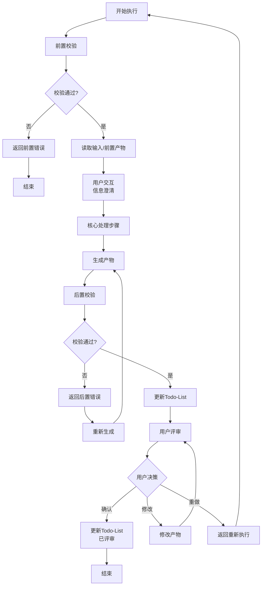
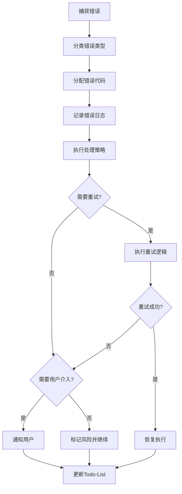

# 执行流程标准描述

本文档定义SWF项目所有Skill的执行流程标准，包括用户交互、Todo-List更新、用户评审、错误处理等通用流程。

---

## 1. 执行流程标准结构

### 1.1 流程概览图

所有Skill的执行流程遵循以下标准模式：



### 1.2 标准步骤说明

| 步骤 | 名称 | 必选 | 说明 |
|------|------|------|------|
| 1 | 前置校验 | 是 | 验证输入文件、前置产物、依赖关系 |
| 2 | 读取输入 | 是 | 加载前置产物，提取关键信息 |
| 2.5 | 用户交互 | 否 | 按需触发，澄清模糊信息 |
| 3 | 核心处理 | 是 | Skill特定的业务逻辑处理 |
| 4 | 生成产物 | 是 | 生成Markdown格式的产物文档 |
| 5 | 后置校验 | 是 | 验证产物完整性、格式正确性 |
| 6 | 更新Todo-List | 是 | 更新任务状态和进度 |
| 7 | 用户评审 | 是 | 等待用户确认或修改意见 |

---

## 2. 用户交互标准流程

### 2.1 触发场景

用户交互在以下场景触发：

| 场景 | 说明 | 示例 |
|------|------|------|
| 信息缺失 | 关键字段未提供 | 目标用户、预算、时间约束 |
| 描述模糊 | 存在歧义或模糊词汇 | "类似XX"、"大概"、"可能" |
| 矛盾信息 | 输入存在逻辑冲突 | 预算与功能需求不匹配 |
| 低完整度 | 信息完整度评分<60分 | 需要补充更多信息 |
| 方案选择 | 存在多个可行方案 | 需要用户决策选择 |

### 2.2 交互流程

```
识别问题 → 选择模板 → 展示问题 → 等待输入 → 解析输入 → 验证有效性
                                              ↓
                                        有效 → 补充信息 → 继续执行
                                              ↓
                                        无效 → 重新提问（最多3轮） → 标记风险继续
```

### 2.3 交互模板

使用以下标准化模板：

1. **需求澄清模板**：`user-interaction/clarification-template.md`
2. **信息收集模板**：`user-interaction/information-collection-template.md`
3. **方案选择模板**：`user-interaction/option-selection-template.md`

### 2.4 交互记录保存

所有交互记录保存到产物文档的"用户交互记录"章节：

```markdown
## 用户交互记录

| 轮次 | 时间 | 类型 | 问题描述 | 用户输入 | 处理状态 |
|------|------|------|----------|----------|----------|
| 1 | 2026-03-28 10:00 | 信息补全 | 目标用户缺失 | 大学生群体 | 已处理 |
```

### 2.5 交互限制

- **最大轮次**：3轮
- **超时时间**：24小时
- **超时处理**：使用默认值继续，标记信息缺失

---

## 3. Todo-List更新标准规则

### 3.1 更新时机

| 执行阶段 | 更新时机 | 更新内容 |
|----------|----------|----------|
| Skill执行开始 | 前置校验通过后 | 当前任务状态：待执行 → 执行中 |
| 用户交互后 | 交互完成后 | 更新需求信息（如有补充） |
| Skill执行完成 | 后置校验通过后 | 当前任务状态：执行中 → 已完成，评审状态：待评审 |
| 用户评审后 | 评审完成后 | 根据评审结果更新状态和断点信息 |

### 3.2 状态定义

**任务状态**：

| 状态 | 说明 |
|------|------|
| 待执行 | 尚未开始执行 |
| 执行中 | 正在执行中 |
| 已完成 | 执行完成，产物已生成 |
| 已评审 | 用户评审通过 |

**评审状态**：

| 状态 | 说明 |
|------|------|
| - | 无评审状态（待执行/执行中） |
| 待评审 | 执行完成，等待用户评审 |
| 已通过 | 用户评审通过 |
| 需修改 | 用户提出修改意见 |
| 需重做 | 用户要求重新执行 |

### 3.3 用户评审后的状态更新

| 用户决策 | 任务状态 | 评审状态 | 断点续跑信息 |
|----------|----------|----------|--------------|
| 确认 | 已评审 | 已通过 | 可恢复=false |
| 小修改 | 执行中 | 需修改 | 可恢复=true |
| 大修改/重做 | 执行中 | 需重做 | 可恢复=true |
| 新增想法 | 执行中 | 需修改 | 可恢复=true |

### 3.4 进度概览计算

```
总任务数：固定13个（常规模式）或8个（轻量化模式）
已完成：状态为"已完成"和"已评审"的任务数
执行中：状态为"执行中"的任务数
待执行：状态为"待执行"的任务数
已评审：评审状态为"已通过"的任务数
进度百分比：(已完成数 / 总任务数) × 100%
```

### 3.5 评审记录格式

每次评审后在Todo-List的"评审记录"章节添加：

```markdown
| 评审轮次 | 评审时间 | 评审结果 | 评审意见 | 处理状态 |
|----------|----------|----------|----------|----------|
| 第1轮 | 2026-03-28 10:30 | 通过 | 无 | - |
| 第2轮 | 2026-03-28 14:00 | 需修改 | 需要补充XX功能 | 已处理 |
```

---

## 4. 用户评审标准流程

### 4.1 评审触发

后置校验通过后自动触发用户评审。

### 4.2 评审展示内容

向用户展示：
- 产物核心内容摘要
- 关键发现/结果
- 风险/问题识别（如有）
- Todo-List更新状态

### 4.3 用户决策选项

| 决策 | 说明 | 后续动作 |
|------|------|----------|
| **确认** | 产物无误，继续下一阶段 | 保存产物 → 更新Todo-List → 进入后置Skill |
| **小修改** | 需要小幅调整 | 直接修改产物 → 重新展示评审 |
| **大修改/重做** | 需要重新执行 | 返回步骤1重新执行Skill |
| **新增想法** | 需要补充内容 | 更新产物 → 重新展示评审 |

### 4.4 评审超时处理

- **等待时间**：24小时
- **超时后状态**：paused
- **恢复方式**：用户输入后自动恢复
- **断点保存**：更新Todo-List的"断点续跑信息"章节

### 4.5 评审提示模板

```markdown
【{Skill名称}完成 - 用户评审】

{产物类型}已完成，核心内容如下：

**核心结果**：
- {关键结果1}
- {关键结果2}

**风险/问题**：{数量}个
- {问题1}
- {问题2}

---
请评审以上结果：
- 输入「确认」表示无误，进入下一阶段
- 输入「修改」并提供修改意见，格式：「修改：{具体意见}」
- 输入「新增」并补充内容，格式：「新增：{新内容}」

示例：
- 确认
- 修改：XX部分需要调整
- 新增：需要补充YY功能
```

---

## 5. 错误处理标准流程

### 5.1 错误分类

| 分类 | 代码范围 | 说明 |
|------|----------|------|
| 前置校验错误 | E001-E099 | 执行前检查发现的错误 |
| 执行过程错误 | E100-E199 | Skill执行过程中发生的错误 |
| 后置校验错误 | E200-E299 | 执行后验证发现的错误 |
| 用户评审错误 | E300-E399 | 用户评审阶段发生的错误 |
| 用户交互错误 | E400-E499 | 用户交互过程中发生的错误 |
| 系统错误 | E900-E999 | 系统级错误和未分类错误 |
| 前置警告 | W001-W099 | 非致命的前置检查警告 |
| 执行警告 | W100-W199 | 非致命的执行过程警告 |

### 5.2 标准错误代码速查

**前置校验错误（E001-E099）**：

| 代码 | 错误名称 | 说明 | 处理策略 |
|------|----------|------|----------|
| E001 | 输入文件不存在 | 依赖的产物文件不存在 | 返回错误，提示先执行前置Skill |
| E002 | 输入数据缺失 | 必需的输入数据为空 | 返回错误，提示补充数据 |
| E003 | 输入格式错误 | 输入数据格式不符合要求 | 返回错误，提示格式要求 |
| E004 | 产物ID格式错误 | 产物ID不符合规范 | 返回错误，提示正确格式 |
| E005 | 依赖Skill未执行 | 前置Skill任务状态未完成 | 返回错误，提示先完成前置Skill |

**执行过程错误（E100-E199）**：

| 代码 | 错误名称 | 说明 | 处理策略 |
|------|----------|------|----------|
| E101 | 数据解析失败 | 无法解析输入数据 | 重试3次，失败则返回错误 |
| E102 | 处理逻辑异常 | 执行过程中发生异常 | 记录日志，返回错误 |
| E103 | 外部服务错误 | 调用外部服务失败 | 重试3次，失败则标记风险 |
| E104 | 数据一致性错误 | 数据校验失败 | 返回错误，提示数据问题 |

**后置校验错误（E200-E299）**：

| 代码 | 错误名称 | 说明 | 处理策略 |
|------|----------|------|----------|
| E201 | 产物文件不存在 | 产物生成失败 | 重新执行生成逻辑 |
| E202 | 产物格式错误 | 产物格式不符合规范 | 重新生成产物 |
| E203 | 必填字段缺失 | 产物中关键字段为空 | 补充字段后重新生成 |
| E204 | 产物ID冲突 | 产物ID与已有产物冲突 | 重新生成ID |

**用户评审错误（E300-E399）**：

| 代码 | 错误名称 | 说明 | 处理策略 |
|------|----------|------|----------|
| E301 | 评审未通过 | 用户提出修改意见 | 根据意见修改产物 |
| E302 | 评审意见解析失败 | 无法理解用户输入 | 重新请求输入，最多3次 |
| W301 | 评审超时 | 用户24小时未响应 | 保持paused状态，等待用户 |

**用户交互错误（E400-E499）**：

| 代码 | 错误名称 | 说明 | 处理策略 |
|------|----------|------|----------|
| W401 | 交互响应超时 | 用户未及时响应 | 使用默认值继续，标记信息缺失 |
| E401 | 用户输入无效 | 输入不符合预期格式 | 重新提问，引导正确输入 |
| E402 | 多轮交互超限 | 超过3轮交互仍未明确 | 记录信息缺失，标记风险继续 |

### 5.3 错误处理流程



### 5.4 错误恢复策略

| 错误类型 | 恢复策略 | 重试次数 | 失败处理 |
|----------|----------|----------|----------|
| 前置校验错误 | 请求用户补充信息 | 最多3轮 | 使用默认值或标记风险 |
| 执行过程错误 | 自动重试或记录风险 | 最多3次 | 标记风险继续 |
| 后置校验错误 | 重新生成产物 | 最多3次 | 标记风险，进入评审 |
| 评审未通过 | 根据意见修改 | 最多3轮 | 标记风险 |
| 用户交互超时 | 使用默认值继续 | - | 标记信息缺失 |

---

## 6. 错误信息格式

标准错误信息格式：

```markdown
**错误代码**: E301
**错误类型**: 用户评审错误
**错误描述**: 用户提出修改意见
**处理建议**: 根据用户意见修改产物后重新提交评审
**重试次数**: 最多3次
```

---

**文档版本**: v1.0
**适用范围**: 所有Skill
**关联文档**:
- [错误代码标准](error-code-standard.md)
- [质量标准](quality-standard.md)
- [产物规范](artifact-specifications.md)
**最后更新**: 2026-03-28
