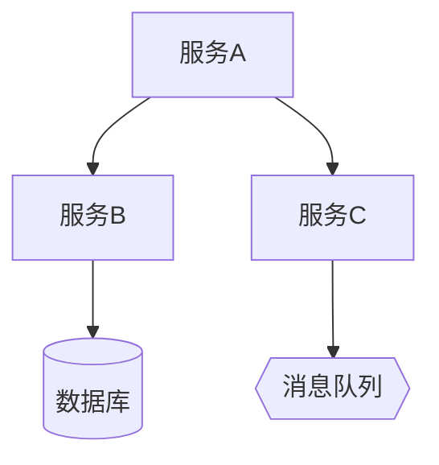
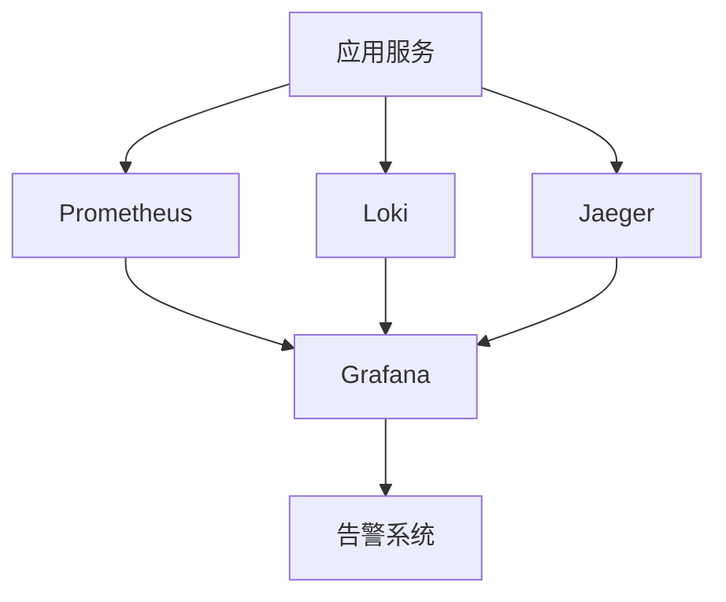

# 部署架构设计文档 - {PlanID}-S5-A05-001

## 基本信息
- **Plan ID**: {PlanID}
- **Skill ID**: S5-A05
- **执行时间**: YYYY-MM-DD HH:MM
- **执行模式**: 自动分析 + 用户交互

## 1. 部署模式选择

### 1.1 模式选型分析

基于系统特征分析：

| 特征维度 | 分析结果 | 影响因素 |
|----------|----------|----------|
| 系统规模 | {小型/中型/大型} | {用户量、并发量} |
| 可用性要求 | {SLA等级} | {可接受的停机时间} |
| 扩展性要求 | {弹性需求} | {是否需要自动扩缩容} |
| 运维能力 | {团队水平} | {运维团队规模和经验} |
| 预算约束 | {成本等级} | {基础设施预算范围} |

**推荐部署模式**：{Docker Compose / Kubernetes / FaaS / 混合模式}

**选型理由**：
1. {理由1}
2. {理由2}
3. {理由3}

### 1.2 技术栈选型

| 技术领域 | 选型 | 理由 |
|----------|------|------|
| 容器运行时 | {Docker/containerd} | {理由} |
| 容器编排 | {K8s/Docker Compose} | {理由} |
| 镜像仓库 | {ACR/ECR/Harbor} | {理由} |
| 配置管理 | {Nacos/Consul/Apollo} | {理由} |

### 1.3 云服务选择

| 服务类型 | 选择 | 规格 | 费用估算 |
|----------|------|------|----------|
| 容器服务 | {ACK/EKS/GKE} | {节点规格} | ¥{金额}/月 |
| 云服务器 | {ECS/EC2} | {规格} | ¥{金额}/月 |
| 数据库 | {RDS/自建} | {规格} | ¥{金额}/月 |
| 对象存储 | {OSS/S3} | {容量} | ¥{金额}/月 |

## 2. 服务架构设计

### 2.1 服务清单

| 服务名称 | 镜像 | 副本数 | CPU | 内存 | 说明 |
|----------|------|--------|-----|------|------|
| {服务名} | {镜像名} | {数量} | {核数} | {内存量} | {功能说明} |

### 2.2 服务依赖关系



### 2.3 资源需求估算

| 资源类型 | 总需求 | 说明 |
|----------|--------|------|
| CPU | {核数} | 生产环境峰值 |
| 内存 | {容量} | 生产环境峰值 |
| 存储 | {容量} | 数据库 + 日志 + 备份 |
| 带宽 | {带宽} | 峰值带宽 |

## 3. 网络架构设计

### 3.1 网络拓扑

```
┌─────────────────────────────────────────────────────────────┐
│                     外部网络 (Internet)                      │
└───────────────────────┬─────────────────────────────────────┘
                        │
┌───────────────────────▼─────────────────────────────────────┐
│                    边缘层 (CDN + WAF)                        │
└───────────────────────┬─────────────────────────────────────┘
                        │
┌───────────────────────▼─────────────────────────────────────┐
│                    网关层 (SLB + Gateway)                    │
└───────────────────────┬─────────────────────────────────────┘
                        │
┌───────────────────────▼─────────────────────────────────────┐
│                    应用层 (服务容器)                          │
└───────────────────────┬─────────────────────────────────────┘
                        │
┌───────────────────────▼─────────────────────────────────────┐
│                    数据层 (DB + Cache + MQ)                  │
└─────────────────────────────────────────────────────────────┘
```

### 3.2 安全策略

| 层级 | 安全措施 | 配置说明 |
|------|----------|----------|
| 边缘层 | {措施} | {配置} |
| 网关层 | {措施} | {配置} |
| 应用层 | {措施} | {配置} |
| 数据层 | {措施} | {配置} |

### 3.3 流量管理

| 场景 | 策略 | 配置 |
|------|------|------|
| 正常流量 | {策略} | {配置} |
| 灰度发布 | {策略} | {配置} |
| 故障转移 | {策略} | {配置} |
| 限流熔断 | {策略} | {配置} |

## 4. 存储架构设计

### 4.1 存储类型选择

| 数据类型 | 存储类型 | 技术方案 | 容量规划 |
|----------|----------|----------|----------|
| 业务数据 | 块存储/对象存储 | {方案} | {容量} |
| 静态资源 | 对象存储 | {方案} | {容量} |
| 日志数据 | 对象存储/日志服务 | {方案} | {容量} |

### 4.2 数据持久化策略

| 数据库 | 持久化方案 | RPO | RTO |
|--------|------------|-----|-----|
| {数据库类型} | {方案} | {时间} | {时间} |

### 4.3 备份恢复方案

| 备份对象 | 备份频率 | 保留周期 | 恢复方式 |
|----------|----------|----------|----------|
| {对象} | {频率} | {周期} | {方式} |

## 5. CI/CD 流程设计

### 5.1 流水线架构


### 5.2 阶段定义

| 阶段 | 触发条件 | 执行内容 | 超时时间 |
|------|----------|----------|----------|
| 构建 | {触发条件} | {执行内容} | {时间} |
| 测试 | {触发条件} | {执行内容} | {时间} |
| 部署 | {触发条件} | {执行内容} | {时间} |

### 5.3 部署策略

| 环境 | 部署策略 | 说明 |
|------|----------|------|
| 开发环境 | {策略} | {说明} |
| 测试环境 | {策略} | {说明} |
| 生产环境 | {策略} | {说明} |

### 5.4 回滚机制

| 回滚场景 | 触发条件 | 回滚方式 | RTO |
|----------|----------|----------|-----|
| 自动回滚 | {条件} | {方式} | {时间} |
| 手动回滚 | {条件} | {方式} | {时间} |

## 6. 监控告警方案

### 6.1 可观测性架构



### 6.2 监控指标体系

| 指标层级 | 指标名称 | 阈值 | 告警级别 |
|----------|----------|------|----------|
| 基础设施 | CPU使用率 | >80% | P2 |
| 基础设施 | 内存使用率 | >85% | P2 |
| 应用 | 错误率 | >1% | P1 |
| 应用 | P95延迟 | >500ms | P2 |

### 6.3 告警分级策略

| 级别 | 触发条件 | 响应时间 | 通知方式 |
|------|----------|----------|----------|
| P0 | 服务完全不可用 | 5分钟 | 电话+短信+钉钉 |
| P1 | 核心功能受损 | 15分钟 | 短信+钉钉 |
| P2 | 性能下降 | 30分钟 | 钉钉+邮件 |
| P3 | 预警提示 | 2小时 | 邮件 |

### 6.4 仪表盘设计

| 仪表盘名称 | 面板内容 | 刷新频率 |
|------------|----------|----------|
| 系统概览 | 整体健康状态 | 30秒 |
| 服务详情 | 各服务指标 | 10秒 |

## 7. 环境管理

### 7.1 环境划分

| 环境 | 命名空间 | 资源规格 | 用途 |
|------|----------|----------|------|
| 开发环境 | dev | 最小规格 | 日常开发调试 |
| 测试环境 | test | 中等规格 | 功能测试 |
| 预发布环境 | staging | 生产规格 | 发布前验证 |
| 生产环境 | prod | 生产规格 | 正式服务 |

### 7.2 配置管理

| 配置类型 | 管理方式 | 存储位置 |
|----------|----------|----------|
| 应用配置 | ConfigMap | K8s集群 |
| 敏感配置 | Secret | K8s集群 |
| 环境变量 | Deployment | K8s集群 |

### 7.3 密钥管理

| 密钥类型 | 管理方式 | 轮换周期 |
|----------|----------|----------|
| 数据库密码 | KMS | 90天 |
| API密钥 | Secret | 180天 |
| TLS证书 | 证书服务 | 365天 |

## 8. 运维手册

### 8.1 部署操作指南

**日常发布流程**：
1. 代码合并到主分支
2. 自动触发CI流水线
3. 测试环境验证通过
4. 手动触发生产部署
5. 发布完成验证

### 8.2 故障排查流程

| 故障现象 | 排查步骤 | 常见原因 |
|----------|----------|----------|
| 服务不可用 | {步骤} | {原因} |
| 响应慢 | {步骤} | {原因} |
| 错误率高 | {步骤} | {原因} |

### 8.3 扩容缩容指南

| 操作场景 | 操作方式 | 注意事项 |
|----------|----------|----------|
| 水平扩容 | {方式} | {注意} |
| 垂直扩容 | {方式} | {注意} |
| 缩容 | {方式} | {注意} |

## 9. 关键决策记录

### 9.1 决策清单

| 决策ID | 决策项 | 选择方案 | 决策时间 |
|--------|--------|----------|----------|
| D001 | 部署模式 | {方案} | YYYY-MM-DD |
| D002 | 云服务商 | {方案} | YYYY-MM-DD |
| D003 | CI/CD工具 | {方案} | YYYY-MM-DD |

### 9.2 决策理由

**D001 - 选择{方案}**：
- 支持：{支持理由}
- 放弃备选方案：{放弃理由}

## 10. 用户交互记录

| 交互轮次 | 交互时间 | 交互类型 | 决策项 | 用户选择 | 处理状态 |
|----------|----------|----------|--------|----------|----------|
| 1 | YYYY-MM-DD HH:MM | 方案选择 | {决策项} | {选择} | 已应用 |

## 11. 评审记录

（用户评审结果记录在此章节）

---

**文档版本**: v1.0
**创建时间**: YYYY-MM-DD HH:MM
**最后更新**: YYYY-MM-DD HH:MM
