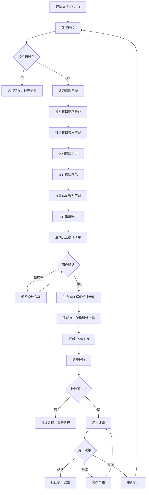
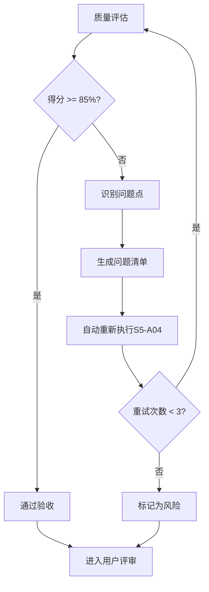

# S5-A04: 接口架构设计

## Section 1: 元信息 (Meta Information)

| 项目 | 内容 |
|------|------|
| **Skill 编号** | S5-A04 |
| **Skill 名称** | 接口架构设计 |
| **Skill 英文名称** | Interface Architecture Design |
| **所属阶段** | S5 - 架构设计阶段 |
| **执行顺序** | S5 阶段第 4 个执行 |
| **执行模式** | 自动分析 + 用户交互 |
| **依赖 Skill** | S5-A03 (数据架构设计) |
| **后置 Skill** | S5-A05 (部署架构设计) |
| **版本** | v3.2.0 |
| **最后更新时间** | 2026-03-28 |

## Contract

| 项目 | 内容 |
|------|------|
| **Skill ID** | S5-A04 |
| **Stage** | S5 |
| **Directory** | skills/s5-interface |
| **Depends On** | S5-A03 |
| **Next (Normal)** | S5-A05 |
| **Next (Lightweight)** | S5-A05 |
| **Lightweight Skip** | No |
| **Required Inputs** | 参见 workflow-manifest.yaml |
| **Outputs** | artifacts/stages/s5/{PlanID}-S5-A04-001.md |

---

## Section 2: 功能描述 (Functional Description)

### 2.1 核心职责

S5-A04 负责设计系统接口架构，为后续详细设计和开发提供接口规范：

1. **接口风格选择**：基于系统特征选择最优接口技术方案（RESTful/GraphQL/gRPC/WebSocket）
2. **接口规范定义**：设计统一的 URL 规范、HTTP 方法规范、状态码规范、响应格式
3. **接口分组设计**：按业务领域、用户角色、功能模块划分接口分组
4. **认证授权设计**：设计认证方案、Token 规范、权限模型
5. **集成接口设计**：设计外部系统集成方案、Webhook 设计、回调规范
6. **API 清单生成**：生成完整的 API 清单和核心接口详细设计示例

### 2.2 输入规范 (Input Specifications)

#### 用户需要提供什么

**核心输入**：架构设计阶段前置产物

| 内容 | 要求 | 示例 |
|------|------|------|
| 架构视图设计文档 | 必填，S5-A02 产物 | `artifacts/stages/s5/{PlanID}-S5-A02-001.md` |
| 数据架构设计文档 | 必填，S5-A03 产物 | `artifacts/stages/s5/{PlanID}-S5-A03-001.md` |
| 架构愿景文档 | 必填，S5-A01 产物 | `artifacts/stages/s5/{PlanID}-S5-A01-001.md` |
| 需求规格说明书 | 必填，需求工程阶段产物 | SRS 文档 |
| Todo-List 文件 | 必填，状态跟踪文件 | `artifacts/plans/{PlanID}/todo-list.md` |

#### 输入验证规则

| 规则 | 验证内容 | 错误码 |
|------|----------|--------|
| 文件存在性 | 检查所有依赖文件是否存在 | E001 |
| 格式正确性 | 验证文件格式为 Markdown | E003 |
| 内容完整性 | 验证必需章节存在 | E002 |
| 依赖完成性 | 验证前置 Skill 已完成 | E005 |

#### 输入示例

**示例 1：完整输入**
```
架构愿景文档：artifacts/stages/s5/P000001-S5-A01-001.md
架构视图设计文档：artifacts/stages/s5/P000001-S5-A02-001.md
数据架构设计文档：artifacts/stages/s5/P000001-S5-A03-001.md
需求规格说明书：artifacts/plans/P000001/srs.md

系统特征摘要：
- 客户端类型：Web + 移动端
- 实时性要求：中等（实时通知）
- 数据查询复杂度：中等
- 集成场景：第三方支付、消息推送
```

### 2.3 输出规范 (Output Specifications)

#### 用户会得到什么

S5-A04 完成后，系统会生成以下产物：

**产物清单**：

| 产物名称 | 文件位置 | 格式 | 用途 | 用户可见性 |
|----------|----------|------|------|------------|
| 接口架构设计文档 | `artifacts/stages/s5/{PlanID}/{PlanID}-S5-A04-001.md` | Markdown | 接口规范、API清单、集成方案 | 用户可查看 |
| Todo-List 更新 | `artifacts/plans/{PlanID}/todo-list.md` | Markdown | 更新 S5-A04 任务状态 | 用户可查看 |

**产物主要内容**：

1. **接口技术方案**：接口风格选择、技术栈选型、多协议组合策略
2. **接口分组设计**：分组原则、API 分组清单、各组接口概览
3. **接口规范定义**：URL 规范、HTTP 方法规范、状态码规范、响应格式
4. **认证授权设计**：认证方案、Token 规范、权限模型
5. **集成接口设计**：外部系统集成清单、Webhook 设计、回调规范
6. **API 详细设计示例**：核心接口的详细设计模板，为 S6 阶段提供参考

#### 输出示例

**接口架构设计文档示例结构**：

```markdown
# 接口架构设计文档

## 基本信息
- **Plan ID**: P000001
- **Skill ID**: S5-A04
- **执行时间**: 2026-03-28 14:00
- **执行模式**: 自动分析 + 用户交互

## 接口技术方案
### 接口风格选择
- 主要接口风格：RESTful API
- 辅助接口风格：WebSocket（实时通知）
- 选择理由：Web应用 + 标准CRUD场景

## 接口分组设计
### API分组清单
| 分组名称 | 基础路径 | 说明 |
|----------|----------|------|
| 认证授权 | /api/v1/auth | 登录、注册、Token管理 |
| 用户管理 | /api/v1/users | 用户CRUD、个人资料 |

## 认证授权设计
### 认证方案：JWT + RBAC
### Token规范：Access Token 2小时 + Refresh Token 7天

## API详细设计示例
[核心接口的详细设计模板]
```

---

## Section 3: 执行流程 (Execution Process)

### 3.1 流程概览



### 3.2 详细步骤说明

详细执行步骤参见 [references/execution-details.md](references/execution-details.md)

### 3.3 Todo-List 更新规则

**更新时机与内容**：

| 执行阶段 | 更新时机 | 更新内容 |
|---------|---------|---------|
| Skill 执行开始 | 步骤 1 完成后 | S5-A04 任务状态：待执行 -> 执行中 |
| 用户交互后 | 用户确认后 | 记录确认的方案选择 |
| Skill 执行完成 | 步骤 11 完成后 | S5-A04 任务状态：执行中 -> 已完成，评审状态：待评审 |
| 用户评审后 | 步骤 12 完成后 | 根据评审结果更新状态 |

**详细规则**：详见 [execution-flow-standard.md](../_shared/execution-flow-standard.md) 中的"Todo-List更新规则"章节。

### 3.4 Demo 示例

参见 [references/examples.md](references/examples.md)

---

## Section 4: 产物规范 (Artifact Specifications)

### 4.1 产物清单

| 产物名称 | 产物 ID | 存储路径 | 说明 |
|---------|---------|----------|------|
| 接口架构设计文档 | `{PlanID}-S5-A04-001` | `artifacts/stages/s5/{PlanID}/{PlanID}-S5-A04-001.md` | 接口规范、API清单、集成方案 |

### 4.2 依赖关系

**输入依赖**：

| 依赖产物 | 来源 Skill | 说明 |
|---------|-----------|------|
| 架构愿景文档 | S5-A01 | 系统特征、技术约束 |
| 架构视图设计文档 | S5-A02 | 逻辑视图、模块划分 |
| 数据架构设计文档 | S5-A03 | 数据模型、实体关系 |
| 需求规格说明书 | 需求工程阶段 | 功能需求、用户故事 |

**输出被依赖**：

| 被依赖产物 | 依赖 Skill | 说明 |
|-----------|-----------|------|
| 接口架构设计文档 | S5-A05 | 部署架构需要接口信息 |
| 接口架构设计文档 | S6 详细设计阶段 | API 详细设计参考 |

### 4.3 通用规范

- **产物 ID 命名规则**：详见 [artifact-specifications.md](../_shared/artifact-specifications.md) 第 2 章
- **存储路径结构**：详见 [artifact-specifications.md](../_shared/artifact-specifications.md) 第 3 章
- **版本管理规则**：详见 [artifact-specifications.md](../_shared/artifact-specifications.md) 第 4 章
- **产物模板**：使用 [template.md](template.md)

---

## Section 5: 质量标准 (Quality Standards)

### 5.1 质量评估框架

S5-A04 遵循 [quality-standard.md](../_shared/quality-standard.md) 中的 ISO/IEC 25010 质量评估框架：

| 维度 | 权重 | 评估标准 | 验收阈值 |
|------|------|----------|----------|
| **完整性** | 30% | 所有必需内容都已生成 | 90% |
| **准确性** | 25% | 内容准确，无错误 | 90% |
| **一致性** | 20% | 格式统一，术语一致 | 95% |
| **可读性** | 15% | 结构清晰，表达准确 | 85% |
| **可追溯性** | 10% | 来源清晰，关系明确 | 90% |

**验收门槛**：质量综合得分 >= 85%

### 5.2 S5-A04 特定检查清单

**完整性检查**：

- [ ] 接口技术方案完整（风格选择、技术栈、组合策略）
- [ ] 接口分组设计完整（分组原则、API 分组清单）
- [ ] 接口规范定义完整（URL、HTTP 方法、状态码、响应格式）
- [ ] 认证授权设计完整（认证方案、Token 规范、权限模型）
- [ ] 集成接口设计完整（外部系统集成、Webhook 设计）
- [ ] API 详细设计示例生成（核心接口）

**准确性检查**：

- [ ] 接口风格选择符合系统特征
- [ ] 认证方案与安全等级匹配
- [ ] 权限模型与业务需求匹配
- [ ] 状态码使用规范正确

**一致性检查**：

- [ ] 术语使用一致（API、接口、端点等）
- [ ] URL 命名风格一致
- [ ] 响应格式风格一致
- [ ] 与前置产物（数据模型、模块划分）一致

**可读性检查**：

- [ ] 文档结构清晰，层级分明
- [ ] 表格设计合理，信息直观
- [ ] 示例代码格式正确
- [ ] 决策理由说明清晰

**可追溯性检查**：

- [ ] 与 S5-A02 架构视图的模块对应
- [ ] 与 S5-A03 数据模型的实体对应
- [ ] 与需求规格的功能需求对应

### 5.3 质量综合得分计算

```
得分 = Σ(维度得分 × 维度权重)

示例：
- 完整性：95% × 30% = 28.5
- 准确性：90% × 25% = 22.5
- 一致性：100% × 20% = 20.0
- 可读性：90% × 15% = 13.5
- 可追溯性：95% × 10% = 9.5
- 总分：28.5 + 22.5 + 20.0 + 13.5 + 9.5 = 94.0%
```

### 5.4 验收标准

| 结果 | 标准 | 处理方式 |
|------|------|----------|
| **通过** | 质量综合得分 >= 85% | 进入用户评审阶段 |
| **不通过** | 质量综合得分 < 85% | 识别问题 → 生成问题清单 → 自动重新执行 |

### 5.5 不达标处理流程



**重试机制**：
- 第1次：自动重新执行，尝试修复问题
- 第2次：自动重新执行，调整参数
- 第3次：自动重新执行，简化复杂部分
- 仍不达标：标记为风险，进入用户评审并提示问题

---

## Section 6: 异常处理

### 6.1 常见异常场景

**前置校验失败**：

| 场景 | 错误码 | 处理策略 |
|------|--------|----------|
| 架构视图设计文档不存在 | E001 | 提示用户先执行 S5-A02 |
| 数据架构设计文档不存在 | E001 | 提示用户先执行 S5-A03 |
| 需求规格说明书不存在 | E001 | 提示用户先完成需求工程阶段 |

**执行过程异常**：

| 场景 | 错误码 | 处理策略 |
|------|--------|----------|
| 接口风格无法确定 | E151 | 请求用户交互确认 |
| 认证方案冲突 | E152 | 列出备选方案，请求用户选择 |
| 外部集成信息不足 | E153 | 标记为待确认，继续执行 |

**后置校验失败**：

| 场景 | 错误码 | 处理策略 |
|------|--------|----------|
| 产物文件不存在 | E201 | 重新生成产物 |
| 产物格式错误 | E202 | 重新生成产物文件 |
| 必填字段缺失 | E203 | 补充缺失字段后重新生成 |

**用户评审异常**：

| 场景 | 错误码 | 处理策略 |
|------|--------|----------|
| 用户要求修改 | E301 | 根据意见修改产物 |
| 评审超时 | E303 | 保持 paused 状态，等待用户 |

### 6.2 本 Skill 特定场景

- **接口风格多选冲突**：当多种接口风格适用时，列出备选方案，请求用户选择
- **安全等级不确定**：当安全需求不明确时，默认采用中等安全等级（JWT），标记为待确认
- **外部集成信息缺失**：标记为"待确认的外部集成"，在产物中明确标注

### 6.3 恢复策略

| 异常类型 | 处理策略 | 重试次数 | 失败处理 |
|----------|----------|----------|----------|
| 可重试异常 | 自动重试 | 3次 | 标记风险继续执行 |
| 数据缺失 | 请求用户补充 | 1次 | 使用默认值继续 |
| 校验失败 | 重新执行 | 1次 | 标记风险继续执行 |
| 用户拒绝 | 使用默认值 | - | 标记风险继续执行 |

详细流程参见 [error-code-standard.md](../_shared/error-code-standard.md)

### 6.4 用户交互协议

S5-A04 使用标准化的用户交互模板：

- **需求澄清**：使用 [user-interaction/clarification-template.md](../_shared/user-interaction/clarification-template.md)
- **信息收集**：使用 [user-interaction/information-collection-template.md](../_shared/user-interaction/information-collection-template.md)
- **方案选择**：使用 [user-interaction/option-selection-template.md](../_shared/user-interaction/option-selection-template.md)

**交互触发场景**：

1. 接口风格无法自动确定（多种风格适用）
2. 认证方案需要用户确认（安全等级不明确）
3. 外部集成接口需要确认范围

**交互记录保存**：
所有交互记录保存到产物文件的"用户交互记录"章节。
