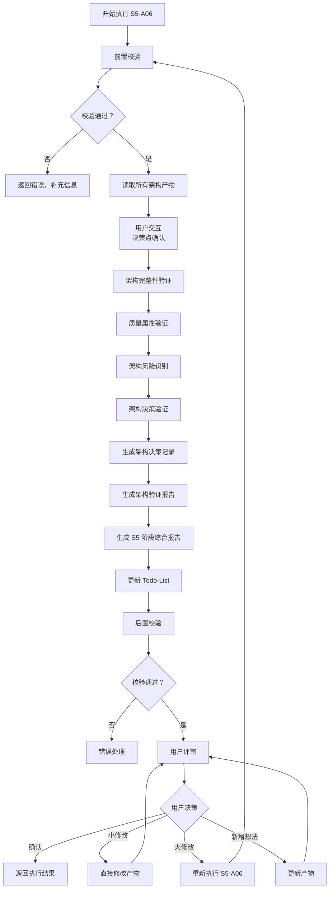
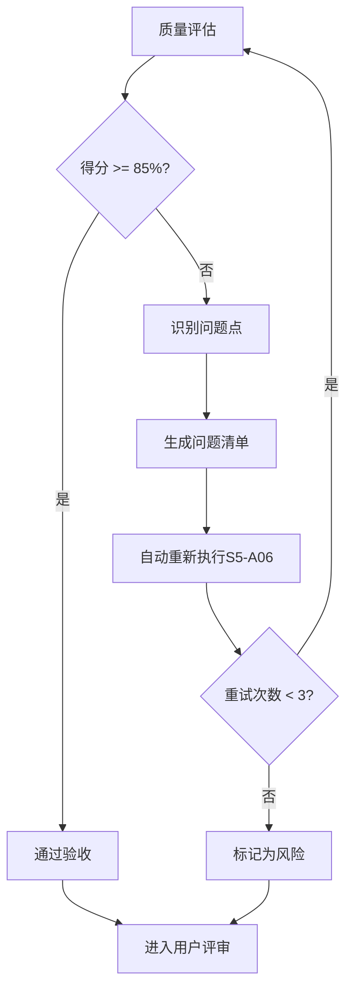

# S5-A06: 架构验证与评审

## Section 1: 元信息 (Meta Information)

| 项目 | 内容 |
|------|------|
| **Skill 编号** | S5-A06 |
| **Skill 名称** | 架构验证与评审 |
| **Skill 英文名称** | Architecture Validation and Review |
| **所属阶段** | S5 - 架构设计阶段 |
| **执行顺序** | S5 阶段第 6 个执行（S5 阶段最后一个 Skill） |
| **执行模式** | 自动分析 + 用户交互 |
| **依赖 Skill** | S5-A05 (部署架构设计) |
| **后置 Skill** | 无（S5 阶段结束） |
| **参考标准** | ISO/IEC 25010, SEI ATAM, IEEE 1471 |
| **版本** | v3.2.0 |
| **最后更新时间** | 2026-03-28 |

***

## Section 2: 功能描述 (Functional Description)

### 2.1 核心职责

S5-A06 负责对 S5 阶段所有架构设计产物进行系统性验证和评审，确保架构质量符合实施标准。核心职责包括：

1. **架构完整性验证**：验证设计产物完整性、架构元素覆盖度
2. **质量属性验证**：基于 ISO/IEC 25010 验证性能、安全、可用性等质量属性
3. **架构风险识别**：识别技术风险、架构反模式、架构坏味道
4. **架构决策验证**：验证决策完整性、评估决策理由充分性
5. **生成 ADR**：记录关键架构决策及其权衡过程
6. **输出综合报告**：生成架构验证报告和 S5 阶段综合报告

### 2.2 输入规范 (Input Specifications)

#### 用户需要提供什么

**核心输入**：S5 阶段所有架构设计产物

| 内容 | 要求 | 来源 |
|------|------|------|
| 架构愿景文档 | 必填，S5-A01 生成的架构愿景 | `artifacts/stages/s5/{PlanID}/{PlanID}-S5-A01-001.md` |
| 架构视图设计文档 | 必填，S5-A02 生成的 4+1 视图 | `artifacts/stages/s5/{PlanID}/{PlanID}-S5-A02-001.md` |
| 数据架构设计文档 | 必填，S5-A03 生成的数据架构 | `artifacts/stages/s5/{PlanID}/{PlanID}-S5-A03-001.md` |
| 接口架构设计文档 | 必填，S5-A04 生成的接口架构 | `artifacts/stages/s5/{PlanID}/{PlanID}-S5-A04-001.md` |
| 部署架构设计文档 | 必填，S5-A05 生成的部署架构 | `artifacts/stages/s5/{PlanID}/{PlanID}-S5-A05-001.md` |
| 需求规格说明书 | 必填，需求工程阶段产物 | 需求工程阶段 |
| 风险清单 | 推荐，S3 阶段风险识别产物 | `artifacts/stages/s3/{PlanID}/{PlanID}-S3-S301-001.md` |

**输入数据要求**：

- 所有架构设计文档应为 Markdown 格式
- 架构愿景文档应包含系统定位、架构目标、设计原则
- 各架构视图应包含完整的设计说明和 Mermaid 图

#### 输入示例

```
Plan ID: P000001
架构愿景文档：artifacts/stages/s5/P000001/P000001-S5-A01-001.md
架构视图设计文档：artifacts/stages/s5/P000001/P000001-S5-A02-001.md
数据架构设计文档：artifacts/stages/s5/P000001/P000001-S5-A03-001.md
接口架构设计文档：artifacts/stages/s5/P000001/P000001-S5-A04-001.md
部署架构设计文档：artifacts/stages/s5/P000001/P000001-S5-A05-001.md
执行模式：常规模式
```

### 2.3 输出规范 (Output Specifications)

#### 用户会得到什么

S5-A06 完成后，系统会生成以下产物并保存到项目目录：

**产物清单**：

| 产物名称 | 文件位置 | 格式 | 用途 | 用户可见性 |
|----------|----------|------|------|------------|
| 架构验证报告 | `artifacts/stages/s5/{PlanID}/{PlanID}-S5-A06-001.md` | Markdown | 验证结果详情 | 用户可查看 |
| S5 阶段综合报告 | `artifacts/stages/s5/{PlanID}/{PlanID}-S5-report.md` | Markdown | S5 阶段汇总 | 用户可查看 |
| Todo-List 更新 | `artifacts/plans/{PlanID}/todo-list.md` | Markdown | 更新 S5-A06 任务状态 | 用户可查看 |

**用户可访问的核心产物**：

1. **架构验证报告**（Markdown 格式）
   - 验证概述（范围、方法、标准）
   - 完整性验证（产物完整性、元素覆盖度）
   - 质量属性验证（性能、安全、可用性等）
   - 风险识别（技术风险、架构反模式）
   - 架构决策记录（ADR 清单及详情）
   - 验证结论（总体评估、改进建议）

2. **S5 阶段综合报告**（Markdown 格式）
   - 执行摘要
   - 架构愿景汇总
   - 架构视图汇总
   - 数据架构汇总
   - 接口架构汇总
   - 部署架构汇总
   - 架构验证结果
   - 关键决策与风险

3. **Todo-List 状态更新**
   - S5-A06 任务状态：待执行 → 已完成
   - 评审状态：待评审
   - S5 阶段状态：已完成

***

## Section 3: 执行流程 (Execution Process)

### 3.1 流程概览



### 3.2 执行步骤说明

S5-A06 执行流程包含以下主要步骤：

| 步骤 | 名称 | 说明 |
|------|------|------|
| 1 | 前置校验 | 检查依赖文件存在性和任务状态 |
| 2 | 读取架构产物 | 提取所有架构设计信息到结构化对象 |
| 2.5 | 用户交互 | 确认高风险项和架构决策 |
| 3 | 架构完整性验证 | 验证设计产物完整性和元素覆盖度 |
| 4 | 质量属性验证 | 基于 ISO/IEC 25010 验证质量属性 |
| 5 | 架构风险识别 | 识别技术风险、架构反模式、坏味道 |
| 6 | 架构决策验证 | 验证决策完整性和理由充分性 |
| 7 | 生成 ADR | 记录关键架构决策 |
| 8 | 生成验证报告 | 按模板生成完整验证报告 |
| 9 | 生成阶段总结 | 汇总 S5 阶段所有产物 |
| 10 | 更新 Todo-List | 更新任务状态和阶段状态 |
| 11 | 后置校验 | 验证产物格式和内容完整性 |
| 12 | 用户评审 | 展示结果，等待用户确认或修改 |

**详细步骤说明**请参考：[references/execution-details.md](references/execution-details.md)

### 3.3 Demo 示例

S5-A06 提供完整的输入、处理过程、输出示例，帮助理解 Skill 的执行逻辑。

**示例概览**：
- **输入**：S5 阶段 5 个架构设计文档 + 需求规格说明书
- **处理**：12 个步骤的完整验证流程
- **输出**：架构验证报告 + S5 阶段综合报告

**完整示例**请参考：[references/examples.md](references/examples.md)

***

## Section 4: 产物规范 (Artifact Specifications)

### 4.1 产物清单

| 产物名称 | 产物 ID | 存储路径 | 说明 |
|----------|---------|----------|------|
| 架构验证报告 | `{PlanID}-S5-A06-001` | `artifacts/stages/s5/{PlanID}/{PlanID}-S5-A06-001.md` | 架构验证结果 |
| S5 阶段综合报告 | `{PlanID}-S5-report` | `artifacts/stages/s5/{PlanID}/{PlanID}-S5-report.md` | S5 阶段汇总 |

### 4.2 依赖关系

**前置产物依赖**：

| 产物 | 来源 Skill | 必需性 |
|------|-----------|--------|
| 架构愿景文档 | S5-A01 | 必需 |
| 架构视图设计文档 | S5-A02 | 必需 |
| 数据架构设计文档 | S5-A03 | 必需 |
| 接口架构设计文档 | S5-A04 | 必需 |
| 部署架构设计文档 | S5-A05 | 必需 |
| 需求规格说明书 | 需求工程阶段 | 必需 |
| 风险清单 | S3-S301 | 推荐 |

### 4.3 通用规范

- **产物 ID 命名规则**：详见 [artifact-specifications.md](references/artifact-specifications.md) 第 2 章
- **存储路径结构**：详见 [artifact-specifications.md](references/artifact-specifications.md) 第 3 章
- **版本管理规则**：详见 [artifact-specifications.md](references/artifact-specifications.md) 第 4 章
- **产物模板**：使用 [template.md](template.md)

***

## Section 5: 质量标准 (Quality Standards)

### 5.1 质量评估框架

S5-A06 遵循 [quality-standard.md](references/quality-standard.md) 中的 ISO/IEC 25010 质量评估框架：

| 维度 | 权重 | 评估标准 | 验收阈值 |
|------|------|----------|----------|
| **完整性** | 30% | 所有验证维度已完成，产物完整 | ≥ 90% |
| **准确性** | 25% | 验证结论准确，风险评估合理 | ≥ 90% |
| **一致性** | 20% | 与各架构产物描述一致，格式统一 | ≥ 95% |
| **可读性** | 15% | 报告结构清晰，问题表述明确 | ≥ 85% |
| **可追溯性** | 10% | 验证依据可追溯，风险来源明确 | ≥ 90% |

**验收门槛**：质量综合得分 ≥ 85%

### 5.2 S5-A06 特定检查清单

**完整性检查**：

- [ ] 6 个验证维度完整（完整性、质量属性、风险、决策、ADR、结论）
- [ ] 所有前置架构产物已验证
- [ ] 架构风险识别完整
- [ ] S5 阶段综合报告完整

**准确性检查**：

- [ ] 验证结论准确，有充分依据
- [ ] 风险等级评估合理
- [ ] 质量属性评分准确
- [ ] ADR 决策理由充分

**一致性检查**：

- [ ] 与各架构产物描述一致
- [ ] 术语使用统一
- [ ] 编号格式一致

**可读性检查**：

- [ ] 验证报告结构清晰
- [ ] 问题分类明确
- [ ] 改进建议可执行

**可追溯性检查**：

- [ ] 验证依据指向具体架构产物
- [ ] 风险来源可追溯
- [ ] 决策理由有文档支撑

### 5.3 质量综合得分计算

```
得分 = Σ(维度得分 × 维度权重)

示例：
- 完整性：95% × 30% = 28.5
- 准确性：90% × 25% = 22.5
- 一致性：100% × 20% = 20.0
- 可读性：90% × 15% = 13.5
- 可追溯性：95% × 10% = 9.5
- 总分：28.5 + 22.5 + 20.0 + 13.5 + 9.5 = 94.0%
```

### 5.4 验收标准

| 结果 | 标准 | 处理方式 |
|------|------|----------|
| **通过** | 质量综合得分 ≥ 85% | 进入用户评审阶段 |
| **不通过** | 质量综合得分 < 85% | 识别问题 → 生成问题清单 → 自动重新执行 |

### 5.5 不达标处理流程



**重试机制**：

- 第1次：自动重新执行，尝试修复问题
- 第2次：自动重新执行，调整参数
- 第3次：自动重新执行，简化复杂部分
- 仍不达标：标记为风险，进入用户评审并提示问题

***

## Section 6: 异常处理

### 6.1 常见异常场景

**前置校验失败**（如输入文件不存在）：

- 提示用户先执行前置 Skill
- 或请求补充必要架构产物

**执行过程异常**（如架构产物解析失败）：

- 自动重试（最多3次）
- 失败后标记风险继续执行

**后置校验失败**（如产物不完整）：

- 重新生成产物
- 或标记为风险进入用户评审

**用户评审未通过**：

- 根据意见修改产物
- 小修改直接编辑，大修改重新执行

### 6.2 本 Skill 特定场景

| 异常场景 | 处理策略 |
|----------|----------|
| 架构产物不完整 | 标记缺失项，在报告中明确指出 |
| 架构决策冲突 | 标记冲突点，请求用户确认优先级 |
| 风险识别置信度低 | 标记为"待确认"，提示用户关注 |
| 质量属性无法验证 | 标记为"需人工验证"，给出验证建议 |

### 6.3 恢复策略

| 异常类型 | 处理策略 |
|----------|----------|
| 可重试异常 | 自动重试3次 |
| 数据缺失 | 请求用户补充或标记风险继续 |
| 校验失败 | 重新执行或标记风险 |
| 用户拒绝 | 使用默认值继续 |

详细流程参见 [execution-flow-standard.md](references/execution-flow-standard.md)

### 6.4 错误代码

详细错误代码定义参见 [error-code-standard.md](references/error-code-standard.md)

| 代码 | 错误名称 | 说明 |
|------|----------|------|
| E001 | 前置产物缺失 | 架构设计文档不存在 |
| E151 | 架构解析失败 | 无法解析架构产物 |
| E152 | 验证逻辑异常 | 验证过程发生错误 |
| E201 | 验证报告生成失败 | 产物生成失败 |
| E301 | 评审未通过 | 用户提出修改意见 |
