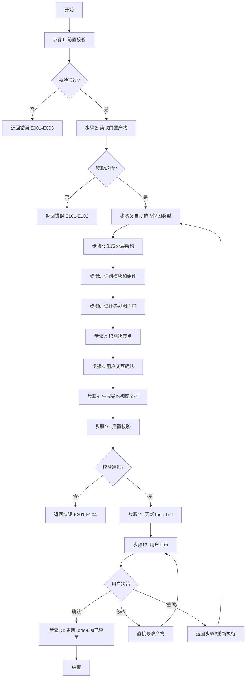
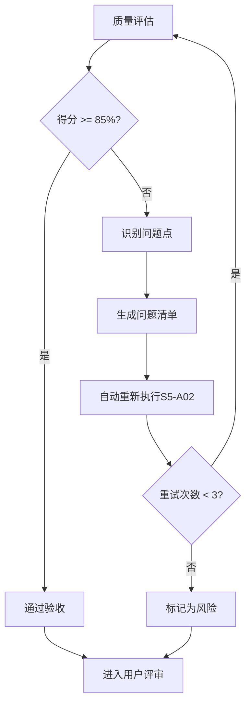

# S5-A02: 架构视图设计

## Section 1: 元信息 (Meta Information)

| 项目 | 内容 |
|------|------|
| **Skill 编号** | S5-A02 |
| **Skill 名称** | 架构视图设计 |
| **Skill 英文名称** | Architecture View Design |
| **所属阶段** | S5 - 架构设计阶段 |
| **执行顺序** | S5 阶段第 2 个执行 |
| **执行模式** | 自动分析 + 用户交互 |
| **依赖 Skill** | S5-A01（架构愿景定义） |
| **后置 Skill** | S5-A03（数据架构设计） |
| **版本** | v3.2.0 |
| **最后更新时间** | 2026-03-28 |
| **参考标准** | IEEE 1016, ISO/IEC/IEEE 42010:2011 |

## Contract

| 项目 | 内容 |
|------|------|
| **Skill ID** | S5-A02 |
| **Stage** | S5 |
| **Directory** | skills/s5-views |
| **Depends On** | S5-A01 |
| **Next (Normal)** | S5-A03 |
| **Next (Lightweight)** | S5-A03 |
| **Lightweight Skip** | No |
| **Required Inputs** | 参见 workflow-manifest.yaml |
| **Outputs** | artifacts/stages/s5/{PlanID}-S5-A02-001.md |

***

## Section 2: 功能描述 (Functional Description)

### 2.1 核心职责

S5-A02 负责基于架构愿景，设计系统的多维度架构视图。主要职责包括：

1. **视图类型选择**：基于系统特征自动选择适合的架构视图组合（4+1视图模型）
2. **分层架构设计**：设计系统的层次结构，定义各层职责和依赖关系
3. **模块划分设计**：识别系统模块和组件，定义模块边界和接口
4. **逻辑视图设计**：识别核心领域对象、实体关系和交互流程
5. **进程视图设计**：设计运行时进程结构和并发模型
6. **实现视图设计**：设计代码组织结构和模块目录
7. **部署视图设计**：设计物理部署架构和节点分布
8. **场景视图设计**：选择关键用例验证架构设计
9. **设计决策记录**：记录所有架构决策及其理由
10. **架构视图文档生成**：输出完整的架构视图设计文档（Markdown）

### 2.2 输入规范 (Input Specifications)

#### 用户/前置 Skill 需要提供什么

**前置产物（必需）**：

| 阶段 | 产物名称 | 产物 ID 示例 | 用途 |
|------|---------|-------------|------|
| S5 | 架构愿景文档 | `{PlanID}-S5-A01-001` | 获取系统定位、架构目标、关键决策 |
| S1-S4 | 需求规格说明书 | `{PlanID}-S4-S403-001` | 获取核心需求、功能模块划分 |
| S1 | 显性需求清单 | `{PlanID}-S1-S102-001` | 获取功能模块、接口需求 |

**输入格式**：
- Markdown 报告文件
- 结构化数据表格
- Mermaid 图表

**输入验证规则**：
- 架构愿景文档必须存在且状态为 completed
- 需求规格说明书必须包含功能模块划分
- 产物 ID 必须匹配且连续

#### 输入示例

**前置产物引用示例**：

```
PlanID: P000001
前置产物：
- P000001-S5-A01-001 (架构愿景文档)
- P000001-S4-S403-001 (核心需求报告)
- P000001-S1-S102-001 (显性需求提取清单)
```

### 2.3 输出规范 (Output Specifications)

#### 用户会得到什么

Skill 完成后，系统会生成以下产物并保存到项目目录：

**产物清单**：

| 产物名称 | 文件位置 | 格式 | 用途 | 用户可见性 |
|---------|---------|------|------|-----------|
| 架构视图设计文档 | `artifacts/stages/s5/{PlanID}/{PlanID}-S5-A02-001.md` | Markdown | 4+1视图设计、分层架构、模块划分 | 用户可查看 |
| Todo-List 更新 | `artifacts/plans/{PlanID}/todo-list.md` | Markdown | 任务状态更新 | 用户可查看 |

**产物内容结构**：

1. **视图选择说明**：选择的视图类型及理由
2. **分层架构设计**：分层结构图、各层职责、层间依赖
3. **模块划分设计**：模块列表、职责、依赖关系、接口定义
4. **逻辑视图详情**：核心领域模型、实体关系、领域服务、领域事件
5. **进程视图详情**：运行时进程、并发模型、通信机制
6. **实现视图详情**：代码结构、模块目录、关键文件
7. **部署视图详情**：部署架构、部署节点、资源配置
8. **场景视图详情**：关键场景列表、场景实现序列图
9. **设计决策记录**：所有决策及理由、决策方式
10. **风险与约束**：架构风险、设计约束

#### 输出示例

**架构视图设计文档示例结构**：

```markdown
# 架构视图设计文档 - P000001-S5-A02-001

## 1. 视图选择
- 逻辑视图：核心业务建模
- 进程视图：并发和性能需求
- 实现视图：代码组织
- 部署视图：分布式部署
- 场景视图：架构验证

## 2. 分层架构设计
- 表示层 → 应用层 → 领域层 → 基础设施层

## 3. 模块划分
- 核心模块：用户管理、订单管理、商品管理
- 支撑模块：认证授权、日志审计
- 集成模块：支付网关、消息队列

## 4-8. 各视图详情
...
```

***

## Section 3: 执行流程 (Execution Process)

### 3.1 流程概览



### 3.2 详细步骤

详细步骤说明见 [references/execution-details.md](references/execution-details.md)

### 3.3 Demo 示例

执行示例见 [references/examples.md](references/examples.md)

---

## Section 4: 产物规范 (Artifact Specifications)

S5-A02 产物规范遵循 [references/artifact-specifications.md](references/artifact-specifications.md) 中的通用定义。

### 4.1 S5-A02 特定产物清单

| 产物名称 | 产物ID | 存储路径 | 说明 |
|---------|--------|---------|------|
| 架构视图设计文档 | `{PlanID}-S5-A02-001` | `artifacts/stages/s5/{PlanID}/{PlanID}-S5-A02-001.md` | 主产物，包含4+1视图设计、分层架构、模块划分 |

### 4.2 产物依赖关系

| 依赖产物 | 来源 Skill | 用途 |
|---------|-----------|------|
| 架构愿景文档 | S5-A01 | 获取系统特征和架构目标 |
| 核心需求报告 | S4-S403 | 获取功能模块和优先级 |
| 显性需求清单 | S1-S102 | 获取接口需求 |

### 4.3 模板引用

**模板文件**：`skills/s5-architecture-generic/skill-a02-views/template.md`

**引用方式**：直接引用模板结构，填充实际数据

---

## Section 5: 质量标准 (Quality Standards)

### 5.1 质量评估框架

S5-A02 遵循 [references/quality-standard.md](references/quality-standard.md) 中的 ISO/IEC 25010 质量评估框架。

**S5-A02 特定权重分配**：

| 维度 | 权重 | 验收阈值 |
|------|------|----------|
| **完整性** | 30% | ≥ 90% |
| **准确性** | 25% | ≥ 90% |
| **一致性** | 20% | ≥ 95% |
| **可读性** | 15% | ≥ 85% |
| **可追溯性** | 10% | ≥ 90% |

**验收门槛**：质量综合得分 ≥ 85%

### 5.2 检查清单

**完整性检查**（30%）：
- [ ] 视图选择完整（基于系统特征）
- [ ] 分层架构设计完整（各层职责明确）
- [ ] 模块划分完整（所有功能模块覆盖）
- [ ] 各视图内容完整（逻辑/进程/实现/部署/场景）

**准确性检查**（25%）：
- [ ] 视图选择符合系统特征
- [ ] 分层架构符合架构风格
- [ ] 模块划分符合功能需求
- [ ] 实体关系识别准确
- [ ] 部署架构符合性能需求

**一致性检查**（20%）：
- [ ] 分层架构与模块划分一致
- [ ] 各视图之间描述一致
- [ ] 术语使用统一
- [ ] 图表格式规范（Mermaid 语法正确）

**可读性检查**（15%）：
- [ ] 架构文档结构清晰
- [ ] Mermaid 图表可读性强
- [ ] 决策理由描述清楚
- [ ] 模块边界定义清晰

**可追溯性检查**（10%）：
- [ ] 设计决策可追溯到需求
- [ ] 模块可追溯到功能需求
- [ ] 架构风险可追溯到约束

### 5.3 质量综合得分计算

```
得分 = Σ(维度得分 × 维度权重)

示例：
- 完整性：95% × 30% = 28.5
- 准确性：90% × 25% = 22.5
- 一致性：100% × 20% = 20.0
- 可读性：90% × 15% = 13.5
- 可追溯性：95% × 10% = 9.5
- 总分：28.5 + 22.5 + 20.0 + 13.5 + 9.5 = 94.0%
```

### 5.4 验收标准

| 结果 | 标准 | 处理方式 |
|------|------|----------|
| **通过** | 质量综合得分 ≥ 85% | 进入用户评审阶段 |
| **不通过** | 质量综合得分 < 85% | 识别问题 → 生成问题清单 → 自动重新执行 |

### 5.5 不达标处理流程



**重试机制**：
- 第1次：自动重新执行，尝试修复问题
- 第2次：自动重新执行，调整参数
- 第3次：自动重新执行，简化复杂部分
- 仍不达标：标记为风险，进入用户评审并提示问题

---

## Section 6: 异常处理

### 常见异常场景

**前置校验失败**（如架构愿景文档不存在）：
- 提示用户先执行 S5-A01 架构愿景定义
- 或请求补充必要信息

**执行过程异常**（如视图设计逻辑失败）：
- 自动重试（最多3次）
- 失败后标记风险继续执行

**后置校验失败**（如产物不完整）：
- 重新生成产物
- 或标记为风险进入用户评审

**用户评审未通过**：
- 根据意见修改产物
- 小修改直接编辑，大修改重新执行

### 本 Skill 特定场景

| 异常场景 | 处理策略 |
|----------|----------|
| 架构风格不明确 | 使用默认分层架构，提示用户确认 |
| 模块边界争议 | 标记待确认，继续执行 |
| 视图选择冲突 | 基于4+1模型推荐，请求用户选择 |
| 性能需求缺失 | 采用默认性能假设，标记风险 |

### 恢复策略

| 异常类型 | 处理策略 |
|----------|----------|
| 可重试异常 | 自动重试3次 |
| 数据缺失 | 请求用户补充 |
| 校验失败 | 重新执行或标记风险 |
| 用户拒绝 | 使用默认值继续 |

详细流程参见 [references/execution-flow-standard.md](references/execution-flow-standard.md)

---

**本 Skill 符合 IEEE 1016 和 ISO/IEC/IEEE 42010:2011 架构描述标准，遵循 ISO/IEC 25010 质量模型**
