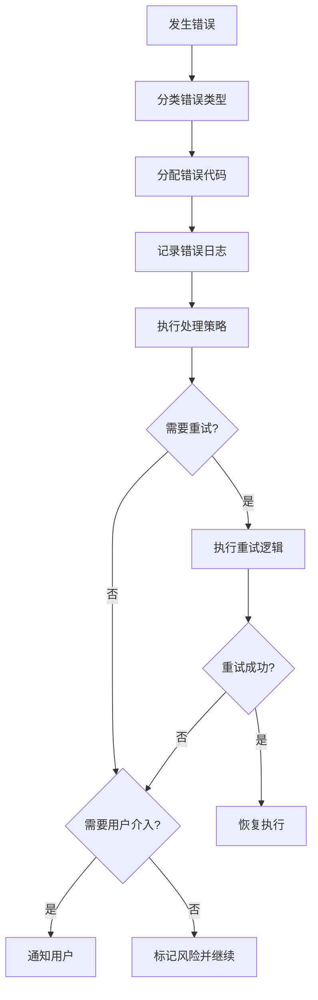

# 错误代码标准规范

## 概述

本文档定义SWF项目所有Skill的统一错误代码体系，确保错误处理的一致性和可维护性。

---

## 错误代码分类体系

### 代码范围分配

| 代码范围 | 分类 | 说明 |
|----------|------|------|
| E001-E099 | 前置校验错误 | 执行前检查发现的错误 |
| E100-E199 | 执行过程错误 | Skill执行过程中发生的错误 |
| E200-E299 | 后置校验错误 | 执行后验证发现的错误 |
| E300-E399 | 用户评审错误 | 用户评审阶段发生的错误 |
| E400-E499 | 用户交互错误 | 用户交互过程中发生的错误 |
| E900-E999 | 系统错误 | 系统级错误和未分类错误 |
| W001-W099 | 前置警告 | 非致命的前置检查警告 |
| W100-W199 | 执行警告 | 非致命的执行过程警告 |
| W200-W299 | 后置警告 | 非致命的后置检查警告 |
| W300-W399 | 评审警告 | 评审超时等警告 |
| W400-W499 | 交互警告 | 交互超时等警告 |

---

## 标准错误代码定义

### 前置校验错误 (E001-E099)

| 代码 | 错误名称 | 说明 | 处理策略 |
|------|----------|------|----------|
| E001 | 输入文件不存在 | 依赖的产物文件不存在 | 返回错误，提示先执行前置 Skill |
| E002 | 输入数据缺失 | 必需的输入数据为空 | 返回错误，提示补充数据 |
| E003 | 输入格式错误 | 输入数据格式不符合要求 | 返回错误，提示格式要求 |
| E004 | 产物ID格式错误 | 产物ID不符合规范 | 返回错误，提示正确格式 |
| E005 | 依赖Skill未执行 | 前置Skill任务状态未完成 | 返回错误，提示先完成前置Skill |

### 执行过程错误 (E100-E199)

| 代码 | 错误名称 | 说明 | 处理策略 |
|------|----------|------|----------|
| E101 | 数据解析失败 | 无法解析输入数据 | 重试3次，失败则返回错误 |
| E102 | 处理逻辑异常 | 执行过程中发生异常 | 记录日志，返回错误 |
| E103 | 外部服务错误 | 调用外部服务失败 | 重试3次，失败则标记风险 |
| E104 | 数据一致性错误 | 数据校验失败 | 返回错误，提示数据问题 |

### 后置校验错误 (E200-E299)

| 代码 | 错误名称 | 说明 | 处理策略 |
|------|----------|------|----------|
| E201 | 产物文件不存在 | 产物生成失败 | 重新执行生成逻辑 |
| E202 | 产物格式错误 | 产物格式不符合规范 | 重新生成产物 |
| E203 | 必填字段缺失 | 产物中关键字段为空 | 补充字段后重新生成 |
| E204 | 产物ID冲突 | 产物ID与已有产物冲突 | 重新生成ID |

### 用户评审错误 (E300-E399)

| 代码 | 错误名称 | 说明 | 处理策略 |
|------|----------|------|----------|
| E301 | 评审未通过 | 用户提出修改意见 | 根据意见修改产物 |
| E302 | 评审意见解析失败 | 无法理解用户输入 | 重新请求输入，最多3次 |
| E303 | 评审超时 | 用户24小时未响应 | 保持paused状态，等待用户 |

### 用户交互错误 (E400-E499)

| 代码 | 错误名称 | 说明 | 处理策略 |
|------|----------|------|----------|
| E401 | 用户输入无效 | 输入不符合预期格式 | 重新提问，引导正确输入 |
| E402 | 多轮交互超限 | 超过3轮交互仍未明确 | 记录信息缺失，标记风险 |
| E403 | 用户拒绝回答 | 用户明确表示不回答 | 使用默认值，标记风险 |

### 系统错误 (E900-E999)

| 代码 | 错误名称 | 说明 | 处理策略 |
|------|----------|------|----------|
| E901 | 文件系统错误 | 文件读写失败 | 检查权限，重试3次 |
| E902 | 内存不足 | 系统资源不足 | 提示用户，中止执行 |
| E999 | 未知错误 | 未分类的错误 | 记录日志，返回错误 |

### 警告代码 (W系列)

| 代码 | 警告名称 | 说明 | 处理策略 |
|------|----------|------|----------|
| W001 | 输入数据不完整 | 部分可选数据缺失 | 继续执行，标记待补充 |
| W101 | 处理时间较长 | 执行时间超过预期 | 继续执行，记录日志 |
| W301 | 评审等待超时 | 用户未及时评审 | 发送提醒，保持等待 |
| W401 | 交互响应超时 | 用户未及时响应 | 使用默认值继续 |

---

## S5-A02 特定错误代码

在标准错误代码基础上，S5-A02 定义以下特定错误代码：

| 代码 | 错误名称 | 说明 | 处理策略 |
|------|----------|------|----------|
| E151 | 架构视图选择失败 | 无法基于系统特征选择视图 | 使用默认视图组合 |
| E152 | 分层架构生成失败 | 无法生成分层结构 | 使用默认分层架构 |
| E153 | 模块识别失败 | 无法从需求中识别模块 | 基于功能列表推导 |
| E154 | 实体关系识别失败 | 实体关系分析异常 | 标记待确认，继续执行 |
| E155 | 部署架构设计失败 | 部署方案无法确定 | 使用默认部署方案 |

---

## 使用规范

### 1. 错误代码分配原则

1. **优先使用标准代码**：尽量使用本文档定义的标准错误代码
2. **Skill特定代码**：仅在标准代码无法满足时使用Skill特定代码
3. **代码唯一性**：确保同一Skill内错误代码不重复
4. **文档同步**：添加新错误代码时同步更新本文档

### 2. 错误处理流程



### 3. 错误信息格式

```markdown
**错误代码**: E151
**错误类型**: 执行过程错误
**错误描述**: 架构视图选择失败
**处理建议**: 使用默认视图组合（逻辑视图+实现视图）
**重试次数**: 最多3次
```

---

## 版本历史

| 版本 | 日期 | 变更内容 |
|------|------|----------|
| v1.0 | 2026-03-28 | 初始版本，定义S5-A02错误代码体系 |

---

## 附录A：异常场景详细描述

本附录提供各错误代码对应的详细场景描述，便于理解和处理实际异常情况。

### 类型A：前置条件不满足（对应E001-E099）

| 场景 | 触发条件 | 系统行为 | 用户提示 |
|------|----------|----------|----------|
| **前置产物缺失** (E001) | 架构愿景文档不存在 | 暂停当前执行，等待用户处理 | "【暂停】需要先完成【S5-A01 架构愿景定义】。请确认产物文件是否存在。" |
| **输入信息不完整** (E002) | 关键字段为空 | 触发信息补全交互 | "【信息补充】为了继续设计，需要补充以下信息：{字段名称}。" |
| **产物格式不符** (E003) | 前置产物结构不符合预期 | 提示检查或重新生成 | "【格式检查】前置产物格式异常。建议重新执行前置Skill。" |
| **前置任务未完成** (E005) | Todo-List中前置任务状态非"已完成" | 暂停并提示完成前置任务 | "【任务依赖】前置任务【S5-A01】尚未完成。" |

### 类型B：执行过程异常（对应E100-E199）

| 场景 | 触发条件 | 系统行为 | 用户提示 |
|------|----------|----------|----------|
| **视图选择失败** (E151) | 无法确定视图类型 | 使用默认视图组合 | "【默认视图】使用默认视图组合：逻辑视图+实现视图。" |
| **模块识别失败** (E153) | 需求中无法提取模块 | 基于功能列表推导 | "【模块推导】基于功能列表自动推导模块划分。" |
| **实体关系不确定** (E154) | 实体关系分析不明确 | 标记待确认 | "【待确认】部分实体关系待确认，已在产物中标注。" |

### 类型C：产物输出异常（对应E200-E299）

| 场景 | 触发条件 | 系统行为 | 用户提示 |
|------|----------|----------|----------|
| **产物保存失败** (E201/E901) | 无法写入文件 | 重试3次后提示用户检查 | "【保存失败】无法保存产物文件。请检查目录权限。" |
| **产物内容不完整** (E203) | 必填字段缺失 | 自动补充或提示完善 | "【内容完善】产物缺少以下内容：{字段列表}。" |
| **格式不符合模板** (E202) | 输出结构与模板差异 | 自动调整格式 | "【格式调整】产物格式已自动调整。" |

---

**文档版本**: v1.0
**适用范围**: S5-A02 架构视图设计 Skill
**最后更新**: 2026-03-28
