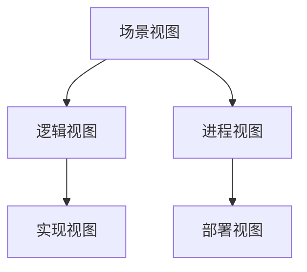
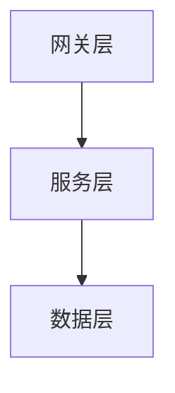
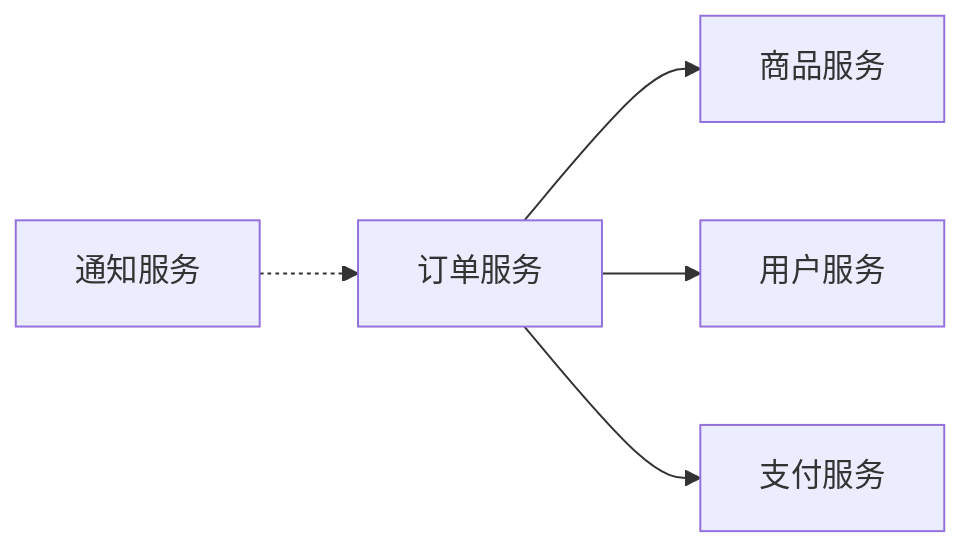
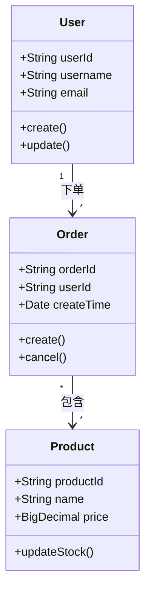
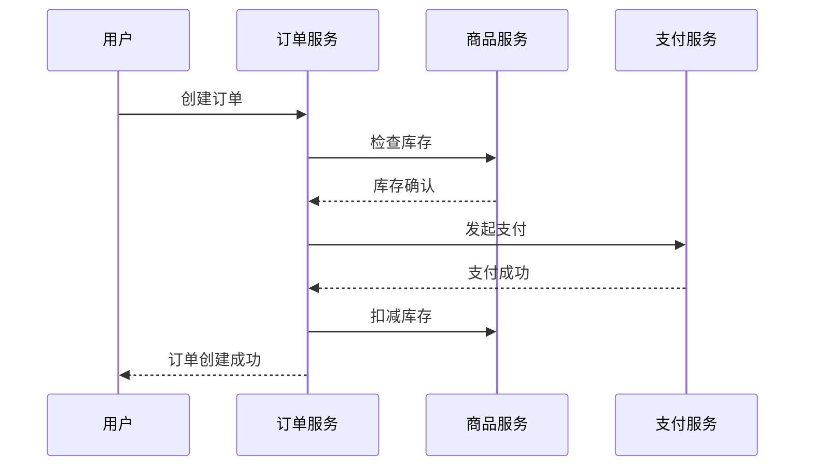
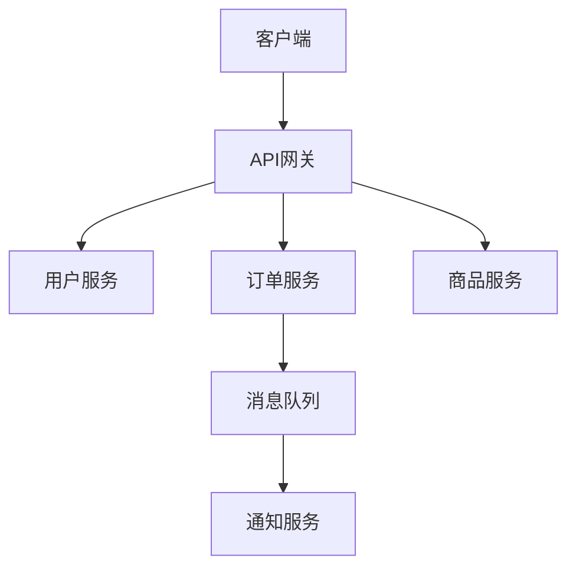
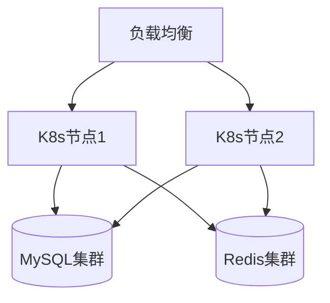

# S5-A02 Demo 示例

## 示例：电商系统架构视图设计

### 输入

```
Plan 定义文件：artifacts/plans/P000001.md
- Plan ID: P000001
- 执行模式：常规模式
- 系统类型：电商系统

架构愿景：
- 系统定位：面向中小企业的B2C电商平台
- 架构目标：高可用、可扩展、易于维护
- 架构风格：微服务架构
- 关键决策：服务拆分、异步通信、分布式部署

前置Skill产物：S5-A01已完成
```

### 处理过程

1. 前置校验 → 架构愿景文档存在，校验通过
2. 读取前置产物 → 提取系统特征和架构目标
3. 视图选择 → 选择逻辑视图+进程视图+部署视图
4. 分层架构 → 网关层/服务层/数据层
5. 模块识别 → 用户服务、商品服务、订单服务、支付服务等
6. 视图设计：
   - 逻辑视图：实体（用户、商品、订单）、聚合根、领域服务
   - 进程视图：API网关、微服务进程、消息队列
   - 部署视图：Kubernetes集群、数据库集群、缓存集群
7. 用户交互 → 确认服务拆分粒度
8. 生成文档 → P000001-S5-A02-001.md
9. 后置校验 → 校验通过
10. 用户评审 → 等待用户确认

### 输出

```
产物ID: P000001-S5-A02-001
视图选择: 逻辑视图、进程视图、部署视图、场景视图
分层架构: 网关层 → 服务层 → 数据层
模块数量: 6个核心服务 + 3个支撑服务
设计决策: 15项
风险识别: 3项
```

---

## 架构视图设计文档示例结构

```markdown
# 架构视图设计文档 - P000001-S5-A02-001

## 1. 视图选择

### 1.1 选择的视图
| 视图名称 | 选择理由 | 详细程度 |
|----------|----------|----------|
| 逻辑视图 | 核心业务建模 | 详细 |
| 进程视图 | 微服务通信和并发 | 详细 |
| 部署视图 | 分布式部署 | 详细 |
| 场景视图 | 架构验证 | 中等 |

### 1.2 视图关系


## 2. 分层架构设计

### 2.1 分层结构


### 2.2 各层职责
| 层级 | 职责 | 包含组件 |
|------|------|----------|
| 网关层 | API路由、认证、限流 | API Gateway |
| 服务层 | 业务逻辑处理 | 用户服务、订单服务、商品服务 |
| 数据层 | 数据持久化 | MySQL、Redis、MongoDB |

## 3. 模块划分

### 3.1 模块清单
| 模块名称 | 职责描述 | 所属层级 | 依赖模块 |
|----------|----------|----------|----------|
| 用户服务 | 用户注册、登录、信息管理 | 服务层 | 认证服务 |
| 商品服务 | 商品管理、库存管理 | 服务层 | - |
| 订单服务 | 订单创建、状态管理 | 服务层 | 商品服务、用户服务 |
| 支付服务 | 支付处理、退款 | 服务层 | 订单服务 |
| 认证服务 | JWT认证、权限管理 | 服务层 | - |
| 通知服务 | 消息推送、邮件发送 | 服务层 | - |

### 3.2 模块依赖关系


## 4. 逻辑视图

### 4.1 核心领域模型

#### 4.1.1 实体定义


#### 4.1.2 实体关系说明
| 实体A | 关系类型 | 实体B | 关系描述 | 业务含义 |
|-------|----------|-------|----------|----------|
| User | 一对多 | Order | 用户下单 | 一个用户可有多个订单 |
| Order | 多对多 | Product | 订单商品 | 一个订单包含多个商品 |

#### 4.1.3 实体交互流程


### 4.2 领域服务
| 服务名称 | 职责 | 输入 | 输出 | 调用实体 |
|----------|------|------|------|----------|
| 订单创建服务 | 创建订单并扣减库存 | 订单DTO | 订单实体 | Order, Product |
| 支付处理服务 | 处理支付流程 | 支付请求 | 支付结果 | Order |

## 5. 进程视图

### 5.1 运行时进程


### 5.2 并发模型
- 并发策略：每个服务独立部署，水平扩展
- 线程池配置：核心线程数=CPU核心数，最大线程数=CPU核心数×2
- 连接池配置：数据库连接池=50，Redis连接池=20

## 6. 实现视图

### 6.1 代码结构
```
services/
├── user-service/
│   ├── src/
│   │   ├── api/
│   │   ├── domain/
│   │   ├── application/
│   │   └── infrastructure/
├── order-service/
├── product-service/
└── shared/
    ├── common/
    └── libs/
```

## 7. 部署视图

### 7.1 部署架构


### 7.2 部署节点
| 节点类型 | 数量 | 配置 | 部署组件 |
|----------|------|------|----------|
| API网关节点 | 2 | 4C8G | Kong/Nginx |
| 服务节点 | 6 | 8C16G | 微服务实例 |
| 数据库节点 | 3 | 16C32G | MySQL主从 |

## 8. 场景视图

### 8.1 关键场景列表
| 场景名称 | 用例 | 验证目标 |
|----------|------|----------|
| 下单流程 | 用户下单 | 服务间协作、事务一致性 |
| 库存扣减 | 商品库存管理 | 并发控制、数据一致性 |
| 支付回调 | 支付完成通知 | 异步处理、状态同步 |

## 9. 设计决策

| 决策项 | 决策结果 | 决策理由 | 决策方式 |
|--------|----------|----------|----------|
| 分层架构 | 网关层/服务层/数据层 | 符合微服务架构风格 | 自动推导 |
| 服务拆分 | 按业务域拆分 | 独立部署、独立扩展 | 用户选择 |
| 通信方式 | 同步HTTP + 异步MQ | 核心流程同步，通知异步 | 用户选择 |

## 10. 风险与约束

### 10.1 架构风险
| 风险描述 | 风险等级 | 缓解策略 |
|----------|----------|----------|
| 分布式事务一致性 | 高 | 采用Saga模式 |
| 服务间调用延迟 | 中 | 引入缓存、异步处理 |
| 数据库分片复杂度 | 中 | 先垂直拆分，后水平扩展 |

### 10.2 设计约束
- 技术约束：使用Kubernetes部署
- 业务约束：订单处理时间<3秒
- 法规约束：用户数据需加密存储
```
