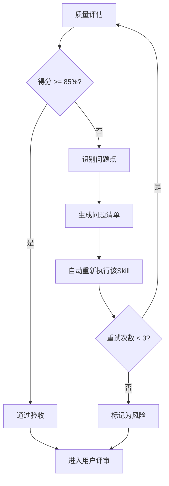

# 质量标准参考文档

## ISO/IEC 25010 质量评估框架

本文档定义SWF项目所有Skill产物的质量评估标准和检查清单。

---

## 1. 质量评估框架

### 1.1 五维度评估模型

| 维度 | 权重 | 评估标准 | 验收阈值 |
|------|------|----------|----------|
| **完整性** | 30% | 所有必需内容都已生成 | ≥ 90% |
| **准确性** | 25% | 内容准确，无错误 | ≥ 90% |
| **一致性** | 20% | 格式统一，术语一致 | ≥ 95% |
| **可读性** | 15% | 结构清晰，表达准确 | ≥ 85% |
| **可追溯性** | 10% | 来源清晰，关系明确 | ≥ 90% |

### 1.2 质量综合得分计算

```
质量综合得分 = 完整性×30% + 准确性×25% + 一致性×20% + 可读性×15% + 可追溯性×10%
```

### 1.3 验收门槛

| 结果 | 标准 | 处理方式 |
|------|------|----------|
| **通过** | 质量综合得分 ≥ 85% | 进入用户评审阶段 |
| **不通过** | 质量综合得分 < 85% | 识别问题 → 生成问题清单 → 自动重新执行 |

---

## 2. 各维度检查清单

### 2.1 完整性检查（30%）

#### S5-A02 特定检查项

| 检查项 | 检查内容 | 权重 |
|--------|----------|------|
| 视图选择完整 | 基于系统特征选择了适合的视图组合 | 20% |
| 分层架构完整 | 各层职责明确，层间依赖定义清晰 | 20% |
| 模块划分完整 | 所有功能模块已覆盖，边界清晰 | 20% |
| 逻辑视图完整 | 实体、关系、服务、事件已定义 | 15% |
| 进程视图完整 | 进程结构、并发模型已设计 | 10% |
| 部署视图完整 | 节点、网络、资源配置已定义 | 10% |
| 设计决策完整 | 所有决策已记录且包含理由 | 5% |

### 2.2 准确性检查（25%）

| 检查项 | 检查内容 | 权重 |
|--------|----------|------|
| 视图选择正确 | 视图选择符合系统特征和架构风格 | 25% |
| 分层架构正确 | 分层符合架构模式和最佳实践 | 25% |
| 实体关系准确 | 实体关系识别准确，符合业务规则 | 20% |
| 模块边界合理 | 模块划分符合高内聚低耦合原则 | 15% |
| 部署架构合理 | 部署方案符合性能和可用性需求 | 15% |

### 2.3 一致性检查（20%）

| 检查项 | 检查内容 | 权重 |
|--------|----------|------|
| 视图间一致 | 各视图描述的架构元素一致 | 30% |
| 分层与模块一致 | 模块归属与分层结构一致 | 25% |
| 术语一致 | 全文术语使用统一（如统一使用"服务"而非混用"Service"） | 20% |
| 图表格式一致 | Mermaid 图表语法正确，格式统一 | 15% |
| ID格式一致 | 产物ID、模块ID格式统一 | 10% |

### 2.4 可读性检查（15%）

| 检查项 | 检查内容 | 权重 |
|--------|----------|------|
| 结构清晰 | 章节划分合理，层级清晰 | 30% |
| 图表清晰 | Mermaid 图表可读性强，有说明 | 25% |
| 决策理由清楚 | 每个设计决策都有明确理由 | 20% |
| 模块边界清晰 | 模块职责和边界描述清楚 | 15% |
| 排版美观 | 适当的空行、分隔线使用 | 10% |

### 2.5 可追溯性检查（10%）

| 检查项 | 检查内容 | 权重 |
|--------|----------|------|
| 需求追溯 | 设计决策可追溯到需求 | 30% |
| 模块追溯 | 模块可追溯到功能需求 | 25% |
| 决策来源 | 架构决策有明确的依据来源 | 20% |
| 风险来源 | 风险识别有明确的触发原因 | 15% |
| 版本记录 | 产物版本和更新时间记录完整 | 10% |

---

## 3. 问题清单模板

当质量评估不通过时，生成问题清单：

| 问题ID | 问题描述 | 所属维度 | 严重程度 | 建议修复方式 |
|--------|----------|----------|----------|--------------|
| Q001 | 缺少XX视图设计 | 完整性 | 高 | 补充视图内容 |
| Q002 | 实体关系识别错误 | 准确性 | 中 | 重新分析业务规则 |
| Q003 | 视图间描述不一致 | 一致性 | 中 | 统一架构元素描述 |
| Q004 | 分层架构图不清晰 | 可读性 | 低 | 优化Mermaid图 |
| Q005 | 设计决策缺少依据 | 可追溯性 | 中 | 补充决策理由 |

### 严重程度定义

| 级别 | 定义 | 处理优先级 |
|------|------|-----------|
| 高 | 影响核心架构设计或导致误解 | 必须立即修复 |
| 中 | 影响体验或存在潜在问题 | 应当修复 |
| 低 | 细节问题或优化建议 | 建议修复 |

---

## 4. 不达标处理流程



### 重试机制

| 重试次数 | 处理策略 |
|----------|----------|
| 第1次 | 自动重新执行，尝试修复问题 |
| 第2次 | 自动重新执行，调整参数 |
| 第3次 | 自动重新执行，简化复杂部分 |
| 仍不达标 | 标记为风险，进入用户评审并提示问题 |

---

## 5. S5-A02 特定质量检查要点

| 维度 | 关键检查点 |
|------|-----------|
| 完整性 | 视图选择完整、分层架构完整、模块划分完整、各视图内容完整 |
| 准确性 | 视图选择符合系统特征、分层架构符合架构风格、实体关系准确 |
| 一致性 | 各视图间描述一致、分层与模块一致、术语使用统一 |
| 可读性 | 架构文档结构清晰、Mermaid 图表可读性强、决策理由清楚 |
| 可追溯性 | 设计决策可追溯到需求、模块可追溯到功能需求 |

---

## 6. 质量评估执行指南

### 6.1 自评清单

每个Skill完成后，执行以下自评：

```markdown
## 质量自评

- [ ] 完整性检查通过（≥90%）
- [ ] 准确性检查通过（≥90%）
- [ ] 一致性检查通过（≥95%）
- [ ] 可读性检查通过（≥85%）
- [ ] 可追溯性检查通过（≥90%）

**综合得分**: ___分
**评估结果**: □ 通过  □ 不通过
```

### 6.2 评估记录

在产物文档末尾添加质量评估记录：

```markdown
## 质量评估记录

| 评估时间 | 评估版本 | 综合得分 | 结果 | 评估人 |
|----------|----------|----------|------|--------|
| 2026-03-28 | v3.2.0 | 92% | 通过 | AI |
```

---

**文档版本**: v1.0
**适用对象**: S5-A02 架构视图设计 Skill
**最后更新**: 2026-03-28
