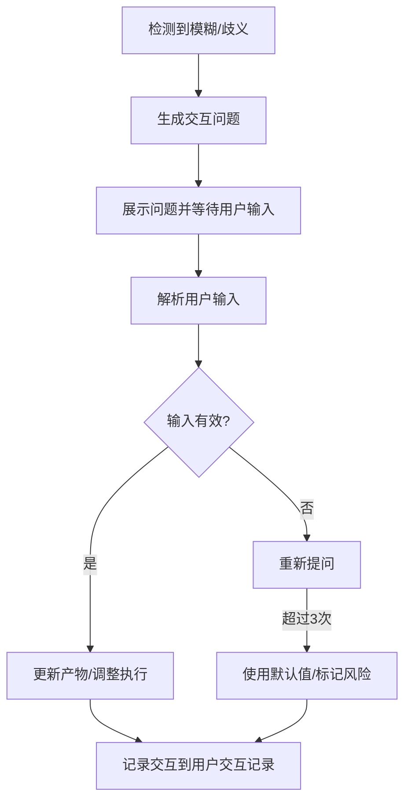

# 需求澄清模板

## 模板说明

此模板用于需求描述模糊、信息不完整或存在歧义时，向用户发起澄清请求。

---

## 交互模板

```
【信息澄清请求】

在[当前步骤]过程中，发现以下信息需要澄清：

问题描述：{具体问题}
当前上下文：{相关背景}
可能理解：
  A. {理解A}
  B. {理解B}
  C. {理解C}
  D. 其他（请说明）

请选择正确的理解（输入A/B/C/D）：
```

---

## 使用场景

### 场景1：架构风格未明确

**示例**：
```
【信息澄清请求】

在[架构视图设计]过程中，发现以下信息需要澄清：

问题描述：架构愿景中提到"采用微服务架构"，但未明确服务拆分粒度
当前上下文：正在设计模块划分和分层架构
可能理解：
  A. 按业务域拆分（用户服务、订单服务、商品服务等）
  B. 按功能拆分（认证服务、支付服务、通知服务等）
  C. 按团队拆分（按开发团队边界划分）
  D. 其他（请说明）

请选择正确的理解（输入A/B/C/D）：
```

### 场景2：分层架构选择

**示例**：
```
【信息澄清请求】

在[分层架构设计]过程中，发现以下信息需要澄清：

问题描述：对于"可扩展性"的要求存在多种理解
当前上下文：正在设计系统分层结构
可能理解：
  A. 水平扩展（增加服务实例数量）
  B. 垂直扩展（增强单个服务能力）
  C. 功能扩展（易于添加新功能模块）
  D. 其他（请说明）

请选择正确的理解（输入A/B/C/D）：
```

### 场景3：模块边界定义

**示例**：
```
【信息澄清请求】

在[模块划分设计]过程中，发现以下信息需要澄清：

问题描述："订单管理"模块的功能边界不清晰
当前上下文：正在识别系统模块和组件
可能理解：
  A. 仅包含订单创建、查询、取消
  B. 包含订单全生命周期管理（创建、支付、发货、完成、退款）
  C. 包含订单管理和库存预占
  D. 其他（请说明）

请选择正确的理解（输入A/B/C/D）：
```

---

## 字段说明

| 字段 | 说明 | 示例 |
|------|------|------|
| 当前步骤 | 发生澄清需求的Skill步骤 | 架构视图设计、分层架构设计 |
| 问题描述 | 具体需要澄清的问题 | 架构风格未明确、分层架构选择 |
| 当前上下文 | 问题发生的背景 | 正在设计模块划分 |
| 可能理解 | 提供的选项A/B/C | 不同的理解方式 |

---

## 处理流程



---

## 交互记录格式

所有澄清交互记录保存到产物文档的"用户交互记录"章节：

| 交互轮次 | 交互时间 | 交互类型 | 问题描述 | 用户输入 | 解析结果 | 处理状态 |
|----------|----------|----------|----------|----------|----------|----------|
| 1 | 2026-03-28 10:00 | 澄清问题 | 架构风格未明确 | A | 采用理解A：按业务域拆分 | 已处理 |

---

**模板版本**: v1.0
**适用Skill**: S5-A02 架构视图设计
**最后更新**: 2026-03-28
