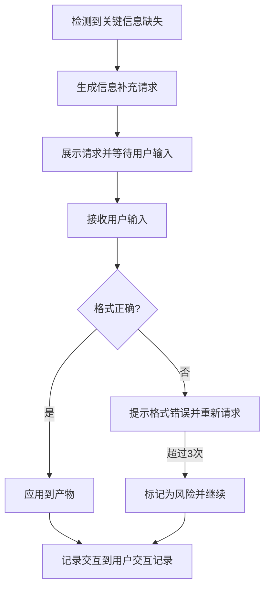

# 信息收集模板

## 模板说明

此模板用于关键信息缺失需要用户补充时，向用户发起信息收集请求。

---

## 交互模板

```
【信息补充请求】

在[当前步骤]过程中，发现以下关键信息缺失：

缺失字段：{字段名称}
影响说明：{不补充的影响}
期望格式：{格式要求}
示例：{参考示例}

请补充信息：
```

---

## 使用场景

### 场景1：部署约束信息缺失

**示例**：
```
【信息补充请求】

在[部署视图设计]过程中，发现以下关键信息缺失：

缺失字段：部署环境约束
影响说明：无法确定部署架构和资源配置方案
期望格式：云平台/自建机房、容器化/虚拟机、可用性要求
示例：阿里云、Kubernetes容器化、99.9%可用性

请补充信息：
```

### 场景2：性能需求信息缺失

**示例**：
```
【信息补充请求】

在[进程视图设计]过程中，发现以下关键信息缺失：

缺失字段：并发性能指标
影响说明：无法设计合理的并发模型和资源规划
期望格式：QPS/TPS、响应时间、并发用户数
示例：QPS 10000、响应时间<100ms、并发用户5000

请补充信息：
```

### 场景3：技术栈约束缺失

**示例**：
```
【信息补充请求】

在[实现视图设计]过程中，发现以下关键信息缺失：

缺失字段：技术栈约束
影响说明：无法设计合理的代码组织结构和技术选型
期望格式：必须使用的技术/框架列表
示例：Spring Boot、MySQL、Redis、Kafka

请补充信息：
```

### 场景4：模块边界信息缺失

**示例**：
```
【信息补充请求】

在[模块划分设计]过程中，发现以下关键信息缺失：

缺失字段：核心业务流程
影响说明：无法准确识别核心模块和模块依赖关系
期望格式：核心业务流程描述，按优先级排序
示例：用户注册→商品浏览→下单支付→订单完成

请补充信息：
```

---

## 字段说明

| 字段 | 说明 | 示例 |
|------|------|------|
| 当前步骤 | 发生信息缺失的Skill步骤 | 部署视图设计、进程视图设计 |
| 缺失字段 | 需要补充的信息名称 | 部署环境约束、并发性能指标 |
| 影响说明 | 不补充该信息的后果 | 无法确定部署架构 |
| 期望格式 | 信息的格式要求 | 云平台/可用性要求 |
| 示例 | 参考填写示例 | 阿里云、99.9%可用性 |

---

## 处理流程



---

## 可选处理策略

当用户无法提供信息时：

| 策略 | 适用场景 | 处理方式 |
|------|----------|----------|
| 使用默认值 | 有行业通用标准 | 采用行业平均值或通用做法 |
| 标记为风险 | 信息对结果影响大 | 在风险章节记录该不确定性 |
| 跳过并继续 | 信息对当前阶段非关键 | 记录待补充，继续执行 |
| 暂停等待 | 信息为关键依赖 | 保存断点，等待用户补充 |

---

## 交互记录格式

所有信息收集交互记录保存到产物文档的"用户交互记录"章节：

| 交互轮次 | 交互时间 | 交互类型 | 缺失字段 | 用户输入 | 处理策略 | 处理状态 |
|----------|----------|----------|----------|----------|----------|----------|
| 1 | 2026-03-28 10:30 | 信息收集 | 部署环境约束 | 阿里云K8s | 直接应用 | 已处理 |
| 2 | 2026-03-28 11:00 | 信息收集 | 并发性能指标 | - | 标记为风险 | 待补充 |

---

**模板版本**: v1.0
**适用Skill**: S5-A02 架构视图设计
**最后更新**: 2026-03-28
