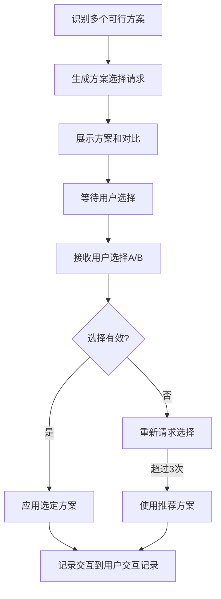

# 方案选择模板

## 模板说明

此模板用于存在多个可行方案需要用户决策时，向用户发起方案选择请求。

---

## 交互模板

```
【方案选择请求】

针对{决策点}，存在以下可行方案：

方案A：{方案A描述}
  - 优点：{优点列表}
  - 缺点：{缺点列表}
  - 适用场景：{场景}

方案B：{方案B描述}
  - 优点：{优点列表}
  - 缺点：{缺点列表}
  - 适用场景：{场景}

请选择您的偏好（输入A/B）：
```

---

## 使用场景

### 场景1：分层架构方案选择

**示例**：
```
【方案选择请求】

针对[分层架构设计]，存在以下可行方案：

方案A：经典三层架构
  - 优点：简单易懂、团队熟悉度高、开发效率高
  - 缺点：扩展性有限、业务逻辑耦合
  - 适用场景：中小型项目、团队<10人、快速迭代

方案B：DDD四层架构
  - 优点：业务领域清晰、易于扩展、测试友好
  - 缺点：学习曲线陡、开发周期长、团队要求高
  - 适用场景：复杂业务、长期维护、团队有DDD经验

请选择您的偏好（输入A/B）：
```

### 场景2：服务拆分策略选择

**示例**：
```
【方案选择请求】

针对[服务拆分策略]，存在以下可行方案：

方案A：按业务域拆分
  - 优点：业务边界清晰、团队独立开发、领域驱动
  - 缺点：跨域调用多、数据一致性复杂
  - 适用场景：业务域明确、需要领域建模

方案B：按功能拆分
  - 优点：功能独立、复用性高、粒度灵活
  - 缺点：业务语义不清晰、服务数量多
  - 适用场景：功能相对独立、需要高度复用

请选择您的偏好（输入A/B）：
```

### 场景3：模块合并/拆分选择

**示例**：
```
【方案选择请求】

针对[订单与库存模块]，存在以下可行方案：

方案A：合并为一个模块
  - 优点：简化调用、事务一致性强、开发简单
  - 缺点：耦合度高、独立扩展受限
  - 适用场景：订单与库存强关联、规模较小

方案B：保持分离，通过事件解耦
  - 优点：独立扩展、职责清晰、松耦合
  - 缺点：最终一致性、实现复杂度高
  - 适用场景：需要独立扩展、高并发场景

请选择您的偏好（输入A/B）：
```

### 场景4：部署架构选择

**示例**：
```
【方案选择请求】

针对[部署架构设计]，存在以下可行方案：

方案A：单机部署 + 负载均衡
  - 优点：简单可靠、运维成本低、故障排查容易
  - 缺点：扩展性有限、单点风险
  - 适用场景：用户量<10万、预算有限

方案B：Kubernetes容器化部署
  - 优点：弹性伸缩、高可用、标准化部署
  - 缺点：运维复杂度高、学习成本高
  - 适用场景：用户量>10万、需要弹性扩展

请选择您的偏好（输入A/B）：
```

---

## 字段说明

| 字段 | 说明 | 示例 |
|------|------|------|
| 决策点 | 需要做出决策的具体事项 | 分层架构设计、服务拆分策略 |
| 方案描述 | 方案的核心内容 | 三层架构、DDD四层架构 |
| 优点 | 该方案的优势 | 简单易懂、扩展性好 |
| 缺点 | 该方案的劣势 | 扩展性有限、复杂度高 |
| 适用场景 | 该方案适合的情况 | 中小型项目、复杂业务 |

---

## 处理流程



---

## 扩展：三方案选择

当需要三个选项时，扩展模板：

```
【方案选择请求】

针对{决策点}，存在以下可行方案：

方案A：{方案A描述}
  - 优点：{优点列表}
  - 缺点：{缺点列表}
  - 适用场景：{场景}

方案B：{方案B描述}
  - 优点：{优点列表}
  - 缺点：{缺点列表}
  - 适用场景：{场景}

方案C：{方案C描述}
  - 优点：{优点列表}
  - 缺点：{缺点列表}
  - 适用场景：{场景}

请选择您的偏好（输入A/B/C）：
```

---

## 交互记录格式

所有方案选择交互记录保存到产物文档的"用户交互记录"章节：

| 交互轮次 | 交互时间 | 交互类型 | 决策点 | 用户选择 | 选定方案 | 处理状态 |
|----------|----------|----------|--------|----------|----------|----------|
| 1 | 2026-03-28 14:00 | 方案选择 | 分层架构设计 | B | DDD四层架构 | 已应用 |
| 2 | 2026-03-28 15:30 | 方案选择 | 服务拆分策略 | A | 按业务域拆分 | 已应用 |

---

**模板版本**: v1.0
**适用Skill**: S5-A02 架构视图设计
**最后更新**: 2026-03-28
