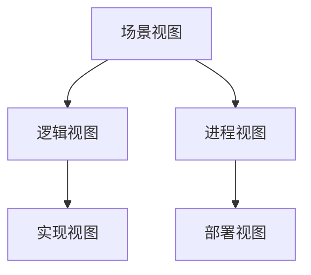
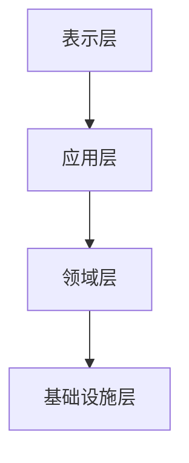
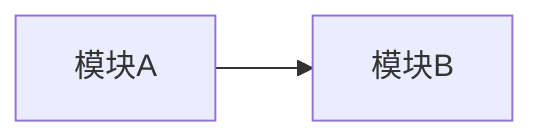
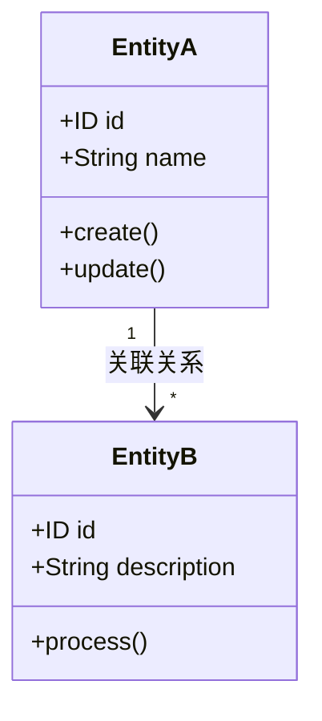
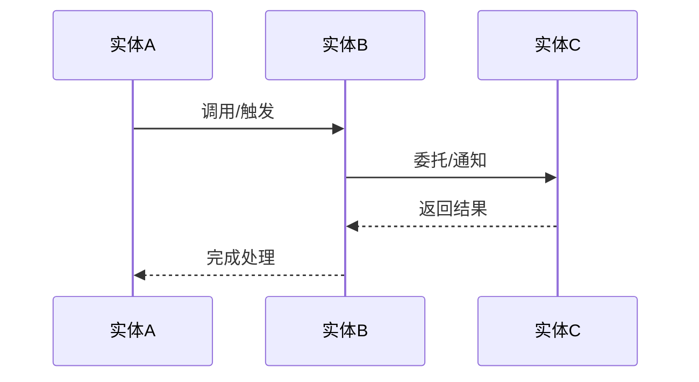
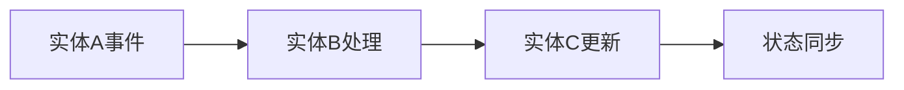
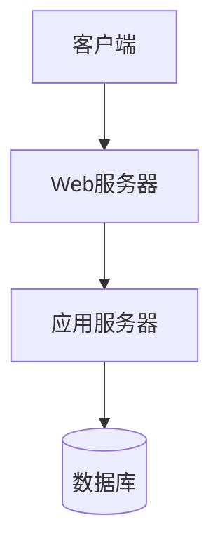
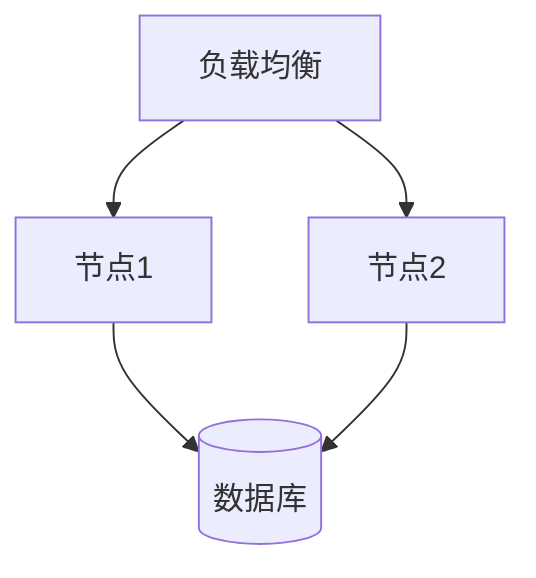
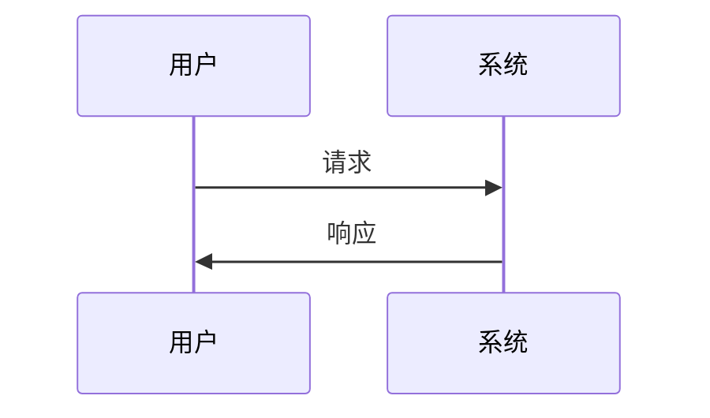

# {PlanID}-S5-A02-001 架构视图设计文档

---
version: v1.0
created_at: {创建时间}
updated_at: {更新时间}
---

## 基本信息

- **Plan ID**: {PlanID}
- **Skill ID**: S5-A02
- **执行时间**: {执行时间}
- **执行模式**: 自动分析 + 用户交互

---

## 1. 视图选择

### 1.1 选择的视图

| 视图名称 | 选择理由 | 详细程度 |
|----------|----------|----------|
| 逻辑视图 | | |
| 进程视图 | | |
| 实现视图 | | |
| 部署视图 | | |
| 场景视图 | | |

### 1.2 视图关系



---

## 2. 分层架构设计

### 2.1 分层结构



### 2.2 各层职责

| 层级 | 职责 | 包含组件 |
|------|------|----------|
| 表示层 | | |
| 应用层 | | |
| 领域层 | | |
| 基础设施层 | | |

### 2.3 层间依赖

- 依赖方向：
- 接口定义位置：
- 跨层调用规则：

---

## 3. 模块划分

### 3.1 模块清单

| 模块名称 | 职责描述 | 所属层级 | 依赖模块 |
|----------|----------|----------|----------|
| | | | |

### 3.2 模块依赖关系



---

## 4. 逻辑视图

### 4.1 核心领域模型

#### 4.1.1 实体定义



#### 4.1.2 实体关系说明

| 实体A | 关系类型 | 实体B | 关系描述 | 业务含义 |
|-------|----------|-------|----------|----------|
| | 一对一/一对多/多对多 | | | |

#### 4.1.3 实体交互流程



**实体交互说明**：

| 步骤 | 调用方 | 被调用方 | 交互类型 | 业务场景 | 数据传递 |
|------|--------|----------|----------|----------|----------|
| 1 | | | 同步调用/异步事件/状态变更 | | |

#### 4.1.4 领域事件流



| 事件名称 | 发布实体 | 订阅实体 | 触发条件 | 处理逻辑 |
|----------|----------|----------|----------|----------|
| | | | | |

### 4.2 领域服务

| 服务名称 | 职责 | 输入 | 输出 | 调用实体 |
|----------|------|------|------|----------|
| | | | | |

---

## 5. 进程视图

### 5.1 运行时进程



### 5.2 并发模型

- 并发策略：
- 线程池配置：
- 连接池配置：

---

## 6. 实现视图

### 6.1 代码结构

```
src/
├── layer1/
│   └── module1/
├── layer2/
│   └── module2/
```

### 6.2 模块目录结构

| 模块 | 目录结构 | 关键文件 |
|------|----------|----------|
| | | |

---

## 7. 部署视图

### 7.1 部署架构



### 7.2 部署节点

| 节点类型 | 数量 | 配置 | 部署组件 |
|----------|------|------|----------|
| | | | |

---

## 8. 场景视图

### 8.1 关键场景列表

| 场景名称 | 用例 | 验证目标 |
|----------|------|----------|
| | | |

### 8.2 场景实现



---

## 9. 设计决策

| 决策项 | 决策结果 | 决策理由 | 决策方式 |
|--------|----------|----------|----------|
| 分层架构 | | | 自动推导/用户选择 |
| 模块划分 | | | 自动推导/用户选择 |
| 通信方式 | | | 自动推导/用户选择 |

---

## 10. 风险与约束

### 10.1 架构风险

| 风险描述 | 风险等级 | 缓解策略 |
|----------|----------|----------|
| | | |

### 10.2 设计约束

- 技术约束：
- 业务约束：
- 法规约束：

---

## 用户交互记录

| 交互轮次 | 交互时间 | 交互类型 | 问题描述 | 用户输入 | 处理状态 |
|----------|----------|----------|----------|----------|----------|
| | | | | | |

---

## 评审记录

| 评审轮次 | 评审时间 | 评审结果 | 评审意见 | 处理状态 |
|----------|----------|----------|----------|----------|
| | | | | |

---

## 质量评估记录

| 评估时间 | 评估版本 | 综合得分 | 结果 | 评估人 |
|----------|----------|----------|------|--------|
| | | | | |
