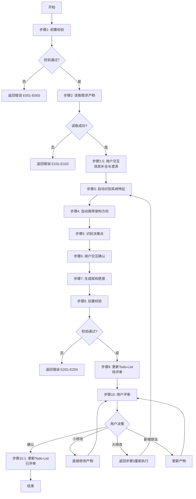
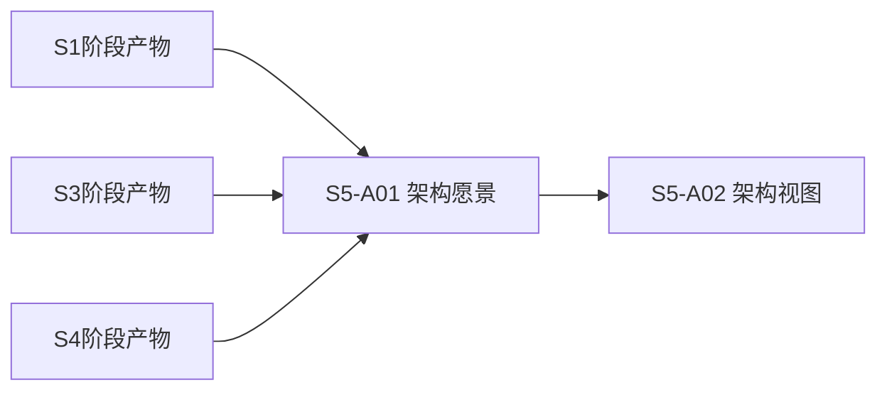
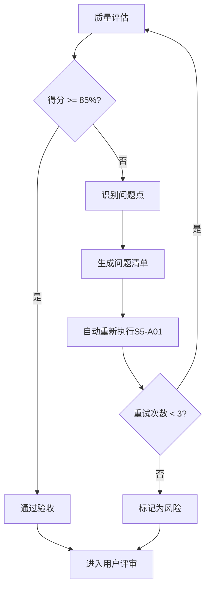

# S5-A01: 架构愿景定义

## Section 1: 元信息 (Meta Information)

| 项目             | 内容                       |
| -------------- | -------------------------- |
| **Skill 编号**   | S5-A01                     |
| **Skill 名称**   | 架构愿景定义                 |
| **Skill 英文名称** | Architecture Vision Definition |
| **所属阶段**       | S5 - 架构设计阶段             |
| **执行顺序**       | S5 阶段第 1 个执行            |
| **执行模式**       | normal / lightweight 均执行  |
| **依赖 Skill**   | S4 阶段产物（需求整合与核心提炼）  |
| **后置 Skill**   | S5-A02（架构视图设计）         |
| **版本**          | v3.2.0                     |
| **最后更新时间**    | 2026-03-28                 |
| **参考标准**      | ISO/IEC/IEEE 42010:2011    |

## Contract

| 项目 | 内容 |
|------|------|
| **Skill ID** | S5-A01 |
| **Stage** | S5 |
| **Directory** | skills/s5-vision |
| **Depends On** | S406 |
| **Next (Normal)** | S5-A02 |
| **Next (Lightweight)** | S5-A02 |
| **Lightweight Skip** | No |
| **Required Inputs** | 参见 workflow-manifest.yaml |
| **Outputs** | artifacts/stages/s5/{PlanID}-S5-A01-001.md |

***

## Section 2: 功能描述 (Functional Description)

### 2.1 核心职责

S5-A01 负责基于需求分析产物，定义系统架构愿景和方向。主要职责包括：

1. **读取需求产物**：加载需求规格说明书、用户故事、约束条件等前置产物
2. **系统特征识别**：自动分析系统类型、用户规模、数据特征、性能要求、集成需求、安全等级
3. **架构方向推导**：基于系统特征自动推荐架构风格、技术策略、存储方案
4. **决策点识别**：识别需要用户确认的架构决策点（架构风格、技术栈、部署方式等）
5. **用户交互确认**：与用户交互确认关键架构决策
6. **架构目标定义**：明确功能性目标和非功能性目标
7. **架构原则制定**：基于系统特征选择适用的架构原则
8. **风险与假设识别**：识别架构风险和设计假设
9. **架构愿景生成**：生成完整的架构愿景文档（Markdown）
10. **用户评审支持**：支持用户对架构愿景进行评审和修改

### 2.2 输入规范 (Input Specifications)

#### 用户/前置 Skill 需要提供什么

**前置产物（必需）**：

| 阶段 | 产物名称 | 产物 ID 示例 | 用途 |
|------|---------|-------------|------|
| S2 | 需求边界界定报告 | `{PlanID}-S2-S201-001` | 获取需求范围边界 |
| S2 | 显性需求提取清单 | `{PlanID}-S2-S202-001` | 获取显性需求列表 |
| S2 | 需求验证报告 | `{PlanID}-S2-S204-001` | 获取已验证需求 |
| S3 | 技术可行性评估报告 | `{PlanID}-S3-S301-001` | 获取技术约束需求 |
| S3 | 技术选型报告 | `{PlanID}-S3-S302-001` | 获取技术栈决策 |
| S3 | 风险识别报告 | `{PlanID}-S3-S304-001` | 获取风险相关需求 |
| S4 | 需求分类报告 | `{PlanID}-S4-S401-001` | 获取需求分类体系 |
| S4 | 核心需求报告 | `{PlanID}-S4-S403-001` | 获取核心需求列表 |

**输入格式**：
- Markdown 报告文件
- 结构化数据表格
- 产物 ID 列表（用于追溯）

**输入验证规则**：
- 所有前置产物必须存在且状态为 completed
- 产物 ID 必须匹配且连续
- Markdown 报告必须结构完整

#### 输入示例

**前置产物引用示例**：

```
PlanID: P000001
前置产物：
- P000001-S2-S201-001 (需求边界界定报告)
- P000001-S2-S202-001 (显性需求提取清单)
- P000001-S2-S204-001 (需求验证报告)
- P000001-S3-S301-001 (技术可行性评估报告)
- P000001-S3-S302-001 (技术选型报告)
- P000001-S3-S304-001 (风险识别报告)
- P000001-S4-S401-001 (需求分类报告)
- P000001-S4-S403-001 (核心需求报告)
```

### 2.3 输出规范 (Output Specifications)

#### 用户会得到什么

Skill 完成后，系统会生成以下产物并保存到项目目录：

**产物清单**：

| 产物名称 | 文件位置 | 格式 | 用途 | 用户可见性 |
|---------|---------|------|------|-----------|
| 架构愿景文档 | `artifacts/stages/s5/{PlanID}-S5-A01-001.md` | Markdown | 架构愿景完整文档 | 用户可查看 |
| Todo-List 更新 | `artifacts/plans/{PlanID}/todo-list.md` | Markdown | 任务状态更新 | 用户可查看 |

**产物内容结构**：

1. **系统定位**：系统名称、类型、目标用户、核心价值
2. **系统特征分析**：用户规模、数据特征、性能要求、集成需求、安全等级
3. **架构目标**：功能性目标、非功能性目标、目标优先级
4. **关键架构决策**：架构风格、技术栈、部署方式等决策记录
5. **架构原则**：适用的架构原则及优先级
6. **风险与假设**：架构风险识别、设计假设
7. **待确认事项**：遗留的待确认决策项
8. **用户交互记录**：交互轮次、问题、用户输入
9. **评审记录**：评审时间、结果、意见

#### 输出示例

**架构愿景文档示例结构**：

```markdown
# 架构愿景文档 - P000001-S5-A01-001

## 1. 系统定位
- 系统名称：企业项目管理系统
- 系统类型：企业Web应用
- 目标用户：中小企业员工、部门经理、系统管理员
- 核心价值：提升项目协作效率，实现跨部门信息共享

## 2. 系统特征分析
- 用户规模：部门级（约500用户）
- 数据特征：关系型数据为主
- 性能要求：中等并发（约200并发）
- 集成需求：与OA系统集成
- 安全等级：敏感级别

## 3. 架构目标
### 3.1 功能性目标
- 支持项目创建、任务分配、进度跟踪
- 支持多部门协作和权限管理

### 3.2 非功能性目标
- 性能目标：响应时间<2秒
- 可用性目标：99.9%
- 安全目标：敏感数据加密

## 4. 关键架构决策
| 决策项 | 决策结果 | 决策理由 | 决策方式 |
|--------|----------|----------|----------|
| 架构风格 | 分层架构 | 适合当前规模 | 用户选择 |
| 技术栈 | Spring Boot + PostgreSQL | 团队熟悉 | 用户选择 |
...
```

***

## Section 3: 执行流程 (Execution Process)

### 3.1 流程概览



### 3.2 详细步骤

详细步骤说明见 [references/execution-details.md](references/execution-details.md)

### 3.3 Demo 示例

执行示例见 [references/examples.md](references/examples.md)

---

## Section 4: 产物规范 (Artifact Specifications)

S5-A01产物规范遵循 [artifact-specifications.md](../_shared/artifact-specifications.md) 中的通用定义。

### 4.1 S5-A01特定产物清单

| 产物名称 | 产物ID | 存储路径 | 说明 |
|---------|--------|---------|------|
| 架构愿景文档 | `{PlanID}-S5-A01-001` | `artifacts/stages/s5/{PlanID}-S5-A01-001.md` | 主产物，包含系统定位、架构目标、关键决策、架构原则、风险与假设 |

### 4.2 产物依赖关系



**依赖说明**：
- 依赖 S1-S4 阶段产物作为输入
- 为后续 S5-A02（架构视图设计）提供基础

---

## Section 5: 质量标准 (Quality Standards)

### 5.1 质量评估框架

S5-A01遵循 [quality-standard.md](../_shared/quality-standard.md) 中的ISO/IEC 25010质量评估框架。

**S5-A01特定权重分配**：

| 维度 | 权重 | 评估标准 | 验收阈值 |
|------|------|----------|----------|
| **完整性** | 30% | 所有必需内容都已生成 | ≥ 90% |
| **准确性** | 25% | 内容准确，无错误 | ≥ 90% |
| **一致性** | 20% | 格式统一，术语一致 | ≥ 95% |
| **可读性** | 15% | 结构清晰，表达准确 | ≥ 85% |
| **可追溯性** | 10% | 来源清晰，关系明确 | ≥ 90% |

**质量综合得分** = 完整性×30% + 准确性×25% + 一致性×20% + 可读性×15% + 可追溯性×10%

**验收门槛**：质量综合得分 ≥ 85%

### 5.2 检查清单

**完整性检查**（30%）：
- [ ] 系统定位章节完整（名称、类型、用户、价值）
- [ ] 系统特征分析完整（6个维度全覆盖）
- [ ] 架构目标完整（功能性+非功能性）
- [ ] 关键架构决策记录完整
- [ ] 架构原则已定义
- [ ] 风险与假设已识别

**准确性检查**（25%）：
- [ ] 系统特征分析准确
- [ ] 架构推荐与特征匹配
- [ ] 决策理由充分合理
- [ ] 风险等级判定正确

**一致性检查**（20%）：
- [ ] 术语使用一致
- [ ] 决策与推荐一致
- [ ] 格式符合模板规范

**可读性检查**（15%）：
- [ ] 文档结构清晰
- [ ] 表格格式规范
- [ ] 决策理由表达清晰

**可追溯性检查**（10%）：
- [ ] 需求来源可追溯
- [ ] 决策依据明确
- [ ] 与前置产物关联清晰

### 5.3 质量综合得分计算

```
得分 = Σ(维度得分 × 维度权重)

示例：
- 完整性：95% × 30% = 28.5
- 准确性：90% × 25% = 22.5
- 一致性：100% × 20% = 20.0
- 可读性：90% × 15% = 13.5
- 可追溯性：95% × 10% = 9.5
- 总分：28.5 + 22.5 + 20.0 + 13.5 + 9.5 = 94.0%
```

### 5.4 验收标准

| 结果 | 标准 | 处理方式 |
|------|------|----------|
| **通过** | 质量综合得分 ≥ 85% | 进入用户评审阶段 |
| **不通过** | 质量综合得分 < 85% | 识别问题 → 生成问题清单 → 自动重新执行 |

### 5.5 不达标处理流程



**重试机制**：
- 第1次：自动重新执行，尝试修复问题
- 第2次：自动重新执行，调整参数
- 第3次：自动重新执行，简化复杂部分
- 仍不达标：标记为风险，进入用户评审并提示问题

---

## Section 6: 异常处理

### 6.1 常见异常场景

**前置校验失败**（如需求产物不存在）：
- 提示用户先完成需求分析阶段
- 返回错误 E001（输入文件不存在）

**执行过程异常**（如系统特征识别失败）：
- 自动重试（最多3次）
- 失败后标记风险继续执行

**后置校验失败**（如架构愿景不完整）：
- 重新生成产物
- 或标记为风险进入用户评审

**用户评审未通过**：
- 根据意见修改产物
- 小修改直接编辑，大修改重新执行

### 6.2 本 Skill 特定场景

| 场景 | 处理方式 |
|------|----------|
| 需求描述模糊 | 列出可能的解释供用户选择 |
| 用户选择冲突 | 分析冲突原因，提供权衡建议 |
| 技术选项过多 | 基于常见实践筛选2-3个最佳选项 |

### 6.3 恢复策略

| 异常类型 | 处理策略 |
|----------|----------|
| 可重试异常 | 自动重试3次 |
| 数据缺失 | 请求用户补充 |
| 校验失败 | 重新执行或标记风险 |
| 用户拒绝 | 使用默认值继续 |

### 6.4 错误代码参考

详细错误代码参见 [error-code-standard.md](../_shared/error-code-standard.md)

**S5-A01 常用错误代码**：

| 错误码 | 错误类型 | 说明 | 处理策略 |
|--------|----------|------|----------|
| E001 | 输入文件不存在 | 需求分析产物不存在 | 提示先完成需求分析 |
| E002 | 输入数据缺失 | 关键需求信息缺失 | 请求用户补充 |
| E101 | 数据解析失败 | 无法解析需求产物 | 重试3次 |
| E201 | 产物文件不存在 | 架构愿景生成失败 | 重新生成 |
| E301 | 评审未通过 | 用户提出修改意见 | 根据意见修改 |

详细流程参见 [execution-flow-standard.md](../_shared/execution-flow-standard.md)

---

**本 Skill 符合 ISO/IEC/IEEE 42010:2011 架构描述标准，遵循 ISO/IEC 25010 质量模型**
