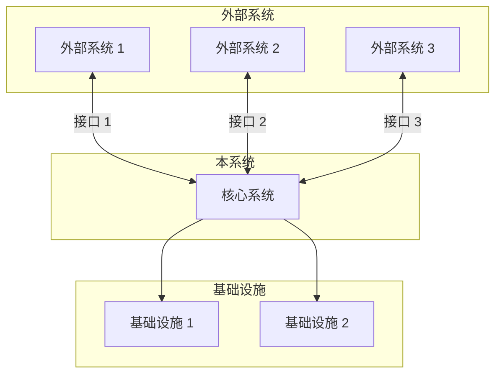
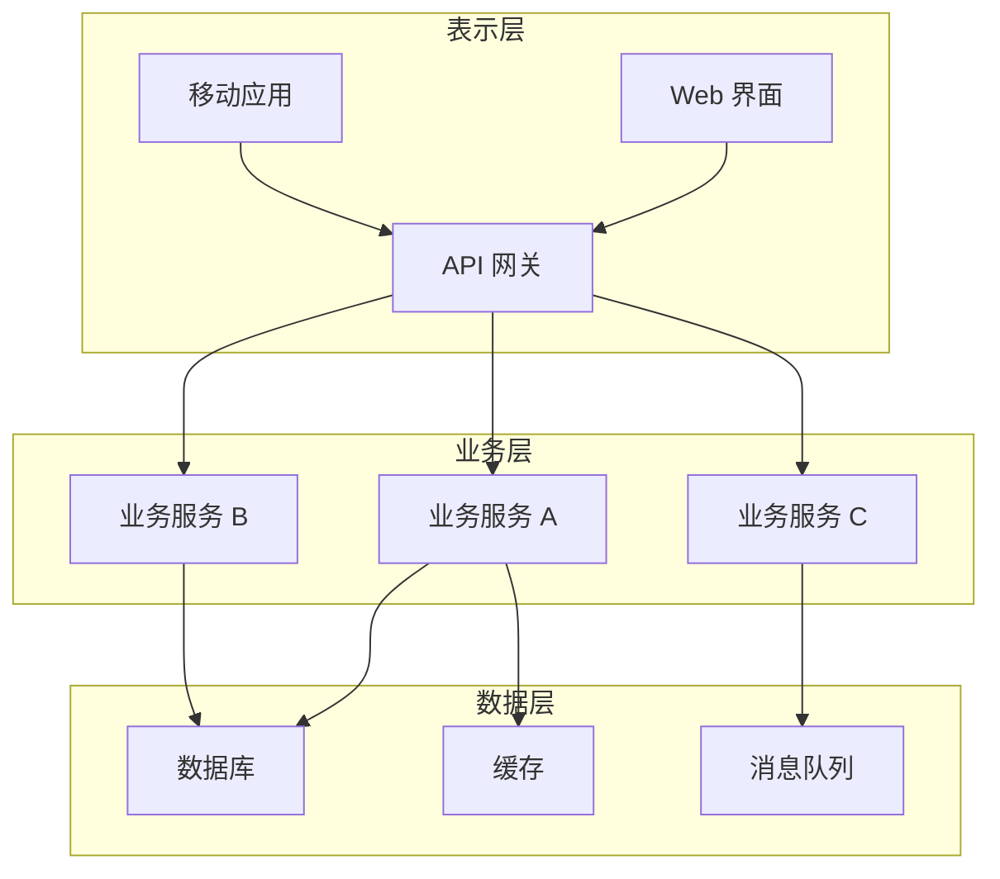
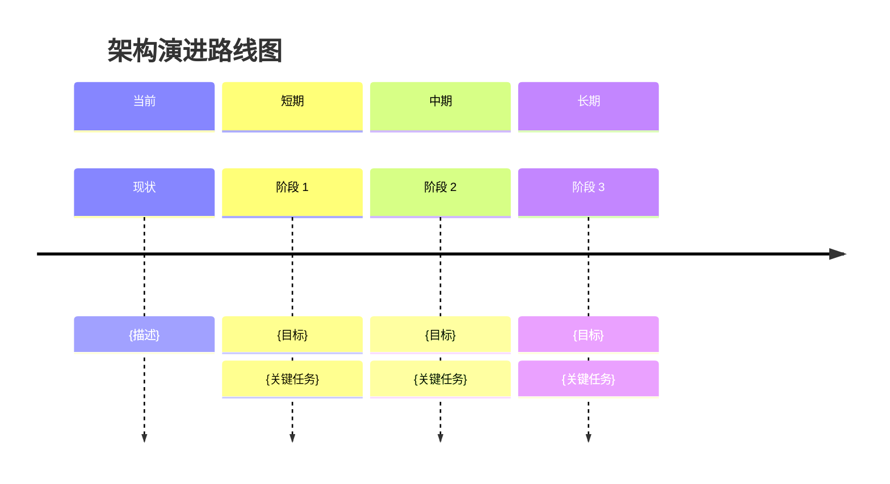

# S5-A01 输出模板：架构愿景文档

## 模板说明

本模板用于 S5-A01（架构愿景定义）的输出产物：**架构愿景文档**。

**产物 ID 格式**：`{PlanID}-S5-A01-001`

**存储路径**：`artifacts/stages/s5/{PlanID}-S5-A01-001.md`

**模板版本**：1.0

---

## 模板内容

```markdown
# 架构愿景文档

## 元信息

| 项目 | 内容 |
|-----|------|
| **文档 ID** | {PlanID}-S5-A01-001 |
| **Plan ID** | {PlanID} |
| **Skill 编号** | S5-A01 |
| **Skill 名称** | 架构愿景定义 |
| **生成时间** | {YYYY-MM-DD HH:MM} |
| **版本** | v1.0 |

---

## 一、架构愿景概览

### 1.1 执行摘要

**项目背景**：
{简要描述项目背景和业务驱动因素，100-200 字}

**架构目标**：
{用 1-2 句话概括架构设计的核心目标}

**关键决策**：
{列出 3-5 个最关键的架构决策}

### 1.2 质量评估

| 质量维度 | 得分 | 权重 | 加权得分 | 评估说明 |
|---------|------|------|---------|---------|
| 完整性 | {XX}% | 25% | {XX} | {说明} |
| 准确性 | {XX}% | 25% | {XX} | {说明} |
| 一致性 | {XX}% | 20% | {XX} | {说明} |
| 可追溯性 | {XX}% | 15% | {XX} | {说明} |
| 可实施性 | {XX}% | 15% | {XX} | {说明} |
| **综合得分** | - | 100% | **{XX}%** | {等级评定} |

**质量等级**：{优秀/良好/合格/不合格}

---

## 二、系统定位

### 2.1 业务定位

**业务领域**：{业务领域描述}

**目标市场**：{目标市场描述}

**核心价值主张**：
- {价值点 1}
- {价值点 2}
- {价值点 3}

**业务目标对齐**：

| 业务目标 | 架构支持 | 对齐度 |
|---------|---------|--------|
| {目标 1} | {架构如何支持} | {高/中/低} |
| {目标 2} | {架构如何支持} | {高/中/低} |
| {目标 3} | {架构如何支持} | {高/中/低} |

### 2.2 技术定位

**系统类型**：{Web 应用/移动应用/桌面应用/嵌入式系统/混合系统}

**架构风格**：{单体架构/微服务架构/分层架构/事件驱动架构/其他}

**技术成熟度**：{成熟技术/新兴技术/实验性技术}

**规模定位**：

| 维度 | 定位 | 说明 |
|-----|------|------|
| 用户规模 | {小型<1K/中型1K-100K/大型100K-1M/超大型>1M} | {说明} |
| 数据规模 | {小型<1GB/中型1GB-1TB/大型1TB-100TB/超大型>100TB} | {说明} |
| 并发规模 | {低<100/中100-10K/高10K-100K/超高>100K} | {说明} |
| 团队规模 | {小型<5人/中型5-20人/大型20-100人/超大型>100人} | {说明} |

### 2.3 系统边界

**系统边界图**：



**边界说明**：

| 边界类型 | 包含内容 | 排除内容 |
|---------|---------|---------|
| 功能边界 | {功能范围} | {排除功能} |
| 数据边界 | {数据范围} | {排除数据} |
| 技术边界 | {技术范围} | {排除技术} |
| 组织边界 | {组织范围} | {排除组织} |

---

## 三、架构目标

### 3.1 业务目标

| 目标 ID | 目标描述 | 优先级 | 成功指标 | 架构影响 |
|--------|---------|--------|---------|---------|
| BG001 | {目标描述} | {P0/P1/P2} | {指标} | {影响说明} |
| BG002 | {目标描述} | {P0/P1/P2} | {指标} | {影响说明} |
| BG003 | {目标描述} | {P0/P1/P2} | {指标} | {影响说明} |

### 3.2 技术目标

| 目标 ID | 目标描述 | 优先级 | 技术指标 | 验收标准 |
|--------|---------|--------|---------|---------|
| TG001 | {目标描述} | {P0/P1/P2} | {指标} | {标准} |
| TG002 | {目标描述} | {P0/P1/P2} | {指标} | {标准} |
| TG003 | {目标描述} | {P0/P1/P2} | {指标} | {标准} |

### 3.3 质量目标（基于 ISO/IEC 25010）

| 质量特性 | 子特性 | 目标等级 | 具体指标 | 优先级 |
|---------|--------|---------|---------|--------|
| 功能性 | 完整性 | {高/中/低} | {指标} | {P0/P1/P2} |
| 功能性 | 正确性 | {高/中/低} | {指标} | {P0/P1/P2} |
| 性能效率 | 时间特性 | {高/中/低} | {指标} | {P0/P1/P2} |
| 性能效率 | 资源利用 | {高/中/低} | {指标} | {P0/P1/P2} |
| 兼容性 | 共存性 | {高/中/低} | {指标} | {P0/P1/P2} |
| 兼容性 | 互操作性 | {高/中/低} | {指标} | {P0/P1/P2} |
| 可用性 | 可学习性 | {高/中/低} | {指标} | {P0/P1/P2} |
| 可用性 | 可操作性 | {高/中/低} | {指标} | {P0/P1/P2} |
| 可靠性 | 成熟性 | {高/中/低} | {指标} | {P0/P1/P2} |
| 可靠性 | 可用性 | {高/中/低} | {指标} | {P0/P1/P2} |
| 安全性 | 保密性 | {高/中/低} | {指标} | {P0/P1/P2} |
| 安全性 | 完整性 | {高/中/低} | {指标} | {P0/P1/P2} |
| 可维护性 | 模块化 | {高/中/低} | {指标} | {P0/P1/P2} |
| 可维护性 | 可测试性 | {高/中/低} | {指标} | {P0/P1/P2} |
| 可移植性 | 适应性 | {高/中/低} | {指标} | {P0/P1/P2} |

---

## 四、关键架构决策（ADR）

### 4.1 决策清单

| 决策 ID | 决策主题 | 状态 | 优先级 | 影响范围 |
|--------|---------|------|--------|---------|
| ADR001 | {决策主题} | {已决策/待决策/已废弃} | {P0/P1/P2} | {范围} |
| ADR002 | {决策主题} | {状态} | {P0/P1/P2} | {范围} |
| ADR003 | {决策主题} | {状态} | {P0/P1/P2} | {范围} |

### 4.2 关键决策详情

#### ADR001: {决策标题}

**状态**：{已决策}

**日期**：{YYYY-MM-DD}

**背景**：
{描述决策的背景和上下文}

**决策**：
{明确的决策内容}

**理由**：
- {理由 1}
- {理由 2}
- {理由 3}

**备选方案**：

| 方案 | 优点 | 缺点 | 评估结果 |
|-----|------|------|---------|
| 方案 A | {优点} | {缺点} | {未选择} |
| 方案 B | {优点} | {缺点} | {已选择} |

**影响**：
- 正面影响：{影响}
- 负面影响：{影响}
- 风险：{风险}

**相关决策**：{关联的 ADR ID}

---

#### ADR002: {决策标题}

**状态**：{已决策}

**日期**：{YYYY-MM-DD}

**背景**：
{描述决策的背景和上下文}

**决策**：
{明确的决策内容}

**理由**：
- {理由 1}
- {理由 2}

**备选方案**：
{备选方案对比}

**影响**：
{决策影响说明}

---

### 4.3 决策依赖关系

```mermaid
graph TD
    ADR001[ADR001<br/>{决策主题}] --> ADR002[ADR002<br/>{决策主题}]
    ADR001 --> ADR003[ADR003<br/>{决策主题}]
    ADR002 --> ADR004[ADR004<br/>{决策主题}]
```

---

## 五、设计原则

### 5.1 架构原则

| 原则 ID | 原则名称 | 原则描述 | 应用场景 | 优先级 |
|--------|---------|---------|---------|--------|
| AP001 | {原则名称} | {原则描述} | {应用场景} | {P0/P1/P2} |
| AP002 | {原则名称} | {原则描述} | {应用场景} | {P0/P1/P2} |
| AP003 | {原则名称} | {原则描述} | {应用场景} | {P0/P1/P2} |

### 5.2 设计原则详情

#### AP001: {原则名称}

**原则描述**：
{详细描述原则内容}

**理由**：
{为什么采用这个原则}

**应用指南**：
- {指南 1}
- {指南 2}
- {指南 3}

**示例**：
```
{原则应用示例}
```

**例外情况**：
{在什么情况下可以不遵循此原则}

---

#### AP002: {原则名称}

**原则描述**：
{详细描述原则内容}

**理由**：
{为什么采用这个原则}

**应用指南**：
- {指南 1}
- {指南 2}

**示例**：
```
{原则应用示例}
```

---

### 5.3 技术约束

| 约束 ID | 约束类型 | 约束描述 | 理由 | 影响 |
|--------|---------|---------|------|------|
| TC001 | 技术约束 | {约束描述} | {理由} | {影响} |
| TC002 | 业务约束 | {约束描述} | {理由} | {影响} |
| TC003 | 组织约束 | {约束描述} | {理由} | {影响} |
| TC004 | 合规约束 | {约束描述} | {理由} | {影响} |

---

## 六、架构概览

### 6.1 高层架构图



### 6.2 架构分层说明

| 层级 | 职责 | 包含组件 | 技术选型 |
|-----|------|---------|---------|
| 表示层 | {职责} | {组件} | {技术} |
| 业务层 | {职责} | {组件} | {技术} |
| 数据层 | {职责} | {组件} | {技术} |
| 基础设施层 | {职责} | {组件} | {技术} |

### 6.3 关键组件说明

| 组件名称 | 组件类型 | 职责描述 | 依赖组件 | 被依赖组件 |
|---------|---------|---------|---------|-----------|
| {组件 A} | {类型} | {职责} | {依赖} | {被依赖} |
| {组件 B} | {类型} | {职责} | {依赖} | {被依赖} |
| {组件 C} | {类型} | {职责} | {依赖} | {被依赖} |

---

## 七、演进路线图

### 7.1 架构演进阶段

| 阶段 | 目标 | 关键交付 | 时间框架 | 主要变化 |
|-----|------|---------|---------|---------|
| 当前 | {当前状态} | {交付物} | {时间} | {变化} |
| 短期 | {短期目标} | {交付物} | {时间} | {变化} |
| 中期 | {中期目标} | {交付物} | {时间} | {变化} |
| 长期 | {长期目标} | {交付物} | {时间} | {变化} |

### 7.2 演进路线图



---

## 八、风险与假设

### 8.1 关键假设

| 假设 ID | 假设内容 | 验证方法 | 风险等级 | 备选方案 |
|--------|---------|---------|---------|---------|
| AS001 | {假设内容} | {验证方法} | {高/中/低} | {备选} |
| AS002 | {假设内容} | {验证方法} | {高/中/低} | {备选} |
| AS003 | {假设内容} | {验证方法} | {高/中/低} | {备选} |

### 8.2 架构风险

| 风险 ID | 风险描述 | 可能性 | 影响 | 风险等级 | 缓解措施 |
|--------|---------|--------|------|---------|---------|
| AR001 | {风险描述} | {高/中/低} | {高/中/低} | {HIGH/MEDIUM/LOW} | {措施} |
| AR002 | {风险描述} | {高/中/低} | {高/中/低} | {HIGH/MEDIUM/LOW} | {措施} |
| AR003 | {风险描述} | {高/中/低} | {高/中/低} | {HIGH/MEDIUM/LOW} | {措施} |

---

## 九、用户交互记录

### 9.1 交互记录清单

| 轮次 | 时间 | 交互类型 | 问题描述 | 用户输入 | 处理结果 |
|------|------|---------|---------|---------|---------|
| 1 | {时间} | 架构目标确认 | {问题} | {输入} | {结果} |
| 2 | {时间} | 关键决策确认 | {问题} | {输入} | {结果} |
| ... | ... | ... | ... | ... | ... |

### 9.2 交互记录详情

{详细的交互记录内容}

---

## 十、附录

### 10.1 术语表

| 术语 | 定义 |
|------|------|
| {术语 1} | {定义} |
| {术语 2} | {定义} |

### 10.2 参考文档

- [S5-A01 SKILL.md](SKILL.md) - 架构愿景定义 Skill
- {PlanID}-S4-S403-001.md - 核心需求提炼报告
- {PlanID}-S3-S303-001.md - 技术选型报告

### 10.3 变更记录

| 变更日期 | 变更内容 | 变更原因 | 操作人 |
|---------|---------|---------|--------|
| {日期} | {内容} | {原因} | {操作人} |

---

*文档生成时间：{YYYY-MM-DD HH:MM}*
*模板版本：v1.0*
```

---

## 使用说明

### 填充规则

1. **变量替换**: 将所有 `{变量名}` 替换为实际值
2. **条件渲染**: 根据实际条件显示/隐藏对应部分
3. **表格扩展**: 根据实际数据行数扩展表格
4. **图表更新**: 更新 Mermaid 图表以反映实际架构

### 质量检查清单

生成文档后，应检查：
- [ ] 所有变量已正确替换
- [ ] 架构目标与业务目标对齐
- [ ] ADR 决策理由充分
- [ ] 设计原则可落地
- [ ] 风险识别完整
- [ ] Markdown 格式规范
- [ ] 产物 ID 符合标准格式

---

*本模板符合 ISO/IEC/IEEE 42010 架构描述标准*
