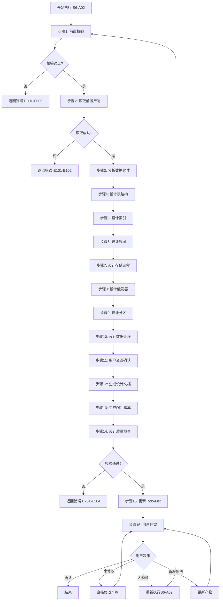
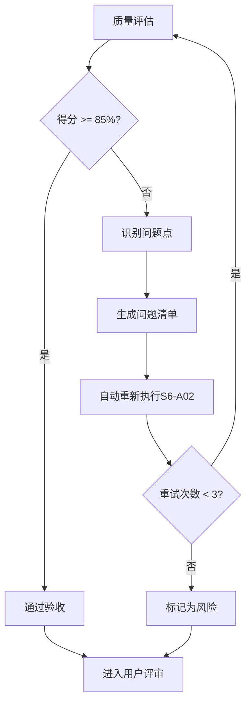

# S6-A02: 数据库详细设计

## Section 1: 元信息 (Meta Information)

| 项目 | 内容 |
|------|------|
| **Skill ID** | S6-A02 |
| **Skill 名称** | 数据库详细设计 |
| **Skill 英文名称** | Database Detailed Design |
| **所属阶段** | S6 - 详细设计 |
| **执行顺序** | S6 阶段第 2 个执行 |
| **执行模式** | 自动推导 + 用户交互 |
| **存储目录** | skills/s6-database |
| **依赖 Skill** | S6-A01 (模块详细设计) |
| **后置 Skill** | S6-A03 (UI/UX 设计) |
| **轻量化跳过** | No |
| **必需输入** | artifacts/stages/s6/{PlanID}-S6-A01-001.md |
| **输出产物** | artifacts/stages/s6/{PlanID}-S6-A02-001.md |

***

## Section 2: 功能描述 (Functional Description)

### 2.1 核心职责

S6-A02 负责将模块详细设计中的实体类映射为数据库表结构，为开发团队提供完整的数据库实施方案。主要职责包括：

1. **实体映射分析**：基于模块详细设计的实体类，自动分析数据实体特征（主表/从表/关联表/字典表）
2. **表结构设计**：设计符合规范的表结构（命名规范、字段类型、约束条件、审计字段）
3. **索引设计**：基于查询需求和性能要求设计合理的索引策略
4. **视图设计**：设计简化查询、数据脱敏、统计聚合的视图
5. **存储过程设计**：设计复杂批量处理和事务性操作的存储过程
6. **触发器设计**：设计审计日志和数据一致性维护的触发器
7. **分区设计**：针对大数据量表设计合理的分区策略
8. **数据迁移设计**：设计数据迁移脚本和初始化数据
9. **DDL脚本生成**：生成可直接执行的建表SQL脚本
10. **设计质量检查**：自动检查命名规范、范式合规、主键设计、索引合理性

### 2.2 输入规范 (Input Specifications)

#### 用户/前置 Skill 需要提供什么

**前置产物（必需）**：

| 阶段 | 产物名称 | 产物 ID 示例 | 用途 |
|------|---------|-------------|------|
| S6 | 模块详细设计文档 | `{PlanID}-S6-A01-001` | 获取实体类定义、属性详情 |
| S5 | 数据架构设计文档 | `{PlanID}-S5-A03-001` | 获取数据模型、存储方案 |
| S5 | 接口架构设计文档 | `{PlanID}-S5-A04-001` | 获取数据访问需求 |
| S1-S4 | 非功能需求 | 需求阶段产物 | 获取性能、容量、备份要求 |

**输入格式**：
- Markdown 报告文件
- 实体类定义（属性名、类型、约束）
- 数据规模预估
- 性能要求指标

**输入验证规则**：
- 所有前置产物必须存在且状态为 completed
- 实体类定义必须完整（至少包含实体名称和属性列表）
- 数据库选型必须已确定（如 MySQL/PostgreSQL/MongoDB）

#### 输入示例

**前置产物引用示例**：

```
PlanID: P000001
前置产物：
- P000001-S6-A01-001 (模块详细设计文档)
- P000001-S5-A03-001 (数据架构设计文档)
- P000001-S5-A04-001 (接口架构设计文档)
```

### 2.3 输出规范 (Output Specifications)

#### 用户会得到什么

Skill 完成后，系统会生成以下产物并保存到项目目录：

**产物清单**：

| 产物名称 | 文件位置 | 格式 | 用途 | 用户可见性 |
|---------|---------|------|------|-----------|
| 数据库详细设计文档 | `artifacts/stages/s6/{PlanID}/{PlanID}-S6-A02-001.md` | Markdown | 表结构、索引、视图、存储过程完整文档 | 用户可查看 |
| DDL 脚本 | `artifacts/stages/s6/{PlanID}/{PlanID}-S6-A02-002.sql` | SQL | 建表、建索引可执行脚本 | 用户可查看 |
| Todo-List 更新 | `artifacts/plans/{PlanID}/todo-list.md` | Markdown | 任务状态更新 | 用户可查看 |

**产物内容结构**：

1. **数据库设计概述**：数据库选型、版本、字符集、设计原则
2. **表结构设计**：表清单、表结构详情、字段说明、约束定义
3. **索引设计**：索引清单、索引选择理由
4. **视图设计**：视图定义、使用场景
5. **存储过程和函数**：过程清单、逻辑说明
6. **触发器设计**：触发器清单、触发时机
7. **分区设计**：分区策略、分区定义
8. **数据迁移**：迁移脚本、初始化数据

#### 输出示例

**数据库详细设计文档示例结构**：

```markdown
# 数据库详细设计 - P000001-S6-A02-001

## 基本信息
- **Plan ID**: P000001
- **Skill ID**: S6-A02
- **执行时间**: 2026-03-28 14:00
- **数据库类型**: MySQL 8.0

## 表结构设计

### 表清单
| 表名 | 中文名 | 记录量预估 | 说明 |
|------|--------|------------|------|
| users | 用户表 | 100 万 | 用户信息 |
| orders | 订单表 | 500 万 | 订单信息 |

### 表：users
**字段说明**：
| 字段名 | 类型 | 约束 | 默认值 | 注释 |
|--------|------|------|--------|------|
| id | BIGINT | PK, AI | - | 主键 |
| username | VARCHAR(50) | NOT NULL, UNIQUE | - | 用户名 |
| created_at | DATETIME | NOT NULL | CURRENT_TIMESTAMP | 创建时间 |

## 索引设计
| 表名 | 索引名 | 类型 | 字段 | 说明 |
|------|--------|------|------|------|
| users | PRIMARY | 主键 | id | 聚簇索引 |
| users | uk_username | 唯一 | username | 用户名唯一 |
```

## Section 3: 执行流程 (Execution Process)

### 3.1 流程概览



### 3.2 详细步骤说明

详细执行步骤参见 [references/execution-details.md](references/execution-details.md)

### 3.3 Todo-List 更新规则

**更新时机与内容**：

| 执行阶段 | 更新时机 | 更新内容 |
|---------|---------|---------|
| Skill 执行开始 | 步骤 1 完成后 | S6-A02 任务状态：待执行 → 执行中 |
| 用户交互后 | 步骤 11 完成后 | 更新决策记录（如有） |
| Skill 执行完成 | 步骤 15 完成后 | S6-A02 任务状态：执行中 → 已完成，评审状态：待评审 |
| 用户评审后 | 步骤 16 完成后 | 根据评审结果更新状态 |

**用户评审后的状态更新**：

| 评审结果 | 任务状态 | 评审状态 | 断点续跑信息 |
|---------|---------|---------|-------------|
| 确认 | 已评审 | 已通过 | 可恢复=false |
| 小修改 | 执行中 | 需修改 | 可恢复=true |
| 大修改 | 执行中 | 需重做 | 可恢复=true |
| 新增想法 | 执行中 | 需修改 | 可恢复=true |

**详细规则**：详见 [execution-flow-standard.md](../_shared/execution-flow-standard.md) 中的"Todo-List更新规则"章节。

### 3.4 Demo 示例

参见 [references/examples.md](references/examples.md)

## Section 4: 产物规范 (Artifact Specifications)

S6-A02 产物规范遵循 [../_shared/artifact-specifications.md](../_shared/artifact-specifications.md) 中的通用定义。

### 4.1 S6-A02 特定产物清单

| 产物名称 | 产物 ID | 存储路径 | 说明 |
|---------|---------|----------|------|
| 数据库详细设计文档 | `{PlanID}-S6-A02-001` | `artifacts/stages/s6/{PlanID}/{PlanID}-S6-A02-001.md` | 主产物，包含表结构、索引、视图、存储过程完整设计 |
| DDL 脚本 | `{PlanID}-S6-A02-002` | `artifacts/stages/s6/{PlanID}/{PlanID}-S6-A02-002.sql` | 可执行的建表、建索引 SQL 脚本 |

### 4.2 依赖关系

**上游依赖**：

| 产物 ID | 来源 Skill | 用途 |
|---------|-----------|------|
| `{PlanID}-S6-A01-001` | S6-A01 模块详细设计 | 获取实体类定义、属性详情 |
| `{PlanID}-S5-A03-001` | S5-A03 数据架构设计 | 获取数据模型、存储方案 |
| `{PlanID}-S5-A04-001` | S5-A04 接口架构设计 | 获取数据访问需求 |

**下游消费**：

| 消费 Skill | 消费内容 |
|-----------|----------|
| S6-A03 UI/UX设计 | 传递前端数据需求 |

### 4.3 模板引用

**模板文件**：`skills/s6-database/template.md`

**引用方式**：直接引用模板结构，填充实际数据

## Section 5: 质量标准 (Quality Standards)

### 5.1 质量评估框架

S6-A02 遵循 [../_shared/quality-standard.md](../_shared/quality-standard.md) 中的 ISO/IEC 25010 质量评估框架。

**S6-A02 特定权重分配**：

| 维度 | 权重 | 验收阈值 |
|------|------|----------|
| **完整性** | 30% | ≥ 90% |
| **准确性** | 25% | ≥ 90% |
| **一致性** | 20% | ≥ 95% |
| **可读性** | 15% | ≥ 85% |
| **可追溯性** | 10% | ≥ 90% |

**验收门槛**：质量综合得分 ≥ 85%

### 5.2 S6-A02 特定检查清单

**完整性检查**（30%）：

- [ ] 表结构设计完整（所有实体都已映射为表）
- [ ] 字段定义完整（类型、约束、默认值、注释）
- [ ] 索引设计覆盖高频查询
- [ ] 审计字段齐全（created_at, updated_at, deleted_at）
- [ ] DDL 脚本可执行

**准确性检查**（25%）：

- [ ] 字段类型选择合理（符合业务场景）
- [ ] 主键设计合理（自增 ID 或 UUID）
- [ ] 外键关系明确（字段命名规范）
- [ ] 索引选择理由充分
- [ ] 分区策略适合数据特征

**一致性检查**（20%）：

- [ ] 表命名符合规范（小写，下划线分隔，复数名词）
- [ ] 字段命名一致（统一使用 snake_case）
- [ ] 外键命名一致（统一使用 `{table}_id`）
- [ ] 状态值使用一致（统一使用数字枚举）

**可读性检查**（15%）：

- [ ] 表注释完整（中文名称、用途说明）
- [ ] 字段注释完整（注释率 100%）
- [ ] 索引说明清晰
- [ ] 设计文档结构清晰

**可追溯性检查**（10%）：

- [ ] 实体类与表的映射关系清晰
- [ ] 与 S6-A01 模块设计的关联明确
- [ ] 设计决策有依据说明

### 5.3 质量综合得分计算

```
得分 = Σ(维度得分 × 维度权重)

示例：
- 完整性：95% × 30% = 28.5
- 准确性：90% × 25% = 22.5
- 一致性：100% × 20% = 20.0
- 可读性：90% × 15% = 13.5
- 可追溯性：95% × 10% = 9.5
- 总分：28.5 + 22.5 + 20.0 + 13.5 + 9.5 = 94.0%
```

### 5.4 验收标准

| 结果 | 标准 | 处理方式 |
|------|------|----------|
| **通过** | 质量综合得分 ≥ 85% | 进入用户评审阶段 |
| **不通过** | 质量综合得分 < 85% | 识别问题 → 生成问题清单 → 自动重新执行 |

### 5.5 不达标处理流程



**重试机制**：
- 第1次：自动重新执行，尝试修复问题
- 第2次：自动重新执行，调整参数
- 第3次：自动重新执行，简化复杂部分
- 仍不达标：标记为风险，进入用户评审并提示问题

## Section 6: 异常处理

### 6.1 常见异常场景

**前置校验失败**（如输入文件不存在）：
- 提示用户先执行前置 Skill
- 或请求补充必要信息

**执行过程异常**（如处理逻辑失败）：
- 自动重试（最多3次）
- 失败后标记风险继续执行

**后置校验失败**（如产物不完整）：
- 重新生成产物
- 或标记为风险进入用户评审

**用户评审未通过**：
- 根据意见修改产物
- 小修改直接编辑，大修改重新执行

### 6.2 本 Skill 特定异常场景

| 异常场景 | 错误代码 | 处理策略 |
|----------|----------|----------|
| 实体类属性类型无法映射 | E151 | 请求用户确认字段类型 |
| 表命名冲突 | E152 | 自动调整命名，添加前缀/后缀 |
| 索引数量过多 | E153 | 提示优化索引，使用复合索引 |
| 分区策略不适用 | E154 | 标记为风险，建议人工评估 |
| DDL 脚本执行异常 | E155 | 标记具体错误行，提供修复建议 |

### 6.3 恢复策略

| 异常类型 | 处理策略 |
|----------|----------|
| 可重试异常 | 自动重试3次 |
| 数据缺失 | 请求用户补充 |
| 校验失败 | 重新执行或标记风险 |
| 用户拒绝 | 使用默认值继续 |

### 6.4 用户交互协议

**交互时机**：在步骤 11 触发用户交互，以下场景需要用户确认：

1. **数据库选型确认**：当架构设计给出多个选项时
2. **分库分表策略**：当数据量达到分片阈值时
3. **存储过程使用范围**：业务逻辑是否放入数据库
4. **索引策略权衡**：读性能 vs 写性能

**使用模板**：
- 使用 [user-interaction/clarification-template.md](../_shared/user-interaction/clarification-template.md) 进行信息澄清
- 使用 [user-interaction/option-selection-template.md](../_shared/user-interaction/option-selection-template.md) 进行选项选择

详细流程参见 [execution-flow-standard.md](../_shared/execution-flow-standard.md)

---

**本 Skill 符合数据库设计规范，遵循 ISO/IEC 25010 质量模型**
