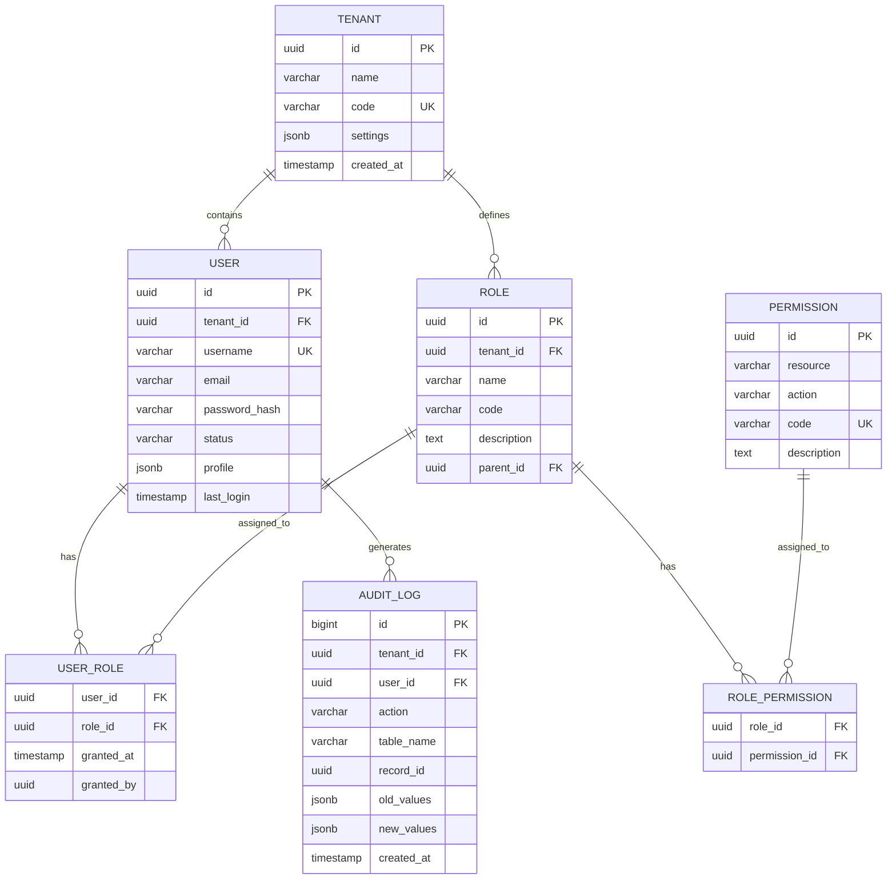

# S6-A02 数据库详细设计 - 示例文档

本文档提供数据库详细设计 Skill 的执行示例，展示从领域模型到完整数据库设计的转换过程。

---

## Demo 1：用户系统数据库设计

### 场景描述
为 SaaS 平台设计用户系统的数据库，支持多租户、用户管理、权限控制和操作审计。

### 输入示例

**前置产物：**
- 领域模型（用户、角色、权限、租户）
- 数据量预估（10万租户，1000万用户）
- 性能要求（登录 QPS 5000+）

**需求描述：**
```markdown
## 用户系统数据库需求

### 功能需求
1. 多租户支持：数据隔离，共享数据库+独立 Schema
2. 用户管理：基本信息、认证信息、状态管理
3. 权限系统：RBAC 模型，支持角色继承
4. 审计日志：记录所有数据变更

### 非功能需求
- 查询性能：用户查询 < 50ms
- 并发：支持 5000+ QPS
- 安全：敏感数据加密存储
- 扩展性：支持水平扩展
```

### 处理过程

**步骤 1：逻辑模型设计**
- 识别实体：Tenant、User、Role、Permission、AuditLog
- 定义实体关系
- 结果：ER 图

**步骤 2：物理模型设计**
- 确定数据类型和约束
- 设计主键和索引策略
- 结果：表结构定义

**步骤 3：性能优化设计**
- 设计索引（主键、唯一、复合索引）
- 设计分区策略
- 结果：索引清单、分区方案

**步骤 4：安全设计**
- 敏感字段加密
- 访问控制
- 结果：安全策略文档

**步骤 5：DDL 生成**
- 生成建表语句
- 生成索引语句
- 结果：完整 DDL 脚本

### 输出示例

```markdown
# S6-A02-001 用户系统数据库设计

## 1. 设计概述

### 1.1 数据库选型
- **数据库**：PostgreSQL 15
- **原因**：支持 JSON、强大索引、良好扩展性

### 1.2 设计原则
- 第三范式为主，适当反范式优化
- 所有表包含审计字段（created_at, updated_at）
- 软删除设计（deleted_at）
- 统一使用 UUID 主键（安全性考虑）

## 2. 逻辑模型（ER图）



## 3. 物理模型设计

### 3.1 租户表（tenants）

```sql
CREATE TABLE tenants (
    id UUID PRIMARY KEY DEFAULT gen_random_uuid(),
    name VARCHAR(100) NOT NULL,
    code VARCHAR(50) NOT NULL UNIQUE,
    status VARCHAR(20) NOT NULL DEFAULT 'active',
    settings JSONB DEFAULT '{}',
    plan_type VARCHAR(20) DEFAULT 'basic',
    max_users INTEGER DEFAULT 100,
    created_at TIMESTAMP WITH TIME ZONE DEFAULT NOW(),
    updated_at TIMESTAMP WITH TIME ZONE DEFAULT NOW(),
    deleted_at TIMESTAMP WITH TIME ZONE
);

COMMENT ON TABLE tenants IS '租户表';
COMMENT ON COLUMN tenants.code IS '租户唯一编码，用于URL标识';
COMMENT ON COLUMN tenants.settings IS '租户配置，JSON格式存储';
```

**索引设计：**
```sql
-- 唯一索引已在建表时创建（code）
-- 状态查询索引
CREATE INDEX idx_tenants_status ON tenants(status) WHERE deleted_at IS NULL;
-- 创建时间索引（用于排序）
CREATE INDEX idx_tenants_created ON tenants(created_at DESC);
```

### 3.2 用户表（users）

```sql
CREATE TABLE users (
    id UUID PRIMARY KEY DEFAULT gen_random_uuid(),
    tenant_id UUID NOT NULL REFERENCES tenants(id),
    username VARCHAR(50) NOT NULL,
    email VARCHAR(255),
    phone VARCHAR(20),
    password_hash VARCHAR(255) NOT NULL,
    status VARCHAR(20) NOT NULL DEFAULT 'active',
    email_verified BOOLEAN DEFAULT FALSE,
    phone_verified BOOLEAN DEFAULT FALSE,
    profile JSONB DEFAULT '{}',
    avatar_url VARCHAR(500),
    last_login_at TIMESTAMP WITH TIME ZONE,
    login_count INTEGER DEFAULT 0,
    failed_login_attempts INTEGER DEFAULT 0,
    locked_until TIMESTAMP WITH TIME ZONE,
    created_at TIMESTAMP WITH TIME ZONE DEFAULT NOW(),
    updated_at TIMESTAMP WITH TIME ZONE DEFAULT NOW(),
    deleted_at TIMESTAMP WITH TIME ZONE,

    CONSTRAINT uk_users_tenant_username UNIQUE (tenant_id, username),
    CONSTRAINT uk_users_tenant_email UNIQUE (tenant_id, email),
    CONSTRAINT uk_users_tenant_phone UNIQUE (tenant_id, phone)
);

COMMENT ON TABLE users IS '用户表';
COMMENT ON COLUMN users.password_hash IS 'bcrypt加密后的密码';
COMMENT ON COLUMN users.profile IS '用户扩展信息，JSON格式';
```

**索引设计：**
```sql
-- 唯一索引已在建表时创建
-- 租户查询索引
CREATE INDEX idx_users_tenant ON users(tenant_id) WHERE deleted_at IS NULL;
-- 登录查询索引（邮箱+租户）
CREATE INDEX idx_users_tenant_email ON users(tenant_id, email)
    WHERE email IS NOT NULL AND deleted_at IS NULL;
-- 状态索引
CREATE INDEX idx_users_status ON users(tenant_id, status) WHERE deleted_at IS NULL;
-- 最后登录时间索引（用于统计）
CREATE INDEX idx_users_last_login ON users(last_login_at DESC)
    WHERE last_login_at IS NOT NULL;
```

### 3.3 角色表（roles）

```sql
CREATE TABLE roles (
    id UUID PRIMARY KEY DEFAULT gen_random_uuid(),
    tenant_id UUID NOT NULL REFERENCES tenants(id),
    name VARCHAR(50) NOT NULL,
    code VARCHAR(50) NOT NULL,
    description TEXT,
    parent_id UUID REFERENCES roles(id),
    is_system BOOLEAN DEFAULT FALSE,
    created_at TIMESTAMP WITH TIME ZONE DEFAULT NOW(),
    updated_at TIMESTAMP WITH TIME ZONE DEFAULT NOW(),
    deleted_at TIMESTAMP WITH TIME ZONE,

    CONSTRAINT uk_roles_tenant_code UNIQUE (tenant_id, code)
);

COMMENT ON TABLE roles IS '角色表，支持角色继承';
```

**索引设计：**
```sql
-- 唯一索引已在建表时创建
CREATE INDEX idx_roles_tenant ON roles(tenant_id) WHERE deleted_at IS NULL;
CREATE INDEX idx_roles_parent ON roles(parent_id) WHERE parent_id IS NOT NULL;
```

### 3.4 权限表（permissions）

```sql
CREATE TABLE permissions (
    id UUID PRIMARY KEY DEFAULT gen_random_uuid(),
    code VARCHAR(100) NOT NULL UNIQUE,
    resource VARCHAR(50) NOT NULL,
    action VARCHAR(50) NOT NULL,
    description TEXT,
    created_at TIMESTAMP WITH TIME ZONE DEFAULT NOW()
);

COMMENT ON TABLE permissions IS '权限表，系统级共享';
```

### 3.5 用户角色关联表（user_roles）

```sql
CREATE TABLE user_roles (
    user_id UUID NOT NULL REFERENCES users(id) ON DELETE CASCADE,
    role_id UUID NOT NULL REFERENCES roles(id) ON DELETE CASCADE,
    granted_at TIMESTAMP WITH TIME ZONE DEFAULT NOW(),
    granted_by UUID REFERENCES users(id),
    expires_at TIMESTAMP WITH TIME ZONE,
    PRIMARY KEY (user_id, role_id)
);

COMMENT ON TABLE user_roles IS '用户角色关联表';
```

**索引设计：**
```sql
-- 主键索引已创建
CREATE INDEX idx_user_roles_role ON user_roles(role_id);
CREATE INDEX idx_user_roles_expires ON user_roles(expires_at)
    WHERE expires_at IS NOT NULL;
```

### 3.6 角色权限关联表（role_permissions）

```sql
CREATE TABLE role_permissions (
    role_id UUID NOT NULL REFERENCES roles(id) ON DELETE CASCADE,
    permission_id UUID NOT NULL REFERENCES permissions(id) ON DELETE CASCADE,
    created_at TIMESTAMP WITH TIME ZONE DEFAULT NOW(),
    PRIMARY KEY (role_id, permission_id)
);

COMMENT ON TABLE role_permissions IS '角色权限关联表';
```

### 3.7 审计日志表（audit_logs）

```sql
CREATE TABLE audit_logs (
    id BIGSERIAL PRIMARY KEY,
    tenant_id UUID REFERENCES tenants(id),
    user_id UUID REFERENCES users(id),
    action VARCHAR(50) NOT NULL,
    table_name VARCHAR(50) NOT NULL,
    record_id UUID,
    old_values JSONB,
    new_values JSONB,
    ip_address INET,
    user_agent TEXT,
    created_at TIMESTAMP WITH TIME ZONE DEFAULT NOW()
) PARTITION BY RANGE (created_at);

COMMENT ON TABLE audit_logs IS '审计日志表，按时间分区';
```

**分区设计：**
```sql
-- 创建月度分区
CREATE TABLE audit_logs_2024_01 PARTITION OF audit_logs
    FOR VALUES FROM ('2024-01-01') TO ('2024-02-01');
CREATE TABLE audit_logs_2024_02 PARTITION OF audit_logs
    FOR VALUES FROM ('2024-02-01') TO ('2024-03-01');
-- ... 依此类推
```

**索引设计：**
```sql
-- 主键索引已创建
CREATE INDEX idx_audit_logs_tenant ON audit_logs(tenant_id, created_at DESC);
CREATE INDEX idx_audit_logs_user ON audit_logs(user_id, created_at DESC);
CREATE INDEX idx_audit_logs_table ON audit_logs(table_name, created_at DESC);
CREATE INDEX idx_audit_logs_action ON audit_logs(action, created_at DESC);
-- JSONB 索引示例
CREATE INDEX idx_audit_logs_new_values ON audit_logs USING GIN (new_values);
```

## 4. 性能优化策略

### 4.1 索引策略总结

| 表名 | 索引类型 | 索引字段 | 用途 |
|------|----------|----------|------|
| tenants | B-tree | code | 唯一标识查询 |
| users | B-tree | (tenant_id, username) | 登录查询 |
| users | B-tree | (tenant_id, email) | 邮箱登录 |
| audit_logs | B-tree | (tenant_id, created_at) | 审计查询 |
| audit_logs | GIN | new_values | JSON 字段搜索 |

### 4.2 查询优化示例

**用户登录查询（使用索引）：**
```sql
-- 高效查询（使用索引 idx_users_tenant_email）
SELECT id, password_hash, status
FROM users
WHERE tenant_id = 'xxx'
  AND email = 'user@example.com'
  AND deleted_at IS NULL;

-- 执行计划：Index Scan using idx_users_tenant_email
```

**权限查询（使用递归 CTE）：**
```sql
-- 查询用户的所有权限（包含继承）
WITH RECURSIVE role_tree AS (
    -- 基础：用户的直接角色
    SELECT r.id, r.parent_id
    FROM roles r
    JOIN user_roles ur ON r.id = ur.role_id
    WHERE ur.user_id = 'user-uuid'

    UNION ALL

    -- 递归：获取父角色
    SELECT r.id, r.parent_id
    FROM roles r
    JOIN role_tree rt ON r.id = rt.parent_id
)
SELECT DISTINCT p.code, p.resource, p.action
FROM permissions p
JOIN role_permissions rp ON p.id = rp.permission_id
WHERE rp.role_id IN (SELECT id FROM role_tree);
```

## 5. 安全设计

### 5.1 敏感数据加密

```sql
-- 使用 pgcrypto 扩展加密敏感字段
CREATE EXTENSION IF NOT EXISTS pgcrypto;

-- 加密存储示例（邮箱）
-- 应用层加密后存储，或使用列级加密
ALTER TABLE users
ADD COLUMN email_encrypted BYTEA,
ADD COLUMN email_hash VARCHAR(64);

-- 创建哈希索引用于查询
CREATE INDEX idx_users_email_hash ON users(email_hash);
```

### 5.2 行级安全（RLS）

```sql
-- 启用行级安全
ALTER TABLE users ENABLE ROW LEVEL SECURITY;

-- 创建策略：用户只能看到同租户的数据
CREATE POLICY tenant_isolation_policy ON users
    FOR ALL
    USING (tenant_id = current_setting('app.current_tenant')::UUID);

-- 创建策略：用户只能看到自己的详细信息
CREATE POLICY user_self_policy ON users
    FOR SELECT
    USING (id = current_setting('app.current_user')::UUID);
```

## 6. 完整 DDL 脚本

```sql
-- ============================================
-- 用户系统数据库初始化脚本
-- 数据库：PostgreSQL 15+
-- ============================================

-- 1. 创建扩展
CREATE EXTENSION IF NOT EXISTS "uuid-ossp";
CREATE EXTENSION IF NOT EXISTS pgcrypto;

-- 2. 创建表
-- （上述所有 CREATE TABLE 语句）

-- 3. 创建索引
-- （上述所有 CREATE INDEX 语句）

-- 4. 创建触发器（自动更新 updated_at）
CREATE OR REPLACE FUNCTION update_updated_at_column()
RETURNS TRIGGER AS $$
BEGIN
    NEW.updated_at = NOW();
    RETURN NEW;
END;
$$ language 'plpgsql';

CREATE TRIGGER update_tenants_updated_at
    BEFORE UPDATE ON tenants
    FOR EACH ROW EXECUTE FUNCTION update_updated_at_column();

CREATE TRIGGER update_users_updated_at
    BEFORE UPDATE ON users
    FOR EACH ROW EXECUTE FUNCTION update_updated_at_column();

CREATE TRIGGER update_roles_updated_at
    BEFORE UPDATE ON roles
    FOR EACH ROW EXECUTE FUNCTION update_updated_at_column();

-- 5. 初始化数据
INSERT INTO permissions (code, resource, action, description) VALUES
('user:create', 'user', 'create', '创建用户'),
('user:read', 'user', 'read', '查看用户'),
('user:update', 'user', 'update', '更新用户'),
('user:delete', 'user', 'delete', '删除用户'),
('role:manage', 'role', 'manage', '管理角色');
```

## 7. 容量规划

| 表名 | 预估数据量 | 单条大小 | 总大小 | 增长策略 |
|------|------------|----------|--------|----------|
| tenants | 10万 | 500B | 50MB | 垂直扩展 |
| users | 1000万 | 1KB | 10GB | 分库分表 |
| roles | 50万 | 300B | 150MB | 垂直扩展 |
| audit_logs | 10亿/年 | 2KB | 2TB/年 | 分区+归档 |
```

---

## Demo 2：电商系统数据库设计

### 场景描述
设计大型电商平台的数据库，支持商品管理、订单处理、库存管理，需要应对高并发和大数据量。

### 输入示例

**前置产物：**
- 领域模型（商品、SKU、订单、库存）
- 业务规模（日订单 100万，商品 500万）
- 性能要求（下单 QPS 5000，查询 < 100ms）

**需求描述：**
```markdown
## 电商系统数据库需求

### 功能需求
1. 商品管理：SPU/SKU 模型，支持多规格
2. 订单系统：订单、子订单、订单项
3. 库存系统：多仓库库存，实时同步
4. 支付系统：多渠道支付，对账

### 非功能需求
- 高并发：峰值 QPS 10000+
- 大数据：订单表 10亿+ 记录
- 高可用：99.99% 可用性
- 数据一致性：库存扣减强一致
```

### 处理过程

**步骤 1：分库分表策略设计**
- 确定分片键（用户ID、订单ID）
- 设计分片算法（一致性哈希）
- 结果：分片策略文档

**步骤 2：核心表设计**
- 商品表、SKU表设计
- 订单表、订单项表设计
- 结果：核心表结构

**步骤 3：分布式ID设计**
- 设计全局唯一ID生成方案
- 结果：ID生成策略

**步骤 4：读写分离设计**
- 设计主从复制策略
- 结果：读写分离方案

### 输出示例

```markdown
# S6-A02-002 电商系统数据库设计

## 1. 架构设计

### 1.1 分库分表策略

#### 分片规则

| 表名 | 分片维度 | 分片键 | 分片数 | 策略 |
|------|----------|--------|--------|------|
| orders | 水平分片 | user_id | 16库×64表 | 用户ID % 1024 |
| order_items | 水平分片 | order_id | 16库×64表 | 与订单同库 |
| products | 垂直分片 | - | 1库 | 不分片，读写分离 |
| inventory | 水平分片 | sku_id | 8库×32表 | SKU ID 哈希 |

#### 分片算法

```java
public class ShardingStrategy {

    // 数据库数量
    private static final int DB_COUNT = 16;
    // 每库表数量
    private static final int TABLE_COUNT_PER_DB = 64;

    public ShardingResult calculate(long userId) {
        // 计算分片值
        long shardValue = userId % (DB_COUNT * TABLE_COUNT_PER_DB);

        // 计算库索引
        int dbIndex = (int) (shardValue / TABLE_COUNT_PER_DB);
        // 计算表索引
        int tableIndex = (int) (shardValue % TABLE_COUNT_PER_DB);

        return new ShardingResult(dbIndex, tableIndex);
    }

    public String getTableName(String baseTable, long userId) {
        ShardingResult result = calculate(userId);
        return String.format("%s_%04d", baseTable,
            result.getDbIndex() * TABLE_COUNT_PER_DB + result.getTableIndex());
    }
}
```

### 1.2 分布式 ID 设计

使用改进的雪花算法（支持 69 年，每秒 409.6 万个 ID）：

```
ID 结构（64位）：
| 1位符号 | 41位时间戳 | 5位数据中心 | 5位机器ID | 12位序列号 |
| 0      | 毫秒级    | 0-31       | 0-31     | 0-4095    |
```

```java
@Component
public class DistributedIdGenerator {

    private final long epoch = 1609459200000L; // 2021-01-01
    private final long datacenterIdBits = 5L;
    private final long machineIdBits = 5L;
    private final long sequenceBits = 12L;

    private final long maxDatacenterId = ~(-1L << datacenterIdBits);
    private final long maxMachineId = ~(-1L << machineIdBits);
    private final long sequenceMask = ~(-1L << sequenceBits);

    private final long machineIdShift = sequenceBits;
    private final long datacenterIdShift = sequenceBits + machineIdBits;
    private final long timestampShift = sequenceBits + machineIdBits + datacenterIdBits;

    private long lastTimestamp = -1L;
    private long sequence = 0L;

    public synchronized long nextId() {
        long timestamp = System.currentTimeMillis();

        if (timestamp < lastTimestamp) {
            throw new RuntimeException("Clock moved backwards");
        }

        if (timestamp == lastTimestamp) {
            sequence = (sequence + 1) & sequenceMask;
            if (sequence == 0) {
                timestamp = tilNextMillis(lastTimestamp);
            }
        } else {
            sequence = 0L;
        }

        lastTimestamp = timestamp;

        return ((timestamp - epoch) << timestampShift)
            | (datacenterId << datacenterIdShift)
            | (machineId << machineIdShift)
            | sequence;
    }
}
```

## 2. 核心表设计

### 2.1 商品表（products）

```sql
-- 商品基础信息表（不分片，读写分离）
CREATE TABLE products (
    id BIGINT UNSIGNED PRIMARY KEY,
    spu_code VARCHAR(50) NOT NULL UNIQUE COMMENT 'SPU编码',
    name VARCHAR(200) NOT NULL COMMENT '商品名称',
    category_id INT UNSIGNED NOT NULL COMMENT '类目ID',
    brand_id INT UNSIGNED COMMENT '品牌ID',
    description TEXT COMMENT '商品描述',
    main_image VARCHAR(500) COMMENT '主图URL',
    images JSON COMMENT '图片列表',
    status TINYINT NOT NULL DEFAULT 1 COMMENT '状态：0-下架，1-上架',
    attributes JSON COMMENT '商品属性',
    price_min DECIMAL(10,2) COMMENT '最低售价',
    price_max DECIMAL(10,2) COMMENT '最高售价',
    created_at TIMESTAMP DEFAULT CURRENT_TIMESTAMP,
    updated_at TIMESTAMP DEFAULT CURRENT_TIMESTAMP ON UPDATE CURRENT_TIMESTAMP,

    INDEX idx_category (category_id, status),
    INDEX idx_brand (brand_id),
    INDEX idx_status (status, created_at DESC),
    FULLTEXT INDEX ft_name (name) WITH PARSER ngram
) ENGINE=InnoDB DEFAULT CHARSET=utf8mb4 COMMENT='商品表';
```

### 2.2 SKU表（product_skus）

```sql
-- SKU表（不分片，数据量相对较小）
CREATE TABLE product_skus (
    id BIGINT UNSIGNED PRIMARY KEY,
    spu_id BIGINT UNSIGNED NOT NULL COMMENT 'SPU ID',
    sku_code VARCHAR(50) NOT NULL UNIQUE COMMENT 'SKU编码',
    attributes JSON NOT NULL COMMENT '规格属性',
    price DECIMAL(10,2) NOT NULL COMMENT '售价',
    original_price DECIMAL(10,2) COMMENT '原价',
    cost_price DECIMAL(10,2) COMMENT '成本价',
    stock_quantity INT UNSIGNED DEFAULT 0 COMMENT '库存数量',
    sales_count INT UNSIGNED DEFAULT 0 COMMENT '销量',
    status TINYINT DEFAULT 1 COMMENT '状态',
    created_at TIMESTAMP DEFAULT CURRENT_TIMESTAMP,
    updated_at TIMESTAMP DEFAULT CURRENT_TIMESTAMP ON UPDATE CURRENT_TIMESTAMP,

    INDEX idx_spu (spu_id),
    INDEX idx_status (status),
    INDEX idx_price (price)
) ENGINE=InnoDB DEFAULT CHARSET=utf8mb4 COMMENT='SKU表';
```

### 2.3 订单表（orders）

```sql
-- 订单表（水平分片：16库×64表 = 1024张表）
-- 表名：orders_0000 ~ orders_1023
CREATE TABLE orders (
    id BIGINT UNSIGNED PRIMARY KEY,
    order_no VARCHAR(32) NOT NULL UNIQUE COMMENT '订单编号',
    user_id BIGINT UNSIGNED NOT NULL COMMENT '用户ID（分片键）',
    order_status TINYINT NOT NULL DEFAULT 0 COMMENT '订单状态',
    pay_status TINYINT NOT NULL DEFAULT 0 COMMENT '支付状态',
    ship_status TINYINT NOT NULL DEFAULT 0 COMMENT '发货状态',
    total_amount DECIMAL(12,2) NOT NULL COMMENT '订单总金额',
    discount_amount DECIMAL(12,2) DEFAULT 0 COMMENT '优惠金额',
    pay_amount DECIMAL(12,2) NOT NULL COMMENT '应付金额',
    freight_amount DECIMAL(10,2) DEFAULT 0 COMMENT '运费',
    receiver_name VARCHAR(50) COMMENT '收货人',
    receiver_phone VARCHAR(20) COMMENT '收货电话',
    receiver_address VARCHAR(500) COMMENT '收货地址',
    remark VARCHAR(500) COMMENT '订单备注',
    pay_time TIMESTAMP NULL COMMENT '支付时间',
    ship_time TIMESTAMP NULL COMMENT '发货时间',
    receive_time TIMESTAMP NULL COMMENT '收货时间',
    created_at TIMESTAMP DEFAULT CURRENT_TIMESTAMP,
    updated_at TIMESTAMP DEFAULT CURRENT_TIMESTAMP ON UPDATE CURRENT_TIMESTAMP,

    INDEX idx_user_created (user_id, created_at DESC),
    INDEX idx_order_no (order_no),
    INDEX idx_status_created (order_status, created_at DESC),
    INDEX idx_pay_time (pay_time)
) ENGINE=InnoDB DEFAULT CHARSET=utf8mb4 COMMENT='订单表';
```

### 2.4 订单项表（order_items）

```sql
-- 订单项表（与订单同库同表后缀）
-- 表名：order_items_0000 ~ order_items_1023
CREATE TABLE order_items (
    id BIGINT UNSIGNED PRIMARY KEY,
    order_id BIGINT UNSIGNED NOT NULL COMMENT '订单ID',
    user_id BIGINT UNSIGNED NOT NULL COMMENT '用户ID（分片键，冗余存储）',
    product_id BIGINT UNSIGNED NOT NULL COMMENT '商品ID',
    sku_id BIGINT UNSIGNED NOT NULL COMMENT 'SKU ID',
    product_name VARCHAR(200) NOT NULL COMMENT '商品名称（快照）',
    sku_attributes JSON COMMENT 'SKU规格（快照）',
    product_image VARCHAR(500) COMMENT '商品图片（快照）',
    quantity INT UNSIGNED NOT NULL COMMENT '数量',
    unit_price DECIMAL(10,2) NOT NULL COMMENT '单价',
    total_price DECIMAL(10,2) NOT NULL COMMENT '总价',
    discount_amount DECIMAL(10,2) DEFAULT 0 COMMENT '优惠金额',
    created_at TIMESTAMP DEFAULT CURRENT_TIMESTAMP,

    INDEX idx_order (order_id),
    INDEX idx_product (product_id),
    INDEX idx_sku (sku_id)
) ENGINE=InnoDB DEFAULT CHARSET=utf8mb4 COMMENT='订单项表';
```

### 2.5 库存表（inventory）

```sql
-- 库存表（水平分片：8库×32表 = 256张表）
-- 表名：inventory_000 ~ inventory_255
CREATE TABLE inventory (
    id BIGINT UNSIGNED PRIMARY KEY,
    sku_id BIGINT UNSIGNED NOT NULL COMMENT 'SKU ID（分片键）',
    warehouse_id INT UNSIGNED NOT NULL COMMENT '仓库ID',
    available_stock INT NOT NULL DEFAULT 0 COMMENT '可用库存',
    locked_stock INT NOT NULL DEFAULT 0 COMMENT '锁定库存',
    version INT UNSIGNED NOT NULL DEFAULT 0 COMMENT '乐观锁版本号',
    updated_at TIMESTAMP DEFAULT CURRENT_TIMESTAMP ON UPDATE CURRENT_TIMESTAMP,

    UNIQUE KEY uk_sku_warehouse (sku_id, warehouse_id),
    INDEX idx_warehouse (warehouse_id),
    INDEX idx_stock_warning (available_stock) WHERE available_stock < 10
) ENGINE=InnoDB DEFAULT CHARSET=utf8mb4 COMMENT='库存表';
```

## 3. 库存扣减方案

### 3.1 数据库层（乐观锁）

```sql
-- 库存扣减（带乐观锁）
UPDATE inventory
SET available_stock = available_stock - ?,
    locked_stock = locked_stock + ?,
    version = version + 1
WHERE sku_id = ?
  AND warehouse_id = ?
  AND available_stock >= ?
  AND version = ?;

-- 返回影响的行数，为0则表示扣减失败（库存不足或并发冲突）
```

### 3.2 缓存层（Redis）

```sql
-- Redis 库存预扣减脚本（Lua）
local key = KEYS[1]
local decrement = tonumber(ARGV[1])
local stock = tonumber(redis.call('get', key) or 0)

if stock >= decrement then
    redis.call('decrby', key, decrement)
    return 1  -- 成功
else
    return 0  -- 库存不足
end
```

## 4. 读写分离配置

### 4.1 数据源配置

```yaml
spring:
  shardingsphere:
    datasource:
      names: master, slave0, slave1
      master:
        type: com.zaxxer.hikari.HikariDataSource
        driver-class-name: com.mysql.cj.jdbc.Driver
        jdbc-url: jdbc:mysql://master:3306/product_db
      slave0:
        type: com.zaxxer.hikari.HikariDataSource
        driver-class-name: com.mysql.cj.jdbc.Driver
        jdbc-url: jdbc:mysql://slave0:3306/product_db
      slave1:
        type: com.zaxxer.hikari.HikariDataSource
        driver-class-name: com.mysql.cj.jdbc.Driver
        jdbc-url: jdbc:mysql://slave1:3306/product_db

    masterslave:
      name: ms_product
      master-data-source-name: master
      slave-data-source-names: slave0, slave1
      load-balance-algorithm-type: ROUND_ROBIN
```

## 5. 容量规划

| 表 | 分片数 | 单分片数据量 | 总数据量 | 存储估算 |
|----|--------|--------------|----------|----------|
| orders | 1024 | 100万 | 10亿 | 2TB |
| order_items | 1024 | 300万 | 30亿 | 3TB |
| inventory | 256 | 2万 | 500万 | 50GB |
| products | 1 | 500万 | 500万 | 100GB |
| product_skus | 1 | 2000万 | 2000万 | 200GB |

## 6. 运维脚本

### 6.1 创建分片表脚本

```bash
#!/bin/bash
# create_sharding_tables.sh

DB_COUNT=16
TABLE_COUNT=64

for ((db=0; db<DB_COUNT; db++)); do
    DB_NAME="order_db_$(printf '%02d' $db)"

    for ((tb=0; tb<TABLE_COUNT; tb++)); do
        TABLE_NUM=$(printf '%04d' $((db * TABLE_COUNT + tb)))

        mysql -h127.0.0.1 -P3306 -uroot -p$DB_NAME <<EOF
CREATE TABLE IF NOT EXISTS orders_${TABLE_NUM} LIKE orders_template;
CREATE TABLE IF NOT EXISTS order_items_${TABLE_NUM} LIKE order_items_template;
EOF
    done
done
```

### 6.2 数据归档脚本

```sql
-- 归档 90 天前的已完成订单
CREATE TABLE orders_archive LIKE orders;

INSERT INTO orders_archive
SELECT * FROM orders
WHERE order_status = 5  -- 已完成
  AND created_at < DATE_SUB(NOW(), INTERVAL 90 DAY);

DELETE FROM orders
WHERE order_status = 5
  AND created_at < DATE_SUB(NOW(), INTERVAL 90 DAY);
```
```

---

## 总结

以上两个示例展示了数据库详细设计的完整过程：

1. **用户系统数据库**：侧重多租户、权限模型、审计日志、PostgreSQL 特性
2. **电商系统数据库**：侧重分库分表、分布式ID、高并发库存、MySQL 架构

每个示例都包含：
- ER 图设计
- 完整表结构（含注释）
- 索引策略和优化
- 分片/分区方案
- 安全设计
- 完整 DDL 脚本
