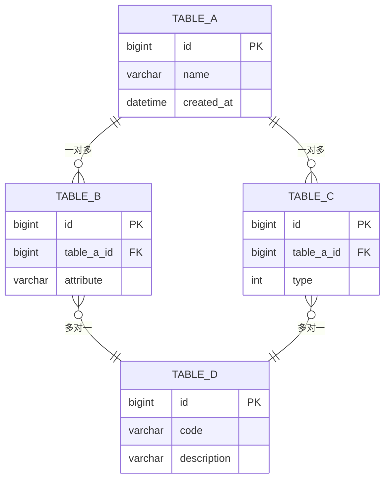

# S6-A02 输出模板：数据库详细设计文档

## 模板说明

本模板用于 S6-A02（数据库详细设计）的输出产物：**数据库详细设计文档**。

**产物 ID 格式**：`{PlanID}-S6-A02-001`

**存储路径**：`artifacts/stages/s6/{PlanID}-S6-A02-001.md`

**模板版本**：1.0

---

## 模板内容

```markdown
# 数据库详细设计文档

## 元信息

| 项目 | 内容 |
|-----|------|
| **文档 ID** | {PlanID}-S6-A02-001 |
| **Plan ID** | {PlanID} |
| **Skill 编号** | S6-A02 |
| **Skill 名称** | 数据库详细设计 |
| **生成时间** | {YYYY-MM-DD HH:MM} |
| **版本** | v1.0 |
| **数据库类型** | {MySQL/PostgreSQL/Oracle/SQL Server} |
| **设计表数** | {N} 个 |

---

## 一、设计概述

### 1.1 执行摘要

**设计目标**：
- 将数据架构转化为可实施的数据库设计
- 确保数据库结构满足性能和扩展需求
- 为开发团队提供详细的数据库规范

**设计范围**：
- 数据库类型：{类型}
- 版本要求：{版本}
- 表数量：{N} 个
- 视图数量：{N} 个
- 存储过程数量：{N} 个
- 索引数量：{N} 个

### 1.2 质量评估

| 质量维度 | 得分 | 权重 | 加权得分 | 评估说明 |
|---------|------|------|---------|---------|
| 完整性 | {XX}% | 25% | {XX} | {说明} |
| 准确性 | {XX}% | 25% | {XX} | {说明} |
| 一致性 | {XX}% | 20% | {XX} | {说明} |
| 可追溯性 | {XX}% | 15% | {XX} | {说明} |
| 可实施性 | {XX}% | 15% | {XX} | {说明} |
| **综合得分** | - | 100% | **{XX}%** | {等级评定} |

**质量等级**：{优秀/良好/合格/不合格}

---

## 二、设计规范

### 2.1 命名规范

| 对象类型 | 命名规则 | 示例 |
|---------|---------|------|
| 表名 | 小写 + 下划线 | `user_profile` |
| 字段名 | 小写 + 下划线 | `created_at` |
| 索引名 | `idx_` + 表名 + 字段 | `idx_user_name` |
| 唯一索引 | `uk_` + 表名 + 字段 | `uk_user_email` |
| 主键 | `pk_` + 表名 | `pk_user` |
| 外键 | `fk_` + 表名 + 字段 | `fk_order_user` |
| 视图 | `v_` + 名称 | `v_user_summary` |
| 存储过程 | `sp_` + 名称 | `sp_calc_stats` |
| 函数 | `fn_` + 名称 | `fn_get_age` |
| 触发器 | `tr_` + 表名 + 操作 | `tr_user_insert` |

### 2.2 字段类型规范

| 数据类型 | 使用场景 | 示例 |
|---------|---------|------|
| BIGINT | 主键、大整数 | `id BIGINT PRIMARY KEY` |
| INT | 普通整数 | `age INT` |
| VARCHAR(n) | 变长字符串 | `name VARCHAR(100)` |
| CHAR(n) | 定长字符串 | `code CHAR(10)` |
| TEXT | 长文本 | `content TEXT` |
| DECIMAL(p,s) | 精确小数 | `amount DECIMAL(10,2)` |
| DATETIME | 日期时间 | `created_at DATETIME` |
| TIMESTAMP | 时间戳 | `updated_at TIMESTAMP` |
| BOOLEAN/TINYINT | 布尔值 | `is_active BOOLEAN` |
| JSON | JSON 数据 | `metadata JSON` |
| ENUM | 枚举值 | `status ENUM('active','inactive')` |

### 2.3 设计原则

1. **范式原则**：遵循第三范式，必要时反范式优化
2. **主键原则**：所有表必须有主键，推荐使用自增 BIGINT
3. **索引原则**：WHERE、JOIN、ORDER BY 字段必须建索引
4. **字段原则**：NOT NULL 优先，设置合理默认值
5. **注释原则**：所有表和字段必须有中文注释

---

## 三、表结构设计

### 3.1 表清单

| 序号 | 表名 | 中文名 | 数据量预估 | 增长频率 | 主要用途 |
|-----|-----|-------|-----------|---------|---------|
| 1 | {表名} | {中文名} | {数量} | {频率} | {用途} |
| 2 | {表名} | {中文名} | {数量} | {频率} | {用途} |
| 3 | {表名} | {中文名} | {数量} | {频率} | {用途} |

### 3.2 核心表结构

#### 表：{table_name}

**基本信息**：
- 表名：{table_name}
- 中文名：{中文名}
- 所属模块：{模块}
- 存储引擎：{InnoDB/MyISAM}
- 字符集：{utf8mb4}
- 排序规则：{utf8mb4_unicode_ci}

**表说明**：
{表的详细业务说明}

**字段定义**：

| 字段名 | 数据类型 | 长度/精度 | 是否为空 | 默认值 | 自增 | 注释 |
|-------|---------|----------|---------|--------|------|------|
| id | BIGINT | - | 否 | - | 是 | 主键 ID |
| {字段 1} | {类型} | {长度} | {是/否} | {默认值} | {是/否} | {注释} |
| {字段 2} | {类型} | {长度} | {是/否} | {默认值} | {是/否} | {注释} |
| created_at | DATETIME | - | 否 | CURRENT_TIMESTAMP | 否 | 创建时间 |
| updated_at | DATETIME | - | 否 | CURRENT_TIMESTAMP | 否 | 更新时间 |
| is_deleted | TINYINT | 1 | 否 | 0 | 否 | 是否删除：0-否，1-是 |

**主键**：
- 字段：`id`
- 类型：PRIMARY KEY

**索引设计**：

| 索引名 | 索引类型 | 索引字段 | 索引方法 | 说明 |
|-------|---------|---------|---------|------|
| PRIMARY | 主键 | id | BTREE | 主键索引 |
| idx_{name} | 普通 | {字段} | BTREE | {说明} |
| uk_{name} | 唯一 | {字段} | BTREE | {说明} |

**外键约束**：

| 约束名 | 字段 | 引用表 | 引用字段 | 更新规则 | 删除规则 |
|-------|------|-------|---------|---------|---------|
| fk_{name} | {字段} | {表名} | {字段} | {CASCADE/RESTRICT/SET NULL} | {规则} |

**分区策略**：
- 分区类型：{RANGE/LIST/HASH}
- 分区键：{字段}
- 分区数量：{N}
- 分区规则：{规则}

**DDL 语句**：

```sql
CREATE TABLE `{table_name}` (
    `id` BIGINT UNSIGNED NOT NULL AUTO_INCREMENT COMMENT '主键 ID',
    `{字段 1}` {类型} {约束} COMMENT '{注释}',
    `{字段 2}` {类型} {约束} COMMENT '{注释}',
    `created_at` DATETIME NOT NULL DEFAULT CURRENT_TIMESTAMP COMMENT '创建时间',
    `updated_at` DATETIME NOT NULL DEFAULT CURRENT_TIMESTAMP ON UPDATE CURRENT_TIMESTAMP COMMENT '更新时间',
    `is_deleted` TINYINT NOT NULL DEFAULT 0 COMMENT '是否删除：0-否，1-是',
    PRIMARY KEY (`id`),
    UNIQUE KEY `uk_{name}` (`{字段}`),
    KEY `idx_{name}` (`{字段}`)
) ENGINE=InnoDB DEFAULT CHARSET=utf8mb4 COLLATE=utf8mb4_unicode_ci COMMENT='{表注释}'
{分区定义};
```

---

#### 表：{table_name_2}

**基本信息**：
- 表名：{table_name_2}
- 中文名：{中文名}
- 所属模块：{模块}

**字段定义**：

| 字段名 | 数据类型 | 长度/精度 | 是否为空 | 默认值 | 自增 | 注释 |
|-------|---------|----------|---------|--------|------|------|
| id | BIGINT | - | 否 | - | 是 | 主键 ID |
| {字段} | {类型} | {长度} | {是/否} | {默认值} | {是/否} | {注释} |

**索引设计**：

| 索引名 | 索引类型 | 索引字段 | 说明 |
|-------|---------|---------|------|
| PRIMARY | 主键 | id | 主键索引 |

**DDL 语句**：

```sql
CREATE TABLE `{table_name_2}` (
    `id` BIGINT UNSIGNED NOT NULL AUTO_INCREMENT COMMENT '主键 ID',
    `{字段}` {类型} {约束} COMMENT '{注释}',
    `created_at` DATETIME NOT NULL DEFAULT CURRENT_TIMESTAMP COMMENT '创建时间',
    `updated_at` DATETIME NOT NULL DEFAULT CURRENT_TIMESTAMP ON UPDATE CURRENT_TIMESTAMP COMMENT '更新时间',
    PRIMARY KEY (`id`)
) ENGINE=InnoDB DEFAULT CHARSET=utf8mb4 COLLATE=utf8mb4_unicode_ci COMMENT='{表注释}';
```

---

### 3.3 表关系图



---

## 四、索引设计

### 4.1 索引清单

| 索引名 | 所属表 | 索引类型 | 索引字段 | 字段顺序 | 说明 |
|-------|-------|---------|---------|---------|------|
| idx_{name} | {表名} | 普通 | {字段} | {顺序} | {说明} |
| uk_{name} | {表名} | 唯一 | {字段} | {顺序} | {说明} |
| ft_{name} | {表名} | 全文 | {字段} | {顺序} | {说明} |

### 4.2 索引设计说明

| 表名 | 索引名 | 设计理由 | 预期效果 | 维护成本 |
|-----|-------|---------|---------|---------|
| {表名} | {索引名} | {理由} | {效果} | {成本} |

### 4.3 复合索引设计

| 索引名 | 所属表 | 字段组合 | 使用场景 | 选择性 |
|-------|-------|---------|---------|--------|
| idx_{name} | {表名} | {字段 1}, {字段 2}, {字段 3} | {场景} | {高/中/低} |

### 4.4 索引优化建议

| 表名 | 优化建议 | 优先级 | 预期收益 |
|-----|---------|--------|---------|
| {表名} | {建议} | {P0/P1/P2} | {收益} |

---

## 五、视图设计

### 5.1 视图清单

| 视图名 | 中文名 | 用途 | 依赖表 | 刷新方式 |
|-------|-------|------|-------|---------|
| v_{name} | {中文名} | {用途} | {表列表} | {实时/物化} |

### 5.2 视图定义

#### 视图：v_{view_name}

**基本信息**：
- 视图名：v_{view_name}
- 中文名：{中文名}
- 用途：{用途说明}
- 依赖表：{表列表}

**字段定义**：

| 字段名 | 数据类型 | 来源表 | 来源字段 | 计算逻辑 |
|-------|---------|-------|---------|---------|
| {字段} | {类型} | {表} | {字段} | {逻辑} |

**SQL 定义**：

```sql
CREATE VIEW `v_{view_name}` AS
SELECT
    a.id,
    a.name,
    b.category_name,
    c.status_description,
    a.created_at
FROM table_a a
LEFT JOIN table_b b ON a.category_id = b.id
LEFT JOIN table_c c ON a.status = c.code
WHERE a.is_deleted = 0;
```

**使用场景**：
{场景说明}

**性能考虑**：
{性能说明}

---

## 六、存储过程与函数

### 6.1 存储过程清单

| 过程名 | 中文名 | 输入参数 | 输出参数 | 用途 |
|-------|-------|---------|---------|------|
| sp_{name} | {中文名} | {参数} | {参数} | {用途} |

### 6.2 存储过程定义

#### 存储过程：sp_{procedure_name}

**基本信息**：
- 过程名：sp_{procedure_name}
- 中文名：{中文名}
- 用途：{用途说明}

**参数定义**：

| 参数名 | 参数类型 | 数据类型 | 说明 |
|-------|---------|---------|------|
| {参数} | {IN/OUT/INOUT} | {类型} | {说明} |

**SQL 定义**：

```sql
DELIMITER //

CREATE PROCEDURE `sp_{procedure_name}`(
    IN p_param1 {类型},
    OUT p_result {类型}
)
BEGIN
    -- 声明变量
    DECLARE v_count INT DEFAULT 0;

    -- 业务逻辑
    SELECT COUNT(*) INTO v_count FROM {表名} WHERE {条件};

    -- 设置输出
    SET p_result = v_count;
END //

DELIMITER ;
```

**调用示例**：

```sql
CALL sp_{procedure_name}('input_value', @result);
SELECT @result;
```

---

### 6.3 函数清单

| 函数名 | 中文名 | 输入参数 | 返回类型 | 用途 |
|-------|-------|---------|---------|------|
| fn_{name} | {中文名} | {参数} | {类型} | {用途} |

### 6.4 函数定义

#### 函数：fn_{function_name}

**基本信息**：
- 函数名：fn_{function_name}
- 中文名：{中文名}
- 用途：{用途说明}

**SQL 定义**：

```sql
DELIMITER //

CREATE FUNCTION `fn_{function_name}`(
    p_param1 {类型}
) RETURNS {返回类型}
DETERMINISTIC
BEGIN
    DECLARE v_result {类型};

    -- 业务逻辑
    SET v_result = {计算逻辑};

    RETURN v_result;
END //

DELIMITER ;
```

**使用示例**：

```sql
SELECT fn_{function_name}(column_name) FROM {表名};
```

---

## 七、触发器设计

### 7.1 触发器清单

| 触发器名 | 所属表 | 触发时机 | 触发事件 | 用途 |
|---------|-------|---------|---------|------|
| tr_{name} | {表名} | {BEFORE/AFTER} | {INSERT/UPDATE/DELETE} | {用途} |

### 7.2 触发器定义

#### 触发器：tr_{trigger_name}

**基本信息**：
- 触发器名：tr_{trigger_name}
- 所属表：{表名}
- 触发时机：{BEFORE/AFTER}
- 触发事件：{INSERT/UPDATE/DELETE}

**SQL 定义**：

```sql
DELIMITER //

CREATE TRIGGER `tr_{trigger_name}`
{BEFORE/AFTER} {INSERT/UPDATE/DELETE} ON `{表名}`
FOR EACH ROW
BEGIN
    -- 触发逻辑
    IF {条件} THEN
        {操作};
    END IF;
END //

DELIMITER ;
```

---

## 八、数据初始化

### 8.1 初始化数据清单

| 表名 | 数据类型 | 数据量 | 初始化方式 |
|-----|---------|--------|-----------|
| {表名} | {字典/配置/示例} | {数量} | {SQL/脚本} |

### 8.2 字典数据

#### {表名} 初始化数据

```sql
-- 字典表初始化
INSERT INTO `{表名}` (`code`, `name`, `sort_order`, `is_active`) VALUES
('value1', '名称 1', 1, 1),
('value2', '名称 2', 2, 1),
('value3', '名称 3', 3, 1);
```

### 8.3 配置数据

#### {表名} 初始化数据

```sql
-- 配置表初始化
INSERT INTO `{表名}` (`config_key`, `config_value`, `description`) VALUES
('key1', 'value1', '配置项 1'),
('key2', 'value2', '配置项 2');
```

---

## 九、DDL 汇总

### 9.1 数据库创建

```sql
-- 创建数据库
CREATE DATABASE IF NOT EXISTS `{database_name}`
DEFAULT CHARACTER SET utf8mb4
DEFAULT COLLATE utf8mb4_unicode_ci;

-- 使用数据库
USE `{database_name}`;
```

### 9.2 完整 DDL 脚本

```sql
-- =============================================
-- 数据库: {database_name}
-- 生成时间: {YYYY-MM-DD HH:MM:SS}
-- 版本: v1.0
-- =============================================

-- ---------------------------------------------
-- 表: {table_name}
-- ---------------------------------------------
CREATE TABLE `{table_name}` (
    `id` BIGINT UNSIGNED NOT NULL AUTO_INCREMENT COMMENT '主键 ID',
    -- 字段定义
    `created_at` DATETIME NOT NULL DEFAULT CURRENT_TIMESTAMP COMMENT '创建时间',
    `updated_at` DATETIME NOT NULL DEFAULT CURRENT_TIMESTAMP ON UPDATE CURRENT_TIMESTAMP COMMENT '更新时间',
    `is_deleted` TINYINT NOT NULL DEFAULT 0 COMMENT '是否删除：0-否，1-是',
    PRIMARY KEY (`id`),
    -- 索引定义
) ENGINE=InnoDB DEFAULT CHARSET=utf8mb4 COLLATE=utf8mb4_unicode_ci COMMENT='{表注释}';

-- ---------------------------------------------
-- 表: {table_name_2}
-- ---------------------------------------------
CREATE TABLE `{table_name_2}` (
    -- 字段定义
) ENGINE=InnoDB DEFAULT CHARSET=utf8mb4 COLLATE=utf8mb4_unicode_ci COMMENT='{表注释}';

-- ---------------------------------------------
-- 外键约束
-- ---------------------------------------------
ALTER TABLE `{table_name}`
ADD CONSTRAINT `fk_{name}` FOREIGN KEY (`{字段}`) REFERENCES `{引用表}` (`{引用字段}`);

-- ---------------------------------------------
-- 视图
-- ---------------------------------------------
CREATE VIEW `v_{view_name}` AS
SELECT * FROM {表名} WHERE {条件};

-- ---------------------------------------------
-- 存储过程
-- ---------------------------------------------
DELIMITER //
CREATE PROCEDURE `sp_{name}`()
BEGIN
    -- 过程体
END //
DELIMITER ;

-- ---------------------------------------------
-- 函数
-- ---------------------------------------------
DELIMITER //
CREATE FUNCTION `fn_{name}`() RETURNS {类型}
BEGIN
    -- 函数体
END //
DELIMITER ;

-- ---------------------------------------------
-- 触发器
-- ---------------------------------------------
DELIMITER //
CREATE TRIGGER `tr_{name}`
{BEFORE/AFTER} {INSERT/UPDATE/DELETE} ON `{表名}`
FOR EACH ROW
BEGIN
    -- 触发器体
END //
DELIMITER ;

-- ---------------------------------------------
-- 初始化数据
-- ---------------------------------------------
INSERT INTO `{表名}` (`字段`) VALUES ('值');
```

---

## 十、性能优化

### 10.1 查询优化建议

| 场景 | 优化前 | 优化后 | 预期提升 |
|-----|-------|-------|---------|
| {场景} | {优化前} | {优化后} | {提升} |

### 10.2 分区策略

| 表名 | 分区类型 | 分区键 | 分区数量 | 分区规则 |
|-----|---------|--------|---------|---------|
| {表名} | {RANGE} | {字段} | {N} | {规则} |

### 10.3 分表策略

| 表名 | 分表策略 | 分表键 | 分表数量 | 路由规则 |
|-----|---------|--------|---------|---------|
| {表名} | {HASH} | {字段} | {N} | {规则} |

---

## 十一、用户交互记录

### 11.1 交互记录清单

| 轮次 | 时间 | 交互类型 | 问题描述 | 用户输入 | 处理结果 |
|------|------|---------|---------|---------|---------|
| 1 | {时间} | 表结构确认 | {问题} | {输入} | {结果} |
| 2 | {时间} | 索引设计确认 | {问题} | {输入} | {结果} |
| ... | ... | ... | ... | ... | ... |

### 11.2 交互记录详情

{详细的交互记录内容}

---

## 十二、附录

### 12.1 术语表

| 术语 | 定义 |
|------|------|
| DDL | Data Definition Language，数据定义语言 |
| DML | Data Manipulation Language，数据操作语言 |
| DCL | Data Control Language，数据控制语言 |
| 主键 | 唯一标识表中每行记录的字段 |
| 外键 | 建立表之间关联关系的字段 |
| 索引 | 加速数据查询的数据结构 |
| 视图 | 基于查询结果的虚拟表 |
| 存储过程 | 预编译的 SQL 语句集合 |

### 12.2 参考文档

- [S6-A02 SKILL.md](SKILL.md) - 数据库详细设计 Skill
- {PlanID}-S5-A03-001.md - 数据架构设计文档
- {PlanID}-S6-A01-001.md - 模块详细设计文档

### 12.3 变更记录

| 变更日期 | 变更内容 | 变更原因 | 操作人 |
|---------|---------|---------|--------|
| {日期} | {内容} | {原因} | {操作人} |

---

*文档生成时间：{YYYY-MM-DD HH:MM}*
*模板版本：v1.0*
```

---

## 使用说明

### 填充规则

1. **变量替换**: 将所有 `{变量名}` 替换为实际值
2. **DDL 更新**: 根据实际数据库类型调整 DDL 语法
3. **表结构扩展**: 根据实际设计扩展表结构定义
4. **索引优化**: 根据实际查询需求调整索引设计

### 质量检查清单

生成文档后，应检查：
- [ ] 所有变量已正确替换
- [ ] 命名规范统一
- [ ] 表结构完整
- [ ] 索引设计合理
- [ ] DDL 语法正确
- [ ] 外键约束完整
- [ ] Markdown 格式规范
- [ ] 产物 ID 符合标准格式

---

*本模板符合数据库设计第三范式和最佳实践*
