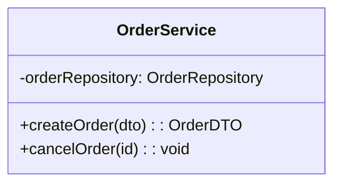
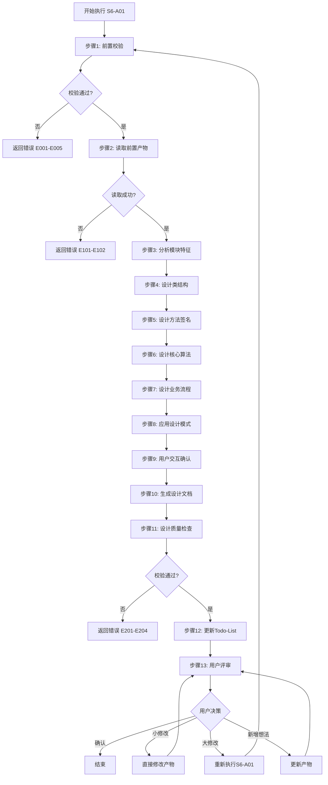
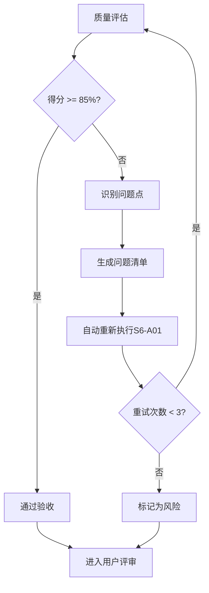

# S6-A01: 模块详细设计

## Section 1: 元信息 (Meta Information)

| 项目 | 内容 |
|------|------|
| **Skill 编号** | S6-A01 |
| **Skill 名称** | 模块详细设计 |
| **Skill 英文名称** | Module Detailed Design |
| **所属阶段** | S6 - 详细设计阶段 |
| **执行顺序** | S6 阶段第 1 个执行 |
| **执行模式** | 自动推导 + 用户交互 |
| **依赖 Skill** | S5-A06 (架构验证与评审) |
| **后置 Skill** | S6-A02 (数据库详细设计) |
| **版本** | v3.2.0 |
| **最后更新时间** | 2026-03-28 |
| **参考标准** | UML 2.5, IEEE 1016, 面向对象设计原则 |

## Contract

| 项目 | 内容 |
|------|------|
| **Skill ID** | S6-A01 |
| **Stage** | S6 |
| **Directory** | skills/s6-module |
| **Depends On** | S5-A06 |
| **Next (Normal)** | S6-A02 |
| **Next (Lightweight)** | S6-A02 |
| **Lightweight Skip** | No |
| **Required Inputs** | artifacts/stages/s5/{PlanID}-S5-A06-001.md |
| **Outputs** | artifacts/stages/s6/{PlanID}-S6-A01-001.md |

***

## Section 2: 功能描述 (Functional Description)

### 2.1 核心职责

S6-A01 负责将架构设计中的模块划分为详细的类设计和方法签名，为开发团队提供可直接指导编码的详细设计文档。主要职责包括：

1. **模块特征分析**：基于架构视图中的模块划分，自动分析每个模块的特征（模块类型、复杂度等级、依赖关系）
2. **类结构设计**：基于领域模型和接口定义自动识别并设计类（实体类、控制器类、服务类、仓储类、DTO类）
3. **类关系设计**：设计类之间的关联、聚合、组合、继承、实现、依赖关系
4. **方法签名设计**：设计符合命名规范的方法签名，包括参数定义、返回值、异常声明
5. **参数验证规则设计**：为每个方法设计完整的参数验证规则
6. **核心算法设计**：识别并设计需要详细设计的核心算法，包括复杂度分析
7. **状态机设计**：为复杂状态流转设计状态机定义
8. **业务流程设计**：使用 Mermaid 绘制业务流程图和时序图
9. **设计模式应用**：基于模块特征自动推荐并应用合适的设计模式
10. **设计质量检查**：自动检查单一职责、开闭原则、依赖倒置、接口隔离、迪米特法则

### 2.2 输入规范 (Input Specifications)

#### 用户/前置 Skill 需要提供什么

**前置产物（必需）**：

| 阶段 | 产物名称 | 产物 ID 示例 | 用途 |
|------|---------|-------------|------|
| S5 | 架构视图设计文档 | `{PlanID}-S5-A02-001` | 获取模块划分、逻辑视图 |
| S5 | 数据架构设计文档 | `{PlanID}-S5-A03-001` | 获取数据实体、数据关系 |
| S5 | 接口架构设计文档 | `{PlanID}-S5-A04-001` | 获取 API 清单、接口规范 |
| S1-S4 | 需求规格说明书 | 需求阶段产物 | 获取详细功能需求、用户故事 |
| S1-S4 | 非功能需求 | 需求阶段产物 | 获取性能、安全、可维护性要求 |

**输入格式**：
- Markdown 报告文件
- 模块划分定义
- 领域模型实体
- API 接口定义
- 性能要求指标

**输入验证规则**：
- 所有前置产物必须存在且状态为 completed
- 架构视图必须包含模块划分信息
- 数据架构必须包含实体定义

#### 输入示例

**前置产物引用示例**：

```
PlanID: P000001
前置产物：
- P000001-S5-A02-001 (架构视图设计文档)
- P000001-S5-A03-001 (数据架构设计文档)
- P000001-S5-A04-001 (接口架构设计文档)
```

### 2.3 输出规范 (Output Specifications)

#### 用户会得到什么

Skill 完成后，系统会生成以下产物并保存到项目目录：

**产物清单**：

| 产物名称 | 文件位置 | 格式 | 用途 | 用户可见性 |
|---------|---------|------|------|-----------|
| 模块详细设计文档 | `artifacts/stages/s6/{PlanID}/{PlanID}-S6-A01-001.md` | Markdown | 类设计、方法签名、算法设计、流程设计完整文档 | 用户可查看 |
| Todo-List 更新 | `artifacts/plans/{PlanID}/todo-list.md` | Markdown | 任务状态更新 | 用户可查看 |

**产物内容结构**：

1. **模块概述**：模块职责、模块划分
2. **类设计**：类图（Mermaid）、类清单、类关系说明
3. **方法设计**：方法签名清单、参数验证规则、异常定义
4. **算法设计**：核心算法伪代码、时间/空间复杂度分析
5. **流程设计**：业务流程图、时序图
6. **设计模式应用**：应用模式说明、模式实现方式
7. **依赖关系**：模块依赖图、外部依赖清单

#### 输出示例

**模块详细设计文档示例结构**：

```markdown
# 模块详细设计 - P000001-S6-A01-001

## 基本信息
- **Plan ID**: P000001
- **Skill ID**: S6-A01
- **执行时间**: 2026-03-28 14:00

## 模块概述

### 模块职责
处理订单业务逻辑

### 模块划分
| 子模块 | 职责 | 关键类 |
|--------|------|--------|
| 订单核心 | 订单生命周期管理 | OrderService, OrderController |

## 类设计

### 类图


### 类清单
| 类名 | 职责 | 属性 | 方法 |
|------|------|------|------|
| OrderService | 处理订单业务逻辑 | orderRepository | createOrder(), cancelOrder() |

## 方法设计

### 方法签名清单
| 方法名 | 所属类 | 参数 | 返回值 | 异常 |
|--------|--------|------|--------|------|
| createOrder | OrderService | dto: CreateOrderDTO | OrderDTO | OrderAlreadyExistsException |
```

## Section 3: 执行流程 (Execution Process)

### 3.1 流程概览



### 3.2 详细步骤说明

详细执行步骤参见 [references/execution-details.md](references/execution-details.md)

### 3.3 Todo-List 更新规则

**更新时机与内容**：

| 执行阶段 | 更新时机 | 更新内容 |
|---------|---------|---------|
| Skill 执行开始 | 步骤 1 完成后 | S6-A01 任务状态：待执行 → 执行中 |
| 用户交互后 | 步骤 9 完成后 | 更新决策记录（如有） |
| Skill 执行完成 | 步骤 12 完成后 | S6-A01 任务状态：执行中 → 已完成，评审状态：待评审 |
| 用户评审后 | 步骤 13 完成后 | 根据评审结果更新状态 |

**用户评审后的状态更新**：

| 评审结果 | 任务状态 | 评审状态 | 断点续跑信息 |
|---------|---------|---------|-------------|
| 确认 | 已评审 | 已通过 | 可恢复=false |
| 小修改 | 执行中 | 需修改 | 可恢复=true |
| 大修改 | 执行中 | 需重做 | 可恢复=true |
| 新增想法 | 执行中 | 需修改 | 可恢复=true |

**详细规则**：详见 [execution-flow-standard.md](../_shared/execution-flow-standard.md) 中的"Todo-List更新规则"章节。

### 3.4 Demo 示例

参见 [references/examples.md](references/examples.md)

## Section 4: 产物规范 (Artifact Specifications)

S6-A01 产物规范遵循 [../_shared/artifact-specifications.md](../_shared/artifact-specifications.md) 中的通用定义。

### 4.1 S6-A01 特定产物清单

| 产物名称 | 产物 ID | 存储路径 | 说明 |
|---------|---------|----------|------|
| 模块详细设计文档 | `{PlanID}-S6-A01-001` | `artifacts/stages/s6/{PlanID}/{PlanID}-S6-A01-001.md` | 主产物，包含类设计、方法签名、算法设计、流程设计 |

### 4.2 依赖关系

**上游依赖**：

| 产物 ID | 来源 Skill | 用途 |
|---------|-----------|------|
| `{PlanID}-S5-A02-001` | S5-A02 架构视图设计 | 获取模块划分、逻辑视图 |
| `{PlanID}-S5-A03-001` | S5-A03 数据架构设计 | 获取数据实体、数据关系 |
| `{PlanID}-S5-A04-001` | S5-A04 接口架构设计 | 获取 API 清单、接口规范 |

**下游消费**：

| 消费 Skill | 消费内容 |
|-----------|----------|
| S6-A02 数据库详细设计 | 传递实体类设计，细化表结构 |
| S6-A03 UI/UX设计 | 传递前端组件设计需求 |

### 4.3 模板引用

**模板文件**：`skills/s6-module/template.md`

**引用方式**：直接引用模板结构，填充实际数据

## Section 5: 质量标准 (Quality Standards)

### 5.1 质量评估框架

S6-A01 遵循 [../_shared/quality-standard.md](../_shared/quality-standard.md) 中的 ISO/IEC 25010 质量评估框架。

**S6-A01 特定权重分配**：

| 维度 | 权重 | 验收阈值 |
|------|------|----------|
| **完整性** | 30% | ≥ 90% |
| **准确性** | 25% | ≥ 90% |
| **一致性** | 20% | ≥ 95% |
| **可读性** | 15% | ≥ 85% |
| **可追溯性** | 10% | ≥ 90% |

**验收门槛**：质量综合得分 ≥ 85%

### 5.2 S6-A01 特定检查清单

**完整性检查**（30%）：

- [ ] 所有模块都有对应的类设计
- [ ] 类属性定义完整（类型、可见性）
- [ ] 方法签名完整（参数、返回值、异常）
- [ ] 核心算法都有伪代码设计
- [ ] 关键业务流程都有流程图

**准确性检查**（25%）：

- [ ] 类职责符合单一职责原则
- [ ] 方法命名符合规范（动词开头）
- [ ] 参数验证规则覆盖所有必填项
- [ ] 算法复杂度分析正确
- [ ] 设计模式应用合理

**一致性检查**（20%）：

- [ ] 类命名符合规范（大驼峰命名）
- [ ] 方法命名风格一致
- [ ] 参数命名风格一致（小驼峰）
- [ ] 类关系表示一致

**可读性检查**（15%）：

- [ ] 类职责描述清晰（单句描述）
- [ ] 方法意图表达清晰
- [ ] 流程图清晰易懂
- [ ] 设计文档结构清晰

**可追溯性检查**（10%）：

- [ ] 类与架构模块的映射关系清晰
- [ ] 与 S5 阶段架构设计的关联明确
- [ ] 设计决策有依据说明

### 5.3 质量综合得分计算

```
得分 = Σ(维度得分 × 维度权重)

示例：
- 完整性：95% × 30% = 28.5
- 准确性：90% × 25% = 22.5
- 一致性：100% × 20% = 20.0
- 可读性：90% × 15% = 13.5
- 可追溯性：95% × 10% = 9.5
- 总分：28.5 + 22.5 + 20.0 + 13.5 + 9.5 = 94.0%
```

### 5.4 验收标准

| 结果 | 标准 | 处理方式 |
|------|------|----------|
| **通过** | 质量综合得分 ≥ 85% | 进入用户评审阶段 |
| **不通过** | 质量综合得分 < 85% | 识别问题 → 生成问题清单 → 自动重新执行 |

### 5.5 不达标处理流程



**重试机制**：
- 第1次：自动重新执行，尝试修复问题
- 第2次：自动重新执行，调整参数
- 第3次：自动重新执行，简化复杂部分
- 仍不达标：标记为风险，进入用户评审并提示问题

## Section 6: 异常处理

### 6.1 常见异常场景

**前置校验失败**（如输入文件不存在）：
- 提示用户先执行前置 Skill
- 或请求补充必要信息

**执行过程异常**（如处理逻辑失败）：
- 自动重试（最多3次）
- 失败后标记风险继续执行

**后置校验失败**（如产物不完整）：
- 重新生成产物
- 或标记为风险进入用户评审

**用户评审未通过**：
- 根据意见修改产物
- 小修改直接编辑，大修改重新执行

### 6.2 本 Skill 特定异常场景

| 异常场景 | 错误代码 | 处理策略 |
|----------|----------|----------|
| 实体类映射失败 | E151 | 请求用户确认类设计 |
| 类命名冲突 | E152 | 自动调整命名，添加前缀/后缀 |
| 方法签名过于复杂 | E153 | 提示拆分方法，遵循单一职责 |
| 设计模式不适用 | E154 | 标记为风险，建议人工评估 |
| 循环依赖检测 | E155 | 提示重构，打破循环依赖 |

### 6.3 恢复策略

| 异常类型 | 处理策略 |
|----------|----------|
| 可重试异常 | 自动重试3次 |
| 数据缺失 | 请求用户补充 |
| 校验失败 | 重新执行或标记风险 |
| 用户拒绝 | 使用默认方案继续 |

### 6.4 用户交互协议

**交互时机**：在步骤 9 触发用户交互，以下场景需要用户确认：

1. **设计模式选择**：当存在多个适用模式时
2. **算法复杂度权衡**：时间复杂度 vs 空间复杂度
3. **依赖注入方式**：构造函数注入 vs 属性注入
4. **异常处理策略**：检查异常 vs 非检查异常

**使用模板**：
- 使用 [user-interaction/clarification-template.md](../_shared/user-interaction/clarification-template.md) 进行信息澄清
- 使用 [user-interaction/option-selection-template.md](../_shared/user-interaction/option-selection-template.md) 进行选项选择

详细流程参见 [execution-flow-standard.md](../_shared/execution-flow-standard.md)

---

**本 Skill 符合面向对象设计规范，遵循 ISO/IEC 25010 质量模型**
