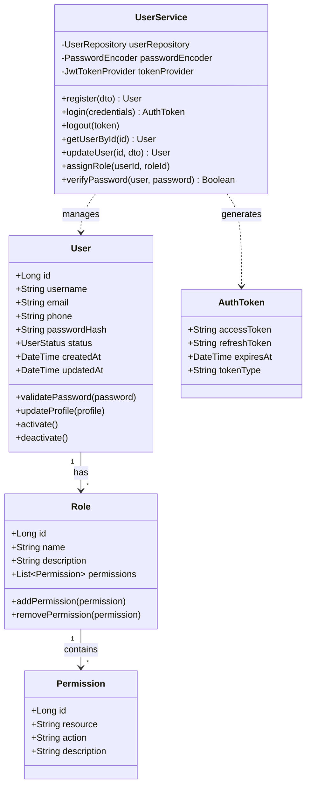
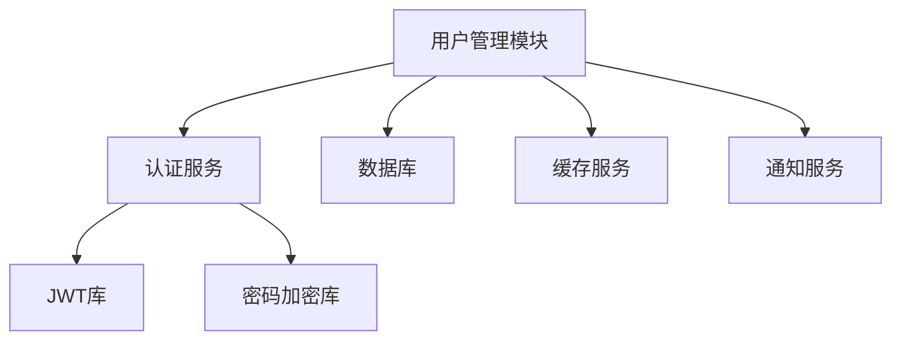
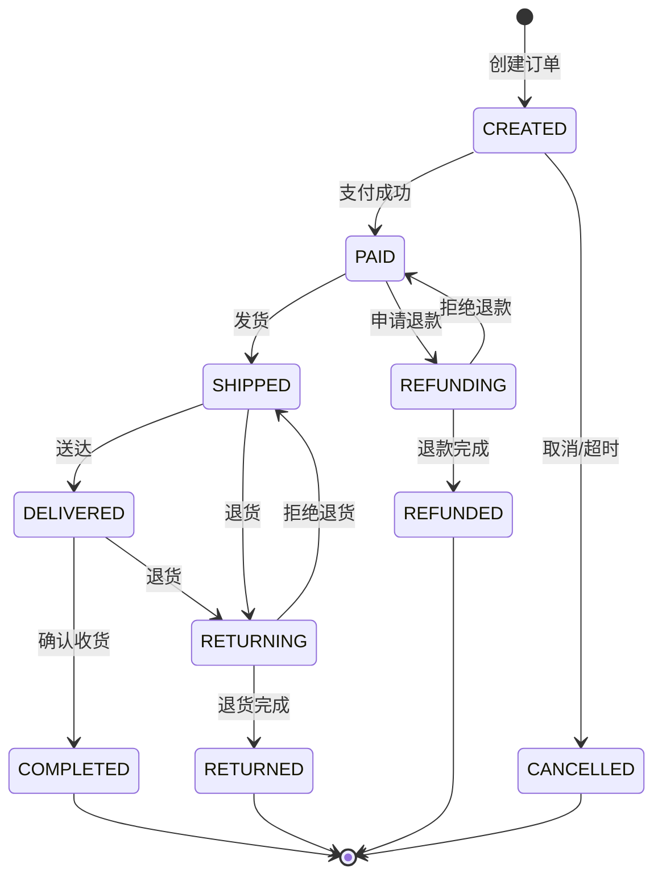
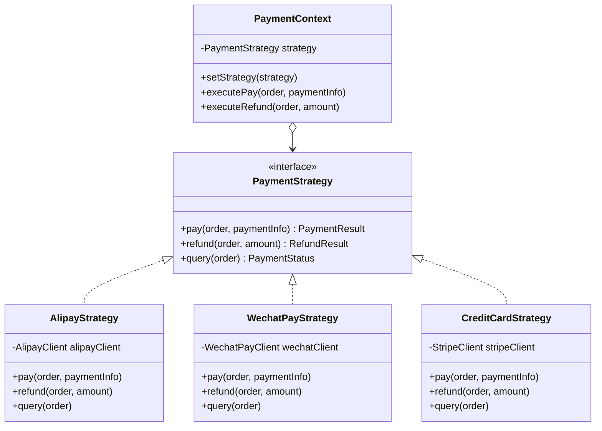
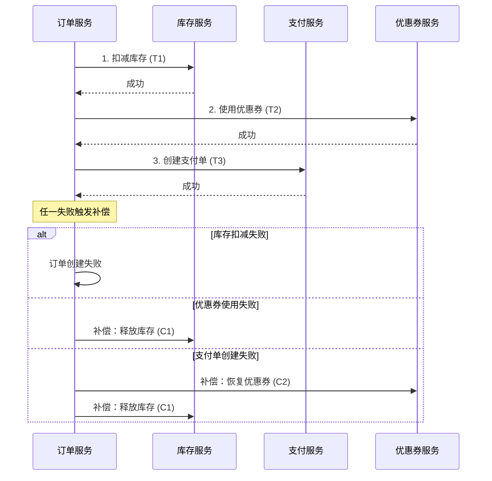

# S6-A01 模块详细设计 - 示例文档

本文档提供模块详细设计 Skill 的执行示例，展示从架构视图到详细模块设计的完整过程。

---

## Demo 1：用户管理模块设计

### 场景描述
为电商平台设计用户管理模块，包括用户注册、登录、权限管理等功能。

### 输入示例

**前置产物：**
- 架构视图（逻辑视图、开发视图）
- 接口定义文档
- 数据模型定义

**需求描述：**
```markdown
## 用户管理模块需求

### 功能需求
1. 用户注册：支持手机号、邮箱注册
2. 用户登录：支持密码登录、短信验证码登录
3. 权限管理：基于角色的访问控制（RBAC）
4. 用户信息管理：头像、昵称、个人资料

### 非功能需求
- 并发支持：10000+ 并发用户
- 响应时间：登录 < 500ms
- 安全性：密码加密存储，防止暴力破解
```

### 处理过程

**步骤 1：模块边界界定**
- 确定用户模块与认证模块、权限模块的边界
- 定义对外暴露的接口
- 结果：模块边界图、接口清单

**步骤 2：类结构设计**
- 识别核心类：User、Role、Permission、UserService
- 定义类关系和继承结构
- 结果：类图（UML）

**步骤 3：方法详细设计**
- 为每个类定义方法签名
- 设计方法参数和返回值
- 结果：方法签名文档

**步骤 4：算法与逻辑设计**
- 设计密码加密算法（bcrypt）
- 设计登录状态管理（JWT Token）
- 结果：算法流程图、伪代码

**步骤 5：依赖与调用关系**
- 定义模块间依赖
- 设计服务调用链
- 结果：依赖关系图

### 输出示例

```markdown
# S6-A01-001 用户管理模块详细设计

## 1. 模块概述

### 1.1 模块职责
用户管理模块负责处理用户全生命周期管理，包括注册、认证、授权和资料管理。

### 1.2 模块边界
- **上游依赖**：认证服务、通知服务
- **下游依赖**：数据库、缓存服务
- **同级模块**：订单模块、商品模块

## 2. 类设计

### 2.1 类图



### 2.2 核心类详细定义

#### User 类

| 属性 | 类型 | 说明 | 约束 |
|------|------|------|------|
| id | Long | 主键 | 自增，唯一 |
| username | String | 用户名 | 3-20字符，唯一 |
| email | String | 邮箱 | 必填，唯一，格式验证 |
| phone | String | 手机号 | 可选，唯一，格式验证 |
| passwordHash | String | 密码哈希 | bcrypt加密，60字符 |
| status | UserStatus | 用户状态 | ACTIVE, INACTIVE, LOCKED |
| createdAt | DateTime | 创建时间 | 自动填充 |
| updatedAt | DateTime | 更新时间 | 自动更新 |

#### 方法签名

**register(RegisterDTO dto): User**
- **参数**：
  - dto.username: String (3-20字符)
  - dto.email: String (有效邮箱格式)
  - dto.phone: String (可选，11位手机号)
  - dto.password: String (8-32字符，含大小写和数字)
- **返回值**：User 对象
- **异常**：
  - DuplicateUserException: 用户名/邮箱已存在
  - InvalidInputException: 输入参数无效
- **算法步骤**：
  1. 验证输入参数格式
  2. 检查用户名/邮箱唯一性
  3. 密码强度验证
  4. 密码加密（bcrypt，cost=12）
  5. 创建用户记录
  6. 发送激活邮件
  7. 返回用户对象（不含密码）

**login(LoginDTO credentials): AuthToken**
- **参数**：
  - credentials.account: String (用户名/邮箱/手机号)
  - credentials.password: String
  - credentials.captcha: String (可选)
- **返回值**：AuthToken 对象
- **异常**：
  - AuthenticationException: 认证失败
  - AccountLockedException: 账户已锁定
- **算法步骤**：
  1. 根据 account 查询用户
  2. 检查账户状态
  3. 验证登录频率（防暴力破解）
  4. 验证密码
  5. 生成 JWT Token（access + refresh）
  6. 记录登录日志
  7. 返回 Token

## 3. 算法设计

### 3.1 密码加密算法

**算法**：bcrypt (cost factor = 12)

```
FUNCTION hashPassword(plainPassword):
    salt = generateRandomSalt(16 bytes)
    cost = 12
    hash = bcrypt(plainPassword, salt, cost)
    RETURN hash

FUNCTION verifyPassword(plainPassword, storedHash):
    RETURN bcrypt_verify(plainPassword, storedHash)
```

**安全考虑**：
- 使用自适应哈希，可随计算能力提升调整 cost
- 自动包含 salt，防止彩虹表攻击
- 单次哈希耗时约 250ms，有效防御暴力破解

### 3.2 JWT Token 生成算法

**Token 结构**：
- Header: { "alg": "HS256", "typ": "JWT" }
- Payload: { "sub": userId, "roles": [...], "iat": ..., "exp": ... }
- Signature: HMACSHA256(base64Url(header) + "." + base64Url(payload), secret)

**算法步骤**：
1. 构造 Header JSON，Base64Url 编码
2. 构造 Payload JSON（含过期时间），Base64Url 编码
3. 使用 HS256 算法和密钥生成签名
4. 组合成 "header.payload.signature" 格式

## 4. 接口实现

### 4.1 REST API 实现

| 端点 | 方法 | 功能 | 权限 |
|------|------|------|------|
| /api/v1/users | POST | 用户注册 | 公开 |
| /api/v1/auth/login | POST | 用户登录 | 公开 |
| /api/v1/auth/logout | POST | 用户登出 | 需认证 |
| /api/v1/users/{id} | GET | 获取用户信息 | 需认证 |
| /api/v1/users/{id} | PUT | 更新用户信息 | 本人或管理员 |
| /api/v1/users/{id}/roles | POST | 分配角色 | 管理员 |

### 4.2 内部服务接口

```java
public interface UserService {
    User register(RegisterDTO dto);
    AuthToken login(LoginDTO credentials);
    void logout(String token);
    User getUserById(Long id);
    User updateUser(Long id, UpdateUserDTO dto);
    void assignRole(Long userId, Long roleId);
    boolean verifyPassword(User user, String password);
}
```

## 5. 依赖关系

### 5.1 模块依赖图



### 5.2 外部依赖清单

| 依赖 | 版本 | 用途 |
|------|------|------|
| Spring Security | 6.x | 安全框架 |
| jjwt | 0.12.x | JWT 处理 |
| bcrypt | - | 密码加密 |
| Redis | 7.x | 会话缓存 |
```

---

## Demo 2：订单处理模块设计

### 场景描述
设计电商平台的订单处理模块，包含订单状态管理、支付集成、库存扣减等复杂业务流程。

### 输入示例

**前置产物：**
- 架构视图（逻辑视图、过程视图）
- 订单领域模型
- 支付接口定义

**需求描述：**
```markdown
## 订单处理模块需求

### 功能需求
1. 订单创建：从购物车生成订单
2. 订单支付：集成多种支付方式
3. 订单状态管理：待支付、已支付、已发货、已完成、已取消
4. 库存管理：下单扣减、取消释放
5. 订单拆分：多商家订单拆分

### 非功能需求
- 事务一致性：订单与库存强一致性
- 幂等性：重复支付防护
- 性能：下单 QPS > 1000
```

### 处理过程

**步骤 1：状态机设计**
- 定义订单状态流转规则
- 识别状态转换触发条件
- 结果：状态机图、状态转换表

**步骤 2：策略模式应用**
- 识别变化点：支付方式、优惠策略
- 设计策略接口和实现类
- 结果：策略类图

**步骤 3：事务设计**
- 设计分布式事务方案（Saga模式）
- 定义补偿操作
- 结果：事务流程图

**步骤 4：并发控制**
- 设计库存扣减策略（乐观锁）
- 设计幂等性保障机制
- 结果：并发控制方案

### 输出示例

```markdown
# S6-A01-002 订单处理模块详细设计

## 1. 模块概述

订单处理模块是电商系统的核心，负责订单全生命周期管理，包括创建、支付、履约和售后。

## 2. 状态机设计

### 2.1 订单状态机图



### 2.2 状态转换规则

| 当前状态 | 目标状态 | 触发条件 | 业务规则 |
|----------|----------|----------|----------|
| CREATED | PAID | 支付成功回调 | 金额匹配，未超时 |
| CREATED | CANCELLED | 用户取消/30分钟超时 | 未支付 |
| PAID | SHIPPED | 商家发货 | 库存已扣减 |
| PAID | REFUNDING | 用户申请退款 | 未发货 |
| SHIPPED | DELIVERED | 物流签收 | 自动或手动确认 |

### 2.3 状态机实现

```java
@Component
public class OrderStateMachine {

    private final Map~OrderStatus, Set~OrderStatus~~ transitions = new HashMap~();

    @PostConstruct
    public void init() {
        transitions.put(CREATED, Set.of(PAID, CANCELLED));
        transitions.put(PAID, Set.of(SHIPPED, REFUNDING));
        transitions.put(SHIPPED, Set.of(DELIVERED, RETURNING));
        transitions.put(DELIVERED, Set.of(COMPLETED, RETURNING));
        transitions.put(REFUNDING, Set.of(REFUNDED, PAID));
        transitions.put(RETURNING, Set.of(RETURNED, SHIPPED));
    }

    public boolean canTransition(OrderStatus from, OrderStatus to) {
        return transitions.getOrDefault(from, Set.of()).contains(to);
    }

    public void transition(Order order, OrderStatus to, TransitionContext context) {
        if (!canTransition(order.getStatus(), to)) {
            throw new InvalidStateTransitionException(order.getStatus(), to);
        }

        // 执行状态转换前的校验
        validateTransition(order, to, context);

        // 执行状态转换
        OrderStatus from = order.getStatus();
        order.setStatus(to);

        // 发布状态变更事件
        eventPublisher.publish(new OrderStatusChangedEvent(order.getId(), from, to));
    }
}
```

## 3. 策略模式应用

### 3.1 支付策略设计



### 3.2 支付策略实现

```java
public interface PaymentStrategy {
    PaymentResult pay(Order order, PaymentInfo paymentInfo);
    RefundResult refund(Order order, BigDecimal amount);
    PaymentStatus query(Order order);
    PaymentType getType();
}

@Component
public class AlipayStrategy implements PaymentStrategy {

    @Autowired
    private AlipayClient alipayClient;

    @Override
    public PaymentResult pay(Order order, PaymentInfo paymentInfo) {
        // 构建支付宝请求
        AlipayTradePagePayRequest request = new AlipayTradePagePayRequest();
        request.setBizContent(buildBizContent(order));

        try {
            AlipayTradePagePayResponse response = alipayClient.pageExecute(request);
            if (response.isSuccess()) {
                return PaymentResult.success(response.getTradeNo(), response.getBody());
            }
            return PaymentResult.failure(response.getMsg());
        } catch (AlipayApiException e) {
            return PaymentResult.failure(e.getMessage());
        }
    }

    @Override
    public PaymentType getType() {
        return PaymentType.ALIPAY;
    }
}

@Component
public class PaymentStrategyFactory {

    private final Map~PaymentType, PaymentStrategy~ strategies = new EnumMap~(PaymentType.class);

    @Autowired
    public PaymentStrategyFactory(List~PaymentStrategy~ strategyList) {
        for (PaymentStrategy strategy : strategyList) {
            strategies.put(strategy.getType(), strategy);
        }
    }

    public PaymentStrategy getStrategy(PaymentType type) {
        PaymentStrategy strategy = strategies.get(type);
        if (strategy == null) {
            throw new UnsupportedPaymentTypeException(type);
        }
        return strategy;
    }
}
```

## 4. 分布式事务设计（Saga模式）

### 4.1 下单流程 Saga



### 4.2 Saga 实现

```java
@Component
public class CreateOrderSaga {

    @Autowired
    private InventoryService inventoryService;
    @Autowired
    private CouponService couponService;
    @Autowired
    private PaymentService paymentService;

    public SagaResult execute(CreateOrderRequest request) {
        SagaContext context = new SagaContext();

        try {
            // T1: 扣减库存
            InventoryDeductionResult inventoryResult = inventoryService.deduct(
                request.getItems()
            );
            context.addStep("deductInventory", inventoryResult,
                () -> inventoryService.release(inventoryResult.getLockId()));

            // T2: 使用优惠券
            if (request.getCouponId() != null) {
                CouponUsageResult couponResult = couponService.useCoupon(
                    request.getUserId(),
                    request.getCouponId()
                );
                context.addStep("useCoupon", couponResult,
                    () -> couponService.restoreCoupon(couponResult.getUsageId()));
            }

            // T3: 创建支付单
            PaymentOrderResult paymentResult = paymentService.createPaymentOrder(
                context.getOrderId(),
                request.getTotalAmount()
            );
            context.addStep("createPayment", paymentResult,
                () -> paymentService.cancelPaymentOrder(paymentResult.getPaymentId()));

            return SagaResult.success(context.getOrderId());

        } catch (Exception e) {
            // 执行补偿
            context.compensate();
            return SagaResult.failure(e.getMessage());
        }
    }
}
```

## 5. 并发控制设计

### 5.1 库存扣减（乐观锁）

```java
@Repository
public class InventoryRepository {

    private static final String DEDUCT_SQL =
        "UPDATE inventory " +
        "SET quantity = quantity - ?, version = version + 1 " +
        "WHERE sku_id = ? AND quantity >= ? AND version = ?";

    public boolean deductWithOptimisticLock(String skuId, int quantity, int version) {
        int updated = jdbcTemplate.update(DEDUCT_SQL,
            quantity, skuId, quantity, version);
        return updated > 0;
    }
}

@Service
public class InventoryService {

    @Retryable(value = OptimisticLockException.class, maxAttempts = 3)
    public InventoryDeductionResult deduct(List~OrderItem~ items) {
        for (OrderItem item : items) {
            Inventory inventory = inventoryRepository.findBySkuId(item.getSkuId());

            boolean success = inventoryRepository.deductWithOptimisticLock(
                item.getSkuId(),
                item.getQuantity(),
                inventory.getVersion()
            );

            if (!success) {
                throw new InsufficientInventoryException(item.getSkuId());
            }
        }
        return new InventoryDeductionResult(lockId);
    }
}
```

### 5.2 幂等性保障

```java
@Component
public class IdempotencyGuard {

    @Autowired
    private RedisTemplate~String, String~ redisTemplate;

    private static final String IDEMPOTENCY_KEY_PREFIX = "idempotency:";
    private static final long EXPIRE_HOURS = 24;

    public boolean checkAndMark(String idempotencyKey) {
        String key = IDEMPOTENCY_KEY_PREFIX + idempotencyKey;

        Boolean success = redisTemplate.opsForValue()
            .setIfAbsent(key, "processing", EXPIRE_HOURS, TimeUnit.HOURS);

        return Boolean.TRUE.equals(success);
    }

    public void markCompleted(String idempotencyKey, String result) {
        String key = IDEMPOTENCY_KEY_PREFIX + idempotencyKey;
        redisTemplate.opsForValue().set(key, result, EXPIRE_HOURS, TimeUnit.HOURS);
    }

    public String getResult(String idempotencyKey) {
        String key = IDEMPOTENCY_KEY_PREFIX + idempotencyKey;
        return redisTemplate.opsForValue().get(key);
    }
}

// 使用示例
@Service
public class OrderService {

    public PaymentResult processPayment(String idempotencyKey, PaymentRequest request) {
        // 1. 检查幂等性
        String cachedResult = idempotencyGuard.getResult(idempotencyKey);
        if (cachedResult != null) {
            if ("processing".equals(cachedResult)) {
                throw new PaymentInProgressException();
            }
            return PaymentResult.fromJson(cachedResult);
        }

        // 2. 标记处理中
        if (!idempotencyGuard.checkAndMark(idempotencyKey)) {
            throw new DuplicateRequestException();
        }

        try {
            // 3. 执行业务逻辑
            PaymentResult result = paymentStrategy.pay(request);

            // 4. 标记完成
            idempotencyGuard.markCompleted(idempotencyKey, result.toJson());
            return result;

        } catch (Exception e) {
            // 清除标记，允许重试
            idempotencyGuard.clear(idempotencyKey);
            throw e;
        }
    }
}
```

## 6. 模块接口定义

### 6.1 对外接口

```java
public interface OrderService {
    // 订单创建
    Order createOrder(CreateOrderRequest request);

    // 订单支付
    PaymentResult payOrder(Long orderId, PaymentRequest request);

    // 订单查询
    Order getOrder(Long orderId);
    List~Order~ getUserOrders(Long userId, PageParam page);

    // 订单取消
    void cancelOrder(Long orderId, CancelReason reason);

    // 订单状态流转
    void shipOrder(Long orderId, ShipmentInfo shipment);
    void confirmDelivery(Long orderId);
    void applyRefund(Long orderId, RefundRequest request);
}
```

### 6.2 事件定义

```java
public class OrderEvents {

    public record OrderCreatedEvent(
        Long orderId,
        Long userId,
        BigDecimal amount,
        LocalDateTime createdAt
    ) {}

    public record OrderPaidEvent(
        Long orderId,
        String paymentNo,
        BigDecimal paidAmount,
        LocalDateTime paidAt
    ) {}

    public record OrderStatusChangedEvent(
        Long orderId,
        OrderStatus from,
        OrderStatus to,
        LocalDateTime changedAt
    ) {}
}
```
```

---

## 总结

以上两个示例展示了模块详细设计的完整过程：

1. **用户管理模块**：侧重类设计、方法签名、基础算法
2. **订单处理模块**：侧重状态机、设计模式、分布式事务、并发控制

每个示例都包含：
- 完整的输入/输出示例
- UML 类图和流程图
- 详细的算法设计
- 代码级别的实现指导
